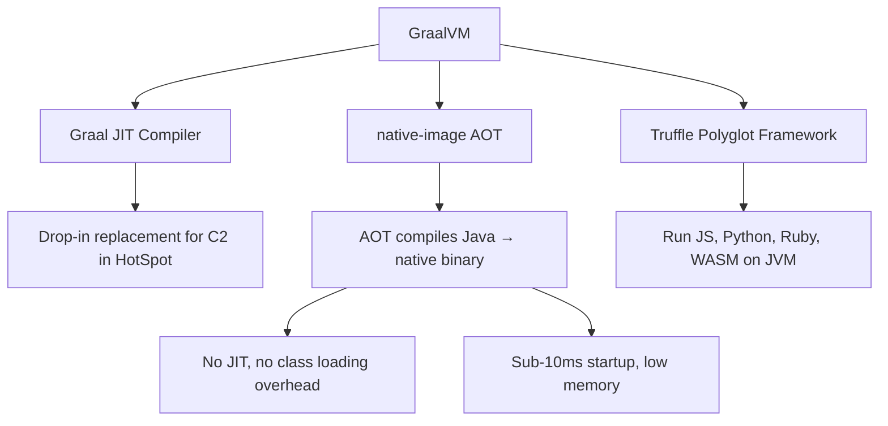
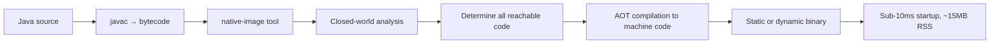
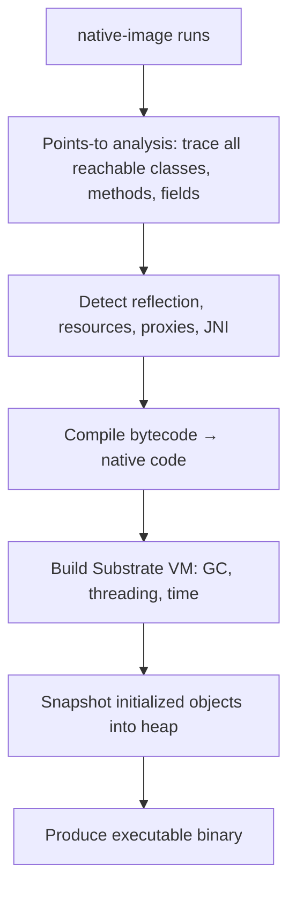

# GraalVM: Native Image and AOT

> [!summary] Goal
> Understand GraalVM as a JVM technology: AOT compilation with native-image, differences from the standard HotSpot JVM, configuration for reflection/serialization/proxies, and polyglot capabilities.

## Table of Contents

1. [What is GraalVM](#what-is-graalvm)
2. [GraalVM Components](#graalvm-components)
3. [Installing GraalVM](#installing-graalvm)
4. [Native Image AOT Compilation](#native-image-aot-compilation)
5. [HotSpot vs GraalVM JIT vs Native Image](#hotspot-vs-graalvm-jit-vs-native-image)
6. [Configuring Native Image](#configuring-native-image)
7. [native-image CLI Reference](#native-image-cli-reference)
8. [Limitations and Compatibility](#limitations-and-compatibility)
9. [Polyglot with Truffle](#polyglot-with-truffle)
10. [Debugging Native Images](#debugging-native-images)
11. [Pitfalls](#pitfalls)

---

## What is GraalVM

GraalVM is a high-performance JDK distribution that supports AOT (Ahead-of-Time) compilation via `native-image` and polyglot execution via the Truffle framework.



> [!tip] Definition
> **GraalVM**: a JDK distribution that replaces the C2 JIT compiler with the Graal JIT compiler and adds the `native-image` tool for AOT compilation to standalone executables.

---

## GraalVM Components

### Graal JIT Compiler

Replaces the HotSpot C2 (Server) compiler. Used when running Java in the standard JIT mode on GraalVM:

```bash
# Run with Graal JIT compiler (default on GraalVM JDK)
java -XX:+UseJVMCICompiler -jar app.jar
```

**When to use**: Existing Java applications — drop-in replacement, can improve peak performance by 10-50% for some workloads.

### native-image Tool

Compiles Java bytecode ahead-of-time to a native executable:

```bash
native-image -jar app.jar -H:Name=myapp
./myapp
```

**When to use**: New applications where instant startup and low memory matter — serverless, CLI tools, containers.

### Truffle Framework (Polyglot)

Runs languages like JavaScript, Python, Ruby on the JVM:

```java
import org.graalvm.polyglot.*;

Context ctx = Context.create("js");
Value result = ctx.eval("js", "1 + 2");
System.out.println(result.asInt()); // 3
```

### GraalVM Distributions

| Distribution | License | Features |
|-------------|---------|----------|
| **Oracle GraalVM** | GraalVM Free Terms (GFTC) | Latest optimizations, native-image, polyglot |
| **GraalVM Community Edition** | GPL 2.0 | Open source, slightly slower peak perf |
| **Liberica Native Image Kit** | GPL 2.0 + commercial | BellSoft distribution, includes native-image |

---

## Installing GraalVM

```bash
# Via SDKMAN (recommended)
sdk install java 22-graal
sdk use java 22-graal

# Verify
java -version
# openjdk version "22" 2025-03-18
# GraalVM CE 22.0.0 (Build 22+36-jvmci-...)

# Install native-image
gu install native-image

# Verify
native-image --version
```

### Manual installation

```bash
# Download from https://www.graalvm.org/downloads/
tar -xzf graalvm-jdk-22_linux-x64_bin.tar.gz
sudo mv graalvm-jdk-22 /usr/lib/jvm/graalvm-22
export JAVA_HOME=/usr/lib/jvm/graalvm-22
export PATH=$JAVA_HOME/bin:$PATH
```

---

## Native Image AOT Compilation

### How it works



The `native-image` tool performs:

1. **Closed-world analysis** — traces all reachable code starting from the main method
2. **AOT compilation** — compiles bytecode to native machine code at build time
3. **Substrate VM initialization** — builds a minimal runtime (GC, threading) into the binary
4. **Image heap snapshot** — takes a snapshot of initialized objects to restore at startup



---

## HotSpot vs GraalVM JIT vs Native Image

| Aspect | HotSpot JVM | GraalVM JIT | GraalVM Native Image |
|--------|------------|-------------|---------------------|
| **Startup time** | 1-5 seconds (class loading + JIT warmup) | 1-5 seconds | **<10ms** |
| **Peak throughput** | Baseline | 10-50% faster | 10-30% slower (no JIT for hot paths) |
| **Memory (RSS)** | 100-200MB (JVM + heap) | 100-200MB | **15-40MB** |
| **Build time** | Instant (compilation) | Instant | 2-10 minutes |
| **Class loading** | Lazy, dynamic | Lazy, dynamic | **Static — all classes known at build time** |
| **Reflection** | Full, any time | Full, any time | **Only pre-registered** |
| **Dynamic proxy** | Any time | Any time | **Only pre-registered** |
| **Serialization** | Full | Full | **Requires config** |
| **Heap dump / JFR** | ✅ Full | ✅ Full | ❌ Not available |
| **JMX** | ✅ Full | ✅ Full | ❌ Not available |
| **Java agents** | ✅ Full | ✅ Full | ❌ At build time only |
| **GC options** | G1, ZGC, Shenandoah, Parallel | G1, ZGC, Shenandoah, Parallel | Serial GC only (limited GC selection) |
| **Platform portability** | Any with JRE | Any with GraalVM JDK | **Platform-specific binary** |
| **Image size** | ~200MB (JRE + app) | ~200MB | **~15-50MB** |

---

## Configuring Native Image

Native image needs explicit configuration for reflection, resources, serialization, and dynamic proxies.

### Configuration via Tracing Agent

Run the app on a standard JVM with the tracing agent to capture all config:

```bash
java -agentlib:native-image-agent=config-output-dir=src/main/resources/META-INF/native-image/ \
  -jar app.jar
# Exercise all code paths (all endpoints, all features)
# Then stop the app — config files are generated
```

Generated files:

```
META-INF/native-image/
├── reflect-config.json      -- Reflection registration
├── resource-config.json     -- Resource bundles, classpath resources
├── serialization-config.json -- Serialization registration
├── proxy-config.json        -- Dynamic proxy interfaces
└── jni-config.json          -- JNI method/field access
```

### Manual Configuration

```json
// reflect-config.json
[
  {
    "name": "com.example.MyEntity",
    "methods": [
      { "name": "getId", "parameterTypes": [] },
      { "name": "setId", "parameterTypes": ["long"] }
    ],
    "fields": [
      { "name": "id" },
      { "name": "name" }
    ],
    "allDeclaredConstructors": true
  }
]
```

```json
// resource-config.json
{
  "resources": [
    { "pattern": "\\QMETA-INF/services/\\E.*" },
    { "pattern": "\\Qmessages.properties\\E" }
  ]
}
```

### Configuration via Java Annotations (Spring Boot style)

```java
import org.springframework.aot.hint.annotation.Reflective;

@Reflective
public class MyEntity {
    private long id;
    private String name;
}
```

---

## `native-image` CLI Reference

```bash
# Basic image building
native-image -jar app.jar                          # Build from JAR
native-image -jar app.jar -H:Name=myapp            # Custom output name
native-image -jar app.jar --no-fallback            # Fail if full VM needed
native-image -jar app.jar --static --libc=musl     # Fully static binary

# Configuration
native-image -jar app.jar \
  -H:ReflectionConfigurationFiles=my-reflect.json \
  -H:ResourceConfigurationFiles=my-resources.json \
  --initialize-at-build-time=com.example.MyClass \
  --initialize-at-run-time=com.example.LazyClass \
  -H:IncludeResources=".*\\.properties" \
  -H:Log=registerResource:+

# Performance
native-image -jar app.jar \
  -O2                                   # Optimization level (0-3)
  --gc=G1                               # Use G1 GC (instead of serial)
  -march=compatibility                  # x86-64 baseline
  -march=native                         # Optimize for current CPU

# Debugging
native-image -jar app.jar \
  --debug                               # Include debug symbols
  -H:+GenerateDebugInfo                 # GDB/LLDB support
  -H:+DumpTargetInfo                    # Dump compilation info

# Build time control
native-image -jar app.jar \
  -J-Xmx8g                              # JVM memory for the build
  --parallelism=4                        # Builder threads
```

---

## Limitations and Compatibility

```mermaid
flowchart TD
    A[Does your app use...] --> B{Dynamic class loading?}
    B -->|Class.forName, URLClassLoader| C[**LIKELY INCOMPATIBLE**]
    B -->|No| D{Unlimited reflection?}
    D -->|Third-party libs with unknown reflection| C
    D -->|Limited, annotated| E[Needs config]
    D -->|No reflection| F{Serialization?}
    F -->|Java serialization (ObjectInputStream)| G[Needs serialization config]
    F -->|JSON/Protobuf| H{Proxies?}
    H -->|JDK dynamic proxies| I[Needs proxy config]
    H -->|No proxies| J[**LIKELY COMPATIBLE**]
    G --> J
    E --> J
    I --> J
```

### What works

| Feature | Compatibility | Notes |
|---------|--------------|-------|
| Core Java (collections, streams, concurrency) | ✅ Full | Tested with GraalVM native |
| HTTP networking (java.net, Apache, OkHttp) | ✅ Full | |
| Logging (SLF4J, Logback, Log4J) | ✅ Full | |
| JSON (Jackson, Gson) | ✅ With config | Jackson works with serialization hints |
| JPA/Hibernate | ✅ With config | Needs reflection + proxy + serialization config |
| Security (Bouncy Castle) | ⚠️ Limited | JCA with Bouncy Castle needs registration |

### What has limitations

| Feature | Issue | Workaround |
|---------|-------|------------|
| `Class.forName(name)` | Name not statically known | Use `@RegisterReflectionForBinding` or tracing agent |
| `Thread.setDefaultUncaughtExceptionHandler` | Not supported | Use try-catch at main |
| `java.beans.*` | Heavily reflection-based | Avoid |
| `InvocationHandler` / dynamic proxies | Need explicit registration | Trace with agent |
| `MethodHandle` / `VarHandle` | Mostly works | Some edge cases fail |
| JMX / JFR / heap dumps | Not available | Use process-level monitoring (Prometheus, Grafana) |
| `-agentlib:` / `-javaagent:` | Not supported at runtime | Apply transforms at build time |

---

## Polyglot with Truffle

Run multiple languages on GraalVM:

```java
import org.graalvm.polyglot.*;

public class PolyglotExample {
    public static void main(String[] args) {
        try (Context ctx = Context.create("js", "python")) {
            // JavaScript
            Value jsResult = ctx.eval("js", "`Hello from JS! 2+2 = ${2+2}`");
            System.out.println(jsResult.asString());

            // Python
            ctx.eval("python", "import sys; print('Python version:', sys.version)");

            // Interop: call JS from Python
            ctx.eval("python", "import polyglot; print('JS says:', polyglot.eval(language='js', string='1+1'))");
        }
    }
}
```

```bash
# Run polyglot script directly
js --polyglot script.js      # JavaScript with Python/Java interop
python --polyglot script.py  # Python with JS/Java interop
```

---

## Debugging Native Images

```bash
# Build with debug symbols
native-image -jar app.jar --debug -H:+GenerateDebugInfo

# Debug with GDB
gdb ./myapp
(gdb) break com.example.MyClass.main
(gdb) run

# Check what's included in the image
native-image --verbose -jar app.jar 2>&1 | grep "\[analysis\]"

# List features included
native-image --features=...

# Build report
native-image -jar app.jar -H:+BuildReport
# Generates build-report.html
```

---

## Pitfalls

### Reflection not configured

```bash
native-image -jar app.jar
# At runtime: java.lang.ClassNotFoundException: com.example.MyEntity
```

**Fix**: Run with tracing agent (`-agentlib:native-image-agent=...`) and exercise all code paths. Copy generated config to `META-INF/native-image/`.

### Serialization without config

```bash
# At runtime: java.io.InvalidClassException: No valid class found
```

**Fix**: Add serialization config to `serialization-config.json` via tracing agent.

### Build-time memory exhaustion

```bash
native-image -jar app.jar
# Fatal error: java.lang.OutOfMemoryError: Java heap space
```

**Fix**: Increase JVM memory for the build: `native-image -J-Xmx8g -jar app.jar`.

### Proxy-based frameworks

Spring Data JPA repositories, Hibernate lazy loading, and `@Configuration` classes rely on proxying:

**Fix**: Ensure the tracing agent runs with full app coverage. Annotate repository interfaces with `@RegisterReflectionForBinding` if needed.

### Platform-specific binary

A native-image built on Linux x64 runs ONLY on Linux x64 — not on macOS, Windows, or ARM.

**Fix**: Use Docker build with multi-stage builds targeting the deployment platform. Use `--static` + musl for fully static cross-platform binaries.

---

> [!question]- Interview Questions
>
> **Q: What is GraalVM and what are its three main capabilities?**
> A: GraalVM is a JDK distribution with three capabilities: 1) Graal JIT compiler (drop-in replacement for HotSpot C2), 2) native-image tool (AOT compilation to native binary), 3) Truffle framework (polyglot execution of JS, Python, Ruby on the JVM).
>
> **Q: What is the difference between GraalVM JIT and native-image?**
> A: JIT mode runs Java on the GraalVM JDK with the Graal JIT compiler — no config needed, same behavior as HotSpot. native-image AOT compiles bytecode to a native binary with instant startup and lower memory but requires configuration for reflection, serialization, and proxies.
>
> **Q: What is the closed-world assumption in native-image?**
> A: native-image assumes all reachable code is known at build time. It traces from the main method through all code paths. Dynamic features like `Class.forName`, reflection, serialization, and proxies must be pre-registered.
>
> **Q: How do you configure reflection for native-image?**
> A: Run the app with `-agentlib:native-image-agent=config-output-dir=...` and exercise all code paths. The agent generates `reflect-config.json`, `resource-config.json`, and other config files that native-image uses.

---

## Cross-Links

- [[Java/03_Advanced/04_Garbage_Collectors_G1_ZGC_Shenandoah]] for GC comparison with native-image
- [[Java/03_Advanced/03_JVM_Tooling_JFR_JStack_JMap]] for JVM tooling that is unavailable in native-image
- [[Java/01_Foundations/05_Modern_Java_Language_Features]] for Java features compatible with AOT
- [[SpringBoot/02_Core/04_Building_Native_Images_with_GraalVM]] for Spring Boot native support

---

## References

- [GraalVM Documentation](https://www.graalvm.org/latest/docs/)
- [GraalVM Native Image](https://www.graalvm.org/latest/docs/reference-manual/native-image/)
- [Native Image Configuration](https://www.graalvm.org/latest/docs/reference-manual/native-image/overview/Configuration/)
- [GraalVM Polyglot](https://www.graalvm.org/latest/docs/reference-manual/polyglot-programming/)
- [GraalVM GitHub](https://github.com/oracle/graal)
