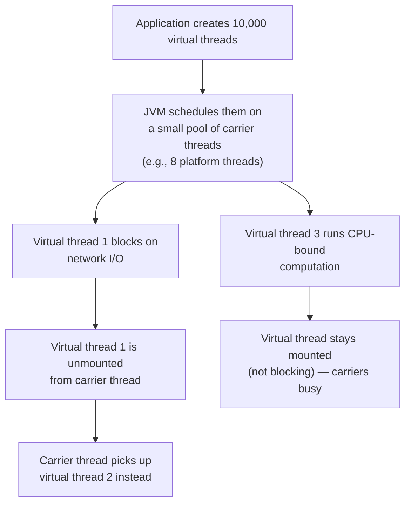
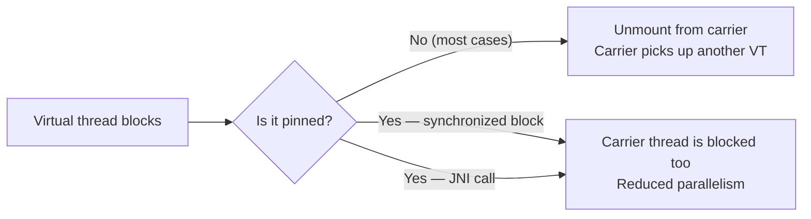

# Virtual Threads and Structured Concurrency

> [!summary] Goal
> Master Java 21's virtual threads (Project Loom): create millions of threads, understand when they help vs hurt, use structured concurrency for deterministic task management, and work with scoped values as an alternative to thread-local variables.

## Table of Contents

1. [Platform vs Virtual Threads](#platform-vs-virtual-threads)
2. [Creating Virtual Threads](#creating-virtual-threads)
3. [Pinning and Blocking](#pinning-and-blocking)
4. [Structured Concurrency](#structured-concurrency)
5. [Scoped Values](#scoped-values)
6. [Pitfalls](#pitfalls)

---

## Platform vs Virtual Threads

> [!info] Virtual threads
> Virtual threads are lightweight threads managed by the JVM (not the OS). They multiplex onto a small pool of OS/platform threads (carrier threads). When a virtual thread blocks (e.g., on I/O, `Future.get()`, `BlockingQueue.take()`), it is unmounted from the carrier thread — freeing the carrier to run other virtual threads. This allows millions of virtual threads where you'd have thousands of platform threads.



| Aspect | Platform thread (`Thread`) | Virtual thread (`Thread.ofVirtual()`) |
|--------|:--------------------------:|:-------------------------------------:|
| **Managed by** | OS kernel | JVM (user-mode scheduling) |
| **Creation cost** | ~1 MB stack, expensive (~1ms) | ~few KB stack, cheap (~1μs) |
| **Max count** | Thousands | Millions |
| **Context switch** | Kernel mode (expensive) | User mode (fast) |
| **Blocking behavior** | Blocks the OS thread | "Mounts" — carrier thread is freed |
| **Best for** | CPU-bound, long-lived | I/O-bound, many concurrent tasks |
| **Introduced** | Java 1.0 | Java 21 (preview in 19-20) |

---

## Creating Virtual Threads

```java
// Java 21+
import java.util.concurrent.*;

// Method 1: Thread.ofVirtual()
Thread vt = Thread.ofVirtual()
    .name("my-vt")
    .unstarted(() -> System.out.println("Hello from virtual thread"));
vt.start();
vt.join();

// Method 2: Start directly
Thread vt = Thread.startVirtualThread(() -> {
    System.out.println("Hello from " + Thread.currentThread());
});

// Method 3: Executors.newVirtualThreadPerTaskExecutor()
try (var executor = Executors.newVirtualThreadPerTaskExecutor()) {
    Future<?> future = executor.submit(() -> System.out.println("Task"));
    future.get();
}

// Method 4: StructuredTaskScope (structured concurrency)
try (var scope = new StructuredTaskScope.ShutdownOnFailure()) {
    Future<String> task1 = scope.fork(() -> fetchData("url1"));
    Future<String> task2 = scope.fork(() -> fetchData("url2"));
    scope.join();                 // Wait for all
    scope.throwIfFailed();        // Throw if any failed
    String result = task1.resultNow() + task2.resultNow();
}
```

### Scaling example — millions of threads

```java
// Before virtual threads: 10,000 platform threads would be impossible
try (var executor = Executors.newFixedThreadPool(1000)) {
    // Common workaround: thread pool
}

// With virtual threads: one thread per task, no pool needed
try (var executor = Executors.newVirtualThreadPerTaskExecutor()) {
    IntStream.range(0, 100_000).forEach(i -> {
        executor.submit(() -> {
            // Each task gets its own virtual thread
            var response = HttpClient.newHttpClient()
                .send(request, BodyHandlers.ofString());
            return response.body();
        });
    });
}
```

---

## Pinning and Blocking

> [!info] Pinning
> A virtual thread is "pinned" to its carrier thread when it cannot be unmounted. While pinned, blocking the virtual thread also blocks the carrier thread. Pinning reduces the benefits of virtual threads. It happens during `synchronized` blocks/methods and native method calls (JNI).



### Avoiding pinning

```java
// ❌ Pinning: synchronized blocks
public synchronized String getData() {    // Pins the virtual thread!
    return fetchFromDb();
}

// ✅ No pinning: ReentrantLock instead
private final Lock lock = new ReentrantLock();

public String getData() {
    lock.lock();
    try {
        return fetchFromDb();
    } finally {
        lock.unlock();
    }
}

// ✅ No pinning: use java.util.concurrent primitives
// Semaphore, CountDownLatch, BlockingQueue — all safe with virtual threads
```

---

## Structured Concurrency

> [!info] Structured concurrency
> Structured concurrency treats groups of related tasks as a single unit of work. If a task scope fails or is cancelled, all spawned subtasks are cancelled. This prevents thread/ task leaks and ensures deterministic error handling. Implemented as `StructuredTaskScope` in Java 21+.

```java
// Unstructured: tasks may outlive the caller
public Response handle() throws Exception {
    var future1 = executor.submit(() -> fetchA());
    var future2 = executor.submit(() -> fetchB());
    return new Response(future1.get(), future2.get());  // If future1 throws, future2 may still run
}

// Structured: all tasks complete before the scope closes
public Response handle() throws Exception {
    try (var scope = new StructuredTaskScope.ShutdownOnFailure()) {
        Subtask<String> task1 = scope.fork(() -> fetchA());
        Subtask<String> task2 = scope.fork(() -> fetchB());
        
        scope.join();                // Wait for all tasks
        scope.throwIfFailed();       // If any failed, throw
        
        return new Response(task1.get(), task2.get());
    }  // All tasks are guaranteed to be done here
}
```

### StructuredTaskScope strategies

| Strategy | Behavior | Use case |
|----------|----------|----------|
| **`ShutdownOnFailure`** | Cancel all tasks if one fails | Composite response (all parts needed) |
| **`ShutdownOnSuccess`** | Cancel all tasks if one succeeds | Race (first successful result wins) |
| **Custom** | Override `handleComplete()` | Complex orchestration |

---

## Scoped Values

> [!info] Scoped values
> `ScopedValue` is an alternative to `ThreadLocal` that works with virtual threads. Unlike `ThreadLocal` (which has mutable state and high overhead with virtual threads), scoped values are immutable once bound and are inherited by subtasks. They're also faster (no `ThreadLocalMap` lookup).

```java
// ScopedValue declaration
public static final ScopedValue<User> CURRENT_USER = ScopedValue.newInstance();

// Bind a value for a scope — value is available in this thread and all subtasks
ScopedValue.where(CURRENT_USER, loggedInUser).run(() -> {
    // Inside this runnable, CURRENT_USER.get() returns loggedInUser
    handleRequest();  // All subtasks see the same CURRENT_USER
});

// Read the value
void handleRequest() {
    User user = CURRENT_USER.get();   // No need to pass through parameters
    // Subtasks (forked virtual threads) also see this value
}
```

### ScopedValue vs ThreadLocal

| Aspect | ThreadLocal | ScopedValue |
|--------|:-----------:|:-----------:|
| **Mutability** | Mutable (set/remove) | Immutable (bound once per scope) |
| **Inheritance** | `InheritableThreadLocal` (expensive) | Automatically inherited by subtasks |
| **Virtual threads** | High overhead (rehashing) | Efficient (immutable, no map) |
| **Use case** | Legacy per-thread context | Modern request-scoped context |
| **Introduced** | Java 1.2 | Java 21 (preview in 20) |

---

## Pitfalls

### Using synchronized blocks in hot paths with virtual threads

`synchronized` blocks pin the virtual thread. In high-throughput services, this can exhaust the carrier thread pool. Replace `synchronized` with `ReentrantLock` or `java.util.concurrent` primitives for code that will run on virtual threads.

### ThreadLocal and virtual threads

`ThreadLocal` is inherited by virtual threads but can be expensive (the virtual thread pool reuses carrier threads, causing ThreadLocalMap churn). Migrate to `ScopedValue` where possible, or avoid creating new virtual threads per request if using ThreadLocal heavily.

### Pooling virtual threads

Don't pool virtual threads. The whole point is that they're cheap enough to create per task. `Executors.newCachedThreadPool()` for platform threads is bad; `Executors.newVirtualThreadPerTaskExecutor()` is correct. Pooling adds unnecessary complexity and defeats the lightweight nature.

### CPU-bound tasks on virtual threads

Virtual threads provide no benefit for CPU-bound tasks — they don't block (so they can't yield to other VTs). A CPU-bound virtual thread occupies a carrier thread permanently. Use platform threads (in a pool sized to available processors) for CPU-heavy work.

---

> [!question]- Interview Questions
>
> **Q: What is the difference between platform threads and virtual threads?**
> A: Platform threads are OS-managed, have ~1 MB stacks, and are expensive to create (thousands max). Virtual threads are JVM-managed, have ~few KB stacks, and millions can exist. When a virtual thread blocks on I/O, it's unmounted from its carrier thread (freeing the carrier for other work), while a blocking platform thread blocks the OS thread.
>
> **Q: What causes a virtual thread to be pinned?**
> A: Pinning occurs when a virtual thread can't be unmounted from its carrier. This happens inside `synchronized` blocks/methods and during JNI calls. While pinned, blocking the virtual thread also blocks the carrier. Replace `synchronized` with `ReentrantLock` to avoid pinning.
>
> **Q: What is structured concurrency?**
> A: Structured concurrency groups related tasks so they share the same lifecycle. If a parent scope is cancelled or fails, all subtasks are cancelled. This prevents task leaks and ensures deterministic error handling. Implemented via `StructuredTaskScope` in Java 21. Use `ShutdownOnFailure` when all results are needed, `ShutdownOnSuccess` for racing.
>
> **Q: How do scoped values differ from thread-local variables?**
> A: Scoped values are immutable once bound (no set/remove), automatically inherited by subtasks, and efficient with virtual threads. ThreadLocals are mutable, have high overhead with virtual threads (carrier thread reuse causes remapping), and don't compose well with structured concurrency.
>
> **Q: When should you NOT use virtual threads?**
> A: (1) CPU-bound tasks — they don't block, so they occupy a carrier permanently. (2) Tasks with heavy `synchronized` usage — pinning reduces parallelism. (3) High-frequency ThreadLocal writes — carrier thread churn causes map rebuilds. (4) When you need priority or fairness scheduling — VTs are FIFO per carrier.

---

## Cross-Links

- [[Java/02_Core/01_Concurrency_Threads_and_Executors]] for platform threads and traditional concurrency
- [[Java/03_Advanced/01_CompletableFuture_and_Structured_Concurrency]] for async composition
- [[Java/03_Advanced/02_JMM_Volatile_and_Locks]] for ReentrantLock and synchronization
- [[Java/03_Advanced/09_Reflection_and_Annotations]] for ScopedValue usage in frameworks
- [[Java/04_Playbooks/03_Debug_Concurrency_Issues]] for debugging virtual thread issues
