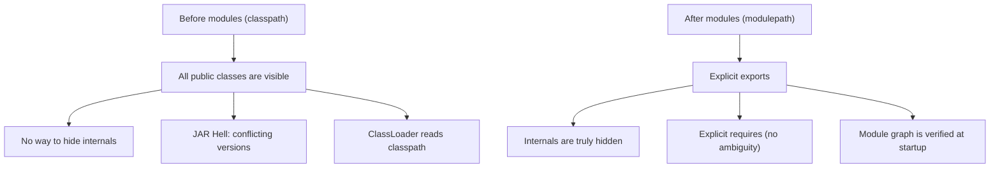

# Module System (JPMS)

> [!summary] Goal
> Understand Java Platform Module System (Project Jigsaw). Create `module-info.java`, control visibility of packages, use services for loose coupling, and migrate existing applications to use modules.

## Table of Contents

1. [Why Modules?](#why-modules)
2. [module-info.java](#module-info-java)
3. [Services](#services)
4. [Module Types](#module-types)
5. [Migration Strategies](#migration-strategies)
6. [Pitfalls](#pitfalls)

---

## Why Modules?

> [!info] Module
> A Java module is a named, self-describing collection of code and data. It explicitly declares what it exports (packages available to other modules) and what it requires (dependencies). Before modules, all public classes were globally accessible — there was no encapsulation at the JAR level. JPMS solves this with reliable configuration and strong encapsulation.



| Before modules (classpath) | After modules (modulepath) |
|---------------------------|---------------------------|
| Any public class is accessible | Only exported packages are accessible |
| JAR A version 1 and JAR A version 2 can conflict silently | Module graph resolves at startup (no split packages) |
| `Class.forName()` can load anything | Reflection requires explicit `opens` |
| Internal packages like `sun.misc` accessible | Internal packages are encapsulated |

---

## module-info.java

```java
// src/main/java/module-info.java
module com.example.myapp {
    // Dependencies
    requires java.sql;                       // Access to java.sql module
    requires transitive java.logging;        // Consumers also get java.logging
    requires static java.compiler;           // Optional — only at compile time
    
    // Exports — make packages available to other modules
    exports com.example.myapp.api;           // Public API for consumers
    exports com.example.myapp.spi;
    
    // Qualified exports — only to specific modules
    exports com.example.myapp.internal to    // Only these modules can access
        com.example.admin;
    
    // Opens — allow reflection (needed by frameworks)
    opens com.example.myapp.model;            // Reflection access for serialization
    opens com.example.myapp.config to         // Opens only to testing module
        com.example.myapp.test;
    
    // Services
    provides com.example.spi.Plugin
        with com.example.myapp.JsonPlugin;
    uses com.example.spi.Plugin;
}
```

### module-info directives

| Directive | What it does | Example |
|-----------|-------------|---------|
| `requires` | Module depends on another module | `requires java.sql` |
| `requires transitive` | Dependency is inherited by consumers | `requires transitive java.logging` |
| `requires static` | Optional at runtime (compile only) | `requires static java.compiler` |
| `exports` | Makes a package accessible | `exports com.example.api` |
| `exports ... to` | Exports only to specific modules | `exports com.example.internal to com.example.test` |
| `opens` | Allows full reflection on a package | `opens com.example.model` |
| `opens ... to` | Reflection only to specific modules | `opens com.example.secret to com.example.test` |
| `provides ... with` | Registers a service implementation | `provides Plugin with JsonPlugin` |
| `uses` | Consumes a service (loadable via ServiceLoader) | `uses Plugin` |

---

## Services

> [!info] Service
> JPMS services implement the **Service Locator** pattern with compile-time verification. A module declares `provides X with Y` (service provider) or `uses X` (service consumer). Instances are loaded via `ServiceLoader`, with no reflection needed.

```java
// SPI module — defines the service interface
// src/main/java/module-info.java (spi module)
module com.example.spi {
    exports com.example.spi;
}

package com.example.spi;
public interface Plugin {
    void execute(String input);
}

// Provider module — implements the service
// src/main/java/module-info.java (provider module)
module com.example.jsonplugin {
    requires com.example.spi;
    provides com.example.spi.Plugin
        with com.example.jsonplugin.JsonPlugin;
}

package com.example.jsonplugin;
public class JsonPlugin implements Plugin {
    @Override public void execute(String input) {
        System.out.println("JSON: " + input);
    }
}

// Consumer module — uses the service
// src/main/java/module-info.java (consumer module)
module com.example.app {
    uses com.example.spi.Plugin;
}

// Loading services (no reflection, no configuration)
import java.util.ServiceLoader;

ServiceLoader<Plugin> plugins = ServiceLoader.load(Plugin.class);
for (Plugin p : plugins) {
    p.execute("test");
}
```

---

## Module Types

| Type | Has `module-info.java`? | Behavior |
|:----:|:-----------------------:|----------|
| **Named module** | ✅ Yes | Explicit exports/requires; strong encapsulation |
| **Automatic module** | ❌ No (JAR on module path) | Implicitly exports all packages; name derived from JAR filename |
| **Unnamed module** | ❌ No (classpath) | All packages accessible; can't access named module internals |

### Classpath vs module path

```bash
# Classpath — everything is in the unnamed module
java -cp lib/*:classes com.example.Main

# Module path — modules enforce encapsulation
# Automatic modules from lib, named modules from classes
java --module-path lib:classes --module com.example.myapp/com.example.Main

# Add packages to the unnamed module (migration workaround)
java --add-exports java.base/sun.security.provider=ALL-UNNAMED Main
```

---

## Migration Strategies

### Step 1: module-path without module-info

Place existing JARs on the module path rather than the classpath. They become **automatic modules** — they work like modules but export everything. This surfaces any module path issues without changing code.

```bash
java --module-path lib:classes -cp other.jar Main
```

### Step 2: Create module-info.java for your code

```java
module com.example.myapp {
    // Start minimal: just what you need
    requires java.sql;
    requires spring.boot;
    
    exports com.example.myapp.api;
}
```

### Step 3: Handle common issues

```bash
# "package X is not visible" → add exports or opens
# Add explicit exports to your module-info

# Reflection errors → add opens
opens com.example.myapp.model;

# Split package (same package in multiple modules) → reorganize

# Use jdeps to analyze dependencies
jdeps -summary --module-path lib myapp.jar
```

### Quick reference for migration flags

```bash
# Common migration flags
--add-exports java.base/sun.security.provider=ALL-UNNAMED
--add-opens java.base/java.lang=ALL-UNNAMED
--add-reads com.example.module=java.base
--add-modules java.xml.bind
--illegal-access=deny    # Java 16+ default — makes illegal access fail
```

---

## Pitfalls

### Split packages

The same package cannot exist in two modules on the module path. This is common when merging libraries (e.g., different versions of the same library expose the same package). Fix: rename packages or use module path shading.

### Reflection without opens

Frameworks (Spring, Hibernate, Jackson) rely on reflection for serialization, DI, and ORM. Without `opens`, `setAccessible(true)` throws `InaccessibleObjectException`. Each framework-accessed package needs `opens com.example.model;` or a more permissive `--add-opens` flag.

### ServiceLoader not finding implementations

If `provides` is declared in a module that's not on the module path, `ServiceLoader` silently ignores it. Ensure the provider module is on the module path. Use `ServiceLoader.load(Plugin.class).stream().toList()` for debugging.

### Automatic module name extraction

The module name for JARs without `module-info.java` is derived from the JAR filename (META-INF/MANIFEST.MF `Automatic-Module-Name` attribute, or filename). A JAR named `my-lib-1.2.3.jar` becomes module `my.lib`. Inconsistent naming can cause `requires` to fail.

---

> [!question]- Interview Questions
>
> **Q: What problems does the Java module system solve?**
> A: (1) Strong encapsulation — internal packages (like `sun.misc`) are no longer accessible. (2) Reliable configuration — the module graph is verified at startup; no more classpath ambiguity (JAR hell). (3) Explicit dependencies — `requires` makes dependencies clear. (4) Scalable — the JRE itself is modularized (`java.base` is smaller).
>
> **Q: What is the difference between `exports` and `opens` in module-info.java?**
> A: `exports` makes a package accessible at **compile time and runtime** for direct access (import). `opens` makes a package accessible only at **runtime** via reflection (`setAccessible(true)`). Use `exports` for your public API. Use `opens` for packages that need reflection (JPA entities, serialized DTOs, DI beans).
>
> **Q: How does the ServiceLoader work with modules?**
> A: A provider module declares `provides com.example.spi.Plugin with com.example.jsonplugin.JsonPlugin` in its `module-info.java`. Consumer modules declare `uses com.example.spi.Plugin`. `ServiceLoader.load(Plugin.class)` discovers implementations via the module system — no reflection, no configuration files.
>
> **Q: What is an automatic module?**
> A: A JAR placed on the module path without a `module-info.java` becomes an automatic module. It implicitly exports all packages and reads all other automatic modules. The module name comes from `Automatic-Module-Name` in MANIFEST.MF or the JAR filename. Automatic modules bridge the gap between the classpath world and the module path world during migration.
>
> **Q: How do you migrate a classpath application to Java modules?**
> A: Step 1: Move JARs to module path (they become automatic modules). Step 2: Add `module-info.java` to your own code, initially with minimal exports. Step 3: Use `jdeps` to analyze dependencies and resolve split packages. Step 4: Replace `--add-opens` flags with proper `opens` declarations. Step 5: Remove migration flags gradually.

---

## Cross-Links

- [[Java/03_Advanced/07_Pattern_Matching_and_Sealed_Classes]] for sealed classes across modules
- [[Java/03_Advanced/09_Reflection_and_Annotations]] for reflection accessibility in modules
- [[Java/01_Foundations/06_Build_Tools_Maven_Gradle]] for Maven/Gradle modular builds
- [[Java/03_Advanced/10_Foreign_Function_and_Memory_API]] for FFI in modules
- [[Java/03_Advanced/05_GraalVM_Native_Image_and_AOT]] for native-image with modules
