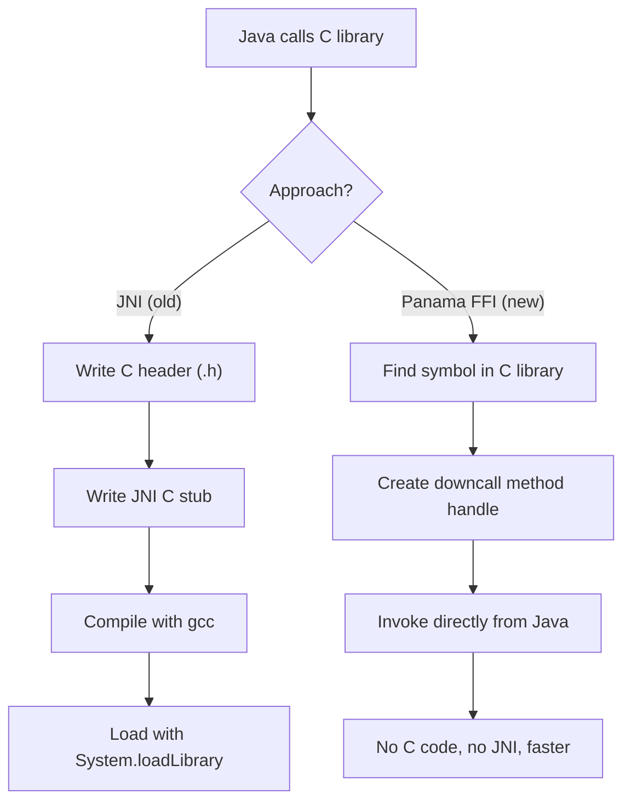

# Foreign Function and Memory API (Project Panama)

> [!summary] Goal
> Call C libraries and manage off-heap memory using the Foreign Function & Memory API (Project Panama). Replace JNI with type-safe, high-performance foreign access. Understand `MemorySegment`, `MemoryLayout`, `Linker`, and `SymbolLookup`.

## Table of Contents

1. [Why Panama?](#why-panama)
2. [MemorySegment and MemoryLayout](#memorysegment-and-memorylayout)
3. [Linker and SymbolLookup](#linker-and-symbollookup)
4. [Calling C Functions](#calling-c-functions)
5. [Calling Java from C (Upcalls)](#calling-java-from-c)
6. [Pitfalls](#pitfalls)

---

## Why Panama?

> [!info] Foreign Function & Memory API
> Project Panama provides a `Java API to replace JNI` for calling native code and managing off-heap memory. It provides: (1) type-safe method handles for C function calls, (2) `MemorySegment` for safe off-heap memory management, (3) `MemoryLayout` for structured data access. It's faster than JNI and doesn't require writing C glue code.



| Aspect | JNI | Panama FFI |
|--------|:---:|:----------:|
| **C glue code** | ✅ Required (header + implementation) | ❌ None — invoke directly |
| **Type safety** | ❌ Manual type matching | ✅ MethodType verification |
| **Memory safety** | ❌ Can corrupt native heap | ✅ MemorySegment bounds-checked |
| **Performance** | Good (after warmup) | Better (no JNI transition) |
| **Setup time** | Days (C compilation, header generation) | Minutes (pure Java) |
| **Foreign memory** | NIO ByteBuffer (limited) | MemorySegment (rich API) |
| **Availability** | Since Java 1.0 | Preview in Java 22, final in 22+ |

---

## MemorySegment and MemoryLayout

> [!info] MemorySegment
> `MemorySegment` is a contiguous region of off-heap memory with spatial and temporal bounds. It can be allocated natively (not subject to GC), from a file mapping, or from existing on-heap arrays. It's the replacement for `ByteBuffer` and `sun.misc.Unsafe` for off-heap operations.

```java
import java.lang.foreign.*;
import java.lang.invoke.VarHandle;

// Allocate off-heap memory (not GC-managed)
MemorySegment segment = Arena.ofAuto().allocate(100);  // 100 bytes

// Write and read bytes
segment.set(ValueLayout.JAVA_BYTE, 0, (byte) 42);
byte val = segment.get(ValueLayout.JAVA_BYTE, 0);

// Work with integers
segment.set(ValueLayout.JAVA_INT, 0, 12345);
int i = segment.get(ValueLayout.JAVA_INT, 0);

// Copy data in/out
MemorySegment source = Arena.ofAuto().allocateFrom("Hello, Panama!");
byte[] bytes = source.toArray(ValueLayout.JAVA_BYTE);

// Arena manages lifecycle — memory freed when arena is closed
```

### Arena lifecycle

```java
// Confined arena — not thread-safe, freed when closed
try (Arena arena = Arena.ofConfined()) {
    MemorySegment segment = arena.allocate(100);
    // use segment...
} // segment is freed here

// Shared arena — thread-safe
try (Arena arena = Arena.ofShared()) {
    MemorySegment segment = arena.allocate(100);
    // safe for multiple threads
}

// Automatic arena — freed by GC (convenient, but unpredictable timing)
Arena arena = Arena.ofAuto();
MemorySegment segment = arena.allocate(100);
// memory freed when `segment` becomes unreachable
```

### Structured data with MemoryLayout

```java
// Define C struct layout: struct Point { int x; int y; };
StructLayout POINT_LAYOUT = MemoryLayout.structLayout(
    ValueLayout.JAVA_INT.withName("x"),
    ValueLayout.JAVA_INT.withName("y")
);

// Allocate and access
MemorySegment point = Arena.ofAuto().allocate(POINT_LAYOUT);
VarHandle xHandle = POINT_LAYOUT.varHandle(MemoryLayout.PathElement.groupElement("x"));
VarHandle yHandle = POINT_LAYOUT.varHandle(MemoryLayout.PathElement.groupElement("y"));

xHandle.set(point, 0, 10);        // point.x = 10
yHandle.set(point, 0, 20);        // point.y = 20

// Read back
int x = (int) xHandle.get(point, 0);  // 10
int y = (int) yHandle.get(point, 0);  // 20

// Nested structs
StructLayout PERSON_LAYOUT = MemoryLayout.structLayout(
    ValueLayout.ADDRESS.withName("name"),    // char* pointer
    POINT_LAYOUT.withName("location"),
    ValueLayout.JAVA_INT.withName("age")
);
```

---

## Linker and SymbolLookup

> [!info] Linker
> The `Linker` interface provides method handles for native functions. `Linker.nativeLinker()` returns the platform linker (Linux, Windows, macOS). `SymbolLookup.loaderLookup()` finds symbols in loaded libraries. Together they let you call C functions without JNI.

```java
import java.lang.foreign.*;
import java.lang.invoke.MethodHandle;
import java.lang.invoke.MethodType;

// Get the native linker
Linker linker = Linker.nativeLinker();
SymbolLookup libc = linker.defaultLookup();

// Find a C function
SymbolLookup stdlib = SymbolLookup.loaderLookup();    // your loaded library
```

---

## Calling C Functions

### Calling printf

```java
// Find printf in the C standard library
Linker linker = Linker.nativeLinker();
SymbolLookup stdlib = linker.defaultLookup();

MethodHandle printf = linker.downcallHandle(
    stdlib.find("printf").orElseThrow(),
    FunctionDescriptor.of(ValueLayout.JAVA_INT, ValueLayout.ADDRESS)
);

// Prepare the format string as a memory segment
String format = "Hello from Panama! %d\n";
MemorySegment fmtStr = Arena.ofAuto().allocateFrom(format, java.nio.charset.StandardCharsets.UTF_8);

// Call printf (returns int — number of characters printed)
try {
    int result = (int) printf.invoke(fmtStr, 42);
    System.out.println("Printed " + result + " characters");
} catch (Throwable e) {
    e.printStackTrace();
}
```

### Calling a C function with struct parameters

```c
// C header: double distance(struct Point p1, struct Point p2);
// struct Point { int x; int y; };
```

```java
// Define the Point struct layout
StructLayout POINT = MemoryLayout.structLayout(
    ValueLayout.JAVA_INT.withName("x"),
    ValueLayout.JAVA_INT.withName("y")
);

// Find the function
MethodHandle distance = linker.downcallHandle(
    stdlib.find("distance").orElseThrow(),
    FunctionDescriptor.of(ValueLayout.JAVA_DOUBLE, POINT, POINT)
);

// Prepare arguments
MemorySegment p1 = Arena.ofAuto().allocate(POINT);
p1.set(ValueLayout.JAVA_INT, 0, 3);      // x = 3
p1.set(ValueLayout.JAVA_INT, 4, 4);      // y = 4

MemorySegment p2 = Arena.ofAuto().allocate(POINT);
p2.set(ValueLayout.JAVA_INT, 0, 0);      // x = 0
p2.set(ValueLayout.JAVA_INT, 4, 0);      // y = 0

// Call the function
try {
    double dist = (double) distance.invoke(p1, p2);
    System.out.println("Distance: " + dist);  // 5.0
} catch (Throwable e) {
    e.printStackTrace();
}
```

---

## Calling Java from C (Upcalls)

```java
// C code needs to call back into Java — upcall

// Define a callback interface
@FunctionalInterface
interface Callback {
    void apply(int value);
}

// Create an upcall stub
MethodHandle callbackHandle = MethodHandles.lookup().findVirtual(
    Callback.class, "apply",
    MethodType.methodType(void.class, int.class)
);

Callback myCallback = value -> System.out.println("C called Java: " + value);

MemorySegment upcallStub = linker.upcallStub(
    callbackHandle.bindTo(myCallback),
    FunctionDescriptor.ofVoid(ValueLayout.JAVA_INT),
    Arena.ofAuto()
);

// Pass the stub to C (C receives a function pointer)
```

---

## Pitfalls

### Memory leaks from unclosed arenas

Native memory allocated with `Arena.ofConfined()` is freed when the arena is closed. If you forget to close the arena (or wrap in try-with-resources), you leak native memory — it's not subject to GC. Always use try-with-resources for arenas.

### Lifetime management of MemorySegment

A `MemorySegment` must outlive any native code that holds a pointer into it. If the segment is freed (arena closed) while C code is still using it, you get a dangling pointer — crash or corruption in native code.

### Alignment requirements

Native structs may have alignment requirements that differ from Java's. Use `MemoryLayout.withBitAlignment()` or use `ValueLayout.JAVA_INT_UNALIGNED` for unaligned access (slower but correct).

### Type mismatches in downcall handles

The `FunctionDescriptor` must exactly match the C function signature. An `int` in C is `ValueLayout.JAVA_INT` (4 bytes). A `long` is `ValueLayout.JAVA_LONG` (8 bytes). A pointer (char*) is `ValueLayout.ADDRESS` (8 bytes on 64-bit). Wrong types cause data corruption or crashes.

---

> [!question]- Interview Questions
>
> **Q: How does Project Panama replace JNI?**
> A: Panama provides `Linker.downcallHandle()` to create a method handle for a C function directly from Java. You find the symbol (function name) in a loaded library, define the parameter types and return type with `FunctionDescriptor`, and invoke it like a Java MethodHandle. No C glue code, no C compilation, no JNI_OnLoad. The linker handles platform calling conventions automatically.
>
> **Q: What is a MemorySegment?**
> A: `MemorySegment` is a Java API for accessing off-heap memory safely. It provides spatial bounds (can't access beyond the segment) and temporal bounds (the arena lifecycle prevents use-after-free). It replaces `ByteBuffer` and `sun.misc.Unsafe` for off-heap operations. Segments can be native (allocated by arena), mapped (from files), or wrapped (around existing arrays).
>
> **Q: What is an Arena in the FFI API?**
> A: `Arena` manages the lifecycle of memory segments. A `ConfinedArena` is single-threaded and releases all memory when closed (fastest). `SharedArena` is thread-safe. `Arena.ofAuto()` creates segments freed by GC (convenient but unpredictable timing). Always prefer confined arenas in try-with-resources for deterministic memory management.
>
> **Q: How do you call a C function that takes a struct?**
> A: Define the C struct layout with `MemoryLayout.structLayout(...)`, declaring the type and name of each field. Allocate a `MemorySegment` of that layout. Set field values using segment.set(ValueLayout.JAVA_INT, offset, value). Pass the segment to the downcall method handle. The linker passes the struct pointer to C following the platform's calling convention.
>
> **Q: What is the performance advantage of Panama over JNI?**
> A: Panama eliminates the JNI transition overhead. JNI requires: (1) finding the native function (dlsym), (2) marshaling arguments to C types, (3) the JNI call itself. Panama uses `MethodHandle` infrastructure that the JVM can inline and optimize. Memory operations on `MemorySegment` use `VarHandle` — the fastest way to access off-heap data. For memory-intensive workloads, Panama can be 2-5× faster than JNI.

---

## Cross-Links

- [[Java/03_Advanced/05_GraalVM_Native_Image_and_AOT]] for native-image FFI support
- [[Java/03_Advanced/09_Reflection_and_Annotations]] for MethodHandle fundamentals
- [[Java/03_Advanced/08_Module_System_JPMS]] for opens in FFI contexts
- [[Java/02_Core/03_IO_NIO_and_Serialization]] for NIO ByteBuffer vs MemorySegment
- [[C/03_Advanced/07_Inline_Assembly_ABI_and_Calling_Conventions]] for calling conventions
