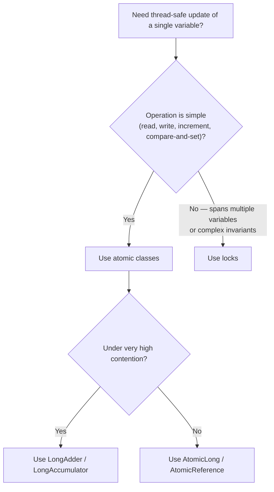
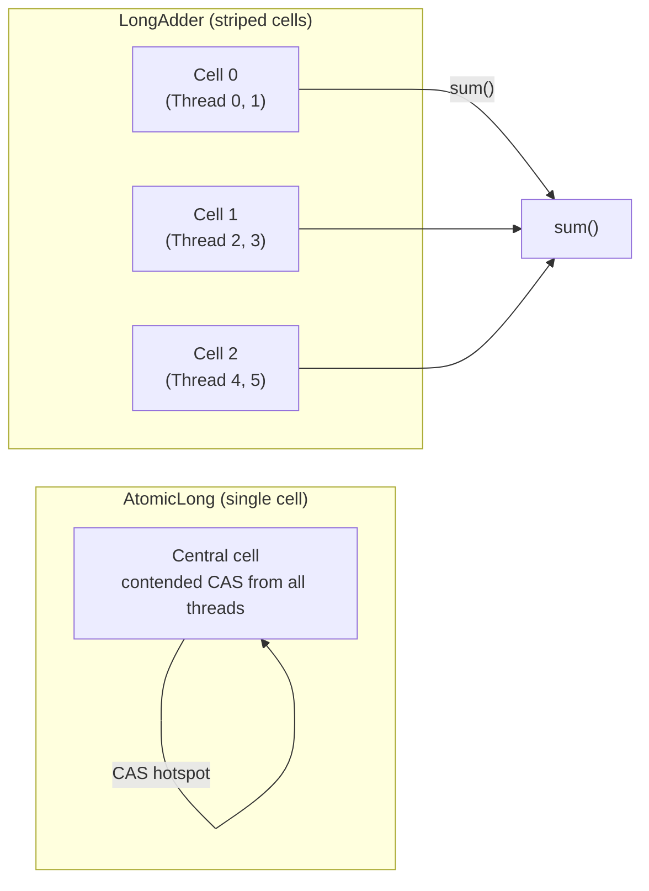
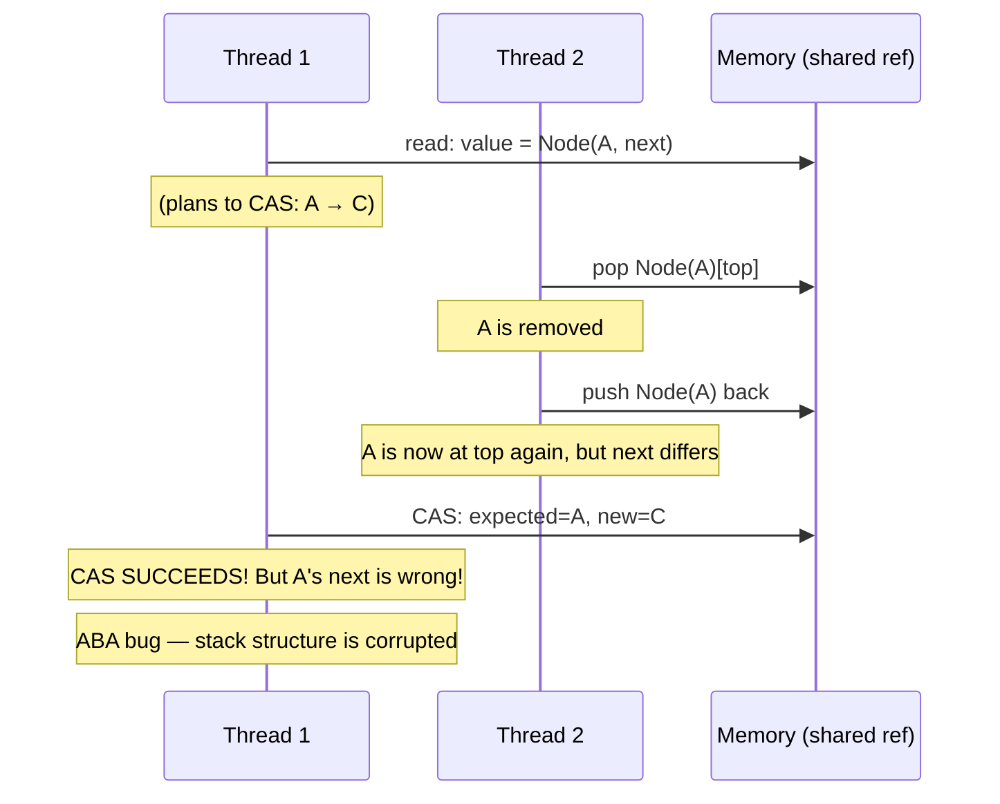
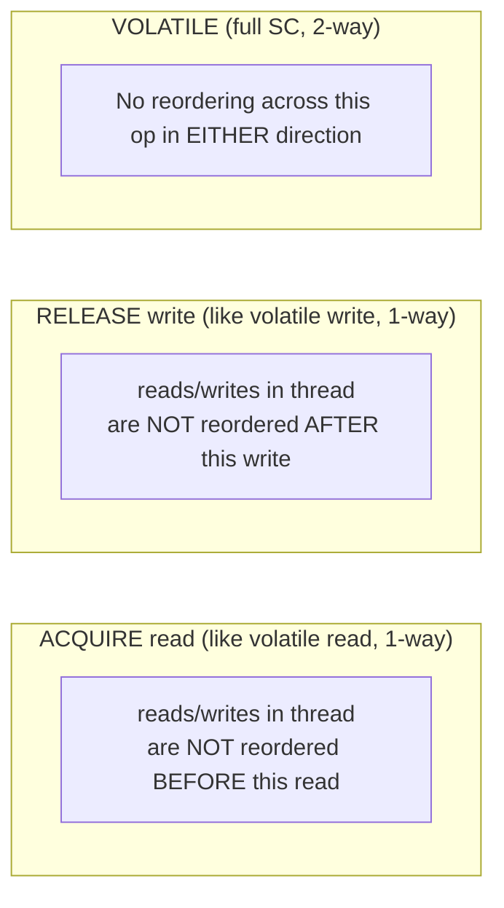

# Atomics, CAS, and `VarHandle`

> [!summary] Goal
> Understand compare-and-swap (CAS) at the hardware and JVM level, master every class in `java.util.concurrent.atomic`, use `VarHandle` for fine-grained memory ordering, and avoid false sharing. Know when to reach for atomics, when to use `LongAdder`, and when a lock is still the right answer.

## Table of Contents

1. [Why Atomics Exist](#why-atomics-exist)
2. [CAS at the Hardware Level](#cas-at-the-hardware-level)
3. [Atomic Classes Tour](#atomic-classes-tour)
4. [LongAdder and LongAccumulator](#longadder-and-longaccumulator)
5. [The ABA Problem](#the-aba-problem)
6. [VarHandle](#varhandle)
7. [False Sharing](#false-sharing)
8. [Decision Guide](#decision-guide)
9. [Pitfalls](#pitfalls)

---

## Why Atomics Exist

> [!info] Atomic operations
> An atomic operation is one that appears indivisible to all threads — no thread can see a partial result. On a single-CPU system, a single instruction (like a plain `int` store) is already atomic. On multi-core systems, reads and writes of `long`/`double` may not be atomic (Java allows two 32-bit writes). CAS (compare-and-swap) provides atomic read-modify-write — check a value AND update it in one step, without a lock. All `Atomic*` classes are built on CAS.



### What atomics give you vs locks vs volatile

| Property | `volatile` | Atomic classes | Lock (`synchronized`/`ReentrantLock`) |
|----------|:----------:|:--------------:|:-------------------------------------:|
| **Visibility** | ✅ Single field | ✅ Single field | ✅ All memory in critical section |
| **Atomicity** | ❌ Not for `count++` | ✅ CAS operations | ✅ Full critical section |
| **Ordering** | ✅ Sequential consistency | ✅ CAS is SC + `lazySet` is weaker | ✅ All ops inside lock are ordered |
| **Compound update** | ❌ | ✅ `compareAndSet`, `getAndUpdate` | ✅ Lock protects N operations |
| **Multi-field invariant** | ❌ | ❌ | ✅ |
| **Performance uncontended** | Best | Better (no OS lock) | Good (biased lock + lock elision) |
| **Performance contended** | N/A (doesn't solve contention) | Spins (CPU) | Parks thread (OS, may be slower) |

---

## CAS at the Hardware Level

> [!info] CAS hardware
> CAS (Compare-And-Swap) is a CPU instruction. In pseudo-code: `cas(address, expectedValue, newValue)` → atomically read `address`, if it still equals `expectedValue`, write `newValue` and return `true`; otherwise return `false`. Modern CPUs provide this as a single instruction (x86: `CMPXCHG`, ARM: `LDREX`/`STREX`).

### x86: `CMPXCHG`

```text
x86 CMPXCHG instruction:
  CMPXCHG [addr], EAX  ; compare [addr] with EAX
                          if equal:  [addr] ← EBX, set ZF
                          if not:    EAX ← [addr], clear ZF

Java's Unsafe.compareAndSwapInt maps to:
  lock cmpxchg [addr], eax, ebx   → Full memory barrier (lock prefix)

"lock" prefix on x86:
  - Forces CPU bus lock or cache coherence protocol
  - Acts as a full memory barrier (all stores visible, no reordering)
  - This is why CAS is expensive under contention — the lock prefix
    serializes cache coherency traffic
```

### ARM: `LDREX` / `STREX` (Load-Linked / Store-Conditional)

```text
ARM uses a different approach: Load-Linked / Store-Conditional (LL/SC).

  LDREX Rd, [addr]    ; Load value + mark address for exclusive access
  ...                 ; Compute new value (no store yet!)
  STREX Rd, [addr]    ; Try to store: succeeds if no other core wrote to addr
                      ; Rd ← 0 on success, 1 on failure

LL/SC vs x86 CMPXCHG:
  - LL/SC can fail spuriously (cache eviction, interrupt) → must retry in loop
  - LL/SC avoids the "ABA problem" at the hardware level (see ABA section)
  - CMPXCHG is stronger (doesn't have spurious failure) but more expensive
```

### CAS in Java: `Unsafe` and the spin loop

```java
// This is (approximately) what AtomicInteger.incrementAndGet does internally:
// sun.misc.Unsafe (JDK 8-17) → jdk.internal.misc.Unsafe (JDK 9+)

import sun.misc.Unsafe; // or jdk.internal.misc.Unsafe

public class AtomicIntegerExample {
    private volatile int value;
    private static final Unsafe U = Unsafe.getUnsafe();
    private static final long VALUE_OFFSET;

    static {
        try {
            VALUE_OFFSET = U.objectFieldOffset(
                AtomicIntegerExample.class.getDeclaredField("value"));
        } catch (ReflectiveOperationException e) {
            throw new Error(e);
        }
    }

    public final int incrementAndGet() {
        // Spin loop: retry until CAS succeeds
        for (;;) {
            int current = U.getIntVolatile(this, VALUE_OFFSET);  // volatile read
            int next = current + 1;
            if (U.compareAndSwapInt(this, VALUE_OFFSET, current, next)) {
                return next;  // CAS succeeded — nobody else modified value
            }
            // CAS failed — another thread changed value between get and CAS
            // Loop and try again with the latest value
        }
    }
}
```

### Why CAS spins instead of blocking

```text
CAS is optimistic. It assumes low contention:
  - In the uncontended case: one CAS attempt succeeds immediately (fast path).
  - Under contention: threads spin (CPU busy-wait) until the CAS succeeds.
  - Spinning is appropriate when: critical section is tiny, contention is rare.
  - Spinning is BAD when: contention is high — spinning threads waste CPU,
    which makes the holder run slower, which makes contention worse (feedback loop).

In practice, CAS spin loops work well for atomic counters and flags.
For complex state, use locks (which park waiting threads instead of spinning).
```

### Performance characteristics

```text
Cost of CAS operations (approximate, JDK 17 on modern x86):
  - Uncontested CAS: ~10-20 ns
  - Contested CAS (2 threads): ~100-500 ns (cache coherency traffic)
  - Contested CAS (8+ threads): ~microseconds (bus arbitration)

Compare to:
  - synchronized uncontended (biased lock): ~1-10 ns (lock elision may eliminate)
  - synchronized contended: ~1-100 µs (park/unpark is expensive)
  - volatile read: ~1-5 ns
  - volatile write: ~10-20 ns

  Atomics are NOT free. Under high contention, a lock can be FASTER
  because it parks threads instead of letting them spin.
```

---

## Atomic Classes Tour

> [!info] Atomic classes
> `java.util.concurrent.atomic` provides atomic operations for primitives, references, arrays, and field updaters. Every class supports: `get`, `set`, `compareAndSet`, `weakCompareAndSet`, `getAndSet`, `getAndIncrement`, `getAndAdd`, etc.

### Scalar atomics

```java
// AtomicInteger — the most common
AtomicInteger counter = new AtomicInteger(0);
counter.incrementAndGet();           // ++i
counter.getAndIncrement();           // i++
counter.addAndGet(5);                // i += 5
counter.getAndSet(100);              // int old = value; value = 100; return old;
counter.compareAndSet(expected, 10); // if value == expected, set to 10, return true
counter.updateAndGet(x -> x * 2);    // CAS loop with lambda
counter.accumulateAndGet(5, Integer::sum); // CAS loop with binary operator

// AtomicLong — same API, for 64-bit values
AtomicLong totalBytes = new AtomicLong(0);
totalBytes.addAndGet(bytesTransferred);

// AtomicBoolean — for boolean state flags
AtomicBoolean initialized = new AtomicBoolean(false);
if (initialized.compareAndSet(false, true)) {
    // Only one thread enters here — the first to CAS false → true
    initializeExpensiveResource();
}
```

### AtomicReference

```java
// AtomicReference — atomically swap object references
AtomicReference<String> configPath = new AtomicReference<>("/default/path");
configPath.compareAndSet("/default/path", "/new/path");

// Common pattern: immutable snapshot swap
AtomicReference<RouteTable> routes = new AtomicReference<>(RouteTable.empty());

// Reader: always sees a complete, consistent snapshot
RouteTable snapshot = routes.get();

// Writer: build a new snapshot, atomically swap
RouteTable updated = routes.get().addRoute("/api", handler);
routes.compareAndSet(snapshot, updated); // Fails if another writer changed it
```

### Atomic array classes

```java
// AtomicIntegerArray — atomically update elements of an int[]
int[] backing = new int[100];
AtomicIntegerArray atomicArray = new AtomicIntegerArray(backing);
// NOTE: the backing array is NOT safely shared — use atomicArray, not backing.

atomicArray.incrementAndGet(5);      // atomically increment element at index 5
int old = atomicArray.getAndSet(5, 42);

// AtomicLongArray, AtomicReferenceArray — same pattern
AtomicReferenceArray<String> names = new AtomicReferenceArray<>(10);
names.compareAndSet(0, null, "Alice");
```

### Atomic field updaters

```java
// AtomicIntegerFieldUpdater / AtomicReferenceFieldUpdater — atomically update
// a volatile field of another object without changing its class.
// Use when you can't change the class (legacy code, third-party) or
// when you want to add atomic ops to existing classes.

class User {
    volatile int age;    // MUST be volatile for updater to work
    volatile String status;
}

// Updater is created via static factory, NOT constructor
AtomicIntegerFieldUpdater<User> ageUpdater =
    AtomicIntegerFieldUpdater.newUpdater(User.class, "age");
AtomicReferenceFieldUpdater<User, String> statusUpdater =
    AtomicReferenceFieldUpdater.newUpdater(User.class, String.class, "status");

User user = new User();
ageUpdater.incrementAndGet(user);           // user.age++
ageUpdater.compareAndSet(user, 30, 31);     // if user.age == 30, set to 31
statusUpdater.compareAndSet(user, "active", "inactive");
```

### Atomic accumulator / updater: `AtomicIntegerFieldUpdater` vs `VarHandle` vs plain `AtomicInteger`

```text
                │  AtomicInteger  │ AtomicFieldUpdater │ VarHandle (JDK 9+)
 ───────────────┼─────────────────┼────────────────────┼──────────────────
 Storage        │  New wrapper    │ Volatile field     │ Volatile field
 Type safety    │  Full           │ Cast required      │ Full
 Performance    │  Best           │ ≈same (refl. cache)│ Best (handle)
 New to JDK     │  1.5            │ 1.5                │ 9 (preferred today)
```

---

## LongAdder and LongAccumulator

> [!info] LongAdder
> `LongAdder` (JDK 8+) is an alternative to `AtomicLong` for high-contention counters. Instead of one CAS-hot cell, it maintains a set of cells (stripe per CPU core). Each thread updates its own cell with CAS. On `sum()`, all cells are read and summed. Under high contention, `LongAdder` can be 10-100× faster than `AtomicLong`. Use it when: (a) contention is high, (b) you DON'T need a consistent snapshot between updates.



```java
// LongAdder: fast counter under high contention
LongAdder requests = new LongAdder();

// In request handler (called by many threads):
requests.increment();   // Each thread updates its own cell → no CAS contention

// Metrics thread (called periodically):
long total = requests.sum();  // Sums all cells (not atomic — approximate)

// After reading, reset counter:
long totalThenReset = requests.sumThenReset();  // Read + reset atomically

// When NOT to use LongAdder:
// - When you need exact, consistent values between reads (use AtomicLong)
// - When contention is low (AtomicLong is faster for low contention)
// - When you need getAndSet or compareAndSet (LongAdder doesn't support these)

// Decision:
//   Low contention, need CAS ops → AtomicLong
//   High contention, counter only → LongAdder
//   Very high contention, arbitrary accumulation → LongAccumulator
```

```java
// LongAccumulator: generic striped accumulator (not just addition)
// Computes: result = accumulator.apply(result, newValue)
// The accumulator function must be associative and commutative.

LongAccumulator maxTracker = new LongAccumulator(Long::max, Long.MIN_VALUE);

// Thread 1: maxTracker.accumulate(100)
// Thread 2: maxTracker.accumulate(200)
// Thread 3: maxTracker.accumulate(50)
// maxTracker.get() → 200 (the max of all accumulated values)

LongAccumulator minTracker = new LongAccumulator(Long::min, Long.MAX_VALUE);
LongAccumulator productAccum = new LongAccumulator(Long::product, 1);

// DoubleAccumulator, DoubleAdder — same pattern for double values
DoubleAdder totalRevenue = new DoubleAdder();
totalRevenue.add(99.95);
totalRevenue.add(49.99);
```

### Striped64 internals (how LongAdder works under the hood)

```text
Striped64 (the parent class of LongAdder, LongAccumulator) design:
  1. Start with a single base value (like AtomicLong) — CAS on this.
  2. When CAS on base fails (contention detected), expand to a Cell[] array.
  3. Each Cell is padded to avoid false sharing (see false sharing section).
  4. Threads use thread-local probe to pick a cell: cells[probe & (n-1)].
  5. Each cell update: CAS on the cell's value.
  6. sum() = base + sum of all cell values.

Expansion policy:
  - If 2 threads collide on one cell → double the cell array size (up to CPU count).
  - Cells are lazily allocated — only created when contention is detected.
  - Cells are never shrunk (even if contention drops).

Why it's fast:
  - In the happy path (one thread): just CAS on base (≈ AtomicLong cost).
  - In the contended path: each thread writes to a DIFFERENT cell
    → no cache line bouncing → no CPU cache coherency traffic.
```

---

## The ABA Problem

> [!info] ABA
> ABA is a subtle CAS bug. Thread 1 reads value = A. Thread 2 changes A → B → A. Thread 1's CAS sees A (the same reference) and succeeds — but the object A now has different internal state. The reference is the same, but the meaning is different.



### Real-world example: lock-free stack (Treiber stack)

```java
// A lock-free stack shows the ABA problem clearly:

class TreiberStack<E> {
    AtomicReference<Node<E>> top = new AtomicReference<>();

    public void push(E item) {
        Node<E> newHead = new Node<>(item);
        for (;;) {
            Node<E> oldHead = top.get();
            newHead.next = oldHead;
            if (top.compareAndSet(oldHead, newHead)) return;
        }
    }

    public E pop() {
        for (;;) {
            Node<E> oldHead = top.get();
            if (oldHead == null) return null;
            Node<E> newHead = oldHead.next;
            // ABA here: between get() and compareAndSet, another thread
            // could pop oldHead, push it back (same Node object) → CAS succeeds
            // but newHead is now wrong!
            if (top.compareAndSet(oldHead, newHead)) return oldHead.item;
        }
    }
}
```

### Solution: `AtomicStampedReference` and `AtomicMarkableReference`

```java
// AtomicStampedReference: atomically update (reference + integer stamp)
// The stamp changes every time the reference is updated.
// Even if the same reference object comes back, the stamp is different → CAS fails.

public class SafeTreiberStack<E> {
    private final AtomicStampedReference<Node<E>> top =
        new AtomicStampedReference<>(null, 0);

    public void push(E item) {
        Node<E> newHead = new Node<>(item);
        for (;;) {
            int[] stampHolder = new int[1];
            Node<E> oldHead = top.get(stampHolder);
            int stamp = stampHolder[0];
            newHead.next = oldHead;
            // CAS checks BOTH reference AND stamp
            if (top.compareAndSet(oldHead, newHead, stamp, stamp + 1)) return;
        }
    }

    public E pop() {
        for (;;) {
            int[] stampHolder = new int[1];
            Node<E> oldHead = top.get(stampHolder);
            if (oldHead == null) return null;
            int stamp = stampHolder[0];
            Node<E> newHead = oldHead.next;
            // Even if oldHead is popped and re-pushed (same object),
            // the stamp changed → CAS fails → retry
            if (top.compareAndSet(oldHead, newHead, stamp, stamp + 1))
                return oldHead.item;
        }
    }
}

// AtomicMarkableReference: same idea but with a boolean bit (not a full int).
// Use when you only need to mark "deleted" vs "not deleted" (not version counting).
// Internally packs reference + mark into a single atomic word.
```

### When does ABA actually matter?

```text
ABA is dangerous when:
  - The identity of the object carries semantic meaning (lock-free data structures).
  - You are implementing a Treiber stack, Michael-Scott queue, or hazard pointers.

ABA is NOT a problem when:
  - The value represents an immutable counter: A=5, B=6, A=5 → CAS detecting 5
    is correct (you want to CAS when value is 5, regardless of history).
  - You are using AtomicInteger, AtomicLong for counters — ABA can't happen
    because the values are immutable and the meaning of "5" is always the same.
```

---

## VarHandle

> [!info] VarHandle (JDK 9+)
> `VarHandle` is the modern replacement for `AtomicReferenceFieldUpdater`, `AtomicIntegerFieldUpdater`, and `sun.misc.Unsafe` for field access. It provides fined-grained memory ordering modes (not just volatile vs plain), and it's the recommended API for all new code (JDK 9+).

```java
import java.lang.inte.VarHandle;
import java.lang.inte.MethodHandles;

public class User {
    volatile String status;           // For VarHandle: can be volatile or plain

    private static final VarHandle STATUS;

    static {
        try {
            // Lookup is done once, handles are cached (equivalent to field offset)
            STATUS = MethodHandles.lookup()
                .findVarHandle(User.class, "status", String.class);
        } catch (ReflectiveOperationException e) {
            throw new Error(e);
        }
    }

    // Plain read (no ordering guarantees — like reading a non-volatile field)
    String getStatusPlain() {
        return (String) STATUS.get(this);
    }

    // Opaque read: prevents compiler reordering, but NOT CPU reordering
    // Use for "eventual visibility" — weaker than volatile, cheaper
    String getStatusOpaque() {
        return (String) STATUS.getOpaque(this);
    }

    // Acquire read: guarantees that subsequent reads/writes are not reordered
    // before this read. Like volatile read but only one direction (acquire only)
    String getStatusAcquire() {
        return (String) STATUS.getAcquire(this);
    }

    // Volatile read: full sequential consistency (same as volatile field read)
    String getStatusVolatile() {
        return (String) STATUS.getVolatile(this);
    }

    // Plain write
    void setStatusPlain(String s) {
        STATUS.set(this, s);
    }

    // Release write: guarantees that prior reads/writes are not reordered
    // after this write. Like volatile write but only one direction (release only)
    void setStatusRelease(String s) {
        STATUS.setRelease(this, s);
    }

    // Volatile write: full sequential consistency
    void setStatusVolatile(String s) {
        STATUS.setVolatile(this, s);
    }

    // CAS with volatile semantics
    boolean casStatus(String expected, String newValue) {
        return STATUS.compareAndSet(this, expected, newValue);
    }

    // CAS with weaker ordering (opaque mode) — faster but fewer guarantees
    boolean casStatusWeak(String expected, String newValue) {
        return STATUS.weakCompareAndSetPlain(this, expected, newValue);
    }

    // Atomic get-and-set
    String getAndSetStatus(String newValue) {
        return (String) STATUS.getAndSet(this, newValue);
    }
}
```

### Memory ordering modes

| Mode | Compiler reordering | CPU reordering | Cost vs volatile | Use case |
|:----:|:-------------------:|:--------------:|:----------------:|----------|
| **Plain** (`get`/`set`) | Allowed | Allowed | Cheapest | Only accessed from one thread |
| **Opaque** | Prevented | Allowed | ≈ plain | Eventual visibility; bit flags set by other threads eventually |
| **Acquire** | Later ops not reordered before | Later loads not reordered before | ≈ volatile read | Reading a pointer published by another thread via release |
| **Release** | Prior ops not reordered after | Prior stores not reordered after | ≈ volatile write | Publishing data for other threads to read |
| **Volatile** (full SC) | None reordered | None reordered | Most expensive | Classic `volatile` guarantee; sequential consistency |



### `VarHandle` vs `AtomicFieldUpdater` vs `Unsafe`

```text
                        VarHandle         AtomicFieldUpdater     Unsafe (deprecated)
 ────────────────────────────────────────────────────────────────────────────────
 API                   Clean, typed       Functional but dated     Raw, dangerous
 Memory ordering       Plain/Opaque/Acq/Rel/Vol    Volatile only   Volatile only
 Array elements        ✅                   ❌                    ✅ (raw)
 JDK support           Preferred (9+)      Still works            Internal API
 Performance           Best (JIT intrinsic) Good                   Best
 Type safety           Compile-time        Runtime cast            None
```

### `VarHandle` for arrays

```java
int[] data = new int[100];
VarHandle INT_ARRAY = MethodHandles.arrayElementVarHandle(int[].class);

// Opaque read of element at index 5
int val = (int) INT_ARRAY.getOpaque(data, 5);

// Volatile write
INT_ARRAY.setVolatile(data, 5, 42);

// CAS on array element
INT_ARRAY.compareAndSet(data, 5, 42, 100);
```

### Why use weaker ordering modes

```text
On x86, acquire/release are FREE (x86 is TSO — all stores have release semantics).
On ARM/POWER, acquire/release insert explicit barrier instructions.

Using volatile (full SC) on ARM inserts a full DMB barrier (~50-100 ns).
Using acquire-release on ARM inserts one-way DMB (~20-30 ns).
Using opaque on ARM inserts no barrier (~1 ns).

Real-world: if you only need "publish data, let others see it eventually,"
opaque is enough and avoids unnecessary barriers on ARM/RISC-V.

In practice, most Java code just uses volatile — it's simpler and correct.
Weaker modes are for library authors writing high-performance concurrent
data structures (concurrent queues, lock-free maps, etc.).
```

---

## False Sharing

> [!info] False sharing
> False sharing is a performance antipattern where two threads write to different variables that happen to share the same CPU cache line (typically 64 bytes). The CPU cache coherence protocol (MESI) forces the cache line to be invalidated and transferred between cores on every write — even though the threads are accessing DIFFERENT data. This can cause 100× performance degradation.

```mermaid
flowchart LR
    subgraph Core1["Core 1"]
        T1["Thread 1 writes to field A"]
    end
    subgraph CacheLine["Cache Line (64 bytes)"]
        A["Field A<br/>@offset 0"]
        B["Field B<br/>@offset 8"]
    end
    subgraph Core2["Core 2"]
        T2["Thread 2 writes to field B"]
    end
    T1 --> A
    T2 --> B
    Note over Core1,Core2: Write to A → invalidates cache line on Core 2<br/>Write to B → invalidates cache line on Core 1<br/>Result: constant cache line bouncing (false sharing)
```

### Detecting false sharing

```text
Symptoms:
  - CPUs show high cache miss rates (perf stat -e cache-misses)
  - Scalability is worse than expected as threads increase
  - perf c2c (cache-to-cache) tool shows many HITM (Hit Modified) transfers

Linux perf detection:
  perf c2c record -- sleep 60   # Record cache line contention
  perf c2c report               # Show contended cache lines
```

### Prevention: `@Contended` (JDK 8+)

```java
// @Contended — JVM annotation to pad fields to their own cache line.
// NOTE: this is a JDK-internal annotation, not public API.
// Works with -XX:-RestrictContended (to allow user code to use it).

import sun.misc.Contended;  // or jdk.internal.vm.annotation.Contended

public class Counter {
    @Contended                // Pads: this field starts at its own cache line
    volatile long value1;

    @Contended("group1")      // Multiple fields can share a padding group
    volatile long value2;
}

// Without @Contended: value1 and value2 may share a cache line
// With @Contended: each field is padded to 64-byte alignment
```

### Manual padding (alternative without @Contended)

```java
// Manual padding — works everywhere (no JDK annotation needed).

class PaddedCounter {
    // 56 bytes of padding before the actual value
    // Ensures value starts at a cache line boundary
    public volatile long p1, p2, p3, p4, p5, p6, p7;  // 56 bytes
    public volatile long value;                           // 8 bytes = 64 total

    // Prevent the JIT from optimizing away padding fields
    public long preventOptimization() {
        return p1 + p2 + p3 + p4 + p5 + p6 + p7;
    }
}

// Cleaner with inheritance (value at the end):
abstract class Padded {

    protected volatile long p1, p2, p3, p4, p5, p6, p7;
}

class Counter extends Padded {
    public volatile long value;
}
```

### LongAdder uses this internally

```java
// Striped64.Cell (used by LongAdder) is padded:

@Contended  // Prevents false sharing between adjacent cells
static final class Cell {
    volatile long value;

    Cell(long x) { value = x; }

    final boolean cas(long cmp, long val) {
        return UNSAFE.compareAndSwapLong(this, valueOffset, cmp, val);
    }
}
```

### When false sharing actually matters

```text
False sharing is a concern when:
  - Many threads update DIFFERENT fields of the SAME object (or adjacent objects).
  - The updates are frequent (millions/sec).
  - The cache line is bouncing between cores many times per second.

False sharing is NOT a concern when:
  - Fields are read-mostly (reads don't invalidate cache lines).
  - Updates are rare (once per second or less).
  - Data is thread-confined (one thread reads/writes the whole object).

Rule of thumb: if you're not sure, profile first (perf c2c, cache misses).
Don't add @Contended or padding speculatively — it wastes memory.
```

---

## Decision Guide

```text
What do I need?                                  Use this
─────────────────────────────────────────────────────────────────
Simple counter, low contention                   AtomicInteger / AtomicLong
Simple counter, high contention                  LongAdder
Need sum of N values, high contention            LongAccumulator / DoubleAccumulator
Atomic boolean flag (one-time switch)            AtomicBoolean
Atomically swap object references                AtomicReference
Update one field atomically, can't change class  VarHandle (or AtomicFieldUpdater)
Atomically update array elements                 AtomicIntegerArray (or VarHandle)
Update N related fields atomically               Lock (not atomics)
Publish read-only snapshot to other threads      AtomicReference (swap whole snapshot)
Need ordering weaker than volatile               VarHandle (opaque/acquire/release)
Lock-free data structure (stack, queue)          AtomicReference + stamp (for ABA)
Need to know if a field has changed since I saw it  AtomicStampedReference

When to use LOCK instead of atomics:
  - Multiple fields form one invariant (e.g., (x, y) coordinates must update together).
  - Operation is more than a simple read-modify-write.
  - High contention AND critical section is complex (parking is better than spinning).
  - Simplicity matters more than nanosecond optimization.
```

---

## Pitfalls

### CAS spin loop without backoff

Under high contention, a tight CAS spin loop (`for(;;)`) wastes CPU. Threads spin uselessly, generating cache-coherency traffic that slows the thread holding the lock.

**Fix**: Use `Thread.onSpinWait()` (JDK 9+) inside CAS loops to hint to the CPU that this is a spin loop (enables power-saving, better SMT scheduling):

```java
public int incrementAndGet() {
    for (;;) {
        int current = get();
        int next = current + 1;
        if (compareAndSet(current, next)) return next;
        Thread.onSpinWait();  // Hint: spinning, not useless work
    }
}
```

### `compareAndSet` vs `weakCompareAndSet`

`weakCompareAndSet` may fail spuriously (even if the value matches). It's weaker but can be faster on LL/SC architectures (ARM). Never use it unless you've read the JVM spec and understand LL/SC. In practice, `compareAndSet` is almost always what you want.

### `AtomicInteger` for metrics aggregation loses accuracy

If multiple threads call `incrementAndGet()`, the counter is exact. But if you use `LongAdder` and read `sum()` while updates are in progress, the sum is approximate (missing in-flight writes). This is fine for metrics but wrong for billing.

### Forgetting `volatile` on field used with `VarHandle`

`VarHandle.compareAndSet` works on plain (non-volatile) fields, but without volatile, visibility is not guaranteed between threads. Either declare the field `volatile` or use `getVolatile`/`setVolatile` on the `VarHandle`.

---

> [!question]- Interview Questions
>
> **Q: How does CAS work at the CPU level?**
> A: CAS reads a memory location, compares it to an expected value, and if equal, writes a new value — all atomically. On x86, this is the `lock cmpxchg` instruction. The `lock` prefix causes a full memory barrier and locks the cache line for the duration of the operation. On ARM, CAS is implemented with `LDREX`/`STREX` (load-linked/store-conditional), where the store may fail spuriously, requiring a retry loop.
>
> **Q: What is the ABA problem and how do you fix it?**
> A: ABA is when a CAS succeeds on a reference value A, but A was changed to B and back to A between the read and the CAS — the reference is the same but the object's internal state changed. Fixed by `AtomicStampedReference` (reference + integer stamp incremented on every update) or `AtomicMarkableReference` (reference + boolean). The stamp ensures that even if the same object comes back, the version number differs.
>
> **Q: When would you prefer LongAdder over AtomicLong?**
> A: Under high contention where many threads increment a counter concurrently. `LongAdder` stripes the counter across multiple cells (one per CPU core), so each thread writes to its own cell — no CAS contention. `sum()` reads all cells. Below contention, `AtomicLong` is faster (single cell, no striping overhead). Use `LongAdder` for metrics; use `AtomicLong` for counters where you need CAS operations like `compareAndSet`.
>
> **Q: What is false sharing and how does @Contended fix it?**
> A: False sharing occurs when two Threads write to different fields that reside on the same CPU cache line (typically 64 bytes). The cache coherence protocol forces the line to bounce between cores on every write, destroying performance. `@Contended` adds padding before the field so it starts at a cache line boundary, ensuring no other field shares the line. Equivalent to manual padding with unused fields.
>
> **Q: What memory ordering modes does VarHandle support?**
> A: Plain (no ordering), Opaque (prevents compiler reordering only), Acquire/Release (one-way barriers — subsequent loads not reordered before / prior stores not reordered after), and Volatile (full sequential consistency). Weaker modes are cheaper on ARM/POWER but unnecessary on x86 (TSO guarantees most of it for free).

---

## Cross-Links

- [[Java/03_Advanced/02_JMM_Volatile_and_Locks]] for synchronized, volatile, wait/notify, and JMM fundamentals
- [[Java/02_Core/01_Concurrency_Threads_and_Executors]] for thread pools and ThreadLocal
- [[Java/04_Playbooks/03_Debug_Concurrency_Issues]] for lock-free debugging
- [[Java/03_Advanced/09_Reflection_and_Annotations]] for VarHandle lookup API
