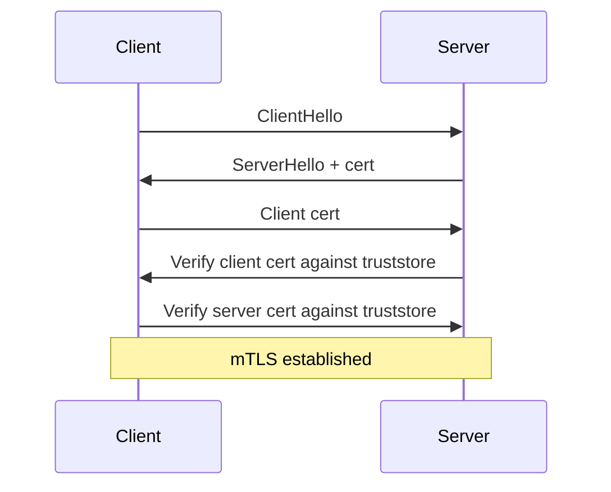
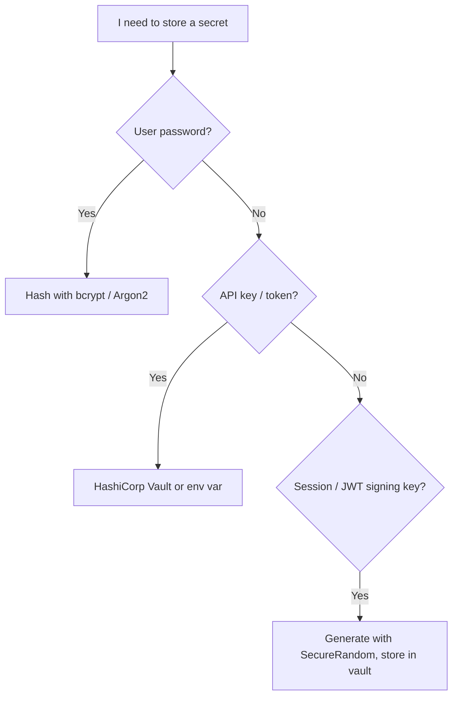

# Java Security, TLS, and Cryptography

> [!summary] Goal
> Secure a Java application in production: configure TLS for clients and servers, use the JCA correctly, and avoid the most common security mistakes.

## Table of Contents

1. [TLS in Java (JSSE)](#tls-in-java-jsse)
2. [KeyStore and TrustStore](#keystore-and-truststore)
3. [Configuring HTTPS Clients](#configuring-https-clients)
4. [Configuring TLS on a Server](#configuring-tls-on-a-server)
5. [Mutual TLS (mTLS)](#mutual-tls-mtls)
6. [Crypto APIs (JCE) Overview](#crypto-apis-jce-overview)
7. [Password Hashing and SecureRandom](#password-hashing-and-securerandom)
8. [Serialization Security](#serialization-security)
9. [Pitfalls](#pitfalls)
10. [Q&A](#qa)

---

## TLS in Java (JSSE)

Java Secure Socket Extension (JSSE) provides TLS support through:

- `SSLContext` — the factory for TLS connections.
- `SSLSocket` / `SSLEngine` — secure socket and non-blocking engine.
- `HttpsURLConnection` / `HttpClient` — high-level HTTPS.

```mermaid
flowchart LR
    A[Application] --> B[SSLContext]
    B --> C[KeyManager]
    B --> D[TrustManager]
    B --> E[SecureRandom]

    C --> F[KeyStore (identity)]
    D --> G[KeyStore (trusted CAs)]
```

### TLS version defaults

```java
// Modern TLS 1.3
SSLContext ctx = SSLContext.getInstance("TLSv1.3");
```

Do **not** use `SSLv3`, `TLSv1`, or `TLSv1.1` — they are deprecated and insecure.

---

## KeyStore and TrustStore

| Store | Purpose | Common format |
|-------|---------|---------------|
| **KeyStore** | Holds the server's private key + certificate | PKCS12 (`.p12` or `.pfx`) |
| **TrustStore** | Holds trusted CA certificates | PKCS12 or JKS |

### Creating a KeyStore

```bash
# Generate self-signed cert (dev only)
keytool -genkeypair -alias server \
  -keyalg RSA -keysize 2048 -validity 365 \
  -keystore keystore.p12 -storetype PKCS12 -storepass changeit
```

### Loading in code

```java
KeyStore keyStore = KeyStore.getInstance("PKCS12");
try (InputStream in = Files.newInputStream(Path.of("/etc/app/keystore.p12"))) {
    keyStore.load(in, "changeit".toCharArray());
}

KeyStore trustStore = KeyStore.getInstance("PKCS12");
try (InputStream in = Files.newInputStream(Path.of("/etc/app/truststore.p12"))) {
    trustStore.load(in, "changeit".toCharArray());
}
```

---

## Configuring HTTPS Clients

### JDK HttpClient with TLS

```java
SSLContext sslContext = SSLContext.getInstance("TLSv1.3");
KeyManagerFactory kmf = KeyManagerFactory.getInstance(KeyManagerFactory.getDefaultAlgorithm());
kmf.init(keyStore, "changeit".toCharArray());
TrustManagerFactory tmf = TrustManagerFactory.getInstance(TrustManagerFactory.getDefaultAlgorithm());
tmf.init(trustStore);
sslContext.init(kmf.getKeyManagers(), tmf.getTrustManagers(), new SecureRandom());

HttpClient client = HttpClient.newBuilder()
    .sslContext(sslContext)
    .connectTimeout(Duration.ofSeconds(10))
    .build();

HttpResponse<String> resp = client.send(
    HttpRequest.newBuilder(URI.create("https://internal.service/")).build(),
    HttpResponse.BodyHandlers.ofString()
);
```

### Hostname verification

By default, the JDK verifies that the certificate's CN/SAN matches the hostname. Override only for testing:

```java
// Never in production
client.sslParameters(sslParams -> {
    sslParams.setEndpointIdentificationAlgorithm("");
});
```

---

## Configuring TLS on a Server

### Simple HTTPS server with `HttpsServer`

```java
SSLContext sslContext = SSLContext.getInstance("TLSv1.3");
KeyManagerFactory kmf = KeyManagerFactory.getInstance(KeyManagerFactory.getDefaultAlgorithm());
kmf.init(keyStore, "changeit".toCharArray());
sslContext.init(kmf.getKeyManagers(), null, new SecureRandom());

HttpsServer server = HttpsServer.create(new InetSocketAddress(8443), 0);
server.setHttpsConfigurator(new HttpsConfigurator(sslContext) {
    @Override
    public void configure(HttpsParameters params) {
        params.setProtocols(new String[]{"TLSv1.3"});
    }
});
server.createContext("/", exchange -> {
    String resp = "Hello, TLS!";
    exchange.sendResponseHeaders(200, resp.length());
    exchange.getResponseBody().write(resp.getBytes());
    exchange.close();
});
server.setExecutor(Executors.newVirtualThreadPerTaskExecutor());
server.start();
```

---

## Mutual TLS (mTLS)

In mTLS, both sides present certificates.



### Server-side setup

```java
// Same SSLContext setup but both sides have KeyManager + TrustManager
SSLContext sslContext = SSLContext.getInstance("TLSv1.3");
kmf.init(serverKeyStore, "changeit".toCharArray());
tmf.init(clientTrustStore); // contains client CA
sslContext.init(kmf.getKeyManagers(), tmf.getTrustManagers(), new SecureRandom());

// Client authentication required
server.setHttpsConfigurator(new HttpsConfigurator(sslContext) {
    @Override
    public void configure(HttpsParameters params) {
        params.setClientAuth(ClientAuth.NEED);
    }
});
```

---

## Crypto APIs (JCE) Overview

### Hash

```java
MessageDigest md = MessageDigest.getInstance("SHA-256");
byte[] digest = md.digest("data".getBytes(StandardCharsets.UTF_8));
```

### Symmetric encryption

```java
SecretKey key = KeyGenerator.getInstance("AES").generateKey();
Cipher cipher = Cipher.getInstance("AES/GCM/NoPadding");
cipher.init(Cipher.ENCRYPT_MODE, key);
byte[] encrypted = cipher.doFinal(plaintext.getBytes());
byte[] iv = cipher.getIV(); // needed for decryption
```

### Asymmetric encryption (RSA)

```java
KeyPairGenerator gen = KeyPairGenerator.getInstance("RSA");
gen.initialize(2048);
KeyPair pair = gen.generateKeyPair();

Cipher cipher = Cipher.getInstance("RSA/ECB/OAEPWithSHA-256AndMGF1Padding");
cipher.init(Cipher.ENCRYPT_MODE, pair.getPublic());
byte[] encrypted = cipher.doFinal(plaintext);
```

> [!tip] Prefer `AES/GCM/NoPadding` for symmetric and `RSA/ECB/OAEPWithSHA-256AndMGF1Padding` for asymmetric. Avoid ECB mode and PKCS1Padding.

---

## Password Hashing and SecureRandom

### Password hashing

Do NOT use `MessageDigest` for passwords. Use a slow, adaptive hashing algorithm.

```java
// PBKDF2WithHmacSHA256
KeySpec spec = new PBEKeySpec(password.toCharArray(), salt, 65536, 256);
SecretKeyFactory factory = SecretKeyFactory.getInstance("PBKDF2WithHmacSHA256");
byte[] hash = factory.generateSecret(spec).getEncoded();
```

Better yet, use a library:

```java
// bcrypt (org.mindrot:jbcrypt)
String hash = BCrypt.hashpw(password, BCrypt.gensalt(12));
boolean ok = BCrypt.checkpw(password, hash);
```

### SecureRandom

```java
SecureRandom random = new SecureRandom();
byte[] salt = new byte[16];
random.nextBytes(salt); // cryptographically strong
```

---

## Serialization Security

### The problem

Java serialization deserializes arbitrary objects, leading to RCE vulnerabilities (e.g., through gadget chains in libraries).

### Mitigations

1. Prefer modern formats (JSON, Protobuf, Avro) over Java serialization.
2. Use `ObjectInputFilter` when serialization is unavoidable:

```java
ObjectInputStream ois = new ObjectInputStream(inputStream);
ois.setObjectInputFilter(info -> {
    if (info.serialClass() != null &&
        !info.serialClass().getName().startsWith("com.myapp.")) {
        return ObjectInputFilter.Status.REJECTED;
    }
    return ObjectInputFilter.Status.UNDECIDED;
});
```

3. Never deserialize untrusted data with Java serialization.

---

## Pitfalls

- **Trusting all certificates** (`noop TrustManager`) — a common mistake in dev that accidentally ships to prod.
- **Using `SSLv3` or `TLSv1.0`** — these protocols are banned by most security standards (PCI DSS, NIST).
- **Static keys or IVs** — encryption keys and IVs must be random per operation. Hard-coded keys are reversible.
- **ECB mode** — reveals patterns in ciphertext. Never use `AES/ECB`.
- **MD5 or SHA-1 for signatures** — broken collision resistance; use SHA-256 or SHA-512.
- **Forgetting certificate rotation** — certificates expire. Monitor and automate renewal.
- **Storing passwords in plaintext** — always hash with a per-user salt and a slow algorithm.



---

## Q&A

> [!question]- Should I use JKS or PKCS12 for KeyStores?

PKCS12 is the modern standard (Java 9+). JKS is proprietary and less secure. Use PKCS12.

> [!question]- What is the safest cipher suite to configure on the server?

In TLS 1.3, cipher suites are AEAD-based. The JDK defaults are already safe. For TLS 1.2, prefer `TLS_ECDHE_RSA_WITH_AES_128_GCM_SHA256`.

> [!question]- How do I prevent BEAST / POODLE / Heartbleed in Java?

Use TLS 1.3 (or TLS 1.2 with safe cipher suites). Keep the JDK updated — these attacks were mitigated in JDK 7/8 updates years ago, but older JDK versions are still vulnerable.

## References

- [JSSE Reference Guide](https://docs.oracle.com/en/java/javase/21/security/java-secure-socket-extension-jsse-reference-guide.html)
- [JCA Reference Guide](https://docs.oracle.com/en/java/javase/21/security/java-cryptography-architecture-jca-reference-guide.html)
- [OWASP Cryptographic Storage Cheat Sheet](https://cheatsheetseries.owasp.org/cheatsheets/Cryptographic_Storage_Cheat_Sheet.html)
- [[Java/03_Advanced/11_Networking_and_HTTP_Client]]
- [[Java/02_Core/03_IO_NIO_and_Serialization]]
