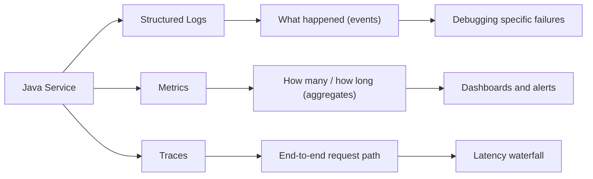
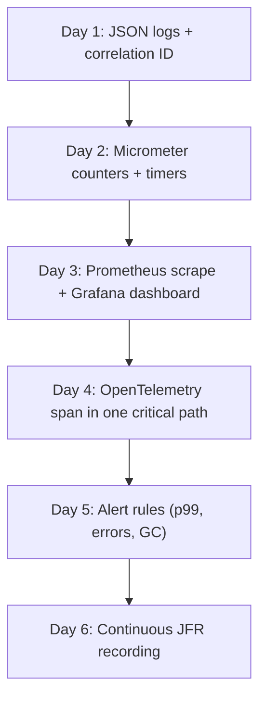

# Observability and Telemetry in Java

> [!summary] Goal
> Add structured logging, metrics, and distributed tracing to a Java application so you can understand system behaviour without guessing.

## Table of Contents

1. [Observability Pillars](#observability-pillars)
2. [Structured Logging at Scale](#structured-logging-at-scale)
3. [Metrics with Micrometer](#metrics-with-micrometer)
4. [Distributed Tracing with OpenTelemetry](#distributed-tracing-with-opentelemetry)
5. [Correlation IDs and Context Propagation](#correlation-ids-and-context-propagation)
6. [Integrating With JFR](#integrating-with-jfr)
7. [How to Add Observability Incrementally](#how-to-add-observability-incrementally)
8. [Pitfalls](#pitfalls)
9. [Q&A](#qa)

---

## Observability Pillars



Each pillar answers a different question:

| Pillar | Question | Tool |
|--------|----------|------|
| Logs | What exactly failed and where? | SLF4J + Logback |
| Metrics | Is the system healthy overall? | Micrometer + Prometheus |
| Traces | Which downstream caused the latency? | OpenTelemetry + Jaeger |

---

## Structured Logging at Scale

### JSON logging with Logstash

```xml
<dependency>
    <groupId>net.logstash.logback</groupId>
    <artifactId>logstash-logback-encoder</artifactId>
    <version>7.4</version>
</dependency>
```

```xml
<appender name="JSON" class="ch.qos.logback.core.ConsoleAppender">
    <encoder class="net.logstash.logback.encoder.LogstashEncoder"/>
</appender>
```

```java
// Structured fields via SLF4J 2.0 fluent API
Logger log = LoggerFactory.getLogger(PaymentService.class);
log.atInfo()
   .setMessage("Payment processed")
   .addKeyValue("orderId", order.id())
   .addKeyValue("amount", order.total())
   .addKeyValue("userId", order.userId())
   .log();
```

This produces a JSON line parsable by Elasticsearch, Loki, or Datadog:

```json
{"@timestamp":"...", "level":"INFO", "logger":"...", "message":"Payment processed",
 "orderId":"abc123", "amount":49.99, "userId":"user42"}
```

### Log sampling for high-traffic endpoints

Do not log every request in a hot path. Use sampling:

```java
if (log.isDebugEnabled() && ThreadLocalRandom.current().nextDouble() < 0.01) {
    log.debug("Slow path: took {} ms for order {}", elapsed, orderId);
}
```

---

## Metrics with Micrometer

Micrometer is the JDK of metrics — a façade over Prometheus, Datadog, Graphite, etc.

### Setup

```xml
<dependency>
    <groupId>io.micrometer</groupId>
    <artifactId>micrometer-core</artifactId>
    <version>1.13.0</version>
</dependency>
<dependency>
    <groupId>io.micrometer</groupId>
    <artifactId>micrometer-registry-prometheus</artifactId>
    <version>1.13.0</version>
</dependency>
```

### Common metric types

```java
MeterRegistry registry = new PrometheusMeterRegistry(PrometheusConfig.DEFAULT);

// Counter — how many times
Counter ordersCreated = Counter.builder("orders.created")
    .description("Total orders created")
    .register(registry);

// Timer — how long
Timer orderProcessing = Timer.builder("orders.processing")
    .publishPercentiles(0.5, 0.95, 0.99)
    .register(registry);

// Gauge — current value
Gauge.builder("queue.size", queue, Collection::size)
    .register(registry);
```

### Usage

```java
ordersCreated.increment();
orderProcessing.record(() -> processOrder(order));
```

### Expose metrics endpoint

```java
// Wire the registry into your health/metrics server
PrometheusMeterRegistry promRegistry = (PrometheusMeterRegistry) registry;
server.createContext("/metrics", exchange -> {
    String scrape = promRegistry.scrape();
    exchange.sendResponseHeaders(200, scrape.length());
    exchange.getResponseBody().write(scrape.getBytes());
    exchange.close();
});
```

---

## Distributed Tracing with OpenTelemetry

### Setup (minimal)

```xml
<dependency>
    <groupId>io.opentelemetry</groupId>
    <artifactId>opentelemetry-api</artifactId>
    <version>1.38.0</version>
</dependency>
<dependency>
    <groupId>io.opentelemetry</groupId>
    <artifactId>opentelemetry-sdk</artifactId>
    <version>1.38.0</version>
</dependency>
<dependency>
    <groupId>io.opentelemetry</groupId>
    <artifactId>opentelemetry-exporter-otlp</artifactId>
    <version>1.38.0</version>
</dependency>
```

### Creating a span

```java
OpenTelemetry otel = OpenTelemetrySdk.builder()
    .setTracerProvider(SdkTracerProvider.builder()
        .addSpanProcessor(BatchSpanProcessor.builder(OtlpGrpcSpanExporter.builder().build()).build())
        .build())
    .build();

Tracer tracer = otel.getTracer("my-service");

Span span = tracer.spanBuilder("processPayment").startSpan();
try (var scope = span.makeCurrent()) {
    span.setAttribute("order.id", order.id());
    Thread.sleep(50); // simulated work
} finally {
    span.end();
}
```

### Context propagation

OpenTelemetry propagates the trace context across thread boundaries, async calls, and HTTP headers automatically when using the agent or API instrumentation.

---

## Correlation IDs and Context Propagation

Use MDC to pass a correlation ID through logs.

### Interceptor / filter approach

```java
public class CorrelationIdFilter implements Filter {
    private static final String CORRELATION_ID = "correlationId";

    @Override
    public void doFilter(ServletRequest request, ServletResponse response, FilterChain chain) {
        String cid = ((HttpServletRequest) request).getHeader("X-Correlation-Id");
        if (cid == null) cid = UUID.randomUUID().toString();
        MDC.put(CORRELATION_ID, cid);
        try {
            chain.doFilter(request, response);
        } finally {
            MDC.remove(CORRELATION_ID);
        }
    }
}
```

Include `%X{correlationId}` in the log pattern:

```xml
<pattern>%d{ISO8601} [%X{correlationId}] [%thread] %-5level %logger{36} - %msg%n</pattern>
```

---

## Integrating With JFR

JFR events complement metrics and traces for deep JVM diagnostics.

| Concern | Tool | Data |
|---------|------|------|
| CPU hot methods | async-profiler / JFR | Flame graphs |
| GC pauses | JFR GC events | Pause duration, heap usage before/after |
| Lock contention | JFR Java Monitor Wait / JFR Lock | Contended lock stack traces |
| I/O latency | JFR Socket Read / File Read | Duration, bytes transferred |

Use JFR together with Micrometer:

```java
// Record a JFR event alongside a Micrometer timer
jfrEvent.commit();                  // JFR event
timer.record(duration, TimeUnit.NANOSECONDS);  // Micrometer metric
```

---

## How to Add Observability Incrementally

1. **Day 1 — Logging**: configure structured JSON logs with correlation IDs.
2. **Day 2 — Metrics**: add Micrometer counters for core operations (requests processed, errors, latency).
3. **Day 3 — Dashboards**: point Prometheus at your `/metrics` endpoint, build a dashboard (Grafana).
4. **Day 4 — Traces**: add OpenTelemetry to one critical path (payment, auth).
5. **Day 5 — Alerts**: set up alert rules on p99 latency, error rate, and GC pause frequency.
6. **Day 6 — JFR**: schedule continuous JFR recordings for post-incident analysis.



---

## Pitfalls

- **Cardinality explosion** — adding high-cardinality labels (user ID, order ID) to metrics blows up the Prometheus time series database. Use logs for per-entity data.
- **Sampling too aggressively** — 1% sampling means 99% of failures are invisible in traces. Use head-based sampling for low-volume services and tail-based sampling for high-volume.
- **Logging without context** — "Payment failed" in isolation is useless. Always include orderId, userId, error code.
- **Over-instrumenting** — instrument the 20% of paths that carry 80% of traffic. Not every private method needs a timer.
- **Not testing observability code** — ensure the `/metrics` endpoint returns data and traces reach your backend in staging before going live.

---

## Q&A

> [!question]- Do I need OpenTelemetry or is Micrometer enough?

Micrometer covers metrics. For distributed traces (seeing a request cross service boundaries), you need OpenTelemetry or a vendor agent (Datadog, New Relic). They are complementary.

> [!question]- Should I use the OpenTelemetry Java agent or manual instrumentation?

The agent automatically instruments common libraries (HTTP clients, JDBC, gRPC) with zero code changes. Manual instrumentation is needed for custom business logic spans. Use both.

> [!question]- How do I handle high-cardinality trace IDs in logs?

Use MDC with a correlation ID (trace ID) — it is a single string per request, giving you the ability to grep all logs for that request. That is not "high cardinality" because it does not create a unique time series.

## References

- [Micrometer Documentation](https://micrometer.io/docs)
- [OpenTelemetry Java](https://opentelemetry.io/docs/languages/java/)
- [JFR Continuous Recording](https://docs.oracle.com/en/java/javase/21/jfapi/continuous-recording.html)
- [[Java/01_Foundations/09_Logging_Basics_for_Java]]
- [[Java/02_Core/08_Java_in_Production_Services]]
- [[Java/03_Advanced/03_JVM_Tooling_JFR_JStack_JMap]]
