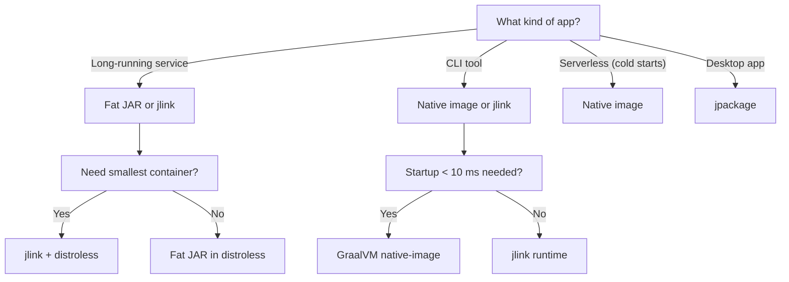

# Java Packaging and Runtime Images

> [!summary] Goal
> Choose the right packaging strategy for your Java application — fat JAR, jlink runtime, or GraalVM native image — and understand the trade-offs in startup time, footprint, and deployment complexity.

## Table of Contents

1. [Packaging Options Overview](#packaging-options-overview)
2. [Fat JAR](#fat-jar)
3. [Layered JAR for Containers](#layered-jar-for-containers)
4. [jlink Custom Runtime](#jlink-custom-runtime)
5. [jpackage Installers](#jpackage-installers)
6. [Comparing With GraalVM Native Image](#comparing-with-graalvm-native-image)
7. [Container Optimizations](#container-optimizations)
8. [How to Choose](#how-to-choose)
9. [Pitfalls](#pitfalls)
10. [Q&A](#qa)

---

## Packaging Options Overview

```mermaid
flowchart TD
    A[Java source] --> B[javac]
    B --> C[.class files]
    C --> D[Fat JAR]
    C --> E[Layered JAR]
    C --> F[jlink runtime image]

    D --> G["java -jar app.jar"]
    E --> H[Docker multi-stage build]
    F --> I[bin/app + lib/]

    C -- "native-image" --> J[Native executable]
    J --> K[Standalone binary]

    F --> L[jpackage]
    L --> M[System installer (.deb, .pkg, .msi)]
```

| Shape | Startup | Footprint | Distribution |
|-------|---------|-----------|-------------|
| Fat JAR | Slow (class scan) | Full JDK | `java -jar app.jar` |
| `jlink` runtime | Fast | Trimmed JDK modules | `tar.gz` runtime folder |
| `jpackage` | Fast | Trimmed + installer | System-native installer |
| Native image | Instant (~0ms) | Minimal (~10 MB) | Single binary |

---

## Fat JAR

A single JAR containing your code plus all dependencies.

### Maven plugin

```xml
<plugin>
    <groupId>org.apache.maven.plugins</groupId>
    <artifactId>maven-shade-plugin</artifactId>
    <version>3.5.1</version>
    <executions>
        <execution>
            <phase>package</phase>
            <goals><goal>shade</goal></goals>
            <configuration>
                <transformers>
                    <transformer implementation="org.apache.maven.plugins.shade.resource.ManifestResourceTransformer">
                        <mainClass>com.example.Main</mainClass>
                    </transformer>
                </transformers>
            </configuration>
        </execution>
    </executions>
</plugin>
```

### Gradle equivalent (Application plugin)

```groovy
plugins {
    id 'application'
}

application {
    mainClass = 'com.example.Main'
}
```

### Pros and cons

| Pros | Cons |
|------|------|
| Simple to build and deploy | Slow startup (class loading, JIT warmup) |
| No infrastructure changes | Full JDK required in container |
| Everything in one file | No module-level encapsulation |

---

## Layered JAR for Containers

Split the JAR into layers that Docker can cache independently.

```dockerfile
FROM eclipse-temurin:21-jdk AS builder
WORKDIR /app
# 1. Copy only dependency descriptors
COPY build.gradle gradle.* settings.gradle ./
COPY gradle/ gradle/
RUN gradle resolveDependencies --no-daemon

# 2. Copy sources and build
COPY src/ src/
RUN gradle build --no-daemon -x test

FROM eclipse-temurin:21-jre
WORKDIR /app
COPY --from=builder /app/build/libs/app.jar app.jar
EXPOSE 8080
ENTRYPOINT ["java", "-jar", "app.jar"]
```

The key insight: dependency layer changes rarely (only when `build.gradle` changes), so Docker caches it across builds.

---

## jlink Custom Runtime

`jlink` creates a minimal JRE containing only the JDK modules your application needs.

### Usage

```bash
# List required modules
jdeps --module-path target/classes -summary target/classes

# Build runtime image
jlink \
  --module-path $JAVA_HOME/jmods:target/classes \
  --add-modules java.base,java.logging,java.sql,jdk.unsupported \
  --output image \
  --compress=2 \
  --no-header-files \
  --no-man-pages
```

### Result

```
image/
  bin/java          # Java launcher
  lib/modules       # Trimmed module set
  conf/             # Runtime configuration
```

### Usage

```bash
image/bin/java --module my.app/com.example.Main
```

### Pros and cons

| Pros | Cons |
|------|------|
| Smaller footprint (~40 MB vs ~300 MB for full JDK) | Requires `jdeps` analysis |
| Faster startup (fewer classes to load) | More complex build pipeline |
| Modules enforce encapsulation | Limited reflection support at runtime |

---

## jpackage Installers

`jpackage` wraps a `jlink` runtime into a native installer.

```bash
jpackage \
  --name MyApp \
  --module my.app/com.example.Main \
  --runtime-image image \
  --dest output \
  --type deb          # deb, rpm, pkg, msi, exe
```

Generates `MyApp.deb` that installs the application as a system package with launcher shortcuts.

---

## Comparing With GraalVM Native Image

| Aspect | Fat JAR | jlink | Native image |
|--------|---------|-------|-------------|
| Startup | ~1-3 s | ~0.5-1 s | ~0-10 ms |
| Memory | ~100+ MB | ~50-80 MB | ~10-30 MB |
| Footprint | Full JDK | Trimmed JDK | Standalone binary |
| Peak perf (JIT) | Highest | Highest | Slightly lower |
| Reflection | Full | Limited | Requires config |
| Build time | Instant | Seconds | Minutes |
| Cross-platform | Any | Same OS | Same OS + arch |

> [!tip] Use native-image for serverless functions or CLIs where startup matters. Use fat JAR or jlink for long-running services where JIT warmup pays off.

---

## Container Optimizations

### Use distroless base images

```dockerfile
FROM gcr.io/distroless/java21-debian12:nonroot
COPY app.jar /app/
WORKDIR /app
ENTRYPOINT ["java", "-jar", "app.jar"]
```

### Docker image size comparison

| Base image | Size |
|------------|------|
| `eclipse-temurin:21-jdk` | ~400 MB |
| `eclipse-temurin:21-jre` | ~280 MB |
| `distroless/java21-debian12` | ~200 MB |
| jlink + distroless/base | ~60 MB |
| Native image (static) | ~15 MB |

### Java 21 container defaults

```dockerfile
ENTRYPOINT ["java", "-XX:+UseZGC", "-XX:+ZGenerational", "-Xmx512m", "-jar", "app.jar"]
```

- `-XX:+UseContainerSupport` is default in JDK 10+.
- Always set `-Xmx` relative to container memory limit.

---

## How to Choose



---

## Pitfalls

- **Building jlink without `jdeps` first** — produces a full JRE image (no size savings). Always run `jdeps` first.
- **Distroless images without debugging tools** — you cannot `exec` into a distroless container and run `jstack`. Use a `debug` variant of distroless or a sidecar.
- **Native image without reflection config** — most frameworks crash at runtime. Run the tracing agent (`native-image-agent`) during a test suite to generate the config.
- **Ignoring CDS (Class Data Sharing)** — for fat JARs, enable AppCDS to reduce startup time: `java -Xshare:dump -jar app.jar`, then `java -Xshare:auto -jar app.jar`.
- **Not pinning base image versions** — `latest` breaks builds unpredictably. Use SHA-pinned digests or strict version tags.

---

## Q&A

> [!question]- Can I use jlink with a framework like Spring Boot?

Yes, but it requires `jdeps` analysis to find the required modules. Spring Boot's auto-configuration and reflection-heavy nature make it harder to module-restrict. jlink still works — you just end up including more modules.

> [!question]- What is the smallest possible Java container?

A GraalVM native image statically linked with `musl` can produce a container under 10 MB. Next smallest is a jlink runtime with `distroless/base` (~40-60 MB).

> [!question]- Does native image support all JDK features?

No. Native image does not support: JMX, JFR, JVMTI, agents (except via native-image agent), dynamic class loading, and some reflection patterns. Check the [GraalVM compatibility guide](https://www.graalvm.org/latest/reference-manual/native-image/Compatibility/) for the full list.

## References

- [jlink JEP 282](https://openjdk.org/jeps/282)
- [jpackage JEP 343](https://openjdk.org/jeps/343)
- [GraalVM Native Image](https://www.graalvm.org/latest/reference-manual/native-image/)
- [Distroless Base Images](https://github.com/GoogleContainerTools/distroless)
- [[Java/01_Foundations/06_Build_Tools_Maven_Gradle]]
- [[Java/03_Advanced/05_GraalVM_Native_Image_and_AOT]]
- [[Java/02_Core/08_Java_in_Production_Services]]
