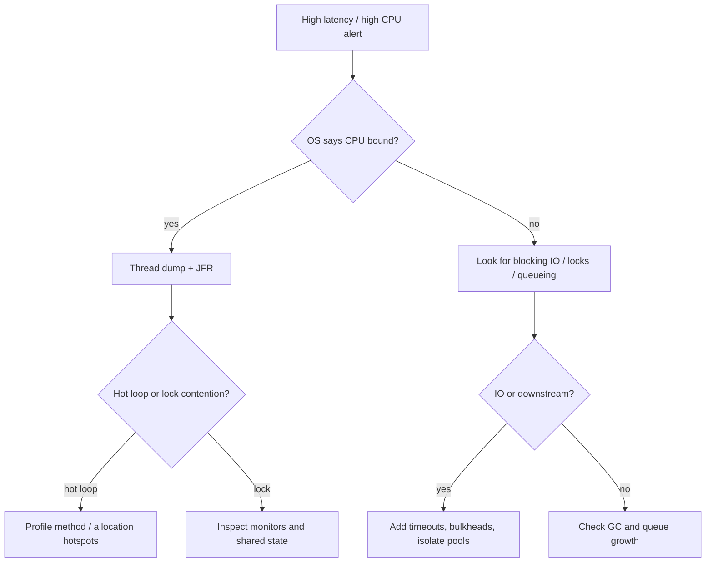

# Playbook: Diagnose High CPU or Latency (Java)

> [!summary] Goal
> Separate CPU saturation, blocking, lock contention, GC, and downstream slowness quickly enough to stop guessing during an incident.

## Triage Flow



---

## Step 1: Start Outside the JVM

Check OS-level evidence first:
- [[Linux/04_Playbooks/01_Investigate_High_CPU_or_Load]]
- `top`, `pidstat`, `vmstat`, container CPU throttling

Questions:
- Is process CPU actually high?
- Is host saturated or just this JVM?
- Is `%iowait` high?
- Is run queue high with low useful work?

If the OS says the process is mostly waiting, do not treat it like a pure CPU bug.

---

## Step 2: Capture a Thread Dump

```bash
jcmd <pid> Thread.print > /tmp/threads.txt
```

Look for:
- many `RUNNABLE` threads with the same stack -> hot loop / hotspot
- many `BLOCKED` threads on the same monitor -> lock contention
- request threads in socket/DB read -> downstream wait
- scheduler/worker threads all busy -> executor saturation

### Typical clues

- `java.util.concurrent.locks` stacks -> explicit lock contention
- `Unsafe.park` / queue waiting -> thread idle or backpressured
- repeated JSON/logging/parsing stacks -> CPU-heavy serialization or formatting

---

## Step 3: Capture JFR for 30-60 Seconds

```bash
jcmd <pid> JFR.start name=profile settings=profile duration=60s filename=/tmp/profile.jfr
```

Use JFR to answer:
- hottest methods
- allocation hotspots
- lock contention events
- thread state distribution
- GC pause contribution

This is usually the fastest way to distinguish:
- real CPU work
- contention
- allocation churn
- blocking disguised as slowness

---

## Step 4: Classify the Problem

## CPU-bound

Symptoms:
- high process CPU
- many hot stacks in RUNNABLE state
- JFR shows one/few methods dominating CPU

Likely causes:
- expensive parsing / regex / serialization
- hot loops
- excessive logging / formatting
- poor algorithmic behavior

## Lock contention

Symptoms:
- many threads blocked on same lock
- JFR lock events show long contention time

Likely causes:
- oversized synchronized blocks
- shared mutable maps / caches
- coarse-grained locking in hot path

## Downstream blocking

Symptoms:
- request workers waiting on DB/network
- executor threads consumed by long external calls

Likely causes:
- missing timeouts
- insufficient pool isolation
- cascading slowdown from dependencies

## GC-related latency

Symptoms:
- pause spikes align with latency spikes
- JFR and GC evidence show allocation pressure or old-gen stress

Likely causes:
- excessive temporary allocation
- large retained working set

---

## Step 5: Common Fixes by Category

### If CPU-bound

- reduce work in hot path
- cache expensive derived values when valid
- remove unnecessary object creation / string formatting
- reconsider algorithm/data structure choice

### If lock-bound

- reduce lock scope
- move to better concurrency primitives
- partition/shard shared state
- use immutable snapshots where possible

### If downstream-bound

- add request and client timeouts
- isolate thread pools by dependency class
- add bulkheads / concurrency limits
- degrade gracefully on slow secondary dependencies

### If GC-related

- reduce allocation churn
- inspect histograms and retained objects
- bound queues/caches/buffers

---

## Common Incident Anti-Patterns

> [!info] Thread dump
> A thread dump shows stack traces of all live threads at a moment in time. It reveals which threads are running, blocked, or waiting on locks. Multiple dumps taken 5-10 seconds apart show whether threads are making progress. Generated with `jstack <pid>`, `kill -3 <pid>`, or `jcmd <pid> Thread.print`.

- taking only one thread dump and declaring victory
- tuning GC before understanding workload shape
- blaming the JVM when the database is the bottleneck
- mixing all workloads in one executor
- ignoring queue depth and only watching CPU

---

> [!question]- Interview Questions
>
> **Q: What is the first distinction to make in a Java latency incident?**
> A: Whether the service is CPU-bound, blocked/waiting, lock-contended, or GC-affected.
>
> **Q: Why are thread dumps useful for CPU incidents?**
> A: They show what threads are doing and whether hot loops, lock contention, or blocking are dominating.
>
> **Q: Why is JFR often better than just stack dumps?**
> A: It correlates CPU, allocations, GC, locks, and thread states over time.

---

## Cross-Links

- [[Java/03_Advanced/03_JVM_Tooling_JFR_JStack_JMap]]
- [[Java/03_Advanced/02_JMM_Volatile_and_Locks]]
- [[Java/02_Core/01_Concurrency_Threads_and_Executors]]

---

## References

- [Java Flight Recorder](https://docs.oracle.com/en/java/)
- [Troubleshooting Guide](https://docs.oracle.com/en/java/javase/)
