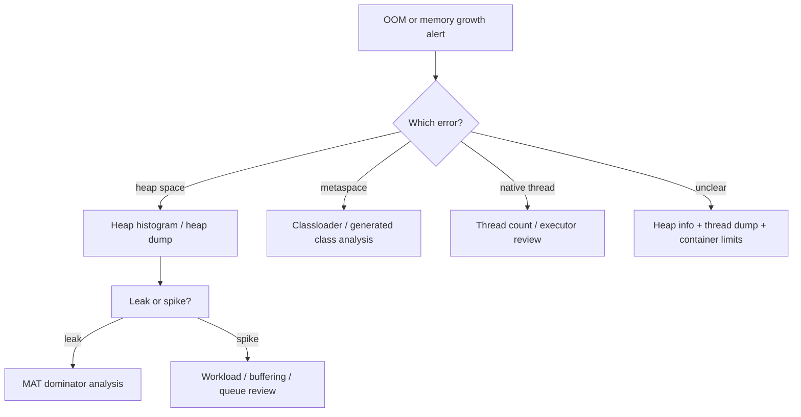

# Playbook: Diagnose OOM and Memory Leaks

> [!info] Memory leak
> A memory leak in Java is when objects are unintentionally retained — they're not needed but are reachable from GC roots, so the garbage collector can't free them. Symptoms: steadily growing heap, increasing GC frequency and pause times, eventual OutOfMemoryError. Unlike C, Java objects can't be explicitly freed; you can only remove references. (Java)

> [!summary] Goal
> Determine whether memory failure is caused by heap retention, metaspace growth, thread explosion, native-memory pressure, or a temporary spike, then collect the minimum evidence needed to fix the real cause.

## Triage Flow



---

## Step 1: Identify the OOM Category

### `java.lang.OutOfMemoryError: Java heap space`

Likely heap retention or mis-sized heap.

### `java.lang.OutOfMemoryError: Metaspace`

Likely class metadata growth:
- classloader leaks
- excessive dynamic proxies / bytecode generation

### `java.lang.OutOfMemoryError: unable to create new native thread`

Usually too many threads, not a classic heap leak.

### Native/direct memory pressure

Can happen with buffers or native integrations even when heap charts look deceptively normal.

---

## Step 2: Capture Evidence Safely

### Thread count and stacks

```bash
jcmd <pid> Thread.print > /tmp/threads.txt
```

Use this when thread explosion or pool misuse is possible.

### Heap histogram

```bash
jcmd <pid> GC.class_histogram > /tmp/histo.txt
```

Fast way to see major object categories.

### Heap info

```bash
jcmd <pid> GC.heap_info
```

### Heap dump (carefully)

```bash
jcmd <pid> GC.heap_dump /tmp/heap.hprof
```

Use when:
- the process is stable enough to survive dump cost
- histogram is not enough
- you need retained-size analysis

---

## Step 3: Decide Leak vs Spike

### Likely leak

Symptoms:
- memory rises over time and does not fall after load subsides
- repeated histograms show the same structures growing
- old-gen occupancy trends upward persistently

### Likely spike / pressure event

Symptoms:
- memory spikes with traffic burst or one heavy job
- retained size drops after workload stabilizes
- objects are large buffers / request payloads / batch artifacts

This distinction matters because a spike may need buffering or concurrency controls, not a classic leak hunt.

---

## Step 4: Analyze the Shape

### In MAT / VisualVM, inspect

- dominator tree
- retained sizes
- GC roots path
- top collections and maps
- thread locals and static references

### Common leak shapes

- unbounded cache / map
- listener registry never cleaned up
- `ThreadLocal` values held by long-lived pool threads
- static references to request/domain objects
- queue that never drains under overload
- repeated classloader creation in plugin/reload systems

### Common spike shapes

- large `byte[]` from buffering/uploads/downloads
- huge JSON/XML parsing trees
- batch job loading too much into memory at once

---

## Step 5: Fix by Category

### Heap retention

- add bounds and eviction to caches
- avoid retaining request-scoped objects globally
- drain or bound queues
- stream data instead of buffering entire payloads

### Metaspace

- stop leaking classloaders
- inspect frameworks generating classes dynamically
- ensure reload/plugin infrastructure releases old loaders

### Thread explosion

- audit executors
- remove uncontrolled thread creation
- cap concurrency and queue depth

### Native/direct memory

- inspect direct buffers and native integrations
- verify container memory and JVM settings together

---

## Operational Warnings

- Heap dumps can be expensive in production.
- Restarting may hide the problem long enough to lose evidence.
- A bigger heap can delay failure without solving the leak.
- Thread-related OOMs often look like memory issues but are concurrency-management issues.

---

> [!question]- Interview Questions
>
> **Q: How do you distinguish a leak from a temporary spike?**
> A: Leaks show sustained growth and retained objects over time; spikes correlate with workload bursts and often recede after demand drops.
>
> **Q: Why can `unable to create new native thread` happen even if heap is fine?**
> A: Because thread stacks consume native memory and OS/JVM thread limits can be exhausted independently of heap.
>
> **Q: What is the first fast memory artifact to capture?**
> A: Often a heap histogram, because it is much cheaper than a full heap dump and still reveals memory shape.

---

## Cross-Links

- [[Java/02_Core/02_JVM_Memory_and_GC_Basics]]
- [[Java/03_Advanced/03_JVM_Tooling_JFR_JStack_JMap]]
- [[Java/03_Advanced/04_Garbage_Collectors_G1_ZGC_Shenandoah]]

---

## References

- [OutOfMemoryError Guide](https://docs.oracle.com/en/java/)
- [Eclipse MAT](https://eclipse.dev/mat/)
