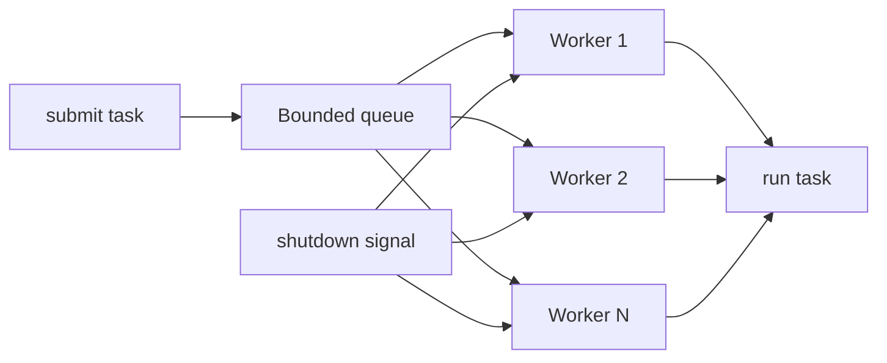

# Project: Build a Thread Pool and Benchmark

> [!summary] Goal
> Build a minimal but production-relevant thread pool so you internalize the relationship between workers, queues, saturation, shutdown, and throughput under load.

## What You Are Building

You will implement a simplified fixed-size thread pool with:
- worker threads
- a bounded task queue
- submit / reject behavior
- graceful shutdown
- forced shutdown via interruption
- basic metrics

This project is valuable because `ThreadPoolExecutor` is easy to use but easy to misuse. Building one by hand makes the failure modes obvious.

---

## Architecture



---

## Requirements

### Minimum

- fixed number of worker threads
- bounded queue
- `submit(Runnable)` either blocks, times out, or rejects when queue is full
- `shutdown()` stops new submissions and drains queued work
- `shutdownNow()` interrupts workers and returns pending tasks if you choose to model that

### Recommended metrics

- current queue depth
- configured worker count
- active worker count
- completed task count
- rejected task count

---

## Suggested API

```java
public interface SimpleExecutor extends AutoCloseable {
    void submit(Runnable task);
    boolean trySubmit(Runnable task, long timeout, TimeUnit unit) throws InterruptedException;
    void shutdown();
    void shutdownNow();
    boolean awaitTermination(long timeout, TimeUnit unit) throws InterruptedException;
}
```

You do not need to match `ExecutorService` exactly. The goal is learning, not cloning the entire JDK surface area.

---

## Suggested Implementation Plan

### Step 1: Model shared state

- bounded `BlockingQueue<Runnable>`
- `List<Thread>` workers
- `AtomicBoolean accepting`
- counters for metrics

### Step 2: Write worker loop

```java
while (accepting.get() || !queue.isEmpty()) {
    Runnable task = queue.poll(100, TimeUnit.MILLISECONDS);
    if (task != null) {
        task.run();
    }
}
```

Then refine for:
- interruption
- metrics
- failure handling inside tasks

### Step 3: Submission policy

Decide explicitly:
- block when full
- reject when full
- timed submit

This is the heart of backpressure behavior.

### Step 4: Shutdown semantics

`shutdown()`:
- stop accepting new work
- let queued work drain

`shutdownNow()`:
- stop accepting new work
- interrupt workers
- optionally return pending tasks

---

## Important Design Questions

### What happens when a task throws?

If a worker thread dies permanently because one task threw, your pool becomes silently smaller over time.

Wrap task execution:

```java
try {
    task.run();
} catch (Throwable t) {
    // record and continue so the worker survives
}
```

### How should workers wake up during shutdown?

Polling with a short timeout is simple.
Blocking indefinitely requires interruption or a poison-pill style strategy.

### Where do metrics live?

Atomics are usually enough for simple counts.

---

## Benchmark Plan

## Workload types

### CPU-bound

- hashing
- compression-like loops
- JSON transform loops

### IO-simulated

- `Thread.sleep(...)`
- fake client calls with delay

### Saturation tests

- queue just below capacity
- queue at capacity
- sustained overload

## Metrics to compare

- throughput (tasks/sec)
- average latency
- tail latency under overload
- rejection count
- queue growth behavior

## Compare against

- your implementation
- `ThreadPoolExecutor`

Use JMH if you want rigorous microbenchmarks, but a controlled harness is enough for learning operational behavior.

---

## What You Should Learn From This Project

- why bounded queues matter
- why one rejected task policy changes system behavior significantly
- why interruption handling is essential for shutdown
- why worker failure isolation matters
- why pool design is really about overload management, not just concurrency

---

> [!question]- Interview Questions
>
> **Q: Why is a bounded queue important in a thread pool?**
> A: It makes overload visible and forces a backpressure/rejection decision instead of hiding the problem behind unbounded latency and memory growth.
>
> **Q: Why should worker threads survive task exceptions?**
> A: Otherwise one bad task can gradually shrink the pool and silently reduce system capacity.
>
> **Q: What is the difference between `shutdown()` and `shutdownNow()`?**
> A: `shutdown()` drains accepted work gracefully; `shutdownNow()` attempts immediate interruption and fast termination.

---

## Cross-Links

- [[Java/02_Core/01_Concurrency_Threads_and_Executors]]
- [[Java/03_Advanced/02_JMM_Volatile_and_Locks]]
- [[SystemDesign/03_Advanced/02_Backpressure_and_Load_Shedding]]

---

## References

- [ExecutorService](https://docs.oracle.com/en/java/javase/17/docs/api/java.base/java/util/concurrent/ExecutorService.html)
- [ThreadPoolExecutor](https://docs.oracle.com/en/java/javase/17/docs/api/java.base/java/util/concurrent/ThreadPoolExecutor.html)
