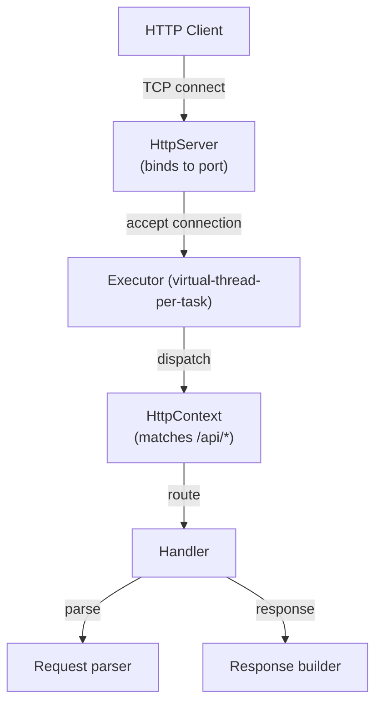

# Project: Build a Simple Web Server

> [!summary] Goal
> Build a functional HTTP/1.1 web server using Java's `com.sun.net.httpserver.HttpServer` (or the `HttpServer` available in JDK), virtual threads for request handling, a simple routing framework, and JSON serialization.

## Table of Contents

1. [Architecture Overview](#architecture-overview)
2. [Core Server](#core-server)
3. [Routing Framework](#routing-framework)
4. [Request Handling with Virtual Threads](#request-handling-with-virtual-threads)
5. [Pitfalls](#pitfalls)

---

## Architecture Overview



---

## Core Server

```java
import com.sun.net.httpserver.HttpServer;
import com.sun.net.httpserver.HttpExchange;
import com.sun.net.httpserver.HttpHandler;
import java.io.*;
import java.net.InetSocketAddress;
import java.nio.charset.StandardCharsets;
import java.util.concurrent.Executors;
import java.util.concurrent.*;

public class SimpleWebServer {
    private final HttpServer server;
    
    public SimpleWebServer(int port) throws IOException {
        server = HttpServer.create(new InetSocketAddress(port), 0);
        
        // Use virtual threads per request (Java 21+)
        server.setExecutor(Executors.newVirtualThreadPerTaskExecutor());
        
        // Register routes
        registerRoutes();
        
        server.start();
        System.out.println("Server started on port " + port);
    }
    
    private void registerRoutes() {
        Router router = new Router();
        router.get("/api/hello", this::handleHello);
        router.get("/api/users/{id}", this::handleGetUser);
        router.post("/api/users", this::handleCreateUser);
        
        // Mount router to a context
        server.createContext("/", router);
    }
    
    private void handleHello(HttpExchange exchange) throws IOException {
        String response = "{\"message\": \"Hello from Java!\"}";
        sendJson(exchange, 200, response);
    }
    
    private void handleGetUser(HttpExchange exchange) throws IOException {
        String path = exchange.getRequestURI().getPath();
        String id = path.substring("/api/users/".length());
        
        String response = "{\"id\": " + id + ", \"name\": \"User " + id + "\"}";
        sendJson(exchange, 200, response);
    }
    
    private void handleCreateUser(HttpExchange exchange) throws IOException {
        String body = new String(exchange.getRequestBody().readAllBytes(),
            StandardCharsets.UTF_8);
        
        String response = "{\"status\": \"created\", \"data\": " + body + "}";
        sendJson(exchange, 201, response);
    }
    
    private void sendJson(HttpExchange exchange, int status, String json) throws IOException {
        exchange.getResponseHeaders().set("Content-Type", "application/json");
        byte[] bytes = json.getBytes(StandardCharsets.UTF_8);
        exchange.sendResponseHeaders(status, bytes.length);
        exchange.getResponseBody().write(bytes);
        exchange.getResponseBody().close();
    }
    
    public static void main(String[] args) throws IOException {
        new SimpleWebServer(8080);
    }
}
```

---

## Routing Framework

```java
import com.sun.net.httpserver.HttpExchange;
import com.sun.net.httpserver.HttpHandler;
import java.io.*;
import java.net.URI;
import java.nio.charset.StandardCharsets;
import java.util.*;
import java.util.regex.*;

public class Router implements HttpHandler {
    private final List<Route> routes = new ArrayList<>();
    
    record Route(String method, Pattern pattern, List<String> paramNames, RouteHandler handler) {}
    
    @FunctionalInterface
    interface RouteHandler {
        void handle(HttpExchange exchange, Map<String, String> params) throws IOException;
    }
    
    public void get(String path, RouteHandler handler) {
        addRoute("GET", path, handler);
    }
    
    public void post(String path, RouteHandler handler) {
        addRoute("POST", path, handler);
    }
    
    public void put(String path, RouteHandler handler) {
        addRoute("PUT", path, handler);
    }
    
    public void delete(String path, RouteHandler handler) {
        addRoute("DELETE", path, handler);
    }
    
    private void addRoute(String method, String path, RouteHandler handler) {
        // Convert "/api/users/{id}" → Pattern "/api/users/([^/]+)"
        List<String> paramNames = new ArrayList<>();
        StringBuilder patternStr = new StringBuilder();
        int i = 0;
        
        while (i < path.length()) {
            if (path.charAt(i) == '{') {
                int end = path.indexOf('}', i);
                if (end != -1) {
                    paramNames.add(path.substring(i + 1, end));
                    patternStr.append("([^/]+)");
                    i = end + 1;
                    continue;
                }
            }
            patternStr.append(path.charAt(i));
            i++;
        }
        
        routes.add(new Route(method, Pattern.compile(patternStr.toString()), paramNames, handler));
    }
    
    @Override
    public void handle(HttpExchange exchange) throws IOException {
        String method = exchange.getRequestMethod();
        String path = exchange.getRequestURI().getPath();
        
        for (Route route : routes) {
            if (!route.method().equals(method)) continue;
            
            Matcher matcher = route.pattern().matcher(path);
            if (matcher.matches()) {
                Map<String, String> params = new HashMap<>();
                for (int i = 0; i < route.paramNames().size(); i++) {
                    params.put(route.paramNames().get(i), matcher.group(i + 1));
                }
                
                try {
                    route.handler().handle(exchange, params);
                } catch (Exception e) {
                    sendError(exchange, 500, "Internal server error: " + e.getMessage());
                }
                return;
            }
        }
        
        sendError(exchange, 404, "Not found: " + method + " " + path);
    }
    
    private void sendError(HttpExchange exchange, int status, String message) throws IOException {
        String json = "{\"error\": \"" + message + "\"}";
        exchange.getResponseHeaders().set("Content-Type", "application/json");
        byte[] bytes = json.getBytes(StandardCharsets.UTF_8);
        exchange.sendResponseHeaders(status, bytes.length);
        exchange.getResponseBody().write(bytes);
        exchange.getResponseBody().close();
    }
}
```

---

## Request Handling with Virtual Threads

```java
// The server uses virtual threads per request automatically
// Each request gets its own virtual thread — no pool management needed
// 10,000 concurrent requests = 10,000 virtual threads

// Middleware pattern
public class MiddlewareRouter implements HttpHandler {
    private final List<Middleware> middlewares = new ArrayList<>();
    private final Router router = new Router();
    
    @FunctionalInterface
    interface Middleware {
        boolean handle(HttpExchange exchange) throws IOException;  // true = continue, false = stop
    }
    
    public void addMiddleware(Middleware mw) {
        middlewares.add(mw);
    }
    
    @Override
    public void handle(HttpExchange exchange) throws IOException {
        // Run middleware chain
        for (Middleware mw : middlewares) {
            if (!mw.handle(exchange)) return;
        }
        router.handle(exchange);
    }
}

// Usage
MiddlewareRouter app = new MiddlewareRouter();
app.addMiddleware(exchange -> {
    // Logging middleware
    System.out.println(exchange.getRequestMethod() + " " + exchange.getRequestURI());
    return true;  // Continue to next middleware or handler
});
app.addMiddleware(exchange -> {
    // Auth middleware (example)
    String auth = exchange.getRequestHeaders().getFirst("Authorization");
    if (auth == null || !auth.startsWith("Bearer ")) {
        sendError(exchange, 401, "Unauthorized");
        return false;  // Stop chain
    }
    return true;
});
```

---

## Pitfalls

### Blocking the virtual thread thread

With virtual threads, avoid synchronized blocks in request handlers (they pin the VT). Use `ReentrantLock` or thread-safe data structures instead.

### Not closing response body

Always close `exchange.getResponseBody()` after writing. Failing to close it leaves the connection open — the client waits for more data. Use try-with-resources or close in a finally block.

### Large bodies in memory

`exchange.getRequestBody().readAllBytes()` loads the entire body into memory. For large payloads, stream the data with `getRequestBody().read(buffer)` instead.

### Thread pool sizing

Virtual threads don't need a thread pool — use `Executors.newVirtualThreadPerTaskExecutor()`. If you use platform threads, size the pool to available processors for CPU-bound work, or use a larger pool for I/O-bound work.

---

## Cross-Links

- [[Java/03_Advanced/11_Networking_and_HTTP_Client]] for HTTP client usage
- [[Java/03_Advanced/06_Virtual_Threads_and_Structured_Concurrency]] for virtual threads
- [[Java/01_Foundations/04_Streams_Lambdas_and_Functional_Java]] for functional composition
- [[Java/01_Foundations/07_Testing_with_JUnit_and_Mockito]] for testing the server
- [[Java/03_Advanced/09_Reflection_and_Annotations]] for annotation-based routing
