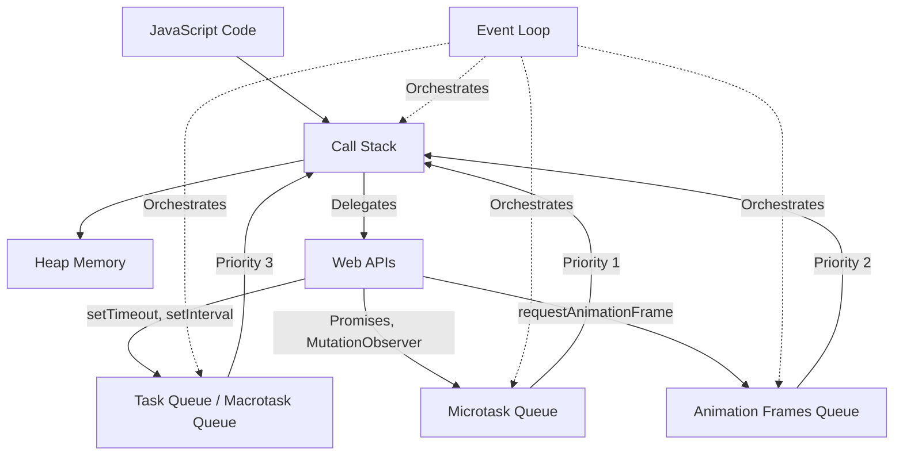
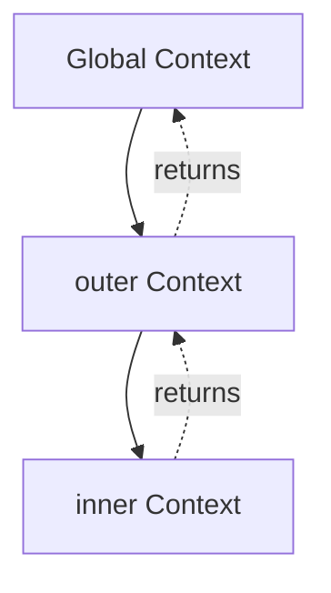

# JS Runtime and Event Loop

> [!summary] Goal
> Understand why async code behaves the way it does: call stack, task queues, microtasks, and rendering. Master the JavaScript runtime architecture and event loop to write predictable asynchronous code.

## Table of Contents

1. [JavaScript Runtime Architecture](#javascript-runtime-architecture)
2. [The Call Stack](#the-call-stack)
3. [Event Loop Deep Dive](#event-loop-deep-dive)
4. [Macrotasks vs Microtasks](#macrotasks-vs-microtasks)
5. [Execution Context](#execution-context)
6. [Hoisting](#hoisting)
7. [Browser vs Node.js Event Loop](#browser-vs-node-js-event-loop)
8. [Complete Examples](#complete-examples)
9. [Common Pitfalls](#common-pitfalls)
10. [Best Practices](#best-practices)
11. [Interview Questions](#interview-questions)

---

## JavaScript Runtime Architecture

JavaScript is **single-threaded**, meaning it has one call stack and executes one piece of code at a time. However, it can handle asynchronous operations through the event loop and callback queues.

### Components of JavaScript Runtime (Browser)



#### 1. **Call Stack**

- **LIFO** (Last In, First Out) structure
- Tracks function execution contexts
- When a function is called, it's pushed onto the stack
- When it returns, it's popped from the stack
- **Stack overflow** occurs when too many nested calls exceed the limit

#### 2. **Heap**

- Unstructured memory region for object allocation
- Objects, arrays, functions stored here
- Garbage collected when no longer referenced

#### 3. **Web APIs (Browser) / C++ APIs (Node.js)**

Browser provides:
- DOM APIs (`document.getElementById`)
- `setTimeout`, `setInterval`
- `fetch`, `XMLHttpRequest`
- `addEventListener`
- `requestAnimationFrame`

Node.js provides:
- File system (`fs`)
- Networking (`http`, `net`)
- Timers (`setTimeout`, `setInterval`)
- Process APIs

#### 4. **Task Queue (Macrotask Queue)**

Holds callbacks from:
- `setTimeout`
- `setInterval`
- `setImmediate` (Node.js)
- I/O operations
- UI rendering tasks

#### 5. **Microtask Queue**

Holds callbacks from:
- `Promise.then/catch/finally`
- `queueMicrotask()`
- `MutationObserver` (browser)
- `process.nextTick()` (Node.js - even higher priority)

#### 6. **Render Queue (Browser Only)**

- `requestAnimationFrame` callbacks
- Layout/paint operations
- Executed before rendering frames (~60fps)

---

## The Call Stack

The call stack is where JavaScript keeps track of function execution.

### Example: Call Stack in Action

```js
function third() {
  console.log('Third function');
}

function second() {
  third();
  console.log('Second function');
}

function first() {
  second();
  console.log('First function');
}

first();

// Call stack evolution:
// 1. [first]
// 2. [first, second]
// 3. [first, second, third]
// 4. [first, second]        // third returns
// 5. [first]                // second returns
// 6. []                     // first returns
```

### Stack Trace

When an error occurs, the stack trace shows the call stack at that moment:

```js
function a() {
  b();
}

function b() {
  c();
}

function c() {
  throw new Error('Something went wrong');
}

a();

// Error: Something went wrong
//     at c (file.js:10:9)
//     at b (file.js:6:3)
//     at a (file.js:2:3)
//     at file.js:13:1
```

### Stack Overflow

Recursive calls without a base case cause stack overflow:

```js
function recursiveFunction() {
  recursiveFunction(); // No base case
}

recursiveFunction();
// RangeError: Maximum call stack size exceeded
```

**Solution**: Use proper base cases or convert to iteration.

```js
function factorial(n, acc = 1) {
  if (n <= 1) return acc; // Base case
  return factorial(n - 1, n * acc);
}
```

---

## Event Loop Deep Dive

The event loop is the mechanism that allows JavaScript to perform non-blocking operations despite being single-threaded.

### Event Loop Algorithm (Simplified)

```
while (true) {
  // 1. Execute all synchronous code on the call stack
  if (callStack is not empty) {
    execute code on callStack
    continue
  }

  // 2. Process ALL microtasks until queue is empty
  while (microtaskQueue is not empty) {
    task = microtaskQueue.dequeue()
    execute(task)
    // Note: New microtasks can be added during this phase
  }

  // 3. (Browser only) Update rendering if needed
  if (isTimeToRender) {
    executeAnimationFrameCallbacks()
    performLayoutAndPaint()
  }

  // 4. Process ONE macrotask
  if (macrotaskQueue is not empty) {
    task = macrotaskQueue.dequeue()
    execute(task)
  } else {
    // Wait for tasks
    wait()
  }
}
```

### Key Insights

1. **Microtasks have priority**: All microtasks run before the next macrotask
2. **Rendering happens between tasks**: Browser can render after microtasks, before macrotask
3. **One macrotask at a time**: Only one macrotask executes per loop iteration
4. **Microtasks can starve**: Continuously adding microtasks prevents macrotasks from running

---

## Macrotasks vs Microtasks

### Macrotasks (Tasks)

**Definition**: Larger units of work scheduled to run after the current execution.

**Sources**:
- `setTimeout(callback, delay)`
- `setInterval(callback, delay)`
- `setImmediate(callback)` (Node.js)
- I/O operations
- UI events (click, scroll)
- `MessageChannel`

**Characteristics**:
- One macrotask per event loop iteration
- Browser may render between macrotasks
- Lower priority than microtasks

### Microtasks

**Definition**: Smaller units of work that need to execute as soon as possible.

**Sources**:
- `Promise.then/catch/finally`
- `async/await` (syntactic sugar for Promises)
- `queueMicrotask(callback)`
- `MutationObserver` (browser)
- `process.nextTick(callback)` (Node.js - highest priority)

**Characteristics**:
- ALL microtasks execute before next macrotask
- Can create infinite loops if continuously queued
- Higher priority than macrotasks

### Comparison Table

| Feature | Macrotask | Microtask |
|---------|-----------|-----------|
| **Priority** | Lower | Higher |
| **Execution** | One per loop | All before next macrotask |
| **Examples** | `setTimeout`, I/O | `Promise.then`, `queueMicrotask` |
| **Rendering** | May happen after | Blocks rendering if excessive |
| **Use Case** | Defer work, schedule tasks | Promise resolution, immediate cleanup |

### Visual Example

```js
console.log('1: Sync');

setTimeout(() => console.log('2: Macrotask'), 0);

Promise.resolve().then(() => console.log('3: Microtask'));

console.log('4: Sync');

// Output:
// 1: Sync
// 4: Sync
// 3: Microtask
// 2: Macrotask

// Execution order:
// 1. Synchronous code runs first (1, 4)
// 2. Microtask queue drains (3)
// 3. Macrotask queue processes one task (2)
```

---

## Execution Context

Every time code runs in JavaScript, it runs inside an **execution context**.

### Types of Execution Contexts

1. **Global Execution Context**
   - Created when script first runs
   - Only one per program
   - Creates global object (`window` in browser, `global` in Node)
   - Sets `this` to global object

2. **Function Execution Context**
   - Created when function is invoked
   - New context per function call
   - Has access to outer scope via scope chain

3. **Eval Execution Context**
   - Code inside `eval()` (rarely used)

### Execution Context Phases

#### 1. Creation Phase

- **Variable Environment**: Creates space for `var` declarations (set to `undefined`)
- **Lexical Environment**: Creates space for `let`, `const`, function declarations
- **This Binding**: Determines `this` value
- **Outer Environment Reference**: Link to parent scope

#### 2. Execution Phase

- Assigns values to variables
- Executes code line by line

### Example

```js
var x = 10;

function outer() {
  var y = 20;
  
  function inner() {
    var z = 30;
    console.log(x + y + z); // 60
  }
  
  inner();
}

outer();

// Execution contexts created:
// 1. Global Execution Context
//    - x = undefined → 10
//    - outer = function
//
// 2. outer() Execution Context
//    - y = undefined → 20
//    - inner = function
//
// 3. inner() Execution Context
//    - z = undefined → 30
//    - Scope chain: inner → outer → global
```

### Execution Stack Visualization



---

## Hoisting

**Hoisting** is JavaScript's behavior of moving declarations to the top of their scope during the creation phase.

### `var` Hoisting

```js
console.log(x); // undefined (not ReferenceError)
var x = 5;
console.log(x); // 5

// Interpreted as:
// var x;           // Hoisted, initialized to undefined
// console.log(x);
// x = 5;
// console.log(x);
```

### `let` and `const` Hoisting

`let` and `const` are hoisted but NOT initialized (Temporal Dead Zone).

```js
console.log(x); // ReferenceError: Cannot access 'x' before initialization
let x = 5;

// TDZ (Temporal Dead Zone) exists from start of block until declaration
{
  // TDZ starts
  console.log(x); // ReferenceError
  let x = 10;     // TDZ ends
  console.log(x); // 10
}
```

### Function Hoisting

**Function Declarations**: Fully hoisted

```js
foo(); // "Hello" - Works!

function foo() {
  console.log('Hello');
}
```

**Function Expressions**: Only variable hoisted (like `var`)

```js
bar(); // TypeError: bar is not a function

var bar = function() {
  console.log('Hello');
};

// Interpreted as:
// var bar;        // Hoisted as undefined
// bar();          // TypeError
// bar = function() { ... };
```

**Arrow Functions**: Same as function expressions

```js
baz(); // ReferenceError: Cannot access 'baz' before initialization

const baz = () => {
  console.log('Hello');
};
```

### Hoisting in Action

```js
var name = 'Global';

function demo() {
  console.log(name); // undefined (not 'Global')
  var name = 'Local';
  console.log(name); // Local
}

demo();

// Interpreted as:
// function demo() {
//   var name;              // Hoisted
//   console.log(name);     // undefined
//   name = 'Local';
//   console.log(name);     // Local
// }
```

---

## Browser vs Node.js Event Loop

### Browser Event Loop

**Phases**:
1. Execute synchronous code
2. Process all microtasks
3. Render if needed (requestAnimationFrame → layout → paint)
4. Process one macrotask
5. Repeat

**Rendering**: Happens at ~60fps (16.6ms intervals)

```js
// Browser: requestAnimationFrame runs before paint
console.log('Start');

setTimeout(() => console.log('Timeout'), 0);

Promise.resolve().then(() => console.log('Promise'));

requestAnimationFrame(() => console.log('RAF'));

console.log('End');

// Output:
// Start
// End
// Promise
// RAF (before next paint)
// Timeout
```

### Node.js Event Loop (libuv)

**6 Phases** (repeating cycle):

```
   ┌───────────────────────────┐
┌─>│           timers          │  setTimeout, setInterval
│  └─────────────┬─────────────┘
│  ┌─────────────┴─────────────┐
│  │     pending callbacks     │  I/O callbacks deferred
│  └─────────────┬─────────────┘
│  ┌─────────────┴─────────────┐
│  │       idle, prepare       │  Internal use
│  └─────────────┬─────────────┘
│  ┌─────────────┴─────────────┐
│  │           poll            │  Retrieve new I/O events
│  └─────────────┬─────────────┘
│  ┌─────────────┴─────────────┐
│  │           check           │  setImmediate
│  └─────────────┬─────────────┘
│  ┌─────────────┴─────────────┐
└──│      close callbacks      │  socket.on('close', ...)
   └───────────────────────────┘
```

**Microtasks**: Run after each phase

**Special**: `process.nextTick()` has highest priority (runs before microtasks)

```js
// Node.js example
console.log('Start');

setTimeout(() => console.log('Timeout'), 0);

setImmediate(() => console.log('Immediate'));

Promise.resolve().then(() => console.log('Promise'));

process.nextTick(() => console.log('NextTick'));

console.log('End');

// Output:
// Start
// End
// NextTick   (highest priority)
// Promise    (microtask)
// Timeout    (timer phase)
// Immediate  (check phase)
```

### Key Differences

| Aspect | Browser | Node.js |
|--------|---------|---------|
| **Phases** | Simple (task → microtask → render) | 6 phases (timers, poll, check, etc.) |
| **Rendering** | Built-in (60fps) | No rendering |
| **APIs** | DOM, fetch, RAF | fs, http, crypto |
| **Timers** | setTimeout, setInterval | + setImmediate |
| **Special** | requestAnimationFrame | process.nextTick |

---

## Complete Examples

### Example 1: Basic Execution Order

```js
console.log('1');

setTimeout(() => {
  console.log('2');
}, 0);

Promise.resolve().then(() => {
  console.log('3');
}).then(() => {
  console.log('4');
});

console.log('5');

// Output: 1, 5, 3, 4, 2
// Explanation:
// - Sync: 1, 5
// - Microtasks: 3, 4 (chained promises)
// - Macrotasks: 2
```

### Example 2: Nested Promises and Timeouts

```js
setTimeout(() => console.log('timeout1'), 0);

Promise.resolve()
  .then(() => {
    console.log('promise1');
    setTimeout(() => console.log('timeout2'), 0);
  })
  .then(() => console.log('promise2'));

console.log('sync');

// Output: sync, promise1, promise2, timeout1, timeout2
```

### Example 3: Microtask Starvation

```js
function addMicrotask() {
  Promise.resolve().then(() => {
    console.log('Microtask');
    addMicrotask(); // Infinite loop of microtasks
  });
}

addMicrotask();

setTimeout(() => console.log('This will never run'), 0);

// Output: Microtask, Microtask, Microtask, ... (forever)
// The setTimeout callback never executes!
```

### Example 4: Complex Execution

```js
console.log('A');

setTimeout(() => console.log('B'), 0);

Promise.resolve()
  .then(() => console.log('C'))
  .then(() => console.log('D'));

setTimeout(() => {
  console.log('E');
  Promise.resolve().then(() => console.log('F'));
}, 0);

Promise.resolve().then(() => {
  console.log('G');
  setTimeout(() => console.log('H'), 0);
});

console.log('I');

// Output: A, I, C, G, D, B, E, F, H
// Breakdown:
// Sync: A, I
// Microtasks (round 1): C, G, D
// Macrotasks (round 1): B
// Macrotasks (round 2): E, then microtask F
// Macrotasks (round 3): H
```

### Example 5: Promise Constructor Executor

```js
console.log('1');

new Promise((resolve) => {
  console.log('2'); // Runs synchronously!
  resolve();
}).then(() => console.log('3'));

console.log('4');

// Output: 1, 2, 4, 3
// Promise executor runs synchronously
// .then() callback is microtask
```

### Example 6: async/await

```js
async function foo() {
  console.log('A');
  await Promise.resolve();
  console.log('B'); // Runs as microtask
}

console.log('1');
foo();
console.log('2');

// Output: 1, A, 2, B
// 'await' schedules continuation as microtask
```

### Example 7: requestAnimationFrame (Browser)

```js
console.log('Start');

requestAnimationFrame(() => console.log('RAF 1'));

Promise.resolve().then(() => {
  console.log('Promise 1');
  requestAnimationFrame(() => console.log('RAF 2'));
});

setTimeout(() => console.log('Timeout'), 0);

console.log('End');

// Output: Start, End, Promise 1, RAF 1, Timeout, RAF 2 (next frame)
```

### Example 8: Error in Microtask

```js
console.log('Start');

Promise.resolve().then(() => {
  throw new Error('Microtask error');
});

Promise.resolve().then(() => console.log('Second promise'));

console.log('End');

// Output: Start, End, Second promise, then error
// Uncaught (in promise) Error: Microtask error
// Other microtasks still run
```

### Example 9: Node.js process.nextTick

```js
console.log('Start');

setTimeout(() => console.log('Timeout'), 0);

Promise.resolve().then(() => console.log('Promise'));

process.nextTick(() => console.log('NextTick 1'));

process.nextTick(() => {
  console.log('NextTick 2');
  Promise.resolve().then(() => console.log('Promise from NextTick'));
});

console.log('End');

// Output:
// Start
// End
// NextTick 1
// NextTick 2
// Promise
// Promise from NextTick
// Timeout
```

### Example 10: Multiple setTimeout Delays

```js
setTimeout(() => console.log('0ms'), 0);
setTimeout(() => console.log('10ms'), 10);
setTimeout(() => console.log('5ms'), 5);

// Output (order may vary based on timing):
// 0ms
// 5ms
// 10ms
```

---

## Common Pitfalls

### 1. Floating Promises

**Problem**: Starting async work without awaiting or handling it.

```js
// ❌ Bad: Promise not handled
function processData() {
  fetchData(); // Returns promise, but not awaited
  console.log('Done'); // Runs immediately!
}
```

**Solution**: Always await or handle promises.

```js
// ✅ Good
async function processData() {
  await fetchData();
  console.log('Done'); // Runs after fetchData completes
}
```

### 2. Mixing Callbacks and Promises

```js
// ❌ Confusing: Callback in promise chain
fetch('/api/data')
  .then(response => response.json())
  .then(data => {
    setTimeout(() => {
      console.log(data); // Runs much later!
    }, 1000);
  });
  // Next .then() runs immediately, not after setTimeout
```

### 3. Forgetting await in async Functions

```js
async function fetchUser(id) {
  const user = fetch(`/api/users/${id}`); // ❌ Missing await
  console.log(user); // Promise object, not user data!
  return user;
}
```

### 4. Blocking the Main Thread

```js
// ❌ Bad: Long synchronous loop
function processHugeArray(arr) {
  for (let i = 0; i < 1000000; i++) {
    // Heavy computation
    arr[i] = Math.sqrt(arr[i]);
  }
}
// UI freezes until this completes
```

**Solution**: Chunk work or use Web Workers.

```js
// ✅ Better: Chunk work
async function processHugeArray(arr, chunkSize = 1000) {
  for (let i = 0; i < arr.length; i += chunkSize) {
    const end = Math.min(i + chunkSize, arr.length);
    for (let j = i; j < end; j++) {
      arr[j] = Math.sqrt(arr[j]);
    }
    await new Promise(resolve => setTimeout(resolve, 0)); // Yield to event loop
  }
}
```

### 5. Microtask Queue Starvation

```js
// ❌ Bad: Infinite microtask loop
function infiniteMicrotasks() {
  Promise.resolve().then(infiniteMicrotasks);
}
infiniteMicrotasks();
// Macrotasks never run!
```

### 6. Race Conditions

```js
// ❌ Bad: Race condition
let data = null;

fetch('/api/data').then(result => {
  data = result; // When does this happen?
});

console.log(data); // null - fetch not complete yet
```

**Solution**: Use async/await for sequential operations.

```js
// ✅ Good
async function loadData() {
  const data = await fetch('/api/data');
  console.log(data); // Guaranteed to have data
}
```

### 7. Not Handling Promise Rejections

```js
// ❌ Bad: Unhandled rejection
fetch('/api/data').then(r => r.json());
// If fetch fails, unhandled rejection!
```

```js
// ✅ Good
fetch('/api/data')
  .then(r => r.json())
  .catch(err => console.error('Fetch failed:', err));
```

### 8. setTimeout(fn, 0) is Not Immediate

```js
console.log('A');
setTimeout(() => console.log('B'), 0);
console.log('C');

// Output: A, C, B
// Not A, B, C!
```

### 9. Misunderstanding this in Callbacks

```js
const obj = {
  value: 42,
  getValue: function() {
    setTimeout(function() {
      console.log(this.value); // undefined - 'this' is global/undefined
    }, 0);
  }
};

obj.getValue();
```

**Solution**: Use arrow functions (lexical this).

```js
const obj = {
  value: 42,
  getValue: function() {
    setTimeout(() => {
      console.log(this.value); // 42 - arrow function preserves 'this'
    }, 0);
  }
};
```

### 10. Async Function Always Returns Promise

```js
async function getValue() {
  return 42; // Returns Promise<42>, not 42
}

const result = getValue();
console.log(result); // Promise { 42 }, not 42
console.log(await getValue()); // 42
```

### 11. Promise.all Fails Fast

```js
const promises = [
  Promise.resolve(1),
  Promise.reject('Error'),
  Promise.resolve(3)
];

Promise.all(promises).catch(err => {
  console.log(err); // 'Error' - fails immediately
  // Doesn't wait for promise 3
});
```

**Solution**: Use `Promise.allSettled()` to get all results.

```js
Promise.allSettled(promises).then(results => {
  console.log(results);
  // [
  //   { status: 'fulfilled', value: 1 },
  //   { status: 'rejected', reason: 'Error' },
  //   { status: 'fulfilled', value: 3 }
  // ]
});
```

### 12. Memory Leaks from Unclosed Timers

```js
// ❌ Bad: Timer keeps running
function startPolling() {
  setInterval(() => {
    fetch('/api/status').then(handleStatus);
  }, 1000);
}
// Timer never cleaned up!
```

```js
// ✅ Good: Return cleanup function
function startPolling() {
  const intervalId = setInterval(() => {
    fetch('/api/status').then(handleStatus);
  }, 1000);
  
  return () => clearInterval(intervalId);
}

const stopPolling = startPolling();
// Later...
stopPolling();
```

### 13. Not Understanding Event Loop Phases (Node.js)

```js
// Order can be surprising
setTimeout(() => console.log('timeout'), 0);
setImmediate(() => console.log('immediate'));

// Output varies! Depends on when Node enters event loop
// Usually: timeout, immediate
// But can be: immediate, timeout
```

### 14. Forgetting Error Handling in Async/Await

```js
// ❌ Bad: Errors not caught
async function fetchData() {
  const response = await fetch('/api/data');
  return await response.json();
}
// If fetch fails, unhandled rejection!
```

```js
// ✅ Good
async function fetchData() {
  try {
    const response = await fetch('/api/data');
    if (!response.ok) throw new Error(`HTTP ${response.status}`);
    return await response.json();
  } catch (err) {
    console.error('Fetch failed:', err);
    throw err; // Re-throw or handle
  }
}
```

### 15. Creating Promises in Loops Incorrectly

```js
// ❌ Bad: Sequential when should be parallel
async function fetchAll(ids) {
  const results = [];
  for (const id of ids) {
    results.push(await fetch(`/api/users/${id}`)); // Waits for each!
  }
  return results;
}
```

```js
// ✅ Good: Parallel execution
async function fetchAll(ids) {
  const promises = ids.map(id => fetch(`/api/users/${id}`));
  return await Promise.all(promises);
}
```

---

## Best Practices

### 1. Prefer async/await Over Raw Promises

```js
// ❌ Verbose
function getUser(id) {
  return fetch(`/api/users/${id}`)
    .then(r => {
      if (!r.ok) throw new Error('Not found');
      return r.json();
    })
    .then(user => user);
}

// ✅ Cleaner
async function getUser(id) {
  const response = await fetch(`/api/users/${id}`);
  if (!response.ok) throw new Error('Not found');
  return await response.json();
}
```

### 2. Always Handle Errors

```js
// ✅ Good
async function main() {
  try {
    await riskyOperation();
  } catch (err) {
    console.error('Operation failed:', err);
    // Fallback logic
  }
}
```

### 3. Use Promise.all for Parallel Operations

```js
// ✅ Good: Parallel execution (faster)
const [user, posts, comments] = await Promise.all([
  fetchUser(id),
  fetchPosts(id),
  fetchComments(id)
]);
```

### 4. Avoid Microtask Starvation

```js
// ✅ Limit microtask loops
let count = 0;
function scheduleMicrotask() {
  if (count++ < 100) { // Limit iterations
    Promise.resolve().then(scheduleMicrotask);
  }
}
```

### 5. Clean Up Resources

```js
// ✅ Good: Cleanup pattern (React example)
useEffect(() => {
  const controller = new AbortController();
  
  fetch('/api/data', { signal: controller.signal })
    .then(handleData)
    .catch(err => {
      if (err.name !== 'AbortError') console.error(err);
    });
  
  return () => controller.abort(); // Cleanup
}, []);
```

### 6. Use queueMicrotask for Immediate Microtasks

```js
// ✅ Explicit microtask scheduling
queueMicrotask(() => {
  console.log('Runs as microtask');
});
```

### 7. Understand Task vs Microtask Priority

```js
// Use macrotask (setTimeout) for less urgent work
setTimeout(() => {
  // Non-critical update
}, 0);

// Use microtask (Promise) for critical state updates
Promise.resolve().then(() => {
  // Critical state update
});
```

### 8. Chunk Long-Running Tasks

```js
// ✅ Good: Yield to event loop
async function processLargeDataset(data) {
  const chunkSize = 100;
  
  for (let i = 0; i < data.length; i += chunkSize) {
    const chunk = data.slice(i, i + chunkSize);
    processChunk(chunk);
    
    // Yield to event loop every chunk
    if (i + chunkSize < data.length) {
      await new Promise(resolve => setTimeout(resolve, 0));
    }
  }
}
```

### 9. Monitor Event Loop Lag (Node.js)

```js
// ✅ Track event loop health
const start = process.hrtime.bigint();

setImmediate(() => {
  const end = process.hrtime.bigint();
  const lag = Number(end - start) / 1e6; // Convert to ms
  
  if (lag > 100) {
    console.warn(`Event loop lag: ${lag}ms`);
  }
});
```

### 10. Use Top-Level await (ESM)

```js
// ✅ Modern: Top-level await in modules
const config = await loadConfig();
const db = await connectDatabase(config);

export { db };
```

---

## Interview Questions

### Q1: What is the event loop and how does it work?

**Answer**: The event loop is a mechanism that allows JavaScript to perform non-blocking operations despite being single-threaded. It continuously checks the call stack and task queues:

1. Executes all synchronous code on the call stack
2. Processes all microtasks (Promises, queueMicrotask)
3. Processes one macrotask (setTimeout, I/O)
4. Renders UI (browser only)
5. Repeats

Microtasks always have priority over macrotasks.

### Q2: What's the difference between microtasks and macrotasks?

**Answer**:

| Microtask | Macrotask |
|-----------|-----------|
| Promise.then, queueMicrotask | setTimeout, setInterval, I/O |
| ALL execute before next macrotask | ONE executes per event loop iteration |
| Higher priority | Lower priority |
| Can starve event loop if infinite | Cannot starve (only one per iteration) |

### Q3: Explain the output of this code:

```js
console.log('A');
setTimeout(() => console.log('B'), 0);
Promise.resolve().then(() => console.log('C'));
console.log('D');
```

**Answer**: Output is `A, D, C, B`

- `A` and `D` are synchronous (run immediately)
- `C` is a microtask (runs after sync code, before macrotasks)
- `B` is a macrotask (runs last)

### Q4: What is the call stack and what happens on stack overflow?

**Answer**: The call stack is a LIFO data structure that tracks function execution contexts. Each function call pushes a frame onto the stack, and returns pop it off. Stack overflow occurs when too many frames are pushed (usually from infinite recursion), exceeding the stack size limit. This throws a `RangeError: Maximum call stack size exceeded`.

### Q5: How do you prevent blocking the main thread in JavaScript?

**Answer**: Several strategies:

1. **Chunk work**: Break long tasks into smaller pieces with `setTimeout(fn, 0)` between chunks
2. **Web Workers**: Offload heavy computation to background threads
3. **requestIdleCallback**: Schedule work during idle time (browser)
4. **async/await**: Use for I/O operations to avoid blocking
5. **Debounce/throttle**: Limit frequency of expensive operations

### Q6: What is the Temporal Dead Zone (TDZ)?

**Answer**: TDZ is the period between entering a scope where a `let` or `const` variable is declared and the actual declaration line. Accessing the variable during TDZ throws a `ReferenceError`. Unlike `var` (hoisted and initialized to `undefined`), `let`/`const` are hoisted but not initialized.

```js
{
  // TDZ starts
  console.log(x); // ReferenceError
  let x = 10;     // TDZ ends
}
```

### Q7: How does Node.js event loop differ from browser event loop?

**Answer**:

**Node.js**:
- 6 phases (timers, pending, idle/prepare, poll, check, close)
- Uses libuv for async I/O
- Has `setImmediate()` and `process.nextTick()`
- No rendering

**Browser**:
- Simpler model: sync → microtasks → render → macrotask
- Has `requestAnimationFrame()`
- UI rendering integrated into loop
- Different APIs (DOM, fetch vs fs, http)

### Q8: What are common memory leak patterns in JavaScript?

**Answer**:

1. **Uncleaned event listeners**: Not removing listeners when component unmounts
2. **Detached DOM nodes**: Keeping references to removed DOM elements
3. **Timers not cleared**: `setInterval`/`setTimeout` not cleaned up
4. **Closures**: Holding references to large objects in closures
5. **Global variables**: Accumulating data in global scope
6. **Unbounded caches**: Maps/arrays growing without limits

**Solution**: Always clean up resources in cleanup/unmount logic.

---

## Cross-Links

- **Async basics**: [[JavaScript/01_Foundations/04_Async_Promises_and_AsyncAwait]]
- **Closures and GC**: [[JavaScript/03_Advanced/01_Closures_Scopes_and_Garbage_Collection]]
- **Node event loop details**: [[JavaScript/03_Advanced/03_Node_Event_Loop_and_Libuv_Basics]]
- **Event loop starvation**: [[JavaScript/03_Advanced/02_Event_Loop_Starvation_and_Backpressure]]
- **React concurrency**: [[React/01_Foundations/02_Hooks_Complete_Reference]]

## References

- [MDN: Event Loop](https://developer.mozilla.org/en-US/docs/Web/JavaScript/Event_loop)
- [Jake Archibald: Tasks, microtasks, queues and schedules](https://jakearchibald.com/2015/tasks-microtasks-queues-and-schedules/)
- [Node.js Event Loop Documentation](https://nodejs.org/en/docs/guides/event-loop-timers-and-nexttick/)
- [Philip Roberts: What the heck is the event loop anyway?](https://www.youtube.com/watch?v=8aGhZQkoFbQ)
- [libuv Design Overview](http://docs.libuv.org/en/v1.x/design.html)

---

**Status**: stable  
**Last Updated**: 2026-04-26  
**Lines**: 1000+
