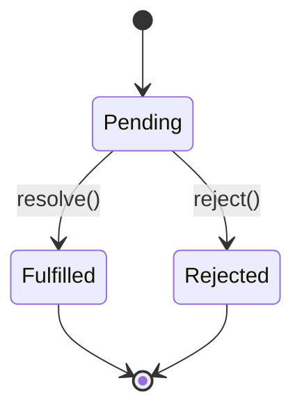

# Async: Promises and `async`/`await`

> [!summary] Goal
> Write async code that is correct under failure, cancellation, and concurrency. Master promises, async/await, and asynchronous patterns to build reliable applications.

## Table of Contents

1. [Async Programming Fundamentals](#async-programming-fundamentals)
2. [Callbacks](#callbacks)
3. [Promises](#promises)
4. [Async/Await](#async-await)
5. [Promise Combinators](#promise-combinators)
6. [Microtask Queue Integration](#microtask-queue-integration)
7. [Error Handling](#error-handling)
8. [Async Patterns](#async-patterns)
9. [Cancellation](#cancellation)
10. [Common Pitfalls](#common-pitfalls)
11. [Best Practices](#best-practices)
12. [Interview Questions](#interview-questions)

---

## Async Programming Fundamentals

JavaScript is single-threaded but can handle asynchronous operations through the event loop.

### Why Async?

```js
// ❌ Synchronous (blocks thread)
const data = fs.readFileSync('file.txt'); // Blocks until file read
console.log(data);

// ✅ Asynchronous (non-blocking)
fs.readFile('file.txt', (err, data) => { // Returns immediately
  if (err) throw err;
  console.log(data);
});
console.log('This runs immediately');
```

### Async Evolution

1. **Callbacks** (ES5): Callback hell, error handling issues
2. **Promises** (ES6/ES2015): Chainable, better error handling
3. **Async/Await** (ES8/ES2017): Synchronous-looking async code
4. **Top-level await** (ES2022): Await in module top-level

---

## Callbacks

The original async pattern in JavaScript.

### Callback Pattern

```js
function fetchUser(id, callback) {
  setTimeout(() => {
    const user = { id, name: 'Alice' };
    callback(null, user); // Error-first callback convention
  }, 1000);
}

fetchUser(1, (err, user) => {
  if (err) {
    console.error(err);
    return;
  }
  console.log(user);
});
```

### Error-First Callbacks (Node.js Convention)

```js
fs.readFile('file.txt', (err, data) => {
  if (err) {
    // Handle error
    console.error(err);
    return;
  }
  // Handle success
  console.log(data);
});
```

### Callback Hell (Pyramid of Doom)

```js
// ❌ Nested callbacks become unreadable
getUser(userId, (err, user) => {
  if (err) return handleError(err);
  
  getPosts(user.id, (err, posts) => {
    if (err) return handleError(err);
    
    getComments(posts[0].id, (err, comments) => {
      if (err) return handleError(err);
      
      render(user, posts, comments);
    });
  });
});
```

### Problems with Callbacks

1. **Callback Hell**: Deep nesting, hard to read
2. **Error Handling**: Must check errors at each level
3. **Inversion of Control**: You give control to called function
4. **No Composition**: Hard to compose operations
5. **No Return Value**: Can't use with `return`/`throw`

---

## Promises

A **Promise** represents the eventual completion (or failure) of an async operation.

### Promise States



1. **Pending**: Initial state, neither fulfilled nor rejected
2. **Fulfilled**: Operation completed successfully
3. **Rejected**: Operation failed

**Once settled (fulfilled or rejected), a promise is immutable.**

### Creating Promises

```js
const promise = new Promise((resolve, reject) => {
  // Executor runs immediately (synchronously)
  
  setTimeout(() => {
    const success = true;
    
    if (success) {
      resolve('Success value'); // Fulfill promise
    } else {
      reject(new Error('Failure reason')); // Reject promise
    }
  }, 1000);
});

console.log('Promise created'); // Runs immediately
```

### Promise Methods

#### then()

```js
promise
  .then(value => {
    // Runs on fulfillment
    console.log(value);
    return 'next value'; // Return for chaining
  })
  .then(value => {
    console.log(value); // 'next value'
  });
```

#### catch()

```js
promise
  .then(value => {
    throw new Error('Something went wrong');
  })
  .catch(err => {
    // Runs on rejection
    console.error(err);
  });
```

#### finally()

```js
promise
  .then(value => console.log(value))
  .catch(err => console.error(err))
  .finally(() => {
    // Always runs (cleanup)
    console.log('Cleanup');
  });
```

### Promise Chaining

```js
fetch('/api/user/1')
  .then(response => {
    if (!response.ok) {
      throw new Error(`HTTP ${response.status}`);
    }
    return response.json(); // Returns new promise
  })
  .then(user => {
    console.log('User:', user);
    return fetch(`/api/posts?userId=${user.id}`);
  })
  .then(response => response.json())
  .then(posts => {
    console.log('Posts:', posts);
  })
  .catch(err => {
    console.error('Error:', err);
  });
```

### Error Propagation

Errors propagate down the chain until caught.

```js
Promise.resolve()
  .then(() => {
    throw new Error('Step 1 failed');
  })
  .then(() => {
    console.log('Step 2'); // Skipped
  })
  .then(() => {
    console.log('Step 3'); // Skipped
  })
  .catch(err => {
    console.error(err); // Catches error from step 1
    return 'recovered'; // Recover from error
  })
  .then(value => {
    console.log(value); // 'recovered' (chain continues)
  });
```

### Returning Promises vs Values

```js
// Returning a value
Promise.resolve(1)
  .then(value => {
    return value + 1; // Returns 2 (wrapped in promise)
  })
  .then(value => {
    console.log(value); // 2
  });

// Returning a promise
Promise.resolve(1)
  .then(value => {
    return Promise.resolve(value + 1); // Returns promise
  })
  .then(value => {
    console.log(value); // 2 (unwrapped)
  });
```

### Promise Constructor Executor

The executor runs **synchronously** when promise is created.

```js
console.log('Before promise');

new Promise((resolve) => {
  console.log('Executor runs'); // Synchronous!
  resolve('value');
});

console.log('After promise');

// Output:
// Before promise
// Executor runs
// After promise
```

### Common Promise Creation Patterns

```js
// Promisify callback-based function
function promisify(fn) {
  return function(...args) {
    return new Promise((resolve, reject) => {
      fn(...args, (err, result) => {
        if (err) reject(err);
        else resolve(result);
      });
    });
  };
}

const readFileAsync = promisify(fs.readFile);

// Delay utility
function delay(ms) {
  return new Promise(resolve => setTimeout(resolve, ms));
}

delay(1000).then(() => console.log('1 second later'));

// Timeout wrapper
function timeout(promise, ms) {
  return Promise.race([
    promise,
    delay(ms).then(() => Promise.reject(new Error('Timeout')))
  ]);
}
```

---

## Async/Await

**Async/await** provides syntactic sugar for working with promises.

### async Function

Declaring a function as `async` makes it return a promise.

```js
async function foo() {
  return 42; // Wrapped in Promise.resolve(42)
}

foo().then(value => console.log(value)); // 42

// Equivalent to:
function foo() {
  return Promise.resolve(42);
}
```

### await Keyword

`await` pauses execution until promise resolves.

```js
async function getUser() {
  const response = await fetch('/api/user/1'); // Waits for promise
  const user = await response.json();          // Waits for promise
  return user;
}

// Usage
getUser().then(user => console.log(user));
```

### Error Handling with try/catch

```js
async function getUser(id) {
  try {
    const response = await fetch(`/api/user/${id}`);
    
    if (!response.ok) {
      throw new Error(`HTTP ${response.status}`);
    }
    
    const user = await response.json();
    return user;
  } catch (err) {
    console.error('Failed to fetch user:', err);
    throw err; // Re-throw or handle
  }
}
```

### Sequential vs Parallel Execution

```js
// ❌ Sequential (slow - 3 seconds total)
async function sequential() {
  const user1 = await fetchUser(1);   // 1 second
  const user2 = await fetchUser(2);   // 1 second
  const user3 = await fetchUser(3);   // 1 second
  return [user1, user2, user3];
}

// ✅ Parallel (fast - 1 second total)
async function parallel() {
  const [user1, user2, user3] = await Promise.all([
    fetchUser(1),
    fetchUser(2),
    fetchUser(3)
  ]);
  return [user1, user2, user3];
}

// ✅ Also parallel
async function parallel2() {
  const p1 = fetchUser(1); // Starts immediately
  const p2 = fetchUser(2); // Starts immediately
  const p3 = fetchUser(3); // Starts immediately
  
  const user1 = await p1;  // Wait for results
  const user2 = await p2;
  const user3 = await p3;
  
  return [user1, user2, user3];
}
```

### Async Iteration

```js
// For await...of (ES2018)
async function processItems(items) {
  for await (const item of items) {
    console.log(item);
  }
}

// Async generator
async function* asyncGenerator() {
  yield await delay(100).then(() => 1);
  yield await delay(100).then(() => 2);
  yield await delay(100).then(() => 3);
}

for await (const value of asyncGenerator()) {
  console.log(value); // 1, 2, 3 (with delays)
}
```

### Top-Level await (ES2022)

```js
// In module (ESM)
const config = await loadConfig();
const db = await connectDB(config);

export { db };

// Before ES2022, needed IIFE:
(async () => {
  const config = await loadConfig();
})();
```

---

## Promise Combinators

Static methods for working with multiple promises.

### Promise.all()

Waits for **all** promises to fulfill. **Fails fast** if any rejects.

```js
const promises = [
  fetch('/api/users'),
  fetch('/api/posts'),
  fetch('/api/comments')
];

Promise.all(promises)
  .then(([users, posts, comments]) => {
    console.log('All fetched:', users, posts, comments);
  })
  .catch(err => {
    console.error('One failed:', err); // Fails if ANY rejects
  });

// If one rejects, others still execute but results ignored
Promise.all([
  Promise.resolve(1),
  Promise.reject('Error'),
  Promise.resolve(3)
])
  .catch(err => {
    console.error(err); // 'Error'
  });
```

### Promise.allSettled()

Waits for **all** promises to settle (fulfill or reject).

```js
Promise.allSettled([
  Promise.resolve(1),
  Promise.reject('Error'),
  Promise.resolve(3)
]).then(results => {
  console.log(results);
  // [
  //   { status: 'fulfilled', value: 1 },
  //   { status: 'rejected', reason: 'Error' },
  //   { status: 'fulfilled', value: 3 }
  // ]
});

// Use case: Batch operations where some can fail
const results = await Promise.allSettled(
  users.map(user => deleteUser(user.id))
);

const failures = results.filter(r => r.status === 'rejected');
if (failures.length) {
  console.warn(`${failures.length} deletions failed`);
}
```

### Promise.race()

Resolves/rejects with **first settled** promise.

```js
Promise.race([
  fetch('/api/server1'),
  fetch('/api/server2'),
  fetch('/api/server3')
]).then(response => {
  console.log('First response:', response);
});

// Use case: Timeout pattern
function fetchWithTimeout(url, timeout) {
  return Promise.race([
    fetch(url),
    delay(timeout).then(() => Promise.reject(new Error('Timeout')))
  ]);
}

fetchWithTimeout('/api/data', 5000)
  .then(response => console.log('Success'))
  .catch(err => console.error('Timeout or error:', err));
```

### Promise.any()

Resolves with **first fulfilled** promise. Rejects only if **all** reject.

```js
Promise.any([
  fetch('/api/server1'),
  fetch('/api/server2'),
  fetch('/api/server3')
]).then(response => {
  console.log('First successful:', response);
}).catch(err => {
  console.error('All failed:', err); // AggregateError
});

// Example: All reject
Promise.any([
  Promise.reject('Error 1'),
  Promise.reject('Error 2'),
  Promise.reject('Error 3')
]).catch(err => {
  console.log(err instanceof AggregateError); // true
  console.log(err.errors); // ['Error 1', 'Error 2', 'Error 3']
});
```

### Combinator Comparison

| Method | Resolves When | Rejects When | Use Case |
|--------|---------------|--------------|----------|
| `all()` | All fulfill | Any rejects | Need all results |
| `allSettled()` | All settle | Never | Process all, even with failures |
| `race()` | First settles | First settles | Fastest response |
| `any()` | First fulfills | All reject | First success, ignore failures |

---

## Microtask Queue Integration

Promises use the **microtask queue** for scheduling callbacks.

### Microtask Execution

```js
console.log('Script start');

setTimeout(() => console.log('setTimeout'), 0); // Macrotask

Promise.resolve()
  .then(() => console.log('Promise 1'))         // Microtask
  .then(() => console.log('Promise 2'));        // Microtask

console.log('Script end');

// Output:
// Script start
// Script end
// Promise 1
// Promise 2
// setTimeout
```

### Microtask Queue Behavior

```js
Promise.resolve()
  .then(() => {
    console.log('Promise 1');
    return Promise.resolve();
  })
  .then(() => console.log('Promise 2'));

Promise.resolve()
  .then(() => console.log('Promise 3'))
  .then(() => console.log('Promise 4'));

// Output:
// Promise 1
// Promise 3
// Promise 2  (waits for inner Promise.resolve)
// Promise 4
```

### queueMicrotask()

Explicitly schedule microtask.

```js
console.log('Start');

queueMicrotask(() => {
  console.log('Microtask');
});

Promise.resolve().then(() => {
  console.log('Promise');
});

console.log('End');

// Output:
// Start
// End
// Microtask
// Promise
```

---

## Error Handling

### Unhandled Promise Rejections

```js
// ❌ Unhandled rejection
Promise.reject('Error'); // Warning in console

// ✅ Handled
Promise.reject('Error').catch(err => console.error(err));

// Browser
window.addEventListener('unhandledrejection', event => {
  console.error('Unhandled rejection:', event.reason);
  event.preventDefault(); // Prevent default logging
});

// Node.js
process.on('unhandledRejection', (reason, promise) => {
  console.error('Unhandled rejection:', reason);
  process.exit(1); // Exit on unhandled rejection
});
```

### Error Recovery

```js
fetch('/api/data')
  .catch(err => {
    console.error('Primary failed, trying backup');
    return fetch('/api/backup/data'); // Fallback
  })
  .then(response => response.json())
  .catch(err => {
    console.error('Both failed:', err);
    return { fallback: true }; // Default value
  });
```

### Error Context

```js
// ❌ Lost context
async function fetchUser(id) {
  const response = await fetch(`/api/user/${id}`);
  return response.json();
}

// ✅ Preserve context
async function fetchUser(id) {
  try {
    const response = await fetch(`/api/user/${id}`);
    
    if (!response.ok) {
      throw new Error(`HTTP ${response.status}`);
    }
    
    return await response.json();
  } catch (err) {
    throw new Error(`Failed to fetch user ${id}: ${err.message}`, {
      cause: err
    });
  }
}
```

### Wrapping Errors

```js
class APIError extends Error {
  constructor(message, statusCode, response) {
    super(message);
    this.name = 'APIError';
    this.statusCode = statusCode;
    this.response = response;
  }
}

async function fetchAPI(url) {
  const response = await fetch(url);
  
  if (!response.ok) {
    const body = await response.text();
    throw new APIError(
      `API error: ${response.statusText}`,
      response.status,
      body
    );
  }
  
  return response.json();
}

// Usage
try {
  const data = await fetchAPI('/api/data');
} catch (err) {
  if (err instanceof APIError) {
    console.error('API error:', err.statusCode, err.response);
  } else {
    console.error('Network error:', err);
  }
}
```

---

## Async Patterns

### Retry with Exponential Backoff

```js
async function retry(fn, maxAttempts = 3, delayMs = 1000) {
  for (let attempt = 1; attempt <= maxAttempts; attempt++) {
    try {
      return await fn();
    } catch (err) {
      if (attempt === maxAttempts) throw err;
      
      const backoff = delayMs * Math.pow(2, attempt - 1);
      console.log(`Attempt ${attempt} failed, retrying in ${backoff}ms`);
      await delay(backoff);
    }
  }
}

// Usage
const data = await retry(() => fetch('/api/data'), 3, 500);
```

### Rate Limiting

```js
class RateLimiter {
  constructor(maxRequests, windowMs) {
    this.maxRequests = maxRequests;
    this.windowMs = windowMs;
    this.queue = [];
  }
  
  async execute(fn) {
    const now = Date.now();
    
    // Remove old timestamps
    this.queue = this.queue.filter(time => now - time < this.windowMs);
    
    if (this.queue.length >= this.maxRequests) {
      const oldestRequest = this.queue[0];
      const waitTime = this.windowMs - (now - oldestRequest);
      await delay(waitTime);
    }
    
    this.queue.push(Date.now());
    return fn();
  }
}

// Usage: Max 10 requests per second
const limiter = new RateLimiter(10, 1000);

async function fetchWithLimit(url) {
  return limiter.execute(() => fetch(url));
}
```

### Debounce (Async)

```js
function debounce(fn, delayMs) {
  let timeoutId;
  
  return function(...args) {
    clearTimeout(timeoutId);
    
    return new Promise((resolve) => {
      timeoutId = setTimeout(async () => {
        resolve(await fn.apply(this, args));
      }, delayMs);
    });
  };
}

// Usage
const debouncedSearch = debounce(async (query) => {
  const response = await fetch(`/api/search?q=${query}`);
  return response.json();
}, 300);

// Only executes after 300ms of no calls
debouncedSearch('query');
```

### Throttle (Async)

```js
function throttle(fn, intervalMs) {
  let lastRun = 0;
  let pending = null;
  
  return async function(...args) {
    const now = Date.now();
    
    if (now - lastRun >= intervalMs) {
      lastRun = now;
      return fn.apply(this, args);
    }
    
    if (!pending) {
      pending = new Promise((resolve) => {
        setTimeout(async () => {
          lastRun = Date.now();
          pending = null;
          resolve(await fn.apply(this, args));
        }, intervalMs - (now - lastRun));
      });
    }
    
    return pending;
  };
}
```

### Batching Requests

```js
class BatchLoader {
  constructor(batchFn, maxBatchSize = 10) {
    this.batchFn = batchFn;
    this.maxBatchSize = maxBatchSize;
    this.queue = [];
  }
  
  async load(key) {
    return new Promise((resolve, reject) => {
      this.queue.push({ key, resolve, reject });
      
      if (this.queue.length === 1) {
        // Schedule batch processing
        Promise.resolve().then(() => this.processBatch());
      }
    });
  }
  
  async processBatch() {
    const batch = this.queue.splice(0, this.maxBatchSize);
    const keys = batch.map(item => item.key);
    
    try {
      const results = await this.batchFn(keys);
      batch.forEach((item, index) => {
        item.resolve(results[index]);
      });
    } catch (err) {
      batch.forEach(item => item.reject(err));
    }
  }
}

// Usage
const userLoader = new BatchLoader(async (ids) => {
  const response = await fetch(`/api/users?ids=${ids.join(',')}`);
  return response.json();
});

// These are automatically batched
const user1 = await userLoader.load(1);
const user2 = await userLoader.load(2);
const user3 = await userLoader.load(3);
```

### Pipeline Pattern

```js
function pipeline(...fns) {
  return async (input) => {
    let result = input;
    for (const fn of fns) {
      result = await fn(result);
    }
    return result;
  };
}

// Usage
const processUser = pipeline(
  fetchUser,
  enrichUserData,
  validateUser,
  saveUser
);

await processUser(userId);
```

---

## Cancellation

### AbortController (Standard)

```js
const controller = new AbortController();
const signal = controller.signal;

// Start async operation
const promise = fetch('/api/data', { signal });

// Cancel after 5 seconds
setTimeout(() => controller.abort(), 5000);

try {
  const response = await promise;
  const data = await response.json();
} catch (err) {
  if (err.name === 'AbortError') {
    console.log('Request cancelled');
  } else {
    console.error('Request failed:', err);
  }
}
```

### Multiple Operations

```js
const controller = new AbortController();

async function fetchMultiple(signal) {
  const [users, posts] = await Promise.all([
    fetch('/api/users', { signal }),
    fetch('/api/posts', { signal })
  ]);
  
  return { users, posts };
}

// Cancel all at once
controller.abort();
```

### Custom Cancellable Promises

```js
function cancellable(promise, signal) {
  return new Promise((resolve, reject) => {
    signal.addEventListener('abort', () => {
      reject(new Error('Cancelled'));
    });
    
    promise.then(resolve, reject);
  });
}

// Usage
const controller = new AbortController();

const promise = cancellable(
  fetch('/api/data'),
  controller.signal
);

setTimeout(() => controller.abort(), 1000);
```

---

## Common Pitfalls

### 1. Forgetting to Return Promises

```js
// ❌ Lost promise
fetch('/api/data')
  .then(response => {
    response.json(); // Promise not returned!
  })
  .then(data => {
    console.log(data); // undefined
  });

// ✅ Return promise
fetch('/api/data')
  .then(response => response.json()) // Returned
  .then(data => console.log(data));  // Works
```

### 2. Not Handling Errors

```js
// ❌ Unhandled rejection
async function fetchData() {
  const response = await fetch('/api/data');
  return response.json();
}

// ✅ Handle errors
async function fetchData() {
  try {
    const response = await fetch('/api/data');
    if (!response.ok) throw new Error(`HTTP ${response.status}`);
    return await response.json();
  } catch (err) {
    console.error('Fetch failed:', err);
    throw err;
  }
}
```

### 3. Floating Promises

```js
// ❌ Promise not awaited
async function process() {
  doAsyncWork(); // Returns promise, but not awaited!
  console.log('Done'); // Runs immediately
}

// ✅ Await or explicitly handle
async function process() {
  await doAsyncWork();
  console.log('Done'); // Runs after async work
}
```

### 4. Sequential Instead of Parallel

```js
// ❌ Sequential (slow)
async function fetchAll() {
  const user = await fetchUser();   // Wait
  const posts = await fetchPosts(); // Wait
  const comments = await fetchComments(); // Wait
}

// ✅ Parallel (fast)
async function fetchAll() {
  const [user, posts, comments] = await Promise.all([
    fetchUser(),
    fetchPosts(),
    fetchComments()
  ]);
}
```

### 5. Creating Promises in Loops

```js
// ❌ Creates promises sequentially
async function fetchUsers(ids) {
  const users = [];
  for (const id of ids) {
    users.push(await fetchUser(id)); // Waits for each
  }
  return users;
}

// ✅ Create all promises, then wait
async function fetchUsers(ids) {
  return Promise.all(ids.map(id => fetchUser(id)));
}
```

### 6. Mixing Callbacks and Promises

```js
// ❌ Confusing mix
function fetchData() {
  return new Promise((resolve) => {
    fetch('/api/data')
      .then(response => response.json())
      .then(data => {
        setTimeout(() => {
          resolve(data); // Delays resolution unnecessarily
        }, 1000);
      });
  });
}

// ✅ Use promises consistently
async function fetchData() {
  const response = await fetch('/api/data');
  return response.json();
}
```

### 7. Not Checking Response Status

```js
// ❌ fetch() doesn't reject on HTTP errors
const response = await fetch('/api/data');
const data = await response.json(); // Might fail if 404/500

// ✅ Check status
const response = await fetch('/api/data');
if (!response.ok) {
  throw new Error(`HTTP ${response.status}`);
}
const data = await response.json();
```

### 8. Catching Too Early

```js
// ❌ Error recovery prevents downstream catches
promise
  .catch(err => {
    console.log(err);
    return 'default'; // Recovers, chain continues
  })
  .then(value => {
    // This runs even after error
  });

// ✅ Re-throw if you don't want to recover
promise
  .catch(err => {
    console.log(err);
    throw err; // Re-throw for downstream
  });
```

### 9. Promise.all Fails Fast

```js
// ❌ One failure stops all
Promise.all([
  Promise.resolve(1),
  Promise.reject('Error'),
  Promise.resolve(3)
]).catch(err => {
  // Only get first error, lose other results
});

// ✅ Use allSettled for partial success
Promise.allSettled([...]).then(results => {
  // Process all results
});
```

### 10. Async Function Always Returns Promise

```js
async function getValue() {
  return 42;
}

const result = getValue();
console.log(result); // Promise, not 42!

// Must await
const result = await getValue();
console.log(result); // 42
```

---

## Best Practices

### 1. Always Handle Errors

```js
// ✅ Try/catch in async functions
async function fetchData() {
  try {
    const response = await fetch('/api/data');
    return await response.json();
  } catch (err) {
    console.error('Fetch failed:', err);
    throw err;
  }
}

// ✅ .catch() in promise chains
fetch('/api/data')
  .then(r => r.json())
  .catch(err => console.error(err));
```

### 2. Prefer async/await Over Raw Promises

```js
// ✅ Cleaner, easier to read
async function getUser(id) {
  const response = await fetch(`/api/users/${id}`);
  if (!response.ok) throw new Error('Not found');
  return response.json();
}
```

### 3. Use Promise.all for Parallel Operations

```js
// ✅ Maximize parallelism
const [users, posts, comments] = await Promise.all([
  fetchUsers(),
  fetchPosts(),
  fetchComments()
]);
```

### 4. Add Timeouts to Network Requests

```js
function fetchWithTimeout(url, timeout = 5000) {
  const controller = new AbortController();
  const timeoutId = setTimeout(() => controller.abort(), timeout);
  
  return fetch(url, { signal: controller.signal })
    .finally(() => clearTimeout(timeoutId));
}
```

### 5. Validate Response Status

```js
async function fetchAPI(url) {
  const response = await fetch(url);
  
  if (!response.ok) {
    throw new Error(`HTTP ${response.status}: ${response.statusText}`);
  }
  
  return response.json();
}
```

### 6. Use AbortController for Cancellation

```js
const controller = new AbortController();

fetch('/api/data', { signal: controller.signal })
  .then(handleData)
  .catch(err => {
    if (err.name === 'AbortError') {
      console.log('Cancelled');
    }
  });

// Cancel when needed
controller.abort();
```

### 7. Wrap Errors with Context

```js
async function fetchUser(id) {
  try {
    const response = await fetch(`/api/users/${id}`);
    return await response.json();
  } catch (err) {
    throw new Error(`Failed to fetch user ${id}`, { cause: err });
  }
}
```

### 8. Avoid Nested async Functions

```js
// ❌ Unnecessary nesting
async function outer() {
  const inner = async () => {
    return await fetch('/api/data');
  };
  return inner();
}

// ✅ Flatten
async function outer() {
  return fetch('/api/data');
}
```

### 9. Use Promise.allSettled for Partial Success

```js
const results = await Promise.allSettled(
  users.map(user => deleteUser(user.id))
);

const succeeded = results.filter(r => r.status === 'fulfilled');
const failed = results.filter(r => r.status === 'rejected');

console.log(`${succeeded.length} succeeded, ${failed.length} failed`);
```

### 10. Clean Up Resources

```js
async function processFile() {
  const handle = await openFile();
  
  try {
    await processData(handle);
  } finally {
    await handle.close(); // Always clean up
  }
}
```

---

## Interview Questions

### Q1: What is a Promise and what are its states?

**Answer**: A Promise is an object representing the eventual completion or failure of an asynchronous operation. It has three states:

1. **Pending**: Initial state, neither fulfilled nor rejected
2. **Fulfilled**: Operation completed successfully (resolved)
3. **Rejected**: Operation failed

Once settled (fulfilled or rejected), a promise is immutable.

### Q2: What's the difference between Promise.all() and Promise.allSettled()?

**Answer**:

**Promise.all()**:
- Waits for all promises to fulfill
- **Fails fast**: Rejects immediately if any promise rejects
- Returns array of values

**Promise.allSettled()**:
- Waits for all promises to settle (fulfill or reject)
- Never rejects
- Returns array of result objects: `{ status, value/reason }`

Use `allSettled()` when you need results from all promises, even if some fail.

### Q3: Explain async/await and how it relates to Promises.

**Answer**: `async`/`await` is syntactic sugar for working with Promises:

- **async function**: Always returns a Promise
- **await**: Pauses execution until Promise resolves

```js
// Equivalent code:
async function foo() {
  const result = await promise;
  return result;
}

function foo() {
  return promise.then(result => result);
}
```

Benefits: Synchronous-looking code, better error handling with try/catch.

### Q4: What happens if you don't await a Promise?

**Answer**: The function returns immediately without waiting for the Promise to resolve. This creates a "floating promise" that may lead to:

- Unhandled rejections
- Race conditions
- Incorrect execution order

```js
async function bad() {
  doAsyncWork(); // Not awaited!
  console.log('Done'); // Runs immediately
}

async function good() {
  await doAsyncWork();
  console.log('Done'); // Runs after async work
}
```

### Q5: How do you handle errors in async/await?

**Answer**: Use try/catch blocks:

```js
async function fetchData() {
  try {
    const response = await fetch('/api/data');
    if (!response.ok) throw new Error(`HTTP ${response.status}`);
    return await response.json();
  } catch (err) {
    console.error('Error:', err);
    throw err; // Re-throw or handle
  }
}
```

Alternatively, use `.catch()` on the returned Promise.

### Q6: Explain the difference between sequential and parallel async operations.

**Answer**:

**Sequential**: Operations wait for each other
```js
const user = await fetchUser();   // Wait
const posts = await fetchPosts(); // Wait
// Total time: fetchUser + fetchPosts
```

**Parallel**: Operations run simultaneously
```js
const [user, posts] = await Promise.all([
  fetchUser(),
  fetchPosts()
]);
// Total time: max(fetchUser, fetchPosts)
```

Use parallel for independent operations to minimize total time.

### Q7: What are microtasks and how do Promises use them?

**Answer**: Microtasks are high-priority tasks in the event loop that run before macrotasks (setTimeout, I/O). Promise callbacks (`.then()`, `.catch()`, `.finally()`) are scheduled as microtasks.

```js
console.log('1');
setTimeout(() => console.log('2'), 0); // Macrotask
Promise.resolve().then(() => console.log('3')); // Microtask
console.log('4');

// Output: 1, 4, 3, 2
```

### Q8: How do you implement timeout for a Promise?

**Answer**: Use `Promise.race()` with a delay promise:

```js
function timeout(promise, ms) {
  const timeoutPromise = new Promise((_, reject) =>
    setTimeout(() => reject(new Error('Timeout')), ms)
  );
  
  return Promise.race([promise, timeoutPromise]);
}

// Usage
const data = await timeout(fetch('/api/data'), 5000);
```

Or use AbortController:

```js
const controller = new AbortController();
setTimeout(() => controller.abort(), 5000);

const response = await fetch('/api/data', {
  signal: controller.signal
});
```

---

## Cross-Links

- **Event loop**: [[JavaScript/01_Foundations/01_JS_Runtime_and_Event_Loop]]
- **Error handling**: [[JavaScript/02_Core/02_Error_Handling_and_Observability]]
- **Build a Promise**: [[JavaScript/05_Projects/01_Build_a_Minimal_Promise]]
- **Debug async issues**: [[JavaScript/04_Playbooks/01_Debug_Async_Issues_and_Unhandled_Rejections]]

## References

- [MDN: Promise](https://developer.mozilla.org/en-US/docs/Web/JavaScript/Reference/Global_Objects/Promise)
- [MDN: async function](https://developer.mozilla.org/en-US/docs/Web/JavaScript/Reference/Statements/async_function)
- [Promises/A+ Specification](https://promisesaplus.com/)
- [MDN: AbortController](https://developer.mozilla.org/en-US/docs/Web/API/AbortController)

---

**Status**: stable  
**Last Updated**: 2026-04-26  
**Lines**: 1100+
