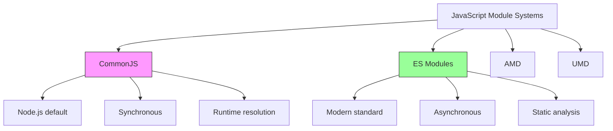

# Modules: ESM vs CommonJS

> [!summary] Goal
> Master ES Modules and CommonJS: understand module resolution, circular dependencies, import/export patterns, bundler behavior, and migration strategies. Know when to use each and how to handle interop.

## Table of Contents

1. [[#Module Systems Overview]]
2. [[#CommonJS (CJS) Deep Dive]]
3. [[#ES Modules (ESM) Deep Dive]]
4. [[#Module Resolution]]
5. [[#Circular Dependencies]]
6. [[#Import Export Patterns]]
7. [[#Bundlers and Build Tools]]
8. [[#Migration Strategies]]
9. [[#Interoperability]]
10. [[#Best Practices]]
11. [[#Interview Questions]]

---

## Module Systems Overview

### What Are Modules?

Modules are **reusable pieces of code** that encapsulate implementation details and expose a public API.

**Benefits:**
- **Encapsulation**: Hide implementation details
- **Reusability**: Share code across projects
- **Maintainability**: Organize code into logical units
- **Dependency management**: Explicit dependencies

### JavaScript Module Systems



### Comparison Table

| Feature | CommonJS (CJS) | ES Modules (ESM) |
|---------|---------------|------------------|
| **Syntax** | `require()` / `module.exports` | `import` / `export` |
| **Loading** | Synchronous | Asynchronous |
| **Resolution** | Runtime (dynamic) | Parse-time (static) |
| **Tree-shaking** | ❌ No | ✅ Yes |
| **Top-level await** | ❌ No | ✅ Yes (Node 14.8+) |
| **Browser support** | ❌ No (requires bundler) | ✅ Yes (modern browsers) |
| **Conditional imports** | ✅ Yes (dynamic) | ⚠️ Limited (dynamic import) |
| **Exports mutation** | ✅ Yes | ❌ No (read-only bindings) |
| **File extension** | `.js`, `.cjs` | `.mjs`, `.js` (with `"type": "module"`) |
| **Node.js** | Default (until v12) | Opt-in (v12+), default future |
| **Circular deps** | ⚠️ Partial exports | ✅ Better handling |

---

## CommonJS (CJS) Deep Dive

### Basic Syntax

```javascript
// math.js - Exporting
function add(a, b) {
  return a + b;
}

function subtract(a, b) {
  return a - b;
}

// Export individual functions
module.exports.add = add;
module.exports.subtract = subtract;

// OR export an object
module.exports = { add, subtract };
```

```javascript
// app.js - Importing
const math = require('./math');
console.log(math.add(2, 3)); // 5

// Destructuring import
const { add, subtract } = require('./math');
console.log(subtract(5, 2)); // 3
```

### How CommonJS Works

**1. Module Wrapper Function**

Every CommonJS module is wrapped in a function:

```javascript
// Your code:
const x = 1;
module.exports = x;

// What Node.js actually executes:
(function(exports, require, module, __filename, __dirname) {
  const x = 1;
  module.exports = x;
});
```

**2. Module Object Structure**

```javascript
// Inside a module, you have access to:
console.log(module);
/*
Module {
  id: '/path/to/file.js',
  path: '/path/to',
  exports: {},
  filename: '/path/to/file.js',
  loaded: false,
  children: [],
  paths: [ ... ] // Module search paths
}
*/

console.log(__filename); // '/path/to/file.js'
console.log(__dirname);  // '/path/to'
```

**3. Module Caching**

```javascript
// counter.js
let count = 0;

module.exports = {
  increment() { count++; },
  getCount() { return count; }
};
```

```javascript
// app.js
const counter1 = require('./counter');
const counter2 = require('./counter');

counter1.increment();
console.log(counter2.getCount()); // 1 - SAME instance!

console.log(counter1 === counter2); // true
console.log(require.cache); // Shows cached modules
```

**Clearing Cache (Testing):**

```javascript
// Clear specific module
delete require.cache[require.resolve('./counter')];

// Clear all cache (dangerous!)
Object.keys(require.cache).forEach(key => {
  delete require.cache[key];
});
```

### Export Patterns

**Pattern 1: Named Exports**

```javascript
// config.js
exports.port = 3000;
exports.host = 'localhost';
exports.timeout = 5000;
```

**Pattern 2: Default Export**

```javascript
// database.js
class Database {
  connect() { /* ... */ }
}

module.exports = Database;
// Usage: const Database = require('./database');
```

**Pattern 3: Mixed Export**

```javascript
// logger.js
function log(msg) { console.log(msg); }
log.level = 'info';
log.setLevel = (level) => { log.level = level; };

module.exports = log;
// Usage: 
// const log = require('./logger');
// log('message');
// log.setLevel('debug');
```

**Pattern 4: Factory Pattern**

```javascript
// createServer.js
module.exports = function createServer(options) {
  return {
    start() { /* ... */ },
    stop() { /* ... */ },
    options
  };
};

// Usage:
const createServer = require('./createServer');
const server = createServer({ port: 3000 });
```

**Pattern 5: Revealing Module Pattern**

```javascript
// service.js
module.exports = (function() {
  // Private variables
  let privateData = [];
  
  // Private functions
  function privateHelper() {
    return privateData.length;
  }
  
  // Public API
  return {
    add(item) {
      privateData.push(item);
    },
    getCount() {
      return privateHelper();
    }
  };
})();
```

### Dynamic Require

```javascript
// Conditional require
const isDev = process.env.NODE_ENV === 'development';
const config = isDev 
  ? require('./config.dev')
  : require('./config.prod');

// Dynamic module loading
const moduleName = 'express';
const express = require(moduleName);

// Load all files in directory
const fs = require('fs');
const path = require('path');

const controllers = {};
const controllerDir = path.join(__dirname, 'controllers');

fs.readdirSync(controllerDir).forEach(file => {
  if (file.endsWith('.js')) {
    const name = path.basename(file, '.js');
    controllers[name] = require(path.join(controllerDir, file));
  }
});
```

### Module.exports vs exports

```javascript
// ✅ CORRECT - These work
exports.foo = 'bar';
module.exports.foo = 'bar';
module.exports = { foo: 'bar' };

// ❌ WRONG - This doesn't work!
exports = { foo: 'bar' };
// Why? exports is just a reference to module.exports
// Reassigning it breaks the reference

// What's happening:
// Initially: exports → module.exports → {}
// After exports = {...}: exports → {...}, module.exports → {}
// require() returns module.exports, NOT exports
```

**The Right Mental Model:**

```javascript
// Node.js does this:
let module = { exports: {} };
let exports = module.exports;

// Your code runs here
exports.foo = 'bar';        // ✅ Works - modifies the same object
module.exports.bar = 'baz'; // ✅ Works - modifies the same object
exports = { new: 'obj' };   // ❌ Breaks - creates new object

return module.exports; // This is what require() gets
```

---

## ES Modules (ESM) Deep Dive

### Basic Syntax

```javascript
// math.mjs - Exporting
export function add(a, b) {
  return a + b;
}

export function subtract(a, b) {
  return a - b;
}

// Default export
export default function multiply(a, b) {
  return a * b;
}

// OR export list
function divide(a, b) {
  return a / b;
}
export { divide };
```

```javascript
// app.mjs - Importing
import multiply from './math.mjs';           // Default import
import { add, subtract } from './math.mjs';  // Named imports
import * as math from './math.mjs';          // Namespace import

console.log(multiply(2, 3));    // 6
console.log(add(2, 3));         // 5
console.log(math.add(2, 3));    // 5
console.log(math.default(2, 3)); // 6 (default export)
```

### Export Patterns

**Pattern 1: Named Exports**

```javascript
// constants.js
export const API_URL = 'https://api.example.com';
export const TIMEOUT = 5000;
export const MAX_RETRIES = 3;
```

**Pattern 2: Default Export**

```javascript
// Button.js
export default class Button {
  constructor(label) {
    this.label = label;
  }
  
  render() {
    return `<button>${this.label}</button>`;
  }
}

// Usage:
import Button from './Button.js'; // Can rename: import Btn from './Button.js'
```

**Pattern 3: Mixed Exports**

```javascript
// logger.js
export default function log(message) {
  console.log(`[${log.level}] ${message}`);
}

export const levels = ['debug', 'info', 'warn', 'error'];
export function setLevel(level) {
  log.level = level;
}

log.level = 'info';

// Usage:
import log, { levels, setLevel } from './logger.js';
```

**Pattern 4: Re-exports (Barrel Pattern)**

```javascript
// components/index.js - Barrel file
export { default as Button } from './Button.js';
export { default as Input } from './Input.js';
export { default as Form } from './Form.js';
export * from './utils.js'; // Re-export all named exports

// Usage:
import { Button, Input, Form } from './components/index.js';
```

**Pattern 5: Renamed Exports**

```javascript
// utils.js
function internalValidate(data) { /* ... */ }
function internalFormat(data) { /* ... */ }

export { 
  internalValidate as validate,
  internalFormat as format
};

// Usage:
import { validate, format } from './utils.js';
```

### Import Patterns

**Pattern 1: Side-Effect Import**

```javascript
// Just execute the module (no imports)
import './polyfills.js';
import './styles.css';
```

**Pattern 2: Dynamic Import**

```javascript
// Async import - returns a Promise
async function loadModule() {
  const { add } = await import('./math.js');
  console.log(add(2, 3));
}

// Conditional import
const locale = 'en';
const messages = await import(`./i18n/${locale}.js`);

// Code splitting in React
const LazyComponent = React.lazy(() => import('./LazyComponent.js'));
```

**Pattern 3: Import Assertions (JSON Modules)**

```javascript
// Node.js 17.1+, with experimental flag
import data from './config.json' assert { type: 'json' };
console.log(data.version);
```

**Pattern 4: Import Meta**

```javascript
// Current module URL
console.log(import.meta.url);
// file:///home/user/project/app.js

// Resolve relative URLs
const imageUrl = new URL('./image.png', import.meta.url);

// Check if module is main entry point
if (import.meta.url === `file://${process.argv[1]}`) {
  console.log('This is the main module');
}
```

### ESM Live Bindings

**Key Difference from CommonJS:**

```javascript
// counter.js
export let count = 0;
export function increment() {
  count++;
}
```

```javascript
// app.js
import { count, increment } from './counter.js';

console.log(count); // 0
increment();
console.log(count); // 1 ✅ Updated! (live binding)

// But you can't reassign:
// count = 5; // ❌ TypeError: Assignment to constant variable
```

**CommonJS vs ESM:**

```javascript
// CJS: Copies values
// counter.cjs
let count = 0;
module.exports = {
  count,
  increment() { count++; }
};

// app.cjs
const { count, increment } = require('./counter.cjs');
console.log(count); // 0
increment();
console.log(count); // 0 ❌ Still 0! (copy, not reference)
```

### Top-Level Await

```javascript
// config.js (ESM only!)
const response = await fetch('https://api.example.com/config');
const config = await response.json();

export default config;

// app.js
import config from './config.js';
console.log(config); // Config is already loaded
```

**Execution Order with Top-Level Await:**

```javascript
// a.js
console.log('a: before await');
await new Promise(resolve => setTimeout(resolve, 1000));
console.log('a: after await');
export const a = 'A';

// b.js
console.log('b: start');
import { a } from './a.js';
console.log('b: imported a =', a);

// Output:
// a: before await
// (1 second delay)
// a: after await
// b: start
// b: imported a = A
```

---

## Module Resolution

### Node.js Module Resolution Algorithm

**CommonJS Resolution:**

```javascript
require('./math')     // Relative path
require('express')    // Package name
require('/abs/path')  // Absolute path
```

**Resolution Steps:**

1. **Relative/Absolute Path:**
   - Try `./math.js`
   - Try `./math.json`
   - Try `./math.node` (native addon)
   - Try `./math/index.js`
   - Try `./math/package.json` → `main` field

2. **Package Name:**
   - Look in `node_modules` in current directory
   - Go up: `../node_modules`
   - Keep going up to root
   - Check global modules

**ESM Resolution:**

```javascript
import './math.js'      // ✅ Must include extension
import './math'         // ❌ Error in Node.js (OK in bundlers)
import 'express'        // ✅ Package name OK
```

### Package.json Fields

```json
{
  "name": "my-package",
  "version": "1.0.0",
  "type": "module",
  "main": "./dist/index.cjs",
  "module": "./dist/index.mjs",
  "exports": {
    ".": {
      "import": "./dist/index.mjs",
      "require": "./dist/index.cjs",
      "types": "./dist/index.d.ts"
    },
    "./utils": {
      "import": "./dist/utils.mjs",
      "require": "./dist/utils.cjs"
    }
  },
  "imports": {
    "#internal": "./src/internal.js"
  }
}
```

**Field Explanations:**

- **`type`**: `"module"` = ESM default, `"commonjs"` = CJS default
- **`main`**: Entry point for `require()`
- **`module`**: Entry point for bundlers (ESM)
- **`exports`**: Modern way to define entry points
- **`imports`**: Private import mappings (start with `#`)

**Exports Field Examples:**

```json
{
  "exports": {
    ".": "./index.js",
    "./package.json": "./package.json",
    "./utils/*": "./src/utils/*.js"
  }
}
```

```javascript
// Allowed:
import pkg from 'my-package';
import utils from 'my-package/utils/helpers.js';

// Blocked (not in exports):
import internal from 'my-package/src/internal.js'; // ❌ Error
```

### Conditional Exports

```json
{
  "exports": {
    ".": {
      "node": "./node-specific.js",
      "browser": "./browser-specific.js",
      "default": "./fallback.js"
    }
  }
}
```

**Custom Conditions:**

```json
{
  "exports": {
    ".": {
      "development": "./dev.js",
      "production": "./prod.js",
      "default": "./index.js"
    }
  }
}
```

```bash
# Use custom condition
node --conditions=development app.js
```

---

## Circular Dependencies

### CommonJS Circular Dependencies

```javascript
// a.js
console.log('a: loading');
const b = require('./b');
console.log('a: b loaded', b);

exports.fromA = 'A';
exports.useB = () => b.fromB;

// b.js
console.log('b: loading');
const a = require('./a');
console.log('b: a loaded', a); // ⚠️ Partial object!

exports.fromB = 'B';
exports.useA = () => a.fromA;

// main.js
const a = require('./a');
console.log('main: a.useB()', a.useB());

// Output:
// a: loading
// b: loading
// b: a loaded {} ⚠️ Empty!
// a: b loaded { fromB: 'B', useA: [Function] }
// main: a.useB() B
```

**Why it happens:**

1. `a.js` starts loading
2. `a.js` requires `b.js`
3. `b.js` starts loading
4. `b.js` requires `a.js` → returns **partial** `a.js` (empty at this point)
5. `b.js` finishes loading
6. `a.js` finishes loading

**Fix: Use functions for late binding**

```javascript
// a.js
const b = require('./b');
exports.fromA = 'A';
exports.useB = () => b.fromB; // ✅ Function - executes later

// b.js
const a = require('./a');
exports.fromB = 'B';
exports.useA = () => a.fromA; // ✅ Function - executes later
```

### ESM Circular Dependencies

ESM handles circular dependencies better due to live bindings:

```javascript
// a.mjs
console.log('a: loading');
import { fromB } from './b.mjs';
console.log('a: fromB =', fromB);

export const fromA = 'A';

// b.mjs
console.log('b: loading');
import { fromA } from './a.mjs';
console.log('b: fromA =', fromA); // ⚠️ undefined at this point!

export const fromB = 'B';

// Output:
// b: loading
// b: fromA = undefined ⚠️
// a: loading
// a: fromB = B
```

**Why it's better:**

```javascript
// a.mjs
import { fromB, useA } from './b.mjs';
export const fromA = 'A';
console.log('a: useA()', useA()); // ✅ Works!

// b.mjs
import { fromA } from './a.mjs';
export const fromB = 'B';
export function useA() {
  return fromA; // ✅ Lives binding - works when called!
}
```

**Best Practice: Avoid circular dependencies**

```javascript
// ❌ Bad:
// a.js imports b.js
// b.js imports a.js

// ✅ Good: Extract shared code
// a.js imports shared.js
// b.js imports shared.js
// shared.js has no circular imports
```

---

## Bundlers and Build Tools

### Webpack

**Configuration:**

```javascript
// webpack.config.js
module.exports = {
  entry: './src/index.js',
  output: {
    filename: 'bundle.js',
    path: __dirname + '/dist'
  },
  resolve: {
    extensions: ['.js', '.mjs', '.cjs', '.json'],
    alias: {
      '@': path.resolve(__dirname, 'src/'),
      'utils': path.resolve(__dirname, 'src/utils/')
    }
  },
  module: {
    rules: [
      {
        test: /\.m?js$/,
        exclude: /node_modules/,
        use: {
          loader: 'babel-loader',
          options: {
            presets: ['@babel/preset-env']
          }
        }
      }
    ]
  }
};
```

**Tree Shaking:**

```javascript
// utils.js
export function used() {
  return 'I am used';
}

export function unused() {
  return 'I am never used';
}

// app.js
import { used } from './utils';
console.log(used());

// Webpack (production mode) will eliminate unused()
```

### Rollup

**Configuration:**

```javascript
// rollup.config.js
export default {
  input: 'src/index.js',
  output: [
    {
      file: 'dist/bundle.cjs.js',
      format: 'cjs'
    },
    {
      file: 'dist/bundle.esm.js',
      format: 'esm'
    },
    {
      file: 'dist/bundle.umd.js',
      format: 'umd',
      name: 'MyLibrary'
    }
  ],
  external: ['lodash'], // Don't bundle lodash
  plugins: [
    resolve(), // Resolve node_modules
    commonjs(), // Convert CJS to ESM
    babel({ babelHelpers: 'bundled' })
  ]
};
```

### Vite

```javascript
// vite.config.js
import { defineConfig } from 'vite';

export default defineConfig({
  resolve: {
    alias: {
      '@': '/src'
    }
  },
  build: {
    lib: {
      entry: '/src/index.js',
      name: 'MyLib',
      formats: ['es', 'cjs', 'umd']
    }
  }
});
```

**Native ESM in Development:**

Vite serves files as native ESM in dev mode - no bundling!

```html
<!-- index.html -->
<script type="module" src="/src/main.js"></script>
```

```javascript
// src/main.js
import { createApp } from 'vue'; // Vite resolves from node_modules
import App from './App.vue';     // Vite transforms .vue on-the-fly

createApp(App).mount('#app');
```

---

## Migration Strategies

### CJS to ESM Migration

**Step 1: Update package.json**

```json
{
  "type": "module",
  "exports": {
    ".": {
      "import": "./dist/index.mjs",
      "require": "./dist/index.cjs"
    }
  }
}
```

**Step 2: Rename files**

```bash
# Option 1: Use .mjs extension
mv src/index.js src/index.mjs

# Option 2: Set "type": "module" in package.json
# .js files are now ESM
# Use .cjs for CommonJS files
```

**Step 3: Convert syntax**

```javascript
// Before (CJS):
const fs = require('fs');
const { join } = require('path');
const myModule = require('./myModule');
module.exports = { foo: 'bar' };

// After (ESM):
import fs from 'fs';
import { join } from 'path';
import myModule from './myModule.js'; // ⚠️ Add extension!
export default { foo: 'bar' };
```

**Step 4: Replace CommonJS globals**

```javascript
// CJS has these globals:
__dirname
__filename
require
module
exports

// ESM alternatives:
import { fileURLToPath } from 'url';
import { dirname } from 'path';

const __filename = fileURLToPath(import.meta.url);
const __dirname = dirname(__filename);

// For require():
import { createRequire } from 'module';
const require = createRequire(import.meta.url);
const somePackage = require('some-cjs-only-package');
```

**Step 5: Handle dynamic imports**

```javascript
// Before (CJS):
const moduleName = './module-' + version;
const module = require(moduleName);

// After (ESM):
const moduleName = `./module-${version}.js`;
const module = await import(moduleName);
```

### Dual Package Strategy

Support both CJS and ESM:

**Option 1: Separate builds**

```json
{
  "type": "module",
  "exports": {
    ".": {
      "import": "./dist/index.mjs",
      "require": "./dist/index.cjs"
    }
  }
}
```

```javascript
// Build script: rollup.config.js
export default {
  input: 'src/index.js',
  output: [
    { file: 'dist/index.cjs', format: 'cjs' },
    { file: 'dist/index.mjs', format: 'esm' }
  ]
};
```

**Option 2: Wrapper approach**

```javascript
// dist/index.cjs (CJS wrapper)
module.exports = require('./index.mjs');

// dist/index.mjs (ESM source)
export function myFunction() { /* ... */ }
```

**Option 3: Conditional exports**

```json
{
  "name": "my-pkg",
  "exports": {
    "node": {
      "import": "./node-esm.js",
      "require": "./node-cjs.js"
    },
    "default": "./browser.js"
  }
}
```

---

## Interoperability

### Importing CJS from ESM

```javascript
// cjs-module.cjs
module.exports = {
  foo: 'bar',
  baz: 123
};

// esm-app.mjs
import cjsModule from './cjs-module.cjs';
console.log(cjsModule); // { foo: 'bar', baz: 123 }

// ⚠️ Named imports don't work:
// import { foo } from './cjs-module.cjs'; // ❌ Error

// ✅ Use this instead:
import cjsModule from './cjs-module.cjs';
const { foo } = cjsModule;
```

**Default Export Detection:**

```javascript
// cjs-default.cjs
module.exports = function() {
  console.log('I am the default export');
};
module.exports.named = 'named export';

// esm-app.mjs
import fn from './cjs-default.cjs';
fn(); // Works
console.log(fn.named); // 'named export'
```

### Importing ESM from CJS

**You can't use `import` in CJS, but you can use dynamic import:**

```javascript
// cjs-app.cjs
// import esm from './esm-module.mjs'; // ❌ SyntaxError

// ✅ Use dynamic import (returns Promise)
async function loadESM() {
  const esm = await import('./esm-module.mjs');
  console.log(esm.default);
  console.log(esm.namedExport);
}

loadESM();

// Or with .then():
import('./esm-module.mjs').then(esm => {
  console.log(esm);
});
```

### Named Exports Interop

**Problem:**

```javascript
// lib.cjs
exports.foo = 'foo';
exports.bar = 'bar';

// app.mjs
import { foo, bar } from './lib.cjs'; // ❌ Doesn't work in Node.js
```

**Solution 1: Use default import**

```javascript
import lib from './lib.cjs';
const { foo, bar } = lib;
```

**Solution 2: Use bundler (Webpack/Rollup)**

Bundlers can analyze CJS and create named exports:

```javascript
import { foo, bar } from './lib.cjs'; // ✅ Works with bundler
```

**Solution 3: Update CJS module**

```javascript
// lib.cjs
export const foo = 'foo';
export const bar = 'bar';
// If type=module in package.json
```

---

## Best Practices

### 1. Choose One System Per Project

```javascript
// ❌ Avoid mixing:
// src/moduleA.cjs
// src/moduleB.mjs
// src/moduleC.js (which type?)

// ✅ Pick one:
// All .mjs + "type": "module"
// Or all .cjs + "type": "commonjs"
```

### 2. Always Use File Extensions in ESM

```javascript
// ❌ Bad (works in bundlers, fails in Node):
import utils from './utils';

// ✅ Good:
import utils from './utils.js';
```

### 3. Use Named Exports for Multiple Items

```javascript
// ❌ Avoid default for multiple exports:
export default {
  functionA,
  functionB,
  constantC
};

// ✅ Use named exports:
export { functionA, functionB, constantC };
```

### 4. Prefer ESM for New Projects

```json
{
  "type": "module"
}
```

**Benefits:**
- Tree-shaking
- Top-level await
- Live bindings
- Better async support
- Future-proof

### 5. Use Barrel Files Wisely

```javascript
// ✅ Good for public API:
// components/index.js
export { Button } from './Button.js';
export { Input } from './Input.js';

// ❌ Bad for everything (breaks tree-shaking):
// utils/index.js exporting 100+ utilities
// Users import one, bundle includes all
```

### 6. Document Module Format

```javascript
/**
 * @module myModule
 * @format ESM
 * @requires Node.js 14+
 */
```

### 7. Handle Errors Properly

```javascript
// Dynamic import error handling
try {
  const module = await import('./optional-module.js');
} catch (err) {
  console.error('Failed to load module:', err);
  // Provide fallback
}
```

### 8. Use Import Maps (Browser)

```html
<script type="importmap">
{
  "imports": {
    "react": "https://cdn.skypack.dev/react@18",
    "app/": "/src/"
  }
}
</script>

<script type="module">
  import React from 'react'; // Uses CDN
  import utils from 'app/utils.js'; // Uses /src/utils.js
</script>
```

---

## Common Pitfalls

### Pitfall 1: Forgetting File Extensions

```javascript
// ❌ Error in Node.js ESM:
import utils from './utils';

// ✅ Fix:
import utils from './utils.js';
```

### Pitfall 2: Using require() in ESM

```javascript
// ❌ SyntaxError:
const fs = require('fs');

// ✅ Fix:
import fs from 'fs';

// Or if you really need require:
import { createRequire } from 'module';
const require = createRequire(import.meta.url);
const legacyModule = require('legacy-cjs-only-module');
```

### Pitfall 3: Reassigning exports

```javascript
// ❌ Doesn't work:
exports = { foo: 'bar' };

// ✅ Fix:
module.exports = { foo: 'bar' };
// Or:
exports.foo = 'bar';
```

### Pitfall 4: Circular Dependencies

```javascript
// ❌ Avoid:
// a.js imports b.js
// b.js imports a.js

// ✅ Fix: Extract shared code
// a.js imports shared.js
// b.js imports shared.js
```

### Pitfall 5: Top-Level Await Blocking

```javascript
// ❌ Blocks all imports:
await slowAsyncOperation(); // 10 seconds
export const data = 'ready';

// ✅ Fix: Don't await at top level unless necessary
export const data = slowAsyncOperation(); // Returns promise
```

### Pitfall 6: Named Imports from CJS

```javascript
// lib.cjs
module.exports = { foo: 'bar' };

// ❌ Doesn't work in Node:
import { foo } from './lib.cjs';

// ✅ Fix:
import lib from './lib.cjs';
const { foo } = lib;
```

---

## Interview Questions

### Q1: What are the key differences between CommonJS and ES Modules?

**Answer:**

| Aspect | CommonJS | ES Modules |
|--------|----------|------------|
| **Syntax** | `require()`/`module.exports` | `import`/`export` |
| **Loading** | Synchronous | Asynchronous |
| **Resolution** | Runtime (dynamic) | Parse-time (static) |
| **Tree-shaking** | No | Yes |
| **Bindings** | Copy values | Live bindings |
| **Top-level await** | No | Yes |
| **Browser support** | No (needs bundler) | Yes (native) |
| **Conditional imports** | Easy (`require()` is a function) | Limited (dynamic import) |

**Example:**

```javascript
// CJS - copies value
let count = 0;
exports.count = count;
exports.increment = () => { count++; };

const { count, increment } = require('./module');
increment();
console.log(count); // 0 (copied value)

// ESM - live binding
export let count = 0;
export function increment() { count++; }

import { count, increment } from './module.js';
increment();
console.log(count); // 1 (live binding)
```

---

### Q2: How does Node.js resolve modules?

**Answer:**

**For relative/absolute paths:**

1. Try exact match with extension
2. Try adding `.js`, `.json`, `.node`
3. Try as directory: look for `index.js`, `package.json` main field

**For package names:**

1. Look in `node_modules` in current dir
2. Go up the tree checking `node_modules` in each parent
3. Check global modules
4. Throw `MODULE_NOT_FOUND`

**ESM specifics:**

- File extensions are required: `import './utils.js'` ✅
- `import './utils'` ❌ (works in bundlers, not Node)
- Use `exports` field in package.json for entry points

**Example:**

```javascript
// Given structure:
// /project
//   /node_modules/lodash
//   /src
//     /utils
//       /index.js
//     /app.js

// In /src/app.js:
require('lodash')         // → /project/node_modules/lodash
require('./utils')        // → /project/src/utils/index.js
require('./utils/index')  // → /project/src/utils/index.js
```

---

### Q3: Explain circular dependencies and how to handle them.

**Answer:**

Circular dependencies occur when modules import each other:

**CommonJS example:**

```javascript
// a.js
const b = require('./b');
exports.fromA = 'A';

// b.js
const a = require('./a'); // ⚠️ Gets partial export (empty)
exports.fromB = 'B';
console.log(a.fromA); // undefined
```

**Why:** CommonJS returns **partial exports** when circular dependency detected.

**Solutions:**

1. **Use functions for late binding:**

```javascript
// a.js
const b = require('./b');
exports.fromA = 'A';
exports.getB = () => b.fromB; // ✅ Function executes later

// b.js
const a = require('./a');
exports.fromB = 'B';
exports.getA = () => a.fromA; // ✅ Function executes later
```

2. **Restructure code:**

```javascript
// ❌ Before:
// a.js ⟷ b.js

// ✅ After:
// a.js → shared.js
// b.js → shared.js
```

3. **Use ESM (better handling):**

```javascript
// a.mjs
import { fromB } from './b.mjs';
export const fromA = 'A';
export const useB = () => fromB; // ✅ Live binding works

// b.mjs
import { fromA } from './a.mjs';
export const fromB = 'B';
```

---

### Q4: What is tree-shaking and why does it require ESM?

**Answer:**

**Tree-shaking** eliminates unused code from the final bundle.

**Why ESM enables tree-shaking:**

1. **Static structure**: Imports/exports are top-level and can't be conditional
2. **Parse-time analysis**: Bundler knows dependencies before execution
3. **Read-only bindings**: Exported values can't be modified

**Example:**

```javascript
// utils.js
export function used() { return 'used'; }
export function unused() { return 'unused'; }

// app.js
import { used } from './utils.js';
console.log(used());

// After tree-shaking:
// Only used() is in bundle, unused() is eliminated
```

**Why CJS doesn't work:**

```javascript
// CJS is dynamic:
const utils = require('./utils');
utils[Math.random() > 0.5 ? 'used' : 'unused']();

// Bundler can't determine what's used at build time
```

**Conditions for tree-shaking:**

- Use ESM syntax
- No side effects in modules (or mark as side-effect-free)
- Production mode in bundler
- Module is not used dynamically

```json
// package.json
{
  "sideEffects": false // or ["*.css"]
}
```

---

### Q5: How do you handle __dirname and __filename in ESM?

**Answer:**

ESM doesn't have `__dirname` and `__filename` globals. Use `import.meta.url`:

```javascript
// CommonJS
console.log(__filename); // /path/to/file.js
console.log(__dirname);  // /path/to

// ESM
import { fileURLToPath } from 'url';
import { dirname } from 'path';

const __filename = fileURLToPath(import.meta.url);
const __dirname = dirname(__filename);

console.log(__filename); // /path/to/file.js
console.log(__dirname);  // /path/to
```

**Alternative approaches:**

```javascript
// Get current file URL
console.log(import.meta.url);
// file:///path/to/file.js

// Resolve relative paths
const configPath = new URL('./config.json', import.meta.url);

// Read file relative to current module
import { readFile } from 'fs/promises';
const data = await readFile(
  new URL('./data.txt', import.meta.url),
  'utf-8'
);
```

---

### Q6: What are the package.json exports field and why use it?

**Answer:**

The `exports` field defines **public entry points** for your package:

**Benefits:**

1. **Encapsulation**: Hide internal modules
2. **Dual package support**: Serve different files for ESM/CJS
3. **Conditional exports**: Different files for Node/browser/development
4. **Subpath exports**: Define multiple entry points

**Example:**

```json
{
  "name": "my-package",
  "exports": {
    ".": {
      "import": "./dist/index.mjs",
      "require": "./dist/index.cjs",
      "types": "./dist/index.d.ts"
    },
    "./utils": "./dist/utils.js",
    "./package.json": "./package.json"
  }
}
```

**Usage:**

```javascript
// ✅ Allowed:
import pkg from 'my-package';
import utils from 'my-package/utils';

// ❌ Blocked (not in exports):
import internal from 'my-package/dist/internal.js'; // Error!
```

**Conditional exports:**

```json
{
  "exports": {
    ".": {
      "node": "./node.js",
      "browser": "./browser.js",
      "development": "./dev.js",
      "production": "./prod.js",
      "default": "./index.js"
    }
  }
}
```

**Order matters** - first match wins:

```json
{
  "exports": {
    ".": {
      "import": "./esm.js",  // Checked first
      "require": "./cjs.js",  // Checked second
      "default": "./fallback.js"  // Last resort
    }
  }
}
```

---

### Q7: How do you dynamically import modules in different scenarios?

**Answer:**

**1. Basic dynamic import (ESM):**

```javascript
const modulePath = './module.js';
const module = await import(modulePath);
console.log(module.default);
```

**2. Conditional import:**

```javascript
const locale = 'en';
const messages = await import(`./i18n/${locale}.js`);

if (process.env.NODE_ENV === 'development') {
  const devTools = await import('./devtools.js');
  devTools.init();
}
```

**3. Dynamic import in CommonJS:**

```javascript
// CJS can use import() for ESM modules
async function loadESM() {
  const esmModule = await import('./esm-module.mjs');
  return esmModule.default;
}
```

**4. Lazy loading (React):**

```javascript
const LazyComponent = React.lazy(() => import('./HeavyComponent'));

function App() {
  return (
    <Suspense fallback={<div>Loading...</div>}>
      <LazyComponent />
    </Suspense>
  );
}
```

**5. Dynamic import with error handling:**

```javascript
async function loadPlugin(name) {
  try {
    const plugin = await import(`./plugins/${name}.js`);
    return plugin.default;
  } catch (err) {
    console.error(`Failed to load plugin ${name}:`, err);
    return null;
  }
}
```

**6. Preloading modules:**

```javascript
// Start loading early, use later
const modulePromise = import('./heavy-module.js');

// Do other work...

// Now wait for it
const module = await modulePromise;
```

**7. Import all files in directory:**

```javascript
// Using Vite glob import
const modules = import.meta.glob('./modules/*.js');

for (const path in modules) {
  modules[path]().then(mod => {
    console.log(path, mod);
  });
}

// Eager import
const modulesEager = import.meta.glob('./modules/*.js', { eager: true });
```

---

### Q8: What is the dual package hazard and how to avoid it?

**Answer:**

**Dual package hazard** occurs when both ESM and CJS versions of a package are loaded, creating **two separate instances**:

**Problem:**

```javascript
// package.json
{
  "main": "./index.cjs",
  "exports": {
    "import": "./index.mjs",
    "require": "./index.cjs"
  }
}

// state.cjs
let count = 0;
exports.increment = () => { count++; };
exports.getCount = () => count;

// state.mjs
export let count = 0;
export function increment() { count++; }
export function getCount() { return count; }

// app.mjs (ESM)
import { increment, getCount } from 'my-package';
increment();
console.log(getCount()); // 1

// legacy.cjs (CJS)
const { getCount } = require('my-package');
console.log(getCount()); // 0 ⚠️ Different instance!
```

**Solutions:**

**1. Single implementation, wrapper for CJS:**

```javascript
// index.mjs (source)
export let count = 0;
export function increment() { count++; }

// index.cjs (wrapper)
module.exports = require('./index.mjs');
```

**2. Isolate state:**

```javascript
// Don't store state in module scope
// Use a separate state management system
```

**3. Prevent dual loading with exports:**

```json
{
  "exports": {
    ".": "./index.mjs"
  }
}
// Forces everyone to use ESM (or dynamic import from CJS)
```

**4. Document the constraint:**

```javascript
/**
 * ⚠️ WARNING: This package has state.
 * Do not mix ESM and CJS imports!
 */
```

**Detection:**

```javascript
// Check if module is loaded twice
import { fileURLToPath } from 'url';
const id = fileURLToPath(import.meta.url);

if (global.__MY_PACKAGE__) {
  console.warn('Package loaded twice!', id);
} else {
  global.__MY_PACKAGE__ = id;
}
```

---

## Summary

**Key Takeaways:**

1. **ESM is the future** - use it for new projects
2. **CommonJS is synchronous**, ESM is async - affects loading
3. **Tree-shaking requires ESM** - static analysis needed
4. **Circular dependencies** are handled differently - ESM has live bindings
5. **File extensions required** in ESM for Node.js
6. **Use `exports` field** for dual package support
7. **Dynamic import** works in both CJS and ESM
8. **Avoid dual package hazard** - don't load both versions

**Migration path:**

```
CommonJS → Dual Package → Pure ESM
```

**Recommended setup for libraries:**

```json
{
  "type": "module",
  "exports": {
    ".": {
      "import": "./dist/index.mjs",
      "require": "./dist/index.cjs"
    }
  }
}
```

---

## References

- [Node.js ES Modules](https://nodejs.org/api/esm.html)
- [MDN Import Statement](https://developer.mozilla.org/en-US/docs/Web/JavaScript/Reference/Statements/import)
- [Webpack Tree Shaking](https://webpack.js.org/guides/tree-shaking/)
- [[01_JS_Runtime_and_Event_Loop|Event Loop]]
- [[04_Async_Promises_and_AsyncAwait|Async Patterns]]
- [[02_Error_Handling_and_Observability|Error Handling]]

