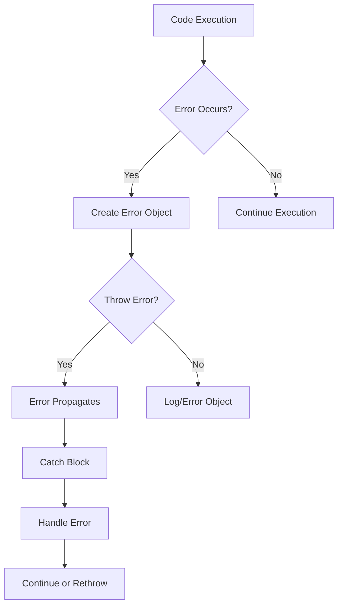

# Error Handling and Observability

> [!summary] Goal
> Master error handling in JavaScript: understand error types, custom errors, try/catch patterns, async error handling, stack traces, logging best practices, and observability with tools like Sentry. Make failures diagnosable with proper context and structure.

## Table of Contents

1. [[#Error Basics]]
2. [[#Error Types]]
3. [[#Custom Errors]]
4. [[#Try Catch Finally Patterns]]
5. [[#Async Error Handling]]
6. [[#Stack Traces]]
7. [[#Global Error Handlers]]
8. [[#Structured Logging]]
9. [[#Observability Tools]]
10. [[#Best Practices]]
11. [[#Interview Questions]]

---

## Error Basics

### The Error Object

```javascript
const error = new Error('Something went wrong');

console.log(error.message);    // 'Something went wrong'
console.log(error.name);       // 'Error'
console.log(error.stack);      // Stack trace (non-standard but widely supported)

// Throwing an error
throw error;
```

### Error Properties

```javascript
const err = new Error('Failed to process');

// Standard properties
err.name      // 'Error'
err.message   // 'Failed to process'

// Non-standard but widely supported
err.stack     // Stack trace string

// Custom properties
err.code = 'EPROCESS';
err.statusCode = 500;
err.context = { userId: 123 };
```

### Error Constructor with Cause (ES2022)

```javascript
try {
  await fetchData();
} catch (originalError) {
  throw new Error('Failed to load data', { 
    cause: originalError 
  });
}

// Access the cause:
catch (err) {
  console.log(err.cause); // Original error
}
```

### Creating Errors Without Throwing

```javascript
// Create error for logging/analysis
const error = new Error('Validation failed');
error.field = 'email';

logError(error);
// Continue execution
```



---

## Error Types

### Built-in Error Types

```javascript
// 1. Error - Base error class
throw new Error('Generic error');

// 2. SyntaxError - Invalid syntax
JSON.parse('invalid json'); // SyntaxError

// 3. ReferenceError - Invalid reference
console.log(nonExistentVariable); // ReferenceError

// 4. TypeError - Wrong type
null.toString(); // TypeError

// 5. RangeError - Number out of range
new Array(-1); // RangeError

// 6. URIError - Invalid URI
decodeURIComponent('%'); // URIError

// 7. EvalError - Error in eval() (rarely used)
// Mostly deprecated

// 8. AggregateError - Multiple errors (ES2021)
throw new AggregateError([
  new Error('Error 1'),
  new Error('Error 2')
], 'Multiple things failed');
```

### Error Type Examples

**SyntaxError:**

```javascript
try {
  JSON.parse('{ invalid json }');
} catch (err) {
  console.log(err instanceof SyntaxError); // true
  console.log(err.name); // 'SyntaxError'
  console.log(err.message); // Unexpected token i in JSON at position 2
}
```

**TypeError:**

```javascript
function greet(person) {
  return person.name.toUpperCase(); // TypeError if person is null
}

try {
  greet(null);
} catch (err) {
  console.log(err instanceof TypeError); // true
  console.log(err.message); // Cannot read property 'name' of null
}
```

**RangeError:**

```javascript
function recursiveFunction(depth) {
  if (depth > 0) {
    recursiveFunction(depth + 1);
  }
}

try {
  recursiveFunction(1); // Stack overflow
} catch (err) {
  console.log(err instanceof RangeError); // true
  console.log(err.message); // Maximum call stack size exceeded
}
```

**AggregateError:**

```javascript
async function fetchAll(urls) {
  const results = await Promise.allSettled(
    urls.map(url => fetch(url))
  );
  
  const errors = results
    .filter(r => r.status === 'rejected')
    .map(r => r.reason);
  
  if (errors.length > 0) {
    throw new AggregateError(errors, 'Some fetches failed');
  }
  
  return results.map(r => r.value);
}

try {
  await fetchAll(['http://invalid', 'http://also-invalid']);
} catch (err) {
  console.log(err.errors); // Array of individual errors
}
```

---

## Custom Errors

### Basic Custom Error

```javascript
class ValidationError extends Error {
  constructor(message) {
    super(message);
    this.name = 'ValidationError';
  }
}

throw new ValidationError('Email is invalid');
```

### Custom Error with Additional Properties

```javascript
class ValidationError extends Error {
  constructor(message, field) {
    super(message);
    this.name = 'ValidationError';
    this.field = field;
    this.timestamp = new Date();
  }
}

try {
  throw new ValidationError('Invalid email format', 'email');
} catch (err) {
  console.log(err.message); // 'Invalid email format'
  console.log(err.field);   // 'email'
  console.log(err instanceof ValidationError); // true
  console.log(err instanceof Error); // true
}
```

### HTTP Error Class

```javascript
class HttpError extends Error {
  constructor(statusCode, message) {
    super(message);
    this.name = 'HttpError';
    this.statusCode = statusCode;
  }
  
  static badRequest(message = 'Bad Request') {
    return new HttpError(400, message);
  }
  
  static unauthorized(message = 'Unauthorized') {
    return new HttpError(401, message);
  }
  
  static notFound(message = 'Not Found') {
    return new HttpError(404, message);
  }
  
  static internal(message = 'Internal Server Error') {
    return new HttpError(500, message);
  }
}

// Usage:
throw HttpError.notFound('User not found');
throw HttpError.badRequest('Invalid input');
```

### Domain-Specific Errors

```javascript
class DatabaseError extends Error {
  constructor(message, query, params) {
    super(message);
    this.name = 'DatabaseError';
    this.query = query;
    this.params = params;
  }
}

class NetworkError extends Error {
  constructor(message, url, method) {
    super(message);
    this.name = 'NetworkError';
    this.url = url;
    this.method = method;
    this.isNetworkError = true; // Easy to check
  }
}

class BusinessLogicError extends Error {
  constructor(message, code) {
    super(message);
    this.name = 'BusinessLogicError';
    this.code = code;
  }
}

// Usage in application:
async function transferMoney(from, to, amount) {
  if (amount <= 0) {
    throw new BusinessLogicError(
      'Amount must be positive',
      'INVALID_AMOUNT'
    );
  }
  
  try {
    await db.query('UPDATE accounts SET balance = balance - ? WHERE id = ?', 
                   [amount, from]);
  } catch (err) {
    throw new DatabaseError('Failed to debit account', err.query, [amount, from]);
  }
}
```

### Error Factory Pattern

```javascript
const ErrorFactory = {
  validation: (message, field) => {
    const err = new Error(message);
    err.name = 'ValidationError';
    err.field = field;
    return err;
  },
  
  http: (statusCode, message) => {
    const err = new Error(message);
    err.name = 'HttpError';
    err.statusCode = statusCode;
    return err;
  },
  
  notFound: (resource, id) => {
    const err = new Error(`${resource} with id ${id} not found`);
    err.name = 'NotFoundError';
    err.resource = resource;
    err.id = id;
    return err;
  }
};

// Usage:
throw ErrorFactory.validation('Invalid email', 'email');
throw ErrorFactory.notFound('User', 123);
```

---

## Try Catch Finally Patterns

### Basic Try-Catch

```javascript
try {
  const result = riskyOperation();
  console.log(result);
} catch (error) {
  console.error('Operation failed:', error);
}
```

### Try-Catch-Finally

```javascript
let resource;

try {
  resource = acquireResource();
  processResource(resource);
} catch (error) {
  console.error('Processing failed:', error);
} finally {
  // Always executes, even if error thrown
  if (resource) {
    releaseResource(resource);
  }
}
```

### Conditional Catch

```javascript
try {
  await performOperation();
} catch (error) {
  if (error instanceof ValidationError) {
    console.error('Validation failed:', error.message);
    return { success: false, errors: [error] };
  } else if (error instanceof NetworkError) {
    console.error('Network error:', error.message);
    // Retry logic
    return retry();
  } else {
    // Unknown error - rethrow
    throw error;
  }
}
```

### Nested Try-Catch

```javascript
try {
  const data = await fetchData();
  
  try {
    const processed = processData(data);
    return processed;
  } catch (processingError) {
    console.error('Processing failed:', processingError);
    return fallbackProcess(data);
  }
} catch (fetchError) {
  console.error('Fetch failed:', fetchError);
  return cachedData();
}
```

### Try-Catch with Resource Cleanup

```javascript
async function processFile(filePath) {
  let file;
  
  try {
    file = await openFile(filePath);
    const data = await file.read();
    return processData(data);
  } catch (error) {
    console.error('File processing failed:', error);
    throw error;
  } finally {
    if (file) {
      await file.close();
    }
  }
}
```

### Error Boundary Pattern

```javascript
function withErrorBoundary(fn, fallback) {
  return function(...args) {
    try {
      return fn(...args);
    } catch (error) {
      console.error('Error in', fn.name, ':', error);
      return fallback instanceof Function 
        ? fallback(error, ...args)
        : fallback;
    }
  };
}

// Usage:
const safeParseJSON = withErrorBoundary(
  JSON.parse,
  (error, input) => {
    console.error('JSON parse failed for:', input);
    return null;
  }
);

const result = safeParseJSON('invalid json'); // null, doesn't throw
```

### Multiple Error Types

```javascript
try {
  const result = await complexOperation();
} catch (error) {
  switch (error.constructor) {
    case ValidationError:
      return handleValidationError(error);
    case NetworkError:
      return handleNetworkError(error);
    case DatabaseError:
      return handleDatabaseError(error);
    default:
      throw error; // Unknown error
  }
}
```

---

## Async Error Handling

### Async/Await with Try-Catch

```javascript
async function fetchUser(userId) {
  try {
    const response = await fetch(`/api/users/${userId}`);
    
    if (!response.ok) {
      throw new Error(`HTTP ${response.status}: ${response.statusText}`);
    }
    
    const user = await response.json();
    return user;
  } catch (error) {
    console.error('Failed to fetch user:', error);
    throw error; // Re-throw or handle
  }
}
```

### Promise .catch()

```javascript
fetch('/api/data')
  .then(response => response.json())
  .then(data => processData(data))
  .catch(error => {
    console.error('Operation failed:', error);
  });
```

### Unhandled Promise Rejections

```javascript
// ❌ Silent failure (in older Node.js)
async function bad() {
  throw new Error('Oops');
}
bad(); // Unhandled promise rejection

// ✅ Handle it
async function good() {
  throw new Error('Oops');
}
good().catch(err => console.error(err));

// ✅ Or use top-level await (ESM)
await good(); // Error propagates to caller
```

### Promise.all Error Handling

```javascript
// Fail fast - first error stops all
try {
  const results = await Promise.all([
    fetchUser(1),
    fetchUser(2),
    fetchUser(3)
  ]);
} catch (error) {
  // Only catches FIRST error
  console.error('At least one fetch failed:', error);
}
```

### Promise.allSettled for Multiple Errors

```javascript
const results = await Promise.allSettled([
  fetchUser(1),
  fetchUser(2),
  fetchUser(3)
]);

const successes = results
  .filter(r => r.status === 'fulfilled')
  .map(r => r.value);

const failures = results
  .filter(r => r.status === 'rejected')
  .map(r => r.reason);

if (failures.length > 0) {
  console.error(`${failures.length} fetches failed:`, failures);
}

return successes;
```

### Async Error Wrapper

```javascript
function asyncHandler(fn) {
  return async (req, res, next) => {
    try {
      await fn(req, res, next);
    } catch (error) {
      next(error); // Pass to Express error handler
    }
  };
}

// Usage in Express:
app.get('/users/:id', asyncHandler(async (req, res) => {
  const user = await User.findById(req.params.id);
  res.json(user);
}));
```

### Retry with Exponential Backoff

```javascript
async function fetchWithRetry(url, maxRetries = 3) {
  let lastError;
  
  for (let i = 0; i < maxRetries; i++) {
    try {
      const response = await fetch(url);
      if (response.ok) return response;
      
      throw new Error(`HTTP ${response.status}`);
    } catch (error) {
      lastError = error;
      console.warn(`Attempt ${i + 1} failed:`, error.message);
      
      if (i < maxRetries - 1) {
        const delay = Math.pow(2, i) * 1000; // Exponential backoff
        await new Promise(resolve => setTimeout(resolve, delay));
      }
    }
  }
  
  throw lastError;
}
```

### Timeout with Abort

```javascript
async function fetchWithTimeout(url, timeout = 5000) {
  const controller = new AbortController();
  const timeoutId = setTimeout(() => controller.abort(), timeout);
  
  try {
    const response = await fetch(url, { signal: controller.signal });
    return response;
  } catch (error) {
    if (error.name === 'AbortError') {
      throw new Error(`Request timeout after ${timeout}ms`);
    }
    throw error;
  } finally {
    clearTimeout(timeoutId);
  }
}
```

---

## Stack Traces

### Reading Stack Traces

```javascript
function a() {
  b();
}

function b() {
  c();
}

function c() {
  throw new Error('Something went wrong');
}

try {
  a();
} catch (err) {
  console.log(err.stack);
  /*
  Error: Something went wrong
      at c (file.js:10:9)
      at b (file.js:6:3)
      at a (file.js:2:3)
      at file.js:14:3
  */
}
```

### Stack Trace Anatomy

```
Error: Something went wrong
    at functionName (fileName:lineNumber:columnNumber)
    at functionName (fileName:lineNumber:columnNumber)
    ...
```

### Capturing Stack Traces

```javascript
class CustomError extends Error {
  constructor(message) {
    super(message);
    this.name = 'CustomError';
    
    // Capture stack trace
    if (Error.captureStackTrace) {
      Error.captureStackTrace(this, CustomError);
    }
  }
}

// Removes CustomError constructor from stack
```

### Stack Trace Limit

```javascript
// Node.js only
Error.stackTraceLimit = 50; // Default is 10

// Infinite stack traces (performance impact!)
Error.stackTraceLimit = Infinity;
```

### Parsing Stack Traces

```javascript
function parseStackTrace(error) {
  const lines = error.stack.split('\n');
  
  return lines.slice(1).map(line => {
    const match = line.match(/at (.+) \((.+):(\d+):(\d+)\)/);
    
    if (match) {
      return {
        function: match[1],
        file: match[2],
        line: parseInt(match[3]),
        column: parseInt(match[4])
      };
    }
    
    return null;
  }).filter(Boolean);
}

try {
  throw new Error('Test');
} catch (err) {
  const frames = parseStackTrace(err);
  console.log(frames);
  /*
  [
    { function: 'myFunction', file: '/path/to/file.js', line: 10, column: 5 },
    ...
  ]
  */
}
```

### Async Stack Traces (Node.js)

```javascript
// Node.js 12+ with --async-stack-traces flag
// node --async-stack-traces app.js

async function fetchData() {
  throw new Error('Fetch failed');
}

async function processData() {
  await fetchData();
}

async function main() {
  await processData();
}

main().catch(err => {
  console.log(err.stack);
  // Shows full async call chain!
});
```

### Source Maps

```javascript
// Production code is minified/transpiled
// Use source maps to get original stack traces

// Install source-map-support
require('source-map-support').install();

// Now stack traces point to original source code
```

---

## Global Error Handlers

### Browser: window.onerror

```javascript
window.onerror = function(message, source, lineno, colno, error) {
  console.error('Global error:', {
    message,
    source,
    lineno,
    colno,
    error
  });
  
  // Send to error tracking service
  logErrorToService(error);
  
  // Return true to prevent default error handling
  return true;
};

// Trigger:
throw new Error('Uncaught error');
```

### Browser: window.onunhandledrejection

```javascript
window.addEventListener('unhandledrejection', event => {
  console.error('Unhandled promise rejection:', event.reason);
  
  // Send to error tracking
  logErrorToService(event.reason);
  
  // Prevent default (console error)
  event.preventDefault();
});

// Trigger:
Promise.reject(new Error('Unhandled'));
```

### Node.js: uncaughtException

```javascript
process.on('uncaughtException', (error, origin) => {
  console.error('Uncaught exception:', error);
  console.error('Origin:', origin);
  
  // Log error
  logErrorToService(error);
  
  // Graceful shutdown
  process.exit(1); // Required! Process state is unreliable
});

// Trigger:
throw new Error('Uncaught');
```

### Node.js: unhandledRejection

```javascript
process.on('unhandledRejection', (reason, promise) => {
  console.error('Unhandled promise rejection:', reason);
  console.error('Promise:', promise);
  
  // Log error
  logErrorToService(reason);
  
  // Optional: exit process
  // process.exit(1);
});

// Trigger:
Promise.reject(new Error('Unhandled'));
```

### Express Error Handler

```javascript
// Error handling middleware (must be last)
app.use((err, req, res, next) => {
  console.error('Express error:', err);
  
  // Log to service
  logErrorToService(err, {
    url: req.url,
    method: req.method,
    user: req.user?.id
  });
  
  // Send response
  res.status(err.statusCode || 500).json({
    error: {
      message: err.message,
      ...(process.env.NODE_ENV === 'development' && { stack: err.stack })
    }
  });
});
```

### React Error Boundary

```javascript
class ErrorBoundary extends React.Component {
  constructor(props) {
    super(props);
    this.state = { hasError: false, error: null };
  }
  
  static getDerivedStateFromError(error) {
    return { hasError: true, error };
  }
  
  componentDidCatch(error, errorInfo) {
    console.error('React error:', error, errorInfo);
    
    // Log to service
    logErrorToService(error, {
      componentStack: errorInfo.componentStack
    });
  }
  
  render() {
    if (this.state.hasError) {
      return <h1>Something went wrong.</h1>;
    }
    
    return this.props.children;
  }
}

// Usage:
<ErrorBoundary>
  <App />
</ErrorBoundary>
```

---

## Structured Logging

### Basic Structured Logging

```javascript
// ❌ Unstructured
console.log('User logged in: john@example.com');

// ✅ Structured
console.log(JSON.stringify({
  level: 'info',
  message: 'user_login',
  userId: 'u123',
  email: 'john@example.com',
  timestamp: new Date().toISOString()
}));
```

### Logger Class

```javascript
class Logger {
  constructor(context = {}) {
    this.context = context;
  }
  
  _log(level, message, data = {}) {
    const entry = {
      level,
      message,
      timestamp: new Date().toISOString(),
      ...this.context,
      ...data
    };
    
    console.log(JSON.stringify(entry));
  }
  
  info(message, data) {
    this._log('info', message, data);
  }
  
  warn(message, data) {
    this._log('warn', message, data);
  }
  
  error(message, error, data = {}) {
    this._log('error', message, {
      ...data,
      error: {
        message: error.message,
        name: error.name,
        stack: error.stack
      }
    });
  }
}

// Usage:
const logger = new Logger({ service: 'api', version: '1.0.0' });

logger.info('user_login', { userId: 'u123' });
logger.error('database_error', new Error('Connection failed'), { query: 'SELECT *' });
```

### Winston Logger

```javascript
const winston = require('winston');

const logger = winston.createLogger({
  level: 'info',
  format: winston.format.combine(
    winston.format.timestamp(),
    winston.format.errors({ stack: true }),
    winston.format.json()
  ),
  defaultMeta: { service: 'user-service' },
  transports: [
    new winston.transports.File({ filename: 'error.log', level: 'error' }),
    new winston.transports.File({ filename: 'combined.log' })
  ]
});

if (process.env.NODE_ENV !== 'production') {
  logger.add(new winston.transports.Console({
    format: winston.format.simple()
  }));
}

// Usage:
logger.info('User created', { userId: 123 });
logger.error('Database error', { error: err, query: 'SELECT *' });
```

### Pino Logger (Fast)

```javascript
const pino = require('pino');

const logger = pino({
  level: 'info',
  transport: {
    target: 'pino-pretty', // Pretty print in dev
    options: { colorize: true }
  }
});

logger.info('Server started');
logger.error({ err: new Error('Failed') }, 'Operation failed');

// Child logger with context
const requestLogger = logger.child({ requestId: 'req-123' });
requestLogger.info('Processing request');
```

### Log Levels

```javascript
const LOG_LEVELS = {
  ERROR: 0,   // Critical errors
  WARN: 1,    // Warning conditions
  INFO: 2,    // Informational messages
  DEBUG: 3,   // Debug information
  TRACE: 4    // Very detailed information
};

class Logger {
  constructor(minLevel = LOG_LEVELS.INFO) {
    this.minLevel = minLevel;
  }
  
  _shouldLog(level) {
    return level <= this.minLevel;
  }
  
  error(message, data) {
    if (this._shouldLog(LOG_LEVELS.ERROR)) {
      console.error(JSON.stringify({ level: 'error', message, ...data }));
    }
  }
  
  // ... other methods
}
```

### Context Propagation

```javascript
// Use AsyncLocalStorage for automatic context propagation
const { AsyncLocalStorage } = require('async_hooks');
const asyncLocalStorage = new AsyncLocalStorage();

class Logger {
  log(message, data) {
    const context = asyncLocalStorage.getStore() || {};
    console.log(JSON.stringify({
      message,
      ...context,
      ...data,
      timestamp: new Date().toISOString()
    }));
  }
}

const logger = new Logger();

// Set context for entire async chain
app.use((req, res, next) => {
  asyncLocalStorage.run({
    requestId: req.id,
    userId: req.user?.id
  }, () => {
    next();
  });
});

// Logs automatically include requestId and userId
app.get('/data', (req, res) => {
  logger.log('Fetching data'); // Includes context!
  res.json({ data: [] });
});
```

---

## Observability Tools

### Sentry Setup

```javascript
const Sentry = require('@sentry/node');

Sentry.init({
  dsn: 'https://your-dsn@sentry.io/project-id',
  environment: process.env.NODE_ENV,
  tracesSampleRate: 1.0, // Capture 100% of transactions
});

// Capture exceptions
try {
  throw new Error('Something went wrong');
} catch (err) {
  Sentry.captureException(err);
}

// Capture messages
Sentry.captureMessage('User performed action', 'info');

// Add context
Sentry.setUser({ id: '123', email: 'user@example.com' });
Sentry.setTag('page', 'checkout');
Sentry.setExtra('cart', { items: 3, total: 99.99 });

// Express integration
app.use(Sentry.Handlers.requestHandler());
app.use(Sentry.Handlers.errorHandler());
```

### APM with New Relic

```javascript
// Must be first require
require('newrelic');

const express = require('express');
const app = express();

// Automatic instrumentation for Express, DB, HTTP

// Custom transactions
const newrelic = require('newrelic');

newrelic.startBackgroundTransaction('processOrder', function() {
  const transaction = newrelic.getTransaction();
  
  try {
    processOrder();
    transaction.end();
  } catch (err) {
    newrelic.noticeError(err);
    transaction.end();
  }
});

// Custom metrics
newrelic.recordMetric('Custom/OrdersProcessed', 1);
```

### OpenTelemetry

```javascript
const { NodeTracerProvider } = require('@opentelemetry/sdk-trace-node');
const { Resource } = require('@opentelemetry/resources');
const { SemanticResourceAttributes } = require('@opentelemetry/semantic-conventions');

const provider = new NodeTracerProvider({
  resource: new Resource({
    [SemanticResourceAttributes.SERVICE_NAME]: 'my-service',
  }),
});

provider.register();

// Get tracer
const tracer = provider.getTracer('my-tracer');

// Create spans
const span = tracer.startSpan('processOrder');
try {
  // Your code
  span.setAttributes({ orderId: '123', amount: 99.99 });
} catch (err) {
  span.recordException(err);
  span.setStatus({ code: SpanStatusCode.ERROR });
} finally {
  span.end();
}
```

### Custom Metrics Dashboard

```javascript
class MetricsCollector {
  constructor() {
    this.metrics = {};
  }
  
  increment(name, value = 1, tags = {}) {
    const key = this._key(name, tags);
    this.metrics[key] = (this.metrics[key] || 0) + value;
  }
  
  gauge(name, value, tags = {}) {
    const key = this._key(name, tags);
    this.metrics[key] = value;
  }
  
  timing(name, duration, tags = {}) {
    const key = this._key(name, tags);
    if (!this.metrics[key]) {
      this.metrics[key] = [];
    }
    this.metrics[key].push(duration);
  }
  
  _key(name, tags) {
    const tagStr = Object.entries(tags)
      .map(([k, v]) => `${k}:${v}`)
      .join(',');
    return tagStr ? `${name}{${tagStr}}` : name;
  }
  
  flush() {
    const snapshot = { ...this.metrics };
    this.metrics = {};
    return snapshot;
  }
}

// Usage:
const metrics = new MetricsCollector();

metrics.increment('api.requests', 1, { endpoint: '/users', method: 'GET' });
metrics.gauge('api.active_connections', 42);
metrics.timing('api.response_time', 123, { endpoint: '/users' });

// Send to monitoring service periodically
setInterval(() => {
  const data = metrics.flush();
  sendToMonitoringService(data);
}, 60000);
```

---

## Best Practices

### 1. Always Preserve Error Context

```javascript
// ❌ Bad - loses original error
try {
  await fetchData();
} catch (err) {
  throw new Error('Failed to fetch data');
}

// ✅ Good - preserves cause
try {
  await fetchData();
} catch (err) {
  throw new Error('Failed to fetch data', { cause: err });
}
```

> [!tip] Always preserve error context with { cause: err } to maintain debugging information

### 2. Normalize Unknown Errors

```javascript
function toError(value) {
  if (value instanceof Error) {
    return value;
  }
  
  return new Error(String(value));
}

// Usage:
try {
  // Library might throw non-Error
  someLibrary.method();
} catch (err) {
  const error = toError(err);
  console.error(error.stack);
}
```

### 3. Use Custom Errors for Domain Logic

```javascript
// ✅ Good - specific errors
class InsufficientFundsError extends Error {
  constructor(balance, required) {
    super(`Insufficient funds: have ${balance}, need ${required}`);
    this.name = 'InsufficientFundsError';
    this.balance = balance;
    this.required = required;
  }
}

// Easy to handle specifically
try {
  await transferMoney(from, to, amount);
} catch (err) {
  if (err instanceof InsufficientFundsError) {
    return showInsufficientFundsDialog(err.balance, err.required);
  }
  throw err;
}
```

> [!info] Custom errors enable type checking with instanceof and specific error handling

### 4. Don't Swallow Errors Silently

```javascript
// ❌ Bad - silent failure
try {
  await updateCache();
} catch (err) {
  // Ignore
}

// ✅ Good - log at minimum
try {
  await updateCache();
} catch (err) {
  console.error('Cache update failed (non-critical):', err);
}
```

> [!danger] Never ignore errors silently - at minimum log them

### 5. Use Finally for Cleanup

```javascript
// ✅ Always cleanup resources
async function processFile(path) {
  const file = await fs.open(path);
  
  try {
    return await processFileContent(file);
  } finally {
    await file.close(); // Always closes, even if error
  }
}
```

### 6. Handle Async Errors Properly

```javascript
// ❌ Bad - unhandled rejection
async function bad() {
  throw new Error('Oops');
}
bad(); // Unhandled!

// ✅ Good
async function good() {
  throw new Error('Oops');
}
good().catch(err => console.error(err));

// ✅ Or use in async context
await good(); // Error propagates
```

### 7. Add Error Metadata

```javascript
// ✅ Rich error information
const err = new Error('Database query failed');
err.query = 'SELECT * FROM users WHERE id = ?';
err.params = [userId];
err.timestamp = new Date();
err.retryCount = 3;

throw err;
```

### 8. Log Structured Data

```javascript
// ❌ Bad - hard to parse
console.log(`User ${userId} failed to login from ${ip}`);

// ✅ Good - structured
logger.warn('login_failed', {
  userId,
  ip,
  reason: 'invalid_password',
  attempt: 3
});
```

---

## Interview Questions

### Q1: What's the difference between throw and return in error handling?

**Answer:**

```javascript
// throw - stops execution, jumps to catch
function divide(a, b) {
  if (b === 0) {
    throw new Error('Division by zero');
  }
  return a / b;
}

try {
  console.log(divide(10, 0)); // Never executes
  console.log('After divide'); // Never executes
} catch (err) {
  console.error(err.message); // 'Division by zero'
}

// return - normal control flow
function safeDivide(a, b) {
  if (b === 0) {
    return { success: false, error: 'Division by zero' };
  }
  return { success: true, value: a / b };
}

const result = safeDivide(10, 0);
if (!result.success) {
  console.error(result.error); // 'Division by zero'
}
console.log('After divide'); // ✅ Executes
```

**When to use each:**

- **throw**: Exceptional conditions, can't continue
- **return error**: Expected errors, part of normal flow (e.g., validation)

---

### Q2: How do you handle errors in Promise chains vs async/await?

**Answer:**

**Promise chains:**

```javascript
fetch('/api/data')
  .then(response => {
    if (!response.ok) {
      throw new Error(`HTTP ${response.status}`);
    }
    return response.json();
  })
  .then(data => processData(data))
  .then(result => console.log(result))
  .catch(err => {
    console.error('Error anywhere in chain:', err);
  });
```

**Async/await:**

```javascript
async function fetchData() {
  try {
    const response = await fetch('/api/data');
    
    if (!response.ok) {
      throw new Error(`HTTP ${response.status}`);
    }
    
    const data = await response.json();
    const result = await processData(data);
    console.log(result);
  } catch (err) {
    console.error('Error:', err);
  }
}
```

**Key differences:**

- Promise chains: single `.catch()` at end catches all
- Async/await: can have multiple try-catch blocks for granular handling
- Async/await: looks like synchronous code, easier to read

---

### Q3: What happens if you don't catch an async error?

**Answer:**

```javascript
// Unhandled rejection
async function fetchData() {
  throw new Error('Fetch failed');
}

fetchData(); // ⚠️ Unhandled promise rejection

// In Node.js:
// - Logs warning in older versions
// - Process exits in Node 15+ (with --unhandled-rejections=strict)
// - Can be caught with global handler:

process.on('unhandledRejection', (reason, promise) => {
  console.error('Unhandled rejection:', reason);
});

// In browsers:
window.addEventListener('unhandledrejection', event => {
  console.error('Unhandled rejection:', event.reason);
});

// ✅ Solutions:
// 1. Catch explicitly
fetchData().catch(err => console.error(err));

// 2. Await in async context
await fetchData(); // Error propagates to caller

// 3. Use top-level await (ESM)
await fetchData(); // Throws if not caught
```

---

### Q4: How do you create and use custom error classes?

**Answer:**

```javascript
// Basic custom error
class ValidationError extends Error {
  constructor(message, field) {
    super(message);
    this.name = 'ValidationError';
    this.field = field;
    
    // Maintain stack trace (V8 only)
    if (Error.captureStackTrace) {
      Error.captureStackTrace(this, ValidationError);
    }
  }
}

// Usage:
function validateEmail(email) {
  if (!email.includes('@')) {
    throw new ValidationError('Invalid email format', 'email');
  }
}

try {
  validateEmail('invalid');
} catch (err) {
  if (err instanceof ValidationError) {
    console.log(`Validation failed for field: ${err.field}`);
    console.log(`Message: ${err.message}`);
  } else {
    throw err; // Re-throw unknown errors
  }
}

// HTTP error with status codes
class HttpError extends Error {
  constructor(statusCode, message) {
    super(message);
    this.name = 'HttpError';
    this.statusCode = statusCode;
  }
  
  static badRequest(msg = 'Bad Request') {
    return new HttpError(400, msg);
  }
  
  static notFound(msg = 'Not Found') {
    return new HttpError(404, msg);
  }
}

// Usage:
throw HttpError.notFound('User not found');
```

**Benefits:**

- Type checking with `instanceof`
- Additional properties (field, statusCode)
- Factory methods for common cases
- Clear error hierarchy

---

### Q5: Explain the error propagation flow in try-catch-finally.

**Answer:**

```javascript
function demonstrateFlow() {
  try {
    console.log('1. Try block starts');
    throw new Error('Oops');
    console.log('2. Never executes'); // ❌ Skipped
  } catch (err) {
    console.log('3. Catch block executes');
    // return 'from catch'; // Finally still executes!
  } finally {
    console.log('4. Finally ALWAYS executes');
  }
  console.log('5. After try-catch-finally');
}

// Output:
// 1. Try block starts
// 3. Catch block executes
// 4. Finally ALWAYS executes
// 5. After try-catch-finally

// Finally executes even with return:
function testReturn() {
  try {
    return 'from try';
  } finally {
    console.log('Finally executes before return!');
  }
}

// Finally can override return value:
function testFinallyReturn() {
  try {
    return 'from try';
  } finally {
    return 'from finally'; // ⚠️ Overrides try return!
  }
}

console.log(testFinallyReturn()); // 'from finally'

// Finally executes even with throw:
function testThrow() {
  try {
    throw new Error('From try');
  } finally {
    console.log('Finally executes before throw propagates');
  }
}
```

**Key rules:**

1. Finally ALWAYS executes (even with return/throw)
2. Finally can override return value (antipattern!)
3. Finally is for cleanup, not control flow

---

### Q6: How do you handle multiple potential errors in async operations?

**Answer:**

**Strategy 1: Promise.allSettled**

```javascript
async function fetchMultiple(ids) {
  const results = await Promise.allSettled(
    ids.map(id => fetchUser(id))
  );
  
  const successes = results
    .filter(r => r.status === 'fulfilled')
    .map(r => r.value);
  
  const failures = results
    .filter(r => r.status === 'rejected')
    .map(r => r.reason);
  
  if (failures.length > 0) {
    console.error(`${failures.length} fetches failed:`, failures);
  }
  
  return successes;
}
```

**Strategy 2: Try-catch per operation**

```javascript
async function processMultiple(items) {
  const results = [];
  
  for (const item of items) {
    try {
      const result = await processItem(item);
      results.push({ success: true, data: result });
    } catch (err) {
      results.push({ success: false, error: err.message });
    }
  }
  
  return results;
}
```

**Strategy 3: AggregateError**

```javascript
async function validateAll(items) {
  const errors = [];
  
  for (const item of items) {
    try {
      await validate(item);
    } catch (err) {
      errors.push(err);
    }
  }
  
  if (errors.length > 0) {
    throw new AggregateError(errors, 'Multiple validation errors');
  }
}

try {
  await validateAll(items);
} catch (err) {
  if (err instanceof AggregateError) {
    err.errors.forEach(e => console.error(e.message));
  }
}
```

---

### Q7: What are the best practices for error logging in production?

**Answer:**

**1. Structured logging:**

```javascript
const logger = {
  error(message, error, context = {}) {
    console.error(JSON.stringify({
      level: 'error',
      message,
      error: {
        name: error.name,
        message: error.message,
        stack: error.stack
      },
      ...context,
      timestamp: new Date().toISOString(),
      environment: process.env.NODE_ENV
    }));
  }
};

// Usage:
try {
  await fetchData();
} catch (err) {
  logger.error('fetch_failed', err, {
    userId: req.user.id,
    url: req.url
  });
}
```

**2. Error aggregation service:**

```javascript
const Sentry = require('@sentry/node');

Sentry.init({ dsn: 'your-dsn' });

// Add context
Sentry.setUser({ id: '123', email: 'user@example.com' });
Sentry.setTag('feature', 'checkout');
Sentry.setExtra('cart', cartData);

// Capture error with context
try {
  await processPayment();
} catch (err) {
  Sentry.captureException(err);
  throw err;
}
```

**3. Sensitive data filtering:**

```javascript
function sanitizeError(error) {
  const sanitized = new Error(error.message);
  sanitized.name = error.name;
  sanitized.stack = error.stack;
  
  // Don't log sensitive data
  if (error.password) delete error.password;
  if (error.token) delete error.token;
  if (error.creditCard) error.creditCard = '****';
  
  return sanitized;
}
```

**4. Sampling for high-frequency errors:**

```javascript
class RateLimitedLogger {
  constructor(maxPerMinute = 10) {
    this.maxPerMinute = maxPerMinute;
    this.counts = new Map();
  }
  
  shouldLog(errorKey) {
    const minute = Math.floor(Date.now() / 60000);
    const key = `${errorKey}:${minute}`;
    const count = this.counts.get(key) || 0;
    
    if (count < this.maxPerMinute) {
      this.counts.set(key, count + 1);
      return true;
    }
    
    return false;
  }
}

const rateLimiter = new RateLimitedLogger();

if (rateLimiter.shouldLog(error.message)) {
  logger.error(error);
}
```

---

### Q8: How do you test error handling code?

**Answer:**

```javascript
// Testing error throwing
describe('validateEmail', () => {
  it('should throw ValidationError for invalid email', () => {
    expect(() => {
      validateEmail('invalid');
    }).toThrow(ValidationError);
    
    expect(() => {
      validateEmail('invalid');
    }).toThrow('Invalid email format');
  });
});

// Testing async errors
describe('fetchUser', () => {
  it('should reject with error on 404', async () => {
    fetch.mockResolvedValueOnce({
      ok: false,
      status: 404
    });
    
    await expect(fetchUser(123)).rejects.toThrow('User not found');
  });
});

// Testing error handling logic
describe('processData', () => {
  it('should handle errors gracefully', async () => {
    const mockLogger = jest.fn();
    
    await processData(invalidData, mockLogger);
    
    expect(mockLogger).toHaveBeenCalledWith(
      expect.objectContaining({
        level: 'error',
        message: expect.stringContaining('validation')
      })
    );
  });
});

// Testing error recovery
describe('fetchWithRetry', () => {
  it('should retry 3 times before failing', async () => {
    const mockFetch = jest.fn()
      .mockRejectedValueOnce(new Error('Fail 1'))
      .mockRejectedValueOnce(new Error('Fail 2'))
      .mockRejectedValueOnce(new Error('Fail 3'));
    
    await expect(
      fetchWithRetry('url', mockFetch, 3)
    ).rejects.toThrow();
    
    expect(mockFetch).toHaveBeenCalledTimes(3);
  });
});
```

---

## Summary

**Key Takeaways:**

1. **Always preserve error context** - use `cause` option
2. **Use custom errors** for domain-specific failures
3. **Handle async errors** explicitly - never ignore unhandled rejections
4. **Structure your logs** - JSON format for parsing
5. **Use global error handlers** as last resort
6. **Add metadata** to errors for debugging
7. **Test error paths** as thoroughly as happy paths
8. **Monitor errors** in production with Sentry/APM

**Error Handling Hierarchy:**

```
1. Try-catch at operation level
2. Error middleware (Express/frameworks)
3. Global error handlers (process/window events)
4. Process crash (uncaught exception)
```

---

## References

- [MDN Error](https://developer.mozilla.org/en-US/docs/Web/JavaScript/Reference/Global_Objects/Error)
- [Node.js Error Handling](https://nodejs.org/api/errors.html)
- [Sentry Documentation](https://docs.sentry.io/)
- [[01_JS_Runtime_and_Event_Loop|Event Loop]]
- [[04_Async_Promises_and_AsyncAwait|Async Patterns]]
- [[01_Debug_Async_Issues_and_Unhandled_Rejections|Debug Async Issues]]
