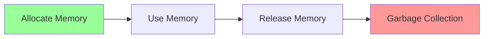
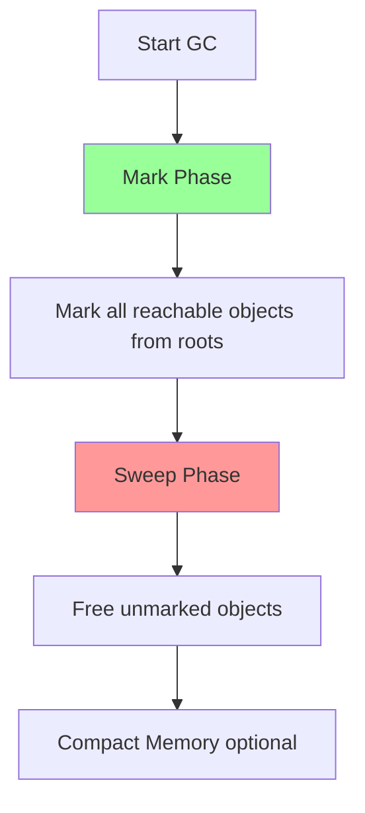

# Performance and Memory Management

> [!summary] Goal
> Master JavaScript performance: understand the Performance API, memory management, garbage collection, optimization techniques, memory leak detection, and profiling with Chrome DevTools. Avoid UI jank and write performant code.

## Table of Contents

1. [[#Performance Measurement]]
2. [[#Performance API]]
3. [[#User Timing API]]
4. [[#Memory Management Basics]]
5. [[#Garbage Collection]]
6. [[#Memory Leaks]]
7. [[#Optimization Techniques]]
8. [[#Chrome DevTools Profiling]]
9. [[#Best Practices]]
10. [[#Interview Questions]]

---

## Performance Measurement

### Performance.now()

```javascript
// High-resolution timestamp (microseconds)
const start = performance.now();

// Do some work
for (let i = 0; i < 1000000; i++) {
  // ...
}

const end = performance.now();
console.log(`Operation took ${end - start}ms`);

// More precise than Date.now()
console.log(Date.now());        // 1614556800000 (milliseconds)
console.log(performance.now()); // 12345.67891234 (microseconds)
```

### Benchmarking Function

```javascript
function benchmark(fn, iterations = 1000) {
  const start = performance.now();
  
  for (let i = 0; i < iterations; i++) {
    fn();
  }
  
  const end = performance.now();
  const total = end - start;
  const average = total / iterations;
  
  return {
    total: `${total.toFixed(2)}ms`,
    average: `${average.toFixed(4)}ms`,
    iterations
  };
}

// Usage:
const result = benchmark(() => {
  JSON.parse('{"foo": "bar"}');
}, 10000);

console.log(result);
// { total: '45.23ms', average: '0.0045ms', iterations: 10000 }
```

### Comparing Approaches

```javascript
function comparePerformance(tests) {
  const results = {};
  
  for (const [name, fn] of Object.entries(tests)) {
    results[name] = benchmark(fn, 10000);
  }
  
  return results;
}

// Usage:
const results = comparePerformance({
  'String concatenation': () => {
    let str = '';
    for (let i = 0; i < 100; i++) {
      str += 'x';
    }
  },
  'Array join': () => {
    const arr = [];
    for (let i = 0; i < 100; i++) {
      arr.push('x');
    }
    arr.join('');
  }
});

console.table(results);
```

---

## Performance API

### Navigation Timing

```javascript
// Page load performance
const perfData = performance.getEntriesByType('navigation')[0];

console.log({
  // DNS lookup
  dnsTime: perfData.domainLookupEnd - perfData.domainLookupStart,
  
  // TCP connection
  tcpTime: perfData.connectEnd - perfData.connectStart,
  
  // TLS negotiation
  tlsTime: perfData.requestStart - perfData.secureConnectionStart,
  
  // Time to first byte
  ttfb: perfData.responseStart - perfData.requestStart,
  
  // Response download
  downloadTime: perfData.responseEnd - perfData.responseStart,
  
  // DOM processing
  domProcessing: perfData.domComplete - perfData.domLoading,
  
  // Total load time
  loadTime: perfData.loadEventEnd - perfData.fetchStart
});
```

### Resource Timing

```javascript
// Get all resource timings
const resources = performance.getEntriesByType('resource');

resources.forEach(resource => {
  console.log({
    name: resource.name,
    type: resource.initiatorType, // script, img, css, etc.
    duration: resource.duration,
    size: resource.transferSize,
    cached: resource.transferSize === 0
  });
});

// Find slow resources
const slowResources = resources
  .filter(r => r.duration > 100)
  .sort((a, b) => b.duration - a.duration);

console.log('Slow resources:', slowResources);
```

### Paint Timing

```javascript
// First Paint and First Contentful Paint
const paintTimings = performance.getEntriesByType('paint');

paintTimings.forEach(({ name, startTime }) => {
  console.log(`${name}: ${startTime}ms`);
});

// first-paint: 250.5ms
// first-contentful-paint: 320.8ms
```

### Long Tasks API

```javascript
// Requires observer
const observer = new PerformanceObserver((list) => {
  for (const entry of list.getEntries()) {
    console.warn('Long task detected:', {
      duration: entry.duration,
      startTime: entry.startTime,
      name: entry.name
    });
  }
});

observer.observe({ entryTypes: ['longtask'] });

// Any task > 50ms is considered "long"
```

---

## User Timing API

### Marks and Measures

```javascript
// Mark specific points in time
performance.mark('start-fetch');

await fetch('/api/data');

performance.mark('end-fetch');

// Measure between marks
performance.measure('fetch-duration', 'start-fetch', 'end-fetch');

// Get measure
const measure = performance.getEntriesByName('fetch-duration')[0];
console.log(`Fetch took: ${measure.duration}ms`);

// Clear marks and measures
performance.clearMarks();
performance.clearMeasures();
```

### Advanced Timing Example

```javascript
class PerformanceTracker {
  constructor() {
    this.marks = new Map();
  }
  
  start(name) {
    const markName = `${name}-start`;
    performance.mark(markName);
    this.marks.set(name, markName);
  }
  
  end(name) {
    const startMark = this.marks.get(name);
    if (!startMark) {
      console.warn(`No start mark for: ${name}`);
      return;
    }
    
    const endMark = `${name}-end`;
    performance.mark(endMark);
    performance.measure(name, startMark, endMark);
    
    const measure = performance.getEntriesByName(name)[0];
    console.log(`${name}: ${measure.duration.toFixed(2)}ms`);
    
    this.marks.delete(name);
  }
  
  async wrap(name, fn) {
    this.start(name);
    try {
      return await fn();
    } finally {
      this.end(name);
    }
  }
}

// Usage:
const tracker = new PerformanceTracker();

tracker.start('data-processing');
processData();
tracker.end('data-processing');

// Or with wrap:
const result = await tracker.wrap('fetch-users', async () => {
  return await fetchUsers();
});
```

### Performance Observer

```javascript
const observer = new PerformanceObserver((list) => {
  for (const entry of list.getEntries()) {
    console.log(`${entry.name}: ${entry.duration}ms`);
    
    // Send to analytics
    sendToAnalytics({
      metric: entry.name,
      value: entry.duration,
      type: entry.entryType
    });
  }
});

// Observe specific entry types
observer.observe({ 
  entryTypes: ['measure', 'mark', 'resource', 'navigation'] 
});
```

---

## Memory Management Basics

### Memory Lifecycle



### Allocation

```javascript
// Primitive allocation (stack)
let num = 42;           // Number
let str = 'hello';      // String
let bool = true;        // Boolean

// Object allocation (heap)
let obj = { foo: 'bar' };        // Object
let arr = [1, 2, 3];             // Array
let fn = function() {};          // Function
let date = new Date();           // Date object

// Large allocations
let bigArray = new Array(1000000).fill(0);
let bigString = 'x'.repeat(1000000);
```

### Reachability

```javascript
// Reachable - won't be GC'd
let user = { name: 'John' };
let admin = user; // Two references

user = null; // Still reachable via admin

admin = null; // Now unreachable, can be GC'd

// Unreachable - will be GC'd
function createObject() {
  let temp = { data: 'temporary' };
  // temp is unreachable after function returns
}
createObject();
```

### Reference Counting (not used in modern JS)

```javascript
// Old approach (IE 8 and below)
let obj1 = { ref: obj2 }; // ref count: 1
let obj2 = { ref: obj1 }; // ref count: 1

// Circular reference - memory leak in old engines!
obj1 = null;
obj2 = null;
// Both still have ref count > 0 in reference counting
```

---

## Garbage Collection

### How GC Works

Modern JavaScript engines use **mark-and-sweep** algorithm:



**Roots:**
- Global object
- Currently executing function stack
- Active closures

### Generational GC

V8 uses generational hypothesis:

```
┌──────────────────────────────────┐
│     Young Generation (New)       │
│  - Most objects die young        │
│  - Fast, frequent collection     │
│  - ~1-8MB                        │
└──────────────────────────────────┘
          ↓ (survived several GCs)
┌──────────────────────────────────┐
│     Old Generation               │
│  - Long-lived objects            │
│  - Slower, less frequent         │
│  - Larger                        │
└──────────────────────────────────┘
```

**Scavenge (Minor GC):** Young generation (~1ms)

**Mark-Sweep (Major GC):** Old generation (~100ms)

### GC Triggers

```javascript
// Automatic triggers:
// 1. Allocation failure (heap full)
// 2. Time-based (periodic)
// 3. Manual (global.gc() with --expose-gc flag)

// Node.js: Manual GC (for testing)
// node --expose-gc app.js
if (global.gc) {
  global.gc();
  console.log('Manual GC triggered');
}
```

### Monitoring GC

```javascript
// Node.js: Track GC events
const v8 = require('v8');
const { PerformanceObserver } = require('perf_hooks');

const obs = new PerformanceObserver((list) => {
  const entries = list.getEntries();
  entries.forEach((entry) => {
    console.log('GC:', {
      kind: entry.detail.kind,          // 1=Scavenge, 2=Mark-Sweep
      duration: entry.duration,
      flags: entry.detail.flags
    });
  });
});

obs.observe({ entryTypes: ['gc'] });

// Get heap statistics
const heapStats = v8.getHeapStatistics();
console.log({
  totalHeapSize: heapStats.total_heap_size,
  usedHeapSize: heapStats.used_heap_size,
  heapSizeLimit: heapStats.heap_size_limit
});
```

### Stop-the-World

GC pauses JavaScript execution:

```javascript
// During major GC:
// - All JavaScript execution stops
// - Can cause jank/freezing
// - ~100ms pause on large heaps

// Strategies to reduce impact:
// 1. Reduce heap size (fewer long-lived objects)
// 2. Use object pools
// 3. Incremental marking (V8 does this)
```

---

## Memory Leaks

### Leak #1: Forgotten Timers

```javascript
// ❌ Leak
function startPolling() {
  setInterval(() => {
    fetch('/api/status');
  }, 1000);
  // Never cleared!
}

// ✅ Fix
function startPolling() {
  const intervalId = setInterval(() => {
    fetch('/api/status');
  }, 1000);
  
  return () => clearInterval(intervalId);
}

const stopPolling = startPolling();
// Later:
stopPolling();
```

### Leak #2: Event Listeners

```javascript
// ❌ Leak
function addListener() {
  const button = document.getElementById('btn');
  button.addEventListener('click', handleClick);
  // Never removed!
}

// ✅ Fix
function addListener() {
  const button = document.getElementById('btn');
  const handler = handleClick.bind(this);
  button.addEventListener('click', handler);
  
  return () => {
    button.removeEventListener('click', handler);
  };
}

const removeListener = addListener();
// Later:
removeListener();
```

### Leak #3: Closures Holding References

```javascript
// ❌ Leak
function createClosure() {
  const hugeArray = new Array(1000000).fill('data');
  
  return function() {
    console.log('Closure');
    // Entire hugeArray is kept in memory!
  };
}

const fn = createClosure();
// hugeArray can't be GC'd while fn exists

// ✅ Fix
function createClosure() {
  const hugeArray = new Array(1000000).fill('data');
  const needed = hugeArray[0]; // Extract only what's needed
  
  return function() {
    console.log(needed);
    // Only 'needed' is kept, hugeArray can be GC'd
  };
}
```

### Leak #4: Detached DOM Nodes

```javascript
// ❌ Leak
let detachedNodes = [];

function removeElement() {
  const element = document.getElementById('myDiv');
  element.remove(); // Removed from DOM
  detachedNodes.push(element); // But still referenced!
}

// ✅ Fix
function removeElement() {
  const element = document.getElementById('myDiv');
  element.remove();
  // Don't keep reference
}
```

### Leak #5: Global Variables

```javascript
// ❌ Leak
function processData(data) {
  // Accidental global (missing var/let/const)
  cache = data; // Lives forever!
}

// ✅ Fix
function processData(data) {
  let cache = data; // Properly scoped
}

// Or use strict mode:
'use strict';
function processData(data) {
  cache = data; // ReferenceError!
}
```

### Leak #6: Caches Without Limits

```javascript
// ❌ Leak
const cache = new Map();

function getCachedData(key) {
  if (cache.has(key)) {
    return cache.get(key);
  }
  
  const data = fetchData(key);
  cache.set(key, data); // Grows forever!
  return data;
}

// ✅ Fix: LRU Cache
class LRUCache {
  constructor(maxSize = 100) {
    this.maxSize = maxSize;
    this.cache = new Map();
  }
  
  get(key) {
    if (!this.cache.has(key)) return null;
    
    // Move to end (most recently used)
    const value = this.cache.get(key);
    this.cache.delete(key);
    this.cache.set(key, value);
    
    return value;
  }
  
  set(key, value) {
    // Remove if exists
    if (this.cache.has(key)) {
      this.cache.delete(key);
    }
    
    // Add to end
    this.cache.set(key, value);
    
    // Evict oldest if over limit
    if (this.cache.size > this.maxSize) {
      const firstKey = this.cache.keys().next().value;
      this.cache.delete(firstKey);
    }
  }
}

const cache = new LRUCache(1000);
```

### Leak #7: Console.log in Production

```javascript
// ❌ Leak
function processLargeData(data) {
  console.log('Processing:', data); // Keeps reference!
  // ...
}

// Console keeps references to logged objects
// In DevTools closed, they can't be GC'd

// ✅ Fix
function processLargeData(data) {
  if (process.env.NODE_ENV === 'development') {
    console.log('Processing:', data);
  }
  // ...
}
```

### Leak #8: WeakMap/WeakSet for Metadata

```javascript
// ❌ Leak
const metadata = new Map();

function addMetadata(obj, meta) {
  metadata.set(obj, meta);
  // obj can't be GC'd!
}

// ✅ Fix: Use WeakMap
const metadata = new WeakMap();

function addMetadata(obj, meta) {
  metadata.set(obj, meta);
  // When obj is GC'd, entry is removed automatically!
}
```

### Leak #9: Circular References in Data

```javascript
// ❌ Potential issue (modern engines handle this)
const parent = { name: 'parent' };
const child = { name: 'child', parent };
parent.child = child;

// Modern GC handles this fine
// But avoid if possible for clarity

// ✅ Better: One-way references
const parent = { name: 'parent', childId: 'c1' };
const child = { id: 'c1', name: 'child', parentId: 'p1' };
```

### Leak #10: Observers and Subscriptions

```javascript
// ❌ Leak
class EventBus {
  constructor() {
    this.listeners = [];
  }
  
  subscribe(listener) {
    this.listeners.push(listener);
    // No way to unsubscribe!
  }
}

// ✅ Fix
class EventBus {
  constructor() {
    this.listeners = [];
  }
  
  subscribe(listener) {
    this.listeners.push(listener);
    
    // Return unsubscribe function
    return () => {
      const index = this.listeners.indexOf(listener);
      if (index > -1) {
        this.listeners.splice(index, 1);
      }
    };
  }
}

const unsubscribe = eventBus.subscribe(handler);
// Later:
unsubscribe();
```

---

## Optimization Techniques

### 1. Avoid Repeated Lookups

```javascript
// ❌ Slow
function processItems(items) {
  for (let i = 0; i < items.length; i++) { // Looks up .length every iteration
    console.log(items[i]);
  }
}

// ✅ Fast
function processItems(items) {
  const len = items.length; // Cache length
  for (let i = 0; i < len; i++) {
    console.log(items[i]);
  }
}

// ✅ Even better: for-of
function processItems(items) {
  for (const item of items) {
    console.log(item);
  }
}
```

### 2. String Concatenation

```javascript
// ❌ Slow: O(n²) - creates new string each iteration
let str = '';
for (let i = 0; i < 10000; i++) {
  str += 'x';
}

// ✅ Fast: O(n)
const arr = [];
for (let i = 0; i < 10000; i++) {
  arr.push('x');
}
const str = arr.join('');

// ✅ Best: Use repeat
const str = 'x'.repeat(10000);
```

### 3. Object Property Access

```javascript
// ❌ Slow: Dynamic property access
function getValue(obj, key) {
  return obj[key];
}

// ✅ Fast: Direct property access
function getValue(obj) {
  return obj.value;
}

// ❌ Slow: Nested property access
const value = obj.level1.level2.level3.value;

// ✅ Fast: Destructure once
const { level1: { level2: { level3: { value } } } } = obj;
```

### 4. Array Operations

```javascript
// ❌ Slow: Delete creates sparse array
const arr = [1, 2, 3, 4, 5];
delete arr[2]; // [1, 2, empty, 4, 5]

// ✅ Fast: Use splice
arr.splice(2, 1); // [1, 2, 4, 5]

// ❌ Slow: Unshift (reindexes all elements)
arr.unshift(0);

// ✅ Fast: Push (appends to end)
arr.push(6);
```

### 5. Debouncing and Throttling

```javascript
// Debounce: Execute after quiet period
function debounce(fn, delay) {
  let timeoutId;
  return function(...args) {
    clearTimeout(timeoutId);
    timeoutId = setTimeout(() => fn.apply(this, args), delay);
  };
}

// Usage: Search input
const search = debounce((query) => {
  fetchResults(query);
}, 300);

input.addEventListener('input', (e) => search(e.target.value));

// Throttle: Execute at most once per interval
function throttle(fn, interval) {
  let lastTime = 0;
  return function(...args) {
    const now = Date.now();
    if (now - lastTime >= interval) {
      lastTime = now;
      fn.apply(this, args);
    }
  };
}

// Usage: Scroll event
const handleScroll = throttle(() => {
  console.log('Scrolled');
}, 100);

window.addEventListener('scroll', handleScroll);
```

### 6. Lazy Loading

```javascript
// Lazy load expensive modules
let heavyModule;

async function getHeavyModule() {
  if (!heavyModule) {
    heavyModule = await import('./heavy-module.js');
  }
  return heavyModule;
}

// Use only when needed
button.addEventListener('click', async () => {
  const module = await getHeavyModule();
  module.doSomething();
});
```

### 7. Object Pooling

```javascript
// Reuse objects instead of creating new ones
class ObjectPool {
  constructor(factory, reset) {
    this.factory = factory;
    this.reset = reset;
    this.pool = [];
  }
  
  acquire() {
    return this.pool.pop() || this.factory();
  }
  
  release(obj) {
    this.reset(obj);
    this.pool.push(obj);
  }
}

// Usage: Particle system
const particlePool = new ObjectPool(
  () => ({ x: 0, y: 0, vx: 0, vy: 0 }),
  (p) => { p.x = 0; p.y = 0; p.vx = 0; p.vy = 0; }
);

function createParticle() {
  const particle = particlePool.acquire();
  particle.x = Math.random() * 100;
  return particle;
}

function destroyParticle(particle) {
  particlePool.release(particle);
}
```

### 8. Memoization

```javascript
function memoize(fn) {
  const cache = new Map();
  
  return function(...args) {
    const key = JSON.stringify(args);
    
    if (cache.has(key)) {
      return cache.get(key);
    }
    
    const result = fn.apply(this, args);
    cache.set(key, result);
    return result;
  };
}

// Usage:
const expensiveOperation = memoize((n) => {
  console.log('Computing...');
  return n * 2;
});

expensiveOperation(5); // Computing... 10
expensiveOperation(5); // 10 (cached)
```

### 9. Virtual Scrolling

```javascript
// Render only visible items
class VirtualList {
  constructor(items, itemHeight, containerHeight) {
    this.items = items;
    this.itemHeight = itemHeight;
    this.containerHeight = containerHeight;
    this.scrollTop = 0;
  }
  
  getVisibleItems() {
    const startIndex = Math.floor(this.scrollTop / this.itemHeight);
    const endIndex = Math.ceil((this.scrollTop + this.containerHeight) / this.itemHeight);
    
    return {
      items: this.items.slice(startIndex, endIndex),
      offsetY: startIndex * this.itemHeight
    };
  }
  
  onScroll(scrollTop) {
    this.scrollTop = scrollTop;
    return this.getVisibleItems();
  }
}

// Only render ~20 items instead of 10,000
const list = new VirtualList(items, 50, 1000);
```

### 10. RequestAnimationFrame for Animations

```javascript
// ❌ Bad: setTimeout for animations
function animate() {
  element.style.left = position + 'px';
  position++;
  setTimeout(animate, 16); // ~60fps
}

// ✅ Good: requestAnimationFrame
function animate() {
  element.style.left = position + 'px';
  position++;
  requestAnimationFrame(animate);
}

requestAnimationFrame(animate);
```

---

## Chrome DevTools Profiling

### Performance Tab

**1. Record Performance:**

```
1. Open DevTools (F12)
2. Go to Performance tab
3. Click Record (Ctrl+E)
4. Perform actions
5. Stop recording
```

**2. Analyze:**

- **FPS chart**: Green = 60fps, Red = dropped frames
- **Main thread**: Function call stack
- **Long tasks**: Yellow = long task (>50ms)
- **Bottom-up**: Where time was spent

**3. Find bottlenecks:**

```javascript
// Look for:
// - Red triangles (forced reflow/layout)
// - Long yellow bars (long tasks)
// - Many tiny functions (overhead)
```

### Memory Tab

**1. Heap Snapshot:**

```
1. Memory tab > Heap snapshot
2. Take snapshot
3. Perform action
4. Take another snapshot
5. Compare: Snapshot 2 - Snapshot 1
```

**2. Allocation Timeline:**

```
1. Memory tab > Allocation instrumentation on timeline
2. Start recording
3. Perform action
4. Stop recording
5. See allocations over time
```

**3. Find leaks:**

```javascript
// Look for:
// - Growing heaps (repeated action should stabilize)
// - Detached DOM nodes
// - Large retained sizes
```

**4. Heap Snapshot Example:**

```
Summary view:
- Constructor: Object type
- Distance: Steps from GC root
- Shallow Size: Object size
- Retained Size: Object + dependencies

Filter by constructor:
- Array
- Object
- (system) / HTMLDivElement (DOM nodes)
```

### Coverage Tab

```
1. Open Coverage (Ctrl+Shift+P > Show Coverage)
2. Click Record
3. Interact with page
4. Stop
5. See unused CSS/JS (red = unused, green = used)
```

### Rendering Tab

```
1. Ctrl+Shift+P > Show Rendering
2. Enable:
   - Paint flashing: See what's repainting
   - Layout Shift Regions: See layout shifts
   - FPS meter: Real-time FPS
```

### Profiling Node.js

```bash
# CPU profiling
node --prof app.js
# Creates isolate-0x...-v8.log

# Process log
node --prof-process isolate-0x...-v8.log > processed.txt

# Heap snapshot
node --inspect app.js
# Open chrome://inspect
# Take heap snapshot
```

---

## Best Practices

### 1. Minimize Reflows and Repaints

```javascript
// ❌ Bad: Multiple reflows
element.style.width = '100px';  // Reflow
element.style.height = '100px'; // Reflow
element.style.padding = '10px'; // Reflow

// ✅ Good: Single reflow
element.style.cssText = 'width: 100px; height: 100px; padding: 10px';

// ✅ Or use class
element.classList.add('new-styles');
```

### 2. Batch DOM Updates

```javascript
// ❌ Bad
for (let i = 0; i < 1000; i++) {
  const div = document.createElement('div');
  div.textContent = i;
  document.body.appendChild(div); // Reflow each time!
}

// ✅ Good: DocumentFragment
const fragment = document.createDocumentFragment();
for (let i = 0; i < 1000; i++) {
  const div = document.createElement('div');
  div.textContent = i;
  fragment.appendChild(div);
}
document.body.appendChild(fragment); // Single reflow
```

### 3. Use CSS for Animations

```javascript
// ❌ Bad: JavaScript animation
function animate() {
  element.style.left = position + 'px';
  position++;
  requestAnimationFrame(animate);
}

// ✅ Good: CSS animation (GPU accelerated)
element.style.transform = `translateX(${position}px)`;
// Or use CSS @keyframes
```

### 4. Avoid Memory Leaks

```javascript
// ✅ Always cleanup
class Component {
  mount() {
    this.listener = () => {};
    window.addEventListener('resize', this.listener);
    this.interval = setInterval(() => {}, 1000);
  }
  
  unmount() {
    window.removeEventListener('resize', this.listener);
    clearInterval(this.interval);
  }
}
```

### 5. Use Web Workers for Heavy Computation

```javascript
// main.js
const worker = new Worker('worker.js');

worker.postMessage({ data: largeArray });

worker.onmessage = (e) => {
  console.log('Result:', e.data);
};

// worker.js
self.onmessage = (e) => {
  const result = heavyComputation(e.data.data);
  self.postMessage(result);
};
```

### 6. Lazy Load Images

```html
<!-- Native lazy loading -->


<!-- Or Intersection Observer -->
<script>
const observer = new IntersectionObserver((entries) => {
  entries.forEach(entry => {
    if (entry.isIntersecting) {
      const img = entry.target;
      img.src = img.dataset.src;
      observer.unobserve(img);
    }
  });
});

document.querySelectorAll('img[data-src]').forEach(img => {
  observer.observe(img);
});
</script>
```

### 7. Code Splitting

```javascript
// Instead of:
import HeavyComponent from './HeavyComponent';

// Use dynamic import:
const HeavyComponent = React.lazy(() => import('./HeavyComponent'));

function App() {
  return (
    <Suspense fallback={<div>Loading...</div>}>
      <HeavyComponent />
    </Suspense>
  );
}
```

### 8. Monitor Performance in Production

```javascript
// Send metrics to analytics
if ('PerformanceObserver' in window) {
  const observer = new PerformanceObserver((list) => {
    for (const entry of list.getEntries()) {
      // Send to analytics
      analytics.send({
        metric: entry.name,
        value: entry.duration,
        type: entry.entryType
      });
    }
  });
  
  observer.observe({ entryTypes: ['measure', 'navigation'] });
}
```

---

## Interview Questions

### Q1: How does garbage collection work in JavaScript?

**Answer:**

JavaScript uses **mark-and-sweep** algorithm:

**1. Mark Phase:**
- Start from roots (global object, stack, closures)
- Mark all reachable objects
- Follow all references recursively

**2. Sweep Phase:**
- Iterate through heap
- Free unmarked (unreachable) objects
- Optionally compact memory

**Generational GC:**

V8 divides heap into two generations:

```
Young Generation (New Space):
- Small (~1-8MB)
- Most objects die young
- Fast Scavenge GC (~1ms)
- Minor GC, frequent

Old Generation:
- Larger
- Long-lived objects
- Slower Mark-Sweep GC (~100ms)
- Major GC, less frequent
```

**Example:**

```javascript
function createObjects() {
  let obj1 = { data: 'temp' }; // Allocated in young gen
  let obj2 = { data: 'temp' };
  
  return obj1; // obj1 survives, obj2 dies
}

const longLived = createObjects();
// obj2 is GC'd quickly (young gen)
// longLived promoted to old gen if survives several GCs
```

---

### Q2: What are common causes of memory leaks and how do you prevent them?

**Answer:**

**Top 10 Memory Leaks:**

**1. Forgotten timers/intervals:**

```javascript
// ❌ Leak
setInterval(() => {}, 1000);

// ✅ Fix
const id = setInterval(() => {}, 1000);
clearInterval(id);
```

**2. Event listeners:**

```javascript
// ❌ Leak
element.addEventListener('click', handler);

// ✅ Fix
element.addEventListener('click', handler);
element.removeEventListener('click', handler);
```

**3. Closures:**

```javascript
// ❌ Leak
function outer() {
  const huge = new Array(1000000);
  return () => console.log('hi'); // Keeps huge!
}

// ✅ Fix
function outer() {
  const huge = new Array(1000000);
  const needed = huge[0];
  return () => console.log(needed); // Only keeps needed
}
```

**4. Detached DOM:**

```javascript
// ❌ Leak
let nodes = [];
nodes.push(document.getElementById('btn'));
document.body.removeChild(document.getElementById('btn'));
// Still referenced in nodes array!

// ✅ Fix
// Don't store DOM references long-term
```

**5. Global variables:**

```javascript
// ❌ Leak
function fn() {
  leak = 'I am global!'; // Missing var/let/const
}

// ✅ Fix
function fn() {
  let notLeak = 'I am scoped';
}
```

**6. Unbounded caches:**

```javascript
// ❌ Leak
const cache = new Map();
cache.set(key, value); // Grows forever

// ✅ Fix: LRU cache with size limit
class LRUCache {
  constructor(maxSize) {
    this.maxSize = maxSize;
    this.cache = new Map();
  }
  // ... eviction logic
}
```

**Detection:**

```javascript
// Chrome DevTools:
// 1. Memory > Heap Snapshot
// 2. Take snapshot, perform action, take another
// 3. Compare snapshots
// 4. Look for growing allocations
```

---

### Q3: How do you measure and optimize performance in JavaScript?

**Answer:**

**Measurement:**

```javascript
// 1. Performance API
const start = performance.now();
doSomething();
const end = performance.now();
console.log(`Took ${end - start}ms`);

// 2. User Timing API
performance.mark('start');
doSomething();
performance.mark('end');
performance.measure('operation', 'start', 'end');

const measure = performance.getEntriesByName('operation')[0];
console.log(`Duration: ${measure.duration}ms`);

// 3. Performance Observer
const observer = new PerformanceObserver((list) => {
  for (const entry of list.getEntries()) {
    console.log(`${entry.name}: ${entry.duration}ms`);
  }
});
observer.observe({ entryTypes: ['measure', 'navigation'] });
```

**Optimization strategies:**

**1. Algorithmic:**

```javascript
// ❌ O(n²)
let str = '';
for (let i = 0; i < n; i++) {
  str += 'x'; // Creates new string each time
}

// ✅ O(n)
const arr = [];
for (let i = 0; i < n; i++) {
  arr.push('x');
}
const str = arr.join('');
```

**2. Memoization:**

```javascript
const memo = new Map();

function expensive(n) {
  if (memo.has(n)) return memo.get(n);
  
  const result = /* expensive calculation */;
  memo.set(n, result);
  return result;
}
```

**3. Debouncing/Throttling:**

```javascript
// Debounce: Wait for quiet period
const debouncedSearch = debounce(search, 300);

// Throttle: Limit execution rate
const throttledScroll = throttle(handleScroll, 100);
```

**4. Virtual rendering:**

```javascript
// Only render visible items
function getVisibleItems(allItems, scrollTop, viewportHeight) {
  const startIndex = Math.floor(scrollTop / itemHeight);
  const endIndex = Math.ceil((scrollTop + viewportHeight) / itemHeight);
  return allItems.slice(startIndex, endIndex);
}
```

**5. Code splitting:**

```javascript
// Lazy load heavy modules
const Heavy = React.lazy(() => import('./Heavy'));
```

---

### Q4: What is the difference between shallow size and retained size?

**Answer:**

**Shallow Size:**
- Size of the object itself
- Doesn't include referenced objects

**Retained Size:**
- Total size that would be freed if object was GC'd
- Includes all objects only reachable through this object

**Example:**

```javascript
const obj1 = { data: new Array(1000) }; // Shallow: ~32 bytes
                                         // Retained: ~8000 bytes

const obj2 = obj1; // Shallow: ~32 bytes
                   // Retained: ~32 bytes
                   // (array still reachable via obj1)

obj1 = null; // Now obj2's retained size = ~8032 bytes
```

**Visual:**

```
obj1 ──┐
       ├──> { data } ──> [Array 1000]
obj2 ──┘

Shallow size of obj1: ~32 bytes (pointer + object header)
Retained size of obj1: ~32 bytes (array still reachable via obj2)

After obj1 = null:
Retained size of obj2: ~8032 bytes (object + array)
```

**In DevTools:**

```
Memory > Heap Snapshot:
- Shallow Size: Object itself
- Retained Size: Object + exclusive dependencies
- Distance: Steps from GC root
```

---

### Q5: How do you prevent and detect UI jank?

**Answer:**

**UI jank** = dropped frames (below 60fps)

**Causes:**

1. Long JavaScript tasks (>50ms)
2. Forced synchronous layout
3. Heavy repaints/reflows

**Prevention:**

**1. Avoid long tasks:**

```javascript
// ❌ Blocks UI
function processLargeArray(arr) {
  for (let i = 0; i < arr.length; i++) {
    heavyOperation(arr[i]); // Takes 1 second!
  }
}

// ✅ Break into chunks
async function processLargeArray(arr, chunkSize = 100) {
  for (let i = 0; i < arr.length; i += chunkSize) {
    const chunk = arr.slice(i, i + chunkSize);
    chunk.forEach(heavyOperation);
    
    await new Promise(resolve => setTimeout(resolve, 0)); // Yield to browser
  }
}
```

**2. Use requestAnimationFrame:**

```javascript
// ❌ Bad
setInterval(() => {
  element.style.left = position + 'px';
}, 16);

// ✅ Good
function animate() {
  element.style.left = position + 'px';
  requestAnimationFrame(animate);
}
requestAnimationFrame(animate);
```

**3. Avoid forced sync layout:**

```javascript
// ❌ Forced reflow
element.style.width = '100px';
const height = element.offsetHeight; // Forces layout!
element.style.height = height + 'px'; // Another layout!

// ✅ Batch reads and writes
const height = element.offsetHeight; // Read
element.style.width = '100px';       // Write
element.style.height = height + 'px'; // Write
```

**4. Use CSS for animations:**

```css
/* GPU accelerated */
.element {
  transform: translateX(100px);
  transition: transform 0.3s;
}
```

**Detection:**

```javascript
// Long Tasks API
const observer = new PerformanceObserver((list) => {
  for (const entry of list.getEntries()) {
    if (entry.duration > 50) {
      console.warn('Long task:', entry.duration);
    }
  }
});
observer.observe({ entryTypes: ['longtask'] });

// FPS monitoring
let lastTime = performance.now();
let frames = 0;

function measureFPS() {
  const now = performance.now();
  frames++;
  
  if (now >= lastTime + 1000) {
    const fps = Math.round((frames * 1000) / (now - lastTime));
    console.log(`FPS: ${fps}`);
    frames = 0;
    lastTime = now;
  }
  
  requestAnimationFrame(measureFPS);
}
measureFPS();
```

**Chrome DevTools:**

```
Performance tab:
- Green = 60fps
- Yellow/Red = dropped frames
- Look for long yellow bars (>50ms)
```

---

### Q6: Explain WeakMap and WeakSet. When would you use them?

**Answer:**

**WeakMap:**
- Keys must be objects (not primitives)
- Keys are weakly held (can be GC'd)
- No iteration methods
- Use for metadata/private data

```javascript
// Regular Map prevents GC
const map = new Map();
let obj = { data: 'temp' };
map.set(obj, 'metadata');
obj = null; // obj can't be GC'd! (map still references it)

// WeakMap allows GC
const weakMap = new WeakMap();
let obj2 = { data: 'temp' };
weakMap.set(obj2, 'metadata');
obj2 = null; // obj2 CAN be GC'd! (weak reference)
```

**Use cases:**

**1. Private data:**

```javascript
const privateData = new WeakMap();

class User {
  constructor(name) {
    privateData.set(this, { password: 'secret' });
    this.name = name;
  }
  
  getPassword() {
    return privateData.get(this).password;
  }
}

const user = new User('John');
// No way to access password from outside
// When user is GC'd, private data is GC'd too
```

**2. Caching:**

```javascript
const cache = new WeakMap();

function process(obj) {
  if (cache.has(obj)) {
    return cache.get(obj);
  }
  
  const result = expensiveOperation(obj);
  cache.set(obj, result);
  return result;
}

// When obj is GC'd, cache entry is removed automatically
```

**WeakSet:**

```javascript
const weakSet = new WeakSet();
let obj = { data: 'temp' };

weakSet.add(obj);
console.log(weakSet.has(obj)); // true

obj = null; // obj can be GC'd
```

**Use case: Tracking objects:**

```javascript
const processedObjects = new WeakSet();

function processOnce(obj) {
  if (processedObjects.has(obj)) {
    return; // Already processed
  }
  
  // Process
  doSomething(obj);
  
  processedObjects.add(obj);
}
```

**Comparison:**

| Feature | Map/Set | WeakMap/WeakSet |
|---------|---------|-----------------|
| Key types | Any | Objects only |
| GC-able keys | No | Yes |
| Iteration | Yes | No |
| Size property | Yes | No |
| Use case | Data storage | Metadata, caching |

---

### Q7: How do you profile and debug memory leaks in production?

**Answer:**

**Development (Chrome DevTools):**

**1. Heap Snapshots:**

```
1. Open DevTools > Memory
2. Take snapshot (baseline)
3. Perform action (e.g., open/close modal)
4. Take another snapshot
5. Select "Comparison" view
6. Look for:
   - Growing allocations
   - Detached DOM nodes
   - Large retained sizes
```

**2. Allocation Timeline:**

```
1. Memory > Allocation instrumentation on timeline
2. Record
3. Perform repeated action
4. Stop
5. Look for:
   - Allocations that never decrease
   - Spikes that don't drop
```

**3. Allocation Sampling:**

```
1. Memory > Allocation sampling
2. Start
3. Perform action
4. Stop
5. See allocation call stacks
```

**Production (Node.js):**

**1. Heap snapshots:**

```javascript
const v8 = require('v8');
const fs = require('fs');

// Take snapshot
const snapshot = v8.writeHeapSnapshot();
console.log('Snapshot written to:', snapshot);

// Or on demand:
const heapdump = require('heapdump');
heapdump.writeSnapshot((err, filename) => {
  console.log('Snapshot:', filename);
});
```

**2. Monitor heap growth:**

```javascript
const v8 = require('v8');

setInterval(() => {
  const stats = v8.getHeapStatistics();
  console.log({
    used: (stats.used_heap_size / 1024 / 1024).toFixed(2) + ' MB',
    total: (stats.total_heap_size / 1024 / 1024).toFixed(2) + ' MB',
    limit: (stats.heap_size_limit / 1024 / 1024).toFixed(2) + ' MB'
  });
}, 5000);
```

**3. Auto-dump on OOM:**

```bash
node --heapsnapshot-signal=SIGUSR2 app.js

# Send signal to dump:
kill -USR2 <pid>
```

**4. External monitoring:**

```javascript
// Send metrics to monitoring service
const newrelic = require('newrelic');

setInterval(() => {
  const used = process.memoryUsage();
  newrelic.recordMetric('Memory/Heap', used.heapUsed);
  newrelic.recordMetric('Memory/RSS', used.rss);
}, 60000);
```

**Analysis:**

```javascript
// Common leak patterns to look for:

// 1. Growing arrays/caches
const cache = new Map(); // ⚠️ Check if bounded

// 2. Event listeners
element.addEventListener('click', fn); // ⚠️ Check cleanup

// 3. Timers
setInterval(() => {}, 1000); // ⚠️ Check clearInterval

// 4. Closures
function outer() {
  const huge = [];
  return () => {}; // ⚠️ Check what's captured
}

// 5. Detached DOM
let nodes = []; // ⚠️ Check if storing removed nodes
```

**Prevention checklist:**

```javascript
class Component {
  mount() {
    // ✅ Track cleanup functions
    this.cleanup = [];
    
    const listener = () => {};
    window.addEventListener('resize', listener);
    this.cleanup.push(() => window.removeEventListener('resize', listener));
    
    const interval = setInterval(() => {}, 1000);
    this.cleanup.push(() => clearInterval(interval));
  }
  
  unmount() {
    // ✅ Run all cleanup
    this.cleanup.forEach(fn => fn());
  }
}
```

---

### Q8: What are some performance anti-patterns to avoid?

**Answer:**

**1. Nested loops (O(n²)):**

```javascript
// ❌ Bad
for (const item of items) {
  for (const other of items) {
    if (item.id === other.parentId) {
      // ...
    }
  }
}

// ✅ Good: Use Map
const map = new Map(items.map(item => [item.id, item]));
for (const item of items) {
  const parent = map.get(item.parentId);
}
```

**2. Repeated string concatenation:**

```javascript
// ❌ Bad: O(n²)
let html = '';
for (const item of items) {
  html += `<div>${item}</div>`;
}

// ✅ Good: O(n)
const html = items.map(item => `<div>${item}</div>`).join('');
```

**3. Forced synchronous layout:**

```javascript
// ❌ Bad: Layout thrashing
for (const el of elements) {
  el.style.width = '100px';     // Write
  const height = el.offsetHeight; // Read (forces layout!)
  el.style.height = height + 'px'; // Write
}

// ✅ Good: Batch reads and writes
const heights = elements.map(el => el.offsetHeight); // All reads
elements.forEach((el, i) => {
  el.style.width = '100px';
  el.style.height = heights[i] + 'px';
}); // All writes
```

**4. Memory churn:**

```javascript
// ❌ Bad: Creates objects every frame
function render() {
  const config = { x: 0, y: 0, color: 'red' }; // New object!
  draw(config);
  requestAnimationFrame(render);
}

// ✅ Good: Reuse objects
const config = { x: 0, y: 0, color: 'red' };
function render() {
  draw(config);
  requestAnimationFrame(render);
}
```

**5. Large arrays in hot loops:**

```javascript
// ❌ Bad
function process(data) {
  return data
    .filter(x => x.active)
    .map(x => x.value)
    .filter(x => x > 10)
    .map(x => x * 2);
  // Creates 4 intermediate arrays!
}

// ✅ Good: Single pass
function process(data) {
  const result = [];
  for (const item of data) {
    if (item.active && item.value > 10) {
      result.push(item.value * 2);
    }
  }
  return result;
}
```

**6. Unoptimized images:**

```html
<!-- ❌ Bad -->


<!-- ✅ Good -->

```

**7. Synchronous operations in event handlers:**

```javascript
// ❌ Bad
input.addEventListener('input', (e) => {
  const results = expensiveSearch(e.target.value); // Blocks UI!
  displayResults(results);
});

// ✅ Good: Debounce
const debouncedSearch = debounce(async (query) => {
  const results = await expensiveSearch(query);
  displayResults(results);
}, 300);

input.addEventListener('input', (e) => {
  debouncedSearch(e.target.value);
});
```

**8. Unnecessary re-renders:**

```javascript
// ❌ Bad: New object every render
function Component() {
  const style = { color: 'red' }; // New object!
  return <div style={style}>Text</div>;
}

// ✅ Good: Memoize
const style = { color: 'red' };
function Component() {
  return <div style={style}>Text</div>;
}
```

---

## Summary

**Key Takeaways:**

1. **Measure first** - Use Performance API before optimizing
2. **Profile regularly** - Chrome DevTools for memory/CPU
3. **Prevent leaks** - Clean up listeners, timers, references
4. **Optimize algorithms** - Avoid O(n²), use appropriate data structures
5. **Minimize reflows** - Batch DOM updates
6. **Use async wisely** - Web Workers, code splitting, lazy loading
7. **Monitor production** - Track performance metrics
8. **Test at scale** - Performance degrades with data size

**Performance Budget:**

```
- Time to Interactive: < 3s
- First Contentful Paint: < 1s
- Long tasks: < 50ms
- Bundle size: < 200KB (gzipped)
- Memory growth: < 10MB/hour
```

---

## References

- [MDN Memory Management](https://developer.mozilla.org/en-US/docs/Web/JavaScript/Memory_management)
- [Chrome DevTools Performance](https://developer.chrome.com/docs/devtools/performance/)
- [Web Vitals](https://web.dev/vitals/)
- [[01_JS_Runtime_and_Event_Loop|Event Loop]]
- [[01_Closures_Scopes_and_Garbage_Collection|Closures and GC]]
- [[04_V8_Basics_Hidden_Classes_and_ICs|V8 Optimization]]
