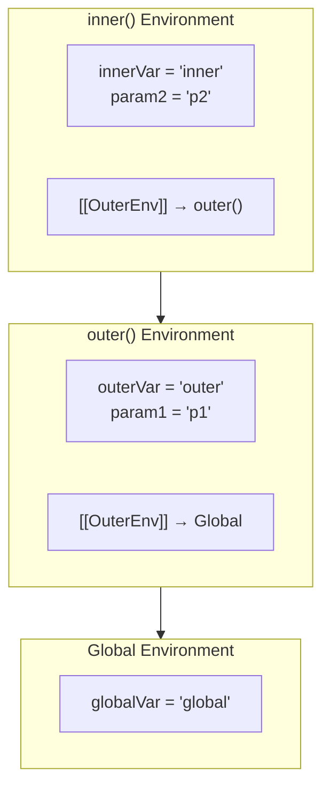
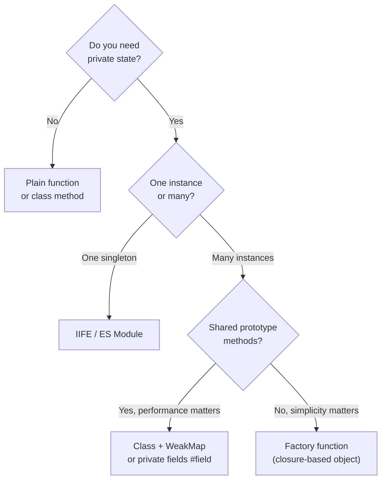
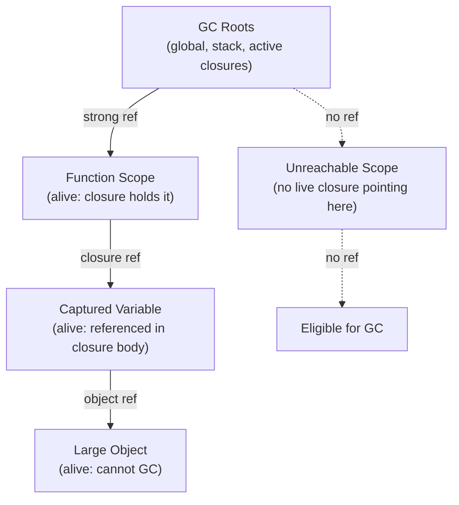

# Closures, Scope, and Garbage Collection

> [!summary] Goal
> Master lexical scope, closures, and memory management. Understand how closures capture variables, when they prevent garbage collection, and how to avoid memory leaks.

## Table of Contents

- [Lexical Scope Explained](#lexical-scope-explained)
- [Execution Contexts and Scope Chain](#execution-contexts-and-scope-chain)
- [Closure Definition and Internals](#closure-definition-and-internals)
- [Closure Memory Implications](#closure-memory-implications)
- [Module Pattern Using Closures](#module-pattern-using-closures)
- [IIFE Pattern](#iife-pattern)
- [Practical Closure Use Cases](#practical-closure-use-cases)
- [Garbage Collection and Closures](#garbage-collection-and-closures)
- [Closure Pitfalls](#closure-pitfalls)
- [Performance Considerations](#performance-considerations)
- [Interview Questions](#interview-questions)

---

## Lexical Scope Explained

**Lexical scope** means scope is determined by where code is **written**, not where it is **called**.

```js
// Example 1: Basic lexical scope
const global = 'global';

function outer() {
  const outerVar = 'outer';
  
  function inner() {
    const innerVar = 'inner';
    console.log(innerVar);  // ✅ own scope
    console.log(outerVar);  // ✅ parent scope
    console.log(global);    // ✅ global scope
  }
  
  inner();
}

outer();
```

**Scope hierarchy:**
```
Global Scope
  └── outer() scope
        └── inner() scope
```

### Scope Resolution Rules

1. **Current scope first**: Check local variables
2. **Parent scope**: Move up the scope chain
3. **Global scope**: Last resort
4. **ReferenceError**: If not found anywhere

```js
// Example 2: Scope resolution
let x = 10;

function level1() {
  let x = 20;
  
  function level2() {
    let x = 30;
    console.log(x); // 30 (own scope wins)
  }
  
  level2();
  console.log(x); // 20 (level1's x)
}

level1();
console.log(x); // 10 (global x)
```

### Shadowing

Inner variables **shadow** (hide) outer variables with the same name.

```js
// Example 3: Variable shadowing
const value = 'global';

function test() {
  const value = 'local';
  console.log(value); // 'local' (shadows global)
}

test();
console.log(value); // 'global'
```

---

## Execution Contexts and Scope Chain

Every function execution creates an **execution context** with:

1. **Variable Environment**: Local variables, parameters
2. **Outer Environment Reference**: Link to parent scope
3. **this binding**: Context object



> [!note] **Scope Chain Lookup Order**
> `inner` → `outer` → `global`  
> Determined at **write time** (where the function is defined), not at call time.

> [!note] **How the Scope Chain Works at Runtime**
> When `inner()` looks up a variable it does not own:
> 1. Check `inner()` environment → not found
> 2. Follow `[[OuterEnv]]` link → check `outer()` environment → found!
> 3. If still not found → follow link to `Global` → found (or `ReferenceError`)
>
> This chain is **fixed at write time** (where the function is defined), not at call time (where it is invoked). That is what "lexical" means.

### Execution Context Example

```js
// Example 4: Execution contexts
let globalVar = 'global';

function outer(param1) {
  let outerVar = 'outer';
  
  function inner(param2) {
    let innerVar = 'inner';
    
    // Scope chain: inner → outer → global
    console.log(innerVar);  // own context
    console.log(param2);    // own context
    console.log(outerVar);  // outer context via scope chain
    console.log(param1);    // outer context via scope chain
    console.log(globalVar); // global context via scope chain
  }
  
  return inner;
}

const fn = outer('param1');
fn('param2');
```

**Scope chain creation:**
1. `inner()` executes → creates context with outer ref to `outer()`
2. Variable lookup follows chain: `inner → outer → global`
3. Chain is **static** (determined at write-time, not call-time)

---

## Closure Definition and Internals

> **Closure**: A function bundled together with references to its surrounding state (lexical environment).

### How Closures Work

```js
// Example 5: Basic closure
function makeCounter() {
  let count = 0; // captured variable
  
  return function increment() {
    count++;
    return count;
  };
}

const counter1 = makeCounter();
const counter2 = makeCounter();

console.log(counter1()); // 1
console.log(counter1()); // 2
console.log(counter2()); // 1 (separate closure)
console.log(counter1()); // 3
```

**What happens:**
1. `makeCounter()` executes → creates `count` variable
2. Returns `increment` function → **captures** reference to `count`
3. Even after `makeCounter()` returns, `count` stays alive
4. Each call to `makeCounter()` creates **separate** closure

### Closure Internals

```js
// Example 6: Multiple closures sharing state
function createAdder() {
  let sum = 0;
  
  return {
    add(n) {
      sum += n;
      return sum;
    },
    get() {
      return sum;
    },
    reset() {
      sum = 0;
    }
  };
}

const adder = createAdder();
adder.add(5);    // 5
adder.add(10);   // 15
adder.get();     // 15
adder.reset();   // 0
adder.add(3);    // 3
```

All three methods share the **same** `sum` variable.

### Closure Scope Capture

```js
// Example 7: What gets captured
function outer() {
  let a = 1;
  let b = 2;
  let c = 3;
  
  // Only captures variables it references
  return function inner() {
    console.log(a); // captures 'a'
    console.log(b); // captures 'b'
    // 'c' is NOT captured (not referenced)
  };
}

const fn = outer();
fn();
```

Modern engines only capture **referenced** variables (optimization).

---

## Closure Memory Implications

### Memory Retention

```js
// Example 8: Memory kept alive by closure
function processData() {
  const hugeArray = new Array(1000000).fill('data');
  
  return function getLength() {
    return hugeArray.length; // keeps entire array in memory!
  };
}

const fn = processData();
// hugeArray stays in memory as long as fn exists
fn(); // 1000000
```

**Problem:** Entire `hugeArray` stays alive even though we only need its length.

**Solution:** Extract only what you need:

```js
// Example 9: Memory-efficient closure
function processData() {
  const hugeArray = new Array(1000000).fill('data');
  const length = hugeArray.length; // extract value
  
  return function getLength() {
    return length; // only captures number, not array
  };
  // hugeArray can be garbage collected after function returns
}

const fn = processData();
fn(); // 1000000 (but hugeArray is GC'd)
```

### Closure Memory Rules

| Scenario | Memory Impact |
|----------|---------------|
| Capture primitive value | Minimal (just the value) |
| Capture object reference | Keeps entire object alive |
| Capture large array/object | Prevents GC of entire structure |
| Multiple closures share scope | All share same memory |
| Unused captured variables | Modern engines may optimize out |

---

## Module Pattern Using Closures

The **Module Pattern** uses closures to create private state.

### Basic Module Pattern

```js
// Example 10: Module pattern
const BankAccount = (function() {
  // Private variables (closure scope)
  let balance = 0;
  const transactions = [];
  
  // Private function
  function recordTransaction(type, amount) {
    transactions.push({
      type,
      amount,
      date: new Date(),
      balance: balance
    });
  }
  
  // Public API
  return {
    deposit(amount) {
      if (amount > 0) {
        balance += amount;
        recordTransaction('deposit', amount);
        return balance;
      }
    },
    
    withdraw(amount) {
      if (amount > 0 && amount <= balance) {
        balance -= amount;
        recordTransaction('withdraw', amount);
        return balance;
      }
      throw new Error('Insufficient funds');
    },
    
    getBalance() {
      return balance;
    },
    
    getHistory() {
      return transactions.slice(); // return copy
    }
  };
})();

BankAccount.deposit(100);   // 100
BankAccount.withdraw(30);   // 70
BankAccount.getBalance();   // 70
console.log(BankAccount.balance); // undefined (private!)
```

### Revealing Module Pattern

```js
// Example 11: Revealing module pattern
const Calculator = (function() {
  let memory = 0;
  
  function add(a, b) {
    return a + b;
  }
  
  function subtract(a, b) {
    return a - b;
  }
  
  function storeInMemory(value) {
    memory = value;
  }
  
  function recallMemory() {
    return memory;
  }
  
  function clearMemory() {
    memory = 0;
  }
  
  // Reveal public methods
  return {
    add,
    subtract,
    store: storeInMemory,
    recall: recallMemory,
    clear: clearMemory
  };
})();

Calculator.add(5, 3);        // 8
Calculator.store(42);
Calculator.recall();         // 42
console.log(Calculator.memory); // undefined (private)
```

### Module Factory

```js
// Example 12: Module factory (multiple instances)
function createLogger(name) {
  const logs = [];
  let level = 'info';
  
  return {
    setLevel(newLevel) {
      level = newLevel;
    },
    
    log(message) {
      if (level === 'info' || level === 'debug') {
        const entry = `[${name}] ${message}`;
        logs.push(entry);
        console.log(entry);
      }
    },
    
    error(message) {
      const entry = `[${name}] ERROR: ${message}`;
      logs.push(entry);
      console.error(entry);
    },
    
    getLogs() {
      return logs.slice();
    }
  };
}

const logger1 = createLogger('App');
const logger2 = createLogger('Database');

logger1.log('Started');      // [App] Started
logger2.error('Connection'); // [Database] ERROR: Connection
```

---

## IIFE Pattern

**IIFE** (Immediately Invoked Function Expression) creates a closure immediately.

### Basic IIFE

```js
// Example 13: Basic IIFE
(function() {
  const privateVar = 'secret';
  console.log('IIFE executed');
})();

// privateVar is not accessible here
```

### IIFE with Parameters

```js
// Example 14: IIFE with parameters
const result = (function(a, b) {
  return a + b;
})(5, 10);

console.log(result); // 15
```

### IIFE for Initialization

```js
// Example 15: IIFE for initialization
const config = (function() {
  const environment = process.env.NODE_ENV || 'development';
  const apiKey = process.env.API_KEY || 'default-key';
  
  // Complex initialization logic
  const baseURL = environment === 'production' 
    ? 'https://api.prod.com'
    : 'https://api.dev.com';
  
  return {
    environment,
    baseURL,
    timeout: environment === 'production' ? 5000 : 10000,
    // Don't expose apiKey directly
    getHeaders() {
      return { 'X-API-Key': apiKey };
    }
  };
})();

console.log(config.baseURL);
console.log(config.apiKey); // undefined (private)
```

### IIFE vs Block Scope

```js
// Example 16: IIFE vs let/const
// Old way (ES5) - IIFE
var values = [];
for (var i = 0; i < 3; i++) {
  (function(index) {
    values.push(function() {
      return index;
    });
  })(i);
}

values[0](); // 0
values[1](); // 1
values[2](); // 2

// Modern way (ES6) - block scope
const values2 = [];
for (let i = 0; i < 3; i++) {
  values2.push(function() {
    return i;
  });
}

values2[0](); // 0
values2[1](); // 1
values2[2](); // 2
```

---

## When, Why, and Where to Use Closures

> [!summary] **The Core Question**
> Closures are not just a language quirk — they are a **design tool**. Use them when you need to attach private state to a function or a small group of functions **without exposing that state to the rest of the program**.

### Decision Table: Closure vs Class vs Module

| Scenario | Best Tool | Why |
|----------|-----------|-----|
| Single stateful function (counter, once, debounce) | **Closure / factory function** | Minimal overhead, no `this` confusion |
| Multiple methods sharing private state (Bank account) | **Closure-based object (factory)** | Encapsulation without a class |
| Many instances with shared prototype methods | **Class** | Memory efficient (methods on prototype, not per instance) |
| Singleton with private state (config, cache) | **IIFE module** | Created once, stays alive |
| Reusable utility with no state | **Plain function** | No closure needed |
| Cross-file sharing of private state | **ES Module** | Proper module system, tree-shakeable |

### When to Use a Closure



> [!tip] **Rule of Thumb**
> - **Closure** → when you want a function that *remembers* something between calls
> - **Factory function** → when you want multiple objects with private state but no `class` boilerplate
> - **IIFE** → when you want a one-shot private scope (config, initialization)
> - **ES Module** → when that state needs to be shared across files

### Real-World Motivation per Pattern

| Pattern | Real-World Need | Without Closure |
|---------|-----------------|-----------------|
| **Counter / ID generator** | Auto-increment IDs for DB rows | Global variable (pollutes scope) |
| **Debounce / throttle** | Search box, resize handler | Repeated API calls, janky UI |
| **Memoize** | Expensive pure computation (fib, render) | Redundant recalculations |
| **Partial application** | Pre-fill API base URL, tax rate | Repetitive argument passing |
| **Once** | Run initialization exactly once | Flag variables scattered everywhere |
| **Private state** | User auth state, bank balance | Exposed public properties |
| **Event handler with context** | Per-button click count | Shared variable conflicts |
| **Iterator** | Paginated API cursor | External index variable |

---

## Practical Closure Use Cases

> [!note] **How to Read This Section**
> Each use case explains **what problem it solves**, **why a closure is the right tool**, and **what the alternative without a closure looks like** — so you can justify the choice in an interview or code review.

### 1. Data Privacy / Encapsulation

> **Why a closure?** JavaScript has no `private` keyword on plain objects. A closure is the only pre-ES2022 way to truly hide data. Even with ES2022 private class fields (`#field`), factory functions with closures remain simpler and avoid `this`-binding issues.
>
> **Where to use:** Auth state, account balances, rate-limit counters — anything that must not be mutated from outside.

```js
// Example 17: Private state
function createUser(name, email) {
  let password = null;
  let loginAttempts = 0;
  const MAX_ATTEMPTS = 3;
  
  return {
    getName() {
      return name;
    },
    
    getEmail() {
      return email;
    },
    
    setPassword(newPassword) {
      if (newPassword.length >= 8) {
        password = newPassword;
        return true;
      }
      return false;
    },
    
    authenticate(inputPassword) {
      if (loginAttempts >= MAX_ATTEMPTS) {
        throw new Error('Account locked');
      }
      
      if (password === inputPassword) {
        loginAttempts = 0;
        return true;
      }
      
      loginAttempts++;
      return false;
    },
    
    resetAttempts() {
      loginAttempts = 0;
    }
  };
}

const user = createUser('John', 'john@example.com');
user.setPassword('secret123');
user.authenticate('wrong');     // false
user.authenticate('secret123'); // true
console.log(user.password);     // undefined (private!)
```

### 2. Function Factories

> **Why a closure?** You want to produce specialised versions of a generic function, each pre-configured with a different value. Without a closure you'd pass the configuration on every call or use a global constant.
>
> **Where to use:** Tax calculators, currency converters, unit converters, logger with fixed prefix.

```js
// Example 18: Function factory
function createMultiplier(factor) {
  return function(number) {
    return number * factor;
  };
}

const double = createMultiplier(2);
const triple = createMultiplier(3);
const tenTimes = createMultiplier(10);

double(5);   // 10
triple(5);   // 15
tenTimes(5); // 50
```

### 3. Partial Application

> **Why a closure?** You want to lock in some arguments of a multi-argument function now and supply the rest later. This makes APIs ergonomic — callers don't repeat the same base URL, locale, or config object on every call.
>
> **Where to use:** API clients (`const getUser = partial(apiFetch, '/users')`), i18n (`const t = partial(translate, locale)`), React event handlers with pre-bound IDs.

```js
// Example 19: Partial application
function greet(greeting, name) {
  return `${greeting}, ${name}!`;
}

function partial(fn, ...fixedArgs) {
  return function(...remainingArgs) {
    return fn(...fixedArgs, ...remainingArgs);
  };
}

const sayHello = partial(greet, 'Hello');
const sayGoodbye = partial(greet, 'Goodbye');

sayHello('Alice');    // "Hello, Alice!"
sayGoodbye('Bob');    // "Goodbye, Bob!"
```

### 4. Memoization

> **Why a closure?** The cache `Map` must survive between calls but must not be accessible to callers — a closure is the only way to keep it alive and private simultaneously.
>
> **Where to use:** Expensive pure functions (Fibonacci, heavy regex, layout calculations, API response caching). **Do not memoize** impure functions or functions whose output changes over time.

```js
// Example 20: Memoization with closure
function memoize(fn) {
  const cache = new Map();
  
  return function(...args) {
    const key = JSON.stringify(args);
    
    if (cache.has(key)) {
      console.log('Cache hit');
      return cache.get(key);
    }
    
    console.log('Computing...');
    const result = fn(...args);
    cache.set(key, result);
    return result;
  };
}

const fibonacci = memoize(function fib(n) {
  if (n <= 1) return n;
  return fib(n - 1) + fib(n - 2);
});

fibonacci(10); // Computing... (many times)
fibonacci(10); // Cache hit
```

### 5. Event Handlers with Context

> **Why a closure?** Each UI element needs its own state (click count, selected value). Without a closure you'd use a shared object keyed by element ID — messier and error-prone.
>
> **Where to use:** Per-button counters, drag handles, custom input components.

```js
// Example 21: Event handler with closure
function createButton(label, clickCount = 0) {
  const button = document.createElement('button');
  button.textContent = `${label} (${clickCount})`;
  
  button.addEventListener('click', function() {
    clickCount++;
    button.textContent = `${label} (${clickCount})`;
  });
  
  return button;
}

// Each button has its own clickCount
const btn1 = createButton('Button 1');
const btn2 = createButton('Button 2');
```

### 6. Throttle / Debounce

> **Why a closure?** The `timeoutId` (debounce) or `lastCallTime` (throttle) must persist between invocations but must not be a global variable. The closure keeps it alive and scoped to that specific handler.
>
> **Where to use:**
> - **Debounce** → search inputs, form auto-save, resize handlers (fire once after activity stops)
> - **Throttle** → scroll listeners, mousemove, analytics events (fire at most once per N ms)

```js
// Example 22: Debounce with closure
function debounce(fn, delay) {
  let timeoutId = null;
  
  return function(...args) {
    clearTimeout(timeoutId);
    
    timeoutId = setTimeout(() => {
      fn.apply(this, args);
    }, delay);
  };
}

const searchAPI = debounce(function(query) {
  console.log('Searching for:', query);
  // API call here
}, 300);

// User types fast:
searchAPI('h');
searchAPI('he');
searchAPI('hel');
searchAPI('hell');
searchAPI('hello'); // Only this executes after 300ms
```

### 7. Iterator / Generator Pattern

> **Why a closure?** The current position (`current`) must survive between `.next()` calls. Without a closure you'd track position externally, coupling the caller to the iterator's internals.
>
> **Where to use:** Paginated API cursors, lazy sequences, custom data structure traversal.

```js
// Example 23: Iterator with closure
function createRange(start, end, step = 1) {
  let current = start;
  
  return {
    next() {
      if (current <= end) {
        const value = current;
        current += step;
        return { value, done: false };
      }
      return { done: true };
    },
    
    reset() {
      current = start;
    }
  };
}

const range = createRange(1, 5);
range.next(); // { value: 1, done: false }
range.next(); // { value: 2, done: false }
range.reset();
range.next(); // { value: 1, done: false }
```

### 8. Once Function

> **Why a closure?** The `called` flag and `result` must persist across calls but be private to this specific guard — not a module-level variable that could collide with other "once" usages.
>
> **Where to use:** App initialization, DB connection setup, lazy singleton creation, SDK `init()` calls.

```js
// Example 24: Execute function only once
function once(fn) {
  let called = false;
  let result;
  
  return function(...args) {
    if (!called) {
      called = true;
      result = fn.apply(this, args);
    }
    return result;
  };
}

const initializeApp = once(() => {
  console.log('App initialized');
  return { status: 'ready' };
});

initializeApp(); // "App initialized" → { status: 'ready' }
initializeApp(); // (no log) → { status: 'ready' }
initializeApp(); // (no log) → { status: 'ready' }
```

---

## Garbage Collection and Closures

### How GC Works

JavaScript uses **mark-and-sweep** garbage collection:

1. **Mark phase**: Start from roots (global, stack, closures), mark all reachable objects
2. **Sweep phase**: Reclaim unmarked (unreachable) objects

**Roots:**
- Global variables
- Currently executing functions (stack)
- Closures with active references
- DOM elements
- Timers/intervals
- Event listeners

### When Closures Prevent GC

```js
// Example 25: Closure prevents GC
function createLeak() {
  const hugeData = new Array(1000000).fill('x');
  
  // This closure keeps hugeData alive
  window.logSize = function() {
    console.log(hugeData.length);
  };
}

createLeak();
// hugeData cannot be GC'd because window.logSize references it
// window.logSize is reachable from global (window)

// To fix: remove reference
window.logSize = null; // Now hugeData can be GC'd
```

### GC Reachability Rules



> [!tip] **The Golden Rule of Closure Memory**
> An object stays alive as long as there is **any reachable path** from a GC root to it.
> A closure is a GC root if it is still referenced (e.g. stored in a variable, passed to a timer, attached as an event listener).
> **Null out the closure reference** to break the chain and allow GC.

### Reachability Example

```js
// Example 26: Reachability
let outer;

function test() {
  const obj1 = { data: 'A' };
  const obj2 = { data: 'B' };
  const obj3 = { data: 'C' };
  
  outer = function() {
    console.log(obj1.data); // only obj1 is captured
  };
  
  // obj2 and obj3 can be GC'd after test() returns
  // obj1 stays alive because outer() references it
}

test();
outer(); // "A"

// obj1 is still in memory
// Set outer to null to allow GC
outer = null; // Now obj1 can be GC'd
```

### Circular References

```js
// Example 27: Circular references (modern engines handle this)
function createCircular() {
  const obj1 = {};
  const obj2 = {};
  
  obj1.ref = obj2;
  obj2.ref = obj1;
  
  return function() {
    console.log(obj1, obj2);
  };
}

let fn = createCircular();
// obj1 and obj2 are kept alive by fn

fn = null;
// Now obj1 and obj2 can be GC'd despite circular reference
// Modern GC handles this with mark-and-sweep
```

---

## Closure Pitfalls

### Pitfall 1: Loop Variable Capture (Classic)

```js
// WRONG: All functions capture same 'i'
var functions = [];
for (var i = 0; i < 3; i++) {
  functions.push(function() {
    console.log(i);
  });
}

functions[0](); // 3 (not 0!)
functions[1](); // 3 (not 1!)
functions[2](); // 3 (not 2!)
// All closures share the same 'i', which is 3 after loop

// FIX 1: IIFE creates new scope per iteration
var functions = [];
for (var i = 0; i < 3; i++) {
  (function(index) {
    functions.push(function() {
      console.log(index);
    });
  })(i);
}

functions[0](); // 0 ✓
functions[1](); // 1 ✓
functions[2](); // 2 ✓

// FIX 2: Use let (block scope)
const functions = [];
for (let i = 0; i < 3; i++) {
  functions.push(function() {
    console.log(i);
  });
}

functions[0](); // 0 ✓
functions[1](); // 1 ✓
functions[2](); // 2 ✓
```

### Pitfall 2: setTimeout in Loops

```js
// WRONG: All timeouts log 3
for (var i = 0; i < 3; i++) {
  setTimeout(function() {
    console.log(i);
  }, 100);
}
// Logs: 3, 3, 3

// FIX 1: IIFE
for (var i = 0; i < 3; i++) {
  (function(index) {
    setTimeout(function() {
      console.log(index);
    }, 100);
  })(i);
}
// Logs: 0, 1, 2

// FIX 2: let
for (let i = 0; i < 3; i++) {
  setTimeout(function() {
    console.log(i);
  }, 100);
}
// Logs: 0, 1, 2

// FIX 3: Pass parameter to setTimeout
for (var i = 0; i < 3; i++) {
  setTimeout(function(index) {
    console.log(index);
  }, 100, i); // Pass i as argument
}
// Logs: 0, 1, 2
```

### Pitfall 3: Event Listeners in Loops

```js
// WRONG: All buttons show last index
const buttons = document.querySelectorAll('button');
for (var i = 0; i < buttons.length; i++) {
  buttons[i].addEventListener('click', function() {
    alert('Button ' + i); // All show last i
  });
}

// FIX: Use let or IIFE
for (let i = 0; i < buttons.length; i++) {
  buttons[i].addEventListener('click', function() {
    alert('Button ' + i); // ✓ Correct index
  });
}
```

### Pitfall 4: Capturing Mutable Objects

```js
// Example 28: Capturing object (captures reference!)
function createGetters(obj) {
  return {
    getValue() {
      return obj.value;
    }
  };
}

const myObj = { value: 10 };
const getters = createGetters(myObj);

console.log(getters.getValue()); // 10

myObj.value = 20; // Mutate original
console.log(getters.getValue()); // 20 (reflects change!)

// If you need snapshot, copy the value:
function createGetters(obj) {
  const snapshot = obj.value; // Capture value, not reference
  return {
    getValue() {
      return snapshot;
    }
  };
}

const myObj2 = { value: 10 };
const getters2 = createGetters(myObj2);
console.log(getters2.getValue()); // 10
myObj2.value = 20;
console.log(getters2.getValue()); // 10 ✓ (snapshot preserved)
```

### Pitfall 5: Accidental Global Closure

```js
// WRONG: Accidental global
function process() {
  largeData = new Array(1000000); // Missing 'let/const'!
  
  return function() {
    console.log(largeData.length);
  };
}

const fn = process();
// largeData is now global and can't be GC'd!

// FIX: Always use let/const
function process() {
  const largeData = new Array(1000000);
  
  return function() {
    console.log(largeData.length);
  };
}
```

### Pitfall 6: Memory Leak with Timers

```js
// Example 29: Timer memory leak
function startTimer() {
  const largeData = new Array(1000000).fill('data');
  
  setInterval(function() {
    console.log(largeData.length);
  }, 1000);
  // Timer keeps largeData alive forever!
}

startTimer();
// Memory leak: interval never cleared

// FIX: Return cleanup function
function startTimer() {
  const largeData = new Array(1000000).fill('data');
  
  const timerId = setInterval(function() {
    console.log(largeData.length);
  }, 1000);
  
  return function cleanup() {
    clearInterval(timerId);
  };
}

const stop = startTimer();
// Later:
stop(); // Now largeData can be GC'd
```

### Pitfall 7: Event Listener Memory Leak

```js
// Example 30: Event listener leak
function attachHandler() {
  const largeElement = document.querySelector('#large-container');
  
  document.querySelector('#button').addEventListener('click', function() {
    console.log(largeElement.clientHeight);
  });
  // Listener keeps largeElement alive even if removed from DOM!
}

// FIX: Remove listener or use weak reference
function attachHandler() {
  const largeElement = document.querySelector('#large-container');
  
  function handler() {
    console.log(largeElement.clientHeight);
  }
  
  const button = document.querySelector('#button');
  button.addEventListener('click', handler);
  
  return function cleanup() {
    button.removeEventListener('click', handler);
  };
}

const cleanup = attachHandler();
// Later:
cleanup(); // Removes listener, allows GC
```

### Pitfall 8: Closure in Class Methods

```js
// Example 31: Method closure pitfall
class Component {
  constructor() {
    this.data = new Array(100000).fill('x');
    
    // Creates new closure every time!
    this.handleClick = () => {
      console.log(this.data.length);
    };
  }
}

// Every instance creates new arrow function
const c1 = new Component(); // New handleClick closure
const c2 = new Component(); // Another handleClick closure

// Better: Use regular method (shared on prototype)
class Component {
  constructor() {
    this.data = new Array(100000).fill('x');
  }
  
  handleClick() {
    console.log(this.data.length);
  }
}

// Or bind once in constructor if needed
class Component {
  constructor() {
    this.data = new Array(100000).fill('x');
    this.handleClick = this.handleClick.bind(this);
  }
  
  handleClick() {
    console.log(this.data.length);
  }
}
```

### Pitfall 9: Nested Closures

```js
// Example 32: Over-capturing in nested closures
function outer() {
  const data1 = new Array(100000).fill('a');
  const data2 = new Array(100000).fill('b');
  const data3 = new Array(100000).fill('c');
  
  return function middle() {
    // middle captures all three arrays
    
    return function inner() {
      console.log(data1.length); // Only needs data1!
      // But data2 and data3 are also kept alive
    };
  };
}

// FIX: Only capture what you need
function outer() {
  const data1 = new Array(100000).fill('a');
  const data2 = new Array(100000).fill('b');
  const data3 = new Array(100000).fill('c');
  
  const length1 = data1.length; // Extract value
  
  return function middle() {
    return function inner() {
      console.log(length1); // Only captures number
    };
  };
  // data1, data2, data3 can be GC'd after outer returns
}
```

### Pitfall 10: Returning Multiple Closures

```js
// Example 33: Multiple closures - optimization
function create() {
  const unused1 = new Array(100000).fill('a');
  const unused2 = new Array(100000).fill('b');
  const used = new Array(100000).fill('c');
  
  return {
    method1() {
      console.log(used.length);
    },
    method2() {
      console.log(used.length);
    }
  };
}

// Modern engines optimize: only 'used' is captured
// unused1 and unused2 can be GC'd
```

### Pitfall 11: React useEffect Closures

```js
// Example 34: React stale closure
function Counter() {
  const [count, setCount] = useState(0);
  
  useEffect(() => {
    const interval = setInterval(() => {
      // Captures initial count (0)!
      console.log(count); // Always logs 0
    }, 1000);
    
    return () => clearInterval(interval);
  }, []); // Empty deps - only runs once
  
  return <button onClick={() => setCount(count + 1)}>Count: {count}</button>;
}

// FIX 1: Include count in deps
useEffect(() => {
  const interval = setInterval(() => {
    console.log(count); // Gets latest count
  }, 1000);
  
  return () => clearInterval(interval);
}, [count]); // Re-runs when count changes

// FIX 2: Use functional update
useEffect(() => {
  const interval = setInterval(() => {
    setCount(c => {
      console.log(c); // Always latest
      return c;
    });
  }, 1000);
  
  return () => clearInterval(interval);
}, []); // Can keep empty deps
```

### Pitfall 12: Closure with Async Functions

```js
// Example 35: Async closure timing
for (var i = 0; i < 3; i++) {
  setTimeout(async () => {
    await fetch(`/api/${i}`); // All use i=3!
  }, 100);
}

// FIX: Use let or capture value
for (let i = 0; i < 3; i++) {
  setTimeout(async () => {
    await fetch(`/api/${i}`); // ✓ Correct i
  }, 100);
}
```

### Pitfall 13: Shared State Mutation

```js
// Example 36: Shared mutable state
function createShared() {
  const state = { count: 0 };
  
  return {
    increment() {
      state.count++;
    },
    decrement() {
      state.count--;
    },
    get() {
      return state.count;
    }
  };
}

const shared1 = createShared();
const shared2 = createShared();

shared1.increment(); // 1
shared2.increment(); // 1 (separate state ✓)

// But watch out for shared references:
function createSharedWrong() {
  const state = { items: [] };
  
  return {
    add(item) {
      state.items.push(item);
    },
    getAll() {
      return state.items; // Returns reference!
    }
  };
}

const s = createSharedWrong();
s.add('a');
const items = s.getAll();
items.push('b'); // Mutates internal state!
console.log(s.getAll()); // ['a', 'b']

// FIX: Return copy
getAll() {
  return state.items.slice();
}
```

### Pitfall 14: Conditional Closure Creation

```js
// Example 37: Conditional closure
function create(useClosure) {
  const data = new Array(100000).fill('x');
  
  if (useClosure) {
    return function() {
      return data.length;
    };
  }
  
  return function() {
    return 0;
  };
  // Even 'false' branch might keep data alive in some engines!
}

// Better: Separate functions
function createWithData() {
  const data = new Array(100000).fill('x');
  return function() {
    return data.length;
  };
}

function createWithoutData() {
  return function() {
    return 0;
  };
}
```

### Pitfall 15: Module Pattern Memory Leaks

```js
// Example 38: Module pattern leak
const Module = (function() {
  const cache = {}; // Grows unbounded!
  
  return {
    process(key, value) {
      cache[key] = value; // Never cleaned up
    },
    
    get(key) {
      return cache[key];
    }
  };
})();

// FIX: Add eviction policy
const Module = (function() {
  const cache = new Map();
  const MAX_SIZE = 100;
  
  return {
    process(key, value) {
      if (cache.size >= MAX_SIZE) {
        // Evict oldest entry (LRU-like)
        const firstKey = cache.keys().next().value;
        cache.delete(firstKey);
      }
      cache.set(key, value);
    },
    
    get(key) {
      return cache.get(key);
    },
    
    clear() {
      cache.clear();
    }
  };
})();
```

---

## Performance Considerations

### 1. Closure Creation Cost

```js
// Example 39: Closure creation in hot paths
// SLOW: Creates new closure every call
function processArray(arr) {
  return arr.map(function(item) {
    return item * 2;
  });
}

// FASTER: Reuse function
function double(item) {
  return item * 2;
}

function processArray(arr) {
  return arr.map(double);
}

// Benchmark difference:
const largeArray = Array(1000000).fill(5);

console.time('new closure');
for (let i = 0; i < 100; i++) {
  largeArray.map(function(x) { return x * 2; });
}
console.timeEnd('new closure');

console.time('reused function');
for (let i = 0; i < 100; i++) {
  largeArray.map(double);
}
console.timeEnd('reused function');
```

### 2. Scope Chain Length

```js
// Example 40: Deep scope chain
function level1() {
  const a = 1;
  return function level2() {
    const b = 2;
    return function level3() {
      const c = 3;
      return function level4() {
        const d = 4;
        return function level5() {
          // Long scope chain: level5 → level4 → level3 → level2 → level1 → global
          return a + b + c + d; // Slower than local access
        };
      };
    };
  };
}

// Better: Flatten when possible
function level1() {
  const a = 1;
  return function level2() {
    const b = 2;
    const sum = a + b; // Compute early
    
    return function level3() {
      const c = 3;
      return sum + c; // Shorter chain
    };
  };
}
```

### 3. Memory vs Speed Tradeoff

```js
// Example 41: Memoization tradeoff
// Memory-heavy but fast (memoization)
function createMemoized() {
  const cache = new Map(); // Uses memory
  
  return function fibonacci(n) {
    if (cache.has(n)) return cache.get(n);
    
    if (n <= 1) return n;
    const result = fibonacci(n - 1) + fibonacci(n - 2);
    cache.set(n, result);
    return result;
  };
}

// Memory-light but slower (recompute)
function fibonacci(n) {
  if (n <= 1) return n;
  return fibonacci(n - 1) + fibonacci(n - 2);
}

// Choose based on use case:
// - Frequent repeated calls → memoize
// - One-time computation → don't memoize
```

### 4. Avoid Over-Capturing

```js
// Example 42: Minimize captured scope
// WORSE: Captures entire context object
function createHandler(context) {
  return function() {
    console.log(context.user.name); // Keeps all of context alive
  };
}

// BETTER: Extract only what you need
function createHandler(context) {
  const userName = context.user.name; // Capture primitive
  
  return function() {
    console.log(userName); // Only captures string
  };
}
```

### Performance Best Practices

| Practice | Impact | Example |
|----------|--------|---------|
| Reuse functions instead of creating new closures | High | `arr.map(fn)` vs `arr.map(x => fn(x))` |
| Extract values instead of capturing objects | High | `const len = arr.length` vs capturing `arr` |
| Limit scope chain depth | Medium | Avoid deeply nested closures |
| Clear references when done | High | Set closures to `null` when finished |
| Use WeakMap for object-keyed caches | Medium | Allows GC of keys |
| Implement cache eviction policies | High | Prevent unbounded growth |
| Profile memory usage | High | Use heap snapshots to find leaks |

---

## Interview Questions

### Q1: What is a closure? How does it work?

**Answer:**

A closure is a function that has access to variables from its outer (enclosing) scope, even after the outer function has returned. It works by "closing over" its lexical environment.

```js
function makeCounter() {
  let count = 0; // Outer variable
  
  return function() { // Closure
    count++;
    return count;
  };
}

const counter = makeCounter();
counter(); // 1
counter(); // 2
// 'count' persists because the returned function closes over it
```

**How it works:**
1. When `makeCounter()` executes, it creates `count` variable
2. The returned function maintains a reference to `count`'s environment
3. Even after `makeCounter()` returns, `count` stays in memory
4. Each call to `counter()` accesses the same `count` variable

---

### Q2: Explain the classic loop closure problem and solutions

**Answer:**

**Problem:**
```js
for (var i = 0; i < 3; i++) {
  setTimeout(function() {
    console.log(i); // All log 3!
  }, 100);
}
```

All callbacks share the same `i` (function scope), which is 3 after the loop.

**Solutions:**

1. **IIFE** (ES5):
```js
for (var i = 0; i < 3; i++) {
  (function(j) {
    setTimeout(function() {
      console.log(j); // 0, 1, 2
    }, 100);
  })(i);
}
```

2. **`let`** (ES6):
```js
for (let i = 0; i < 3; i++) {
  setTimeout(function() {
    console.log(i); // 0, 1, 2
  }, 100);
}
// 'let' creates new binding per iteration
```

3. **Pass parameter**:
```js
for (var i = 0; i < 3; i++) {
  setTimeout(function(j) {
    console.log(j); // 0, 1, 2
  }, 100, i);
}
```

---

### Q3: How can closures cause memory leaks?

**Answer:**

Closures prevent garbage collection of captured variables. Common leak patterns:

1. **Timers/intervals:**
```js
function leak() {
  const huge = new Array(1000000);
  setInterval(() => {
    console.log(huge.length); // Keeps 'huge' alive forever
  }, 1000);
}
```

2. **Event listeners:**
```js
function attachListener() {
  const data = new Array(1000000);
  document.querySelector('#btn').addEventListener('click', () => {
    console.log(data.length); // Keeps 'data' alive
  });
  // Listener never removed!
}
```

3. **Global references:**
```js
function create() {
  const large = new Array(1000000);
  window.fn = () => console.log(large.length);
  // 'large' can't be GC'd while window.fn exists
}
```

**Prevention:**
- Clear timers/intervals when done
- Remove event listeners
- Null out global references
- Only capture what you need

---

### Q4: What is the difference between closure scope and global scope?

**Answer:**

| Aspect | Closure Scope | Global Scope |
|--------|---------------|--------------|
| **Accessibility** | Only accessible to closure | Accessible everywhere |
| **Lifetime** | Lives as long as closure exists | Lives for entire program |
| **Privacy** | Private (encapsulated) | Public |
| **Namespace** | Isolated per closure | Shared globally |
| **Memory** | Released when closure is GC'd | Never released |

**Example:**
```js
// Global scope
var globalVar = 'global';

function outer() {
  // Closure scope
  let closureVar = 'closure';
  
  return function inner() {
    console.log(globalVar);  // ✓ accessible
    console.log(closureVar); // ✓ accessible (via closure)
  };
}

const fn = outer();
fn();

console.log(globalVar);  // ✓ accessible
console.log(closureVar); // ✗ ReferenceError (private to closure)
```

---

### Q5: Explain the module pattern and its benefits

**Answer:**

The **module pattern** uses closures to create private state and expose public API.

```js
const Calculator = (function() {
  // Private variables
  let result = 0;
  const history = [];
  
  // Private function
  function log(operation, value) {
    history.push({ operation, value, result });
  }
  
  // Public API
  return {
    add(n) {
      result += n;
      log('add', n);
      return result;
    },
    
    subtract(n) {
      result -= n;
      log('subtract', n);
      return result;
    },
    
    getHistory() {
      return history.slice(); // Return copy
    },
    
    reset() {
      result = 0;
      history.length = 0;
    }
  };
})();

Calculator.add(10);      // 10
Calculator.subtract(3);  // 7
console.log(Calculator.result); // undefined (private!)
```

**Benefits:**
- **Encapsulation**: Private state/methods
- **Namespace**: Avoid global pollution
- **Controlled API**: Only expose what's needed
- **Security**: Implementation details hidden

---

### Q6: How do modern JavaScript engines optimize closures?

**Answer:**

Modern engines (V8, SpiderMonkey) use several optimizations:

1. **Lazy closure creation:**
   - Only capture variables that are actually referenced
   - Unused outer variables can be GC'd

2. **Context allocation:**
   - Small closures: Store on stack
   - Large closures: Allocate on heap

3. **Inline caching:**
   - Cache closure variable lookups
   - Faster repeated access

4. **Escape analysis:**
   - Determine if closure escapes function
   - Optimize non-escaping closures

5. **Dead variable elimination:**
   ```js
   function outer() {
     let used = 1;
     let unused = new Array(1000000); // Not referenced below
     
     return function() {
       return used; // Only 'used' is captured
     };
   }
   // 'unused' can be GC'd in modern engines
   ```

**Developer tips:**
- Modern engines handle most cases well
- Still avoid capturing unnecessary large objects
- Profile actual memory usage, don't over-optimize

---

### Q7: What is the difference between closure and callback?

**Answer:**

**Closure:**
- A function that captures its lexical environment
- About scope and variable access
- Can exist without being passed as argument

**Callback:**
- A function passed as argument to another function
- About execution flow and control
- May or may not be a closure

**Example:**
```js
// Closure (not a callback)
function outer() {
  let count = 0;
  
  function inner() { // Closure: captures 'count'
    return ++count;
  }
  
  return inner;
}

const fn = outer();
fn(); // 1 (closure, but not used as callback)

// Callback (and also a closure)
function outer() {
  let count = 0;
  
  setTimeout(function() { // Callback AND closure
    console.log(++count);
  }, 1000);
}

// Callback (but not a closure)
[1, 2, 3].map(function(x) { // Callback, no outer scope captured
  return x * 2;
});
```

**Key distinction:**
- Closure = captures outer scope
- Callback = passed to another function
- Often used together, but independent concepts

---

### Q8: How would you implement private variables in JavaScript?

**Answer:**

**Method 1: Closure (Function Factory)**
```js
function createUser(name) {
  let password = null; // Private
  
  return {
    setPassword(newPass) {
      password = newPass;
    },
    
    authenticate(inputPass) {
      return password === inputPass;
    },
    
    getName() {
      return name;
    }
  };
}

const user = createUser('Alice');
user.setPassword('secret');
user.authenticate('secret'); // true
console.log(user.password);  // undefined (private!)
```

**Method 2: WeakMap (Class Pattern)**
```js
const privateData = new WeakMap();

class User {
  constructor(name) {
    privateData.set(this, {
      password: null
    });
    this.name = name;
  }
  
  setPassword(newPass) {
    privateData.get(this).password = newPass;
  }
  
  authenticate(inputPass) {
    return privateData.get(this).password === inputPass;
  }
}

const user = new User('Alice');
user.setPassword('secret');
user.authenticate('secret'); // true
console.log(user.password);  // undefined (private!)
```

**Method 3: Private Fields (ES2022)**
```js
class User {
  #password = null; // Private field
  
  constructor(name) {
    this.name = name;
  }
  
  setPassword(newPass) {
    this.#password = newPass;
  }
  
  authenticate(inputPass) {
    return this.#password === inputPass;
  }
}

const user = new User('Alice');
user.setPassword('secret');
user.authenticate('secret'); // true
console.log(user.#password); // SyntaxError (truly private!)
```

**Comparison:**

| Method | Pros | Cons |
|--------|------|------|
| Closure | Simple, works everywhere | Memory per instance |
| WeakMap | Memory efficient | More complex |
| Private fields | Native, clean syntax | ES2022+ only |

---

## Cross-Links

- **Performance/Memory**: [[JavaScript/02_Core/03_Performance_and_Memory]]
- **Event Loop**: [[JavaScript/01_Foundations/01_JS_Runtime_and_Event_Loop]]
- **Async Patterns**: [[JavaScript/02_Core/01_Async_Patterns_and_Error_Handling]]
- **V8 Optimization**: [[JavaScript/03_Advanced/04_V8_Basics_Hidden_Classes_and_ICs]]
- **Debugging**: [[JavaScript/04_Playbooks/01_Debug_Async_Issues_and_Unhandled_Rejections]]

---

**status**: stable  
**updated**: 2026-04-26
