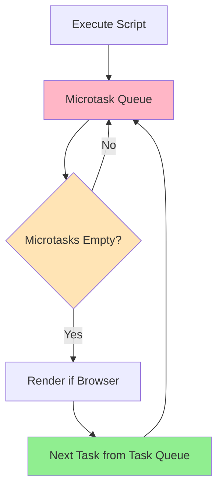
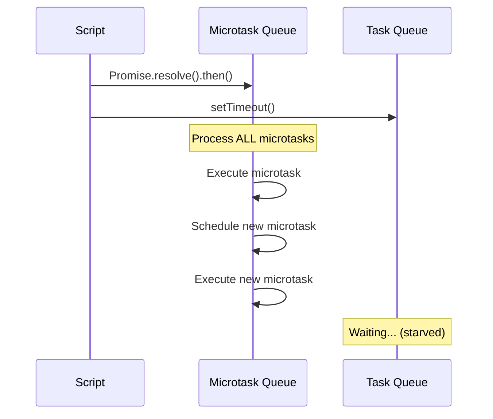
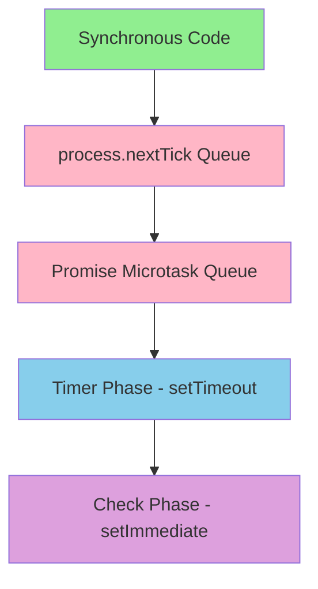
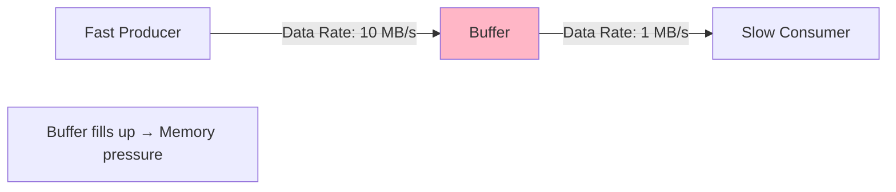

# Event Loop Starvation and Backpressure

> [!summary] Goal
> Understand how microtasks and synchronous work can starve the event loop, recognize the symptoms, and apply effective backpressure patterns to maintain responsiveness.

## Table of Contents

- [What Blocks the Event Loop](#what-blocks-the-event-loop)
- [Microtask Queue Starvation](#microtask-queue-starvation)
- [CPU-Bound Task Problems](#cpu-bound-task-problems)
- [Process.nextTick vs setImmediate](#process-nexttick-vs-setimmediate)
- [Backpressure in Streams](#backpressure-in-streams)
- [Solutions and Patterns](#solutions-and-patterns)
- [Real-World Scenarios](#real-world-scenarios)
- [Performance Implications](#performance-implications)
- [Best Practices](#best-practices)
- [Interview Questions](#interview-questions)

---

## What Blocks the Event Loop

The event loop can only process **one task at a time**. Blocking operations prevent:

- Timer callbacks from firing
- I/O operations from completing
- User input from being processed
- UI rendering (browser)
- HTTP requests (Node.js)

### Common Blocking Patterns

```js
// Example 1: Synchronous blocking
function blockEventLoop() {
  console.log('Start blocking');
  const start = Date.now();
  
  // Block for 5 seconds
  while (Date.now() - start < 5000) {
    // Busy loop - blocks everything!
  }
  
  console.log('Done blocking');
}

setTimeout(() => console.log('Timer'), 1000); // Won't fire on time!
blockEventLoop();
// "Start blocking"
// ... 5 seconds of blocked loop ...
// "Done blocking"
// "Timer" (fires 4 seconds late!)
```

### Event Loop Processing Order



**Key insight:** Microtasks always run before next task, so they can starve task queue.

---

## Microtask Queue Starvation

### The Problem

Microtasks (Promises, `queueMicrotask`) run **before** the next task. Continuously scheduling microtasks prevents tasks from running.

```js
// Example 2: Microtask starvation
console.log('Start');

// Schedule a task (macro task)
setTimeout(() => {
  console.log('Timer executed'); // NEVER RUNS!
}, 0);

// Infinite microtask loop
function scheduleMicrotask() {
  Promise.resolve().then(() => {
    console.log('Microtask');
    scheduleMicrotask(); // Schedule another microtask
  });
}

scheduleMicrotask();

// Output:
// "Start"
// "Microtask"
// "Microtask"
// "Microtask"
// ... forever, timer never executes!
```

### Why This Happens



### Real Example: Accidental Starvation

```js
// Example 3: Unintentional starvation
async function processQueue(queue) {
  while (queue.length > 0) {
    const item = queue.shift();
    await processItem(item); // Each await schedules microtasks
    
    // If new items are added faster than processing,
    // this loop never yields to task queue!
  }
}

// Timer will be delayed
setTimeout(() => console.log('Check status'), 1000);

const queue = [1, 2, 3];
processQueue(queue);

// Meanwhile, other code keeps adding to queue
setInterval(() => {
  queue.push(Math.random());
}, 100);

// Timer is starved because processQueue never yields
```

### Detecting Microtask Starvation

```js
// Example 4: Monitor event loop lag
let lastCheck = Date.now();

setInterval(() => {
  const now = Date.now();
  const lag = now - lastCheck - 1000; // Expected 1000ms
  
  if (lag > 100) {
    console.warn(`Event loop lag: ${lag}ms`);
  }
  
  lastCheck = now;
}, 1000);

// If lag is consistently high, event loop is blocked
```

---

## CPU-Bound Task Problems

### Long-Running Synchronous Operations

```js
// Example 5: CPU-bound blocking
// BAD: Blocks event loop
function processLargeArray(arr) {
  let sum = 0;
  
  // If arr has millions of items, this blocks for seconds
  for (let i = 0; i < arr.length; i++) {
    sum += arr[i] * arr[i]; // Some computation
  }
  
  return sum;
}

const hugeArray = new Array(10000000).fill(5);

console.log('Start');
const result = processLargeArray(hugeArray); // BLOCKS!
console.log('Done:', result);

// Meanwhile, server can't respond to requests!
```

### Impact in Different Environments

| Environment | Impact of Blocking |
|-------------|-------------------|
| **Browser** | UI freezes, no user input, no animations |
| **Node.js Server** | Can't process other requests (single-threaded) |
| **Electron** | Entire app becomes unresponsive |
| **Service Worker** | Can't intercept network requests |

### Common CPU-Intensive Operations

```js
// Example 6: Various blocking operations
// 1. Large data processing
const data = Array(1000000).fill(0).map((_, i) => ({
  id: i,
  value: Math.random()
}));

// Blocking: filter + map + reduce on large dataset
const result = data
  .filter(item => item.value > 0.5)
  .map(item => item.value * 2)
  .reduce((sum, val) => sum + val, 0);

// 2. Complex computations
function fibonacci(n) {
  if (n <= 1) return n;
  return fibonacci(n - 1) + fibonacci(n - 2); // Exponential time!
}
fibonacci(40); // Blocks for seconds

// 3. Image processing
function processImage(imageData) {
  for (let i = 0; i < imageData.length; i += 4) {
    // Manipulate each pixel
    imageData[i] = imageData[i] * 0.5;     // R
    imageData[i + 1] = imageData[i + 1] * 0.5; // G
    imageData[i + 2] = imageData[i + 2] * 0.5; // B
  }
}

// 4. JSON parsing/stringifying large objects
const hugeObject = { /* megabytes of data */ };
JSON.stringify(hugeObject); // Synchronous, can block

// 5. Cryptographic operations (synchronous variants)
const crypto = require('crypto');
crypto.pbkdf2Sync('password', 'salt', 100000, 64, 'sha512'); // BLOCKS!
```

---

## Process.nextTick vs setImmediate

Node.js-specific microtask and task scheduling.

### Process.nextTick (Microtask)

```js
// Example 7: process.nextTick
console.log('1: Start');

setTimeout(() => console.log('2: setTimeout'), 0);

setImmediate(() => console.log('3: setImmediate'));

process.nextTick(() => console.log('4: nextTick'));

Promise.resolve().then(() => console.log('5: Promise'));

console.log('6: End');

// Output:
// 1: Start
// 6: End
// 4: nextTick      (microtask - runs first)
// 5: Promise       (microtask)
// 2: setTimeout    (task queue)
// 3: setImmediate  (check phase)
```

### Execution Order



### nextTick Starvation Risk

```js
// Example 8: nextTick starvation
console.log('Start');

setTimeout(() => console.log('Timer'), 0); // STARVED!

function recurseNextTick(n) {
  if (n === 0) return;
  
  process.nextTick(() => {
    console.log('nextTick:', n);
    recurseNextTick(n - 1); // Schedule another nextTick
  });
}

recurseNextTick(5);

// Output:
// Start
// nextTick: 5
// nextTick: 4
// nextTick: 3
// nextTick: 2
// nextTick: 1
// Timer  (delayed until all nextTicks complete)
```

### When to Use Each

| Use Case | Use | Reason |
|----------|-----|--------|
| Execute before I/O | `process.nextTick` | Microtask - runs before poll phase |
| Execute after I/O | `setImmediate` | Check phase - runs after poll |
| Defer work slightly | `setImmediate` | Less starvation risk |
| Maintain invariants | `process.nextTick` | Guaranteed order |
| Break up CPU work | `setImmediate` | Allows I/O to progress |

### Practical Example

```js
// Example 9: Correct usage
const EventEmitter = require('events');

class MyEmitter extends EventEmitter {
  doWork() {
    // Use nextTick to ensure listeners are registered
    process.nextTick(() => {
      this.emit('done', { result: 42 });
    });
  }
}

const emitter = new MyEmitter();

// This listener will catch the event
emitter.on('done', (data) => {
  console.log('Received:', data);
});

emitter.doWork();
// Without nextTick, emit might fire before listener is registered
```

---

## Backpressure in Streams

### What is Backpressure?

**Backpressure** occurs when a producer generates data faster than a consumer can process it.



### Node.js Streams Backpressure

```js
// Example 10: Stream backpressure
const fs = require('fs');

// WRONG: No backpressure handling
const readStream = fs.createReadStream('large-file.txt');
const writeStream = fs.createWriteStream('output.txt');

readStream.on('data', (chunk) => {
  writeStream.write(chunk); // Ignores return value!
  // If writeStream is slow, chunks accumulate in memory
});

// CORRECT: Handle backpressure
const readStream = fs.createReadStream('large-file.txt');
const writeStream = fs.createWriteStream('output.txt');

readStream.on('data', (chunk) => {
  const canContinue = writeStream.write(chunk);
  
  if (!canContinue) {
    // Buffer is full, pause reading
    console.log('Backpressure detected, pausing read');
    readStream.pause();
  }
});

writeStream.on('drain', () => {
  // Buffer drained, resume reading
  console.log('Buffer drained, resuming read');
  readStream.resume();
});

// BEST: Use pipe (handles backpressure automatically)
readStream.pipe(writeStream);
```

### Manual Backpressure Implementation

```js
// Example 11: Custom backpressure
class DataProcessor {
  constructor(maxBufferSize = 100) {
    this.buffer = [];
    this.maxBufferSize = maxBufferSize;
    this.processing = false;
  }
  
  async addData(data) {
    // Apply backpressure
    if (this.buffer.length >= this.maxBufferSize) {
      throw new Error('Buffer full - backpressure applied');
    }
    
    this.buffer.push(data);
    
    if (!this.processing) {
      this.processBuffer();
    }
  }
  
  async processBuffer() {
    this.processing = true;
    
    while (this.buffer.length > 0) {
      const item = this.buffer.shift();
      await this.processItem(item);
      
      // Yield to event loop periodically
      if (this.buffer.length % 10 === 0) {
        await new Promise(resolve => setImmediate(resolve));
      }
    }
    
    this.processing = false;
  }
  
  async processItem(item) {
    // Simulate slow processing
    await new Promise(resolve => setTimeout(resolve, 100));
    console.log('Processed:', item);
  }
}

const processor = new DataProcessor(10);

// Attempt to add data rapidly
for (let i = 0; i < 20; i++) {
  try {
    await processor.addData(i);
  } catch (err) {
    console.error(`Item ${i}: ${err.message}`);
    // Wait before retrying
    await new Promise(resolve => setTimeout(resolve, 500));
  }
}
```

---

## Solutions and Patterns

### 1. Chunking Work

```js
// Example 12: Break work into chunks
async function processLargeArrayInChunks(arr, chunkSize = 1000) {
  const results = [];
  
  for (let i = 0; i < arr.length; i += chunkSize) {
    const chunk = arr.slice(i, i + chunkSize);
    
    // Process chunk
    const chunkResults = chunk.map(item => item * 2);
    results.push(...chunkResults);
    
    // Yield to event loop every chunk
    await new Promise(resolve => setImmediate(resolve));
    
    // Optional: Report progress
    if (i % (chunkSize * 10) === 0) {
      console.log(`Processed ${i} / ${arr.length}`);
    }
  }
  
  return results;
}

// Usage
const bigArray = new Array(100000).fill(5);
processLargeArrayInChunks(bigArray).then(results => {
  console.log('Done, processed', results.length, 'items');
});
```

### 2. Worker Threads (Node.js)

```js
// Example 13: Offload CPU work to worker thread
// main.js
const { Worker } = require('worker_threads');

function runWorker(data) {
  return new Promise((resolve, reject) => {
    const worker = new Worker('./worker.js', {
      workerData: data
    });
    
    worker.on('message', resolve);
    worker.on('error', reject);
    worker.on('exit', (code) => {
      if (code !== 0) {
        reject(new Error(`Worker stopped with exit code ${code}`));
      }
    });
  });
}

// Process heavy computation without blocking
async function processData(arr) {
  console.log('Starting worker...');
  const result = await runWorker({ array: arr });
  console.log('Worker completed:', result);
}

processData([1, 2, 3, 4, 5]);

// worker.js
const { parentPort, workerData } = require('worker_threads');

function heavyComputation(arr) {
  // CPU-intensive work
  let sum = 0;
  for (let i = 0; i < arr.length; i++) {
    sum += arr[i] * arr[i];
  }
  return sum;
}

const result = heavyComputation(workerData.array);
parentPort.postMessage(result);
```

### 3. Web Workers (Browser)

```js
// Example 14: Browser Web Worker
// main.js
const worker = new Worker('worker.js');

worker.postMessage({ type: 'process', data: [1, 2, 3, 4, 5] });

worker.onmessage = (event) => {
  console.log('Result from worker:', event.data);
};

// worker.js
self.onmessage = (event) => {
  if (event.data.type === 'process') {
    const result = event.data.data.reduce((sum, n) => sum + n * n, 0);
    self.postMessage(result);
  }
};
```

### 4. setImmediate for Yielding

```js
// Example 15: Yield with setImmediate
async function processWithYield(arr) {
  const results = [];
  
  for (let i = 0; i < arr.length; i++) {
    results.push(arr[i] * 2);
    
    // Yield every 1000 items
    if (i % 1000 === 0) {
      await new Promise(resolve => setImmediate(resolve));
    }
  }
  
  return results;
}
```

### 5. Rate Limiting / Token Bucket

```js
// Example 16: Token bucket rate limiter
class TokenBucket {
  constructor(capacity, refillRate) {
    this.capacity = capacity;      // Max tokens
    this.tokens = capacity;        // Current tokens
    this.refillRate = refillRate;  // Tokens per second
    
    // Refill tokens periodically
    setInterval(() => {
      this.tokens = Math.min(this.capacity, this.tokens + this.refillRate);
    }, 1000);
  }
  
  async consume(tokens = 1) {
    while (this.tokens < tokens) {
      // Wait for refill
      await new Promise(resolve => setTimeout(resolve, 100));
    }
    
    this.tokens -= tokens;
    return true;
  }
}

// Usage: Rate limit API calls
const limiter = new TokenBucket(10, 2); // 10 capacity, refill 2/sec

async function makeAPICall(data) {
  await limiter.consume(1); // Wait for token
  console.log('Making API call:', data);
  // Actual API call here
}

// Burst of 15 calls
for (let i = 0; i < 15; i++) {
  makeAPICall(i); // First 10 go through, rest wait
}
```

### 6. Bounded Queue

```js
// Example 17: Bounded queue with backpressure
class BoundedQueue {
  constructor(maxSize = 100) {
    this.maxSize = maxSize;
    this.queue = [];
    this.drainWaiters = [];
  }
  
  async enqueue(item) {
    // Apply backpressure
    while (this.queue.length >= this.maxSize) {
      console.log('Queue full, waiting for drain...');
      await new Promise(resolve => {
        this.drainWaiters.push(resolve);
      });
    }
    
    this.queue.push(item);
  }
  
  dequeue() {
    const item = this.queue.shift();
    
    // Notify waiters that space is available
    if (this.drainWaiters.length > 0) {
      const resolve = this.drainWaiters.shift();
      resolve();
    }
    
    return item;
  }
  
  get length() {
    return this.queue.length;
  }
}

// Usage
const queue = new BoundedQueue(5);

// Producer
async function produce() {
  for (let i = 0; i < 10; i++) {
    await queue.enqueue(i);
    console.log('Enqueued:', i);
  }
}

// Consumer
async function consume() {
  while (queue.length > 0) {
    const item = queue.dequeue();
    console.log('Dequeued:', item);
    await new Promise(resolve => setTimeout(resolve, 200)); // Slow consumer
  }
}

produce();
setTimeout(consume, 100);
```

### 7. Async Iteration with Pauses

```js
// Example 18: Async iteration
async function* generateData() {
  for (let i = 0; i < 1000; i++) {
    yield i;
    
    // Yield to event loop every 10 items
    if (i % 10 === 0) {
      await new Promise(resolve => setImmediate(resolve));
    }
  }
}

async function processData() {
  for await (const item of generateData()) {
    console.log('Processing:', item);
    // Do work
  }
}

processData();
```

---

## Real-World Scenarios

### Scenario 1: HTTP Server Under Load

```js
// Example 19: Server with backpressure
const http = require('http');

const MAX_CONCURRENT = 10;
let currentRequests = 0;

const server = http.createServer(async (req, res) => {
  // Apply backpressure
  if (currentRequests >= MAX_CONCURRENT) {
    res.writeHead(503, { 'Retry-After': '1' });
    res.end('Server overloaded');
    return;
  }
  
  currentRequests++;
  
  try {
    // Simulate work
    await processRequest(req);
    res.writeHead(200);
    res.end('OK');
  } catch (err) {
    res.writeHead(500);
    res.end('Error');
  } finally {
    currentRequests--;
  }
});

async function processRequest(req) {
  // Heavy processing, broken into chunks
  await new Promise(resolve => setImmediate(resolve));
  // ... actual work ...
}

server.listen(3000);
```

### Scenario 2: Real-Time Data Processing

```js
// Example 20: Stream processing with backpressure
class DataStream {
  constructor() {
    this.buffer = [];
    this.processing = false;
    this.paused = false;
  }
  
  push(data) {
    if (this.buffer.length > 1000) {
      this.paused = true;
      return false; // Signal backpressure
    }
    
    this.buffer.push(data);
    this.process();
    return true;
  }
  
  async process() {
    if (this.processing) return;
    
    this.processing = true;
    
    while (this.buffer.length > 0 && !this.paused) {
      const batch = this.buffer.splice(0, 100);
      
      for (const item of batch) {
        await this.processItem(item);
      }
      
      // Yield to event loop
      await new Promise(resolve => setImmediate(resolve));
      
      // Resume if buffer drained enough
      if (this.paused && this.buffer.length < 500) {
        this.paused = false;
        this.emit('drain');
      }
    }
    
    this.processing = false;
  }
  
  async processItem(item) {
    // Actual processing
    console.log('Processed:', item);
  }
}
```

### Scenario 3: Database Batch Insert

```js
// Example 21: Batch insert with yielding
async function batchInsert(records, batchSize = 1000) {
  for (let i = 0; i < records.length; i += batchSize) {
    const batch = records.slice(i, i + batchSize);
    
    // Insert batch
    await db.insert(batch);
    
    console.log(`Inserted ${i + batch.length} / ${records.length}`);
    
    // Yield to event loop (let server handle requests)
    await new Promise(resolve => setImmediate(resolve));
  }
}

// Usage
const records = generateRecords(100000);
batchInsert(records);
```

### Scenario 4: File Processing Pipeline

```js
// Example 22: File processing with backpressure
const fs = require('fs');
const readline = require('readline');

async function processLargeFile(filename) {
  const fileStream = fs.createReadStream(filename);
  const rl = readline.createInterface({
    input: fileStream,
    crlfDelay: Infinity
  });
  
  let lineCount = 0;
  const batchSize = 100;
  let batch = [];
  
  for await (const line of rl) {
    batch.push(line);
    lineCount++;
    
    if (batch.length >= batchSize) {
      await processBatch(batch);
      batch = [];
      
      // Yield to event loop
      await new Promise(resolve => setImmediate(resolve));
    }
  }
  
  // Process remaining
  if (batch.length > 0) {
    await processBatch(batch);
  }
  
  console.log(`Processed ${lineCount} lines`);
}

async function processBatch(lines) {
  // Process lines
  console.log(`Processing batch of ${lines.length} lines`);
}
```

### Scenario 5: Image Processing

```js
// Example 23: Image processing in chunks
async function processImages(imageUrls) {
  const CHUNK_SIZE = 5;
  
  for (let i = 0; i < imageUrls.length; i += CHUNK_SIZE) {
    const chunk = imageUrls.slice(i, i + CHUNK_SIZE);
    
    // Process chunk in parallel
    await Promise.all(chunk.map(url => processImage(url)));
    
    console.log(`Processed ${Math.min(i + CHUNK_SIZE, imageUrls.length)} / ${imageUrls.length}`);
    
    // Yield to event loop
    await new Promise(resolve => setImmediate(resolve));
  }
}

async function processImage(url) {
  // Download and process image
  const image = await downloadImage(url);
  const processed = await applyFilters(image);
  await saveImage(processed);
}
```

---

## Performance Implications

### Monitoring Event Loop Lag

```js
// Example 24: Event loop monitoring
class EventLoopMonitor {
  constructor(threshold = 100) {
    this.threshold = threshold;
    this.lastCheck = Date.now();
    
    this.start();
  }
  
  start() {
    setInterval(() => {
      const now = Date.now();
      const lag = now - this.lastCheck - 1000;
      
      if (lag > this.threshold) {
        console.warn(`⚠️ Event loop lag: ${lag}ms`);
      }
      
      this.lastCheck = now;
    }, 1000);
  }
}

const monitor = new EventLoopMonitor(50);
```

### Performance Metrics

| Metric | Good | Warning | Critical |
|--------|------|---------|----------|
| Event loop lag | < 10ms | 10-100ms | > 100ms |
| Microtask queue | < 10 items | 10-100 items | > 100 items |
| Memory growth | Stable | Gradual increase | Rapid increase |
| CPU usage | < 70% | 70-90% | > 90% |

---

## Best Practices

### ✅ DO

1. **Chunk large operations**
   ```js
   // Process in batches
   for (let i = 0; i < items.length; i += BATCH_SIZE) {
     processBatch(items.slice(i, i + BATCH_SIZE));
     await new Promise(resolve => setImmediate(resolve));
   }
   ```

2. **Use Worker threads for CPU-intensive work**
   ```js
   const worker = new Worker('./heavy-work.js');
   worker.postMessage(data);
   ```

3. **Implement backpressure in streams**
   ```js
   const canContinue = stream.write(data);
   if (!canContinue) {
     await new Promise(resolve => stream.once('drain', resolve));
   }
   ```

4. **Monitor event loop health**
   ```js
   const lag = require('event-loop-lag')(1000);
   setInterval(() => console.log('Lag:', lag()), 5000);
   ```

5. **Use `setImmediate` over `setTimeout(0)`**
   ```js
   await new Promise(resolve => setImmediate(resolve));
   ```

### ❌ DON'T

1. **Don't create infinite microtask loops**
   ```js
   // BAD
   function bad() {
     Promise.resolve().then(bad);
   }
   ```

2. **Don't ignore stream backpressure signals**
   ```js
   // BAD
   stream.write(data); // Ignoring return value
   ```

3. **Don't process large arrays synchronously**
   ```js
   // BAD
   const result = hugeArray.map(expensive); // Blocks
   ```

4. **Don't use `process.nextTick` recursively without limit**
   ```js
   // BAD
   function recurse() {
     process.nextTick(recurse); // Starves task queue
   }
   ```

5. **Don't perform synchronous crypto operations**
   ```js
   // BAD
   crypto.pbkdf2Sync(...); // Use async variant
   ```

---

## Interview Questions

### Q1: What is event loop starvation and how does it occur?

**Answer:**

Event loop starvation occurs when the event loop is prevented from processing tasks in its queue, usually due to:

1. **Microtask starvation**: Continuously scheduling microtasks prevents task queue from being processed
2. **Long-running synchronous code**: CPU-bound operations block the thread

**Example:**
```js
// Microtask starvation
function starve() {
  Promise.resolve().then(starve); // Never yields
}
starve();

setTimeout(() => console.log('Never runs'), 0);
```

**Effects:**
- Timers don't fire on time
- I/O operations are delayed
- UI becomes unresponsive
- HTTP requests aren't handled

**Prevention:**
- Break work into chunks
- Use `setImmediate` to yield
- Offload CPU work to workers
- Monitor event loop lag

---

### Q2: Explain the difference between process.nextTick and setImmediate

**Answer:**

| Aspect | process.nextTick | setImmediate |
|--------|------------------|--------------|
| **Queue** | Microtask (nextTick queue) | Task (check phase) |
| **Timing** | Before I/O events | After I/O events |
| **Starvation risk** | High (can starve I/O) | Low |
| **Use case** | Execute before I/O | Execute after I/O |

**Execution order:**
```js
console.log('1');
setTimeout(() => console.log('2: setTimeout'), 0);
setImmediate(() => console.log('3: setImmediate'));
process.nextTick(() => console.log('4: nextTick'));
console.log('5');

// Output: 1, 5, 4, 2, 3
```

**When to use:**
- `process.nextTick`: When you need something to run immediately after current operation (e.g., emit event after constructor)
- `setImmediate`: When you want to defer execution to allow I/O to progress (better for chunking work)

---

### Q3: What is backpressure and how do you handle it in Node.js streams?

**Answer:**

**Backpressure** occurs when data is produced faster than it can be consumed, causing buffer overflow.

**In Node.js streams:**

```js
// Check write() return value
const canContinue = writeStream.write(chunk);

if (!canContinue) {
  // Buffer is full, pause reading
  readStream.pause();
}

// Resume when buffer drains
writeStream.on('drain', () => {
  readStream.resume();
});
```

**Best approach - use pipe():**
```js
// Automatically handles backpressure
readStream.pipe(writeStream);
```

**Key concepts:**
- `write()` returns `false` when buffer is full
- `drain` event fires when buffer is empty
- `pause()/resume()` control flow
- `pipe()` handles everything automatically

---

### Q4: How would you process a large array without blocking the event loop?

**Answer:**

**Approach 1: Chunking with setImmediate**
```js
async function processInChunks(arr, chunkSize = 1000) {
  const results = [];
  
  for (let i = 0; i < arr.length; i += chunkSize) {
    const chunk = arr.slice(i, i + chunkSize);
    results.push(...chunk.map(process));
    
    // Yield to event loop
    await new Promise(resolve => setImmediate(resolve));
  }
  
  return results;
}
```

**Approach 2: Worker Threads**
```js
const { Worker } = require('worker_threads');

function processInWorker(arr) {
  return new Promise((resolve, reject) => {
    const worker = new Worker('./processor.js', { workerData: arr });
    worker.on('message', resolve);
    worker.on('error', reject);
  });
}
```

**Approach 3: Web Worker (browser)**
```js
const worker = new Worker('processor.js');
worker.postMessage(largeArray);
worker.onmessage = (e) => console.log('Result:', e.data);
```

**Key points:**
- Break work into chunks (1000-10000 items)
- Yield between chunks with `setImmediate`
- Use workers for CPU-intensive operations
- Monitor progress and report to user

---

### Q5: What causes microtask queue starvation?

**Answer:**

Microtask queue starvation happens when microtasks continuously schedule new microtasks, preventing the event loop from processing regular tasks.

**Causes:**
1. **Recursive Promise chains**
   ```js
   function loop() {
     Promise.resolve().then(loop); // Infinite microtasks
   }
   loop();
   ```

2. **Unbounded async/await loops**
   ```js
   while (queue.length > 0) {
     await processItem(queue.shift());
     // If queue grows faster than processing, never yields
   }
   ```

3. **process.nextTick recursion**
   ```js
   function recurse() {
     process.nextTick(recurse);
   }
   recurse();
   ```

**Why it's a problem:**
- Microtasks run before next task
- Task queue (timers, I/O) is never processed
- Event loop appears "hung"

**Solution:**
- Use `setImmediate` instead of `Promise.resolve()`
- Add periodic yields in loops
- Limit recursion depth
- Monitor microtask queue size

---

### Q6: How do you detect and diagnose event loop blocking?

**Answer:**

**Method 1: Monitor Event Loop Lag**
```js
let lastCheck = Date.now();

setInterval(() => {
  const now = Date.now();
  const lag = now - lastCheck - 1000;
  
  if (lag > 100) {
    console.warn(`Lag: ${lag}ms`);
  }
  
  lastCheck = now;
}, 1000);
```

**Method 2: Use event-loop-lag package**
```js
const lag = require('event-loop-lag')(1000);
console.log('Current lag:', lag());
```

**Method 3: Node.js perf_hooks**
```js
const { performance, PerformanceObserver } = require('perf_hooks');

const obs = new PerformanceObserver((list) => {
  const entry = list.getEntries()[0];
  console.log(`Event loop delay: ${entry.duration}ms`);
});

obs.observe({ entryTypes: ['measure'] });
```

**Method 4: --prof flag (CPU profiling)**
```bash
node --prof app.js
node --prof-process isolate-*.log > processed.txt
```

**Diagnosis checklist:**
1. Check for long synchronous operations
2. Profile CPU usage
3. Look for recursive microtask scheduling
4. Check for large array operations
5. Review crypto/compression operations
6. Monitor memory usage (swapping causes blocking)

---

### Q7: What are best practices for handling backpressure in a custom queue?

**Answer:**

**Implementation:**
```js
class BackpressureQueue {
  constructor(maxSize = 100, processRate = 10) {
    this.queue = [];
    this.maxSize = maxSize;
    this.processRate = processRate;
    this.processing = false;
    this.waiters = [];
  }
  
  async push(item) {
    // Wait if queue is full
    while (this.queue.length >= this.maxSize) {
      await new Promise(resolve => this.waiters.push(resolve));
    }
    
    this.queue.push(item);
    this.process();
  }
  
  async process() {
    if (this.processing) return;
    this.processing = true;
    
    while (this.queue.length > 0) {
      const batch = this.queue.splice(0, this.processRate);
      
      await Promise.all(batch.map(item => this.processItem(item)));
      
      // Notify waiters
      while (this.waiters.length > 0 && this.queue.length < this.maxSize) {
        this.waiters.shift()();
      }
      
      // Yield to event loop
      await new Promise(resolve => setImmediate(resolve));
    }
    
    this.processing = false;
  }
  
  async processItem(item) {
    // Actual processing
    console.log('Processing:', item);
  }
}
```

**Best practices:**
1. **Bound the queue** - Reject or wait when full
2. **Signal backpressure** - Return `false` or throw
3. **Drain notification** - Emit event when space available
4. **Batch processing** - Process multiple items per event loop tick
5. **Yield regularly** - Use `setImmediate` between batches
6. **Monitor queue size** - Log warnings at thresholds
7. **Graceful degradation** - Shed load if necessary

---

### Q8: Compare different ways to yield to the event loop

**Answer:**

| Method | Queue | Timing | Use Case |
|--------|-------|--------|----------|
| `setTimeout(fn, 0)` | Task (timers phase) | After timers minimum | Browser compatibility |
| `setImmediate(fn)` | Task (check phase) | After I/O | Node.js chunking |
| `queueMicrotask(fn)` | Microtask | Before next task | High priority defer |
| `Promise.resolve().then(fn)` | Microtask | Before next task | Promise-based code |
| `process.nextTick(fn)` | nextTick queue | Before microtasks | Node.js immediate execution |

**Example:**
```js
console.log('1');

setTimeout(() => console.log('2: setTimeout'), 0);
setImmediate(() => console.log('3: setImmediate'));
queueMicrotask(() => console.log('4: microtask'));
Promise.resolve().then(() => console.log('5: promise'));
process.nextTick(() => console.log('6: nextTick'));

console.log('7');

// Node.js output: 1, 7, 6, 4, 5, 2, 3
// (nextTick → microtasks → timers → check)
```

**For yielding in chunking work:**
- **Node.js**: Use `setImmediate` (lowest starvation risk)
- **Browser**: Use `setTimeout(fn, 0)` or `requestIdleCallback`
- **Universal**: `await new Promise(resolve => setImmediate(resolve))`

---

## Cross-Links

- **Event Loop Basics**: [[JavaScript/01_Foundations/01_JS_Runtime_and_Event_Loop]]
- **Node.js Event Loop**: [[JavaScript/03_Advanced/03_Node_Event_Loop_and_Libuv_Basics]]
- **Performance**: [[JavaScript/02_Core/03_Performance_and_Memory]]
- **Async Patterns**: [[JavaScript/02_Core/01_Async_Patterns_and_Error_Handling]]
- **System Backpressure**: [[SystemDesign/03_Advanced/02_Backpressure_and_Load_Shedding]]

---

**status**: stable  
**updated**: 2026-04-26
