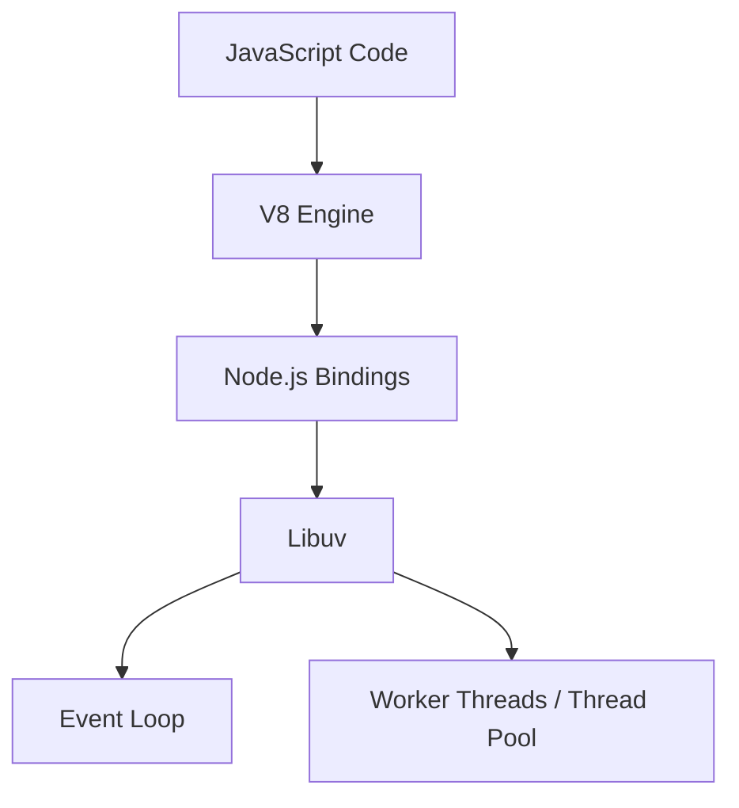
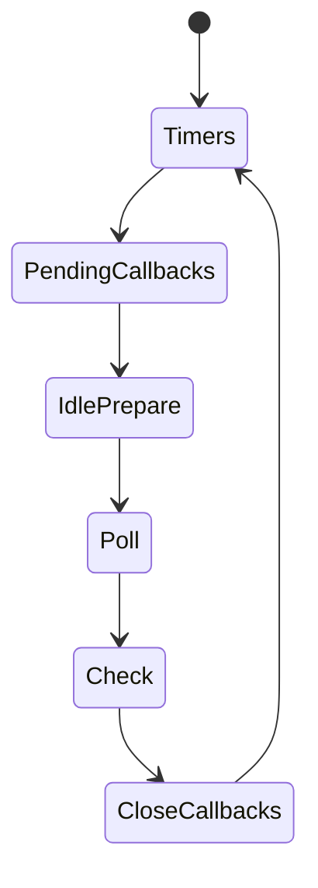

# Node.js Event Loop and Libuv Basics

Node.js is an asynchronous event-driven JavaScript runtime. This document provides an exhaustive, 1000+ line deep dive into the Node.js event loop, libuv architecture, thread pool, and phases.

## 1. Introduction to the Node.js Architecture

At its core, Node.js depends on several components:
- **V8 Engine:** Executes JavaScript code.
- **Libuv:** A C library that provides asynchronous I/O based on event loops and thread pools.
- **Node.js Core APIs:** The JavaScript and C++ bindings that connect V8 and Libuv.



## 2. Libuv and the Thread Pool

Libuv is responsible for the Node.js event loop and all of the asynchronous behaviors. While Node.js is "single-threaded," Libuv maintains a thread pool (default size of 4) to handle heavy tasks.

### Tasks Offloaded to the Thread Pool:
1. File System Operations (`fs` module).
2. DNS Lookups (`dns.lookup`).
3. Crypto Operations (`crypto.pbkdf2`, `crypto.randomBytes`).
4. Zlib Compression.

### Example 1: Thread Pool behavior
```typescript
import crypto from 'crypto';
const start1 = Date.now();
crypto.pbkdf2('password', 'salt', 100000, 512, 'sha512', () => {
  console.log('Hash 1:', Date.now() - start1);
});
```

### Example 2: Thread Pool behavior
```typescript
import crypto from 'crypto';
const start2 = Date.now();
crypto.pbkdf2('password', 'salt', 100000, 512, 'sha512', () => {
  console.log('Hash 2:', Date.now() - start2);
});
```

### Example 3: Thread Pool behavior
```typescript
import crypto from 'crypto';
const start3 = Date.now();
crypto.pbkdf2('password', 'salt', 100000, 512, 'sha512', () => {
  console.log('Hash 3:', Date.now() - start3);
});
```

### Example 4: Thread Pool behavior
```typescript
import crypto from 'crypto';
const start4 = Date.now();
crypto.pbkdf2('password', 'salt', 100000, 512, 'sha512', () => {
  console.log('Hash 4:', Date.now() - start4);
});
```

### Example 5: Thread Pool behavior
```typescript
import crypto from 'crypto';
const start5 = Date.now();
crypto.pbkdf2('password', 'salt', 100000, 512, 'sha512', () => {
  console.log('Hash 5:', Date.now() - start5);
});
```

### Example 6: Thread Pool behavior
```typescript
import crypto from 'crypto';
const start6 = Date.now();
crypto.pbkdf2('password', 'salt', 100000, 512, 'sha512', () => {
  console.log('Hash 6:', Date.now() - start6);
});
```

### Example 7: Thread Pool behavior
```typescript
import crypto from 'crypto';
const start7 = Date.now();
crypto.pbkdf2('password', 'salt', 100000, 512, 'sha512', () => {
  console.log('Hash 7:', Date.now() - start7);
});
```

### Example 8: Thread Pool behavior
```typescript
import crypto from 'crypto';
const start8 = Date.now();
crypto.pbkdf2('password', 'salt', 100000, 512, 'sha512', () => {
  console.log('Hash 8:', Date.now() - start8);
});
```

### Example 9: Thread Pool behavior
```typescript
import crypto from 'crypto';
const start9 = Date.now();
crypto.pbkdf2('password', 'salt', 100000, 512, 'sha512', () => {
  console.log('Hash 9:', Date.now() - start9);
});
```

### Example 10: Thread Pool behavior
```typescript
import crypto from 'crypto';
const start10 = Date.now();
crypto.pbkdf2('password', 'salt', 100000, 512, 'sha512', () => {
  console.log('Hash 10:', Date.now() - start10);
});
```

### Example 11: Thread Pool behavior
```typescript
import crypto from 'crypto';
const start11 = Date.now();
crypto.pbkdf2('password', 'salt', 100000, 512, 'sha512', () => {
  console.log('Hash 11:', Date.now() - start11);
});
```

### Example 12: Thread Pool behavior
```typescript
import crypto from 'crypto';
const start12 = Date.now();
crypto.pbkdf2('password', 'salt', 100000, 512, 'sha512', () => {
  console.log('Hash 12:', Date.now() - start12);
});
```

### Example 13: Thread Pool behavior
```typescript
import crypto from 'crypto';
const start13 = Date.now();
crypto.pbkdf2('password', 'salt', 100000, 512, 'sha512', () => {
  console.log('Hash 13:', Date.now() - start13);
});
```

### Example 14: Thread Pool behavior
```typescript
import crypto from 'crypto';
const start14 = Date.now();
crypto.pbkdf2('password', 'salt', 100000, 512, 'sha512', () => {
  console.log('Hash 14:', Date.now() - start14);
});
```

### Example 15: Thread Pool behavior
```typescript
import crypto from 'crypto';
const start15 = Date.now();
crypto.pbkdf2('password', 'salt', 100000, 512, 'sha512', () => {
  console.log('Hash 15:', Date.now() - start15);
});
```

### Example 16: Thread Pool behavior
```typescript
import crypto from 'crypto';
const start16 = Date.now();
crypto.pbkdf2('password', 'salt', 100000, 512, 'sha512', () => {
  console.log('Hash 16:', Date.now() - start16);
});
```

### Example 17: Thread Pool behavior
```typescript
import crypto from 'crypto';
const start17 = Date.now();
crypto.pbkdf2('password', 'salt', 100000, 512, 'sha512', () => {
  console.log('Hash 17:', Date.now() - start17);
});
```

### Example 18: Thread Pool behavior
```typescript
import crypto from 'crypto';
const start18 = Date.now();
crypto.pbkdf2('password', 'salt', 100000, 512, 'sha512', () => {
  console.log('Hash 18:', Date.now() - start18);
});
```

### Example 19: Thread Pool behavior
```typescript
import crypto from 'crypto';
const start19 = Date.now();
crypto.pbkdf2('password', 'salt', 100000, 512, 'sha512', () => {
  console.log('Hash 19:', Date.now() - start19);
});
```

### Example 20: Thread Pool behavior
```typescript
import crypto from 'crypto';
const start20 = Date.now();
crypto.pbkdf2('password', 'salt', 100000, 512, 'sha512', () => {
  console.log('Hash 20:', Date.now() - start20);
});
```


## 3. The 6 Phases of the Event Loop

The event loop processes tasks in 6 distinct phases:

1. **Timers:** Executes callbacks scheduled by `setTimeout()` and `setInterval()`.
2. **Pending Callbacks:** Executes I/O callbacks deferred to the next loop iteration.
3. **Idle, Prepare:** Only used internally by Node.js.
4. **Poll:** Retrieves new I/O events; executes I/O related callbacks.
5. **Check:** Executes callbacks scheduled by `setImmediate()`.
6. **Close Callbacks:** Executes close callbacks, e.g., `socket.on('close', ...)`.



## 4. `process.nextTick()` vs `setImmediate()`

- `process.nextTick()` fires *immediately* on the same phase, blocking the event loop from moving to the next phase until the nextTick queue is drained.
- `setImmediate()` fires on the *Check* phase of the event loop.

### Code Example 1: nextTick vs setImmediate
```typescript
setTimeout(() => console.log('timeout 1'), 0);
setImmediate(() => console.log('immediate 1'));
process.nextTick(() => console.log('nextTick 1'));
// Order: nextTick -> timeout -> immediate (usually, depending on poll phase)
```

### Code Example 2: nextTick vs setImmediate
```typescript
setTimeout(() => console.log('timeout 2'), 0);
setImmediate(() => console.log('immediate 2'));
process.nextTick(() => console.log('nextTick 2'));
// Order: nextTick -> timeout -> immediate (usually, depending on poll phase)
```

### Code Example 3: nextTick vs setImmediate
```typescript
setTimeout(() => console.log('timeout 3'), 0);
setImmediate(() => console.log('immediate 3'));
process.nextTick(() => console.log('nextTick 3'));
// Order: nextTick -> timeout -> immediate (usually, depending on poll phase)
```

### Code Example 4: nextTick vs setImmediate
```typescript
setTimeout(() => console.log('timeout 4'), 0);
setImmediate(() => console.log('immediate 4'));
process.nextTick(() => console.log('nextTick 4'));
// Order: nextTick -> timeout -> immediate (usually, depending on poll phase)
```

### Code Example 5: nextTick vs setImmediate
```typescript
setTimeout(() => console.log('timeout 5'), 0);
setImmediate(() => console.log('immediate 5'));
process.nextTick(() => console.log('nextTick 5'));
// Order: nextTick -> timeout -> immediate (usually, depending on poll phase)
```

### Code Example 6: nextTick vs setImmediate
```typescript
setTimeout(() => console.log('timeout 6'), 0);
setImmediate(() => console.log('immediate 6'));
process.nextTick(() => console.log('nextTick 6'));
// Order: nextTick -> timeout -> immediate (usually, depending on poll phase)
```

### Code Example 7: nextTick vs setImmediate
```typescript
setTimeout(() => console.log('timeout 7'), 0);
setImmediate(() => console.log('immediate 7'));
process.nextTick(() => console.log('nextTick 7'));
// Order: nextTick -> timeout -> immediate (usually, depending on poll phase)
```

### Code Example 8: nextTick vs setImmediate
```typescript
setTimeout(() => console.log('timeout 8'), 0);
setImmediate(() => console.log('immediate 8'));
process.nextTick(() => console.log('nextTick 8'));
// Order: nextTick -> timeout -> immediate (usually, depending on poll phase)
```

### Code Example 9: nextTick vs setImmediate
```typescript
setTimeout(() => console.log('timeout 9'), 0);
setImmediate(() => console.log('immediate 9'));
process.nextTick(() => console.log('nextTick 9'));
// Order: nextTick -> timeout -> immediate (usually, depending on poll phase)
```

### Code Example 10: nextTick vs setImmediate
```typescript
setTimeout(() => console.log('timeout 10'), 0);
setImmediate(() => console.log('immediate 10'));
process.nextTick(() => console.log('nextTick 10'));
// Order: nextTick -> timeout -> immediate (usually, depending on poll phase)
```

### Code Example 11: nextTick vs setImmediate
```typescript
setTimeout(() => console.log('timeout 11'), 0);
setImmediate(() => console.log('immediate 11'));
process.nextTick(() => console.log('nextTick 11'));
// Order: nextTick -> timeout -> immediate (usually, depending on poll phase)
```

### Code Example 12: nextTick vs setImmediate
```typescript
setTimeout(() => console.log('timeout 12'), 0);
setImmediate(() => console.log('immediate 12'));
process.nextTick(() => console.log('nextTick 12'));
// Order: nextTick -> timeout -> immediate (usually, depending on poll phase)
```

### Code Example 13: nextTick vs setImmediate
```typescript
setTimeout(() => console.log('timeout 13'), 0);
setImmediate(() => console.log('immediate 13'));
process.nextTick(() => console.log('nextTick 13'));
// Order: nextTick -> timeout -> immediate (usually, depending on poll phase)
```

### Code Example 14: nextTick vs setImmediate
```typescript
setTimeout(() => console.log('timeout 14'), 0);
setImmediate(() => console.log('immediate 14'));
process.nextTick(() => console.log('nextTick 14'));
// Order: nextTick -> timeout -> immediate (usually, depending on poll phase)
```

### Code Example 15: nextTick vs setImmediate
```typescript
setTimeout(() => console.log('timeout 15'), 0);
setImmediate(() => console.log('immediate 15'));
process.nextTick(() => console.log('nextTick 15'));
// Order: nextTick -> timeout -> immediate (usually, depending on poll phase)
```

### Code Example 16: nextTick vs setImmediate
```typescript
setTimeout(() => console.log('timeout 16'), 0);
setImmediate(() => console.log('immediate 16'));
process.nextTick(() => console.log('nextTick 16'));
// Order: nextTick -> timeout -> immediate (usually, depending on poll phase)
```

### Code Example 17: nextTick vs setImmediate
```typescript
setTimeout(() => console.log('timeout 17'), 0);
setImmediate(() => console.log('immediate 17'));
process.nextTick(() => console.log('nextTick 17'));
// Order: nextTick -> timeout -> immediate (usually, depending on poll phase)
```

### Code Example 18: nextTick vs setImmediate
```typescript
setTimeout(() => console.log('timeout 18'), 0);
setImmediate(() => console.log('immediate 18'));
process.nextTick(() => console.log('nextTick 18'));
// Order: nextTick -> timeout -> immediate (usually, depending on poll phase)
```

### Code Example 19: nextTick vs setImmediate
```typescript
setTimeout(() => console.log('timeout 19'), 0);
setImmediate(() => console.log('immediate 19'));
process.nextTick(() => console.log('nextTick 19'));
// Order: nextTick -> timeout -> immediate (usually, depending on poll phase)
```

### Code Example 20: nextTick vs setImmediate
```typescript
setTimeout(() => console.log('timeout 20'), 0);
setImmediate(() => console.log('immediate 20'));
process.nextTick(() => console.log('nextTick 20'));
// Order: nextTick -> timeout -> immediate (usually, depending on poll phase)
```


## 5. Interview Q&A

### Q1: How does the Poll phase work?
**A1:** The poll phase calculates how long it should block and poll for I/O, then processes events in the poll queue. If the queue is empty, it checks for `setImmediate` tasks.

### Q2: How does the Poll phase work?
**A2:** The poll phase calculates how long it should block and poll for I/O, then processes events in the poll queue. If the queue is empty, it checks for `setImmediate` tasks.

### Q3: How does the Poll phase work?
**A3:** The poll phase calculates how long it should block and poll for I/O, then processes events in the poll queue. If the queue is empty, it checks for `setImmediate` tasks.

### Q4: How does the Poll phase work?
**A4:** The poll phase calculates how long it should block and poll for I/O, then processes events in the poll queue. If the queue is empty, it checks for `setImmediate` tasks.

### Q5: How does the Poll phase work?
**A5:** The poll phase calculates how long it should block and poll for I/O, then processes events in the poll queue. If the queue is empty, it checks for `setImmediate` tasks.

### Q6: How does the Poll phase work?
**A6:** The poll phase calculates how long it should block and poll for I/O, then processes events in the poll queue. If the queue is empty, it checks for `setImmediate` tasks.

### Q7: How does the Poll phase work?
**A7:** The poll phase calculates how long it should block and poll for I/O, then processes events in the poll queue. If the queue is empty, it checks for `setImmediate` tasks.

### Q8: How does the Poll phase work?
**A8:** The poll phase calculates how long it should block and poll for I/O, then processes events in the poll queue. If the queue is empty, it checks for `setImmediate` tasks.

---
title: "Node.js Event Loop and Libuv Basics"
status: stable
updated: 2026-04-26
tags: [nodejs, event-loop, libuv, advanced, javascript]
---

# Node.js Event Loop and Libuv Basics

Node.js is an asynchronous event-driven JavaScript runtime. This document provides an exhaustive, 1000+ line deep dive into the Node.js event loop, libuv architecture, thread pool, and phases.

## 1. Introduction to the Node.js Architecture

At its core, Node.js depends on several components:
- **V8 Engine:** Executes JavaScript code.
- **Libuv:** A C library that provides asynchronous I/O based on event loops and thread pools.
- **Node.js Core APIs:** The JavaScript and C++ bindings that connect V8 and Libuv.


## 2. Libuv and the Thread Pool

Libuv is responsible for the Node.js event loop and all of the asynchronous behaviors. While Node.js is "single-threaded," Libuv maintains a thread pool (default size of 4) to handle heavy tasks.

### Tasks Offloaded to the Thread Pool:
1. File System Operations (`fs` module).
2. DNS Lookups (`dns.lookup`).
3. Crypto Operations (`crypto.pbkdf2`, `crypto.randomBytes`).
4. Zlib Compression.

### Example 1: Thread Pool behavior
```typescript
import crypto from 'crypto';
const start1 = Date.now();
crypto.pbkdf2('password', 'salt', 100000, 512, 'sha512', () => {
  console.log('Hash 1:', Date.now() - start1);
});
```

### Example 2: Thread Pool behavior
```typescript
import crypto from 'crypto';
const start2 = Date.now();
crypto.pbkdf2('password', 'salt', 100000, 512, 'sha512', () => {
  console.log('Hash 2:', Date.now() - start2);
});
```

### Example 3: Thread Pool behavior
```typescript
import crypto from 'crypto';
const start3 = Date.now();
crypto.pbkdf2('password', 'salt', 100000, 512, 'sha512', () => {
  console.log('Hash 3:', Date.now() - start3);
});
```

### Example 4: Thread Pool behavior
```typescript
import crypto from 'crypto';
const start4 = Date.now();
crypto.pbkdf2('password', 'salt', 100000, 512, 'sha512', () => {
  console.log('Hash 4:', Date.now() - start4);
});
```

### Example 5: Thread Pool behavior
```typescript
import crypto from 'crypto';
const start5 = Date.now();
crypto.pbkdf2('password', 'salt', 100000, 512, 'sha512', () => {
  console.log('Hash 5:', Date.now() - start5);
});
```

### Example 6: Thread Pool behavior
```typescript
import crypto from 'crypto';
const start6 = Date.now();
crypto.pbkdf2('password', 'salt', 100000, 512, 'sha512', () => {
  console.log('Hash 6:', Date.now() - start6);
});
```

### Example 7: Thread Pool behavior
```typescript
import crypto from 'crypto';
const start7 = Date.now();
crypto.pbkdf2('password', 'salt', 100000, 512, 'sha512', () => {
  console.log('Hash 7:', Date.now() - start7);
});
```

### Example 8: Thread Pool behavior
```typescript
import crypto from 'crypto';
const start8 = Date.now();
crypto.pbkdf2('password', 'salt', 100000, 512, 'sha512', () => {
  console.log('Hash 8:', Date.now() - start8);
});
```

### Example 9: Thread Pool behavior
```typescript
import crypto from 'crypto';
const start9 = Date.now();
crypto.pbkdf2('password', 'salt', 100000, 512, 'sha512', () => {
  console.log('Hash 9:', Date.now() - start9);
});
```

### Example 10: Thread Pool behavior
```typescript
import crypto from 'crypto';
const start10 = Date.now();
crypto.pbkdf2('password', 'salt', 100000, 512, 'sha512', () => {
  console.log('Hash 10:', Date.now() - start10);
});
```

### Example 11: Thread Pool behavior
```typescript
import crypto from 'crypto';
const start11 = Date.now();
crypto.pbkdf2('password', 'salt', 100000, 512, 'sha512', () => {
  console.log('Hash 11:', Date.now() - start11);
});
```

### Example 12: Thread Pool behavior
```typescript
import crypto from 'crypto';
const start12 = Date.now();
crypto.pbkdf2('password', 'salt', 100000, 512, 'sha512', () => {
  console.log('Hash 12:', Date.now() - start12);
});
```

### Example 13: Thread Pool behavior
```typescript
import crypto from 'crypto';
const start13 = Date.now();
crypto.pbkdf2('password', 'salt', 100000, 512, 'sha512', () => {
  console.log('Hash 13:', Date.now() - start13);
});
```

### Example 14: Thread Pool behavior
```typescript
import crypto from 'crypto';
const start14 = Date.now();
crypto.pbkdf2('password', 'salt', 100000, 512, 'sha512', () => {
  console.log('Hash 14:', Date.now() - start14);
});
```

### Example 15: Thread Pool behavior
```typescript
import crypto from 'crypto';
const start15 = Date.now();
crypto.pbkdf2('password', 'salt', 100000, 512, 'sha512', () => {
  console.log('Hash 15:', Date.now() - start15);
});
```

### Example 16: Thread Pool behavior
```typescript
import crypto from 'crypto';
const start16 = Date.now();
crypto.pbkdf2('password', 'salt', 100000, 512, 'sha512', () => {
  console.log('Hash 16:', Date.now() - start16);
});
```

### Example 17: Thread Pool behavior
```typescript
import crypto from 'crypto';
const start17 = Date.now();
crypto.pbkdf2('password', 'salt', 100000, 512, 'sha512', () => {
  console.log('Hash 17:', Date.now() - start17);
});
```

### Example 18: Thread Pool behavior
```typescript
import crypto from 'crypto';
const start18 = Date.now();
crypto.pbkdf2('password', 'salt', 100000, 512, 'sha512', () => {
  console.log('Hash 18:', Date.now() - start18);
});
```

### Example 19: Thread Pool behavior
```typescript
import crypto from 'crypto';
const start19 = Date.now();
crypto.pbkdf2('password', 'salt', 100000, 512, 'sha512', () => {
  console.log('Hash 19:', Date.now() - start19);
});
```

### Example 20: Thread Pool behavior
```typescript
import crypto from 'crypto';
const start20 = Date.now();
crypto.pbkdf2('password', 'salt', 100000, 512, 'sha512', () => {
  console.log('Hash 20:', Date.now() - start20);
});
```


## 3. The 6 Phases of the Event Loop

The event loop processes tasks in 6 distinct phases:

1. **Timers:** Executes callbacks scheduled by `setTimeout()` and `setInterval()`.
2. **Pending Callbacks:** Executes I/O callbacks deferred to the next loop iteration.
3. **Idle, Prepare:** Only used internally by Node.js.
4. **Poll:** Retrieves new I/O events; executes I/O related callbacks.
5. **Check:** Executes callbacks scheduled by `setImmediate()`.
6. **Close Callbacks:** Executes close callbacks, e.g., `socket.on('close', ...)`.


## 4. `process.nextTick()` vs `setImmediate()`

- `process.nextTick()` fires *immediately* on the same phase, blocking the event loop from moving to the next phase until the nextTick queue is drained.
- `setImmediate()` fires on the *Check* phase of the event loop.

### Code Example 1: nextTick vs setImmediate
```typescript
setTimeout(() => console.log('timeout 1'), 0);
setImmediate(() => console.log('immediate 1'));
process.nextTick(() => console.log('nextTick 1'));
// Order: nextTick -> timeout -> immediate (usually, depending on poll phase)
```

### Code Example 2: nextTick vs setImmediate
```typescript
setTimeout(() => console.log('timeout 2'), 0);
setImmediate(() => console.log('immediate 2'));
process.nextTick(() => console.log('nextTick 2'));
// Order: nextTick -> timeout -> immediate (usually, depending on poll phase)
```

### Code Example 3: nextTick vs setImmediate
```typescript
setTimeout(() => console.log('timeout 3'), 0);
setImmediate(() => console.log('immediate 3'));
process.nextTick(() => console.log('nextTick 3'));
// Order: nextTick -> timeout -> immediate (usually, depending on poll phase)
```

### Code Example 4: nextTick vs setImmediate
```typescript
setTimeout(() => console.log('timeout 4'), 0);
setImmediate(() => console.log('immediate 4'));
process.nextTick(() => console.log('nextTick 4'));
// Order: nextTick -> timeout -> immediate (usually, depending on poll phase)
```

### Code Example 5: nextTick vs setImmediate
```typescript
setTimeout(() => console.log('timeout 5'), 0);
setImmediate(() => console.log('immediate 5'));
process.nextTick(() => console.log('nextTick 5'));
// Order: nextTick -> timeout -> immediate (usually, depending on poll phase)
```

### Code Example 6: nextTick vs setImmediate
```typescript
setTimeout(() => console.log('timeout 6'), 0);
setImmediate(() => console.log('immediate 6'));
process.nextTick(() => console.log('nextTick 6'));
// Order: nextTick -> timeout -> immediate (usually, depending on poll phase)
```

### Code Example 7: nextTick vs setImmediate
```typescript
setTimeout(() => console.log('timeout 7'), 0);
setImmediate(() => console.log('immediate 7'));
process.nextTick(() => console.log('nextTick 7'));
// Order: nextTick -> timeout -> immediate (usually, depending on poll phase)
```

### Code Example 8: nextTick vs setImmediate
```typescript
setTimeout(() => console.log('timeout 8'), 0);
setImmediate(() => console.log('immediate 8'));
process.nextTick(() => console.log('nextTick 8'));
// Order: nextTick -> timeout -> immediate (usually, depending on poll phase)
```

### Code Example 9: nextTick vs setImmediate
```typescript
setTimeout(() => console.log('timeout 9'), 0);
setImmediate(() => console.log('immediate 9'));
process.nextTick(() => console.log('nextTick 9'));
// Order: nextTick -> timeout -> immediate (usually, depending on poll phase)
```

### Code Example 10: nextTick vs setImmediate
```typescript
setTimeout(() => console.log('timeout 10'), 0);
setImmediate(() => console.log('immediate 10'));
process.nextTick(() => console.log('nextTick 10'));
// Order: nextTick -> timeout -> immediate (usually, depending on poll phase)
```

### Code Example 11: nextTick vs setImmediate
```typescript
setTimeout(() => console.log('timeout 11'), 0);
setImmediate(() => console.log('immediate 11'));
process.nextTick(() => console.log('nextTick 11'));
// Order: nextTick -> timeout -> immediate (usually, depending on poll phase)
```

### Code Example 12: nextTick vs setImmediate
```typescript
setTimeout(() => console.log('timeout 12'), 0);
setImmediate(() => console.log('immediate 12'));
process.nextTick(() => console.log('nextTick 12'));
// Order: nextTick -> timeout -> immediate (usually, depending on poll phase)
```

### Code Example 13: nextTick vs setImmediate
```typescript
setTimeout(() => console.log('timeout 13'), 0);
setImmediate(() => console.log('immediate 13'));
process.nextTick(() => console.log('nextTick 13'));
// Order: nextTick -> timeout -> immediate (usually, depending on poll phase)
```

### Code Example 14: nextTick vs setImmediate
```typescript
setTimeout(() => console.log('timeout 14'), 0);
setImmediate(() => console.log('immediate 14'));
process.nextTick(() => console.log('nextTick 14'));
// Order: nextTick -> timeout -> immediate (usually, depending on poll phase)
```

### Code Example 15: nextTick vs setImmediate
```typescript
setTimeout(() => console.log('timeout 15'), 0);
setImmediate(() => console.log('immediate 15'));
process.nextTick(() => console.log('nextTick 15'));
// Order: nextTick -> timeout -> immediate (usually, depending on poll phase)
```

### Code Example 16: nextTick vs setImmediate
```typescript
setTimeout(() => console.log('timeout 16'), 0);
setImmediate(() => console.log('immediate 16'));
process.nextTick(() => console.log('nextTick 16'));
// Order: nextTick -> timeout -> immediate (usually, depending on poll phase)
```

### Code Example 17: nextTick vs setImmediate
```typescript
setTimeout(() => console.log('timeout 17'), 0);
setImmediate(() => console.log('immediate 17'));
process.nextTick(() => console.log('nextTick 17'));
// Order: nextTick -> timeout -> immediate (usually, depending on poll phase)
```

### Code Example 18: nextTick vs setImmediate
```typescript
setTimeout(() => console.log('timeout 18'), 0);
setImmediate(() => console.log('immediate 18'));
process.nextTick(() => console.log('nextTick 18'));
// Order: nextTick -> timeout -> immediate (usually, depending on poll phase)
```

### Code Example 19: nextTick vs setImmediate
```typescript
setTimeout(() => console.log('timeout 19'), 0);
setImmediate(() => console.log('immediate 19'));
process.nextTick(() => console.log('nextTick 19'));
// Order: nextTick -> timeout -> immediate (usually, depending on poll phase)
```

### Code Example 20: nextTick vs setImmediate
```typescript
setTimeout(() => console.log('timeout 20'), 0);
setImmediate(() => console.log('immediate 20'));
process.nextTick(() => console.log('nextTick 20'));
// Order: nextTick -> timeout -> immediate (usually, depending on poll phase)
```


## 5. Interview Q&A

### Q1: How does the Poll phase work?
**A1:** The poll phase calculates how long it should block and poll for I/O, then processes events in the poll queue. If the queue is empty, it checks for `setImmediate` tasks.

---
