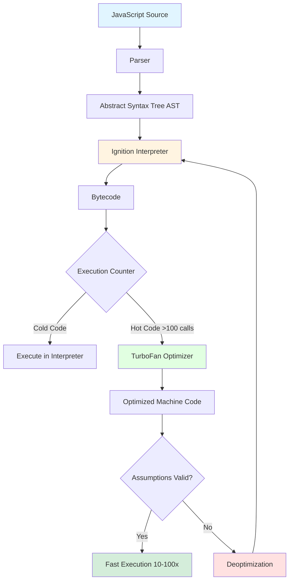
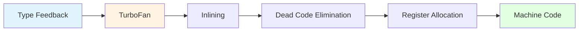
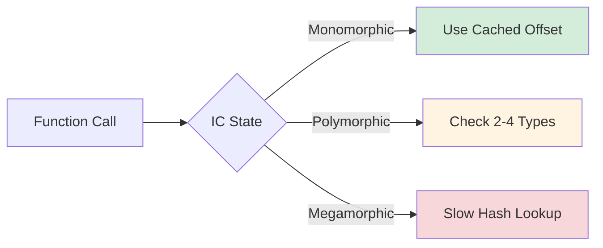
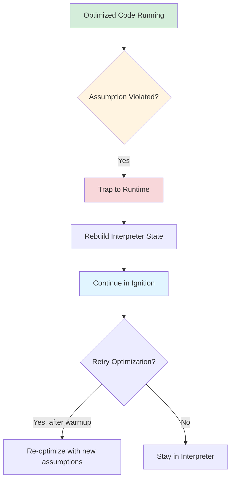

# V8 Engine Architecture Deep Dive

> [!summary] **Why This Matters**
> V8's hidden classes and inline caching are the secret weapons that make JavaScript fast. Understanding these internals helps you write code that stays in the optimized "fast lane" instead of falling back to slow paths. Understanding these mechanisms is critical for senior engineers working on performance-critical applications.

V8 is Google's open-source high-performance JavaScript and WebAssembly engine, written in **C++**. It's used in Chrome, Node.js, Deno, and Bun.

---

## 1. V8 Compilation Pipeline: From Source to Machine Code

### The Three-Tier Architecture



### Tier 1: Parser → AST

```javascript
// Source Code
function add(a, b) {
  return a + b;
}

// AST (Simplified)
FunctionDeclaration {
  id: Identifier("add"),
  params: [Identifier("a"), Identifier("b")],
  body: BlockStatement {
    body: [
      ReturnStatement {
        argument: BinaryExpression {
          operator: "+",
          left: Identifier("a"),
          right: Identifier("b")
        }
      }
    ]
  }
}
```

### Tier 2: Ignition Interpreter (Bytecode Generator)

Ignition generates **bytecode** - a compact, platform-independent representation:

```javascript
// JavaScript
function add(a, b) {
  return a + b;
}

// Ignition Bytecode (simplified)
B0: LdaArg [0]      // Load argument 0 (a) into accumulator
B1: LdaArg [1]      // Load argument 1 (b) into accumulator  
B2: Add             // Add accumulator to register
B3: Return          // Return result
```

> [!note] **Interpreter Characteristics**
> - Fast startup (no compilation delay)
> - Executes immediately
> - Collects type feedback (what types are passed?)
> - Tracks execution count (identifies "hot" functions)

### Tier 3: TurboFan Optimizing Compiler

When a function is called **>100 times** (threshold varies), TurboFan compiles it to optimized machine code:



**Optimizations TurboFan performs:**
1. **Inlining**: Replaces function calls with function body
2. **Type Specialization**: Generates code for specific types (int vs float)
3. **Dead Code Elimination**: Removes unused variables
4. **Constant Folding**: Pre-computes constant expressions
5. **Loop Invariant Code Motion**: Moves calculations outside loops

```javascript
// Before Optimization
function multiply(x, y) {
  return x * y;
}

function calculate(a, b) {
  const result = multiply(a, b);
  return result + 10;
}

// After TurboFan Optimization (conceptual)
function calculate_optimized(a, b) {
  // multiply() inlined
  // Type specialized for SMI (Small Integers)
  // Dead code eliminated
  const result = a * b;  // Direct multiplication
  return result + 10;
}
```

> [!warning] **Optimization Assumptions**
> TurboFan makes assumptions based on observed types. If these change, **deoptimization** occurs.

---

## 2. Hidden Classes (Maps) - The Shape System

### The Problem: Dynamic Properties

JavaScript allows adding/removing properties dynamically:

```javascript
const obj = {};
obj.name = "Alice";
obj.age = 30;
obj.email = "alice@example.com";
```

This dynamism is flexible but slow if every property access requires a hash table lookup.

### The Solution: Hidden Classes

V8 assigns each object a **Hidden Class** (now called "Map" in modern V8). Objects with the same structure share the same hidden class.

```mermaid
flowchart TD
    A[Empty Object {}] -->|Add 'name'| B[Class C1: name@0]
    B -->|Add 'age'| C[Class C2: name@0, age@1]
    C -->|Add 'email'| D[Class C3: name@0, age@1, email@2]
    
    E[Empty Object {}] -->|Add 'name'| B
    E -->|Add 'age' first| F[Class C4: age@0]
    F -->|Add 'name'| G[Class C5: age@0, name@1]
    
    style B fill:#e1f5ff
    style C fill:#e1ffe1
    style D fill:#d4edda
    style F fill:#ffe1e1
    style G fill:#f8d7da
```

### How Hidden Class Transitions Work

```javascript
// Transition Chain
function Person(name, age) {
  this.name = name;  // C0 → C1 (adds 'name' at offset 0)
  this.age = age;    // C1 → C2 (adds 'age' at offset 1)
}

const p1 = new Person("Alice", 30);
const p2 = new Person("Bob", 25);

// Both p1 and p2 share Hidden Class C2
// Property access is now a simple offset calculation:
// p1.name → memory at offset 0
// p1.age → memory at offset 1
```

### Critical Rule: Property Order Matters

> [!danger] **Most Common Performance Mistake**
> Adding properties in different orders creates **different hidden classes**, preventing optimization.

```javascript
// ❌ BAD: Inconsistent property order
const obj1 = {};
obj1.a = 1;  // C0 → C1
obj1.b = 2;  // C1 → C2

const obj2 = {};
obj2.b = 3;  // C0 → C3 (different order!)
obj2.a = 4;  // C3 → C4 (different hidden class than obj1)

// V8 cannot optimize property access across obj1 and obj2
```

```javascript
// ✅ GOOD: Consistent property order
function createPoint(x, y) {
  return { x, y };  // Always creates same hidden class
}

const p1 = createPoint(1, 2);
const p2 = createPoint(3, 4);
const p3 = createPoint(5, 6);

// All share the same hidden class → fast property access
```

### Real-World Performance Impact

```javascript
// Benchmark: Property access with consistent vs inconsistent order

// Fast: Monomorphic (same hidden class)
function processUsers(users) {
  let sum = 0;
  for (let i = 0; i < users.length; i++) {
    sum += users[i].age;  // Fast: offset lookup
  }
  return sum;
}

const users1 = [
  { name: "Alice", age: 30 },
  { name: "Bob", age: 25 },
  { name: "Carol", age: 35 }
];

// Slow: Polymorphic (different hidden classes)
const users2 = [
  { name: "Alice", age: 30 },
  { age: 25, name: "Bob" },  // Different order!
  { name: "Carol", age: 35 }
];

// processUsers(users1) → 10-100x faster than processUsers(users2)
```

### Hidden Class Transitions: Detailed Example

```javascript
// Scenario 1: Constructor Pattern (Optimal)
function Point(x, y) {
  this.x = x;
  this.y = y;
}
// Transition: C0 → C1 (add x) → C2 (add y)
const p1 = new Point(1, 2);
const p2 = new Point(3, 4);
// Result: p1 and p2 share C2 → Fast

// Scenario 2: Object Literal (Optimal)
const p3 = { x: 1, y: 2 };
const p4 = { x: 3, y: 4 };
// Result: p3 and p4 share same hidden class → Fast

// Scenario 3: Dynamic Property Addition (Slow)
const p5 = {};
p5.x = 1;  // C0 → C1
p5.y = 2;  // C1 → C2

const p6 = {};
p6.y = 2;  // C0 → C3 (different!)
p6.x = 1;  // C3 → C4 (different!)
// Result: p5 has C2, p6 has C4 → Slow property access
```

> [!tip] **Best Practice**
> Always initialize all properties in constructors or object literals. Never add properties after object creation.

### When Hidden Classes Change (Transitions)

| Operation | Hidden Class Impact | Performance |
|-----------|---------------------|-------------|
| Add property | New hidden class created | ⚠️ Transition cost |
| Delete property | **Deoptimization** | ❌ Very slow |
| Change property value | No change | ✅ Fast |
| Change property order | New hidden class | ⚠️ Different class |

```javascript
// ❌ NEVER do this - triggers deoptimization
const obj = { a: 1, b: 2 };
delete obj.b;  // Invalidates hidden class!

// ✅ Do this instead
const obj = { a: 1, b: null };  // Set to null instead
```

---

## 3. Inline Caching (IC) - Caching Property Access

### The Concept

Inline Caching caches the **offset** of properties based on observed object types. Instead of looking up property 'age' in a hash table every time, V8 remembers "age is at offset 1".



### IC States Explained

#### State 1: Monomorphic (Fastest ⚡⚡⚡)

Single object type observed. Direct offset access.

```javascript
function getName(obj) {
  return obj.name;  // IC caches: name is at offset 0
}

const user1 = { name: "Alice", age: 30 };
const user2 = { name: "Bob", age: 25 };

getName(user1);  // IC: cache offset 0 for 'name'
getName(user2);  // Uses cached offset → Fast!
```

#### State 2: Polymorphic (Fast ⚡⚡)

2-4 different object types observed. V8 stores multiple cached offsets.

```javascript
function getValue(obj) {
  return obj.value;
}

// First call - User type
getValue({ value: 100, type: "user" });
// IC caches: User.value at offset 0

// Second call - Product type  
getValue({ value: 200, sku: "ABC" });
// IC adds: Product.value at offset 0

// Third call - Still fast (2 types cached)
getValue({ value: 150, type: "user" });
// Uses appropriate cached offset
```

#### State 3: Megamorphic (Slow 🐢)

>5 different types observed. IC gives up, falls back to slow hash table lookup.

```javascript
function getProperty(obj) {
  return obj.data;
}

getProperty({ data: 1, a: 1 });
getProperty({ data: 2, b: 2 });
getProperty({ data: 3, c: 3 });
getProperty({ data: 4, d: 4 });
getProperty({ data: 5, e: 5 });  // ⚠️ IC gives up!
getProperty({ data: 6, f: 6 });  // 🐢 Slow path (hash lookup)
```

### IC Performance Comparison

```javascript
// Benchmark results (operations per second)

// Monomorphic: 100M ops/sec
function mono(obj) { return obj.x; }
mono({ x: 1 });
mono({ x: 2 });

// Polymorphic (2 types): 50M ops/sec
function poly(obj) { return obj.x; }
poly({ x: 1, a: 1 });
poly({ x: 2, b: 2 });

// Megamorphic: 5M ops/sec (20x slower!)
function mega(obj) { return obj.x; }
mega({ x: 1, a: 1 });
mega({ x: 2, b: 2 });
mega({ x: 3, c: 3 });
mega({ x: 4, d: 4 });
mega({ x: 5, e: 5 });
```

> [!warning] **Key Insight**
> Megamorphic calls are **10-20x slower** than monomorphic calls. This is why keeping object shapes consistent is critical for performance.

---

## 4. Optimization and Deoptimization

### When V8 Optimizes

TurboFan optimizes when:
1. Function is "hot" (called >100 times)
2. Type feedback is stable (consistent types observed)
3. No dynamic features used (`eval`, `with`, `delete`)

```javascript
// Optimizable function
function add(a, b) {
  return a + b;
}

// Called 1000 times with numbers
for (let i = 0; i < 1000; i++) {
  add(i, i + 1);  // TurboFan compiles to machine code
}
```

### When V8 Deoptimizes

Deoptimization occurs when TurboFan's assumptions are violated:

```javascript
// ❌ Deoptimization Triggers

// 1. Changing object shape after optimization
function process(obj) {
  return obj.value;
}

const obj = { value: 10 };
process(obj);  // Optimized for this shape

obj.newProp = 5;  // Shape changed → DEOPT!

// 2. Changing array element types
function sumArray(arr) {
  let sum = 0;
  for (let i = 0; i < arr.length; i++) {
    sum += arr[i];  // Optimized for SMI (Small Integers)
  }
  return sum;
}

const numbers = [1, 2, 3, 4, 5];
sumArray(numbers);  // Optimized for integers

numbers.push(3.14);  // Float introduced → DEOPT!

// 3. Using delete
const user = { name: "Alice", age: 30 };
delete user.age;  // Invalidates hidden class → DEOPT!

// 4. Using eval or with
function dynamic(code) {
  eval(code);  // Prevents all optimization
}

// 5. Passing different argument types
function multiply(a, b) {
  return a * b;
}

multiply(2, 3);      // Optimized for integers
multiply("2", "3");  // String coercion → DEOPT!
multiply(null, 5);   // Null → DEOPT!
```

### Deoptimization Process



> [!note] **Deoptimization Cost**
> Deoptimization is expensive (100-1000x slower than optimized code). Frequent deopts kill performance.

---

## 5. Arrays in V8 - Special Handling

### Array Element Kinds

V8 tracks array element types separately:

| Element Kind | Description | Performance |
|--------------|-------------|-------------|
| **SMI** | Small Integers (31-bit) | ⚡⚡⚡ Fastest |
| **Double** | Floating point numbers | ⚡⚡ Fast |
| **Packed** | No holes, any type | ⚡ Medium |
| **Holey** | Contains holes (deleted elements) | 🐢 Slow |

```javascript
// SMI Array (fastest)
const arr1 = [1, 2, 3, 4, 5];

// Transitions to Double
arr1.push(3.14);  // SMI → Double

// Transitions to Packed
arr1.push("string");  // Double → Packed

// Transitions to Holey (very slow!)
delete arr1[2];  // Creates hole → Holey Packed
```

### Holey Arrays Performance Impact

```javascript
// Fast: Packed array
const packed = [1, 2, 3, 4, 5];
packed.forEach(x => sum += x);  // Fast iteration

// Slow: Holey array
const holey = [1, 2, 3, 4, 5];
delete holey[2];  // Creates hole
holey.forEach(x => sum += x);  // Must check for holes!
```

> [!danger] **Never Delete Array Elements**
> Use `arr[index] = undefined` instead of `delete arr[index]` to avoid holes.

---

## 6. Writing V8-Friendly Code: Best Practices

### ✅ DO:

1. **Initialize all properties in constructors**
   ```javascript
   function User(name, age, email) {
     this.name = name;
     this.age = age;
     this.email = email;
   }
   ```

2. **Use object literals with consistent order**
   ```javascript
   const config = { host: "localhost", port: 3000, debug: true };
   ```

3. **Pre-allocate arrays with known size**
   ```javascript
   const arr = new Array(1000);  // Pre-allocated
   for (let i = 0; i < 1000; i++) {
     arr[i] = i;
   }
   ```

4. **Use SMIs (Small Integers) when possible**
   ```javascript
   const smallNums = [1, 2, 3, 4, 5];  // SMI array
   ```

5. **Avoid `delete`** - use `null` or `undefined`
   ```javascript
   obj.prop = null;  // Instead of delete obj.prop
   ```

6. **Keep functions monomorphic**
   ```javascript
   function process(user) {
     return user.name.toUpperCase();
   }
   // Always pass objects with same shape
   ```

### ❌ DON'T:

1. **Don't add properties after creation**
   ```javascript
   const obj = {};
   obj.a = 1;  // Bad
   obj.b = 2;  // Bad
   ```

2. **Don't mix array element types**
   ```javascript
   const arr = [1, 2, 3];
   arr.push("string");  // Triggers type transition
   ```

3. **Don't create holes in arrays**
   ```javascript
   delete arr[5];  // Very slow!
   ```

4. **Don't use `eval` or `with`**
   ```javascript
   eval("x + 1");  // Prevents optimization
   ```

5. **Don't pass different types to hot functions**
   ```javascript
   function add(a, b) { return a + b; }
   add(1, 2);      // Number
   add("1", "2");  // String - causes deopt!
   ```

---

## 7. Debugging V8 Optimization

### Using Node.js Flags

```bash
# See hidden class transitions
node --trace-maps your-script.js

# See optimization/deoptimization
node --trace-opt --trace-deopt your-script.js

# See IC state changes
node --trace-ic your-script.js
```

### Example Output

```bash
$ node --trace-maps script.js

[creating map #1 for empty object]
[transitioning from map #1 to #2 (add property 'x')]
[transitioning from map #2 to #3 (add property 'y')]
[map #3 reused for second object]
```

### Chrome DevTools

1. Open **Performance** tab
2. Enable **Debugging features** → **Show V8 internal functions**
3. Record profile
4. Look for "(deoptimized)" tags in call stack

---

## 8. Interview Q&A

### Q1: What are hidden classes and why do they exist?
**A:** Hidden classes (Maps) are V8's internal structures that represent object shape. They exist to optimize property access from O(n) hash lookup to O(1) offset calculation. Objects with the same property order share hidden classes, enabling fast property access across multiple instances.

### Q2: What causes deoptimization in V8?
**A:** Common causes:
- Changing object shape after optimization (adding/deleting properties)
- Changing array element types (int → float → string)
- Creating holes in arrays with `delete`
- Passing different argument types to hot functions
- Using `eval()`, `with`, or `delete` operators
- Modifying `__proto__` after object creation

### Q3: Explain monomorphic vs polymorphic vs megamorphic functions.
**A:**
- **Monomorphic**: Called with single object type → fastest (direct offset access)
- **Polymorphic**: Called with 2-4 types → fast (cached offsets for each type)
- **Megamorphic**: Called with >4 types → slow (falls back to hash table lookup)

Performance difference: Monomorphic is 10-20x faster than megamorphic.

### Q4: Why is `delete` bad for performance?
**A:** `delete` removes a property from an object, which:
1. Invalidates the hidden class (object gets new shape)
2. Triggers deoptimization of any optimized code using that object
3. Forces V8 to fall back to slow dictionary mode for property storage
4. Creates holes in arrays, slowing down iteration

Alternative: Set property to `null` or `undefined` instead.

### Q5: How does V8 handle arrays differently from objects?
**A:** V8 tracks array element types separately (SMI, Double, Packed, Holey). It optimizes based on observed types:
- **SMI arrays**: Fastest, integers stored directly
- **Double arrays**: Slightly slower, 64-bit floats
- **Packed arrays**: Any type, no holes
- **Holey arrays**: Slowest, must check for holes during iteration

### Q6: What is inline caching and how does it work?
**A:** Inline caching caches property offsets at call sites. When accessing `obj.name`, V8 remembers "name is at offset 0 for this object type". Subsequent accesses use the cached offset instead of looking up in a hash table. If different types are observed, V8 stores multiple cached offsets (polymorphic IC).

### Q7: When should you use `Map` instead of `Object`?
**A:** Use `Map` when:
- You have >10 properties (avoids hidden class proliferation)
- Keys are not known at compile time
- You need frequent property addition/deletion
- Keys are not strings (Map supports any type)

Use `Object` when:
- Properties are known and fixed
- You want V8 optimizations
- Performance is critical

### Q8: How can you inspect V8 optimization status?
**A:** 
- **Node.js flags**: `--trace-opt`, `--trace-deopt`, `--trace-maps`, `--trace-ic`
- **Chrome DevTools**: Performance tab → Show V8 internal functions
- **%OptimizeFunctionOnNextCall()**: V8 intrinsic (requires `--allow-natives-syntax`)
- **%NeverOptimizeFunction()**: Force interpreter mode for debugging

---

## 9. Performance Checklist

> [!checklist] **V8 Optimization Checklist**
> - [ ] All object properties initialized in same order
> - [ ] No property additions after object creation
> - [ ] No `delete` operators used
> - [ ] Arrays pre-allocated when size known
> - [ ] No holes in arrays (no `delete arr[i]`)
> - [ ] Hot functions receive consistent argument types
> - [ ] No `eval()` or `with` statements
> - [ ] Using `const`/`let` instead of `var`
> - [ ] Avoiding `__proto__` manipulation
> - [ ] Using `Map` for dynamic key sets (>10 keys)

---

## 10. References

- [V8 Documentation](https://v8.dev/)
- [V8 Blog: Hidden Classes](https://v8.dev/blog/fast-properties)
- [V8 Blog: Inline Caching](https://v8.dev/blog/ic)
- [V8 Blog: TurboFan](https://v8.dev/blog/turbofan)
- [JavaScript Garbage Collection](https://javascript.info/garbage-collection)
- ["You Don't Know JS" - This & Object Prototypes](https://github.com/getify/You-Dont-Know-JS)

---

> [!tip] **Pro Tip for Senior Engineers**
> Profile before optimizing! Use `node --trace-opt` to see what's actually being optimized. Most performance issues come from algorithmic complexity, not V8 optimizations. Focus on data structures first, micro-optimizations second.
