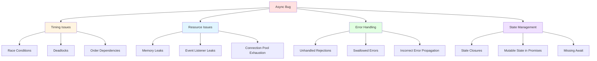
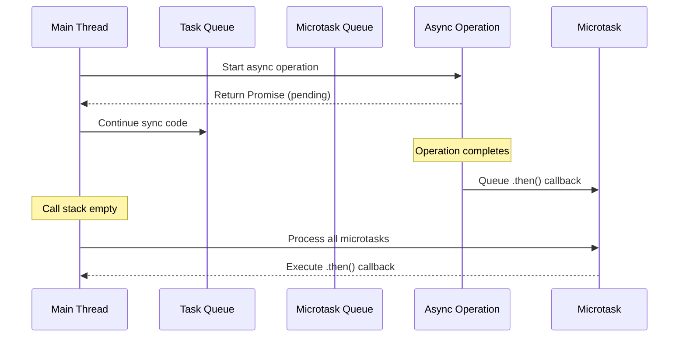
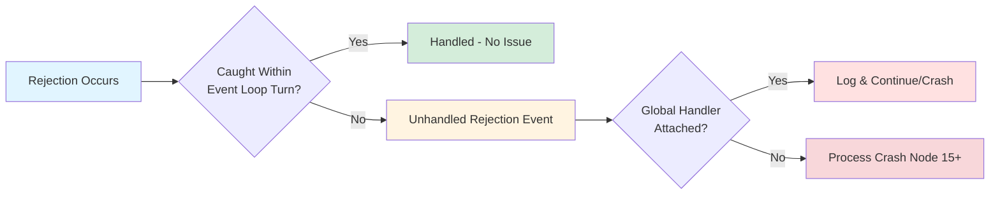
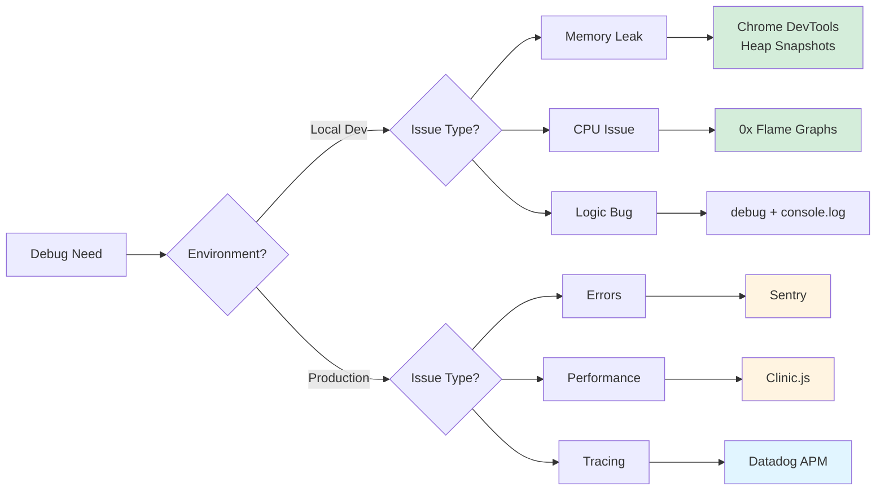
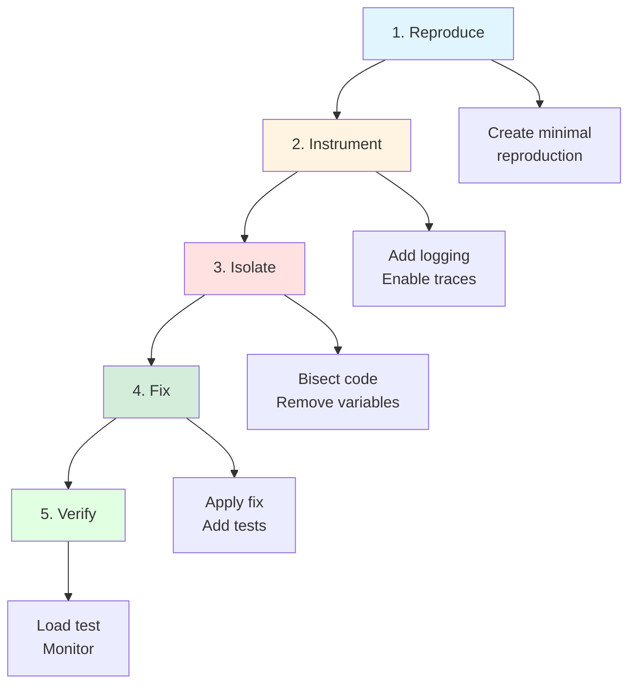

# Playbook: Debugging Async Issues & Unhandled Rejections

> [!summary] **Why This Playbook Exists**
> Async bugs are the #1 source of production incidents in Node.js applications. This playbook provides a systematic workflow for diagnosing race conditions, unhandled rejections, memory leaks in async loops, and promise chain failures. Master these techniques to reduce MTTR (Mean Time To Resolution) by 60-80%.

---

## Table of Contents

1. [The Anatomy of Async Bugs](#1-the-anatomy-of-async-bugs)
2. [Unhandled Promise Rejection Detection](#2-unhandled-promise-rejection-detection)
3. [Async Stack Trace Analysis](#3-async-stack-trace-analysis)
4. [Common Async Bug Scenarios (15+)](#4-common-async-bug-scenarios)
5. [Tools Comparison Matrix](#5-tools-comparison-matrix)
6. [Systematic Debugging Workflow](#6-systematic-debugging-workflow)
7. [Real-World Case Studies](#7-real-world-case-studies)
8. [Interview Q&A](#8-interview-q-a)

---

## 1. The Anatomy of Async Bugs

### 1.1 Categories of Async Bugs



### 1.2 Async Bug Manifestation Timeline

| Phase | Symptom | Root Cause | Detection Method |
|-------|---------|------------|------------------|
| **Development** | Promise hangs forever | Missing `await` or `.catch()` | ESLint, manual testing |
| **Testing** | Flaky tests | Race conditions | Test retries, logging |
| **Staging** | Memory growth | Async loop leaks | Heap snapshots |
| **Production** | Process crashes | Unhandled rejections | Process monitoring |

### 1.3 The Async Execution Model



> [!warning] **Critical Insight**
> Microtasks (Promise callbacks) run BEFORE macrotasks (setTimeout, I/O). This ordering causes many race condition bugs when developers assume synchronous-like ordering.

---

## 2. Unhandled Promise Rejection Detection

### 2.1 Understanding Unhandled Rejections

An unhandled rejection occurs when a Promise is rejected and no `.catch()` or `try/catch` handles it within the current turn of the event loop.

```javascript
// ❌ BAD: Unhandled rejection - will crash Node.js 15+
fetch('/api/data')
  .then(res => res.json())
  .then(data => console.log(data));
// Missing .catch() - if fetch fails, process crashes!

// ✅ GOOD: Always handle rejections
fetch('/api/data')
  .then(res => res.json())
  .then(data => console.log(data))
  .catch(err => console.error('Fetch failed:', err));
```

### 2.2 Global Rejection Handlers

```javascript
// Add at application entry point (before any async code)

// Catch unhandled rejections
process.on('unhandledRejection', (reason, promise) => {
  console.error('=== UNHANDLED REJECTION ===');
  console.error('Promise:', promise);
  console.error('Reason:', reason);
  console.error('Stack:', reason?.stack);
  console.error('===========================');
  
  // Log to monitoring service (Sentry, Datadog, etc.)
  // logger.error('UnhandledRejection', { reason, promise });
  
  // In production, gracefully shutdown
  // process.exit(1); // Only if you can't recover
});

// Catch uncaught exceptions (different from promise rejections)
process.on('uncaughtException', (err) => {
  console.error('=== UNCAUGHT EXCEPTION ===');
  console.error('Error:', err);
  console.error('Stack:', err.stack);
  console.error('=========================');
  
  // Graceful shutdown
  // server.close(() => process.exit(1));
});

// For Node.js 15+ - make unhandled rejections throw
process.on('unhandledRejection', (reason) => {
  throw reason; // Convert to uncaught exception
});
```

### 2.3 Detection Strategies



### 2.4 Async Hooks for Advanced Tracking

```javascript
import { AsyncLocalStorage } from 'async_hooks';

const asyncStorage = new AsyncLocalStorage();

// Track async context across operations
function wrapAsync(fn) {
  return async function(...args) {
    const context = {
      id: Math.random().toString(36).slice(2),
      startTime: Date.now(),
      operation: fn.name
    };
    
    return asyncStorage.run(context, async () => {
      try {
        const result = await fn(...args);
        const duration = Date.now() - context.startTime;
        console.log(`[${context.id}] ${context.operation} completed in ${duration}ms`);
        return result;
      } catch (err) {
        const store = asyncStorage.getStore();
        console.error(`[${store.id}] ${store.operation} failed:`, err.message);
        throw err;
      }
    });
  };
}

// Usage
const dbQuery = wrapAsync(async (sql) => {
  return db.execute(sql);
});

await dbQuery('SELECT * FROM users');
```

---

## 3. Async Stack Trace Analysis

### 3.1 Why Async Stack Traces Are Broken

Traditional stack traces show only synchronous call chains:

```
Error: Database connection failed
    at Database.connect (db.js:45)
    at getUser (users.js:12)
    at /app/server.js:89
```

Missing: **What triggered the async operation?**

### 3.2 Enabling Async Stack Traces

```bash
# Node.js flags for better async debugging

# Show async stack traces
node --async-stack-traces app.js

# Trace warnings (includes unhandled rejections)
node --trace-warnings app.js

# Show all promise operations
node --trace-promise app.js

# Combine for maximum visibility
node --async-stack-traces --trace-warnings --trace-promise app.js
```

### 3.3 Async Hooks for Custom Tracing

```javascript
import { createHook, executionAsyncId } from 'async_hooks';

const asyncHook = createHook({
  init(asyncId, type, triggerAsyncId, resource) {
    console.log(`[INIT] asyncId=${asyncId}, type=${type}, trigger=${triggerAsyncId}`);
  },
  before(asyncId) {
    console.log(`[BEFORE] asyncId=${asyncId}`);
  },
  after(asyncId) {
    console.log(`[AFTER] asyncId=${asyncId}`);
  },
  destroy(asyncId) {
    console.log(`[DESTROY] asyncId=${asyncId}`);
  }
});

asyncHook.enable();

// Now all async operations are traced
setTimeout(() => console.log('timeout'), 100);
Promise.resolve().then(() => console.log('promise'));
```

### 3.4 Long Stack Trace Libraries

```javascript
// Install: npm install long-stack-traces
import 'long-stack-traces';

async function level3() {
  await new Promise((_, reject) => reject(new Error('Failed')));
}

async function level2() {
  return await level3();
}

async function level1() {
  return await level2();
}

level1().catch(console.error);

// Output includes async creation point:
// Error: Failed
//     at level3 (app.js:4)
//     at level2 (app.js:8)
//     at level1 (app.js:12)
//     at From previous event:
//     at level1 (app.js:12)
```

---

## 4. Common Async Bug Scenarios

### 4.1 Missing Await (Silent Failures)

```javascript
// ❌ BUG: Function returns Promise, not value
async function getUser(id) {
  const user = db.findById(id); // Missing await!
  return user.name; // TypeError: Cannot read property 'name' of Promise
}

// ✅ FIX
async function getUser(id) {
  const user = await db.findById(id);
  return user.name;
}
```

**Detection:** ESLint rule `require-await` or `return-await`

### 4.2 Race Condition in Parallel Operations

```javascript
// ❌ BUG: Race condition - order not guaranteed
let balance = 100;

async function withdraw(amount) {
  const current = balance;      // Read
  await delay(100);             // Async gap
  balance = current - amount;   // Write (stale read!)
}

await Promise.all([
  withdraw(30),  // Might read 100, write 70
  withdraw(50)   // Might read 100, write 50 (overwrites first!)
]);
console.log(balance); // Could be 70 or 50, not 20!

// ✅ FIX: Use mutex/lock
import { Mutex } from 'async-mutex';
const mutex = new Mutex();

async function withdraw(amount) {
  const release = await mutex.acquire();
  try {
    const current = balance;
    await delay(100);
    balance = current - amount;
  } finally {
    release();
  }
}
```

### 4.3 forEach with Async Callbacks

```javascript
// ❌ BUG: forEach doesn't wait for async callbacks
const userIds = [1, 2, 3, 4, 5];
const results = [];

userIds.forEach(async (id) => {
  const user = await db.findById(id);
  results.push(user);
});

console.log(results.length); // 0! forEach returned immediately

// ✅ FIX 1: Use for...of loop
const results = [];
for (const id of userIds) {
  const user = await db.findById(id);
  results.push(user);
}

// ✅ FIX 2: Use Promise.all
const results = await Promise.all(
  userIds.map(id => db.findById(id))
);

// ✅ FIX 3: Sequential with for...of (when order matters)
const results = [];
for (const id of userIds) {
  const user = await db.findById(id);
  results.push(user);
}
```

### 4.4 Unhandled Rejection in Promise.all

```javascript
// ❌ BUG: One rejection kills all, but might be unhandled
async function fetchAll(urls) {
  return Promise.all(
    urls.map(url => fetch(url).then(r => r.json()))
  );
}

// If any URL fails, entire Promise.all rejects
// Without .catch(), this is unhandled

// ✅ FIX: Handle individual failures
async function fetchAll(urls) {
  const results = await Promise.allSettled(
    urls.map(url => 
      fetch(url)
        .then(r => r.json())
        .catch(err => ({ error: err.message, url }))
    )
  );
  
  return results.map(r => 
    r.status === 'fulfilled' ? r.value : r.reason
  );
}
```

### 4.5 Event Emitter Memory Leak

```javascript
// ❌ BUG: Event listeners accumulate
class DataProcessor {
  constructor() {
    this.emitter = new EventEmitter();
  }
  
  process(data) {
    // New listener added every call - LEAK!
    this.emitter.on('data', async (item) => {
      await this.handle(item);
    });
    this.emitter.emit('data', data);
  }
}

// ✅ FIX: Add listener once, or use once()
class DataProcessor {
  constructor() {
    this.emitter = new EventEmitter();
    this.emitter.on('data', async (item) => {
      await this.handle(item);
    });
  }
  
  process(data) {
    this.emitter.emit('data', data);
  }
}

// Or use removeListener
process(data) {
  const handler = async (item) => {
    await this.handle(item);
    this.emitter.off('data', handler);
  };
  this.emitter.on('data', handler);
  this.emitter.emit('data', data);
}
```

### 4.6 Async Loop Memory Leak

```javascript
// ❌ BUG: References held in async loop
async function processQueue(queue) {
  while (queue.length > 0) {
    const item = queue.shift();
    
    // Closure holds reference to entire item
    setTimeout(async () => {
      await this.process(item);
      // item never GC'd until timeout fires
    }, 5000);
  }
}

// ✅ FIX: Limit concurrency, clear references
async function processQueue(queue) {
  const BATCH_SIZE = 10;
  
  while (queue.length > 0) {
    const batch = queue.splice(0, BATCH_SIZE);
    await Promise.all(batch.map(item => this.process(item)));
    // References released after each batch
  }
}
```

### 4.7 Promise Chain Error Swallowing

```javascript
// ❌ BUG: Empty .catch() swallows errors
fetch('/api/data')
  .then(res => res.json())
  .then(data => transform(data))
  .catch(err => {
    // Silent failure - bug hidden!
  });

// ✅ FIX: Always log or rethrow
fetch('/api/data')
  .then(res => res.json())
  .then(data => transform(data))
  .catch(err => {
    console.error('API call failed:', err);
    throw err; // Re-throw for upstream handling
  });
```

### 4.8 Async/Await Error Handling

```javascript
// ❌ BUG: Missing try/catch around await
async function getUserProfile(userId) {
  const user = await db.findById(userId);
  const posts = await db.findPosts(user.id);
  const stats = await calculateStats(posts);
  return { user, posts, stats };
}

// ✅ FIX: Wrap in try/catch
async function getUserProfile(userId) {
  try {
    const user = await db.findById(userId);
    const posts = await db.findPosts(user.id);
    const stats = await calculateStats(posts);
    return { user, posts, stats };
  } catch (err) {
    logger.error('getUserProfile failed', { userId, error: err });
    throw new UserProfileError(userId, err);
  }
}
```

### 4.9 Concurrent Modification of Shared State

```javascript
// ❌ BUG: Shared state modified concurrently
const cache = new Map();

async function fetchWithCache(key, fetchFn) {
  if (cache.has(key)) {
    return cache.get(key);
  }
  
  // Race: Multiple calls might all reach here
  const value = await fetchFn(key);
  cache.set(key, value); // Last one wins
  return value;
}

// ✅ FIX: Track in-flight requests
const cache = new Map();
const inFlight = new Map();

async function fetchWithCache(key, fetchFn) {
  if (cache.has(key)) {
    return cache.get(key);
  }
  
  if (inFlight.has(key)) {
    return inFlight.get(key);
  }
  
  const promise = fetchFn(key)
    .then(value => {
      cache.set(key, value);
      inFlight.delete(key);
      return value;
    })
    .catch(err => {
      inFlight.delete(key);
      throw err;
    });
  
  inFlight.set(key, promise);
  return promise;
}
```

### 4.10 Timeout and Cancellation

```javascript
// ❌ BUG: No timeout - hangs forever
async function slowOperation() {
  return await externalService.call(); // Might hang
}

// ✅ FIX: Add timeout with AbortController
async function withTimeout(promise, ms) {
  const controller = new AbortController();
  const timeoutId = setTimeout(() => controller.abort(), ms);
  
  try {
    return await Promise.race([
      promise,
      new Promise((_, reject) => {
        controller.signal.addEventListener('abort', () => {
          reject(new TimeoutError(`Operation timed out after ${ms}ms`));
        });
      })
    ]);
  } finally {
    clearTimeout(timeoutId);
  }
}

// Usage
const result = await withTimeout(
  externalService.call(),
  5000
);
```

### 4.11 Microtask Starvation

```javascript
// ❌ BUG: Infinite microtask queue
async function process() {
  while (true) {
    await Promise.resolve(); // Never yields to macrotasks
  }
}

// ✅ FIX: Yield to event loop periodically
async function process() {
  let count = 0;
  while (true) {
    if (count % 100 === 0) {
      await new Promise(resolve => setImmediate(resolve));
    }
    await Promise.resolve();
    count++;
  }
}
```

### 4.12 Async Iterator Cleanup

```javascript
// ❌ BUG: Resource leak in async iteration
async function* readLines(file) {
  const stream = fs.createReadStream(file);
  for await (const chunk of stream) {
    yield chunk.toString();
  }
  // Stream never closed if iteration breaks early!
}

// ✅ FIX: Use try/finally
async function* readLines(file) {
  const stream = fs.createReadStream(file);
  try {
    for await (const chunk of stream) {
      yield chunk.toString();
    }
  } finally {
    stream.destroy();
  }
}
```

### 4.13 Promise Constructor Anti-pattern

```javascript
// ❌ BAD: Unnecessary Promise constructor
function delay(ms) {
  return new Promise((resolve, reject) => {
    setTimeout(() => {
      resolve(); // Could just: setTimeout(resolve, ms)
    }, ms);
  });
}

// ✅ GOOD: Use native utilities
const delay = (ms) => new Promise(resolve => setTimeout(resolve, ms));

// Or better: Use timers/promises (Node 15+)
import { setTimeout } from 'timers/promises';
await setTimeout(1000);
```

### 4.14 Parallel vs Sequential Confusion

```javascript
// ❌ SLOW: Sequential when parallel is possible
async function fetchAll(urls) {
  const results = [];
  for (const url of urls) {
    const res = await fetch(url); // Waits for each
    results.push(await res.json());
  }
  return results; // Takes N * latency
}

// ✅ FAST: Parallel execution
async function fetchAll(urls) {
  const promises = urls.map(url => fetch(url).then(r => r.json()));
  return await Promise.all(promises); // Takes 1 * latency
}

// ⚠️ CONTROLLED: Limited concurrency
import pLimit from 'p-limit';
const limit = pLimit(5); // Max 5 concurrent

async function fetchAll(urls) {
  const promises = urls.map(url => 
    limit(() => fetch(url).then(r => r.json()))
  );
  return await Promise.all(promises);
}
```

### 4.15 Async Context Loss

```javascript
// ❌ BUG: Context lost across async boundary
const userContext = { userId: 123, requestId: 'abc' };

async function processRequest() {
  // userContext might be stale here
  await db.query('SELECT * FROM users');
  logger.info('Processed for', userContext.userId);
}

// ✅ FIX: Use AsyncLocalStorage
import { AsyncLocalStorage } from 'async_hooks';

const contextStorage = new AsyncLocalStorage();

function withContext(context, fn) {
  return contextStorage.run(context, fn);
}

function getContext() {
  return contextStorage.getStore();
}

// Usage
withContext({ userId: 123, requestId: 'abc' }, async () => {
  await processRequest(); // Context preserved
});

async function processRequest() {
  await db.query('SELECT * FROM users');
  const ctx = getContext();
  logger.info('Processed for', ctx.userId);
}
```

---

## 5. Tools Comparison Matrix

| Tool | Purpose | Async Support | Performance Impact | Best For |
|------|---------|---------------|-------------------|----------|
| **console.log** | Basic debugging | ❌ None | Low | Quick checks |
| **debug** | Namespaced logging | ⚠️ Manual | Low | Library debugging |
| **winston/pino** | Structured logging | ✅ Async context | Medium | Production |
| **AsyncLocalStorage** | Context tracking | ✅ Native | Low-Medium | Request tracing |
| **async_hooks** | Low-level tracing | ✅ Complete | High | Custom tools |
| **clinic.js** | Performance profiling | ✅ Full | Medium | Production issues |
| **0x** | Flame graphs | ✅ Full | Medium | CPU profiling |
| **Chrome DevTools** | Memory/CPU | ✅ Good | Low | Local debugging |
| **Sentry** | Error tracking | ✅ Stack traces | Low | Production errors |
| **Datadog APM** | Distributed tracing | ✅ Full | Medium | Microservices |

### 5.1 Tool Selection Guide



---

## 6. Systematic Debugging Workflow

### 6.1 The 5-Step Debugging Process



### 6.2 Step-by-Step Checklist

#### Step 1: Reproduce
- [ ] Create minimal reproduction script
- [ ] Document exact steps to trigger bug
- [ ] Note timing/environmental factors

#### Step 2: Instrument
```bash
# Enable Node.js debugging flags
export NODE_OPTIONS="--async-stack-traces --trace-warnings"

# Run with inspection
node --inspect-brk app.js

# Connect Chrome DevTools to chrome://inspect
```

#### Step 3: Isolate
```javascript
// Binary search to find bug location
async function debugAsync() {
  console.log('Step 1');
  await operation1();
  console.log('Step 2'); // Does this print?
  await operation2();    // Or does it hang here?
  console.log('Step 3');
}
```

#### Step 4: Fix
- [ ] Apply minimal fix
- [ ] Add error handling
- [ ] Add timeout protection
- [ ] Add monitoring

#### Step 5: Verify
```javascript
// Add regression test
test('handles async failure gracefully', async () => {
  await expect(asyncOperation())
    .rejects
    .toThrow('Expected error');
});
```

---

## 7. Real-World Case Studies

### Case Study 1: Memory Leak in Event-Driven Architecture

**Problem:** Node.js process grew to 4GB over 24 hours.

**Investigation:**
```bash
# Take heap snapshots every hour
node --inspect app.js

# In Chrome DevTools:
# 1. Memory tab → Take Heap Snapshot
# 2. Compare Snapshot 1 vs Snapshot 4
# 3. Filter by "Closure" → Found 10,000+ event listeners
```

**Root Cause:**
```javascript
// Bug found in notification service
class NotificationService {
  subscribe(userId, callback) {
    // New listener added every subscription - never removed!
    eventEmitter.on('notification', callback);
  }
}
```

**Fix:**
```javascript
class NotificationService {
  subscribe(userId, callback) {
    const weakRef = new WeakRef(callback);
    const handler = (...args) => weakRef.deref()?.(...args);
    
    eventEmitter.on('notification', handler);
    
    // Return unsubscribe function
    return () => eventEmitter.off('notification', handler);
  }
}
```

**Result:** Memory stable at 256MB after fix.

### Case Study 2: Race Condition in Payment Processing

**Problem:** 0.1% of transactions processed twice.

**Root Cause:**
```javascript
// Two concurrent webhook calls
app.post('/webhook', async (req, res) => {
  const { transactionId, status } = req.body;
  
  const tx = await db.getTransaction(transactionId);
  if (tx.status === 'pending' && status === 'completed') {
    await creditUser(tx.userId, tx.amount);
    await db.updateStatus(transactionId, 'completed');
  }
  
  res.send('OK');
});
```

**Fix: Database-level locking**
```javascript
app.post('/webhook', async (req, res) => {
  const { transactionId } = req.body;
  
  // Use database transaction with row-level lock
  await db.transaction(async (trx) => {
    const tx = await trx
      .select('*')
      .from('transactions')
      .where({ id: transactionId })
      .forUpdate(); // Lock row
    
    if (tx[0].status === 'pending') {
      await trx('transactions')
        .where({ id: transactionId })
        .update({ status: 'completed' });
      await creditUser(tx[0].userId, tx[0].amount, trx);
    }
  });
  
  res.send('OK');
});
```

**Result:** Zero duplicate transactions after deployment.

---

## 8. Interview Q&A

### Q1: How do you debug a memory leak in an async loop?

**A:** Systematic approach:
1. **Confirm leak:** Monitor RSS memory over time with `process.memoryUsage()`
2. **Take heap snapshots:** Use Chrome DevTools or `v8.writeHeapSnapshot()`
3. **Compare snapshots:** Look for objects growing between snapshots
4. **Check retention paths:** Find what's holding references
5. **Common culprits:**
   - Closures capturing loop variables
   - Event listeners not removed
   - Timers/intervals not cleared
   - Growing caches without TTL

```javascript
// Debug async loop leak
async function findLeak() {
  const initial = process.memoryUsage().heapUsed;
  
  for (let i = 0; i < 1000; i++) {
    await processItem(i);
    if (i % 100 === 0) {
      console.log(`Iteration ${i}: ${process.memoryUsage().heapUsed / 1024 / 1024}MB`);
    }
  }
  
  const final = process.memoryUsage().heapUsed;
  console.log(`Growth: ${(final - initial) / 1024 / 1024}MB`);
}
```

### Q2: What's the difference between `unhandledRejection` and `uncaughtException`?

**A:**
| Aspect | unhandledRejection | uncaughtException |
|--------|-------------------|-------------------|
| **Trigger** | Promise rejected without `.catch()` | Synchronous error not caught |
| **Timing** | End of event loop turn | Immediate |
| **Node 15+** | Crashes process by default | Crashes process |
| **Recovery** | Sometimes recoverable | Usually fatal |
| **Stack trace** | May be incomplete | Complete sync stack |

```javascript
// unhandledRejection
Promise.reject(new Error('Async error'));

// uncaughtException  
throw new Error('Sync error');
```

### Q3: How do you prevent race conditions in async code?

**A:** Multiple strategies:
1. **Mutex/Lock:** Serialize access to shared state
2. **Atomic operations:** Use database transactions
3. **Immutable data:** Avoid shared mutable state
4. **Promise.allSettled:** Handle concurrent operations safely
5. **Optimistic locking:** Version checks on updates

```javascript
// Mutex example
import { Mutex } from 'async-mutex';
const mutex = new Mutex();

async function updateBalance(userId, amount) {
  const release = await mutex.acquire();
  try {
    const balance = await getBalance(userId);
    await setBalance(userId, balance + amount);
  } finally {
    release();
  }
}
```

### Q4: Explain Promise.all vs Promise.allSettled vs Promise.race

**A:**
- **Promise.all:** Waits for all, rejects on first failure
- **Promise.allSettled:** Waits for all, returns status for each
- **Promise.race:** Returns first settled (resolve or reject)
- **Promise.any:** Returns first success, rejects if all fail

```javascript
// Promise.all - fail fast
const [a, b, c] = await Promise.all([p1, p2, p3]);
// If p2 rejects, a and b results lost

// Promise.allSettled - collect all results
const results = await Promise.allSettled([p1, p2, p3]);
results.forEach(r => {
  if (r.status === 'fulfilled') console.log(r.value);
  else console.error(r.reason);
});

// Promise.race - timeout pattern
const result = await Promise.race([
  fetchData(),
  new Promise((_, reject) => 
    setTimeout(() => reject(new TimeoutError()), 5000)
  )
]);
```

### Q5: What causes "Promise chain broken" errors?

**A:** Common causes:
1. **Missing return in .then():** Next `.then()` receives `undefined`
2. **Mixed async/await with .then():** Inconsistent error handling
3. **Forgotten .catch():** Rejection propagates unhandled
4. **Returning Promise in executor:** Double-wrapping issues

```javascript
// Broken chain
fetch('/api')
  .then(res => {
    res.json(); // Missing return!
  })
  .then(data => console.log(data)); // Receives undefined

// Fixed
fetch('/api')
  .then(res => res.json())
  .then(data => console.log(data))
  .catch(err => console.error(err));
```

### Q6: How do you handle async cleanup on process termination?

**A:** Graceful shutdown pattern:

```javascript
const server = app.listen(3000);
const db = await connectDatabase();
const redis = await connectRedis();

// Cleanup function
async function shutdown(signal) {
  console.log(`Received ${signal}, shutting down gracefully`);
  
  server.close(async () => {
    await db.disconnect();
    await redis.disconnect();
    process.exit(0);
  });
  
  // Force kill after 10 seconds
  setTimeout(() => process.exit(1), 10000);
}

// Handle termination signals
process.on('SIGTERM', () => shutdown('SIGTERM'));
process.on('SIGINT', () => shutdown('SIGINT'));
```

### Q7: What are microtasks and when do they execute?

**A:** Microtasks execute after current synchronous code completes but before any macrotask (setTimeout, I/O):

```javascript
console.log('1: sync');

setTimeout(() => console.log('2: setTimeout'), 0);

Promise.resolve().then(() => console.log('3: promise'));

console.log('4: sync');

// Output: 1, 4, 3, 2
// Promise callbacks (microtasks) run before setTimeout (macrotask)
```

**Order:** Sync code → Microtasks → Macrotasks → Repeat

### Q8: How do you debug a hanging async operation?

**A:** Systematic approach:
1. **Add timeouts:** Wrap operations with timeout detection
2. **Enable async hooks:** Trace async operation lifecycle
3. **Check event loop:** Use `why-is-node-running`
4. **Inspect pending promises:** Use async debugging tools

```bash
# Install debugging tool
npm install why-is-node-running

# In code
import whyIsNodeRunning from 'why-is-node-running';

setTimeout(() => {
  console.log(whyIsNodeRunning());
}, 10000);
```

---

## 9. Quick Reference

### 9.1 Debugging Commands

```bash
# Enable async stack traces
node --async-stack-traces app.js

# Trace unhandled rejections
node --trace-warnings app.js

# Debug with breakpoints
node --inspect-brk app.js

# Profile async operations
node --trace-promise app.js

# Find event loop blockers
npx clinic doctor -- node app.js
```

### 9.2 ESLint Rules for Async Code

```javascript
// .eslintrc.js
module.exports = {
  rules: {
    'require-await': 'error',           // Warn on async without await
    'return-await': 'error',            // Require await in return
    'no-floating-promises': 'error',    // Require .catch() or await
    'promise/no-promise-in-callback': 'warn',
    'promise/no-callback-in-promise': 'warn'
  }
};
```

### 9.3 Error Handling Patterns

```javascript
// Pattern 1: Try-catch wrapper
const safe = async (fn) => {
  try {
    return [await fn(), null];
  } catch (err) {
    return [null, err];
  }
};

const [data, err] = await safe(fetchData);

// Pattern 2: Error boundary
class AsyncErrorBoundary {
  async execute(fn, fallback) {
    try {
      return await fn();
    } catch (err) {
      logger.error('Operation failed', err);
      return fallback ?? null;
    }
  }
}

// Pattern 3: Timeout wrapper
const withTimeout = (promise, ms) => {
  const timeout = new Promise((_, reject) => 
    setTimeout(() => reject(new TimeoutError()), ms)
  );
  return Promise.race([promise, timeout]);
};
```

---

> [!tip] **Pro Tip**
> Always add global `unhandledRejection` handlers at application entry point. This is your safety net for catching async errors that slip through. Combine with proper error boundaries in each async function for defense in depth.

---

**Related Files:**
- [[02_Profile_Node_CPU_and_Memory]] - Performance profiling techniques
- [[03_Node_Event_Loop_and_Libuv_Basics]] - Understanding async execution model
- [[01_Build_a_Minimal_Promise]] - Promise implementation details
