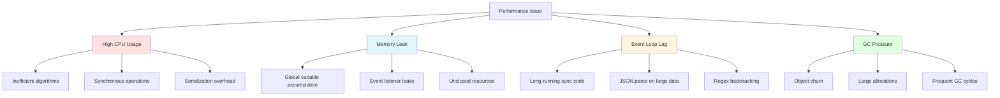
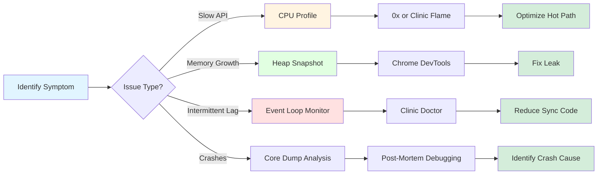
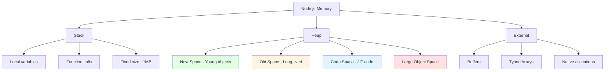
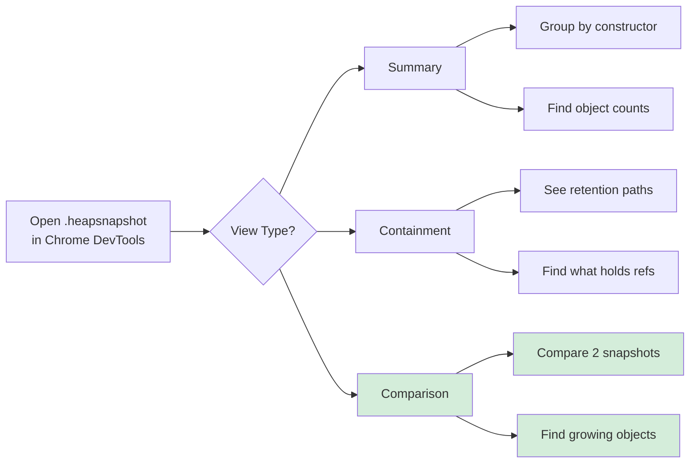
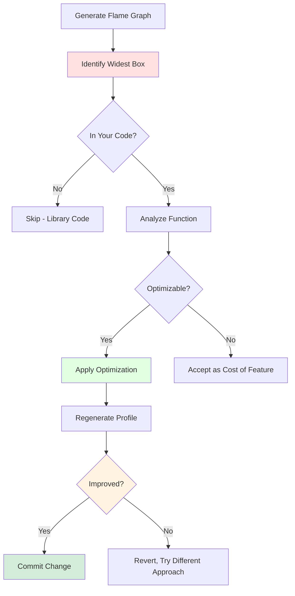
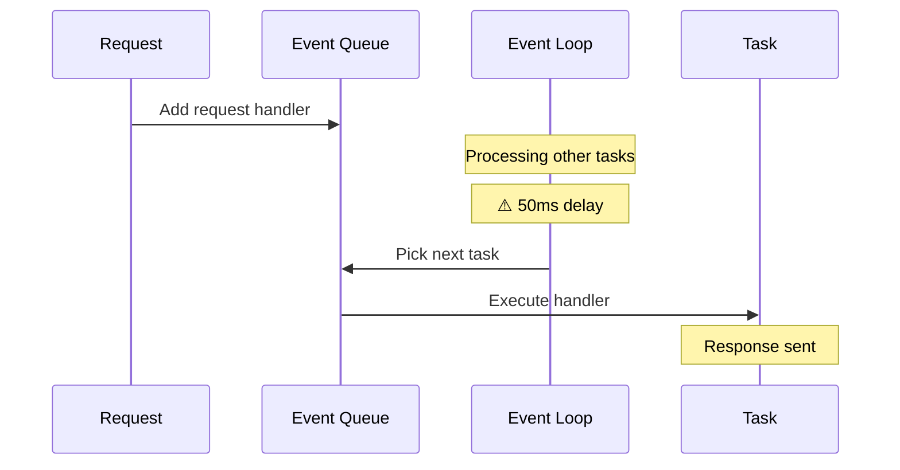
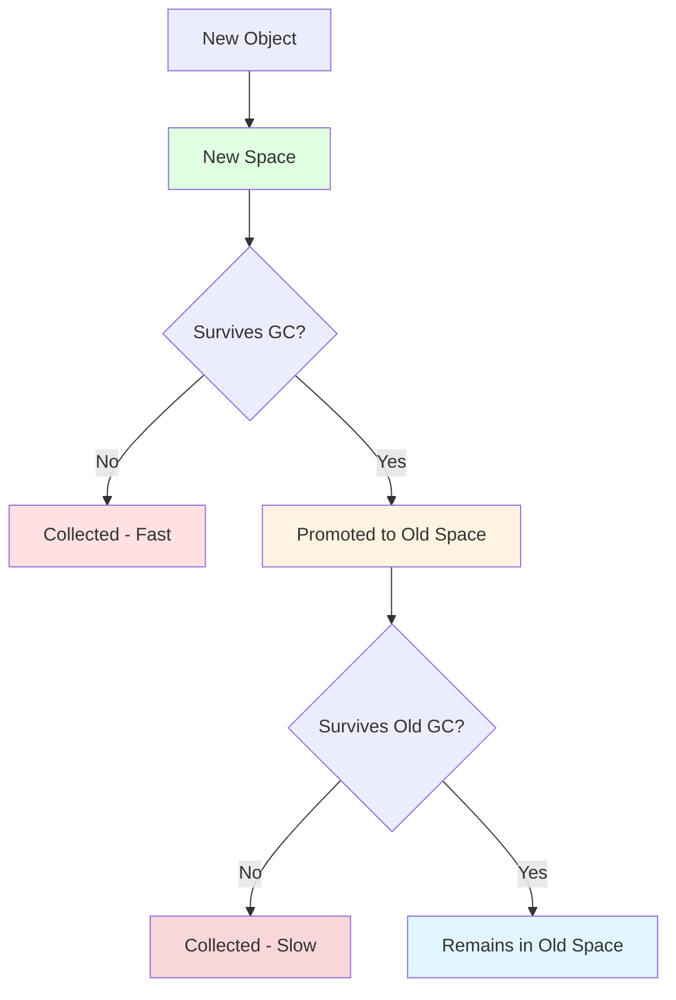

# Playbook: Profiling CPU and Memory in Node.js

> [!summary] **Why This Playbook Exists**
> Performance issues cost money: slow APIs increase bounce rates, memory leaks cause crashes, and CPU bottlenecks limit scalability. This playbook teaches you to use Clinic.js, 0x, Chrome DevTools, and heap snapshots to find and fix performance issues. Senior engineers profile before optimizing—this is how.

---

## Table of Contents

1. [Performance Profiling Fundamentals](#1-performance-profiling-fundamentals)
2. [CPU Profiling with Flame Graphs](#2-cpu-profiling-with-flame-graphs)
3. [Memory Profiling with Heap Snapshots](#3-memory-profiling-with-heap-snapshots)
4. [Clinic.js Suite Deep Dive](#4-clinic-js-suite-deep-dive)
5. [0x Flame Graph Analysis](#5-0x-flame-graph-analysis)
6. [Chrome DevTools for Node.js](#6-chrome-devtools-for-node-js)
7. [Event Loop Delay Monitoring](#7-event-loop-delay-monitoring)
8. [Real-World Case Studies](#8-real-world-case-studies)
9. [Interview Q&A](#9-interview-q-a)

---

## 1. Performance Profiling Fundamentals

### 1.1 The Four Horsemen of Performance Issues



### 1.2 Key Metrics to Monitor

| Metric | Healthy Range | Warning | Critical | Measurement Tool |
|--------|---------------|---------|----------|------------------|
| **CPU Usage** | <50% | 50-80% | >80% | `top`, Clinic Doctor |
| **Memory (RSS)** | Stable | Gradual growth | Exponential growth | `process.memoryUsage()` |
| **Event Loop Lag** | <10ms | 10-100ms | >100ms | `event-loop-lag` |
| **GC Duration** | <5ms | 5-50ms | >50ms | `--trace-gc` |
| **Heap Used** | <50% of limit | 50-80% | >80% | Chrome DevTools |
| **Handle Count** | Stable | Growing | >10,000 | Clinic Bubbleprof |

### 1.3 Profiling Strategy



### 1.4 The Profiling Mindset

> [!warning] **Golden Rule**
> **Profile first, optimize second.** Never guess where performance issues are. Data beats intuition every time.

```javascript
// ❌ BAD: Optimizing without data
function optimize() {
  // Spent 3 days optimizing this function
  // Turns out it was only 0.1% of total time
}

// ✅ GOOD: Profile-driven optimization
// 1. Run profiler
// 2. Find hottest function (80% of time)
// 3. Optimize that function
// 4. Verify improvement with another profile
```

---

## 2. CPU Profiling with Flame Graphs

### 2.1 What Are Flame Graphs?

Flame graphs visualize CPU consumption as a stacked bar chart where:
- **Width** = Time spent (wider = more CPU)
- **Height** = Call stack depth
- **Color** = Module/function type (not importance)

```mermaid
flowchart TB
    subgraph "Flame Graph Anatomy"
        A[main (100%)] --> B[HTTP Server (60%)]
        A --> C[Database (30%)]
        A --> D[Other (10%)]
        
        B --> E[Router (25%)]
        B --> F[Controllers (35%)]
        
        F --> G[Serialization (20%)]
        F --> H[Business Logic (15%)]
        
        C --> I[Queries (25%)]
        C --> J[Connection Pool (5%)]
    end
    
    style A fill:#e1f5ff
    style G fill:#ffe1e1
    style I fill:#fff4e1
```

### 2.2 Generating Flame Graphs with 0x

```bash
# Install 0x globally
npm install -g 0x

# Profile your application
npx 0x app.js

# Or with arguments
npx 0x --output-dir './profile' app.js --port 3000

# Profile for specific duration
npx 0x -d 30 app.js  # 30 seconds
```

### 2.3 Reading Flame Graphs

```
                         main.js (100% - 5000ms total)
        ┌─────────────────────────────────────────────────────────┐
        │                                                         │
        │  http.createServer (60% - 3000ms)                       │
        │  ┌─────────────────────────────────────────┐           │
        │  │                                         │           │
        │  │  router.handle (45% - 2250ms)          │           │
        │  │  ┌─────────────────────────────┐       │           │
        │  │  │                             │       │           │
        │  │  │  controller.getUser (30%)  │       │           │
        │  │  │  ┌─────────────────┐       │       │           │
        │  │  │  │                 │       │       │           │
        │  │  │  │  JSON.stringify │       │       │           │
        │  │  │  │  (15% - 750ms)◄─┼───────┘       │           │
        │  │  │  │  HOT SPOT!     │               │           │
        │  │  │  └─────────────────┘               │           │
        │  │  └─────────────────────────────┘       │           │
        │  └─────────────────────────────────────────┘           │
        └─────────────────────────────────────────────────────────┘
```

**Key Insights:**
- **Wide boxes** = CPU intensive (optimize these!)
- **Tall stacks** = Deep call chains (consider flattening)
- **JSON.stringify at 15%** = Serialization bottleneck

### 2.4 Complete 0x Workflow

```bash
# Step 1: Generate profile
npx 0x app.js

# Step 2: Open in browser (auto-opens)
# Or view offline:
open 0x-data/profile.html

# Step 3: Analyze
# - Look for widest boxes (most CPU)
# - Click boxes to see source
# - Compare before/after profiles
```

### 2.5 Programmatic CPU Profiling

```javascript
import v8 from 'v8';
import { writeFileSync } from 'fs';
import { Session } from 'inspector';

class CPUProfiler {
  constructor() {
    this.session = new Session();
  }
  
  async start() {
    this.session.connect();
    return new Promise((resolve) => {
      this.session.post('Profiler.enable', () => {
        this.session.post('Profiler.start', resolve);
      });
    });
  }
  
  async stop(outputPath) {
    return new Promise((resolve) => {
      this.session.post('Profiler.stop', (err, { profile }) => {
        writeFileSync(outputPath, JSON.stringify(profile));
        this.session.disconnect();
        resolve(profile);
      });
    });
  }
}

// Usage
const profiler = new CPUProfiler();
await profiler.start();

// ... run your workload ...

await profiler.stop('./cpu-profile.json');
console.log('Profile saved. Open in Chrome DevTools.');
```

---

## 3. Memory Profiling with Heap Snapshots

### 3.1 Understanding Node.js Memory



### 3.2 Taking Heap Snapshots

```javascript
// Method 1: Programmatically
import v8 from 'v8';
import { writeFileSync } from 'fs';

function takeHeapSnapshot(filename = 'snapshot.heapsnapshot') {
  const snapshot = v8.getHeapSnapshot();
  writeFileSync(filename, snapshot);
  console.log(`Snapshot saved to ${filename}`);
}

// Take snapshot at specific points
takeHeapSnapshot('before-request.heapsnapshot');
await handleRequest();
takeHeapSnapshot('after-request.heapsnapshot');

// Method 2: Via Chrome DevTools
// 1. node --inspect app.js
// 2. Open chrome://inspect
// 3. Memory tab → Take Heap Snapshot
```

### 3.3 Analyzing Heap Snapshots



### 3.4 Memory Leak Patterns

#### Pattern 1: Global Variable Accumulation

```javascript
// ❌ LEAK: Global array grows forever
const requestLog = [];

app.use((req, res, next) => {
  requestLog.push({
    url: req.url,
    time: Date.now(),
    headers: req.headers  // Large objects retained!
  });
  next();
});

// ✅ FIX: Use bounded collection
const requestLog = [];
const MAX_LOG_SIZE = 1000;

app.use((req, res, next) => {
  if (requestLog.length >= MAX_LOG_SIZE) {
    requestLog.shift();  // Remove oldest
  }
  requestLog.push({
    url: req.url,
    time: Date.now()
  });
  next();
});
```

#### Pattern 2: Event Listener Leak

```javascript
// ❌ LEAK: New listener on every request
function setupHandler(db) {
  db.on('data', async (data) => {
    await process(data);
  });
}

// Called per request = N listeners!
app.get('/subscribe', (req, res) => {
  setupHandler(database);
  res.send('OK');
});

// ✅ FIX: Single listener or cleanup
const dbHandler = async (data) => {
  await process(data);
};

database.on('data', dbHandler);  // Once at startup

// Or cleanup
app.get('/subscribe', (req, res) => {
  const handler = (data) => {
    process(data);
    database.off('data', handler);  // Remove after use
  };
  database.on('data', handler);
  res.send('OK');
});
```

#### Pattern 3: Closure Memory Leak

```javascript
// ❌ LEAK: Closure holds large data
function createProcessor() {
  const cache = new Map();  // Grows forever
  
  return async (key) => {
    if (!cache.has(key)) {
      const data = await loadLargeData(key);  // 10MB each
      cache.set(key, data);
    }
    return cache.get(key);
  };
}

const processor = createProcessor();
// cache never cleared even if data not accessed

// ✅ FIX: Add TTL or LRU eviction
import { LRUCache } from 'lru-cache';

function createProcessor() {
  const cache = new LRUCache({
    max: 100,        // Max 100 items
    maxSize: 500_000_000,  // Max 500MB
    ttl: 60_000      // 1 minute TTL
  });
  
  return async (key) => {
    if (!cache.has(key)) {
      const data = await loadLargeData(key);
      cache.set(key, data);
    }
    return cache.get(key);
  };
}
```

#### Pattern 4: Timer/Interval Leak

```javascript
// ❌ LEAK: Interval never cleared
const intervals = [];

function startTracking(userId) {
  const intervalId = setInterval(() => {
    trackUser(userId);
  }, 1000);
  intervals.push(intervalId);  // Grows forever
}

// ✅ FIX: Track and cleanup
const intervals = new Map();

function startTracking(userId) {
  const intervalId = setInterval(() => {
    trackUser(userId);
  }, 1000);
  intervals.set(userId, intervalId);
}

function stopTracking(userId) {
  const intervalId = intervals.get(userId);
  if (intervalId) {
    clearInterval(intervalId);
    intervals.delete(userId);
  }
}
```

### 3.5 Memory Comparison Workflow

```javascript
// Automated memory leak detection
import v8 from 'v8';
import { writeFileSync } from 'fs';

async function detectLeak(workload, iterations = 10) {
  const snapshots = [];
  
  for (let i = 0; i < iterations; i++) {
    // Force GC (if available)
    global.gc?.();
    
    await new Promise(resolve => setTimeout(resolve, 100));
    
    const snapshot = v8.getHeapSnapshot();
    const filename = `snapshot-${i}.heapsnapshot`;
    writeFileSync(filename, snapshot);
    
    const usage = process.memoryUsage();
    snapshots.push({
      heapUsed: usage.heapUsed,
      heapTotal: usage.heapTotal,
      rss: usage.rss
    });
    
    console.log(`Iteration ${i}: ${Math.round(usage.heapUsed / 1024 / 1024)}MB`);
    
    // Run workload
    await workload();
  }
  
  // Analyze trend
  const firstThree = snapshots.slice(0, 3).reduce((a, b) => a + b.heapUsed, 0) / 3;
  const lastThree = snapshots.slice(-3).reduce((a, b) => a + b.heapUsed, 0) / 3;
  const growth = (lastThree - firstThree) / firstThree;
  
  if (growth > 0.1) {
    console.warn(`⚠️ Memory leak detected: ${Math.round(growth * 100)}% growth`);
  } else {
    console.log('✅ Memory stable');
  }
  
  return snapshots;
}

// Usage
await detectLeak(async () => {
  await handleTestRequest();
});
```

---

## 4. Clinic.js Suite Deep Dive

### 4.1 Clinic.js Overview

Clinic.js is a comprehensive profiling toolkit by Nearform:

| Tool | Purpose | Output | Best For |
|------|---------|--------|----------|
| **Doctor** | Performance analysis | HTML report | General profiling |
| **Flame** | CPU flame graphs | Interactive SVG | Finding hot paths |
| **Bubbleprof** | Async bottleneck | Bubble diagram | Async performance |
| **Heapprofiler** | Memory profiling | Heap analysis | Memory leaks |

```bash
# Install Clinic.js
npm install -g @clinicjs/clinic

# Or install individual tools
npm install -g @clinicjs/clinic-doctor
npm install -g @clinicjs/clinic-flame
npm install -g @clinicjs/clinic-bubbleprof
npm install -g @clinicjs/clinic-heapprofiler
```

### 4.2 Clinic Doctor

```bash
# Run Doctor (analyzes CPU, memory, event loop)
clinic doctor -- node app.js

# Simulate load in another terminal
autocannon -c 10 -d 30 http://localhost:3000

# Doctor generates HTML report
# Opens automatically with:
# - Event loop delay graph
# - CPU usage over time
# - Memory usage over time
# - Recommendations
```

**Doctor Output Analysis:**

```
┌──────────────────────────────────────────────────┐
│             Clinic Doctor Report                 │
├──────────────────────────────────────────────────┤
│ Event Loop Delay: 45ms (⚠️ Warning)             │
│ CPU Usage: 78% (⚠️ High)                        │
│ Memory: Stable at 256MB (✅ OK)                 │
├──────────────────────────────────────────────────┤
│ Recommendations:                                 │
│ 1. Reduce synchronous operations in main thread │
│ 2. Consider worker threads for CPU-bound tasks  │
│ 3. Add caching for expensive computations       │
└──────────────────────────────────────────────────┘
```

### 4.3 Clinic Flame

```bash
# Generate flame graph with Clinic
clinic flame -- node app.js

# Run load test
autocannon -c 20 -d 30 http://localhost:3000/api/users

# Output: clinic-12345-flame.html
# Opens interactive flame graph
```

**Flame Graph Interpretation:**

```
Wide boxes = CPU intensive (optimize these)
Tall thin boxes = Call stack depth
Colors = Module type (not importance)

Key areas to investigate:
1. Widest box in your code (not node_modules)
2. Unexpected wide boxes (serialization, parsing)
3. Deep call stacks (consider inlining)
```

### 4.4 Clinic Bubbleprof

```bash
# Profile async operations
clinic bubbleprof -- node app.js

# Run load test
autocannon -c 10 -d 30 http://localhost:3000

# Output shows async bottlenecks as bubbles
# Larger bubble = more async operations
```

**Bubbleprof Output:**

```
┌─────────────────────────────────────────┐
│          Async Operation Map            │
├─────────────────────────────────────────┤
│  ● fs.readFile (large)                 │
│  ● db.query (medium)                   │
│  ● fetch (small)                       │
│  ○ setTimeout (tiny)                   │
├─────────────────────────────────────────┤
│ ● = Your code  ○ = Node.js internals   │
└─────────────────────────────────────────┘
```

### 4.5 Clinic Heapprofiler

```bash
# Profile memory usage
clinic heapprofiler -- node app.js

# Run workload
autocannon -c 10 -d 60 http://localhost:3000

# Output: clinic-12345-heapprofiler.heapsnapshot
# Open in Chrome DevTools Memory tab
```

---

## 5. 0x Flame Graph Analysis

### 5.1 Advanced 0x Usage

```bash
# Profile with custom options
npx 0x \
  --output-dir './profiles' \
  --title 'API Load Test' \
  --duration 30 \
  --port 3000 \
  app.js

# Profile specific function
node -e "
  require('0x').default({
    outputDir: './func-profile',
    onPort: async (port) => {
      const res = await fetch(\`http://localhost:\${port}/heavy\`);
      await res.json();
    }
  });
"

# Compare two profiles
npx 0x --compare profile1.json profile2.json
```

### 5.2 Reading 0x Output

```
0x Data Directory Structure:
├── profile-12345/
│   ├── flamegraph.html      # Interactive flame graph
│   ├── profile.json         # Raw profile data
│   ├── meta.json            # Metadata
│   └── frames.json          # Stack frames
```

### 5.3 Flame Graph Optimization Workflow



---

## 6. Chrome DevTools for Node.js

### 6.1 Connecting to Node.js

```bash
# Start Node with inspector
node --inspect app.js
# Debugger listening on ws://127.0.0.1:9229/...

# Break on start (for debugging startup)
node --inspect-brk app.js

# Specific port
node --inspect=9230 app.js
```

### 6.2 Chrome DevTools Workflow

1. **Connect:** Open `chrome://inspect` → Click "inspect"
2. **Memory Tab:**
   - Take Heap Snapshot
   - Record Allocation Timeline
   - Record Heap Profile
3. **Performance Tab:**
   - Record during workload
   - Analyze CPU pie chart
   - Check Bottom-Up for hot functions
4. **Sources Tab:**
   - Set breakpoints
   - Step through async code
   - Watch variables

### 6.3 Memory Tab Deep Dive

```
Heap Snapshot Analysis:

1. Summary View
   - Group by constructor
   - Sort by "Distance" (retention)
   - Look for unexpected object counts

2. Containment View
   - See what holds references
   - Find retention paths
   - Identify leak sources

3. Comparison View
   - Select two snapshots
   - See added/removed objects
   - Find growing collections
```

### 6.4 Performance Tab Analysis

```
Performance Recording Analysis:

1. CPU Pie Chart
   - Large "JavaScript" slice = CPU-bound
   - Large "System" slice = I/O-bound
   - Large "Other" = Native operations

2. Bottom-Up View
   - Shows functions by total time
   - Self time = time in function only
   - Total time = including children

3. Event Log
   - See async operation timing
   - Identify gaps (waiting)
   - Find long tasks
```

---

## 7. Event Loop Delay Monitoring

### 7.1 Understanding Event Loop Lag



### 7.2 Measuring Event Loop Lag

```javascript
// Method 1: Using event-loop-lag package
import { monitorEventLoopDelay } from 'event-loop-lag';

const lagMonitor = monitorEventLoopDelay({ resolution: 10 });
lagMonitor.enable();

// Check lag
setInterval(() => {
  const lag = lagMonitor.read();
  console.log(`Event loop lag: ${lag.max}ms`);
  
  if (lag.max > 100) {
    console.warn('⚠️ High event loop lag detected!');
  }
}, 1000);

// Method 2: Manual measurement
function measureEventLoopLag() {
  const start = performance.now();
  setImmediate(() => {
    const lag = performance.now() - start;
    console.log(`Lag: ${lag.toFixed(2)}ms`);
  });
}

// Method 3: Using diagnostics_channel (Node 15+)
import diagnosticsChannel from 'diagnostics_channel';

diagnosticsChannel.channel('eventloop.utilization').subscribe(
  ({ utilization }) => {
    console.log(`Event loop utilization: ${(utilization * 100).toFixed(2)}%`);
  }
);
```

### 7.3 Common Causes of Event Loop Lag

| Cause | Impact | Solution |
|-------|--------|----------|
| **JSON.parse on large data** | 100-500ms | Stream parsing, worker threads |
| **Synchronous file I/O** | 10-100ms | Use async fs methods |
| **Complex regex** | 50-200ms | Simplify regex, use libraries |
| **Array.sort on large arrays** | 100-500ms | Chunk sorting, web workers |
| **Serialization (JSON.stringify)** | 50-200ms | Stream serialization |
| **Synchronous crypto** | 100-500ms | Use async crypto methods |

### 7.4 Fixing Event Loop Lag

```javascript
// ❌ BAD: Synchronous blocking code
app.get('/report', (req, res) => {
  const data = fs.readFileSync('large-file.json', 'utf8'); // Blocks!
  const parsed = JSON.parse(data);  // Blocks!
  const result = heavyComputation(parsed);  // Blocks!
  res.json(result);
});

// ✅ GOOD: Non-blocking with chunking
app.get('/report', async (req, res) => {
  // Use async file reading
  const data = await fs.promises.readFile('large-file.json', 'utf8');
  
  // Chunk heavy computation
  const parsed = JSON.parse(data);
  const result = await chunkedComputation(parsed, 100);
  
  res.json(result);
});

async function chunkedComputation(data, chunkSize) {
  return new Promise((resolve) => {
    const results = [];
    let index = 0;
    
    function processChunk() {
      const end = Math.min(index + chunkSize, data.length);
      
      for (let i = index; i < end; i++) {
        results.push(compute(data[i]));
      }
      
      index = end;
      
      if (index >= data.length) {
        resolve(results);
      } else {
        setImmediate(processChunk);  // Yield to event loop
      }
    }
    
    processChunk();
  });
}
```

---

## 8. Real-World Case Studies

### Case Study 1: API Latency Spike at Scale

**Problem:** API response times increased from 50ms to 500ms under load.

**Investigation:**
```bash
# Run Clinic Doctor
clinic doctor -- node app.js

# Load test
autocannon -c 50 -d 60 http://localhost:3000/api/data
```

**Findings:**
- Event loop lag: 200ms average
- CPU: 95% utilization
- Flame graph showed JSON.stringify at 40% of CPU

**Root Cause:**
```javascript
// Serializing 10MB response synchronously
app.get('/export', async (req, res) => {
  const data = await db.findAll();  // 50,000 records
  res.json(data);  // JSON.stringify blocks for 200ms
});
```

**Fix:**
```javascript
// Stream response in chunks
import { pipeline } from 'stream/promises';
import { createReadStream } from 'fs';

app.get('/export', async (req, res) => {
  res.setHeader('Content-Type', 'application/json');
  
  const stream = db.streamQuery('SELECT * FROM users');
  
  // Stream with chunked serialization
  let first = true;
  res.write('[');
  
  for await (const row of stream) {
    if (!first) res.write(',');
    res.write(JSON.stringify(row));
    first = false;
  }
  
  res.write(']');
  res.end();
});
```

**Result:** Response time reduced to 50ms, memory usage down 60%.

### Case Study 2: Memory Leak in Production

**Problem:** Process crashes every 24 hours with OOM.

**Investigation:**
```bash
# Take heap snapshots every hour
node --inspect app.js

# Compare snapshots in Chrome DevTools
# Found: 10,000+ EventEmitters retained
```

**Root Cause:**
```javascript
// New EventEmitter created per request, never cleaned up
class RequestHandler {
  constructor() {
    this.emitter = new EventEmitter();
    this.setupListeners();
  }
  
  setupListeners() {
    database.on('change', (data) => {
      this.emitter.emit('update', data);
    });
  }
}

// Called on every request = leak!
app.get('/realtime', (req, res) => {
  const handler = new RequestHandler();
  // handler.emitter listeners accumulate
});
```

**Fix:**
```javascript
// Singleton pattern with cleanup
class RequestHandler {
  private static emitter = new EventEmitter();
  
  static setupOnce() {
    database.on('change', (data) => {
      this.emitter.emit('update', data);
    });
  }
  
  subscribe(callback) {
    RequestHandler.emitter.on('update', callback);
    return () => {
      RequestHandler.emitter.off('update', callback);
    };
  }
}

// Setup once at startup
RequestHandler.setupOnce();

app.get('/realtime', (req, res) => {
  const handler = new RequestHandler();
  const unsubscribe = handler.subscribe((data) => {
    res.json(data);
  });
  
  req.on('close', unsubscribe);  // Cleanup on disconnect
});
```

**Result:** Stable memory usage for 30+ days.

### Case Study 3: CPU Bottleneck in Serialization

**Problem:** CPU at 100% during peak traffic.

**Investigation:**
```bash
npx 0x app.js
# Flame graph showed serializer.toJSON at 60% CPU
```

**Root Cause:**
```javascript
// Inefficient custom serializer
toJSON() {
  return {
    id: this.id,
    name: this.name,
    // ... 50 more properties
    computed: this.expensiveComputation(),  // Called on every serialize!
    nested: this.children.map(c => c.toJSON())  // Recursive!
  };
}
```

**Fix:**
```javascript
// Lazy serialization with caching
class User {
  private serializedCache = null;
  
  toJSON() {
    if (this.serializedCache) {
      return this.serializedCache;
    }
    
    this.serializedCache = {
      id: this.id,
      name: this.name,
      // Pre-computed properties only
    };
    
    return this.serializedCache;
  }
  
  invalidateCache() {
    this.serializedCache = null;
  }
}

// Or use a serialization library
import { serialize } from 'fast-json-stringify';
const stringify = serialize(schema);  // 5-10x faster than JSON.stringify
```

**Result:** CPU usage dropped to 40%, handled 2.5x more traffic.

---

## 9. Interview Q&A

### Q1: How do you profile a Node.js application in production?

**A:** Safe production profiling approach:

1. **Use sampling profilers** (low overhead):
   ```bash
   # 0x with sampling
   npx 0x --sampling app.js
   
   # Clinic Doctor
   clinic doctor -- node app.js
   ```

2. **Enable async hooks carefully:**
   ```javascript
   // Low-overhead monitoring
   const { PerformanceObserver } = require('perf_hooks');
   ```

3. **Use APM tools:**
   - Datadog APM
   - New Relic
   - Dynatrace

4. **Sample selectively:**
   ```javascript
   // Profile only 1% of requests
   if (Math.random() < 0.01) {
     startProfiling();
   }
   ```

> [!warning] **Production Safety**
> Never use `--inspect` in production without authentication. Use sampling profilers with <5% overhead.

### Q2: What's the difference between RSS, heapUsed, and heapTotal?

**A:**
| Metric | Description | What It Includes |
|--------|-------------|------------------|
| **RSS** | Resident Set Size | Total memory allocated (heap + stack + native) |
| **heapUsed** | Used heap | Actual JavaScript objects in use |
| **heapTotal** | Total heap | Allocated heap space (used + free) |
| **external** | External memory | Buffers, typed arrays, native allocations |

```javascript
const mem = process.memoryUsage();
console.log(`
  RSS: ${Math.round(mem.rss / 1024 / 1024)}MB (total process memory)
  Heap Used: ${Math.round(mem.heapUsed / 1024 / 1024)}MB (JS objects)
  Heap Total: ${Math.round(mem.heapTotal / 1024 / 1024)}MB (allocated heap)
  External: ${Math.round(mem.external / 1024 / 1024)}MB (buffers, etc.)
`);
```

### Q3: How do you identify a memory leak vs normal memory usage?

**A:** Key differences:

| Characteristic | Memory Leak | Normal Usage |
|---------------|-------------|--------------|
| **Growth Pattern** | Continuous, unbounded | Stabilizes after warmup |
| **GC Impact** | Not collected | Collected regularly |
| **Time Scale** | Hours/days | Minutes |
| **Load Correlation** | Grows regardless of load | Correlates with active work |

**Detection method:**
```javascript
async function monitorMemory() {
  const readings = [];
  
  for (let i = 0; i < 60; i++) {
    global.gc?.();  // Force GC if available
    readings.push(process.memoryUsage().heapUsed);
    await new Promise(r => setTimeout(r, 60000));  // Wait 1 minute
  }
  
  // Analyze trend
  const first = readings.slice(0, 5).reduce((a, b) => a + b, 0) / 5;
  const last = readings.slice(-5).reduce((a, b) => a + b, 0) / 5;
  const growth = (last - first) / first;
  
  if (growth > 0.2) {
    console.warn(`⚠️ Possible leak: ${Math.round(growth * 100)}% growth`);
  }
}
```

### Q4: What causes high event loop lag and how do you fix it?

**A:** Common causes and fixes:

| Cause | Detection | Fix |
|-------|-----------|-----|
| **Synchronous I/O** | Flame graph shows fs.readFileSync | Use async fs methods |
| **JSON.parse large data** | Profile shows parsing spike | Stream parsing, worker threads |
| **Complex regex** | Regex in flame graph | Simplify pattern, use libraries |
| **Heavy computation** | CPU-bound function | Worker threads, chunking |
| **Serialization** | JSON.stringify wide box | Stream serialization |

```javascript
// Fix: Move CPU-bound work to worker thread
import { Worker } from 'worker_threads';

function runWorker(data) {
  return new Promise((resolve, reject) => {
    const worker = new Worker('./heavy-task.js', { workerData: data });
    worker.on('message', resolve);
    worker.on('error', reject);
  });
}
```

### Q5: Explain the Node.js garbage collection process.

**A:** V8 uses generational GC:



**Key points:**
- **New Space (Young Generation):** Small, frequent GC (minor GC)
- **Old Space:** Large, infrequent GC (major GC)
- **Mark-and-Sweep:** Identify reachable objects
- **Mark-and-Compact:** Defragment memory

### Q6: How do you optimize JSON.stringify for large objects?

**A:** Multiple strategies:

```javascript
// 1. Stream serialization
import { createGzip } from 'zlib';

app.get('/large', async (req, res) => {
  const stream = db.streamQuery('SELECT * FROM huge_table');
  res.write('[');
  let first = true;
  
  for await (const row of stream) {
    if (!first) res.write(',');
    res.write(JSON.stringify(row));
    first = false;
  }
  
  res.write(']');
  res.end();
});

// 2. Use fast-json-stringify (5-10x faster)
import build from 'fast-json-stringify';
const stringify = build({
  type: 'object',
  properties: {
    id: { type: 'number' },
    name: { type: 'string' }
  }
});

// 3. Selective serialization
const limited = Object.fromEntries(
  Object.entries(largeObj).slice(0, 100)
);
JSON.stringify(limited);
```

### Q7: What tools would you use to debug a production performance issue?

**A:** Escalating approach:

1. **Metrics first:** Check APM dashboards (Datadog, New Relic)
2. **Low-overhead profiling:**
   ```bash
   clinic doctor -- node app.js  # ~5% overhead
   ```
3. **Sampling profiler:**
   ```bash
   npx 0x --sampling app.js  # ~10% overhead
   ```
4. **Heap snapshot (if memory issue):**
   ```javascript
   v8.writeHeapSnapshot('/tmp/snapshot.heapsnapshot');
   ```
5. **Async hooks (if async issue):**
   ```javascript
   const { AsyncLocalStorage } = require('async_hooks');
   ```

### Q8: When should you use worker threads vs clustering?

**A:** Decision matrix:

| Scenario | Use Worker Threads | Use Clustering |
|----------|-------------------|----------------|
| **CPU-bound task** | ✅ Yes | ⚠️ Partial |
| **Memory isolation** | ❌ No (shared) | ✅ Yes (separate) |
| **Multiple cores** | ⚠️ Single process | ✅ Multiple processes |
| **Crash isolation** | ❌ No | ✅ Yes |
| **Shared memory** | ✅ Yes (SharedArrayBuffer) | ❌ No |

```javascript
// Worker Thread: CPU-bound in same process
import { Worker } from 'worker_threads';
const worker = new Worker('./cpu-task.js');

// Cluster: Multiple processes for load balancing
import cluster from 'cluster';
import { availableParallelism } from 'os';

if (cluster.isPrimary) {
  for (let i = 0; i < availableParallelism(); i++) {
    cluster.fork();
  }
} else {
  // Worker process - run server
}
```

---

## 10. Quick Reference

### 10.1 Profiling Commands

```bash
# CPU Profiling
npx 0x app.js
clinic flame -- node app.js
node --inspect app.js  # Chrome DevTools

# Memory Profiling
clinic heapprofiler -- node app.js
node --inspect app.js  # Chrome DevTools Memory tab

# Event Loop Monitoring
clinic doctor -- node app.js
node --trace-event app.js

# GC Tracing
node --trace-gc app.js
node --trace-gc-ignore-id app.js
```

### 10.2 Performance Checklist

> [!checklist] **Pre-Production Performance Review**
> - [ ] CPU profile shows no single function >30%
> - [ ] Memory stable over 1-hour load test
> - [ ] Event loop lag <50ms under load
> - [ ] No unhandled promise rejections
> - [ ] GC pauses <10ms average
> - [ ] Response times meet SLA at peak load
> - [ ] Memory leaks tested with heap snapshots
> - [ ] Error rates <1% under load

---

> [!tip] **Pro Tip**
> Profile in production-like environments. Development machines often have different CPU/memory characteristics that mask performance issues. Use containerized environments that match production specs.

---

**Related Files:**
- [[01_Debug_Async_Issues_and_Unhandled_Rejections]] - Async debugging techniques
- [[03_Node_Event_Loop_and_Libuv_Basics]] - Event loop fundamentals
- [[04_V8_Basics_Hidden_Classes_and_ICs]] - V8 optimization insights
