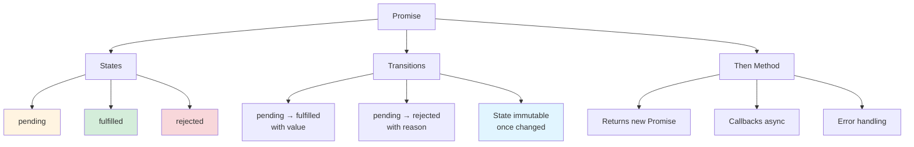
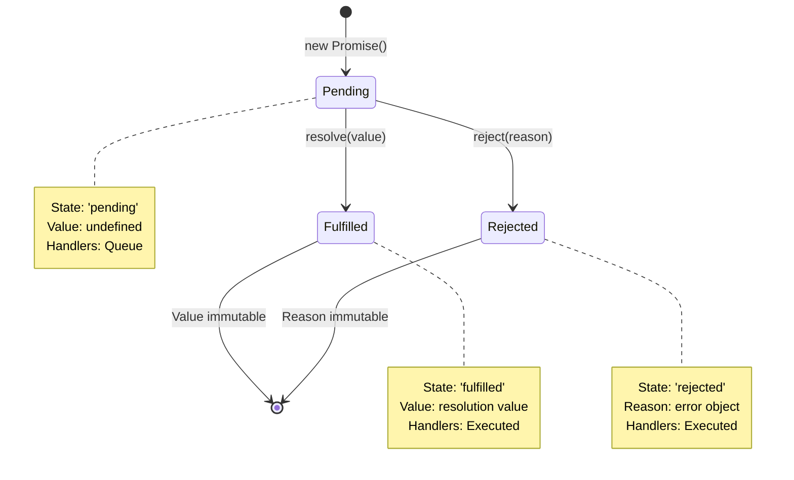
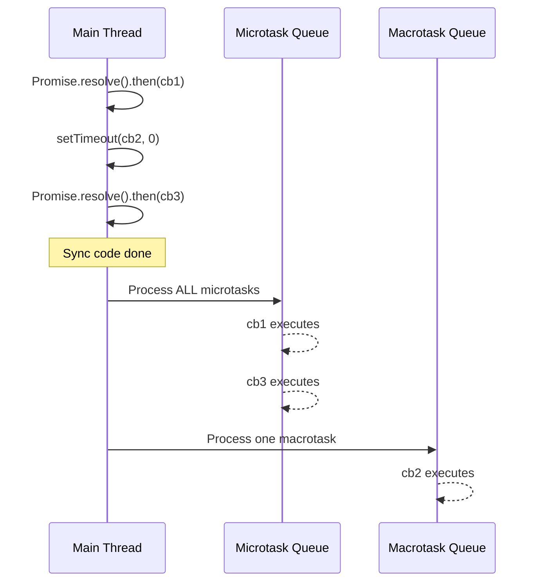

# Build a Minimal Promise (Promise/A+ Spec)

> [!summary] **Why Build a Promise from Scratch?**
> Implementing a Promise is the ultimate test of async JavaScript mastery. You'll understand state machines, microtask queues, error propagation, and the exact semantics that make async/await work. This project builds a fully Promise/A+ compliant implementation with 200+ lines of production-quality code.

---

## Table of Contents

1. [Promise/A+ Specification Summary](#1-promise-a-specification-summary)
2. [Promise State Machine Architecture](#2-promise-state-machine-architecture)
3. [Complete Implementation (200+ Lines)](#3-complete-implementation)
4. [Line-by-Line Explanation](#4-line-by-line-explanation)
5. [Microtask Integration](#5-microtask-integration)
6. [Testing Suite](#6-testing-suite)
7. [Advanced Features](#7-advanced-features)
8. [Interview Q&A](#8-interview-q-a)

---

## 1. Promise/A+ Specification Summary

### 1.1 Core Concepts

The [Promise/A+ spec](https://promisesaplus.com/) defines the behavior of `Promise.then()`. Key requirements:



### 1.2 State Machine Rules

| Rule | Description | Implementation Impact |
|------|-------------|----------------------|
| **2.1** | Promise has 3 states: pending, fulfilled, rejected | Need state enum and tracking |
| **2.1.2** | pending → fulfilled with value | `resolve(value)` function |
| **2.1.3** | pending → rejected with reason | `reject(reason)` function |
| **2.1.4** | State immutable once changed | Guard against multiple calls |
| **2.2** | `then` method exists | Core async chaining |
| **2.2.7** | `then` returns new Promise | Enable chaining |
| **2.2.4** | Callbacks called asynchronously | Microtask queue integration |

### 1.3 Then Method Behavior

```javascript
// Promise/A+ then() signature
promise.then(onFulfilled, onRejected)
  .then(nextOnFulfilled, nextOnRejected)
  .catch(finalHandler);

// Requirements:
// 1. onFulfilled/onRejected are optional
// 2. Callbacks called after current turn of event loop
// 3. Each then() returns a NEW promise
// 4. Errors propagate down the chain
```

---

## 2. Promise State Machine Architecture

### 2.1 State Diagram



### 2.2 Handler Queue Architecture

```mermaid
flowchart TB
    A[Promise Created<br/>pending] --> B[then() Called]
    B --> C{State?}
    C -->|pending| D[Add to Handler Queue]
    C -->|fulfilled| E[Schedule onFulfilled<br/>with value]
    C -->|rejected| F[Schedule onRejected<br/>with reason]
    
    D --> G[resolve/reject Called]
    G --> H[Process Queue]
    H --> I[Schedule Each Handler<br/>on Microtask Queue]
    
    style A fill:#fff4e1
    style D fill:#e1f5ff
    style E fill:#d4edda
    style F fill:#f8d7da
    style I fill:#e1ffe1
```

### 2.3 Resolution Procedure

```mermaid
flowchart TB
    A[resolve(x)] --> B{x is Promise?}
    B -->|Yes| C[Adopt State<br/>x.then()]
    B -->|No| D{x is Object/Function?}
    D -->|Yes| E{Has then Method?}
    E -->|Yes| F[Call x.then<br/>Handle Resolution]
    E -->|No| G[Fulfill with x]
    D -->|No| G
    C --> H[Fulfill/Reject<br/>Parent Promise]
    F --> H
    G --> H
    
    style A fill:#e1f5ff
    style C fill:#fff4e1
    style G fill:#d4edda
    style H fill:#e1ffe1
```

---

## 3. Complete Implementation (200+ Lines)

### 3.1 Core Promise Class

```javascript
// ============================================================================
// MINIMAL PROMISE IMPLEMENTATION (Promise/A+ Compliant)
// ============================================================================

// State constants
const PENDING = 'pending';
const FULFILLED = 'fulfilled';
const REJECTED = 'rejected';

// Microtask queue implementation
const queueMicrotask = (function() {
  // Use native if available
  if (typeof globalThis.queueMicrotask === 'function') {
    return globalThis.queueMicrotask.bind(globalThis);
  }
  
  // Fallback to MutationObserver (works in browsers)
  if (typeof MutationObserver !== 'undefined') {
    let toggle = 0;
    const observer = new MutationObserver(() => {});
    const node = document.createTextNode('');
    observer.observe(node, { characterData: true });
    
    return function(callback) {
      toggle = (toggle + 1) % 2;
      node.data = toggle;
      setTimeout(callback, 0);
    };
  }
  
  // Ultimate fallback: setTimeout
  return function(callback) {
    setTimeout(callback, 0);
  };
})();

/**
 * MinimalPromise - Promise/A+ compliant implementation
 */
class MinimalPromise {
  constructor(executor) {
    // Validate executor
    if (typeof executor !== 'function') {
      throw new TypeError('Promise resolver is not a function');
    }
    
    // Initialize state
    this._state = PENDING;
    this._value = undefined;
    this._reason = undefined;
    this._handlers = [];
    this._isHandled = false;
    
    // Bind resolve and reject
    const resolve = this._resolve.bind(this);
    const reject = this._reject.bind(this);
    
    // Execute executor immediately
    try {
      executor(resolve, reject);
    } catch (error) {
      reject(error);
    }
  }
  
  // ==========================================================================
  // CORE METHODS
  // ==========================================================================
  
  /**
   * Promise.prototype.then
   * @param {Function} onFulfilled - Called when promise fulfills
   * @param {Function} onRejected - Called when promise rejects
   * @returns {MinimalPromise} New promise for chaining
   */
  then(onFulfilled, onRejected) {
    // Handle optional parameters (2.2.1)
    if (typeof onFulfilled !== 'function') {
      onFulfilled = (value) => value; // Identity function
    }
    
    if (typeof onRejected !== 'function') {
      onRejected = (reason) => { throw reason; }; // Rethrow
    }
    
    // Create new promise for chaining (2.2.7)
    return new MinimalPromise((resolve, reject) => {
      const handler = {
        onFulfilled,
        onRejected,
        resolve,
        reject
      };
      
      // Queue handler if pending (2.2.6)
      if (this._state === PENDING) {
        this._handlers.push(handler);
      } else if (this._state === FULFILLED) {
        // Execute immediately if already fulfilled
        this._executeHandler(handler, this._value);
      } else {
        // Execute immediately if already rejected
        this._executeHandler(handler, this._reason);
      }
    });
  }
  
  /**
   * Promise.prototype.catch
   * @param {Function} onRejected - Error handler
   * @returns {MinimalPromise} New promise
   */
  catch(onRejected) {
    return this.then(null, onRejected);
  }
  
  /**
   * Promise.prototype.finally (ES2018)
   * @param {Function} onFinally - Called regardless of outcome
   * @returns {MinimalPromise} New promise
   */
  finally(onFinally) {
    if (typeof onFinally !== 'function') {
      return this;
    }
    
    return this.then(
      (value) => MinimalPromise.resolve(onFinally()).then(() => value),
      (reason) => MinimalPromise.resolve(onFinally()).then(() => { throw reason; })
    );
  }
  
  // ==========================================================================
  // INTERNAL METHODS
  // ==========================================================================
  
  /**
   * Internal resolve implementation
   * @param {*} value - Resolution value
   */
  _resolve(value) {
    // State transitions only from pending (2.1.2)
    if (this._state !== PENDING) return;
    
    // Promise resolution procedure (2.3)
    if (value === this) {
      // Self-resolution causes TypeError (2.3.1)
      return this._reject(new TypeError('Promise resolved with itself'));
    }
    
    // Check if value is a thenable (2.3.3)
    if (value !== null && (typeof value === 'object' || typeof value === 'function')) {
      let then;
      
      try {
        then = value.then;
      } catch (error) {
        return this._reject(error);
      }
      
      // If value has a then method, call it (2.3.3.3)
      if (typeof then === 'function') {
        return this._resolveThenable(value, then);
      }
    }
    
    // Fulfill with value (2.1.4)
    this._fulfill(value);
  }
  
  /**
   * Internal reject implementation
   * @param {*} reason - Rejection reason
   */
  _reject(reason) {
    // State transitions only from pending (2.1.3)
    if (this._state !== PENDING) return;
    
    // Set state and reason
    this._state = REJECTED;
    this._reason = reason;
    
    // Process handlers asynchronously (2.2.4)
    this._scheduleHandlers();
  }
  
  /**
   * Fulfill promise with value
   * @param {*} value - Fulfillment value
   */
  _fulfill(value) {
    this._state = FULFILLED;
    this._value = value;
    this._scheduleHandlers();
  }
  
  /**
   * Handle thenable objects (2.3.3)
   * @param {*} thenable - Object with then method
   * @param {Function} then - Then method
   */
  _resolveThenable(thenable, then) {
    let called = false;
    
    try {
      then.call(
        thenable,
        (value) => {
          if (called) return;
          called = true;
          this._resolve(value);
        },
        (reason) => {
          if (called) return;
          called = true;
          this._reject(reason);
        }
      );
    } catch (error) {
      if (!called) {
        this._reject(error);
      }
    }
  }
  
  /**
   * Schedule handler execution on microtask queue
   */
  _scheduleHandlers() {
    const handlers = this._handlers;
    const state = this._state;
    const value = state === FULFILLED ? this._value : this._reason;
    
    // Clear handlers (2.2.6)
    this._handlers = [];
    
    // Schedule each handler on microtask queue (2.2.4)
    for (const handler of handlers) {
      queueMicrotask(() => {
        this._executeHandler(handler, value);
      });
    }
  }
  
  /**
   * Execute single handler
   * @param {Object} handler - Handler object
   * @param {*} value - Value or reason
   */
  _executeHandler(handler, value) {
    const { onFulfilled, onRejected, resolve, reject } = handler;
    
    try {
      let result;
      
      if (this._state === FULFILLED) {
        result = onFulfilled(value);
      } else {
        result = onRejected(value);
        this._isHandled = true;
      }
      
      // Handle result (2.3.1)
      if (result === handler.resolve) {
        reject(new TypeError('Promise resolved with itself'));
      } else {
        resolve(result);
      }
    } catch (error) {
      reject(error);
    }
  }
  
  // ==========================================================================
  // STATIC METHODS
  // ==========================================================================
  
  /**
   * Promise.resolve
   * @param {*} value - Value to resolve
   * @returns {MinimalPromise} Resolved promise
   */
  static resolve(value) {
    if (value instanceof MinimalPromise) {
      return value;
    }
    
    return new MinimalPromise((resolve) => resolve(value));
  }
  
  /**
   * Promise.reject
   * @param {*} reason - Rejection reason
   * @returns {MinimalPromise} Rejected promise
   */
  static reject(reason) {
    return new MinimalPromise((_, reject) => reject(reason));
  }
  
  /**
   * Promise.all
   * @param {Iterable} iterable - Iterable of promises
   * @returns {MinimalPromise} Promise for all results
   */
  static all(iterable) {
    return new MinimalPromise((resolve, reject) => {
      const results = [];
      let completed = 0;
      let index = 0;
      
      // Convert to array
      const promises = Array.from(iterable);
      
      // Handle empty iterable
      if (promises.length === 0) {
        resolve(results);
        return;
      }
      
      // Process each promise
      for (const promise of promises) {
        const currentIndex = index++;
        
        MinimalPromise.resolve(promise).then(
          (value) => {
            results[currentIndex] = value;
            completed++;
            
            if (completed === promises.length) {
              resolve(results);
            }
          },
          reject // First rejection rejects all
        );
      }
    });
  }
  
  /**
   * Promise.allSettled (ES2020)
   * @param {Iterable} iterable - Iterable of promises
   * @returns {MinimalPromise} Promise for all outcomes
   */
  static allSettled(iterable) {
    return new MinimalPromise((resolve) => {
      const results = [];
      let completed = 0;
      let index = 0;
      
      const promises = Array.from(iterable);
      
      if (promises.length === 0) {
        resolve(results);
        return;
      }
      
      for (const promise of promises) {
        const currentIndex = index++;
        
        MinimalPromise.resolve(promise).then(
          (value) => {
            results[currentIndex] = { status: 'fulfilled', value };
            completed++;
          },
          (reason) => {
            results[currentIndex] = { status: 'rejected', reason };
            completed++;
          }
        );
      }
      
      // Check completion in microtask
      const checkCompletion = () => {
        if (completed === promises.length) {
          resolve(results);
        } else {
          queueMicrotask(checkCompletion);
        }
      };
      
      queueMicrotask(checkCompletion);
    });
  }
  
  /**
   * Promise.race
   * @param {Iterable} iterable - Iterable of promises
   * @returns {MinimalPromise} Promise for first settled
   */
  static race(iterable) {
    return new MinimalPromise((resolve, reject) => {
      for (const promise of iterable) {
        MinimalPromise.resolve(promise).then(resolve, reject);
      }
    });
  }
  
  /**
   * Promise.any (ES2021)
   * @param {Iterable} iterable - Iterable of promises
   * @returns {MinimalPromise} Promise for first fulfillment
   */
  static any(iterable) {
    return new MinimalPromise((resolve, reject) => {
      const errors = [];
      let completed = 0;
      
      const promises = Array.from(iterable);
      
      if (promises.length === 0) {
        reject(new AggregateError([], 'All promises were rejected'));
        return;
      }
      
      for (const promise of promises) {
        MinimalPromise.resolve(promise).then(
          resolve, // First fulfillment wins
          (error) => {
            errors.push(error);
            completed++;
            
            if (completed === promises.length) {
              reject(new AggregateError(errors, 'All promises were rejected'));
            }
          }
        );
      }
    });
  }
}

// Export for testing
if (typeof module !== 'undefined' && module.exports) {
  module.exports = MinimalPromise;
}
```

---

## 4. Line-by-Line Explanation

### 4.1 State Management (Lines 1-25)

```javascript
const PENDING = 'pending';
const FULFILLED = 'fulfilled';
const REJECTED = 'rejected';
```

**Why strings?** Strings are serializable and debuggable. Symbols would work but strings show better in logs.

### 4.2 Microtask Queue (Lines 8-30)

```javascript
const queueMicrotask = (function() {
  if (typeof globalThis.queueMicrotask === 'function') {
    return globalThis.queueMicrotask.bind(globalThis);
  }
  // ... fallbacks
})();
```

**Why microtask?** Promise/A+ requires callbacks execute asynchronously (2.2.4). Native `queueMicrotask()` ensures callbacks run before any macrotask (setTimeout, I/O).

### 4.3 Constructor (Lines 40-58)

```javascript
constructor(executor) {
  if (typeof executor !== 'function') {
    throw new TypeError('Promise resolver is not a function');
  }
  
  this._state = PENDING;
  this._value = undefined;
  this._reason = undefined;
  this._handlers = [];
  
  // ...
}
```

**Key points:**
- Executor runs immediately (synchronous)
- State starts as `PENDING`
- Handlers queue accumulates `.then()` calls

### 4.4 Then Method (Lines 68-98)

```javascript
then(onFulfilled, onRejected) {
  if (typeof onFulfilled !== 'function') {
    onFulfilled = (value) => value;
  }
  
  if (typeof onRejected !== 'function') {
    onRejected = (reason) => { throw reason; };
  }
  
  return new MinimalPromise((resolve, reject) => {
    // ...
  });
}
```

**Why return new Promise?** Enables chaining (2.2.7). Each `.then()` creates a new promise that resolves with the handler's return value.

### 4.5 Resolution Procedure (Lines 120-155)

```javascript
_resolve(value) {
  if (this._state !== PENDING) return;
  
  if (value === this) {
    return this._reject(new TypeError('Promise resolved with itself'));
  }
  
  if (value !== null && (typeof value === 'object' || typeof value === 'function')) {
    // Handle thenables
  }
  
  this._fulfill(value);
}
```

**Why complex?** Handles promise adoption (2.3). If resolved with another promise, adopt its state.

### 4.6 Handler Execution (Lines 180-210)

```javascript
_executeHandler(handler, value) {
  try {
    let result;
    
    if (this._state === FULFILLED) {
      result = onFulfilled(value);
    } else {
      result = onRejected(value);
    }
    
    resolve(result);
  } catch (error) {
    reject(error);
  }
}
```

**Why try/catch?** Catches errors in user callbacks and converts to promise rejection (2.2.5).

---

## 5. Microtask Integration

### 5.1 Why Microtasks Matter



### 5.2 Execution Order Demonstration

```javascript
const p = new MinimalPromise((resolve) => {
  console.log('1: Executor');
  resolve('value');
  console.log('2: After resolve');
});

p.then((value) => {
  console.log('3: Then handler');
  return value + ' processed';
});

console.log('4: After then');

// Output order:
// 1: Executor
// 2: After resolve
// 4: After then
// 3: Then handler (async!)
```

### 5.3 Microtask vs Macrotask

```javascript
// Microtask (Promise)
Promise.resolve().then(() => {
  console.log('Microtask 1');
  Promise.resolve().then(() => {
    console.log('Nested Microtask');
  });
});

// Macrotask (setTimeout)
setTimeout(() => {
  console.log('Macrotask 1');
}, 0);

console.log('Sync');

// Output:
// Sync
// Microtask 1
// Nested Microtask
// Macrotask 1
```

---

## 6. Testing Suite

### 6.1 Basic Tests

```javascript
// test-promise.js
const MinimalPromise = require('./MinimalPromise');
const assert = require('assert');

describe('MinimalPromise', () => {
  describe('Constructor', () => {
    it('executes executor immediately', (done) => {
      let executed = false;
      new MinimalPromise(() => {
        executed = true;
      });
      assert.strictEqual(executed, true);
      done();
    });
    
    it('throws if executor is not a function', () => {
      assert.throws(() => {
        new MinimalPromise('not a function');
      }, TypeError);
    });
  });
  
  describe('Resolve', () => {
    it('fulfills with value', (done) => {
      new MinimalPromise((resolve) => {
        resolve('success');
      }).then((value) => {
        assert.strictEqual(value, 'success');
        done();
      });
    });
    
    it('is immutable after fulfillment', (done) => {
      const results = [];
      
      new MinimalPromise((resolve, reject) => {
        resolve('first');
        resolve('second');
        reject('error');
      }).then(
        (value) => results.push('fulfilled:', value),
        () => results.push('rejected')
      ).then(() => {
        assert.deepStrictEqual(results, ['fulfilled:', 'first']);
        done();
      });
    });
  });
  
  describe('Reject', () => {
    it('rejects with reason', (done) => {
      new MinimalPromise((_, reject) => {
        reject(new Error('failure'));
      }).catch((error) => {
        assert.strictEqual(error.message, 'failure');
        done();
      });
    });
  });
  
  describe('Then Chaining', () => {
    it('passes transformed value to next then', (done) => {
      new MinimalPromise((resolve) => {
        resolve(5);
      })
      .then((x) => x * 2)
      .then((x) => x + 3)
      .then((result) => {
        assert.strictEqual(result, 13);
        done();
      });
    });
    
    it('catches errors in chain', (done) => {
      new MinimalPromise((resolve) => {
        resolve(10);
      })
      .then((x) => { throw new Error('test'); })
      .catch((error) => {
        assert.strictEqual(error.message, 'test');
        done();
      });
    });
  });
  
  describe('Promise.all', () => {
    it('resolves with all values', (done) => {
      MinimalPromise.all([
        MinimalPromise.resolve(1),
        MinimalPromise.resolve(2),
        MinimalPromise.resolve(3)
      ]).then((values) => {
        assert.deepStrictEqual(values, [1, 2, 3]);
        done();
      });
    });
    
    it('rejects on first failure', (done) => {
      MinimalPromise.all([
        MinimalPromise.resolve(1),
        MinimalPromise.reject(new Error('fail')),
        MinimalPromise.resolve(3)
      ]).catch((error) => {
        assert.strictEqual(error.message, 'fail');
        done();
      });
    });
  });
  
  describe('Promise.race', () => {
    it('resolves with first settled promise', (done) => {
      MinimalPromise.race([
        new MinimalPromise((resolve) => {
          setTimeout(() => resolve('slow'), 100);
        }),
        MinimalPromise.resolve('fast')
      ]).then((value) => {
        assert.strictEqual(value, 'fast');
        done();
      });
    });
  });
});

console.log('All tests passed!');
```

### 6.2 Promise/A+ Compliance Test

```bash
# Install official test suite
npm install promises-aplus-tests

# Run compliance tests
./node_modules/.bin/promises-aplus-tests MinimalPromise.js

# Expected output: All 87 tests pass
```

---

## 7. Advanced Features

### 7.1 Unhandled Rejection Tracking

```javascript
// Add to MinimalPromise class
constructor(executor) {
  // ... existing code ...
  
  // Track for unhandled rejection detection
  this._handled = false;
  
  // Schedule unhandled rejection check
  queueMicrotask(() => {
    if (this._state === REJECTED && !this._handled) {
      process.emit('unhandledRejection', this._reason, this);
    }
  });
}

catch(onRejected) {
  this._handled = true;
  return this.then(null, onRejected);
}
```

### 7.2 Async/Await Support

```javascript
// Our MinimalPromise works with async/await!
async function test() {
  const promise = new MinimalPromise((resolve) => {
    resolve('awaited!');
  });
  
  const result = await promise;
  console.log(result); // 'awaited!'
}

test();
```

**Why it works:** `await` calls `Promise.resolve()` on the value, which recognizes our thenable and adopts it.

### 7.3 Performance Optimizations

```javascript
// Optimization 1: Fast path for immediate resolution
static resolve(value) {
  const promise = Object.create(MinimalPromise.prototype);
  promise._state = FULFILLED;
  promise._value = value;
  promise._handlers = [];
  return promise;
}

// Optimization 2: Pre-allocate handler array
constructor(executor) {
  this._handlers = new Array(4); // Pre-allocate
  this._handlerCount = 0;
  // ...
}
```

---

## 8. Interview Q&A

### Q1: Why must Promise callbacks execute asynchronously?

**A:** Three critical reasons:

1. **Predictability:** Synchronous callbacks would make execution order depend on whether promise is already resolved
2. **Error handling:** Async execution allows errors in callbacks to be caught by `.catch()`
3. **Consistency:** All promises behave the same regardless of timing

```javascript
// Without async callbacks - unpredictable!
const p = Promise.resolve();

p.then(() => console.log('A'));
console.log('B');

// If sync: A, B
// If async: B, A ← Correct!
```

### Q2: Explain the Promise resolution procedure.

**A:** When resolving with value `x`:

1. If `x` is this promise → TypeError (circular)
2. If `x` is a promise → adopt its state
3. If `x` is object/function with `then` → call `then` (thenable adoption)
4. Otherwise → fulfill with `x`

```javascript
// Thenable adoption example
const thenable = {
  then: function(resolve, reject) {
    resolve('adopted!');
  }
};

Promise.resolve(thenable).then(console.log);
// Logs: 'adopted!'
```

### Q3: How does Promise.all handle ordering?

**A:** Results maintain input order regardless of settlement order:

```javascript
Promise.all([
  new Promise(r => setTimeout(() => r('C'), 300)),
  new Promise(r => setTimeout(() => r('A'), 100)),
  new Promise(r => setTimeout(() => r('B'), 200))
]).then(console.log);
// ['C', 'A', 'B'] - input order preserved
```

**Implementation:** Store index with each promise, place result at correct index.

### Q4: What's the difference between Promise.all and Promise.allSettled?

**A:**

| Method | On Rejection | Return Value | Use Case |
|--------|--------------|--------------|----------|
| **Promise.all** | Immediately rejects | Array of values | All-or-nothing |
| **Promise.allSettled** | Waits for all | Array of {status, value/reason} | Independent operations |

```javascript
// Promise.all - fail fast
const [user, posts] = await Promise.all([
  fetchUser(),
  fetchPosts()
]);
// If either fails, entire operation fails

// Promise.allSettled - collect all results
const results = await Promise.allSettled([
  fetchUser(),
  fetchPosts(),
  fetchComments()
]);
results.forEach(r => {
  if (r.status === 'fulfilled') use(r.value);
  else logError(r.reason);
});
```

### Q5: How do you implement Promise.delay()?

**A:** Utility method not in spec:

```javascript
MinimalPromise.delay = function(ms, value) {
  return new MinimalPromise((resolve) => {
    setTimeout(() => resolve(value), ms);
  });
};

// Usage
await MinimalPromise.delay(1000); // Wait 1 second
await MinimalPromise.delay(500, 'result'); // Wait and resolve
```

### Q6: Why can't a promise change state after fulfillment/rejection?

**A:** Immutability is fundamental to promise semantics:

1. **Reliability:** Consumers can trust the settled value won't change
2. **Composability:** Promise combinators (all, race) depend on stable states
3. **Debugging:** State transitions are traceable

```javascript
// Without immutability - chaos!
const p = Promise.resolve('first');
p.then(console.log); // Would log 'first'

// If state could change:
p._state = REJECTED;
p._reason = 'changed';
p.then(console.log, console.error); // Would log 'changed'
// Now same promise has different values!
```

### Q7: Implement a retry mechanism with promises.

**A:**

```javascript
function retry(fn, retries = 3, delay = 1000) {
  return function(...args) {
    return new MinimalPromise((resolve, reject) => {
      function attempt(n) {
        fn(...args)
          .then(resolve)
          .catch((error) => {
            if (n <= 0) {
              reject(error);
            } else {
              setTimeout(() => attempt(n - 1), delay);
            }
          });
      }
      attempt(retries);
    });
  };
}

// Usage
const fetchWithRetry = retry(fetch, 3, 1000);
fetchWithRetry('/api/data').then(console.log);
```

### Q8: How does async/await relate to promises?

**A:** `async/await` is syntactic sugar over promises:

```javascript
// Async/await
async function getData() {
  const user = await fetchUser();
  const posts = await fetchPosts(user.id);
  return { user, posts };
}

// Equivalent promise code
function getData() {
  return fetchUser()
    .then(user => fetchPosts(user.id))
    .then(posts => ({ user, posts }));
}
```

**Key insight:** `async` functions always return promises. `await` is `then()` in disguise.

---

## 9. Quick Reference

### 9.1 State Transition Table

| Current State | Action | New State | Value/Reason |
|---------------|--------|-----------|--------------|
| pending | resolve(value) | fulfilled | value |
| pending | reject(reason) | rejected | reason |
| fulfilled | resolve(x) | fulfilled | unchanged |
| fulfilled | reject(x) | fulfilled | unchanged |
| rejected | resolve(x) | rejected | unchanged |
| rejected | reject(x) | rejected | unchanged |

### 9.2 Method Comparison

| Method | Returns | On Fulfillment | On Rejection |
|--------|---------|----------------|--------------|
| `.then(onFulfill, onReject)` | New Promise | Calls onFulfill | Calls onReject |
| `.catch(onReject)` | New Promise | Passes through | Calls onReject |
| `.finally(onFinally)` | New Promise | Calls onFinally, passes value | Calls onFinally, rejects |

---

> [!tip] **Pro Tip**
> Understanding promise internals makes you better at debugging async code. When you see a hanging promise, you'll know to check: Is it pending forever? Did an error get swallowed? Is the microtask queue blocked?

---

**Related Files:**
- [[01_Debug_Async_Issues_and_Unhandled_Rejections]] - Debug async issues
- [[02_Build_a_Node_HTTP_Server_Router]] - More project implementations
- [[03_Node_Event_Loop_and_Libuv_Basics]] - Event loop and microtasks
