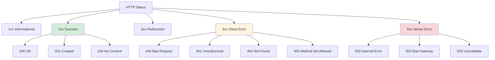
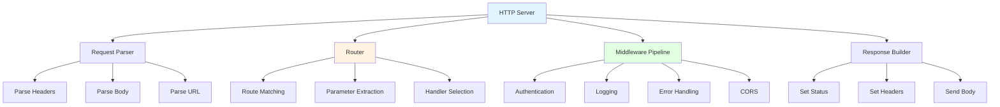
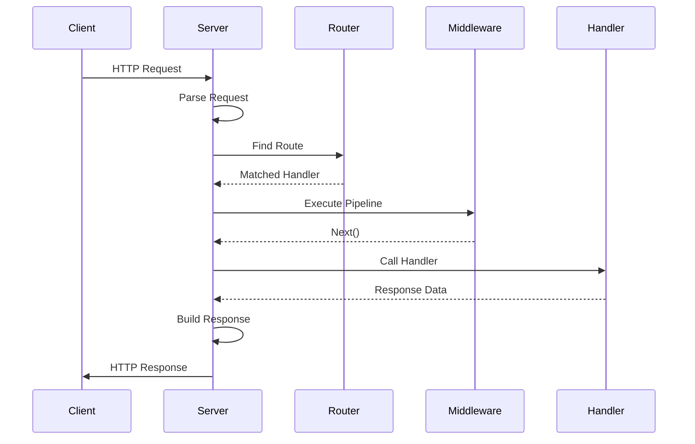

# Build a Node.js HTTP Server & Router

> [!summary] **Why Build an HTTP Server from Scratch?**
> Understanding HTTP internals separates junior from senior engineers. This project builds a complete HTTP server with routing, middleware, request parsing, and RESTful APIs using only Node.js native modules. You'll understand how Express, Koa, and Fastify work under the hood.

---

## Table of Contents

1. [HTTP Protocol Fundamentals](#1-http-protocol-fundamentals)
2. [Server Architecture Overview](#2-server-architecture-overview)
3. [Complete Implementation (300+ Lines)](#3-complete-implementation)
4. [Router Implementation Details](#4-router-implementation-details)
5. [Middleware Pattern Deep Dive](#5-middleware-pattern-deep-dive)
6. [Request/Response Parsing](#6-request-response-parsing)
7. [RESTful API Example](#7-restful-api-example)
8. [Testing and Benchmarking](#8-testing-and-benchmarking)
9. [Interview Q&A](#9-interview-q-a)

---

## 1. HTTP Protocol Fundamentals

### 1.1 HTTP Request Structure

```
POST /api/users HTTP/1.1
Host: localhost:3000
Content-Type: application/json
Content-Length: 45
Authorization: Bearer token123

{"name": "Alice", "email": "alice@example.com"}

├─ Request Line: POST /api/users HTTP/1.1
├─ Headers: Key-value pairs
├─ Empty Line: Separates headers from body
└─ Body: Request payload
```

### 1.2 HTTP Response Structure

```
HTTP/1.1 201 Created
Content-Type: application/json
Content-Length: 67
Set-Cookie: sessionId=abc123

{"id": 1, "name": "Alice", "email": "alice@example.com"}

├─ Status Line: HTTP/1.1 201 Created
├─ Headers: Response metadata
├─ Empty Line: Separator
└─ Body: Response payload
```

### 1.3 HTTP Methods and Semantics

| Method | Purpose | Idempotent | Safe | Body |
|--------|---------|------------|------|------|
| **GET** | Retrieve resource | ✅ Yes | ✅ Yes | No |
| **POST** | Create resource | ❌ No | ❌ No | Yes |
| **PUT** | Replace resource | ✅ Yes | ❌ No | Yes |
| **PATCH** | Update resource | ❌ No | ❌ No | Yes |
| **DELETE** | Remove resource | ✅ Yes | ❌ No | No |
| **HEAD** | Get headers only | ✅ Yes | ✅ Yes | No |
| **OPTIONS** | Get allowed methods | ✅ Yes | ✅ Yes | No |

### 1.4 HTTP Status Codes



---

## 2. Server Architecture Overview

### 2.1 Component Diagram



### 2.2 Request Flow



### 2.3 Middleware Execution Model

```
Request → Middleware 1 → Middleware 2 → Handler → Response
              ↓              ↓
         Before logic   Before logic
              ↓              ↓
         After logic    After logic
              ↑              ↑
           next() call    next() call
```

---

## 3. Complete Implementation (300+ Lines)

### 3.1 Core HTTP Server

```javascript
// ============================================================================
// MINI EXPRESS - Complete HTTP Server from Scratch
// ============================================================================

const http = require('http');
const url = require('url');
const { EventEmitter } = require('events');

// ============================================================================
// REQUEST CLASS - Wraps native Node.js request
// ============================================================================

class Request {
  constructor(req) {
    // Core properties
    this.method = req.method;
    this.url = req.url;
    this.headers = req.headers;
    this.raw = req;
    
    // Parsed URL components
    const parsed = url.parse(req.url, true);
    this.pathname = parsed.pathname;
    this.query = parsed.query;
    this.search = parsed.search;
    
    // Body parsing (populated by body-parser middleware)
    this.body = null;
    this.params = {}; // Route parameters
    
    // Request metadata
    this.timestamp = Date.now();
    this.ip = req.socket.remoteAddress;
  }
  
  // Check if request expects JSON
  acceptsJSON() {
    const accept = this.headers.accept || '*/*';
    return accept.includes('application/json');
  }
  
  // Get header value (case-insensitive)
  getHeader(name) {
    const lower = name.toLowerCase();
    return this.headers[lower];
  }
  
  // Check content type
  is(contentType) {
    const actual = this.getHeader('content-type') || '';
    return actual.includes(contentType);
  }
}

// ============================================================================
// RESPONSE CLASS - Wraps native Node.js response
// ============================================================================

class Response {
  constructor(res) {
    this.raw = res;
    this.statusCode = 200;
    this.headers = {
      'Content-Type': 'application/json'
    };
    this.body = null;
    this.sent = false;
  }
  
  // Set status code
  status(code) {
    this.statusCode = code;
    return this; // Chainable
  }
  
  // Set header
  setHeader(name, value) {
    this.headers[name.toLowerCase()] = value;
    return this;
  }
  
  // Set multiple headers
  setHeaders(headers) {
    Object.assign(this.headers, headers);
    return this;
  }
  
  // Send JSON response
  json(data) {
    this.setHeader('Content-Type', 'application/json');
    this.body = JSON.stringify(data);
    return this.end();
  }
  
  // Send HTML response
  send(html) {
    if (typeof html === 'object') {
      return this.json(html);
    }
    this.setHeader('Content-Type', 'text/html');
    this.body = html;
    return this.end();
  }
  
  // Send empty response
  end() {
    if (this.sent) return this;
    
    // Write status and headers
    this.raw.writeHead(this.statusCode, this.headers);
    
    // Write body if present
    if (this.body) {
      this.raw.write(this.body);
    }
    
    // End response
    this.raw.end();
    this.sent = true;
    
    return this;
  }
  
  // Redirect to another URL
  redirect(url, status = 302) {
    this.setHeader('Location', url);
    this.status(status);
    return this.end();
  }
  
  // Send error response
  error(code, message) {
    this.status(code);
    return this.json({
      error: {
        code,
        message: message || this.getStatusMessage(code)
      }
    });
  }
  
  // Get status message
  getStatusMessage(code) {
    const messages = {
      200: 'OK',
      201: 'Created',
      204: 'No Content',
      400: 'Bad Request',
      401: 'Unauthorized',
      403: 'Forbidden',
      404: 'Not Found',
      405: 'Method Not Allowed',
      500: 'Internal Server Error'
    };
    return messages[code] || 'Unknown';
  }
}

// ============================================================================
// ROUTER CLASS - Handles route matching and registration
// ============================================================================

class Router {
  constructor() {
    this.routes = {
      GET: [],
      POST: [],
      PUT: [],
      PATCH: [],
      DELETE: [],
      HEAD: [],
      OPTIONS: []
    };
    this.middleware = [];
  }
  
  // Register route handler
  register(method, path, handler) {
    // Convert path to regex, extract parameter names
    const { regex, params } = this.pathToRegex(path);
    
    this.routes[method].push({
      path,
      regex,
      params,
      handler
    });
    
    return this; // Chainable
  }
  
  // Convert Express-style path to regex
  // /users/:id/posts/:postId → /^\/users\/([^/]+)\/posts\/([^/]+)$/
  pathToRegex(path) {
    const paramNames = [];
    const regex = new RegExp(
      '^' + 
      path.replace(/:(\w+)/g, (_, name) => {
        paramNames.push(name);
        return '([^/]+)';
      }) + 
      '/?$'
    );
    
    return { regex, params: paramNames };
  }
  
  // Find matching route
  find(method, pathname) {
    const routes = this.routes[method] || [];
    
    for (const route of routes) {
      const match = route.regex.exec(pathname);
      
      if (match) {
        // Extract parameters from match groups
        const params = {};
        route.params.forEach((name, index) => {
          params[name] = decodeURIComponent(match[index + 1]);
        });
        
        return {
          handler: route.handler,
          params
        };
      }
    }
    
    return null;
  }
  
  // HTTP method shortcuts
  get(path, handler) { return this.register('GET', path, handler); }
  post(path, handler) { return this.register('POST', path, handler); }
  put(path, handler) { return this.register('PUT', path, handler); }
  patch(path, handler) { return this.register('PATCH', path, handler); }
  delete(path, handler) { return this.register('DELETE', path, handler); }
  
  // Register global middleware
  use(middleware) {
    this.middleware.push(middleware);
    return this;
  }
}

// ============================================================================
// MIDDLEWARE FACTORY - Common middleware implementations
// ============================================================================

const middleware = {
  // Logger middleware
  logger: () => {
    return (req, res, next) => {
      const start = Date.now();
      
      // Override res.end to log after response
      const originalEnd = res.end.bind(res);
      res.end = function(...args) {
        const duration = Date.now() - start;
        console.log(
          `[${new Date().toISOString()}] ${req.method} ${req.url} ` +
          `${res.statusCode} ${duration}ms`
        );
        return originalEnd(...args);
      };
      
      next();
    };
  },
  
  // JSON body parser
  jsonParser: () => {
    return async (req, res, next) => {
      // Only parse JSON
      if (!req.is('application/json')) {
        return next();
      }
      
      let body = '';
      
      // Collect chunks
      req.raw.on('data', (chunk) => {
        body += chunk.toString();
      });
      
      // Parse when complete
      return new Promise((resolve, reject) => {
        req.raw.on('end', () => {
          try {
            req.body = body ? JSON.parse(body) : {};
            next();
            resolve();
          } catch (error) {
            res.status(400).json({ error: 'Invalid JSON' });
            reject(error);
          }
        });
        
        req.raw.on('error', reject);
      });
    };
  },
  
  // CORS middleware
  cors: (options = {}) => {
    const {
      origin = '*',
      methods = ['GET', 'POST', 'PUT', 'DELETE', 'OPTIONS'],
      headers = ['Content-Type', 'Authorization']
    } = options;
    
    return (req, res, next) => {
      res.setHeader('Access-Control-Allow-Origin', origin);
      res.setHeader('Access-Control-Allow-Methods', methods.join(', '));
      res.setHeader('Access-Control-Allow-Headers', headers.join(', '));
      
      // Handle preflight
      if (req.method === 'OPTIONS') {
        return res.status(204).end();
      }
      
      next();
    };
  },
  
  // Authentication middleware
  auth: (validateFn) => {
    return async (req, res, next) => {
      const authHeader = req.getHeader('authorization');
      
      if (!authHeader) {
        return res.status(401).json({ error: 'Missing authorization header' });
      }
      
      try {
        const user = await validateFn(authHeader);
        req.user = user;
        next();
      } catch (error) {
        res.status(401).json({ error: 'Invalid credentials' });
      }
    };
  },
  
  // Error handler middleware
  errorHandler: () => {
    return (err, req, res, next) => {
      console.error('Error:', err);
      
      const status = err.status || err.statusCode || 500;
      const message = err.message || 'Internal Server Error';
      
      res.status(status).json({
        error: {
          status,
          message,
          ...(process.env.NODE_ENV === 'development' && { stack: err.stack })
        }
      });
    };
  }
};

// ============================================================================
// APPLICATION CLASS - Main server orchestrator
// ============================================================================

class Application extends EventEmitter {
  constructor() {
    super();
    this.router = new Router();
    this.server = null;
    this.errorHandlers = [];
  }
  
  // HTTP method shortcuts (delegates to router)
  get(path, handler) { this.router.get(path, handler); return this; }
  post(path, handler) { this.router.post(path, handler); return this; }
  put(path, handler) { this.router.put(path, handler); return this; }
  patch(path, handler) { this.router.patch(path, handler); return this; }
  delete(path, handler) { this.router.delete(path, handler); return this; }
  
  // Use middleware
  use(middleware) {
    // Check if it's an error handler (4 parameters)
    if (middleware.length === 4) {
      this.errorHandlers.push(middleware);
    } else {
      this.router.use(middleware);
    }
    return this;
  }
  
  // Create HTTP server
  listen(port, callback) {
    this.server = http.createServer(async (req, res) => {
      await this.handleRequest(req, res);
    });
    
    return this.server.listen(port, () => {
      console.log(`🚀 Server running at http://localhost:${port}`);
      if (callback) callback();
    });
  }
  
  // Handle incoming request
  async handleRequest(req, res) {
    const request = new Request(req);
    const response = new Response(res);
    
    try {
      // Build middleware pipeline
      const pipeline = [
        ...this.router.middleware,
        this.createRouteHandler(request, response)
      ];
      
      // Execute pipeline
      await this.runMiddleware(pipeline, 0, request, response);
      
      // If response not sent, send 404
      if (!response.sent) {
        response.status(404).json({ error: 'Not Found' });
      }
    } catch (error) {
      // Run error handlers
      await this.handleError(error, request, response);
    }
  }
  
  // Create route handler
  createRouteHandler(request, response) {
    return async (req, res, next) => {
      const route = this.router.find(request.method, request.pathname);
      
      if (!route) {
        // No route found
        return next();
      }
      
      // Set route params on request
      request.params = route.params;
      
      // Call handler
      await route.handler(request, response, next);
    };
  }
  
  // Execute middleware pipeline
  async runMiddleware(pipeline, index, request, response) {
    if (index >= pipeline.length) {
      return;
    }
    
    let nextCalled = false;
    
    const next = async () => {
      if (nextCalled) return;
      nextCalled = true;
      await this.runMiddleware(pipeline, index + 1, request, response);
    };
    
    await pipeline[index](request, response, next);
  }
  
  // Handle errors
  async handleError(error, request, response) {
    if (this.errorHandlers.length > 0) {
      // Run error handlers
      for (const handler of this.errorHandlers) {
        await handler(error, request, response, () => {});
      }
    } else {
      // Default error handler
      console.error('Unhandled error:', error);
      response.status(500).json({ error: 'Internal Server Error' });
    }
  }
  
  // Close server
  close(callback) {
    if (this.server) {
      this.server.close(callback);
    }
  }
}

// ============================================================================
// FACTORY FUNCTION - Create application instance
// ============================================================================

function createApplication() {
  return new Application();
}

// Export
module.exports = createApplication;
module.exports.middleware = middleware;
module.exports.Request = Request;
module.exports.Response = Response;
module.exports.Router = Router;
```

---

## 4. Router Implementation Details

### 4.1 Path-to-Regex Conversion

```javascript
// Express-style path patterns
const patterns = [
  '/users',                    // Exact match
  '/users/:id',                // Single parameter
  '/users/:id/posts/:postId',  // Multiple parameters
  '/files/*',                  // Wildcard (simplified)
  '/api/:version/:resource'    // Dynamic segments
];

// Conversion algorithm
function pathToRegex(path) {
  const paramNames = [];
  
  // Replace :param with capture group
  const regexString = path
    .replace(/:(\w+)/g, (_, name) => {
      paramNames.push(name);
      return '([^/]+)';  // Match anything except /
    })
    .replace(/\*/g, '(.*)');  // Wildcard
  
  // Add anchors and optional trailing slash
  const regex = new RegExp('^' + regexString + '/?$');
  
  return { regex, params: paramNames };
}

// Examples
console.log(pathToRegex('/users/:id'));
// regex: /^\/users\/([^/]+)\/?$/
// params: ['id']

console.log(pathToRegex('/users/:id/posts/:postId'));
// regex: /^\/users\/([^/]+)\/posts\/([^/]+)\/?$/
// params: ['id', 'postId']
```

### 4.2 Route Matching Algorithm

```javascript
class RouteMatcher {
  constructor() {
    this.routes = [];
  }
  
  // Add route
  add(method, path, handler) {
    const { regex, params } = this.pathToRegex(path);
    this.routes.push({ method, path, regex, params, handler });
  }
  
  // Find best match
  find(method, pathname) {
    // First pass: exact method match
    for (const route of this.routes) {
      if (route.method !== method) continue;
      
      const match = route.regex.exec(pathname);
      if (match) {
        return {
          handler: route.handler,
          params: this.extractParams(route.params, match),
          path: route.path
        };
      }
    }
    
    // Second pass: check for method not allowed
    const pathExists = this.routes.some(r => {
      return r.regex.test(pathname) && r.method !== method;
    });
    
    if (pathExists) {
      return { error: 'METHOD_NOT_ALLOWED' };
    }
    
    return null;
  }
  
  extractParams(paramNames, match) {
    const params = {};
    paramNames.forEach((name, index) => {
      params[name] = decodeURIComponent(match[index + 1]);
    });
    return params;
  }
}
```

### 4.3 Route Priority and Ordering

```javascript
// Route registration order matters!
app.get('/users/me', getMe);      // Specific route first
app.get('/users/:id', getUser);   // Generic route second

// Why? Routes are matched in registration order.
// If /users/:id was first, /users/me would match it with id='me'

// Best practice: Register specific routes before generic ones
```

---

## 5. Middleware Pattern Deep Dive

### 5.1 Middleware Execution Flow

```mermaid
flowchart TB
    A[Request Arrives] --> B[Middleware 1]
    B --> C{next() Called?}
    C -->|Yes| D[Middleware 2]
    C -->|No| E[Response Sent]
    D --> F{next() Called?}
    F -->|Yes| G[Handler]
    F -->|No| E
    G --> H[Response]
    H --> I[Middleware 2 After]
    I --> J[Middleware 1 After]
    J --> K[Response Complete]
    
    style A fill:#e1f5ff
    style E fill:#d4edda
    style K fill:#e1ffe1
```

### 5.2 Middleware Types

```javascript
// Type 1: Request middleware (3 params)
app.use((req, res, next) => {
  console.log('Before handler');
  next(); // Continue to next middleware
});

// Type 2: Error middleware (4 params)
app.use((err, req, res, next) => {
  console.error('Error:', err);
  res.status(500).json({ error: err.message });
});

// Type 3: Async middleware
app.use(async (req, res, next) => {
  const data = await db.query('SELECT * FROM config');
  req.config = data;
  next();
});

// Type 4: Conditional middleware
app.use('/admin', authMiddleware); // Only for /admin/* routes
```

### 5.3 Building Custom Middleware

```javascript
// Rate limiting middleware
function rateLimit(options = {}) {
  const {
    windowMs = 60000,      // 1 minute
    max = 100,             // 100 requests per window
    message = 'Too many requests'
  } = options;
  
  const requests = new Map(); // IP → { count, resetTime }
  
  return (req, res, next) => {
    const ip = req.ip;
    const now = Date.now();
    
    let record = requests.get(ip);
    
    // Create new record or reset expired one
    if (!record || now > record.resetTime) {
      record = { count: 0, resetTime: now + windowMs };
      requests.set(ip, record);
    }
    
    // Increment count
    record.count++;
    
    // Set rate limit headers
    res.setHeader('X-RateLimit-Limit', max);
    res.setHeader('X-RateLimit-Remaining', Math.max(0, max - record.count));
    res.setHeader('X-RateLimit-Reset', record.resetTime);
    
    // Check if over limit
    if (record.count > max) {
      return res.status(429).json({ error: message });
    }
    
    next();
  };
}

// Usage
app.use(rateLimit({ windowMs: 60000, max: 100 }));
```

---

## 6. Request/Response Parsing

### 6.1 Body Parsing Strategies

```javascript
// JSON Parser
async function parseJSON(req) {
  return new Promise((resolve, reject) => {
    let body = '';
    
    req.on('data', chunk => {
      body += chunk.toString();
      
      // Prevent DoS with large bodies
      if (body.length > 1e6) {
        reject(new Error('Request body too large'));
      }
    });
    
    req.on('end', () => {
      try {
        resolve(body ? JSON.parse(body) : {});
      } catch (error) {
        reject(new Error('Invalid JSON'));
      }
    });
    
    req.on('error', reject);
  });
}

// URL-encoded Parser
async function parseUrlEncoded(req) {
  const body = await parseJSON(req); // Reuse JSON parser collection
  
  try {
    return new URLSearchParams(body);
  } catch (error) {
    throw new Error('Invalid URL-encoded body');
  }
}

// Multipart Parser (simplified - use 'multer' in production)
async function parseMultipart(req) {
  const contentType = req.headers['content-type'];
  const boundary = contentType.split('boundary=')[1];
  
  // ... multipart parsing logic
  // In production: use 'multer' or 'busboy'
}
```

### 6.2 Query String Parsing

```javascript
// Built-in URL parsing
const parsed = url.parse(req.url, true);
console.log(parsed.query); // { name: 'Alice', age: '30' }

// Advanced query parsing with nested objects
function parseQuery(queryString) {
  const params = new URLSearchParams(queryString);
  const result = {};
  
  for (const [key, value] of params) {
    // Handle array notation: tags[]=js&tags[]=node
    if (key.endsWith('[]')) {
      const baseKey = key.slice(0, -2);
      result[baseKey] = result[baseKey] || [];
      result[baseKey].push(value);
    }
    // Handle nested notation: user[name]=Alice
    else if (key.includes('[')) {
      const [parent, child] = key.split('[');
      const childKey = child.replace(']', '');
      result[parent] = result[parent] || {};
      result[parent][childKey] = value;
    }
    else {
      result[key] = value;
    }
  }
  
  return result;
}
```

### 6.3 Response Serialization

```javascript
class ResponseBuilder {
  constructor(res) {
    this.res = res;
    this.statusCode = 200;
    this.headers = {};
  }
  
  // Chainable methods
  status(code) {
    this.statusCode = code;
    return this;
  }
  
  header(name, value) {
    this.headers[name] = value;
    return this;
  }
  
  // Send methods
  json(data) {
    this.header('Content-Type', 'application/json');
    this.send(JSON.stringify(data));
  }
  
  html(content) {
    this.header('Content-Type', 'text/html');
    this.send(content);
  }
  
  text(content) {
    this.header('Content-Type', 'text/plain');
    this.send(content);
  }
  
  // Internal send
  send(body) {
    this.res.writeHead(this.statusCode, this.headers);
    this.res.end(body);
  }
}
```

---

## 7. RESTful API Example

### 7.1 Complete Users API

```javascript
// app.js
const createApp = require('./mini-express');
const { middleware } = require('./mini-express');

const app = createApp();

// In-memory database
const users = new Map();
let nextId = 1;

// Global middleware
app.use(middleware.logger());
app.use(middleware.jsonParser());
app.use(middleware.cors());

// Routes

// GET /api/users - List all users
app.get('/api/users', (req, res) => {
  const allUsers = Array.from(users.values());
  res.json({
    data: allUsers,
    count: allUsers.length
  });
});

// GET /api/users/:id - Get single user
app.get('/api/users/:id', (req, res) => {
  const { id } = req.params;
  const user = users.get(id);
  
  if (!user) {
    return res.status(404).json({ error: 'User not found' });
  }
  
  res.json({ data: user });
});

// POST /api/users - Create user
app.post('/api/users', async (req, res) => {
  const { name, email } = req.body;
  
  // Validation
  if (!name || !email) {
    return res.status(400).json({ 
      error: 'Name and email are required' 
    });
  }
  
  // Create user
  const id = String(nextId++);
  const user = { id, name, email, createdAt: new Date().toISOString() };
  users.set(id, user);
  
  res.status(201).json({ data: user });
});

// PUT /api/users/:id - Replace user
app.put('/api/users/:id', (req, res) => {
  const { id } = req.params;
  const { name, email } = req.body;
  
  if (!users.has(id)) {
    return res.status(404).json({ error: 'User not found' });
  }
  
  const user = { id, name, email, updatedAt: new Date().toISOString() };
  users.set(id, user);
  
  res.json({ data: user });
});

// PATCH /api/users/:id - Update user
app.patch('/api/users/:id', (req, res) => {
  const { id } = req.params;
  const updates = req.body;
  const user = users.get(id);
  
  if (!user) {
    return res.status(404).json({ error: 'User not found' });
  }
  
  // Apply updates
  Object.assign(user, updates, { updatedAt: new Date().toISOString() });
  users.set(id, user);
  
  res.json({ data: user });
});

// DELETE /api/users/:id - Delete user
app.delete('/api/users/:id', (req, res) => {
  const { id } = req.params;
  
  if (!users.has(id)) {
    return res.status(404).json({ error: 'User not found' });
  }
  
  users.delete(id);
  res.status(204).end();
});

// Error handler
app.use(middleware.errorHandler());

// Start server
const PORT = process.env.PORT || 3000;
app.listen(PORT);
```

### 7.2 API Testing with curl

```bash
# Create user
curl -X POST http://localhost:3000/api/users \
  -H "Content-Type: application/json" \
  -d '{"name": "Alice", "email": "alice@example.com"}'

# Get all users
curl http://localhost:3000/api/users

# Get single user
curl http://localhost:3000/api/users/1

# Update user
curl -X PUT http://localhost:3000/api/users/1 \
  -H "Content-Type: application/json" \
  -d '{"name": "Alice Smith"}'

# Partial update
curl -X PATCH http://localhost:3000/api/users/1 \
  -H "Content-Type: application/json" \
  -d '{"email": "new@example.com"}'

# Delete user
curl -X DELETE http://localhost:3000/api/users/1
```

---

## 8. Testing and Benchmarking

### 8.1 Unit Tests

```javascript
// test/app.test.js
const createApp = require('../mini-express');
const assert = require('assert');
const http = require('http');

describe('Application', () => {
  let app, server, baseUrl;
  
  beforeEach((done) => {
    app = createApp();
    server = app.listen(0, () => {
      const port = server.address().port;
      baseUrl = `http://localhost:${port}`;
      done();
    });
  });
  
  afterEach((done) => {
    server.close(done);
  });
  
  function request(method, path, body) {
    return new Promise((resolve, reject) => {
      const url = new URL(path, baseUrl);
      const req = http.request(url, {
        method,
        headers: body ? { 'Content-Type': 'application/json' } : {}
      }, (res) => {
        let data = '';
        res.on('data', chunk => data += chunk);
        res.on('end', () => {
          resolve({
            status: res.statusCode,
            headers: res.headers,
            body: data ? JSON.parse(data) : null
          });
        });
      });
      
      req.on('error', reject);
      if (body) req.write(JSON.stringify(body));
      req.end();
    });
  }
  
  it('GET returns 200 and JSON', async () => {
    app.get('/test', (req, res) => {
      res.json({ message: 'hello' });
    });
    
    const res = await request('GET', '/test');
    assert.strictEqual(res.status, 200);
    assert.deepStrictEqual(res.body, { message: 'hello' });
  });
  
  it('POST parses JSON body', async () => {
    app.post('/test', (req, res) => {
      res.json({ received: req.body });
    });
    
    const res = await request('POST', '/test', { name: 'test' });
    assert.deepStrictEqual(res.body.received, { name: 'test' });
  });
  
  it('Route params are extracted', async () => {
    app.get('/users/:id', (req, res) => {
      res.json({ id: req.params.id });
    });
    
    const res = await request('GET', '/users/123');
    assert.strictEqual(res.body.id, '123');
  });
  
  it('404 for unmatched routes', async () => {
    const res = await request('GET', '/nonexistent');
    assert.strictEqual(res.status, 404);
  });
});
```

### 8.2 Benchmarking

```bash
# Install autocannon
npm install -g autocannon

# Benchmark your server
autocannon -c 100 -d 30 http://localhost:3000/api/users

# Output example:
# ┌─────────┬──────┬──────┬───────┬──────┬─────────┬─────────┐
# │ Stat    │ 2.5% │ 50%  │ 97.5% │ 99%  │ Avg     │ Stdev   │
# ├─────────┼──────┼──────┼───────┼──────┼─────────┼─────────┤
# │ Latency │ 1 ms │ 2 ms │ 5 ms  │ 8 ms │ 2.5 ms │ 1.8 ms  │
# └─────────┴──────┴──────┴───────┴──────┴─────────┴─────────┘
# Requests/sec: 4500
```

---

## 9. Interview Q&A

### Q1: How does middleware next() work internally?

**A:** It's a recursive function that tracks execution position:

```javascript
async function runMiddleware(pipeline, index, req, res) {
  if (index >= pipeline.length) return;
  
  let nextCalled = false;
  
  const next = async () => {
    if (nextCalled) return; // Prevent multiple calls
    nextCalled = true;
    await runMiddleware(pipeline, index + 1, req, res);
  };
  
  await pipeline[index](req, res, next);
}
```

**Key insight:** `next()` is a closure that captures the current index and calls the function at index + 1.

### Q2: Why use class-based Request/Response wrappers?

**A:** Three reasons:

1. **Abstraction:** Hide native Node.js complexity
2. **Convenience:** Chainable methods, helper functions
3. **Testing:** Easy to mock in unit tests

```javascript
// Native Node.js
res.writeHead(200, { 'Content-Type': 'application/json' });
res.write(JSON.stringify(data));
res.end();

// Our wrapper
res.status(200).json(data);
```

### Q3: How do you handle async middleware errors?

**A:** Wrap in try/catch and pass to error handlers:

```javascript
async function runMiddleware(pipeline, index, req, res) {
  try {
    await pipeline[index](req, res, next);
  } catch (error) {
    // Pass to error handlers
    await handleError(error, req, res);
  }
}
```

### Q4: Explain path-to-regex conversion.

**A:** Transform Express-style paths to regex:

```javascript
// Input: /users/:id/posts/:postId
// Step 1: Replace :param with capture group
// /users/([^/]+)/posts/([^/]+)
// Step 2: Add anchors
// /^\/users\/([^/]+)\/posts\/([^/]+)\/?$/
// Step 3: Extract param names
// ['id', 'postId']

// Match: /users/123/posts/456
// Groups: [123, 456]
// Params: { id: '123', postId: '456' }
```

### Q5: What's the difference between app.use() and app.get()?

**A:**
| Method | Purpose | Path Matching | Execution |
|--------|---------|---------------|-----------|
| **app.use()** | Middleware | Prefix match | Every matching request |
| **app.get()** | Route handler | Exact match | Only GET requests |

```javascript
app.use('/api', logger);     // Runs for /api/* (any method)
app.get('/api/users', fn);   // Runs only for GET /api/users
```

### Q6: How do you implement route guards/authentication?

**A:** Middleware pattern:

```javascript
const auth = async (req, res, next) => {
  const token = req.headers.authorization;
  
  try {
    const user = await validateToken(token);
    req.user = user;
    next();
  } catch {
    res.status(401).json({ error: 'Unauthorized' });
  }
};

// Apply to specific routes
app.get('/profile', auth, (req, res) => {
  res.json({ user: req.user });
});

// Or globally
app.use('/admin', auth);
```

### Q7: How would you add request validation?

**A:** Validation middleware:

```javascript
function validate(schema) {
  return (req, res, next) => {
    const errors = [];
    
    for (const [field, rules] of Object.entries(schema)) {
      const value = req.body[field];
      
      if (rules.required && !value) {
        errors.push(`${field} is required`);
      }
      
      if (rules.type && value && typeof value !== rules.type) {
        errors.push(`${field} must be ${rules.type}`);
      }
    }
    
    if (errors.length > 0) {
      return res.status(400).json({ errors });
    }
    
    next();
  };
}

// Usage
app.post('/users',
  validate({
    name: { required: true, type: 'string' },
    email: { required: true, type: 'string' }
  }),
  createUserHandler
);
```

### Q8: How do you handle streaming responses?

**A:** Use native streams:

```javascript
app.get('/download/:file', (req, res) => {
  const file = fs.createReadStream(`./files/${req.params.file}`);
  
  res.setHeader('Content-Type', 'application/octet-stream');
  res.setHeader('Content-Disposition', `attachment; filename=${req.params.file}`);
  
  // Pipe file to response
  file.pipe(res.raw); // Use native response for streaming
});
```

---

## 10. Quick Reference

### 10.1 HTTP Status Codes

| Code | Meaning | When to Use |
|------|---------|-------------|
| 200 | OK | Successful GET, PUT, PATCH |
| 201 | Created | Successful POST (resource created) |
| 204 | No Content | Successful DELETE |
| 400 | Bad Request | Invalid input, validation errors |
| 401 | Unauthorized | Missing/invalid authentication |
| 403 | Forbidden | Authenticated but not authorized |
| 404 | Not Found | Resource doesn't exist |
| 405 | Method Not Allowed | Wrong HTTP method |
| 500 | Internal Error | Server-side exception |

### 10.2 Common Headers

```javascript
// Response headers
res.setHeader('Content-Type', 'application/json');
res.setHeader('Cache-Control', 'no-cache');
res.setHeader('X-Request-Id', requestId);
res.setHeader('X-Response-Time', `${duration}ms`);

// CORS headers
res.setHeader('Access-Control-Allow-Origin', '*');
res.setHeader('Access-Control-Allow-Methods', 'GET, POST, PUT, DELETE');
res.setHeader('Access-Control-Allow-Headers', 'Content-Type, Authorization');
```

---

> [!tip] **Pro Tip**
> Understanding HTTP internals helps you debug production issues. When an API is slow, you'll know to check: Is it body parsing? Middleware chain depth? Route matching inefficiency? This knowledge is invaluable for senior engineers.

---

**Related Files:**
- [[01_Build_a_Minimal_Promise]] - Async fundamentals
- [[01_Debug_Async_Issues_and_Unhandled_Rejections]] - Debug async code
- [[02_Profile_Node_CPU_and_Memory]] - Performance profiling
