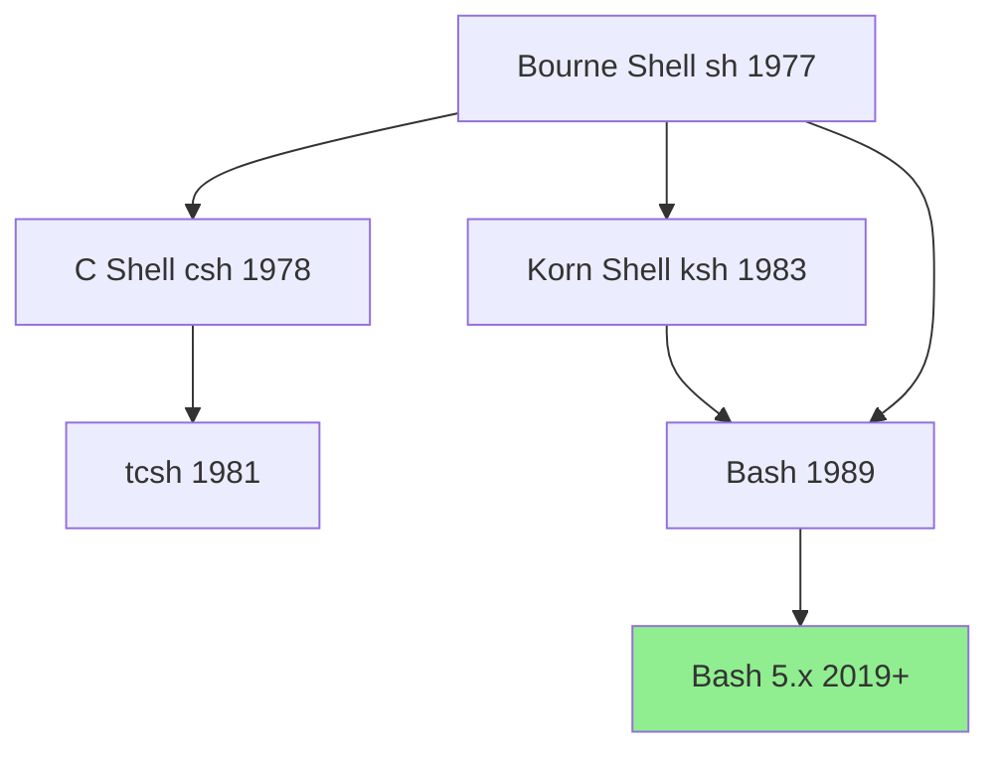

# Linux Command Line - Complete Guide

> [!summary] One-Stop Mental Model
> The shell is both a **command interpreter** and a **macro processor**: it reads input, performs expansions (brace, glob, parameter, command substitution), splits into words, executes commands, and returns exit statuses. Master the **7-step execution pipeline** and you'll understand 90% of shell behavior.

> [!tip] Quick Jump
> - Shell internals: [[#How Bash Processes Commands Internally]]
> - Command reference: [[#Complete Command Reference]]
> - Redirection deep dive: [[#Streams and Redirection Internals]]
> - Advanced patterns: [[Linux/02_Core/05_Text_Processing_Toolbox]]
> - Scripting: [[Linux/02_Core/01_Systemd_and_Services]]

---

## Table of Contents

1. [What Is the Shell?](#what-is-the-shell)
2. [How Bash Processes Commands Internally](#how-bash-processes-commands-internally)
3. [Shell Operation: The 7-Step Pipeline](#shell-operation-the-7-step-pipeline)
4. [Navigation and File Operations](#navigation-and-file-operations)
5. [Streams and Redirection Internals](#streams-and-redirection-internals)
6. [Pipelines and Process Substitution](#pipelines-and-process-substitution)
7. [Expansions Deep Dive](#expansions-deep-dive)
8. [Quoting and Escaping Rules](#quoting-and-escaping-rules)
9. [Complete Command Reference](#complete-command-reference)
10. [Exit Status and Error Handling](#exit-status-and-error-handling)
11. [Subshells vs Child Processes](#subshells-vs-child-processes)
12. [POSIX Compliance and Bash Extensions](#posix-compliance-and-bash-extensions)
13. [Common Pitfalls and Gotchas](#common-pitfalls-and-gotchas)
14. [Real-World Patterns](#real-world-patterns)
15. [Interview Corner](#interview-corner)
16. [Cheat Sheet](#cheat-sheet)
17. [References](#references)

---

## What Is the Shell?

The **shell** is a command language interpreter that provides a user interface to the Unix operating system. It's both:

1. **Command interpreter**: Executes commands interactively or from scripts
2. **Macro processor**: Expands text and symbols to create larger expressions
3. **Programming language**: Provides variables, control flow, functions, and I/O redirection

### Shell vs Terminal vs Console

```
┌─────────────────────────────────────────────┐
│ Terminal Emulator (xterm, gnome-terminal)   │
│ ┌─────────────────────────────────────────┐ │
│ │ Shell (bash, zsh, sh)                   │ │
│ │ ┌─────────────────────────────────────┐ │ │
│ │ │ Commands (ls, grep, etc.)           │ │ │
│ │ └─────────────────────────────────────┘ │ │
│ └─────────────────────────────────────────┘ │
└─────────────────────────────────────────────┘
```

| Component | Purpose | Example |
|-----------|---------|---------|
| **Terminal** | Text input/output interface (historically a physical device) | `/dev/pts/0` |
| **Terminal Emulator** | Software that emulates a terminal | `gnome-terminal`, `xterm` |
| **Shell** | Command interpreter | `bash`, `zsh`, `sh`, `fish` |
| **Console** | Special terminal directly connected to the system | `/dev/console` |

### Bash History and Lineage



**Bash** (Bourne-Again SHell) is:
- A POSIX-compliant shell with extensions
- The default shell on most Linux distributions
- Compatible with `sh` scripts
- Enhanced with features from `ksh` and `csh`

---

## How Bash Processes Commands Internally

When you type a command and press Enter, Bash executes a **7-step pipeline**:

```
Input → Tokenization → Parsing → Expansion → Word Splitting → 
Glob Expansion → Command Execution → Exit Status Collection
```

### Internal Architecture

```
┌─────────────────────────────────────────────────────────┐
│                     BASH SHELL                          │
├─────────────────────────────────────────────────────────┤
│  1. INPUT READER (readline library)                     │
│     ↓ Reads from stdin/file/string                      │
├─────────────────────────────────────────────────────────┤
│  2. LEXER (Tokenizer)                                   │
│     ↓ Breaks input into tokens using metacharacters     │
│     Token types: WORD, OPERATOR, NEWLINE                │
├─────────────────────────────────────────────────────────┤
│  3. PARSER                                              │
│     ↓ Builds AST (Abstract Syntax Tree)                 │
│     Recognizes: simple cmds, pipelines, lists, compounds│
├─────────────────────────────────────────────────────────┤
│  4. EXPANSION ENGINE                                    │
│     Order: brace → tilde → parameter → arithmetic →     │
│            command substitution → process substitution  │
├─────────────────────────────────────────────────────────┤
│  5. WORD SPLITTER                                       │
│     ↓ Uses IFS to split expansion results into words    │
├─────────────────────────────────────────────────────────┤
│  6. PATHNAME EXPANDER (Globbing)                        │
│     ↓ Expands *, ?, [...] patterns                      │
├─────────────────────────────────────────────────────────┤
│  7. COMMAND EXECUTOR                                    │
│     Decision: builtin → function → executable in PATH   │
│     ↓ fork/exec for external commands                   │
├─────────────────────────────────────────────────────────┤
│  8. EXIT STATUS COLLECTOR                               │
│     ↓ Stores in $? (0-255)                              │
└─────────────────────────────────────────────────────────┘
```

---

## Shell Operation: The 7-Step Pipeline

### Step 1: Reading Input

Bash reads input from:
- **Interactive terminal**: Uses the `readline` library for line editing
- **Script file**: `bash script.sh`
- **String**: `bash -c "command"`
- **Here document**: `cat << EOF`

### Step 2: Tokenization (Lexical Analysis)

The lexer breaks input into **tokens** separated by **metacharacters**:

| Metacharacter | Meaning |
|---------------|---------|
| `|` `&` `;` | Control operators |
| `<` `>` | Redirection operators |
| `(` `)` | Subshell grouping |
| `{` `}` | Command grouping |
| `space` `tab` `newline` | Word separators |

**Example**:
```bash
ls -la | grep "^d" > dirs.txt
```

Tokens: `ls` `-la` `|` `grep` `"^d"` `>` `dirs.txt`

### Step 3: Parsing

The parser builds an **Abstract Syntax Tree (AST)** recognizing:
- **Simple commands**: `cmd arg1 arg2`
- **Pipelines**: `cmd1 | cmd2 | cmd3`
- **Lists**: `cmd1 && cmd2 || cmd3`
- **Compound commands**: `if`, `for`, `while`, `case`, `{ }`

### Step 4: Expansion (Order Matters!)

Bash performs **8 types of expansions** in this exact order:


**Why order matters**:
```bash
# Brace expansion happens BEFORE variable expansion
VAR="{1,2,3}"
echo $VAR        # Output: {1,2,3} (no expansion)
echo {1,2,3}     # Output: 1 2 3 (expanded)

# Tilde expansion only at word start
echo ~           # Expands to /home/user
echo "~"         # Literal ~ (quoted)
echo foo~        # Literal ~ (not at start)
```

### Step 5: Word Splitting

After expansion, results are split into words using `IFS` (Internal Field Separator):

```bash
IFS=' '          # Default: space, tab, newline
var="a b c"
echo $var        # 3 words: a b c
echo "$var"      # 1 word: "a b c"
```

### Step 6: Pathname Expansion (Globbing)

Patterns `*`, `?`, `[...]` are expanded to matching filenames:

```bash
echo *.txt       # Expands to: file1.txt file2.txt
echo "*.txt"     # Literal: *.txt (quoted)
```

### Step 7: Command Execution

Bash searches for commands in this order:

1. **Aliases** (if enabled)
2. **Keywords** (`if`, `for`, `while`, etc.)
3. **Functions** (defined in current shell)
4. **Builtins** (`cd`, `echo`, `source`, etc.)
5. **Executables** in `PATH`

```bash
type -a echo
# echo is a shell builtin
# echo is /usr/bin/echo
```

**Execution model**:
```
┌─────────────────────────┐
│   Is it a builtin?      │
│   ├─ Yes → Execute in   │
│   │        current shell│
│   └─ No → fork()        │
│            ├─ Child:    │
│            │   exec()   │
│            └─ Parent:   │
│                wait()   │
└─────────────────────────┘
```

---

## Navigation and File Operations

### Navigation Commands

```bash
# Print working directory
pwd                     # /home/user/projects

# List directory contents
ls                      # Basic list
ls -l                   # Long format (permissions, owner, size, date)
ls -a                   # Include hidden files (starting with .)
ls -h                   # Human-readable sizes (1K, 234M, 2G)
ls -t                   # Sort by modification time (newest first)
ls -r                   # Reverse order
ls -R                   # Recursive (list subdirectories)
ls -i                   # Show inode numbers
ls -lah                 # Combine: long format, all files, human-readable

# Change directory
cd /path/to/dir         # Absolute path
cd relative/path        # Relative to current directory
cd ..                   # Parent directory
cd ../..                # Two levels up
cd -                    # Previous directory (toggles between last two)
cd ~                    # Home directory
cd                      # Home directory (same as cd ~)
cd ~username            # Another user's home directory

# Directory stack (pushd/popd)
pushd /tmp              # Push /tmp, cd to /tmp
pushd /var/log          # Push /var/log, cd to /var/log
dirs                    # Show directory stack
popd                    # Pop and cd to previous directory
```

**How `cd -` works**:
```bash
# Bash stores the previous directory in OLDPWD
cd /home/user
cd /tmp
echo $OLDPWD            # /home/user
cd -                    # Goes to $OLDPWD, swaps PWD and OLDPWD
```

### File Operations

```bash
# Create files
touch file.txt          # Create empty file or update timestamp
touch -t 202601011200 file.txt  # Set specific timestamp

# Create directories
mkdir dir               # Create single directory
mkdir -p path/to/dir    # Create parent directories as needed
mkdir -m 755 dir        # Set permissions during creation

# Copy
cp source dest          # Copy file
cp -r source/ dest/     # Recursive (directories)
cp -a source/ dest/     # Archive mode (preserve attributes)
cp -i source dest       # Interactive (prompt before overwrite)
cp -u source dest       # Update (copy only if source is newer)
cp -p source dest       # Preserve mode, ownership, timestamps

# Move/Rename
mv source dest          # Move or rename
mv -i source dest       # Interactive
mv -n source dest       # No overwrite
mv -u source dest       # Update only

# Remove
rm file                 # Remove file
rm -r dir/              # Recursive (directories)
rm -f file              # Force (no prompt, ignore nonexistent)
rm -i file              # Interactive (prompt for each file)
rm -rf dir/             # DANGEROUS: Force recursive removal

# Symbolic links
ln -s target linkname   # Create symbolic link
readlink linkname       # Show target of symlink
readlink -f linkname    # Follow chain to final target

# Hard links
ln target linkname      # Create hard link (same inode)
```

### Wildcard Patterns

| Pattern | Matches | Example |
|---------|---------|---------|
| `*` | Zero or more characters | `*.txt` → all .txt files |
| `?` | Exactly one character | `file?.txt` → file1.txt, fileA.txt |
| `[abc]` | One character from set | `file[123].txt` → file1.txt, file2.txt |
| `[a-z]` | One character from range | `[A-Z]*` → files starting with uppercase |
| `[!abc]` | One character NOT in set | `[!0-9]*` → files not starting with digit |
| `{a,b,c}` | Brace expansion (NOT glob) | `file.{txt,md}` → file.txt file.md |

**Extended globbing** (enable with `shopt -s extglob`):

| Pattern | Meaning |
|---------|---------|
| `?(pattern)` | Match 0 or 1 occurrence |
| `*(pattern)` | Match 0 or more occurrences |
| `+(pattern)` | Match 1 or more occurrences |
| `@(pattern)` | Match exactly 1 occurrence |
| `!(pattern)` | Match anything except pattern |

```bash
# Enable extended globbing
shopt -s extglob

# Examples
ls !(*.txt)             # All files except .txt
ls file+([0-9]).log     # file1.log, file123.log (but not file.log)
```

---

## Streams and Redirection Internals

### The Three Standard Streams

Every process has three file descriptors by default:

```
┌────────────────────────────────────────┐
│           Process                      │
│  ┌──────────────────────────────────┐  │
│  │  FD 0: stdin  (standard input)   │←─┤ Keyboard/pipe
│  │  FD 1: stdout (standard output)  │─→│ Terminal/file
│  │  FD 2: stderr (standard error)   │─→│ Terminal/file
│  └──────────────────────────────────┘  │
└────────────────────────────────────────┘
```

| FD | Name | Default | Purpose |
|----|------|---------|---------|
| 0 | stdin | Keyboard | Command input |
| 1 | stdout | Terminal | Normal output |
| 2 | stderr | Terminal | Error messages |

### File Descriptor Table

```
Process File Descriptor Table
┌─────┬──────────────┬──────────────┐
│ FD  │ Open File    │ Mode         │
├─────┼──────────────┼──────────────┤
│  0  │ /dev/pts/0   │ Read         │
│  1  │ /dev/pts/0   │ Write        │
│  2  │ /dev/pts/0   │ Write        │
│  3  │ /tmp/foo.txt │ Read         │
│  4  │ /var/log.txt │ Write/Append │
└─────┴──────────────┴──────────────┘
```

### Redirection Operations

#### Basic Redirection

```bash
# Redirect stdout to file (overwrite)
cmd > file.txt
cmd 1> file.txt         # Explicit FD 1

# Redirect stdout to file (append)
cmd >> file.txt
cmd 1>> file.txt

# Redirect stderr to file
cmd 2> errors.txt

# Redirect both stdout and stderr to same file
cmd > output.txt 2>&1   # POSIX way (order matters!)
cmd &> output.txt       # Bash shorthand
cmd >& output.txt       # Bash shorthand (deprecated)

# Append both
cmd >> output.txt 2>&1

# Redirect stderr to stdout
cmd 2>&1                # stderr goes where stdout goes
cmd 2>&1 | tee log.txt  # Merge streams, send to pipe

# Redirect stdin from file
cmd < input.txt
cmd 0< input.txt        # Explicit FD 0
```

> [!warning] Order Matters: `2>&1` vs `>&2`
> ```bash
> cmd > file.txt 2>&1    # CORRECT: stderr follows stdout to file
> cmd 2>&1 > file.txt    # WRONG: stderr to terminal, stdout to file
> ```
> Redirections are processed **left to right**. In the first example, `> file.txt` redirects stdout to file, then `2>&1` duplicates FD 1 (now pointing to file) to FD 2. In the second example, `2>&1` duplicates the current FD 1 (terminal), THEN `> file.txt` changes FD 1.

#### Advanced Redirection

```bash
# Discard output (write to null device)
cmd > /dev/null         # Discard stdout
cmd 2> /dev/null        # Discard stderr
cmd &> /dev/null        # Discard both

# Here Document (multi-line input)
cat << EOF
line 1
line 2
$VARIABLE gets expanded
EOF

# Here Document (suppress expansion with quoted delimiter)
cat << 'EOF'
$VARIABLE not expanded
EOF

# Here String (single line input)
grep pattern <<< "search this string"
bc <<< "2 + 2"

# File Descriptor Manipulation
exec 3< input.txt       # Open FD 3 for reading
exec 4> output.txt      # Open FD 4 for writing
read line <&3           # Read from FD 3
echo "text" >&4         # Write to FD 4
exec 3<&-               # Close FD 3
exec 4>&-               # Close FD 4

# Duplicate file descriptors
cmd 3>&1 1>&2 2>&3      # Swap stdout and stderr (using FD 3 as temp)

# Read/Write to same file descriptor
exec 5<> file.txt       # Open FD 5 for both reading and writing
```

### How Redirection Works Internally

When you run `cmd > file.txt`:

```c
// Simplified system call sequence
int fd = open("file.txt", O_WRONLY | O_CREAT | O_TRUNC, 0644);
dup2(fd, 1);      // Duplicate fd to FD 1 (stdout)
close(fd);        // Close original fd
execve("/bin/cmd", ...);  // Execute command
```

**Visual representation**:
```
Before:  FD 1 → Terminal
After:   FD 1 → file.txt (Terminal disconnected)
```

---

## Pipelines and Process Substitution

### Pipelines

A **pipeline** connects the stdout of one command to the stdin of the next:

```bash
cmd1 | cmd2 | cmd3
```

**Internals**:
```
┌─────────┐     pipe     ┌─────────┐     pipe     ┌─────────┐
│  cmd1   │ stdout → stdin │  cmd2   │ stdout → stdin │  cmd3   │
│  (PID:  │──────────────→│  (PID:  │──────────────→│  (PID:  │
│   101)  │              │   102)  │              │   103)  │
└─────────┘              └─────────┘              └─────────┘
```

**Key facts**:
1. Each command runs in its own **subshell** (separate process)
2. Commands execute **concurrently** (parallel, not sequential)
3. Exit status of pipeline = exit status of **last command**
4. Use `set -o pipefail` to catch failures in middle commands

```bash
# Pipeline exit status
false | true
echo $?                 # 0 (exit status of 'true')

# With pipefail
set -o pipefail
false | true
echo $?                 # 1 (exit status of 'false')
```

### stderr in Pipelines

```bash
# Only stdout is piped, stderr still goes to terminal
cmd 2>&1 | grep pattern      # Merge stderr into stdout, then pipe

# Pipe stderr only (keep stdout to terminal)
cmd 2>&1 >&3 3>&- | grep error
#   ^^^^^ Swap stdout and stderr
#         ^^^^ Send original stdout to FD 3 (terminal)
#              ^^^^ Close FD 3 in the subshell
```

### Process Substitution

**Process substitution** allows treating command output as a file:

```bash
# <(cmd) creates a named pipe (FIFO) with command output
diff <(ls dir1) <(ls dir2)

# >(cmd) creates a named pipe for input
tar czf >(ssh user@host 'cat > backup.tar.gz') directory/
```

**How it works**:
```bash
echo <(date)
# Output: /dev/fd/63

# Bash creates a FIFO (First In, First Out pipe)
# Roughly equivalent to:
mkfifo /tmp/fifo123
date > /tmp/fifo123 &
cmd /tmp/fifo123
```

**Real-world examples**:
```bash
# Compare sorted output of two commands
diff <(sort file1.txt) <(sort file2.txt)

# Multiple inputs to paste
paste <(cut -d: -f1 /etc/passwd) <(cut -d: -f3 /etc/passwd)

# Logging to multiple files
command | tee >(grep ERROR > errors.log) >(grep WARN > warnings.log) > all.log
```

---

## Expansions Deep Dive

### 1. Brace Expansion

**NOT a glob** (doesn't match files). Generates arbitrary strings:

```bash
# Comma-separated list
echo {a,b,c}            # a b c
echo file{1,2,3}.txt    # file1.txt file2.txt file3.txt

# Ranges
echo {1..10}            # 1 2 3 4 5 6 7 8 9 10
echo {a..z}             # a b c d e ... z
echo {001..010}         # 001 002 003 ... 010 (preserves leading zeros)
echo {10..1}            # 10 9 8 7 6 5 4 3 2 1 (reverse)

# Step increment (Bash 4.0+)
echo {0..10..2}         # 0 2 4 6 8 10
echo {a..z..3}          # a d g j m p s v y

# Nested braces
echo {{A..C},{1..3}}    # A B C 1 2 3
echo {A,B}{1,2}         # A1 A2 B1 B2

# Cartesian product
mkdir -p project/{src,test,docs}/{js,py,go}
# Creates: project/src/js, project/src/py, project/src/go,
#          project/test/js, project/test/py, project/test/go,
#          project/docs/js, project/docs/py, project/docs/go
```

### 2. Tilde Expansion

| Pattern | Expands To |
|---------|------------|
| `~` | `$HOME` |
| `~/path` | `$HOME/path` |
| `~user` | Home directory of `user` |
| `~+` | `$PWD` (current directory) |
| `~-` | `$OLDPWD` (previous directory) |

```bash
echo ~                  # /home/user
echo ~root              # /root
echo ~+                 # /home/user/current/path
echo ~-                 # /home/user/previous/path
```

### 3. Parameter Expansion

```bash
# Basic expansion
var="hello"
echo $var               # hello
echo ${var}             # hello (explicit form)

# String length
echo ${#var}            # 5

# Default values
echo ${undefined:-default}    # default (if unset or null)
echo ${undefined-default}     # default (if unset only)

# Assign default
echo ${undefined:=assigned}   # assigned (and sets undefined="assigned")

# Error if unset
echo ${undefined:?error message}  # Exits with error

# Use alternate value
echo ${var:+alternate}        # alternate (if var is set)

# Substring extraction
var="hello world"
echo ${var:0:5}         # hello (offset 0, length 5)
echo ${var:6}           # world (offset 6, to end)
echo ${var: -5}         # world (last 5 characters, note the space)

# Pattern matching (prefix removal)
path="/home/user/file.txt"
echo ${path#*/}         # home/user/file.txt (remove shortest match from start)
echo ${path##*/}        # file.txt (remove longest match from start)

# Pattern matching (suffix removal)
echo ${path%/*}         # /home/user (remove shortest match from end)
echo ${path%%/*}        # (empty - remove longest match from end)

# Search and replace
var="hello world"
echo ${var/o/O}         # hellO world (first match)
echo ${var//o/O}        # hellO wOrld (all matches)
echo ${var/#hello/goodbye}  # goodbye world (match at start)
echo ${var/%world/universe} # hello universe (match at end)

# Case conversion (Bash 4.0+)
var="Hello World"
echo ${var,,}           # hello world (lowercase all)
echo ${var^^}           # HELLO WORLD (uppercase all)
echo ${var,}            # hello World (lowercase first char)
echo ${var^}            # Hello World (uppercase first char)
```

### 4. Command Substitution

```bash
# Modern syntax (nestable)
result=$(command)
result=$(command1 $(command2))

# Old syntax (backticks - not nestable)
result=`command`
result=`command1 \`command2\``  # Escaping required

# Examples
now=$(date +%Y-%m-%d)
files=$(ls *.txt)
lines=$(wc -l < file.txt)

# Use in expressions
if [ $(id -u) -eq 0 ]; then
    echo "Running as root"
fi
```

### 5. Arithmetic Expansion

```bash
# Syntax: $((expression))
echo $((2 + 3))         # 5
echo $((10 / 3))        # 3 (integer division)
echo $((10 % 3))        # 1 (modulo)
echo $((2 ** 8))        # 256 (exponentiation)

# Variables (no $ needed inside)
x=10
y=20
echo $((x + y))         # 30

# Increment/decrement
echo $((x++))           # 10 (post-increment, returns old value)
echo $x                 # 11 (now incremented)
echo $((++x))           # 12 (pre-increment, returns new value)

# Bitwise operations
echo $((8 & 4))         # 0 (AND)
echo $((8 | 4))         # 12 (OR)
echo $((8 ^ 4))         # 12 (XOR)
echo $((8 << 2))        # 32 (left shift)

# Comparisons (return 0 or 1)
echo $((5 > 3))         # 1 (true)
echo $((5 == 5))        # 1
echo $((5 != 3))        # 1

# Ternary operator
age=25
echo $((age >= 18 ? 1 : 0))  # 1
```

---

## Quoting and Escaping Rules

### Three Quoting Mechanisms

| Quoting | Preserves | Allows | Use Case |
|---------|-----------|--------|----------|
| Single `'...'` | Everything literally | Nothing | Literal strings, no expansion |
| Double `"..."` | Variables, command substitution | `$`, `\``, `\\`, `!` | Expand variables, preserve spaces |
| Backslash `\` | Next character | Nothing | Escape single character |

### Single Quotes

**Preserves everything literally**. Cannot contain a single quote (even escaped).

```bash
echo 'Hello $USER'      # Hello $USER (literal)
echo 'Price: $10'       # Price: $10
echo 'Line 1\nLine 2'   # Line 1\nLine 2 (literal \n)

# Cannot include single quote inside single quotes
# Workaround: concatenate with escaped quote
echo 'can'\''t'         # can't
# Breaks down to: 'can' + \' + 't'
```

### Double Quotes

**Preserves spaces, allows expansion** of `$`, `\``, `\`, `!`:

```bash
var="world"
echo "Hello $var"       # Hello world
echo "Today is $(date)" # Today is Mon Jan 1 12:00:00 UTC 2026
echo "Price: \$10"      # Price: $10 (escaped $)

# Preserves whitespace
files="file1.txt file2.txt file3.txt"
touch $files            # Creates 3 files
touch "$files"          # Creates 1 file named "file1.txt file2.txt file3.txt"

# Special case: $@
func() {
    echo "Unquoted: $@"   # Word splitting occurs
    echo "Quoted: $*"     # All args as single word (separated by first char of IFS)
    echo "Quoted: $@"     # Each arg as separate word (correct for passing args)
}
func "arg with spaces" "another arg"
# Unquoted: arg with spaces another arg (4 words)
# Quoted: arg with spaces another arg (1 word)
# Quoted: arg with spaces another arg (2 words, preserving original)
```

### Backslash Escaping

```bash
# Escape special characters
echo \$HOME             # $HOME (literal)
echo \*                 # * (literal, not glob)
echo \\                 # \ (single backslash)

# Line continuation (backslash-newline removed)
echo "This is a \
long line"
# Output: This is a long line

# In double quotes, backslash only escapes: $ ` \ " newline
echo "Price: \$10"      # Price: $10
echo "Quote: \""        # Quote: "
echo "Backslash: \\"    # Backslash: \
echo "Other: \t"        # Other: \t (literal, not tab)
```

### ANSI-C Quoting ($'...')

Bash extension supporting escape sequences:

```bash
echo $'Line 1\nLine 2'  # Line 1
                        # Line 2

echo $'Tab:\ttext'      # Tab:    text
echo $'\x41\x42\x43'    # ABC (hex codes)
echo $'\u2764'          # ❤ (Unicode)
echo $'It\'s done'      # It's done
```

### Quoting Decision Table

```mermaid
graph TD
    A[Need to include variables?] -->|Yes| B[Need to preserve spaces?]
    A -->|No| C[Need special chars literally?]
    B -->|Yes| D[Use double quotes "..."]
    B -->|No| E[Use unquoted with careful IFS]
    C -->|Yes| F[Use single quotes '...']
    C -->|No| G[Use backslash escaping]
```

---

## Complete Command Reference

### Help and Documentation

```bash
# Command type and location
type command            # Show command type (alias/builtin/function/file)
type -a command         # Show all locations
which command           # Show path to executable
whereis command         # Show binary, source, and man page locations

# Manual pages
man command             # Open manual page
man 5 passwd            # Open specific section (1=commands, 5=file formats)
man -k keyword          # Search manual pages
info command            # Info documentation (GNU)
command --help          # Built-in help
help builtin            # Help for shell builtins (bash-specific)

# Quick reference
whatis command          # One-line description
apropos keyword         # Search command descriptions
```

### File and Directory Operations Comprehensive

```bash
# Find files
find /path -name "*.txt"           # By name
find /path -type f -size +10M      # Files larger than 10MB
find /path -mtime -7               # Modified in last 7 days
find /path -user username          # By owner
find /path -perm 644               # By permissions
find /path -exec cmd {} \;         # Execute command on each result

# Locate (faster, uses database)
updatedb                           # Update locate database (run as root)
locate filename                    # Find file by name
locate -i filename                 # Case-insensitive

# File information
stat file                          # Detailed file stats (size, inode, times)
file file                          # Determine file type
du -sh dir                         # Disk usage of directory
du -ah dir | sort -rh | head -20   # Top 20 largest files/dirs
df -h                              # Disk space usage of mounted filesystems

# Permissions
chmod 755 file                     # Set permissions (rwxr-xr-x)
chmod u+x file                     # Add execute for user
chmod g-w file                     # Remove write for group
chmod o= file                      # Remove all permissions for others
chmod -R 644 dir/                  # Recursive

chown user:group file              # Change owner and group
chown -R user:group dir/           # Recursive
chgrp group file                   # Change group only

# Access Control Lists (ACLs)
getfacl file                       # View ACLs
setfacl -m u:username:rw file      # Grant user read/write
setfacl -m g:groupname:r file      # Grant group read
setfacl -x u:username file         # Remove user ACL
setfacl -b file                    # Remove all ACLs
```

### Process Management

```bash
# View processes
ps                                 # Processes in current shell
ps aux                             # All processes (BSD style)
ps -ef                             # All processes (System V style)
ps -eLf                            # Include threads
ps -p PID                          # Specific process
pstree                             # Process tree
top                                # Interactive process viewer
htop                               # Enhanced interactive viewer (if installed)

# Process signals
kill PID                           # Send TERM signal (15)
kill -9 PID                        # Send KILL signal (9, force kill)
kill -HUP PID                      # Send HUP signal (1, reload config)
killall processname                # Kill by name
pkill pattern                      # Kill by pattern

# Background jobs
command &                          # Run in background
jobs                               # List background jobs
fg %1                              # Bring job 1 to foreground
bg %1                              # Resume job 1 in background
Ctrl+Z                             # Suspend current job
disown -a                          # Detach all jobs from shell
```

### Text Manipulation

```bash
# Display
cat file                           # Print entire file
cat -n file                        # With line numbers
cat -A file                        # Show all characters (tabs as ^I, EOL as $)
tac file                           # Print in reverse order
head -n 20 file                    # First 20 lines
tail -n 20 file                    # Last 20 lines
tail -f file                       # Follow file (live updates)
less file                          # Paginated viewer (q to quit)
more file                          # Simple pager

# Search
grep pattern file                  # Search for pattern
grep -i pattern file               # Case-insensitive
grep -r pattern dir/               # Recursive search
grep -v pattern file               # Invert match (lines NOT matching)
grep -E 'regex' file               # Extended regex
grep -o pattern file               # Print only matching part
grep -c pattern file               # Count matching lines
grep -A 3 pattern file             # Print 3 lines after match
grep -B 3 pattern file             # Print 3 lines before match
grep -C 3 pattern file             # Print 3 lines before and after

# Transform
sed 's/old/new/' file              # Replace first occurrence per line
sed 's/old/new/g' file             # Replace all occurrences
sed -i 's/old/new/g' file          # In-place edit
sed -n '10,20p' file               # Print lines 10-20
sed '/pattern/d' file              # Delete lines matching pattern
awk '{print $1}' file              # Print first column
awk -F: '{print $1,$3}' file       # Custom delimiter (:)
tr 'a-z' 'A-Z' < file              # Translate lowercase to uppercase
cut -d: -f1 /etc/passwd            # Extract first field (delimiter :)
sort file                          # Sort lines alphabetically
sort -n file                       # Numeric sort
sort -r file                       # Reverse sort
sort -u file                       # Sort and remove duplicates
uniq file                          # Remove consecutive duplicates
uniq -c file                       # Count occurrences
```

---

## Exit Status and Error Handling

Every command returns an **exit status** (0-255):

| Exit Code | Meaning |
|-----------|---------|
| 0 | Success |
| 1-125 | Command-specific failure |
| 126 | Command found but not executable |
| 127 | Command not found |
| 128+N | Command terminated by signal N |
| 130 | Terminated by Ctrl+C (128 + 2, SIGINT) |
| 137 | Killed by signal 9 (128 + 9, SIGKILL) |

```bash
# Check exit status
command
echo $?                 # Print exit status of last command

# Exit status in conditions
if command; then
    echo "Success"
else
    echo "Failed"
fi

# Short-circuit operators
cmd1 && cmd2            # Run cmd2 only if cmd1 succeeds (exit 0)
cmd1 || cmd2            # Run cmd2 only if cmd1 fails (exit ≠0)

# Chain multiple commands
cmd1 && cmd2 && cmd3    # All must succeed
cmd1 || cmd2 || cmd3    # Run until one succeeds

# Error handling in scripts
set -e                  # Exit immediately if any command fails
set -u                  # Exit if undefined variable is used
set -o pipefail         # Fail if any command in pipeline fails
set -x                  # Print each command before executing (debug)
set -euxo pipefail      # Combine all (common strict mode)

# Trap errors
trap 'echo "Error on line $LINENO"' ERR
trap 'cleanup_function' EXIT
```

---

## Subshells vs Child Processes

### Subshell

A **subshell** is a **copy** of the current shell environment:

```bash
# Creating subshells
(command)               # Explicit subshell
command | command       # Each command in pipeline runs in subshell
command &               # Background job runs in subshell
$(command)              # Command substitution runs in subshell

# Variable scope
var="parent"
(var="child"; echo $var)   # child (in subshell)
echo $var                  # parent (unchanged in parent)
```

### Child Process

A **child process** is a **new program** executed via `fork + exec`:

```bash
# Running external commands
/bin/ls                 # New process
ls                      # New process (found in PATH)

# Builtins (NOT child processes)
cd /tmp                 # Runs in current shell
export VAR=value        # Runs in current shell
source script.sh        # Runs in current shell
```

### Comparison Table

| Aspect | Subshell | Child Process |
|--------|----------|---------------|
| Created by | `()`, `|`, `&`, `$()` | External commands |
| Inherits | Environment variables, functions, shell options | Environment variables only |
| Changes affect parent? | No | No |
| Performance | Faster (copy-on-write) | Slower (new process + exec) |
| Shell variables | Inherited but not modifiable | Not accessible |

```bash
# Example: Why cd in subshell doesn't work
(cd /tmp; pwd)          # /tmp (in subshell)
pwd                     # /home/user (parent unchanged)

# Example: Subshell performance
time (for i in {1..1000}; do true; done)  # Fast (builtin)
time (for i in {1..1000}; do /bin/true; done)  # Slow (child process)
```

---

## POSIX Compliance and Bash Extensions

### POSIX Mode

```bash
# Enable POSIX mode
bash --posix
set -o posix            # In running shell
```

**Key differences**:

| Feature | Bash Default | POSIX Mode |
|---------|--------------|------------|
| `[[  ]]` test | Supported | Not supported (use `[ ]`) |
| `source` command | Supported | Not supported (use `.`) |
| Brace expansion | Enabled | Disabled |
| `$'...'` quoting | Supported | Not supported |
| Arrays | Supported | Not supported |
| `**` globbing | Supported (with shopt) | Not supported |

### Bash-Specific Features

```bash
# Arrays
arr=(one two three)
echo ${arr[0]}          # one
echo ${arr[@]}          # All elements
echo ${#arr[@]}         # Array length

# Associative arrays (dictionaries)
declare -A dict
dict[key1]="value1"
dict[key2]="value2"
echo ${dict[key1]}      # value1

# [[ ]] conditional
[[ $var =~ ^[0-9]+$ ]]  # Regex matching
[[ -e file && -r file ]] # Logical operators

# Process substitution
diff <(cmd1) <(cmd2)

# Extended globbing
shopt -s extglob
ls !(*.txt)             # All except .txt files

# ** recursive globbing
shopt -s globstar
ls **/*.py              # All .py files in all subdirectories
```

---

## Common Pitfalls and Gotchas

> [!warning] Unquoted Variables
> ```bash
> # WRONG: Word splitting occurs
> files="file1.txt file2.txt"
> rm $files               # Tries to remove 2 files
> 
> # CORRECT: Preserve as single argument
> rm "$files"             # Removes 1 file with spaces in name
> ```

> [!warning] [ vs [[ for Tests
> ```bash
> # [ ] is POSIX, requires quoting, no regex
> var="hello world"
> [ $var = "hello world" ]     # ERROR: too many arguments
> [ "$var" = "hello world" ]   # Correct
> 
> # [[ ]] is Bash, safer, supports regex
> [[ $var = "hello world" ]]   # Works without quotes
> [[ $var =~ ^hello ]]         # Regex matching
> ```

> [!warning] Useless Use of Cat
> ```bash
> # WRONG: Unnecessary cat
> cat file | grep pattern
> 
> # CORRECT: grep can read files directly
> grep pattern file
> 
> # WRONG: Unnecessary cat
> cat file | wc -l
> 
> # CORRECT: wc can read files directly
> wc -l < file
> ```

> [!warning] Command Substitution in Quotes
> ```bash
> # Preserves whitespace and newlines
> var="$(cat file)"       # Correct
> var=$(cat file)         # Word splitting on output
> 
> # Loop over lines
> while read line; do
>     echo "$line"
> done < file             # Correct
> 
> # WRONG: Word splitting breaks lines
> for line in $(cat file); do
>     echo "$line"        # Treats words as separate lines
> done
> ```

> [!warning] Exit Status in Pipelines
> ```bash
> # Without pipefail
> false | true
> echo $?                 # 0 (exit status of last command)
> 
> # With pipefail
> set -o pipefail
> false | true
> echo $?                 # 1 (exit status of failed command)
> ```

> [!warning] Brace Expansion is NOT Glob
> ```bash
> # Brace expansion (generates strings, doesn't match files)
> echo file{1,2,3}.txt    # file1.txt file2.txt file3.txt (always)
> 
> # Glob expansion (matches existing files only)
> echo file*.txt          # Only lists existing files
> echo file*.txt          # Literal "file*.txt" if no match
> ```

---

## Real-World Patterns

### Safe Script Template

```bash
#!/usr/bin/env bash

# Strict mode
set -euo pipefail
IFS=$'\n\t'

# Script directory
SCRIPT_DIR="$(cd "$(dirname "${BASH_SOURCE[0]}")" && pwd)"

# Cleanup on exit
cleanup() {
    echo "Cleaning up..."
    # Remove temp files, etc.
}
trap cleanup EXIT

# Error handler
error_exit() {
    echo "Error on line $1" >&2
    exit 1
}
trap 'error_exit $LINENO' ERR

# Main script logic
main() {
    echo "Script running from: $SCRIPT_DIR"
}

main "$@"
```

### Argument Parsing

```bash
#!/bin/bash

usage() {
    cat << EOF
Usage: $0 [OPTIONS]

Options:
    -h, --help      Show this help message
    -v, --verbose   Verbose output
    -f, --file FILE Input file
EOF
    exit 1
}

VERBOSE=0
FILE=""

while [[ $# -gt 0 ]]; do
    case $1 in
        -h|--help)
            usage
            ;;
        -v|--verbose)
            VERBOSE=1
            shift
            ;;
        -f|--file)
            FILE="$2"
            shift 2
            ;;
        *)
            echo "Unknown option: $1"
            usage
            ;;
    esac
done

[[ -z "$FILE" ]] && { echo "Error: File required"; usage; }
```

### Progress Bar

```bash
progress_bar() {
    local current=$1
    local total=$2
    local width=50
    local percent=$((current * 100 / total))
    local filled=$((width * current / total))
    
    printf "\r["
    printf "%${filled}s" | tr ' ' '='
    printf "%$((width - filled))s" | tr ' ' ' '
    printf "] %d%%" "$percent"
}

# Usage
for i in {1..100}; do
    progress_bar $i 100
    sleep 0.1
done
echo
```

---

## Interview Corner

> [!question]- Q1: What happens when you run `cmd &` ?
> **Answer**: The shell forks a new process, runs `cmd` in that process, and immediately returns control to the user without waiting for `cmd` to complete. The background process:
> - Runs asynchronously
> - Has stdin redirected to `/dev/null` (unless explicitly redirected)
> - stdout and stderr still connected to terminal (unless redirected)
> - Process ID stored in `$!`
> - Added to the jobs table (`jobs` command)

> [!question]- Q2: Explain the difference between `$@` and `$*`
> **Answer**:
> - **Unquoted**: Both expand to separate words
> - **Quoted `"$@"`**: Expands to separate words, one per argument (preserves original argument boundaries)
> - **Quoted `"$*"`**: Expands to a single word with all arguments separated by first character of `IFS` (default: space)
>
> Example:
> ```bash
> func() {
>     echo "Args count: $#"
>     echo "With \$*: $*"
>     echo "With \"\$*\": \"$*\""
>     echo "With \"\$@\": \"$@\""
> }
> func "arg 1" "arg 2"
> # With "$*": "arg 1 arg 2" (single word)
> # With "$@": "arg 1" "arg 2" (two words)
> ```

> [!question]- Q3: How does the shell find commands to execute?
> **Answer**: The shell searches in this order:
> 1. **Aliases** (if alias expansion is enabled)
> 2. **Reserved words** (`if`, `for`, `while`, etc.)
> 3. **Functions** (defined in current shell)
> 4. **Builtins** (`cd`, `echo`, `export`, etc.)
> 5. **External commands** in `PATH` (searches directories in order)
>
> Use `type -a command` to see all matches.

> [!question]- Q4: What's the difference between `source script.sh` and `./script.sh`?
> **Answer**:
> - `source script.sh` (or `. script.sh`): Executes script in **current shell**. Variables, functions, and `cd` changes affect the current shell.
> - `./script.sh`: Executes script in **new child shell process**. Changes do NOT affect parent shell.
>
> Use `source` for configuration files (`.bashrc`, `.profile`), use `./` for standalone scripts.

> [!question]- Q5: Why doesn't `cd` work in a pipeline?
> **Answer**: Each command in a pipeline runs in a **subshell** (child process). The `cd` command changes the directory in the subshell, but when the subshell exits, the parent shell's directory remains unchanged.
> ```bash
> pwd                     # /home/user
> echo | cd /tmp          # cd runs in subshell
> pwd                     # /home/user (unchanged)
> ```

> [!question]- Q6: What's the difference between `cmd > file 2>&1` and `cmd 2>&1 > file`?
> **Answer**: **Order matters!** Redirections are processed left to right.
> - `cmd > file 2>&1`: stdout redirected to file, then stderr duplicated to stdout (which is now file) → Both to file
> - `cmd 2>&1 > file`: stderr duplicated to stdout (which is terminal), then stdout redirected to file → stderr to terminal, stdout to file

> [!question]- Q7: How do you safely iterate over files with spaces in names?
> **Answer**: Use globbing directly in `for` loop, NOT command substitution:
> ```bash
> # WRONG: Word splitting breaks filenames with spaces
> for file in $(ls *.txt); do
>     echo "$file"
> done
> 
> # CORRECT: Glob expansion preserves filenames
> for file in *.txt; do
>     echo "$file"
> done
> 
> # CORRECT: Read from find with null delimiter
> find . -name "*.txt" -print0 | while IFS= read -r -d '' file; do
>     echo "$file"
> done
> ```

> [!question]- Q8: What is `IFS` and how does it affect shell behavior?
> **Answer**: `IFS` (Internal Field Separator) controls word splitting after expansion. Default is space, tab, newline.
> ```bash
> IFS=' '
> var="a b c"
> echo $var               # 3 arguments: a, b, c
> echo "$var"             # 1 argument: "a b c"
> 
> IFS=':'
> var="a:b:c"
> echo $var               # 3 arguments: a, b, c
> 
> # Safe iteration over lines
> IFS=$'\n'
> for line in $(cat file); do
>     echo "$line"
> done
> ```

---

## Cheat Sheet

### Essential Commands

| Command | Purpose |
|---------|---------|
| `pwd` | Print working directory |
| `cd /path` | Change directory |
| `ls -lah` | List files (long, all, human-readable) |
| `cp -a src dest` | Copy (archive mode) |
| `mv src dest` | Move/rename |
| `rm -rf path` | Remove recursively (DANGEROUS) |
| `mkdir -p path/to/dir` | Create directory (with parents) |
| `touch file` | Create empty file |
| `cat file` | Print file contents |
| `less file` | Paged viewer |
| `grep pattern file` | Search text |
| `find /path -name pattern` | Find files |
| `chmod 755 file` | Change permissions |
| `chown user:group file` | Change owner |

### Redirection Quick Reference

| Syntax | Meaning |
|--------|---------|
| `cmd > file` | Redirect stdout to file (overwrite) |
| `cmd >> file` | Redirect stdout to file (append) |
| `cmd 2> file` | Redirect stderr to file |
| `cmd &> file` | Redirect both stdout and stderr |
| `cmd < file` | Redirect stdin from file |
| `cmd1 | cmd2` | Pipe stdout of cmd1 to stdin of cmd2 |
| `cmd > /dev/null` | Discard output |
| `cmd << EOF` | Here document |
| `cmd <<< "string"` | Here string |

### Exit Status Quick Reference

| Code | Meaning |
|------|---------|
| `0` | Success |
| `1` | General error |
| `2` | Misuse of shell builtin |
| `126` | Command not executable |
| `127` | Command not found |
| `128+N` | Terminated by signal N |
| `130` | Ctrl+C (SIGINT) |

### Variable Expansion Quick Reference

| Syntax | Purpose |
|--------|---------|
| `$var` or `${var}` | Expand variable |
| `${var:-default}` | Use default if unset/null |
| `${var:=default}` | Assign default if unset/null |
| `${var:?error}` | Exit with error if unset/null |
| `${#var}` | String length |
| `${var:offset:length}` | Substring |
| `${var#pattern}` | Remove shortest prefix |
| `${var##pattern}` | Remove longest prefix |
| `${var%pattern}` | Remove shortest suffix |
| `${var%%pattern}` | Remove longest suffix |
| `${var/old/new}` | Replace first match |
| `${var//old/new}` | Replace all matches |

---

## Cross-Links

- Next: [[Linux/01_Foundations/02_Files_and_Permissions|Files and Permissions]]
- Related: [[Linux/02_Core/05_Text_Processing_Toolbox|Text Processing]]
- Advanced: [[Linux/03_Advanced/01_Performance_Tuning_and_Profiling|Performance Tuning]]
- Scripting: [[Linux/02_Core/01_Systemd_and_Services|Systemd Services]]

---

## References

### Official Documentation
- [GNU Bash Manual](https://www.gnu.org/software/bash/manual/bash.html) - Complete Bash reference
- [POSIX Shell Specification](https://pubs.opengroup.org/onlinepubs/9699919799/utilities/V3_chap02.html) - POSIX.1-2017 standard
- [Bash Reference Manual (PDF)](https://www.gnu.org/software/bash/manual/bash.pdf)

### Books
- *The Linux Command Line* by William Shotts - Beginner-friendly introduction
- *Learning the bash Shell* by Cameron Newham - O'Reilly classic
- *Bash Cookbook* by Carl Albing & JP Vossen - Practical recipes
- *Unix Power Tools* by Shelley Powers et al. - Comprehensive reference

### Online Resources
- [Bash Guide for Beginners](https://tldp.org/LDP/Bash-Beginners-Guide/html/)
- [Advanced Bash-Scripting Guide](https://tldp.org/LDP/abs/html/)
- [ExplainShell.com](https://explainshell.com/) - Interactive command explanation
- [ShellCheck](https://www.shellcheck.net/) - Shell script linter

### Man Pages
```bash
man bash                 # Bash manual
man 1 builtins          # Shell builtins
man 7 glob              # Globbing patterns
```
