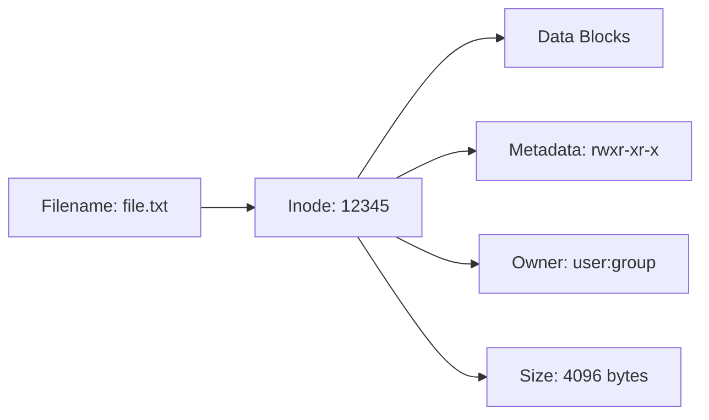
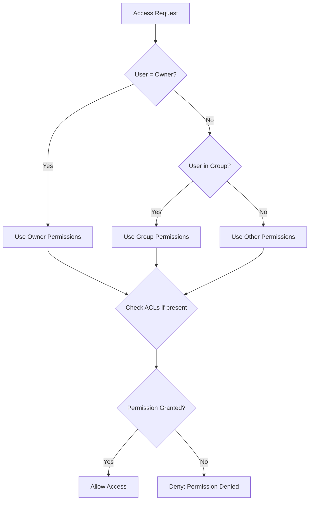

# Files and Permissions - Complete Guide

> [!summary] One-Stop Mental Model
> Linux security is built on **inodes** (file metadata), **permission bits** (rwx for user/group/other), and **special bits** (setuid/setgid/sticky). Every file operation checks permissions via the kernel's VFS layer. Master the octal notation (755 = rwxr-xr-x) and you control access to everything.

> [!tip] Quick Jump
> - Inode internals: [[#Inode Structure and Metadata]]
> - Permission bits deep dive: [[#Permission Bits Internals]]
> - ACLs: [[#Access Control Lists (ACLs)]]
> - Special bits: [[#Special Permission Bits]]
> - Troubleshooting: [[Linux/04_Playbooks/01_Investigate_High_CPU_or_Load]]

---

## Table of Contents

1. [Filesystem Fundamentals](#filesystem-fundamentals)
2. [Inode Structure and Metadata](#inode-structure-and-metadata)
3. [Permission Bits Internals](#permission-bits-internals)
4. [Understanding rwx for Files vs Directories](#understanding-rwx-for-files-vs-directories)
5. [Octal Notation Deep Dive](#octal-notation-deep-dive)
6. [Ownership: User and Group](#ownership-user-and-group)
7. [umask: Default Permission Calculation](#umask-default-permission-calculation)
8. [Special Permission Bits](#special-permission-bits)
9. [Access Control Lists (ACLs)](#access-control-lists)
10. [Kernel Permission Checks](#kernel-permission-checks)
11. [Symbolic vs Hard Links](#symbolic-vs-hard-links)
12. [File Attributes (chattr/lsattr)](#file-attributes)
13. [Common Pitfalls and Gotchas](#common-pitfalls-and-gotchas)
14. [Real-World Patterns](#real-world-patterns)
15. [Interview Corner](#interview-corner)
16. [Cheat Sheet](#cheat-sheet)
17. [References](#references)

---

## Filesystem Fundamentals

### Three Core Concepts

Every file in Linux consists of three components:

```
┌─────────────────────────────────────────────┐
│            FILE SYSTEM                      │
├─────────────────────────────────────────────┤
│  1. INODE (Metadata)                        │
│     - Permissions, ownership, timestamps    │
│     - Size, block pointers                  │
│     - Inode number (unique ID)              │
├─────────────────────────────────────────────┤
│  2. DATA BLOCKS (Content)                   │
│     - Actual file data                      │
│     - Allocated in filesystem blocks        │
├─────────────────────────────────────────────┤
│  3. DIRECTORY ENTRY (Name)                  │
│     - Filename → Inode mapping              │
│     - Multiple names can point to same inode│
└─────────────────────────────────────────────┘
```



### Everything is a File

| File Type | Symbol | Description | Example |
|-----------|--------|-------------|---------|
| Regular file | `-` | Normal files (text, binary, etc.) | `file.txt` |
| Directory | `d` | Contains directory entries | `/home/user` |
| Symbolic link | `l` | Pointer to another file | `link -> target` |
| Character device | `c` | Unbuffered I/O device | `/dev/tty` |
| Block device | `b` | Buffered I/O device | `/dev/sda` |
| Named pipe (FIFO) | `p` | Inter-process communication | `/tmp/my.pipe` |
| Socket | `s` | Network or IPC socket | `/var/run/docker.sock` |

```bash
# View file types
ls -l
# drwxr-xr-x  2 user group 4096 Jan  1 12:00 dir/
# -rw-r--r--  1 user group  100 Jan  1 12:00 file.txt
# lrwxrwxrwx  1 user group    8 Jan  1 12:00 link -> file.txt
# brw-rw----  1 root disk   8,0 Jan  1 12:00 /dev/sda
# crw-rw-rw-  1 root tty    5,0 Jan  1 12:00 /dev/tty

# Check file type
file /dev/sda           # /dev/sda: block special
file file.txt           # file.txt: ASCII text
stat file.txt           # Detailed file information
```

---

## Inode Structure and Metadata

An **inode** (index node) is a data structure that stores metadata about a file.

### Inode Internals

```
┌─────────────────────────────────────────────┐
│              INODE STRUCTURE                │
├─────────────────────────────────────────────┤
│ Inode Number:        12345                  │
│ File Type:           Regular file (-)       │
│ Permissions:         0644 (rw-r--r--)       │
│ Link Count:          2 (hard links)         │
│ Owner UID:           1000                   │
│ Group GID:           1000                   │
│ File Size:           4096 bytes             │
│ Block Count:         8 (512-byte blocks)    │
│ Access Time (atime): 2026-01-01 12:00:00    │
│ Modify Time (mtime): 2026-01-01 11:00:00    │
│ Change Time (ctime): 2026-01-01 11:00:00    │
│ Birth Time (crtime): 2026-01-01 10:00:00    │
│ Direct Block Ptrs:   [1024, 1025, ...]      │
│ Indirect Block Ptr:  2048                   │
│ Double Indirect:     2049                   │
│ Triple Indirect:     2050                   │
└─────────────────────────────────────────────┘
```

**What the inode does NOT store**: The **filename**. Filenames are stored in directory entries.

### Viewing Inode Information

```bash
# Show inode numbers
ls -i file.txt          # 12345 file.txt
ls -li                  # Long format with inode numbers

# Detailed inode information
stat file.txt
# Output:
#   File: file.txt
#   Size: 4096        Blocks: 8          IO Block: 4096   regular file
#   Device: 803h/2051d    Inode: 12345       Links: 1
#   Access: (0644/-rw-r--r--)  Uid: ( 1000/    user)   Gid: ( 1000/    user)
#   Access: 2026-01-01 12:00:00.000000000 +0000
#   Modify: 2026-01-01 11:00:00.000000000 +0000
#   Change: 2026-01-01 11:00:00.000000000 +0000
#    Birth: 2026-01-01 10:00:00.000000000 +0000

# Find files by inode number
find /path -inum 12345

# Count inodes in filesystem
df -i                   # Show inode usage
```

### Three Timestamps Explained

| Timestamp | Name | Updated When | Command to View |
|-----------|------|--------------|-----------------|
| **atime** | Access time | File is read | `ls -lu` |
| **mtime** | Modification time | File content is modified | `ls -l` (default) |
| **ctime** | Change time | Inode metadata is changed | `ls -lc` |
| **crtime** | Creation/birth time | File is created | `stat` (not all filesystems) |

```bash
# Update access time only
touch -a file.txt

# Update modification time only
touch -m file.txt

# Set specific timestamp
touch -t 202601011200 file.txt    # YYYYMMDDhhmm

# Note: ctime cannot be manually changed (kernel manages it)
```

> [!warning] ctime vs mtime Confusion
> - **mtime** changes when you **edit file content** (`echo "data" >> file`)
> - **ctime** changes when you **change metadata** (`chmod`, `chown`) OR when mtime changes
> - **ctime is NOT creation time** (that's crtime/btime, not widely supported)

### Inode Limits

```bash
# View total and free inodes
df -i
# Filesystem      Inodes   IUsed   IFree IUse% Mounted on
# /dev/sda1     30408704  123456 30285248    1% /

# What happens when you run out of inodes?
# Cannot create new files even if disk space is available!
touch newfile
# touch: cannot touch 'newfile': No space left on device
# (Even though df -h shows 50% free space)
```

**How to fix inode exhaustion**:
```bash
# Find directories with many files
find /path -xdev -type d -exec sh -c 'echo "$(ls -A "$1" | wc -l) $1"' _ {} \; | sort -rn | head -20

# Common causes:
# - Temporary files (/tmp, /var/tmp)
# - Log files (/var/log)
# - Email spools (/var/mail)
# - Session files (/var/lib/php/sessions)
```

---

## Permission Bits Internals

Every file has **9 permission bits** (plus 3 special bits):

```
       ┌─ File type (1 char)
       │  ┌────────── User/Owner permissions (3 bits)
       │  │   ┌────── Group permissions (3 bits)
       │  │   │   ┌── Other/World permissions (3 bits)
       │  │   │   │
       ↓  ↓   ↓   ↓
      -rwxr-xr-x
       ││││││││││
       │└┴┴┴┴┴┴┴┴┴─ Permission bits (9 bits)
       └─────────── File type
```

### Binary Representation

```
Permission: rwxr-xr-x
Binary:     111101101
Octal:      755

Breakdown:
  rwx = 111₂ = 4+2+1 = 7₈
  r-x = 101₂ = 4+0+1 = 5₈
  r-x = 101₂ = 4+0+1 = 5₈
```

### Permission Bit Storage in Inode

```
16-bit permission field in inode:
┌───────────────────────────────────┐
│ Special │   Owner  │ Group │ Other│
│  bits   │   rwx    │  rwx  │  rwx │
├─────────┼──────────┼───────┼──────┤
│ 0 0 0 0 │ 1 1 1    │ 1 0 1 │ 1 0 1│
│ sst     │          │       │      │
└─────────┴──────────┴───────┴──────┘
  ││││         │         │       │
  │││└─ sticky (t)       │       └─ other: r-x (5)
  ││└── setgid (s)       └───────── group: r-x (5)
  │└─── setuid (s)
  └──── (reserved)

Full mode: 0755
```

---

## Understanding rwx for Files vs Directories

### For Regular Files

| Permission | Symbol | Meaning | Numeric |
|------------|--------|---------|---------|
| Read | `r` | View file contents (`cat`, `less`, etc.) | 4 |
| Write | `w` | Modify file contents (edit, append, truncate) | 2 |
| Execute | `x` | Run file as program/script | 1 |

```bash
# Read permission
cat file.txt            # Requires r
less file.txt           # Requires r

# Write permission
echo "data" >> file.txt # Requires w
rm file.txt             # Requires w on DIRECTORY, not file!

# Execute permission
./script.sh             # Requires r (to read) + x (to execute)
/bin/bash script.sh     # Only requires r (bash reads it)
```

### For Directories

| Permission | Symbol | Meaning | Numeric |
|------------|--------|---------|---------|
| Read | `r` | List directory contents (`ls`) | 4 |
| Write | `w` | Create/delete files in directory | 2 |
| Execute | `x` | Enter directory (`cd`), access files inside | 1 |

```bash
# Execute (x) is critical for directories
cd dir/                 # Requires x
ls dir/                 # Requires r + x
ls -l dir/              # Requires r + x (to stat files)
cat dir/file.txt        # Requires x on dir (don't need r on dir)

# Common directory permissions
chmod 755 dir/          # rwxr-xr-x - Standard for directories
chmod 750 dir/          # rwxr-x--- - Group can browse, others can't
chmod 700 dir/          # rwx------ - Private directory
```

### Directory Permission Combinations

| Permissions | ls works? | cd works? | Access files? | Create/delete? |
|-------------|-----------|-----------|---------------|----------------|
| `---` (000) | ❌ | ❌ | ❌ | ❌ |
| `--x` (001) | ❌ | ✅ | ✅ (if you know name) | ❌ |
| `-w-` (010) | ❌ | ❌ | ❌ | ❌ (useless) |
| `-wx` (011) | ❌ | ✅ | ✅ | ✅ (blind write) |
| `r--` (100) | ⚠️ | ❌ | ❌ | ❌ (names only) |
| `r-x` (101) | ✅ | ✅ | ✅ | ❌ (read-only) |
| `rw-` (110) | ⚠️ | ❌ | ❌ | ❌ (useless) |
| `rwx` (111) | ✅ | ✅ | ✅ | ✅ (full access) |

```bash
# Example: Execute but no read
mkdir testdir
chmod 311 testdir       # -wx--x--x
cd testdir              # Works
ls                      # ls: cannot open directory '.': Permission denied
touch file.txt          # Works (can create)
cat file.txt            # Works (can access if you know the name)
ls testdir/             # Fails (cannot list from outside)
```

---

## Octal Notation Deep Dive

### Converting Between Symbolic and Octal

```bash
# Symbolic to octal
rwxr-xr-x = 755
rw-r--r-- = 644
rwx------ = 700
rw------- = 600
r-x--x--x = 511

# Octal to symbolic
755 = rwxr-xr-x
644 = rw-r--r--
600 = rw-------
777 = rwxrwxrwx (dangerous!)
000 = ---------
```

### Common Permission Patterns

| Octal | Symbolic | Use Case |
|-------|----------|----------|
| `644` | `rw-r--r--` | Regular files (world-readable) |
| `640` | `rw-r-----` | Config files (group-readable) |
| `600` | `rw-------` | Private files (SSH keys, passwords) |
| `755` | `rwxr-xr-x` | Directories, executable files |
| `750` | `rwxr-x---` | Group-accessible directories |
| `700` | `rwx------` | Private directories |
| `666` | `rw-rw-rw-` | World-writable files (rarely needed) |
| `777` | `rwxrwxrwx` | World-writable directories (DANGEROUS) |

### Using chmod

```bash
# Octal mode
chmod 644 file.txt      # Set exact permissions
chmod 755 script.sh     # Set exact permissions

# Symbolic mode (relative changes)
chmod u+x script.sh     # Add execute for user
chmod g-w file.txt      # Remove write for group
chmod o-r file.txt      # Remove read for others
chmod a+r file.txt      # Add read for all (a = ugo)
chmod u=rw,g=r,o= file.txt  # Set exact permissions symbolically

# Recursive
chmod -R 755 dir/       # Change directory and all contents
chmod -R u+X dir/       # Add execute only for directories (capital X)

# Reference another file
chmod --reference=file1 file2  # Copy permissions from file1 to file2
```

### chmod Symbolic Mode Operators

| Operator | Meaning | Example |
|----------|---------|---------|
| `+` | Add permission | `chmod u+x file` |
| `-` | Remove permission | `chmod g-w file` |
| `=` | Set exact permission | `chmod u=rw file` |

| Target | Meaning | Example |
|--------|---------|---------|
| `u` | User/owner | `chmod u+x file` |
| `g` | Group | `chmod g+w file` |
| `o` | Others | `chmod o-r file` |
| `a` | All (ugo) | `chmod a+r file` |

---

## Ownership: User and Group

Every file has an **owner** (user) and a **group**:

```
-rw-r--r-- 1 user group 100 Jan 1 12:00 file.txt
             ^^^^^ ^^^^^
             owner group
```

### Viewing Ownership

```bash
# Show owner and group
ls -l file.txt          # user group
stat file.txt           # Uid: (1000/ user) Gid: (1000/ group)

# Show numeric UID/GID
ls -ln file.txt         # 1000 1000

# Current user's identity
id                      # uid=1000(user) gid=1000(group) groups=1000(group),27(sudo)
id -u                   # 1000 (UID)
id -g                   # 1000 (GID)
id -G                   # 1000 27 (all group IDs)
id -Gn                  # group sudo (all group names)

# User and group databases
cat /etc/passwd         # user:x:1000:1000:Full Name:/home/user:/bin/bash
cat /etc/group          # group:x:1000:
```

### Changing Ownership

```bash
# Change owner only
chown user file.txt
chown 1000 file.txt     # Can use UID

# Change owner and group
chown user:group file.txt
chown user. file.txt    # Group = user's primary group

# Change group only
chown :group file.txt   # Colon prefix
chgrp group file.txt    # Dedicated command

# Recursive
chown -R user:group dir/

# Preserve root ownership during copy
cp -p file.txt newfile.txt      # Preserve owner (requires sudo if not owner)
```

> [!warning] Only root Can Change Owner
> ```bash
> # Regular user cannot give away ownership
> chown otheruser file.txt
> # chown: changing ownership of 'file.txt': Operation not permitted
> 
> # But can change group (if member of that group)
> chgrp developers file.txt  # Works if you're in 'developers' group
> ```

### How Kernel Checks Ownership

```c
// Simplified kernel permission check
if (file.uid == current_user.uid) {
    // Use owner permissions (first 3 bits)
} else if (file.gid IN current_user.groups) {
    // Use group permissions (middle 3 bits)
} else {
    // Use other permissions (last 3 bits)
}
```

**Key insight**: Permissions are checked in order: **owner → group → other**. If you're the owner, group permissions are **ignored** even if you're in the group.

```bash
# Example
-rw------- 1 alice devs 100 Jan 1 file.txt

# Alice (owner) can read/write (owner permissions)
# Bob (in 'devs' group) cannot access (group permissions: ---)
# Charlie (not owner, not in group) cannot access (other permissions: ---)
```

---

## umask: Default Permission Calculation

**umask** (user file-creation mode mask) specifies which permissions should be **removed** from newly created files/directories.

### umask Formula

```
Final Permissions = Base Permissions - umask

For files:       666 - umask
For directories: 777 - umask
```

### Common umask Values

| umask | Files (666-umask) | Directories (777-umask) | Use Case |
|-------|-------------------|-------------------------|----------|
| `022` | `644` (rw-r--r--) | `755` (rwxr-xr-x) | **Default** (group/others can read) |
| `002` | `664` (rw-rw-r--) | `775` (rwxrwxr-x) | Collaborative (group can write) |
| `077` | `600` (rw-------) | `700` (rwx------) | Private (only owner) |
| `000` | `666` (rw-rw-rw-) | `777` (rwxrwxrwx) | World-writable (INSECURE) |
| `027` | `640` (rw-r-----) | `750` (rwxr-x---) | Group-readable, others none |

### Using umask

```bash
# View current umask
umask               # 0022 (octal)
umask -S            # u=rwx,g=rx,o=rx (symbolic)

# Set umask
umask 022           # Standard
umask 077           # Private mode

# Test umask effect
umask 022
touch file1.txt
mkdir dir1
ls -l
# -rw-r--r-- file1.txt (644)
# drwxr-xr-x dir1/ (755)

umask 077
touch file2.txt
mkdir dir2
ls -l
# -rw------- file2.txt (600)
# drwx------ dir2/ (700)

# Make umask permanent
echo "umask 022" >> ~/.bashrc
```

### How umask Works Internally

```bash
# umask uses bitwise NOT and AND operations
umask = 022 = 000 010 010 (binary)
~umask      = 111 101 101 (binary) = 755 (octal)

# For directories:
777 (binary: 111 111 111)
AND
755 (binary: 111 101 101) [~umask]
---
755 (binary: 111 101 101)

# For files (execute bit always cleared):
666 (binary: 110 110 110)
AND
755 (binary: 111 101 101) [~umask]
---
644 (binary: 110 100 100)
```

> [!warning] umask Affects Creation Only
> ```bash
> # umask doesn't change existing files
> umask 077
> ls -l oldfile.txt      # Still has old permissions
> 
> # umask is per-shell, not system-wide
> umask 077              # Only affects current shell and child processes
> ```

---

## Special Permission Bits

Beyond the standard 9 bits, Linux has 3 **special permission bits**:

```
┌─ Setuid (s) - 4
│ ┌─ Setgid (s) - 2
│ │ ┌─ Sticky (t) - 1
│ │ │
s s t rwxr-xr-x
4 2 1
```

### 1. Setuid (Set User ID)

**Effect**: Executable runs with **owner's permissions**, not caller's.

```bash
# Set setuid
chmod u+s /usr/bin/passwd
chmod 4755 /usr/bin/passwd  # Octal: 4 prefix

# View setuid
ls -l /usr/bin/passwd
# -rwsr-xr-x 1 root root 68208 Jan 1 /usr/bin/passwd
#    ^
#    s instead of x (setuid bit set)

# How it works
-rwsr-xr-x 1 root root /usr/bin/passwd

# When normal user runs passwd:
# - Process runs as root (file owner)
# - Can modify /etc/shadow (root-only file)
# - This is how users change their passwords
```

**Use cases**:
- `/usr/bin/passwd` - Change passwords (needs root to edit `/etc/shadow`)
- `/usr/bin/sudo` - Execute commands as another user
- `/bin/ping` - Send ICMP packets (needs raw socket access)

**Security concern**: Setuid binaries are **high-value targets** for privilege escalation.

```bash
# Find all setuid binaries (security audit)
find / -perm -4000 -type f 2>/dev/null
# -rwsr-xr-x /usr/bin/passwd
# -rwsr-xr-x /usr/bin/sudo
# -rwsr-xr-x /bin/ping
```

### 2. Setgid (Set Group ID)

**For executables**: Runs with **group ownership**, not caller's group.

```bash
# Set setgid on executable
chmod g+s /usr/bin/wall
chmod 2755 /usr/bin/wall    # Octal: 2 prefix

ls -l /usr/bin/wall
# -rwxr-sr-x 1 root tty 27512 Jan 1 /usr/bin/wall
#       ^
#       s instead of x (setgid bit set)
```

**For directories**: New files inherit **directory's group**, not creator's primary group.

```bash
# Set setgid on directory
mkdir shared
chgrp developers shared
chmod g+s shared
chmod 2775 shared           # Octal: 2 prefix

ls -ld shared
# drwxrwsr-x 2 user developers 4096 Jan 1 shared/
#       ^
#       s (setgid bit set)

# Test
touch shared/file.txt
ls -l shared/file.txt
# -rw-rw-r-- 1 user developers 0 Jan 1 file.txt
#                   ^^^^^^^^^
#                   Inherited from directory, not user's primary group!
```

**Use case**: Shared project directories where all files should belong to a common group.

### 3. Sticky Bit

**For directories**: Only **file owner** (or root) can delete/rename files, even if directory is world-writable.

```bash
# Set sticky bit
chmod +t /tmp
chmod 1777 /tmp             # Octal: 1 prefix

ls -ld /tmp
# drwxrwxrwt 10 root root 4096 Jan 1 /tmp/
#         ^
#         t instead of x (sticky bit set)

# How it works
# /tmp is world-writable (777), but:
# - User alice creates /tmp/alice_file
# - User bob CANNOT delete /tmp/alice_file (even though /tmp is writable)
# - Only alice or root can delete it
```

**Use case**: `/tmp` and `/var/tmp` - shared temporary directories.

### Visual Representation of Special Bits

```
Without special bits:
-rwxr-xr-x  user group  file

With setuid (s replaces user execute):
-rwsr-xr-x  user group  file

With setgid (s replaces group execute):
-rwxr-sr-x  user group  file

With sticky (t replaces other execute):
-rwxr-xr-t  user group  file

Capital letters (S, T) = bit set but execute not set:
-rwSr-xr-x  (setuid without execute - unusual)
-rwxr-Sr-x  (setgid without execute - unusual)
-rwxr-xr-T  (sticky without execute - unusual)
```

### Combined Special Bits (Octal)

```bash
# First digit = special bits (setuid + setgid + sticky)
chmod 4755 file     # Setuid (4) + rwxr-xr-x
chmod 2755 file     # Setgid (2) + rwxr-xr-x
chmod 1777 dir/     # Sticky (1) + rwxrwxrwx
chmod 6755 file     # Setuid (4) + Setgid (2) + rwxr-xr-x
chmod 7755 file     # All three (4+2+1) + rwxr-xr-x
```

---

## Access Control Lists (ACLs)

**ACLs** extend traditional Unix permissions with **fine-grained access control**.

### Why ACLs?

Traditional permissions have limitations:
- Only one owner, one group, one "other"
- Cannot grant access to **multiple specific users/groups**

ACLs allow:
- Multiple users with different permissions
- Multiple groups with different permissions
- Default ACLs for directories (inherited by new files)

### Viewing ACLs

```bash
# Check if file has ACL
ls -l file.txt
# -rw-r--r--+ 1 user group 100 Jan 1 file.txt
#           ^
#           + indicates ACL present

# View ACL
getfacl file.txt
# Output:
# # file: file.txt
# # owner: user
# # group: group
# user::rw-
# user:alice:r--
# user:bob:rw-
# group::r--
# mask::rw-
# other::r--
```

### Setting ACLs

```bash
# Grant user read/write
setfacl -m u:alice:rw file.txt

# Grant user read only
setfacl -m u:bob:r file.txt

# Grant group write
setfacl -m g:developers:rw file.txt

# Remove ACL for user
setfacl -x u:alice file.txt

# Remove all ACLs
setfacl -b file.txt

# Copy ACL from one file to another
getfacl file1 | setfacl --set-file=- file2
```

### Default ACLs (for directories)

```bash
# Set default ACL (inherited by new files)
setfacl -d -m u:alice:rw dir/
setfacl -d -m g:developers:rw dir/

# View default ACL
getfacl dir/
# # file: dir/
# # owner: user
# # group: group
# user::rwx
# group::r-x
# other::r-x
# default:user::rwx
# default:user:alice:rw-
# default:group::r-x
# default:group:developers:rw-
# default:mask::rwx
# default:other::r-x

# Test inheritance
touch dir/newfile.txt
getfacl dir/newfile.txt
# user::rw-
# user:alice:rw-       ← Inherited from default ACL!
# group::r-x
# group:developers:rw- ← Inherited!
```

### ACL Mask

The **mask** defines the **maximum** permissions for named users/groups (not owner/other):

```bash
# Set ACL mask
setfacl -m m::r file.txt    # Mask limits to read-only

# Example
setfacl -m u:alice:rw file.txt  # Alice granted rw
setfacl -m m::r file.txt        # Mask limits to r

getfacl file.txt
# user:alice:rw-         # effective:r--
#                        ^^^^^^^^^^^^ Effective permission limited by mask
```

### Recursive ACLs

```bash
# Apply ACL recursively
setfacl -R -m u:alice:rw dir/

# Set default ACL recursively
setfacl -R -d -m u:alice:rw dir/
```

---

## Kernel Permission Checks

When you access a file, the kernel performs this check:



### Kernel Access Check (Simplified C Code)

```c
// Simplified from Linux kernel fs/namei.c
int check_permission(struct inode *inode, int mask) {
    uid_t uid = current_uid();     // Current process UID
    gid_t gid = current_gid();     // Current process GID
    
    // Root bypass (CAP_DAC_OVERRIDE capability)
    if (capable(CAP_DAC_OVERRIDE)) {
        return 0;  // Allow
    }
    
    // Owner permissions
    if (uid == inode->i_uid) {
        mode = (inode->i_mode >> 6) & 7;  // Bits 6-8
    }
    // Group permissions
    else if (in_group_p(inode->i_gid)) {
        mode = (inode->i_mode >> 3) & 7;  // Bits 3-5
    }
    // Other permissions
    else {
        mode = inode->i_mode & 7;          // Bits 0-2
    }
    
    // Check if requested access (mask) is allowed (mode)
    if ((mode & mask) == mask) {
        return 0;  // Allow
    }
    
    return -EACCES;  // Permission denied
}
```

### Root and Capabilities

**Root (UID 0)** bypasses most permission checks, but modern Linux uses **capabilities** for finer control:

```bash
# View file capabilities
getcap /usr/bin/ping
# /usr/bin/ping = cap_net_raw+ep

# Set capability (instead of setuid root)
setcap cap_net_raw+ep /path/to/binary

# Remove capability
setcap -r /path/to/binary

# Common capabilities
# CAP_DAC_OVERRIDE  - Bypass file permission checks
# CAP_NET_BIND_SERVICE - Bind to ports < 1024
# CAP_NET_RAW      - Use raw sockets (ping, traceroute)
# CAP_SYS_ADMIN    - Wide range of admin operations
```

---

## Symbolic vs Hard Links

### Hard Links

**Hard link** = multiple directory entries pointing to the **same inode**.

```
File System:
┌──────────────┐       ┌──────────────┐
│ file1.txt    │──────>│  Inode 1234  │
│ (directory   │       │  Data: ...   │
│  entry)      │       │  Links: 2    │
└──────────────┘       └──────────────┘
                              ↑
┌──────────────┐              │
│ file2.txt    │──────────────┘
│ (directory   │
│  entry)      │
└──────────────┘
```

```bash
# Create hard link
ln file1.txt file2.txt

# Verify same inode
ls -i file1.txt file2.txt
# 1234 file1.txt
# 1234 file2.txt (same inode!)

# Check link count
ls -l file1.txt
# -rw-r--r-- 2 user group 100 Jan 1 file1.txt
#            ^
#            Link count = 2

# Modify via any link (affects all)
echo "data" >> file2.txt
cat file1.txt           # Shows "data"

# Delete one link (inode remains)
rm file2.txt
ls -l file1.txt
# -rw-r--r-- 1 user group 104 Jan 1 file1.txt
#            ^
#            Link count = 1 (decremented)

# Inode is freed only when link count reaches 0
```

**Hard link limitations**:
- Cannot cross filesystem boundaries (different inodes)
- Cannot link to directories (prevents cycles)

### Symbolic (Soft) Links

**Symbolic link** = special file containing the **path** to another file.

```
File System:
┌──────────────┐       ┌──────────────┐
│ link.txt     │──────>│  Inode 5678  │
│ (symlink)    │       │  Type: symlink│
└──────────────┘       │  Data: file1.txt (path string)
                       └──────────────┘
                               │
                               ↓ (path lookup)
                       ┌──────────────┐
                       │  Inode 1234  │
                       │  Data: ...   │
                       └──────────────┘
```

```bash
# Create symbolic link
ln -s file1.txt link.txt

# View symlink
ls -l link.txt
# lrwxrwxrwx 1 user group 9 Jan 1 link.txt -> file1.txt
# ↑         ↑                    ↑
# l=symlink length=9           target

# Check inode (different from target)
ls -i file1.txt link.txt
# 1234 file1.txt
# 5678 link.txt (different inode)

# Follow symlink
readlink link.txt       # file1.txt
readlink -f link.txt    # /absolute/path/to/file1.txt

# Access via symlink
cat link.txt            # Reads file1.txt

# If target is deleted
rm file1.txt
ls -l link.txt
# lrwxrwxrwx 1 user group 9 Jan 1 link.txt -> file1.txt
cat link.txt
# cat: link.txt: No such file or directory (broken link)

# Find broken symlinks
find /path -type l -! -exec test -e {} \; -print
```

**Symlink permissions**: Permissions on symlink itself are **ignored**. Target file permissions are checked.

### Comparison Table

| Aspect | Hard Link | Symbolic Link |
|--------|-----------|---------------|
| Inode | Same as target | Different (own inode) |
| Cross filesystem | ❌ No | ✅ Yes |
| Link to directory | ❌ No | ✅ Yes |
| Target deleted | File data remains (until all links removed) | Link breaks (target missing) |
| Space used | None (just directory entry) | Small (stores path string) |
| Permissions | Share with target | Own permissions (ignored) |

---

## File Attributes (chattr/lsattr)

Beyond permissions, ext4/ext3 filesystems support **file attributes** (flags):

```bash
# View attributes
lsattr file.txt
# ----i--------e----- file.txt
#     ↑        ↑
#     immutable extents

# Set immutable (cannot modify, delete, or rename)
chattr +i file.txt
echo "data" >> file.txt
# bash: file.txt: Operation not permitted
rm file.txt
# rm: cannot remove 'file.txt': Operation not permitted

# Remove immutable
chattr -i file.txt

# Append-only (can only append, not modify/delete)
chattr +a logfile.txt
echo "log entry" >> logfile.txt   # OK
echo "overwrite" > logfile.txt    # Permission denied

# Common attributes
chattr +a file  # Append only
chattr +i file  # Immutable (cannot change)
chattr +d file  # No dump (skip during backup)
chattr +A file  # No atime updates
chattr +c file  # Compressed (if filesystem supports)
chattr +s file  # Secure deletion (overwrite with zeros)
chattr +u file  # Undeletable (save for undelete)
```

---

## Common Pitfalls and Gotchas

> [!warning] Directory x Permission Required to Access Files
> ```bash
> # Directory without execute
> chmod 644 dir/      # rw-r--r-- (no x)
> ls dir/             # ls: cannot access 'dir/': Permission denied
> cat dir/file.txt    # cat: dir/file.txt: Permission denied
> 
> # Need x to enter directory
> chmod 755 dir/      # rwxr-xr-x
> cat dir/file.txt    # Works now
> ```

> [!warning] Owner Permissions Override Group
> ```bash
> # File owned by alice, group developers
> -rw------- 1 alice developers file.txt
> 
> # Alice (owner) can read/write (owner perms)
> # Bob (in developers group) CANNOT read (group perms --- ignored)
> # Charlie (not owner, not in group) CANNOT read (other perms ---)
> 
> # Alice cannot use group permissions even if she's in developers group!
> ```

> [!warning] Deleting Files Requires Write on Directory, Not File
> ```bash
> # File is read-only
> -r--r--r-- 1 user group file.txt
> 
> # Directory is writable
> drwxrwxrwx 2 user group dir/
> 
> # Can delete file despite it being read-only!
> rm dir/file.txt     # Success
> 
> # Deletion modifies directory (removes entry), not file content
> ```

> [!warning] Setuid on Scripts is Ignored
> ```bash
> # Setuid works on compiled binaries
> chmod u+s /bin/compiled_program   # Works
> 
> # Setuid IGNORED on shell scripts (security risk)
> chmod u+s script.sh               # Silently ignored by kernel
> 
> # Use sudo or wrapper binary instead
> ```

> [!warning] Sticky Bit on Files is Meaningless
> ```bash
> # Sticky bit only meaningful on directories
> chmod +t file.txt   # Allowed but has no effect
> 
> # Only matters for directories like /tmp
> chmod +t /tmp       # Prevents users from deleting others' files
> ```

---

## Real-World Patterns

### Secure SSH Key Permissions

```bash
# Private key must be read-only by owner
chmod 600 ~/.ssh/id_rsa
ls -l ~/.ssh/id_rsa
# -rw------- 1 user group 1234 Jan 1 /home/user/.ssh/id_rsa

# Public key can be world-readable
chmod 644 ~/.ssh/id_rsa.pub

# .ssh directory
chmod 700 ~/.ssh

# authorized_keys
chmod 600 ~/.ssh/authorized_keys

# SSH will refuse to use improperly secured keys
ssh -i ~/.ssh/id_rsa user@host
# @@@@@@@@@@@@@@@@@@@@@@@@@@@@@@@@@@@@@@@@@@@@@@@@@@@@@@@@@@@
# @         WARNING: UNPROTECTED PRIVATE KEY FILE!          @
# @@@@@@@@@@@@@@@@@@@@@@@@@@@@@@@@@@@@@@@@@@@@@@@@@@@@@@@@@@@
# Permissions 0644 for 'id_rsa' are too open.
# It is required that your private key files are NOT accessible by others.
```

### Shared Project Directory

```bash
# Create shared directory for team
mkdir /var/projects
chgrp developers /var/projects
chmod 2775 /var/projects       # rwxrwsr-x (setgid + rwx for group)

# Now all files created inherit 'developers' group
touch /var/projects/file.txt
ls -l /var/projects/file.txt
# -rw-rw-r-- 1 alice developers 0 Jan 1 file.txt
#                   ^^^^^^^^^
#                   Inherited from directory
```

### Find and Fix Permission Issues

```bash
# Find world-writable files (security risk)
find / -type f -perm -0002 -ls 2>/dev/null

# Find world-writable directories without sticky bit
find / -type d -perm -0002 ! -perm -1000 -ls 2>/dev/null

# Find setuid/setgid binaries (potential security risk)
find / -type f \( -perm -4000 -o -perm -2000 \) -ls 2>/dev/null

# Find files owned by deleted user (numeric UID shown)
find / -nouser -ls 2>/dev/null

# Fix permissions recursively
find /path -type f -exec chmod 644 {} \;    # Files: rw-r--r--
find /path -type d -exec chmod 755 {} \;    # Dirs: rwxr-xr-x
```

---

## Interview Corner

> [!question]- Q1: Explain the difference between hard links and symbolic links
> **Answer**:
> - **Hard link**: Multiple directory entries pointing to the **same inode**. Shares data blocks, permissions, ownership. Cannot cross filesystems or link directories. Inode survives until all hard links are deleted.
> - **Symbolic link**: Separate file (own inode) containing the **path** to target. Can cross filesystems, link directories. If target is deleted, symlink breaks (dangling link). Symlink permissions are ignored; target permissions apply.

> [!question]- Q2: What happens if you delete a file with hard links?
> **Answer**: The inode and data blocks remain on disk until the **link count reaches zero**. Each hard link is just a directory entry pointing to the inode. Deleting one link decrements the link count by 1. Only when the last link is removed does the kernel free the inode and data blocks.

> [!question]- Q3: Why can't you delete files in /tmp even though it's world-writable (777)?
> **Answer**: The `/tmp` directory has the **sticky bit** set (`1777` or `drwxrwxrwt`). With the sticky bit, only the **file owner**, **directory owner**, or **root** can delete or rename files, even if the directory is world-writable. This prevents users from deleting each other's temporary files.

> [!question]- Q4: How does umask 022 result in file permissions 644 and directory permissions 755?
> **Answer**:
> - Files: `666 - 022 = 644` (rw-r--r--)
> - Directories: `777 - 022 = 755` (rwxr-xr-x)
> 
> umask **removes** permissions. `022` removes write (2) for group and other. The base is 666 for files (execute never set by default for security) and 777 for directories.

> [!question]- Q5: What's the difference between chmod 755 and chmod 4755?
> **Answer**:
> - `755`: Standard permissions `rwxr-xr-x`
> - `4755`: Setuid bit + `rwxr-xr-x` = `rwsr-xr-x`
> 
> The first digit is special bits: `4` = setuid, `2` = setgid, `1` = sticky. A `4` prefix means the executable runs with the **owner's permissions** (e.g., `/usr/bin/passwd` runs as root even when called by a regular user).

> [!question]- Q6: Can the owner of a file always read it?
> **Answer**: **No!** Permissions apply to the owner too. If a file has permissions `--w-------` (write-only for owner), the owner **cannot read** the file but can write to it. The owner can always `chmod` to grant themselves read access, but the kernel respects the current permissions.

> [!question]- Q7: What does the + symbol mean in `ls -l` output?
> **Answer**: The `+` indicates the file has **extended attributes** beyond standard permissions:
> - **ACL (Access Control List)**: Fine-grained permissions (view with `getfacl`)
> - **SELinux/AppArmor context**: Security labels
> 
> Example: `-rw-r--r--+ 1 user group` means ACLs are set.

> [!question]- Q8: How can you grant write access to multiple users without changing the group?
> **Answer**: Use **ACLs (Access Control Lists)**:
> ```bash
> setfacl -m u:alice:rw file.txt
> setfacl -m u:bob:rw file.txt
> getfacl file.txt
> # user::rw-
> # user:alice:rw-
> # user:bob:rw-
> # group::r--
> ```

---

## Cheat Sheet

### Permission Quick Reference

| Octal | Binary | Symbolic | Meaning |
|-------|--------|----------|---------|
| 0 | 000 | `---` | No permissions |
| 1 | 001 | `--x` | Execute only |
| 2 | 010 | `-w-` | Write only |
| 3 | 011 | `-wx` | Write + execute |
| 4 | 100 | `r--` | Read only |
| 5 | 101 | `r-x` | Read + execute |
| 6 | 110 | `rw-` | Read + write |
| 7 | 111 | `rwx` | Read + write + execute |

### Common chmod Patterns

```bash
chmod 644 file      # rw-r--r-- (regular file)
chmod 755 file      # rwxr-xr-x (executable/directory)
chmod 600 file      # rw------- (private file, SSH key)
chmod 700 dir       # rwx------ (private directory)
chmod 666 file      # rw-rw-rw- (world-writable file)
chmod 777 dir       # rwxrwxrwx (world-writable dir, dangerous)
chmod u+x file      # Add execute for user
chmod g-w file      # Remove write for group
chmod o= file       # Remove all permissions for other
chmod a+r file      # Add read for all (ugo)
```

### Special Bits

```bash
chmod u+s file      # Setuid (4XXX)
chmod g+s dir       # Setgid (2XXX)
chmod +t dir        # Sticky (1XXX)
chmod 4755 file     # Setuid + rwxr-xr-x
chmod 2775 dir      # Setgid + rwxrwxr-x
chmod 1777 dir      # Sticky + rwxrwxrwx
```

### Ownership

```bash
chown user file         # Change owner
chown user:group file   # Change owner and group
chown :group file       # Change group only
chgrp group file        # Change group only
chown -R user:group dir # Recursive
```

### ACL Commands

```bash
getfacl file                # View ACL
setfacl -m u:user:rw file   # Grant user rw
setfacl -m g:group:r file   # Grant group r
setfacl -x u:user file      # Remove user ACL
setfacl -b file             # Remove all ACLs
setfacl -d -m u:user:rw dir # Set default ACL
```

---

## Cross-Links

- Previous: [[Linux/01_Foundations/01_Linux_Command_Line|Linux Command Line]]
- Next: [[Linux/01_Foundations/03_Processes_and_Jobs|Processes and Jobs]]
- Related: [[Linux/02_Core/02_Storage_and_Filesystems|Filesystems]]
- Security: [[Linux/03_Advanced/04_Security_Hardening_Basics|Security Hardening]]

---

## References

### Official Documentation
- [chmod(1) man page](https://man7.org/linux/man-pages/man1/chmod.1.html) - Change file mode bits
- [chown(1) man page](https://man7.org/linux/man-pages/man1/chown.1.html) - Change file owner and group
- [stat(1) man page](https://man7.org/linux/man-pages/man1/stat.1.html) - Display file status
- [setfacl(1) man page](https://man7.org/linux/man-pages/man1/setfacl.1.html) - Set file ACL
- [inode(7) man page](https://man7.org/linux/man-pages/man7/inode.7.html) - Inode information

### Books
- *The Linux Programming Interface* by Michael Kerrisk - Chapter 15: File Attributes
- *Understanding the Linux Kernel* by Daniel P. Bovet - VFS and Inodes
- *UNIX and Linux System Administration Handbook* by Evi Nemeth et al. - Access Control

### Online Resources
- [Linux Filesystem Hierarchy](https://tldp.org/LDP/Linux-Filesystem-Hierarchy/html/)
- [ACL Guide](https://www.redhat.com/sysadmin/linux-access-control-lists)
- [Understanding Unix Permissions](https://www.tutorialspoint.com/unix/unix-file-permission.htm)

### Kernel Documentation
- [Linux VFS Documentation](https://www.kernel.org/doc/html/latest/filesystems/vfs.html)
- [ext4 Filesystem](https://www.kernel.org/doc/html/latest/filesystems/ext4/index.html)
