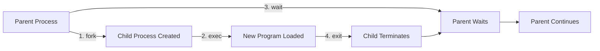
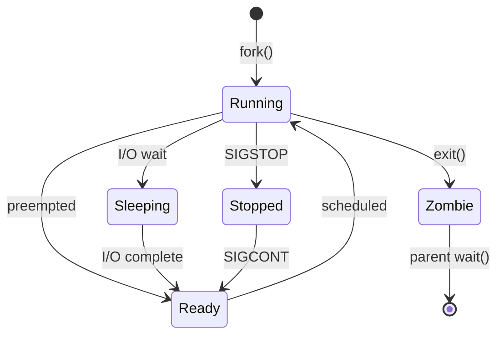

# Processes and Jobs - Complete Guide

> [!summary] One-Stop Mental Model
> A **process** is a running instance of a program with its own memory space, file descriptors, and PID. The kernel manages processes through the **process lifecycle** (fork → exec → wait → exit), uses **signals** for IPC, and provides **job control** for interactive shells. Every process lives in `/proc/<PID>/` with complete runtime information.

> [!tip] Quick Jump
> - Process lifecycle: [[#Process Lifecycle fork exec wait exit]]
> - Signals: [[#Signals Complete Reference]]
> - /proc filesystem: [[#The proc Filesystem]]
> - Job control: [[#Job Control in Interactive Shells]]
> - Troubleshooting: [[Linux/04_Playbooks/01_Investigate_High_CPU_or_Load]]

---

## Table of Contents

1. [What is a Process?](#what-is-a-process)
2. [Process vs Thread vs Job](#process-vs-thread-vs-job)
3. [Process Lifecycle: fork, exec, wait, exit](#process-lifecycle-fork-exec-wait-exit)
4. [Process States](#process-states)
5. [Process IDs (PID, PPID, PGID, SID)](#process-ids)
6. [Viewing Processes](#viewing-processes)
7. [The /proc Filesystem](#the-proc-filesystem)
8. [Process Memory Layout](#process-memory-layout)
9. [Signals: Complete Reference](#signals-complete-reference)
10. [Signal Handling Internals](#signal-handling-internals)
11. [Job Control in Interactive Shells](#job-control-in-interactive-shells)
12. [Process Groups and Sessions](#process-groups-and-sessions)
13. [Orphans and Zombies](#orphans-and-zombies)
14. [Process Priority and Nice Values](#process-priority-and-nice-values)
15. [Common Pitfalls and Gotchas](#common-pitfalls-and-gotchas)
16. [Real-World Patterns](#real-world-patterns)
17. [Interview Corner](#interview-corner)
18. [Cheat Sheet](#cheat-sheet)
19. [References](#references)

---

## What is a Process?

A **process** is an instance of a program in execution, consisting of:

```
┌─────────────────────────────────────────────┐
│              PROCESS                        │
├─────────────────────────────────────────────┤
│  1. CODE (Text Segment)                     │
│     - Executable instructions               │
│     - Shared, read-only                     │
├─────────────────────────────────────────────┤
│  2. DATA (Data Segment)                     │
│     - Initialized global/static variables   │
├─────────────────────────────────────────────┤
│  3. BSS (Uninitialized Data)                │
│     - Uninitialized global/static variables │
├─────────────────────────────────────────────┤
│  4. HEAP (Dynamic Memory)                   │
│     - malloc(), new, grows upward           │
├─────────────────────────────────────────────┤
│  5. STACK (Function Calls)                  │
│     - Local variables, grows downward       │
├─────────────────────────────────────────────┤
│  6. KERNEL SPACE                            │
│     - Process Control Block (PCB)           │
│     - File descriptors, signal handlers     │
│     - Scheduling info, memory mappings      │
└─────────────────────────────────────────────┘
```

### Key Process Attributes

| Attribute | Description | View Command |
|-----------|-------------|--------------|
| **PID** | Process ID (unique identifier) | `echo $$` (current shell) |
| **PPID** | Parent Process ID | `ps -o ppid= -p <PID>` |
| **UID** | User ID (owner) | `ps -o uid= -p <PID>` |
| **GID** | Group ID | `ps -o gid= -p <PID>` |
| **Priority** | Scheduling priority | `ps -o pri= -p <PID>` |
| **Nice** | Niceness value (-20 to 19) | `ps -o nice= -p <PID>` |
| **State** | Current state (R, S, D, Z, T) | `ps -o state= -p <PID>` |
| **TTY** | Controlling terminal | `ps -o tty= -p <PID>` |
| **Memory** | Virtual/Resident memory | `ps -o vsz,rss= -p <PID>` |
| **Command** | Executable name | `ps -o comm= -p <PID>` |

---

## Process vs Thread vs Job

### Process vs Thread

```
┌─────────────────────────────────────────────┐
│           PROCESS                           │
│  ┌───────────────────────────────────────┐  │
│  │ Memory Space (isolated)               │  │
│  │ ┌──────────┐  ┌──────────┐           │  │
│  │ │ Thread 1 │  │ Thread 2 │           │  │
│  │ │ (TID 10) │  │ (TID 11) │           │  │
│  │ │ Stack 1  │  │ Stack 2  │           │  │
│  │ └──────────┘  └──────────┘           │  │
│  │        ↓            ↓                 │  │
│  │     Shared Heap & Data                │  │
│  └───────────────────────────────────────┘  │
└─────────────────────────────────────────────┘
```

| Aspect | Process | Thread |
|--------|---------|--------|
| Memory | Separate address space | Shared address space |
| Creation | Slow (`fork()`) | Fast (`pthread_create()`) |
| Communication | IPC (pipes, sockets, shared memory) | Shared memory (direct) |
| Context switch | Expensive | Cheap |
| Isolation | Strong (crashes don't affect others) | Weak (crash kills all threads) |
| ID | PID | TID (Thread ID) |

### Job (Shell Concept)

A **job** is a **pipeline** or **command group** managed by the shell:

```bash
# Single process job
sleep 100 &

# Pipeline job (multiple processes, one job)
cat file | grep pattern | sort &

# Command group job
(cd /tmp && ls -la) &
```

```
Shell Job Table:
┌──────┬─────────────────────┬────────┐
│ Job# │ Command             │ State  │
├──────┼─────────────────────┼────────┤
│ [1]  │ sleep 100           │ Running│
│ [2]  │ cat | grep | sort   │ Stopped│
│ [3]  │ (cd /tmp && ls -la) │ Running│
└──────┴─────────────────────┴────────┘
```

---

## Process Lifecycle: fork, exec, wait, exit

### The Four Syscalls



### 1. fork() - Create Child Process

```c
#include <unistd.h>
#include <stdio.h>

int main() {
    printf("Before fork, PID: %d\n", getpid());
    
    pid_t pid = fork();  // Creates child process
    
    if (pid < 0) {
        // Fork failed
        perror("fork");
        return 1;
    } else if (pid == 0) {
        // Child process
        printf("Child: PID=%d, PPID=%d\n", getpid(), getppid());
    } else {
        // Parent process
        printf("Parent: PID=%d, Child PID=%d\n", getpid(), pid);
    }
    
    return 0;
}
```

**What fork() does**:
1. Creates a **copy** of the parent process (copy-on-write optimization)
2. Child gets **new PID**
3. Child inherits: open file descriptors, environment variables, signal handlers
4. Returns **0 in child**, **child's PID in parent**, **-1 on error**

**Visual representation**:
```
Before fork:
┌─────────────────┐
│ Parent (PID 100)│
└─────────────────┘

After fork:
┌─────────────────┐
│ Parent (PID 100)│
│ fork() → 101    │
└─────────────────┘
        │
        │ (copy)
        ↓
┌─────────────────┐
│ Child (PID 101) │
│ fork() → 0      │
│ PPID = 100      │
└─────────────────┘
```

### 2. exec() - Replace Process Image

```c
#include <unistd.h>

int main() {
    char *args[] = {"/bin/ls", "-la", NULL};
    
    // Replace current process with /bin/ls
    execv("/bin/ls", args);
    
    // If exec succeeds, this line never runs
    perror("exec failed");
    return 1;
}
```

**exec() family**:
```bash
execl("/bin/ls", "ls", "-la", NULL);           # List args
execlp("ls", "ls", "-la", NULL);               # Search PATH
execle("/bin/ls", "ls", "-la", NULL, envp);    # Custom environment
execv("/bin/ls", args);                        # Array of args
execvp("ls", args);                            # Search PATH
execve("/bin/ls", args, envp);                 # Array + env (syscall)
```

**What exec() does**:
1. **Replaces** code, data, heap, stack with new program
2. **Preserves** PID, PPID, file descriptors (unless FD_CLOEXEC set)
3. **Resets** signal handlers to default
4. **Never returns** if successful (process is replaced)

### 3. wait() - Wait for Child to Exit

```c
#include <sys/wait.h>
#include <unistd.h>
#include <stdio.h>

int main() {
    pid_t pid = fork();
    
    if (pid == 0) {
        // Child
        printf("Child sleeping...\n");
        sleep(2);
        return 42;  // Exit status
    } else {
        // Parent
        int status;
        pid_t child = wait(&status);  // Blocks until child exits
        
        if (WIFEXITED(status)) {
            printf("Child %d exited with status %d\n", 
                   child, WEXITSTATUS(status));  // 42
        }
    }
    
    return 0;
}
```

**wait() variants**:
```c
wait(&status);                      // Wait for any child
waitpid(pid, &status, 0);           // Wait for specific child
waitpid(-1, &status, WNOHANG);      // Non-blocking wait
waitpid(-1, &status, WUNTRACED);    // Also return if child stopped
```

### 4. exit() - Terminate Process

```c
#include <stdlib.h>

exit(0);       // Normal termination (cleans up, flushes buffers)
_exit(1);      // Immediate termination (no cleanup)
_Exit(1);      // Same as _exit (POSIX)
```

**Exit status conventions**:
- `0`: Success
- `1-127`: Failure (command-specific)
- `128+N`: Terminated by signal N (e.g., 130 = Ctrl+C)

---

## Process States



| State | Symbol | Meaning | Example |
|-------|--------|---------|---------|
| **Running** | `R` | Executing on CPU or in run queue | Active computation |
| **Sleeping (interruptible)** | `S` | Waiting for event, can be interrupted | Reading file, waiting for network |
| **Sleeping (uninterruptible)** | `D` | Waiting for I/O, cannot be interrupted | Disk I/O, NFS mount |
| **Stopped** | `T` | Suspended by signal (Ctrl+Z) | Debugger breakpoint |
| **Zombie** | `Z` | Terminated but not reaped by parent | Parent hasn't called wait() |
| **Idle** | `I` | Idle kernel thread | - |

```bash
# View process states
ps aux | awk '{print $8}' | sort | uniq -c
# Output:
#  150 S    (sleeping)
#   10 R    (running)
#    2 D    (uninterruptible)
#    1 Z    (zombie)

# Find uninterruptible sleep processes (potential hang)
ps aux | grep ' D '

# Find zombie processes
ps aux | grep ' Z '
ps aux | awk '$8=="Z"'
```

**Additional state modifiers**:
- `<` : High priority (nice < 0)
- `N` : Low priority (nice > 0)
- `L` : Has pages locked in memory
- `s` : Session leader
- `l` : Multi-threaded
- `+` : Foreground process group

---

## Process IDs (PID, PPID, PGID, SID)

Every process has multiple IDs for different grouping purposes:

```
Session (SID)
│
├─ Process Group (PGID)
│  ├─ Process 1 (PID, PPID)
│  ├─ Process 2 (PID, PPID)
│  └─ Process 3 (PID, PPID)
│
└─ Process Group (PGID)
   ├─ Process 4 (PID, PPID)
   └─ Process 5 (PID, PPID)
```

| ID Type | Name | Purpose | Get Command |
|---------|------|---------|-------------|
| **PID** | Process ID | Unique process identifier | `echo $$` |
| **PPID** | Parent Process ID | Who created this process | `ps -o ppid= -p $$` |
| **PGID** | Process Group ID | Job control grouping | `ps -o pgid= -p $$` |
| **SID** | Session ID | Terminal session grouping | `ps -o sid= -p $$` |
| **TID** | Thread ID | Thread within process | `ps -T -p <PID>` |

### Special PIDs

```bash
echo $$           # Current shell PID
echo $PPID        # Parent shell PID
echo $!           # PID of last background job

# PID 0: Kernel scheduler (swapper)
# PID 1: init/systemd (first user process, adopts orphans)
ps -p 1
# PID TTY      TIME CMD
#   1 ?    00:00:05 systemd

# View PID, PPID, PGID, SID
ps -eo pid,ppid,pgid,sid,comm
```

---

## Viewing Processes

### ps Command Variants

```bash
# BSD style (no dash)
ps aux              # All processes, user-oriented output
ps auxf             # With ASCII process tree
ps auxww            # Full command (no truncation)

# System V style (with dash)
ps -ef              # All processes, full format
ps -eLf             # Include threads
ps -eF              # Extra full format (memory info)

# Custom output
ps -eo pid,ppid,cmd,%mem,%cpu --sort=-%cpu | head
ps -eo pid,stat,comm

# Process tree
ps -ejH             # Tree with PGID and SID
pstree -p           # Tree with PIDs
pstree -a           # Tree with arguments

# Filter by user
ps -u username
ps -U 1000

# Filter by name
ps -C firefox       # By command name
pgrep -a firefox    # By name (with full command)
pgrep -f "java.*myapp"  # By pattern
```

### top / htop

```bash
# Interactive process viewer
top
# Keyboard shortcuts:
# h - Help
# k - Kill process
# r - Renice
# M - Sort by memory
# P - Sort by CPU
# 1 - Show individual CPUs
# q - Quit

# htop (enhanced top, if installed)
htop
# Features: Mouse support, tree view, search, filter
```

### proc-based Queries

```bash
# Process working directory
pwdx <PID>
ls -l /proc/<PID>/cwd

# Open files
lsof -p <PID>

# Memory maps
cat /proc/<PID>/maps
pmap <PID>

# Environment variables
cat /proc/<PID>/environ | tr '\0' '\n'

# Command line
cat /proc/<PID>/cmdline | tr '\0' ' '

# Current status
cat /proc/<PID>/status
```

---

## The /proc Filesystem

`/proc` is a **pseudo-filesystem** exposing kernel data structures as files:

```
/proc/
├── <PID>/          # Per-process directories
│   ├── cmdline     # Command line arguments (null-separated)
│   ├── cwd         # Symlink to current working directory
│   ├── environ     # Environment variables (null-separated)
│   ├── exe         # Symlink to executable
│   ├── fd/         # File descriptors (symlinks)
│   ├── maps        # Memory mappings
│   ├── stat        # Process status (machine-readable)
│   ├── status      # Process status (human-readable)
│   ├── mem         # Process memory (for debugging)
│   ├── limits      # Resource limits
│   ├── task/       # Threads (TIDs)
│   └── ...
├── cpuinfo         # CPU information
├── meminfo         # Memory information
├── loadavg         # Load average
├── uptime          # System uptime
├── version         # Kernel version
├── filesystems     # Supported filesystems
├── sys/            # Kernel parameters (sysctl)
└── ...
```

### Useful /proc Queries

```bash
# Process command line
cat /proc/<PID>/cmdline | tr '\0' ' '

# Process environment
cat /proc/<PID>/environ | tr '\0' '\n'

# Current working directory
readlink /proc/<PID>/cwd

# Executable path
readlink /proc/<PID>/exe

# Open file descriptors
ls -l /proc/<PID>/fd
# 0 -> /dev/pts/0  (stdin)
# 1 -> /dev/pts/0  (stdout)
# 2 -> /dev/pts/0  (stderr)
# 3 -> /var/log/app.log

# Memory usage
cat /proc/<PID>/status | grep -E 'Vm|Rss'
# VmSize:  1234 kB  (virtual memory)
# VmRSS:    567 kB  (resident set size, actual RAM)

# CPU and memory stats
cat /proc/<PID>/stat
# Field 14: utime (user CPU time, jiffies)
# Field 15: stime (kernel CPU time, jiffies)
# Field 23: vsize (virtual memory, bytes)
# Field 24: rss (resident set size, pages)

# Threads
ls /proc/<PID>/task
# Each subdirectory is a thread (TID)

# System-wide info
cat /proc/cpuinfo       # CPU details
cat /proc/meminfo       # Memory details
cat /proc/loadavg       # 1/5/15 min load averages
cat /proc/uptime        # Seconds since boot
```

---

## Process Memory Layout

```
┌─────────────────────────────────────────┐ 0xFFFFFFFF (4GB)
│         KERNEL SPACE                    │
│ (Process cannot access directly)        │
├─────────────────────────────────────────┤ 0xC0000000 (3GB)
│         USER SPACE                      │
│                                         │
│  ┌─────────────────────────────────┐   │ High addresses
│  │       STACK (grows down)        │   │
│  │   - Local variables             │   │
│  │   - Function call frames        │   │
│  └─────────────────────────────────┘   │
│              ↓ ↓ ↓                     │
│                                         │
│              (unused)                   │
│                                         │
│              ↑ ↑ ↑                     │
│  ┌─────────────────────────────────┐   │
│  │       HEAP (grows up)            │   │
│  │   - malloc(), new               │   │
│  │   - Dynamic allocation          │   │
│  └─────────────────────────────────┘   │
│  ┌─────────────────────────────────┐   │
│  │   BSS (Uninitialized Data)      │   │
│  │   - Global/static vars = 0      │   │
│  └─────────────────────────────────┘   │
│  ┌─────────────────────────────────┐   │
│  │   DATA (Initialized Data)       │   │
│  │   - Global/static variables     │   │
│  └─────────────────────────────────┘   │
│  ┌─────────────────────────────────┐   │
│  │   TEXT (Code)                   │   │
│  │   - Executable instructions     │   │
│  │   - Read-only                   │   │
│  └─────────────────────────────────┘   │ 0x08048000 (typical)
└─────────────────────────────────────────┘ 0x00000000

```

```bash
# View memory layout
cat /proc/<PID>/maps
# Output:
# 00400000-00401000 r-xp 00000000 08:01 1234 /bin/program  (TEXT)
# 00600000-00601000 r--p 00000000 08:01 1234 /bin/program  (DATA)
# 00601000-00602000 rw-p 00001000 08:01 1234 /bin/program  (BSS)
# 01234000-01256000 rw-p 00000000 00:00 0    [heap]
# 7fff12340000-7fff12361000 rw-p 00000000 00:00 0  [stack]

# Memory usage summary
pmap -x <PID>
```

---

## Signals: Complete Reference

**Signals** are software interrupts for inter-process communication and error handling.

### Standard Signals

| Signal | Number | Default Action | Meaning | Can Catch? |
|--------|--------|----------------|---------|------------|
| `SIGHUP` | 1 | Terminate | Hangup (terminal closed) | ✅ |
| `SIGINT` | 2 | Terminate | Interrupt (Ctrl+C) | ✅ |
| `SIGQUIT` | 3 | Core dump | Quit (Ctrl+\\) | ✅ |
| `SIGILL` | 4 | Core dump | Illegal instruction | ✅ |
| `SIGTRAP` | 5 | Core dump | Trace trap (debugger) | ✅ |
| `SIGABRT` | 6 | Core dump | Abort (assert failed) | ✅ |
| `SIGBUS` | 7 | Core dump | Bus error (alignment) | ✅ |
| `SIGFPE` | 8 | Core dump | Floating point exception | ✅ |
| `SIGKILL` | 9 | Terminate | **Kill (cannot catch)** | ❌ |
| `SIGUSR1` | 10 | Terminate | User-defined signal 1 | ✅ |
| `SIGSEGV` | 11 | Core dump | Segmentation fault | ✅ |
| `SIGUSR2` | 12 | Terminate | User-defined signal 2 | ✅ |
| `SIGPIPE` | 13 | Terminate | Broken pipe | ✅ |
| `SIGALRM` | 14 | Terminate | Alarm clock (timer) | ✅ |
| `SIGTERM` | 15 | Terminate | Termination (graceful) | ✅ |
| `SIGSTKFLT` | 16 | Terminate | Stack fault | ✅ |
| `SIGCHLD` | 17 | Ignore | Child stopped/terminated | ✅ |
| `SIGCONT` | 18 | Continue | Continue if stopped | ✅ |
| `SIGSTOP` | 19 | Stop | **Stop (cannot catch)** | ❌ |
| `SIGTSTP` | 20 | Stop | Stop (Ctrl+Z) | ✅ |
| `SIGTTIN` | 21 | Stop | Background read from tty | ✅ |
| `SIGTTOU` | 22 | Stop | Background write to tty | ✅ |
| `SIGURG` | 23 | Ignore | Urgent data on socket | ✅ |
| `SIGXCPU` | 24 | Core dump | CPU time limit exceeded | ✅ |
| `SIGXFSZ` | 25 | Core dump | File size limit exceeded | ✅ |
| `SIGVTALRM` | 26 | Terminate | Virtual timer expired | ✅ |
| `SIGPROF` | 27 | Terminate | Profiling timer expired | ✅ |
| `SIGWINCH` | 28 | Ignore | Window size changed | ✅ |
| `SIGIO` | 29 | Terminate | I/O possible | ✅ |
| `SIGPWR` | 30 | Terminate | Power failure | ✅ |
| `SIGSYS` | 31 | Core dump | Bad system call | ✅ |

### Sending Signals

```bash
# Send SIGTERM (15) - graceful shutdown
kill <PID>
kill -15 <PID>
kill -TERM <PID>

# Send SIGKILL (9) - force kill
kill -9 <PID>
kill -KILL <PID>

# Send SIGHUP (1) - reload config
kill -HUP <PID>

# Send SIGUSR1/SIGUSR2 (custom behavior)
kill -USR1 <PID>
kill -USR2 <PID>

# Send to process group
kill -TERM -<PGID>

# Send to all processes by name
killall nginx
killall -9 firefox

# Send to processes matching pattern
pkill -TERM -f "java.*myapp"
pkill -9 python

# Signal all processes (except init)
kill -TERM -1
```

### Keyboard Signals

| Key Combo | Signal | Number | Action |
|-----------|--------|--------|--------|
| `Ctrl+C` | SIGINT | 2 | Interrupt (terminate) |
| `Ctrl+\` | SIGQUIT | 3 | Quit (core dump) |
| `Ctrl+Z` | SIGTSTP | 20 | Stop (suspend) |

---

## Signal Handling Internals

### Default Actions

1. **Terminate**: Process exits
2. **Ignore**: Signal has no effect
3. **Core dump**: Process exits and dumps core (for debugging)
4. **Stop**: Process is suspended
5. **Continue**: Resume stopped process

### Custom Signal Handlers (Trap)

```bash
#!/bin/bash

# Trap signals
trap 'echo "Caught SIGINT (Ctrl+C)"' INT
trap 'echo "Caught SIGTERM"; cleanup; exit' TERM
trap 'echo "Exiting..."; cleanup' EXIT

cleanup() {
    echo "Cleaning up temporary files..."
    rm -f /tmp/tempfile
}

# Main loop
echo "PID: $$"
echo "Press Ctrl+C to test SIGINT"
while true; do
    sleep 1
done
```

**Signals that CANNOT be caught**:
- `SIGKILL` (9): Guaranteed kill
- `SIGSTOP` (19): Guaranteed stop

### Signal Queue and Pending

```bash
# View pending signals
cat /proc/<PID>/status | grep -E 'Sig(Pnd|Blk|Ign|Cgt)'
# SigPnd: 0000000000000000 (pending signals, bitmask)
# SigBlk: 0000000000000000 (blocked signals)
# SigIgn: 0000000000001000 (ignored signals)
# SigCgt: 0000000180004002 (caught signals)

# Decode signal mask
# Each bit represents a signal number (bit 0 = signal 1, etc.)
```

---

## Job Control in Interactive Shells

**Job control** allows managing multiple processes from a single shell:

```
Shell manages jobs:
┌─────────────────────────────────────┐
│ Shell (bash)                        │
│ ┌─────────────────────────────────┐ │
│ │ Job 1: sleep 100 (background)   │ │
│ │ Job 2: vim file.txt (foreground)│ │
│ │ Job 3: ./script.sh (stopped)    │ │
│ └─────────────────────────────────┘ │
└─────────────────────────────────────┘
```

### Job Control Commands

```bash
# Start job in background
sleep 1000 &
# [1] 12345 (job number, PID)

# List jobs
jobs
# [1]+  Running    sleep 1000 &
# [2]-  Stopped    vim file.txt

# Bring job to foreground
fg %1           # By job number
fg              # Default: most recent job

# Send job to background
bg %1           # Resume stopped job in background
bg              # Default: most recent stopped job

# Stop foreground job
# (press Ctrl+Z in the running job)

# Kill job
kill %1         # By job number
kill %2

# Disown job (detach from shell)
disown %1       # Job continues even if shell exits
disown -a       # Disown all jobs
disown -h %1    # Don't send SIGHUP on shell exit

# Reference jobs
%1              # Job 1
%2              # Job 2
%%              # Current job
%+              # Current job (same as %%)
%-              # Previous job
%?str           # Job with 'str' in command
```

### Job States

```bash
jobs -l         # List with PIDs
jobs -p         # List PIDs only
jobs -r         # Running jobs only
jobs -s         # Stopped jobs only

# Output:
# [1]+ 12345 Running   sleep 1000 &
# [2]- 12346 Stopped   vim file.txt
```

---

## Process Groups and Sessions

### Hierarchy

```
Session (login shell)
└─ Process Group 1 (foreground)
   ├─ bash (session leader)
   └─ ls | grep foo (pipeline)
      ├─ ls
      └─ grep

└─ Process Group 2 (background)
   └─ sleep 1000 &
```

### Creating Sessions

```bash
# Start new session (detached from terminal)
setsid command          # Creates new session, command is session leader
nohup command &         # Ignores SIGHUP, redirects output to nohup.out

# Run command in new session (immune to terminal close)
setsid bash -c 'sleep 1000'

# Screen/tmux create persistent sessions
screen                  # Terminal multiplexer
tmux                    # Modern alternative to screen
```

---

## Orphans and Zombies

### Orphan Processes

**Orphan**: Process whose parent has exited. Adopted by `init` (PID 1).

```bash
# Create orphan
bash -c 'sleep 1000 &'  # Parent bash exits immediately
# sleep is now orphan, adopted by PID 1 (systemd/init)

ps -eo pid,ppid,comm | grep sleep
# PID  PPID  COMM
# 1234    1  sleep
```

### Zombie Processes

**Zombie** (defunct): Process that has exited but parent hasn't called `wait()` yet.

```c
// Parent creates zombie by not waiting
pid_t pid = fork();
if (pid == 0) {
    exit(0);  // Child exits immediately
}
// Parent doesn't call wait() → child becomes zombie
sleep(100);
```

```bash
# Find zombies
ps aux | grep 'Z'
ps aux | awk '$8=="Z"'

# Zombies show as <defunct>
# PID  STAT  COMMAND
# 1234  Z    [sleep] <defunct>

# How to remove zombies:
# 1. Kill parent (zombies get reaped by init)
kill <PPID>

# 2. Force parent to wait (send SIGCHLD)
kill -CHLD <PPID>

# Zombies themselves cannot be killed (already dead!)
kill -9 <zombie_PID>  # No effect
```

**Why zombies exist**: Kernel keeps exit status until parent reads it via `wait()`.

---

## Process Priority and Nice Values

### Priority Basics

- **Priority**: Kernel-assigned value (0-139), lower = higher priority
  - Real-time: 0-99
  - Normal: 100-139 (maps to nice -20 to +19)
- **Nice**: User-controlled value (-20 to +19)
  - Lower nice = higher priority
  - Default: 0
  - Only root can set negative nice (higher priority)

```
Priority = 120 + Nice value

Nice -20 → Priority 100 (highest user priority)
Nice   0 → Priority 120 (default)
Nice +19 → Priority 139 (lowest user priority)
```

### Using Nice and Renice

```bash
# Start process with custom nice value
nice -n 10 command      # Nice +10 (lower priority)
nice -n -10 command     # Nice -10 (higher priority, requires root)

# View nice value
ps -o pid,ni,comm
top                     # Press 'N' to sort by nice

# Change nice of running process
renice +5 <PID>         # Decrease priority
renice -5 <PID>         # Increase priority (requires root)
renice +10 -u username  # All processes of user
renice +5 -g group      # All processes of group

# Using /proc
cat /proc/<PID>/stat | awk '{print $19}'  # Nice value
```

---

## Common Pitfalls and Gotchas

> [!warning] Kill -9 is Not Always the Answer
> ```bash
> # WRONG: Always use -9
> kill -9 <PID>
> 
> # CORRECT: Try graceful shutdown first
> kill <PID>          # SIGTERM (graceful)
> sleep 5
> kill -9 <PID>       # SIGKILL (force) only if necessary
> 
> # Why: SIGKILL cannot be caught, preventing cleanup:
> # - Temp files not removed
> # - Locks not released
> # - Connections not closed properly
> ```

> [!warning] Zombie Processes Cannot Be Killed
> ```bash
> # This does NOT work
> kill -9 <zombie_PID>
> 
> # Zombies are already dead, waiting for parent to reap
> # Solution: Kill the parent or wait for it to exit
> kill <PPID>
> ```

> [!warning] Background Job Inherits stdin/stdout
> ```bash
> # Background job still writes to terminal
> ./chatty_script.sh &
> # Output spams terminal while you type
> 
> # CORRECT: Redirect output
> ./chatty_script.sh > /dev/null 2>&1 &
> 
> # Or use nohup
> nohup ./chatty_script.sh &
> ```

> [!warning] Disown Doesn't Make Process Persistent After Reboot
> ```bash
> # Disown only prevents SIGHUP from shell exit
> sleep 1000 &
> disown
> 
> # Process still dies on system reboot
> # For persistence, use systemd service or init script
> ```

---

## Real-World Patterns

### Safe Process Kill Script

```bash
#!/bin/bash

graceful_kill() {
    local pid=$1
    local timeout=30
    
    # Try SIGTERM first
    kill -TERM "$pid" 2>/dev/null || return 1
    
    # Wait for process to exit
    local count=0
    while kill -0 "$pid" 2>/dev/null; do
        sleep 1
        ((count++))
        if [ $count -ge $timeout ]; then
            echo "Timeout, sending SIGKILL"
            kill -KILL "$pid"
            return 2
        fi
    done
    
    echo "Process $pid terminated gracefully"
    return 0
}

graceful_kill 12345
```

### Monitor and Restart Service

```bash
#!/bin/bash

SERVICE="myapp"
CHECK_INTERVAL=60

while true; do
    if ! pgrep -f "$SERVICE" > /dev/null; then
        echo "$(date): $SERVICE not running, restarting..."
        /usr/local/bin/start_myapp.sh
    fi
    sleep $CHECK_INTERVAL
done
```

### Find Resource Hogs

```bash
# Top 10 CPU consumers
ps aux --sort=-%cpu | head -11

# Top 10 memory consumers
ps aux --sort=-%mem | head -11

# Processes using most open files
lsof | awk '{print $1}' | sort | uniq -c | sort -rn | head -10

# Long-running processes
ps -eo pid,etime,comm --sort=-etime | head -20
```

---

## Interview Corner

> [!question]- Q1: What happens when you run `./program &`?
> **Answer**: The shell:
> 1. Forks a child process
> 2. Child calls `exec()` to run `./program`
> 3. Parent immediately returns control to user (doesn't wait)
> 4. Background job added to job table
> 5. Shell redirects stdin to `/dev/null` (unless explicitly redirected)
> 6. stdout/stderr still connected to terminal (unless redirected)
> 7. Job continues even if terminal closes (unless SIGHUP sent)

> [!question]- Q2: What's the difference between kill -9 and kill -15?
> **Answer**:
> - **kill -15 (SIGTERM)**: Graceful termination. Process can catch signal, cleanup (close files, release locks, save state), then exit. This is the **preferred** method.
> - **kill -9 (SIGKILL)**: Forceful termination. **Cannot be caught or ignored**. Kernel immediately terminates process. No cleanup occurs. Use only when SIGTERM fails.

> [!question]- Q3: Explain fork() vs exec()
> **Answer**:
> - **fork()**: Creates a **copy** of the parent process. Both processes continue from the same point. Returns 0 in child, child's PID in parent.
> - **exec()**: **Replaces** the current process image with a new program. Same PID, but new code/data. Never returns if successful.
> 
> Typical pattern: `fork()` to create child, then child calls `exec()` to run different program.

> [!question]- Q4: What is a zombie process and how do you remove it?
> **Answer**: A zombie is a process that has **terminated** but whose exit status hasn't been read by its parent (via `wait()`). The process is dead but its PCB remains in the kernel process table.
> 
> **To remove**:
> - Kill the **parent** process (zombies get reaped by init)
> - Send **SIGCHLD** to parent (may trigger wait())
> - Wait for parent to exit normally
> 
> **Cannot kill zombie directly** (already dead).

> [!question]- Q5: What's the difference between fg, bg, and disown?
> **Answer**:
> - **fg**: Brings stopped or background job to **foreground** (takes terminal control)
> - **bg**: Resumes stopped job in **background** (continues running without terminal)
> - **disown**: Removes job from shell's job table. Job continues but shell won't send SIGHUP on exit.

> [!question]- Q6: Why can't you kill PID 1?
> **Answer**: PID 1 is `init`/`systemd`, the first userspace process. It:
> - Cannot receive **SIGKILL** or **SIGSTOP** (kernel prevents it)
> - Adopts all orphaned processes
> - Responsible for shutting down the system cleanly
> 
> Killing PID 1 would crash the system. Only `reboot`/`shutdown` commands can stop it.

> [!question]- Q7: What happens when parent exits before child?
> **Answer**: The child becomes an **orphan** and is **adopted by PID 1** (init/systemd). The child's PPID changes from the original parent's PID to 1. The child continues running normally under init's supervision.

> [!question]- Q8: How does Ctrl+C work?
> **Answer**:
> 1. Terminal driver receives `Ctrl+C` keystroke
> 2. Driver sends **SIGINT (2)** to the **foreground process group**
> 3. All processes in foreground group receive SIGINT
> 4. Default action: terminate (unless signal is caught/ignored)
> 5. Shell regains control and displays new prompt

---

## Cheat Sheet

### Process Viewing

```bash
ps aux              # All processes
ps -ef              # All processes (System V)
ps -eLf             # Include threads
top                 # Interactive viewer
htop                # Enhanced top
pstree -p           # Process tree with PIDs
pgrep -af firefox   # Find process by name
```

### Signals

```bash
kill <PID>          # SIGTERM (15, graceful)
kill -9 <PID>       # SIGKILL (9, force)
kill -HUP <PID>     # SIGHUP (1, reload)
killall name        # Kill all by name
pkill -f pattern    # Kill by pattern
```

### Job Control

```bash
command &           # Run in background
jobs                # List jobs
fg %1               # Foreground job 1
bg %1               # Background job 1
Ctrl+Z              # Stop foreground job
disown %1           # Detach job from shell
```

### Process Info

```bash
ps -o pid,ppid,pgid,sid,comm -p <PID>
cat /proc/<PID>/cmdline
lsof -p <PID>       # Open files
pwdx <PID>          # Working directory
```

---

## Cross-Links

- Previous: [[Linux/01_Foundations/02_Files_and_Permissions|Files and Permissions]]
- Next: [[Linux/01_Foundations/04_Packages_and_Environment|Packages and Environment]]
- Related: [[Linux/03_Advanced/01_Performance_Tuning_and_Profiling|Performance Tuning]]
- Troubleshooting: [[Linux/04_Playbooks/01_Investigate_High_CPU_or_Load|High CPU Investigation]]

---

## References

### Official Documentation
- [ps(1) man page](https://man7.org/linux/man-pages/man1/ps.1.html)
- [kill(1) man page](https://man7.org/linux/man-pages/man1/kill.1.html)
- [signal(7) man page](https://man7.org/linux/man-pages/man7/signal.7.html)
- [proc(5) man page](https://man7.org/linux/man-pages/man5/proc.5.html)
- [fork(2) man page](https://man7.org/linux/man-pages/man2/fork.2.html)
- [exec(3) man page](https://man7.org/linux/man-pages/man3/exec.3.html)

### Books
- *The Linux Programming Interface* by Michael Kerrisk - Chapters 24-28 (Processes)
- *Advanced Programming in the UNIX Environment* by Stevens & Rago - Chapters 7-10
- *Understanding the Linux Kernel* by Bovet & Cesati - Chapter 3 (Processes)

### Online Resources
- [Linux Process Management](https://tldp.org/LDP/tlk/kernel/processes.html)
- [/proc Filesystem Guide](https://www.kernel.org/doc/html/latest/filesystems/proc.html)
