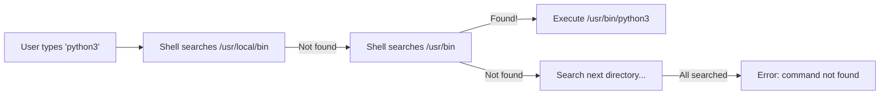
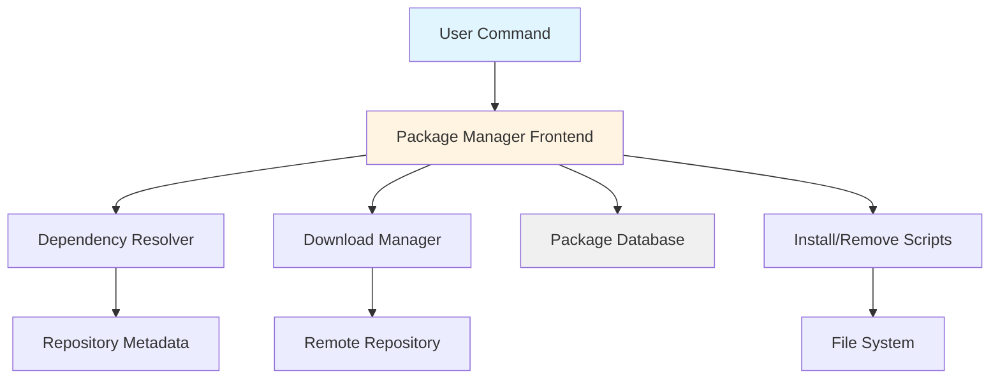
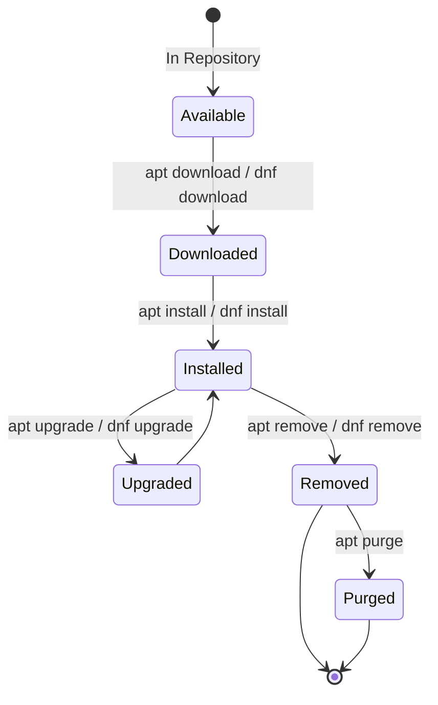

# Packages and Environment

## Overview

Package management and environment configuration are foundational skills for Linux system administration. Package managers automate software installation, dependency resolution, updates, and removal. Environment variables configure shell behavior, application settings, and system-wide paths.

> [!summary] Key Concepts
> - **Package Manager**: Tool that automates installation, updates, and removal of software packages
> - **Repository**: Collection of packages maintained by distribution maintainers or third parties
> - **Dependency Resolution**: Automatic installation of required libraries and packages
> - **Environment Variables**: Named values that affect process behavior and configuration
> - **Shell Configuration**: Files that set environment variables and aliases on shell startup

---

## Environment Variables

### What Are Environment Variables?

Environment variables are **dynamic named values** stored in the shell environment that affect running processes. They configure:
- Search paths for executables and libraries
- Default editors, pagers, and browsers
- Locale and language settings
- Application-specific configuration

```bash
# View all environment variables
printenv
env

# View specific variable
echo "$PATH"
echo "$HOME"
echo "$USER"

# Set variable for current shell
EDITOR=vim

# Export variable to child processes
export EDITOR=vim

# Set and export in one line
export PYTHONPATH=/opt/python/lib
```

### Common Environment Variables

| Variable | Purpose | Example Value |
|----------|---------|---------------|
| `PATH` | Search path for executables | `/usr/local/bin:/usr/bin:/bin` |
| `HOME` | User's home directory | `/home/username` |
| `USER` | Current username | `username` |
| `SHELL` | Default shell | `/bin/bash` |
| `EDITOR` | Default text editor | `vim` |
| `LANG` | System language/locale | `en_US.UTF-8` |
| `PS1` | Primary shell prompt | `\u@\h:\w\$` |
| `PWD` | Current working directory | `/home/username/projects` |
| `OLDPWD` | Previous working directory | `/home/username` |
| `TERM` | Terminal type | `xterm-256color` |
| `LD_LIBRARY_PATH` | Shared library search path | `/usr/local/lib` |
| `TMPDIR` | Temporary directory | `/tmp` |

### PATH Variable Deep Dive

The `PATH` variable is a **colon-separated list of directories** where the shell searches for executable commands.

```bash
# View current PATH
echo "$PATH"
# Output: /usr/local/bin:/usr/bin:/bin:/usr/local/sbin:/usr/sbin

# Add directory to PATH (temporary - current shell only)
export PATH="/opt/myapp/bin:$PATH"

# Add to end of PATH
export PATH="$PATH:/home/username/scripts"

# View which executable will be used
which python3
type python3

# View all matching executables in PATH
which -a python3
```

**PATH Search Order**:
1. Shell searches directories **left to right**
2. First matching executable is used
3. If no match found, "command not found" error



### Setting Environment Variables

#### Temporary (Current Shell Only)

```bash
# Set variable
export DATABASE_URL="postgresql://localhost/mydb"

# Use in command
psql "$DATABASE_URL"

# Variable lost when shell exits
```

#### Permanent (User-Specific)

Edit shell configuration files:

**Bash**: `~/.bashrc` (interactive shells) or `~/.bash_profile` (login shells)
```bash
# Add to ~/.bashrc
export EDITOR=vim
export GOPATH="$HOME/go"
export PATH="$GOPATH/bin:$PATH"

# Reload configuration
source ~/.bashrc
```

**Zsh**: `~/.zshrc`
```bash
# Add to ~/.zshrc
export EDITOR=nvim
export PATH="$HOME/.local/bin:$PATH"

# Reload
source ~/.zshrc
```

**Fish**: `~/.config/fish/config.fish`
```fish
# Fish uses different syntax
set -x EDITOR nvim
set -x PATH $HOME/.local/bin $PATH
```

#### System-Wide (All Users)

```bash
# /etc/environment - system-wide environment variables
# Format: KEY=VALUE (no export keyword)
PATH="/usr/local/sbin:/usr/local/bin:/usr/sbin:/usr/bin:/sbin:/bin"
JAVA_HOME="/usr/lib/jvm/java-17-openjdk"

# /etc/profile - executed for login shells
export HISTSIZE=10000
export EDITOR=vim

# /etc/profile.d/*.sh - modular configuration
# Create /etc/profile.d/custom.sh
export MY_APP_HOME=/opt/myapp
```

### Variable Scoping and Inheritance

```bash
# Local variable (not exported)
LOCAL_VAR="local"
bash -c 'echo $LOCAL_VAR'  # Empty - child process doesn't see it

# Exported variable (inherited by child processes)
export EXPORTED_VAR="exported"
bash -c 'echo $EXPORTED_VAR'  # Prints "exported"

# One-time environment variable for single command
DATABASE_URL="postgres://localhost/test" rails console

# Unset variable
unset EXPORTED_VAR
```

### Shell Configuration Files Loading Order

**Bash Login Shell** (SSH, TTY):
```
/etc/profile
  ↓
~/.bash_profile or ~/.bash_login or ~/.profile (first found)
  ↓
~/.bashrc (if called by above)
```

**Bash Interactive Non-Login Shell** (terminal emulator):
```
~/.bashrc
```

**Zsh**:
```
/etc/zshenv
  ↓
~/.zshenv
  ↓
/etc/zprofile (login)
  ↓
~/.zprofile (login)
  ↓
/etc/zshrc (interactive)
  ↓
~/.zshrc (interactive)
  ↓
/etc/zlogin (login)
  ↓
~/.zlogin (login)
```

---

## Package Management Fundamentals

### Package Manager Architecture



**Components**:
- **Frontend**: User-facing CLI tool (apt, dnf, pacman)
- **Backend**: Core library handling package operations (libapt, rpm, libalpm)
- **Repository**: Remote server hosting packages and metadata
- **Database**: Local cache of installed packages and available packages
- **Package Format**: Archive format containing files and metadata (.deb, .rpm, .pkg.tar.zst)

### Package Lifecycle



---

## Debian/Ubuntu: APT (Advanced Package Tool)

### APT Commands

#### Updating Package Lists

```bash
# Update repository metadata (does NOT install updates)
sudo apt update

# Output shows:
# - Repositories contacted
# - Packages that can be upgraded
# - Any errors fetching metadata
```

#### Installing Packages

```bash
# Install single package
sudo apt install curl

# Install multiple packages
sudo apt install git vim tmux

# Install specific version
sudo apt install docker-ce=5:20.10.21~3-0~ubuntu-focal

# Install without prompting
sudo apt install -y nginx

# Download package without installing
apt download curl

# Install local .deb file
sudo apt install ./package.deb
```

#### Searching and Information

```bash
# Search package names and descriptions
apt search nginx
apt search "web server"

# Show package details
apt show nginx

# List installed packages
apt list --installed

# List upgradable packages
apt list --upgradable

# Show dependencies
apt depends nginx

# Show reverse dependencies (what depends on this)
apt rdepends libssl3
```

#### Upgrading Packages

```bash
# Upgrade all installed packages
sudo apt upgrade

# Upgrade with intelligent dependency handling (may remove packages)
sudo apt full-upgrade

# Upgrade specific package
sudo apt install --only-upgrade nginx

# Show what would be upgraded (dry run)
apt list --upgradable
```

#### Removing Packages

```bash
# Remove package (keep configuration files)
sudo apt remove nginx

# Remove package and configuration files
sudo apt purge nginx

# Remove package and dependencies no longer needed
sudo apt autoremove nginx

# Remove orphaned dependencies
sudo apt autoremove

# Clean up downloaded package files
sudo apt clean       # Remove all
sudo apt autoclean   # Remove obsolete only
```

### APT Internals

#### Repository Configuration

```bash
# Repository sources
cat /etc/apt/sources.list

# Example entry:
# deb http://archive.ubuntu.com/ubuntu/ jammy main restricted
# Format: deb <URL> <distribution> <component1> <component2>...

# Additional repositories
ls /etc/apt/sources.list.d/

# Add repository (PPA example)
sudo add-apt-repository ppa:deadsnakes/ppa
sudo apt update
```

#### Package Database

```bash
# Installed package database
/var/lib/dpkg/status

# Available package cache
/var/lib/apt/lists/

# Downloaded .deb files
/var/cache/apt/archives/
```

#### APT Configuration

```bash
# Main config
/etc/apt/apt.conf

# Config directory
/etc/apt/apt.conf.d/

# Set options
sudo tee /etc/apt/apt.conf.d/99custom <<EOF
APT::Install-Recommends "false";
APT::Install-Suggests "false";
EOF
```

### Advanced APT Usage

```bash
# Hold package at current version (prevent upgrades)
sudo apt-mark hold nginx
sudo apt-mark unhold nginx

# List held packages
apt-mark showhold

# Reinstall package (repair corrupted files)
sudo apt install --reinstall nginx

# Simulate installation (dry run)
sudo apt install -s nginx

# Build dependencies for source compilation
sudo apt build-dep nginx

# Download source code
apt source nginx

# Verify package integrity
debsums nginx
```

---

## RHEL/Fedora/CentOS: DNF/YUM

### DNF Commands (Fedora, CentOS 8+, RHEL 8+)

```bash
# Update repository metadata
sudo dnf check-update

# Install package
sudo dnf install httpd

# Install group of packages
sudo dnf groupinstall "Development Tools"

# Search packages
dnf search nginx

# Show package info
dnf info nginx

# List installed packages
dnf list installed

# Upgrade all packages
sudo dnf upgrade

# Remove package
sudo dnf remove httpd

# Remove orphaned dependencies
sudo dnf autoremove

# Clean cache
sudo dnf clean all

# Show history
dnf history

# Undo last transaction
sudo dnf history undo last
```

### YUM Commands (CentOS 7, RHEL 7)

```bash
# Update metadata
sudo yum check-update

# Install package
sudo yum install httpd

# Search packages
yum search nginx

# Show package info
yum info nginx

# List installed
yum list installed

# Upgrade all
sudo yum update

# Remove package
sudo yum remove httpd

# Clean cache
sudo yum clean all
```

### RPM Package Manager (Low-Level)

```bash
# Install RPM file
sudo rpm -ivh package.rpm
# -i: install, -v: verbose, -h: hash marks (progress)

# Upgrade package
sudo rpm -Uvh package.rpm

# Query installed package
rpm -q nginx

# List all installed packages
rpm -qa

# Show package files
rpm -ql nginx

# Show package info
rpm -qi nginx

# Which package owns a file?
rpm -qf /usr/bin/nginx

# Verify package integrity
rpm -V nginx

# Remove package
sudo rpm -e nginx
```

### DNF/YUM Repository Management

```bash
# List enabled repositories
dnf repolist

# List all repositories (including disabled)
dnf repolist --all

# Enable repository
sudo dnf config-manager --enable epel

# Disable repository
sudo dnf config-manager --disable epel

# Add repository
sudo dnf config-manager --add-repo https://example.com/repo

# Repository config files
/etc/yum.repos.d/

# Example repo file: /etc/yum.repos.d/epel.repo
[epel]
name=Extra Packages for Enterprise Linux $releasever - $basearch
baseurl=https://download.fedoraproject.org/pub/epel/$releasever/Everything/$basearch
enabled=1
gpgcheck=1
gpgkey=https://download.fedoraproject.org/pub/epel/RPM-GPG-KEY-EPEL-$releasever
```

---

## Arch Linux: Pacman

### Pacman Commands

```bash
# Sync package database
sudo pacman -Sy

# Upgrade system
sudo pacman -Syu

# Install package
sudo pacman -S nginx

# Install multiple packages
sudo pacman -S git vim tmux

# Remove package
sudo pacman -R nginx

# Remove package and dependencies
sudo pacman -Rs nginx

# Remove package, dependencies, and config files
sudo pacman -Rns nginx

# Search repository
pacman -Ss nginx

# Search installed packages
pacman -Qs nginx

# Show package info (repository)
pacman -Si nginx

# Show package info (installed)
pacman -Qi nginx

# List files in package
pacman -Ql nginx

# Which package owns a file?
pacman -Qo /usr/bin/nginx

# List orphaned packages
pacman -Qdt

# Remove orphaned packages
sudo pacman -Rns $(pacman -Qdtq)

# Clean package cache
sudo pacman -Sc

# Clean all cache
sudo pacman -Scc
```

### Pacman Configuration

```bash
# Main config
/etc/pacman.conf

# Example configuration:
[options]
HoldPkg     = pacman glibc
Architecture = auto
Color
CheckSpace
ParallelDownloads = 5

[core]
Include = /etc/pacman.d/mirrorlist

[extra]
Include = /etc/pacman.d/mirrorlist
```

### AUR (Arch User Repository)

```bash
# Install AUR helper (yay)
git clone https://aur.archlinux.org/yay.git
cd yay
makepkg -si

# Use yay (pacman wrapper + AUR support)
yay -S package-name      # Install from AUR
yay -Syu                 # Upgrade system + AUR packages
yay -Ss package-name     # Search repos + AUR
```

---

## Cross-Distribution Packaging

### Snap (Ubuntu/Canonical)

```bash
# Install snap daemon (if not present)
sudo apt install snapd

# Install snap package
sudo snap install spotify

# List installed snaps
snap list

# Search snaps
snap find "media player"

# Update all snaps
sudo snap refresh

# Remove snap
sudo snap remove spotify

# View snap info
snap info spotify
```

**Advantages**: Automatic updates, sandboxed, cross-distro  
**Disadvantages**: Larger size, slower startup, Canonical-centric

### Flatpak

```bash
# Install flatpak
sudo apt install flatpak  # Debian/Ubuntu
sudo dnf install flatpak  # Fedora

# Add Flathub repository
flatpak remote-add --if-not-exists flathub https://flathub.org/repo/flathub.flatpakrepo

# Install application
flatpak install flathub org.gimp.GIMP

# Run application
flatpak run org.gimp.GIMP

# List installed apps
flatpak list

# Update all apps
flatpak update

# Remove app
flatpak uninstall org.gimp.GIMP
```

### AppImage

```bash
# Download AppImage
wget https://example.com/app.AppImage

# Make executable
chmod +x app.AppImage

# Run
./app.AppImage

# Optional: Integrate with system
./app.AppImage --appimage-extract
# Creates squashfs-root/ directory with extracted contents
```

**Advantages**: Single file, no installation, portable  
**Disadvantages**: No automatic updates, manual management

---

## Package Management Comparison

| Feature | APT (Debian/Ubuntu) | DNF/YUM (RHEL/Fedora) | Pacman (Arch) |
|---------|---------------------|------------------------|---------------|
| **Package Format** | .deb | .rpm | .pkg.tar.zst |
| **Update Metadata** | `apt update` | `dnf check-update` | `pacman -Sy` |
| **Install** | `apt install pkg` | `dnf install pkg` | `pacman -S pkg` |
| **Remove** | `apt remove pkg` | `dnf remove pkg` | `pacman -R pkg` |
| **Search** | `apt search term` | `dnf search term` | `pacman -Ss term` |
| **Upgrade All** | `apt upgrade` | `dnf upgrade` | `pacman -Syu` |
| **Clean Cache** | `apt clean` | `dnf clean all` | `pacman -Sc` |
| **Show Info** | `apt show pkg` | `dnf info pkg` | `pacman -Si pkg` |
| **List Installed** | `apt list --installed` | `dnf list installed` | `pacman -Q` |
| **Transaction History** | `/var/log/apt/history.log` | `dnf history` | `/var/log/pacman.log` |

---

## Language-Specific Package Managers

### Python: pip

```bash
# Install package
pip install requests

# Install specific version
pip install requests==2.28.0

# Install from requirements file
pip install -r requirements.txt

# List installed packages
pip list

# Show package info
pip show requests

# Upgrade package
pip install --upgrade requests

# Uninstall package
pip uninstall requests

# Create requirements file
pip freeze > requirements.txt
```

### Node.js: npm

```bash
# Install package (project-local)
npm install express

# Install package (global)
npm install -g typescript

# Install from package.json
npm install

# Update packages
npm update

# Remove package
npm uninstall express

# List installed packages
npm list

# Show outdated packages
npm outdated
```

### Ruby: gem

```bash
# Install gem
gem install rails

# List installed gems
gem list

# Update gem
gem update rails

# Uninstall gem
gem uninstall rails

# Install from Gemfile
bundle install
```

---

## Dependency Management

### Understanding Dependencies

```bash
# Show dependencies of package
apt depends nginx           # Debian/Ubuntu
dnf repoquery --requires nginx  # RHEL/Fedora
pacman -Si nginx | grep Depends  # Arch

# Show reverse dependencies (what depends on this package)
apt rdepends libssl3
dnf repoquery --whatrequires libssl3
pacman -Qi libssl3 | grep "Required By"
```

### Dependency Conflicts

**Scenario**: Package A requires libfoo v1, Package B requires libfoo v2

**Solutions**:
1. **Parallel Installation**: Some package managers support multiple versions
2. **Containers**: Isolate conflicting dependencies in containers
3. **Virtual Environments**: Language-specific isolation (Python venv, Node nvm)

```bash
# Python virtual environment
python3 -m venv myproject_env
source myproject_env/bin/activate
pip install requests  # Isolated from system packages

# Node version manager (nvm)
nvm install 16
nvm use 16
```

---

## Building Packages from Source

### Debian: Building .deb Packages

```bash
# Install build dependencies
sudo apt install build-essential devscripts

# Get source package
apt source nginx

# Install dependencies for building
sudo apt build-dep nginx

# Build package
cd nginx-*/
dpkg-buildpackage -us -uc

# Install built package
sudo dpkg -i ../nginx_*.deb
```

### RHEL: Building .rpm Packages

```bash
# Install build tools
sudo dnf install rpm-build rpmdevtools

# Set up build environment
rpmdev-setuptree
# Creates ~/rpmbuild/{BUILD,RPMS,SOURCES,SPECS,SRPMS}

# Create spec file in ~/rpmbuild/SPECS/
# Place source tarball in ~/rpmbuild/SOURCES/

# Build package
rpmbuild -ba ~/rpmbuild/SPECS/myapp.spec

# Install built RPM
sudo rpm -ivh ~/rpmbuild/RPMS/x86_64/myapp-1.0-1.x86_64.rpm
```

### Manual Compilation (configure, make, make install)

```bash
# Example: Building from source tarball
wget https://example.com/software-1.0.tar.gz
tar -xzf software-1.0.tar.gz
cd software-1.0

# Configure build (checks dependencies, sets options)
./configure --prefix=/usr/local

# Compile
make

# Install (requires sudo for system directories)
sudo make install

# Uninstall (if supported)
sudo make uninstall
```

---

## Common Pitfalls

> [!warning] Mixing Package Managers
> **Problem**: Installing Python packages with both `apt install python3-requests` and `pip install requests`  
> **Impact**: Version conflicts, hard-to-debug import errors  
> **Solution**: Choose one source: system packages for system tools, pip/venv for development

> [!warning] Running apt/dnf Without sudo
> **Problem**: `apt install nginx` returns "permission denied"  
> **Impact**: Installation fails  
> **Solution**: Use `sudo apt install nginx` for system-wide installation

> [!warning] Not Updating Before Installing
> **Problem**: `apt install newpackage` fails with "unable to locate package"  
> **Impact**: Missing package metadata  
> **Solution**: Run `sudo apt update` first to refresh repository cache

> [!warning] Forgetting to Source Shell Config
> **Problem**: Added `export PATH=...` to `~/.bashrc` but command not found  
> **Impact**: Changes not active in current shell  
> **Solution**: Run `source ~/.bashrc` or open new shell

> [!warning] Overwriting PATH Instead of Appending
> **Problem**: `export PATH=/opt/myapp/bin` (missing `$PATH`)  
> **Impact**: All system commands disappear  
> **Solution**: Always include existing PATH: `export PATH="/opt/myapp/bin:$PATH"`

> [!warning] Installing from Untrusted Repositories
> **Problem**: Adding PPA or third-party repo without verification  
> **Impact**: Malware, backdoors, unstable packages  
> **Solution**: Only add repositories from trusted sources, verify GPG keys

---

## Interview Corner

> [!question]- What is the difference between `apt update` and `apt upgrade`?
> **Answer**:
> - `apt update`: Downloads package metadata from repositories, updates local cache of available packages and versions. Does NOT install or upgrade any packages.
> - `apt upgrade`: Installs newer versions of currently installed packages. Requires `apt update` to be run first to know what updates are available.
> 
> **Typical workflow**:
> ```bash
> sudo apt update    # Refresh metadata
> sudo apt upgrade   # Apply updates
> ```

> [!question]- How does the shell find executables when you type a command?
> **Answer**:
> 1. Shell checks if command is a shell built-in (e.g., `cd`, `echo`)
> 2. If not, searches directories listed in `$PATH` variable (left to right)
> 3. First matching executable is used
> 4. If no match found, returns "command not found" error
> 
> **Example**: For `PATH=/usr/local/bin:/usr/bin:/bin`:
> - Typing `python3` searches: `/usr/local/bin/python3`, then `/usr/bin/python3`, then `/bin/python3`
> - First found executable is executed

> [!question]- What is the difference between `apt remove` and `apt purge`?
> **Answer**:
> - `apt remove pkg`: Removes package binaries but keeps configuration files in `/etc/` and user data
> - `apt purge pkg`: Removes package binaries AND configuration files (complete removal)
> 
> **Use cases**:
> - Use `remove` if you might reinstall later and want to keep settings
> - Use `purge` for complete uninstallation and cleanup

> [!question]- How do you make an environment variable available to all child processes?
> **Answer**:
> Use the `export` command:
> ```bash
> # Variable only in current shell (not inherited)
> MY_VAR="value"
> 
> # Variable exported to child processes
> export MY_VAR="value"
> 
> # Or combine:
> export MY_VAR="value"
> ```
> 
> **Verification**:
> ```bash
> # Start subshell - exported vars are visible
> bash -c 'echo $MY_VAR'
> ```

> [!question]- Explain the difference between .bashrc and .bash_profile
> **Answer**:
> - `~/.bash_profile`: Executed for **login shells** (SSH sessions, TTY login, `bash --login`)
> - `~/.bashrc`: Executed for **interactive non-login shells** (terminal emulators, new tab in terminal)
> 
> **Common pattern**: `.bash_profile` sources `.bashrc`:
> ```bash
> # ~/.bash_profile
> if [ -f ~/.bashrc ]; then
>     source ~/.bashrc
> fi
> ```
> This ensures `.bashrc` settings apply to both login and non-login shells.

> [!question]- How do you fix "command not found" errors?
> **Answer**:
> 1. **Check if installed**: `which command_name` or `type command_name`
> 2. **Install if missing**: `sudo apt install package-name`
> 3. **Check PATH**: `echo "$PATH"` - ensure binary location is in PATH
> 4. **Add to PATH if needed**: `export PATH="/path/to/bin:$PATH"`
> 5. **Use absolute path**: `/full/path/to/command` if not in PATH
> 6. **Check permissions**: `ls -l /path/to/command` - must have execute permission

> [!question]- What happens when you run `sudo apt install nginx`?
> **Answer**:
> 1. **Read metadata**: Check `/var/lib/apt/lists/` for package information
> 2. **Resolve dependencies**: Determine what libraries/packages nginx needs
> 3. **Download packages**: Fetch `.deb` files to `/var/cache/apt/archives/`
> 4. **Verify checksums**: Ensure package integrity
> 5. **Unpack**: Extract files from `.deb` archives
> 6. **Run pre-install scripts**: Execute package maintainer scripts
> 7. **Copy files**: Place binaries, configs, docs in system locations
> 8. **Run post-install scripts**: Start services, configure system
> 9. **Update database**: Record installation in `/var/lib/dpkg/status`

---

## Cheat Sheet

### Environment Variables Quick Reference

```bash
# View all variables
printenv

# View specific variable
echo "$PATH"

# Set temporary variable
export EDITOR=vim

# Permanent (add to ~/.bashrc)
echo 'export EDITOR=vim' >> ~/.bashrc
source ~/.bashrc

# Add to PATH
export PATH="/opt/bin:$PATH"

# Unset variable
unset VARIABLE_NAME
```

### APT Quick Reference

```bash
sudo apt update                  # Update package lists
sudo apt upgrade                 # Upgrade all packages
sudo apt install package         # Install package
sudo apt remove package          # Remove package
sudo apt purge package           # Remove package + configs
sudo apt autoremove              # Remove orphaned deps
apt search keyword               # Search packages
apt show package                 # Show package info
apt list --installed             # List installed packages
```

### DNF/YUM Quick Reference

```bash
sudo dnf check-update            # Check for updates
sudo dnf upgrade                 # Upgrade all packages
sudo dnf install package         # Install package
sudo dnf remove package          # Remove package
sudo dnf autoremove              # Remove orphaned deps
dnf search keyword               # Search packages
dnf info package                 # Show package info
dnf list installed               # List installed packages
```

### Pacman Quick Reference

```bash
sudo pacman -Sy                  # Update package database
sudo pacman -Syu                 # Upgrade system
sudo pacman -S package           # Install package
sudo pacman -R package           # Remove package
sudo pacman -Rs package          # Remove package + deps
pacman -Ss keyword               # Search packages
pacman -Si package               # Show package info (repo)
pacman -Q                        # List installed packages
```

---

## References

### Official Documentation
- [Debian APT Guide](https://www.debian.org/doc/manuals/debian-reference/ch02.en.html)
- [DNF Documentation](https://dnf.readthedocs.io/)
- [Pacman Rosetta](https://wiki.archlinux.org/title/Pacman/Rosetta)
- [Bash Manual - Environment](https://www.gnu.org/software/bash/manual/html_node/Environment.html)
- [Filesystem Hierarchy Standard](https://refspecs.linuxfoundation.org/FHS_3.0/fhs/index.html)

### Tutorials and Guides
- [Ubuntu Package Management](https://ubuntu.com/server/docs/package-management)
- [RHEL Package Management](https://access.redhat.com/documentation/en-us/red_hat_enterprise_linux/9/html/managing_software_with_the_dnf_tool/)
- [Arch Wiki - Pacman](https://wiki.archlinux.org/title/Pacman)

### Books
- "The Linux Command Line" by William Shotts - Chapter on Package Management
- "How Linux Works" by Brian Ward - Chapter on Software Management

---

## Related Notes

- [[01_Linux_Command_Line]] - Shell basics and command execution
- [[02_Files_and_Permissions]] - File system structure and permissions
- [[03_Processes_and_Jobs]] - Process environment and inheritance
- [[01_Systemd_and_Services]] - Managing system services installed via packages
- [[03_Networking_Tools]] - Network utilities installed via package managers

---

> [!tip] Best Practices
> 1. **Always update before installing**: `sudo apt update && sudo apt install package`
> 2. **Use virtual environments**: Isolate language-specific packages (Python venv, Node nvm)
> 3. **Prefer distribution packages**: Use apt/dnf over manual compilation when possible
> 4. **Document custom repositories**: Keep list of added PPAs/repos for reproducibility
> 5. **Regular updates**: Schedule weekly `sudo apt update && sudo apt upgrade`
> 6. **Persistent PATH changes**: Add to `~/.bashrc`, not just export in terminal
> 7. **Quote variables**: Always use `"$VAR"` not `$VAR` to handle spaces correctly
