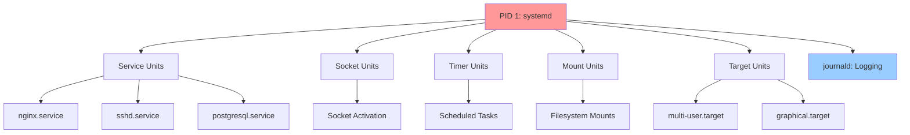
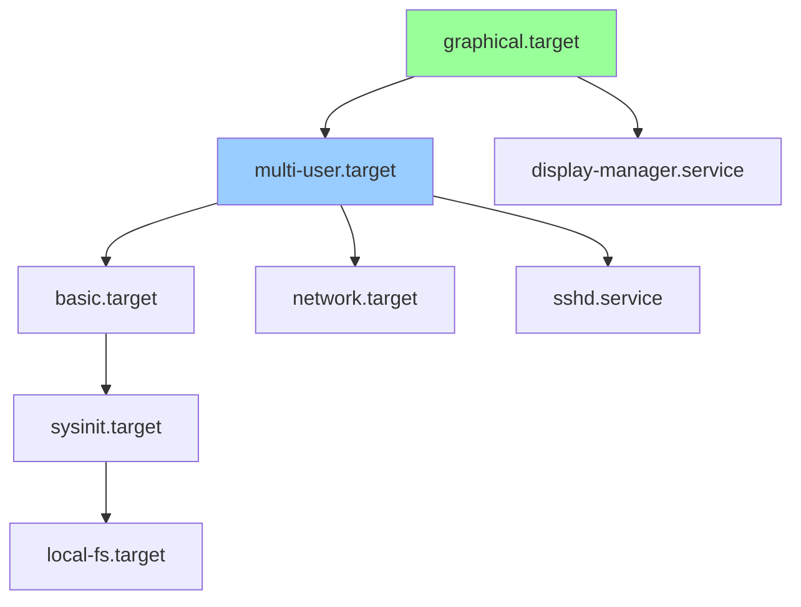

# systemd and Services

## Overview

**systemd** is the init system and service manager for modern Linux distributions. It replaces older init systems (SysV init, Upstart) and manages:
- System initialization and boot process
- Service lifecycle (start, stop, restart)
- Dependency management between services
- Logging via journald
- System state (targets/runlevels)
- Timers, sockets, devices, mounts

> [!summary] Key Concepts
> - **Unit**: Basic object managed by systemd (service, socket, timer, mount, etc.)
> - **Service Unit**: Process/daemon managed by systemd
> - **Target**: Group of units, similar to runlevels
> - **Journal**: Centralized logging system (journald)
> - **systemctl**: Primary command-line tool for controlling systemd
> - **Unit File**: Configuration file defining how systemd manages a unit

---

## systemd Architecture



**systemd as PID 1**:
- First process started by kernel
- Parent of all other processes
- Manages system initialization sequence
- Remains running until shutdown

---

## Core Commands

### Checking Service Status

```bash
# View service status
systemctl status nginx

# Output shows:
# - Loaded: unit file location, enabled/disabled
# - Active: running/stopped/failed
# - Main PID: process ID
# - Recent log entries from journal
```

**Example output**:
```
● nginx.service - A high performance web server
     Loaded: loaded (/lib/systemd/system/nginx.service; enabled; preset: enabled)
     Active: active (running) since Sun 2026-04-26 10:00:00 UTC; 2h ago
   Main PID: 1234 (nginx)
      Tasks: 5 (limit: 4915)
     Memory: 12.5M
        CPU: 1.234s
     CGroup: /system.slice/nginx.service
             ├─1234 nginx: master process /usr/sbin/nginx
             └─1235 nginx: worker process
```

### Starting and Stopping Services

```bash
# Start service (one-time, does not persist across reboots)
sudo systemctl start nginx

# Stop service
sudo systemctl stop nginx

# Restart service (stop then start)
sudo systemctl restart nginx

# Reload configuration without restarting (if supported)
sudo systemctl reload nginx

# Reload or restart (tries reload, falls back to restart)
sudo systemctl reload-or-restart nginx
```

### Enable/Disable Services at Boot

```bash
# Enable service to start on boot
sudo systemctl enable nginx

# Enable and start immediately
sudo systemctl enable --now nginx

# Disable service from starting on boot
sudo systemctl disable nginx

# Disable and stop immediately
sudo systemctl disable --now nginx

# Check if service is enabled
systemctl is-enabled nginx

# Check if service is active
systemctl is-active nginx
```

**State Combinations**:
| Enabled | Active | Meaning |
|---------|--------|---------|
| enabled | active | Running now, will start on boot |
| enabled | inactive | Not running now, but will start on boot |
| disabled | active | Running now, but won't start on boot |
| disabled | inactive | Not running, won't start on boot |

---

## Listing and Searching

### List Units

```bash
# List all active units
systemctl list-units

# List all service units (active and inactive)
systemctl list-units --type=service --all

# List only running services
systemctl list-units --type=service --state=running

# List failed units
systemctl --failed

# List all unit files (shows enabled/disabled status)
systemctl list-unit-files --type=service
```

### Search and Filter

```bash
# Search for units containing "network"
systemctl list-units | grep network

# List units by pattern
systemctl list-units 'nginx*'

# Show dependencies of a unit
systemctl list-dependencies nginx

# Show reverse dependencies (what depends on this unit)
systemctl list-dependencies --reverse nginx
```

---

## journald Logs

### Basic Log Viewing

```bash
# View logs for specific service
journalctl -u nginx

# Follow logs in real-time (like tail -f)
journalctl -u nginx -f

# View logs since specific time
journalctl -u nginx --since "2026-04-26 10:00:00"
journalctl -u nginx --since "1 hour ago"
journalctl -u nginx --since today
journalctl -u nginx --since yesterday

# View logs until specific time
journalctl -u nginx --until "2026-04-26 12:00:00"

# Combine since and until
journalctl -u nginx --since "1 hour ago" --until "30 minutes ago"
```

### Log Priority Filtering

```bash
# Show only errors and above (err, crit, alert, emerg)
journalctl -u nginx -p err

# Show range of priorities (err through alert)
journalctl -p err..alert

# Priority levels (0-7):
# 0: emerg   - System is unusable
# 1: alert   - Action must be taken immediately
# 2: crit    - Critical conditions
# 3: err     - Error conditions
# 4: warning - Warning conditions
# 5: notice  - Normal but significant
# 6: info    - Informational
# 7: debug   - Debug messages
```

### Advanced Log Options

```bash
# Show last N lines
journalctl -u nginx -n 50

# Reverse order (newest first)
journalctl -u nginx -r

# Show kernel messages
journalctl -k

# Show logs from specific boot
journalctl -b          # Current boot
journalctl -b -1       # Previous boot
journalctl --list-boots  # List all boots

# Show logs for specific user
journalctl _UID=1000

# Show logs with specific PID
journalctl _PID=1234

# Output format
journalctl -u nginx -o json-pretty
journalctl -u nginx -o verbose
journalctl -u nginx -o cat  # Only message, no metadata
```

### Log Management

```bash
# Show disk usage
journalctl --disk-usage

# Vacuum logs (clean up)
sudo journalctl --vacuum-time=7d    # Keep last 7 days
sudo journalctl --vacuum-size=100M  # Keep max 100MB
sudo journalctl --vacuum-files=5    # Keep max 5 files

# Verify log integrity
journalctl --verify
```

**journald Configuration**: `/etc/systemd/journald.conf`
```ini
[Journal]
Storage=persistent
SystemMaxUse=500M
MaxRetentionSec=1month
```

---

## Unit Files

### Unit File Locations

**Priority order** (later overrides earlier):
1. `/lib/systemd/system/` or `/usr/lib/systemd/system/` - Distribution-provided units
2. `/etc/systemd/system/` - System administrator units (override)
3. `/run/systemd/system/` - Runtime units (volatile)

**User units** (systemctl --user):
- `~/.config/systemd/user/`
- `/etc/systemd/user/`

### Inspecting Unit Files

```bash
# View unit file contents
systemctl cat nginx

# Show all properties of a unit
systemctl show nginx

# Show specific property
systemctl show nginx -p ExecStart
systemctl show nginx -p Restart

# Find unit file location
systemctl status nginx | grep Loaded
```

### Unit File Structure

**Basic service unit** (`/etc/systemd/system/myapp.service`):
```ini
[Unit]
Description=My Application
Documentation=https://myapp.example.com/docs
After=network.target
Requires=postgresql.service
Wants=redis.service

[Service]
Type=simple
User=myapp
Group=myapp
WorkingDirectory=/opt/myapp
Environment="NODE_ENV=production"
EnvironmentFile=/etc/myapp/environment
ExecStart=/usr/bin/node /opt/myapp/server.js
ExecReload=/bin/kill -HUP $MAINPID
Restart=on-failure
RestartSec=5s
StandardOutput=journal
StandardError=journal

[Install]
WantedBy=multi-user.target
```

### [Unit] Section

| Directive | Description | Example |
|-----------|-------------|---------|
| `Description` | Human-readable description | `Description=Nginx Web Server` |
| `Documentation` | URLs for docs | `Documentation=man:nginx(8)` |
| `After` | Start after these units | `After=network.target` |
| `Before` | Start before these units | `Before=nginx.service` |
| `Requires` | Hard dependency (failure propagates) | `Requires=postgresql.service` |
| `Wants` | Soft dependency (failure ignored) | `Wants=redis.service` |
| `BindsTo` | Stronger than Requires | `BindsTo=myapp.socket` |
| `Conflicts` | Cannot run with these units | `Conflicts=shutdown.target` |

### [Service] Section

| Directive | Description | Example |
|-----------|-------------|---------|
| `Type` | Service startup type | `Type=simple` (see below) |
| `ExecStart` | Command to start service | `ExecStart=/usr/bin/myapp` |
| `ExecStartPre` | Commands before start | `ExecStartPre=/bin/mkdir -p /var/run/myapp` |
| `ExecStartPost` | Commands after start | `ExecStartPost=/bin/sleep 1` |
| `ExecReload` | Reload command | `ExecReload=/bin/kill -HUP $MAINPID` |
| `ExecStop` | Stop command | `ExecStop=/bin/kill -TERM $MAINPID` |
| `User` | User to run as | `User=www-data` |
| `Group` | Group to run as | `Group=www-data` |
| `WorkingDirectory` | Working directory | `WorkingDirectory=/opt/myapp` |
| `Environment` | Environment variables | `Environment="PORT=8080"` |
| `EnvironmentFile` | File with env vars | `EnvironmentFile=/etc/myapp.env` |
| `Restart` | Restart policy | `Restart=on-failure` |
| `RestartSec` | Delay before restart | `RestartSec=5s` |
| `StandardOutput` | stdout destination | `StandardOutput=journal` |
| `StandardError` | stderr destination | `StandardError=journal` |

### Service Types

| Type | Description | Use Case |
|------|-------------|----------|
| `simple` | Process started by ExecStart is main process | Default, most common |
| `forking` | Process forks, parent exits | Traditional daemons (nginx, apache) |
| `oneshot` | Process exits after completion | Setup scripts, one-time tasks |
| `notify` | Service sends notification when ready | systemd-aware apps |
| `dbus` | Service acquires D-Bus name | D-Bus services |
| `idle` | Delayed until all jobs dispatched | Avoid boot output clutter |

### Restart Policies

| Restart Value | Behavior |
|---------------|----------|
| `no` | Never restart (default) |
| `on-success` | Restart only on clean exit (code 0) |
| `on-failure` | Restart on non-zero exit, signal, timeout |
| `on-abnormal` | Restart on signal, timeout (not clean exit) |
| `on-abort` | Restart on unhandled signal |
| `on-watchdog` | Restart on watchdog timeout |
| `always` | Always restart regardless of exit status |

### [Install] Section

| Directive | Description | Example |
|-----------|-------------|---------|
| `WantedBy` | Symbolic link created in target.wants/ | `WantedBy=multi-user.target` |
| `RequiredBy` | Symbolic link created in target.requires/ | `RequiredBy=network.target` |
| `Alias` | Additional names for unit | `Alias=myapp` |

---

## Managing Unit Files

### Creating Custom Service

```bash
# Create unit file
sudo vim /etc/systemd/system/myapp.service

# Reload systemd to recognize new unit
sudo systemctl daemon-reload

# Enable and start service
sudo systemctl enable --now myapp

# Check status
systemctl status myapp

# View logs
journalctl -u myapp -f
```

### Editing/Overriding Units

```bash
# Create override file (recommended - preserves original)
sudo systemctl edit nginx
# Opens editor for /etc/systemd/system/nginx.service.d/override.conf

# Full edit (replaces unit file)
sudo systemctl edit --full nginx
# Copies to /etc/systemd/system/nginx.service

# After editing, reload and restart
sudo systemctl daemon-reload
sudo systemctl restart nginx

# Remove overrides
sudo rm -rf /etc/systemd/system/nginx.service.d/
sudo systemctl daemon-reload
sudo systemctl restart nginx
```

**Example override** (increase open file limit):
```ini
[Service]
LimitNOFILE=65536
```

### Masking Units

```bash
# Mask unit (completely disable, cannot be started)
sudo systemctl mask nginx
# Creates symlink to /dev/null

# Unmask
sudo systemctl unmask nginx
```

---

## Targets

**Targets** group units and define system states, similar to SysV runlevels.

### Common Targets

| Target | SysV Runlevel | Description |
|--------|---------------|-------------|
| `poweroff.target` | 0 | Shutdown system |
| `rescue.target` | 1, s | Single-user rescue mode |
| `multi-user.target` | 3 | Multi-user, no GUI |
| `graphical.target` | 5 | Multi-user with GUI |
| `reboot.target` | 6 | Reboot system |
| `emergency.target` | - | Emergency shell, minimal services |

### Target Commands

```bash
# Show default target (boot target)
systemctl get-default

# Set default target
sudo systemctl set-default multi-user.target
sudo systemctl set-default graphical.target

# Change to target immediately (like runlevel change)
sudo systemctl isolate multi-user.target

# List available targets
systemctl list-units --type=target

# Show units wanted by target
systemctl show -p Wants multi-user.target
```

### Target Dependencies



---

## Timers (systemd Alternative to Cron)

### Creating Timer

**Timer unit** (`/etc/systemd/system/backup.timer`):
```ini
[Unit]
Description=Backup Timer

[Timer]
OnCalendar=daily
OnCalendar=*-*-* 02:00:00
Persistent=true

[Install]
WantedBy=timers.target
```

**Service unit** (`/etc/systemd/system/backup.service`):
```ini
[Unit]
Description=Backup Service

[Service]
Type=oneshot
ExecStart=/usr/local/bin/backup.sh
```

### Timer Commands

```bash
# Enable and start timer
sudo systemctl enable --now backup.timer

# List active timers
systemctl list-timers

# Show next execution time
systemctl status backup.timer

# Manually trigger service (without waiting for timer)
sudo systemctl start backup.service
```

### Timer Types

| Timer Directive | Description | Example |
|----------------|-------------|---------|
| `OnCalendar` | Realtime (wallclock) schedule | `OnCalendar=Mon,Tue *-*-* 10:00:00` |
| `OnBootSec` | After system boot | `OnBootSec=15min` |
| `OnStartupSec` | After systemd started | `OnStartupSec=10min` |
| `OnUnitActiveSec` | After unit last active | `OnUnitActiveSec=1h` |
| `OnUnitInactiveSec` | After unit last inactive | `OnUnitInactiveSec=30min` |

**Calendar syntax examples**:
```
*-*-* 04:00:00          # Daily at 4 AM
Mon *-*-* 00:00:00      # Every Monday at midnight
*-*-01 00:00:00         # First day of month
*-01,07 *-01 00:00:00   # First day of Jan and Jul
```

---

## Socket Activation

**Socket units** enable on-demand service activation.

**Socket unit** (`/etc/systemd/system/myapp.socket`):
```ini
[Unit]
Description=My App Socket

[Socket]
ListenStream=0.0.0.0:8080
Accept=no

[Install]
WantedBy=sockets.target
```

**Corresponding service** (`/etc/systemd/system/myapp.service`):
```ini
[Unit]
Description=My App Service
Requires=myapp.socket

[Service]
Type=notify
ExecStart=/usr/bin/myapp
StandardInput=socket
```

**Benefits**:
- Service starts only when connection received
- Faster boot (service not started immediately)
- Automatic service restart on crashes

```bash
# Enable socket, disable service
sudo systemctl enable myapp.socket
sudo systemctl disable myapp.service

# Service starts automatically when connection made to port 8080
```

---

## Troubleshooting

### Service Won't Start

```bash
# Check status and error messages
systemctl status myapp

# View full logs
journalctl -u myapp -n 100

# Check unit file syntax
systemd-analyze verify /etc/systemd/system/myapp.service

# Test ExecStart command manually
sudo -u myapp /path/to/command
```

### Dependency Issues

```bash
# Show dependency tree
systemctl list-dependencies myapp

# Check what's blocking
systemctl list-dependencies --reverse myapp

# Identify conflicting units
systemctl list-dependencies --all myapp | grep Conflict
```

### Boot Problems

```bash
# Analyze boot time
systemd-analyze

# Show service startup times
systemd-analyze blame

# Critical chain (slowest path to target)
systemd-analyze critical-chain

# Plot boot process (generates SVG)
systemd-analyze plot > boot.svg
```

### Failed Units

```bash
# List all failed units
systemctl --failed

# Reset failed state
sudo systemctl reset-failed

# Reset specific unit
sudo systemctl reset-failed myapp
```

---

## Common Pitfalls

> [!warning] Forgetting daemon-reload
> **Problem**: Edited unit file but changes not applied  
> **Impact**: Service uses old configuration  
> **Solution**: Always run `sudo systemctl daemon-reload` after editing unit files

> [!warning] Enable vs Start Confusion
> **Problem**: `systemctl enable nginx` doesn't start service immediately  
> **Impact**: Service enabled for boot but not running now  
> **Solution**: Use `systemctl enable --now nginx` to enable and start

> [!warning] Incorrect Service Type
> **Problem**: Using `Type=simple` for forking daemon  
> **Impact**: systemd thinks service failed/exited  
> **Solution**: Use `Type=forking` for traditional daemons that fork

> [!warning] Missing ExecStart Quotes
> **Problem**: `ExecStart=/bin/sh -c echo hello` fails  
> **Impact**: Syntax error in unit file  
> **Solution**: Use proper quoting: `ExecStart=/bin/sh -c "echo hello"`

> [!warning] Environment Variable Issues
> **Problem**: Service can't find commands in PATH  
> **Impact**: ExecStart fails with "command not found"  
> **Solution**: Use absolute paths or set `Environment="PATH=/usr/local/bin:/usr/bin"`

> [!warning] Permissions Problems
> **Problem**: Service runs as wrong user, can't access files  
> **Impact**: Permission denied errors  
> **Solution**: Set correct `User=` and `Group=`, ensure file ownership matches

---

## Interview Corner

> [!question]- What is systemd and how does it differ from SysV init?
> **systemd** is a modern init system and service manager. Key differences from SysV init:
> 
> | Feature | systemd | SysV init |
> |---------|---------|-----------|
> | **Parallelization** | Services start in parallel | Sequential startup |
> | **Dependencies** | Declarative, automatic | Manual ordering via S/K links |
> | **Configuration** | Unit files (declarative) | Shell scripts (imperative) |
> | **Logging** | Integrated journald | Separate syslog |
> | **Socket activation** | Built-in | Not available |
> | **On-demand start** | Yes (socket, path, timer) | No |
> | **Process tracking** | cgroups | PID files |
> 
> **Result**: Faster boot times, easier service management, better process supervision.

> [!question]- Explain the difference between `systemctl start` and `systemctl enable`
> - **`systemctl start nginx`**: Starts service immediately, but only for current session. Service won't start on reboot.
> - **`systemctl enable nginx`**: Creates symbolic link in target.wants/ directory, causing service to start on boot. Does NOT start service immediately.
> 
> **Best practice**: Use `systemctl enable --now nginx` to enable and start in one command.

> [!question]- How does systemd track processes and prevent orphans?
> systemd uses **cgroups** (control groups) to track all processes in a service, including child processes. Benefits:
> 
> 1. **Reliable cleanup**: When stopping service, systemd kills all processes in cgroup
> 2. **No orphans**: Child processes can't escape supervision
> 3. **Resource control**: Can limit CPU, memory, I/O per service
> 4. **Accurate accounting**: Tracks resource usage for entire service
> 
> Traditional PID file approach could lose track of child processes.

> [!question]- What are the different service types in systemd?
> | Type | Behavior | Use Case |
> |------|----------|----------|
> | `simple` | ExecStart process is main process | Most applications |
> | `forking` | Process forks, parent exits | Traditional daemons (nginx) |
> | `oneshot` | Process exits, but service remains active | Init scripts, setup tasks |
> | `notify` | Service sends sd_notify() when ready | systemd-aware apps |
> | `dbus` | Service ready when D-Bus name acquired | D-Bus services |
> 
> **Common mistake**: Using `Type=simple` for forking daemon causes systemd to think service failed.

> [!question]- How do you troubleshoot a service that fails to start?
> **Systematic approach**:
> ```bash
> # 1. Check status and error messages
> systemctl status myapp
> 
> # 2. View detailed logs
> journalctl -u myapp -n 50
> 
> # 3. Verify unit file syntax
> systemd-analyze verify /etc/systemd/system/myapp.service
> 
> # 4. Check dependencies
> systemctl list-dependencies myapp
> 
> # 5. Test command manually
> sudo -u myapp /path/to/command
> 
> # 6. Check file permissions
> ls -l /path/to/command
> 
> # 7. Verify environment
> systemctl show myapp -p Environment
> ```

> [!question]- What is the purpose of targets in systemd?
> **Targets** are unit files that group other units and define system states, similar to SysV runlevels.
> 
> **Common targets**:
> - `multi-user.target`: Multi-user system, no GUI (like runlevel 3)
> - `graphical.target`: Multi-user with GUI (like runlevel 5)
> - `rescue.target`: Single-user rescue mode (like runlevel 1)
> 
> **Dependencies**: Targets can depend on other targets, creating hierarchy:
> ```
> graphical.target → multi-user.target → basic.target → sysinit.target
> ```
> 
> **Usage**: `sudo systemctl isolate multi-user.target` switches to target immediately.

> [!question]- How does journald differ from traditional syslog?
> **journald advantages**:
> - **Structured logging**: Logs stored in binary format with metadata (PID, UID, service name)
> - **Indexing**: Fast queries by service, priority, time
> - **Integration**: Tight integration with systemd
> - **Automatic rotation**: Built-in log rotation and size limits
> - **Boot logs**: Preserves logs from early boot
> 
> **Traditional syslog**:
> - Text-based logs in `/var/log/`
> - Requires parsing for filtering
> - Separate configuration for rotation (logrotate)
> 
> **Coexistence**: journald can forward to syslog for compatibility.

---

## Cheat Sheet

### Service Management
```bash
systemctl status nginx               # View status
sudo systemctl start nginx           # Start service
sudo systemctl stop nginx            # Stop service
sudo systemctl restart nginx         # Restart service
sudo systemctl reload nginx          # Reload config
sudo systemctl enable nginx          # Enable at boot
sudo systemctl enable --now nginx    # Enable and start
sudo systemctl disable nginx         # Disable at boot
systemctl is-enabled nginx           # Check if enabled
systemctl is-active nginx            # Check if running
```

### Logs (journalctl)
```bash
journalctl -u nginx                  # View service logs
journalctl -u nginx -f               # Follow logs
journalctl -u nginx -n 50            # Last 50 lines
journalctl -u nginx --since "1h ago" # Last hour
journalctl -u nginx -p err           # Errors only
journalctl -b                        # Current boot logs
journalctl -k                        # Kernel messages
```

### Unit Files
```bash
systemctl cat nginx                  # View unit file
systemctl show nginx                 # Show all properties
sudo systemctl edit nginx            # Create override
sudo systemctl edit --full nginx     # Edit full unit
sudo systemctl daemon-reload         # Reload after changes
systemd-analyze verify unit.service  # Validate syntax
```

### Listing and Searching
```bash
systemctl list-units --type=service  # List services
systemctl --failed                   # List failed units
systemctl list-dependencies nginx    # Show dependencies
systemctl list-timers                # Show timers
systemctl list-sockets               # Show sockets
```

### Targets
```bash
systemctl get-default                # Show default target
sudo systemctl set-default multi-user.target  # Set default
sudo systemctl isolate rescue.target # Switch to target
```

---

## References

### Official Documentation
- [systemd Homepage](https://systemd.io/)
- [systemctl(1) Manual](https://man7.org/linux/man-pages/man1/systemctl.1.html)
- [systemd.service(5) Manual](https://www.freedesktop.org/software/systemd/man/systemd.service.html)
- [systemd.unit(5) Manual](https://www.freedesktop.org/software/systemd/man/systemd.unit.html)
- [journalctl(1) Manual](https://man7.org/linux/man-pages/man1/journalctl.1.html)

### Tutorials and Guides
- [systemd for Administrators](https://www.freedesktop.org/wiki/Software/systemd/)
- [ArchWiki - systemd](https://wiki.archlinux.org/title/Systemd)
- [Red Hat - Managing Services with systemd](https://access.redhat.com/documentation/en-us/red_hat_enterprise_linux/9/html/configuring_basic_system_settings/managing-services-with-systemd_configuring-basic-system-settings)
- [Digital Ocean - systemd Essentials](https://www.digitalocean.com/community/tutorials/systemd-essentials-working-with-services-units-and-the-journal)

### Books
- "systemd System and Service Manager" by Donald A. Tevault
- "The Linux Command Line" by William Shotts - systemd chapter

---

## Related Notes

- [[03_Processes_and_Jobs]] - Process management fundamentals
- [[04_Packages_and_Environment]] - Installing packages that become services
- [[02_Storage_and_Filesystems]] - Mount units and filesystem management
- [[03_Networking_Tools]] - Network services managed by systemd
- [[04_SSH_and_Remote_Access]] - sshd.service configuration

---

> [!tip] Best Practices
> 1. **Always daemon-reload**: Run `sudo systemctl daemon-reload` after editing unit files
> 2. **Use overrides**: Prefer `systemctl edit` over editing original unit files
> 3. **Enable with --now**: Use `systemctl enable --now` to enable and start in one command
> 4. **Check logs first**: Use `journalctl -u service` for troubleshooting
> 5. **Verify before deploying**: Test unit files with `systemd-analyze verify`
> 6. **Set Restart policies**: Use `Restart=on-failure` for production services
> 7. **Limit resources**: Use cgroup directives (MemoryLimit, CPUQuota) for critical services
> 8. **Document custom units**: Add good Description and Documentation fields
