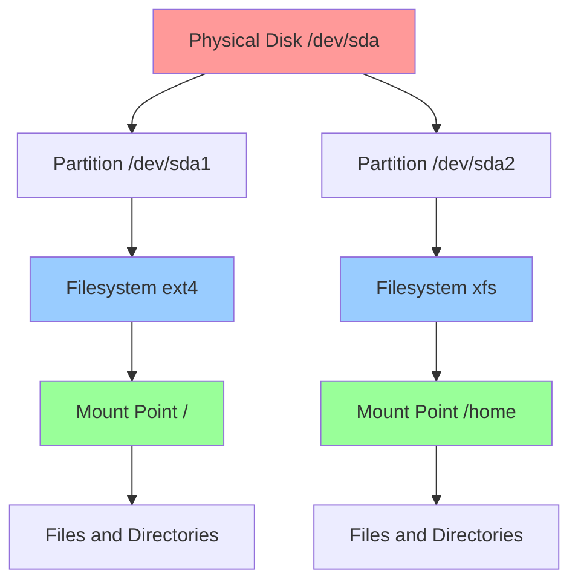
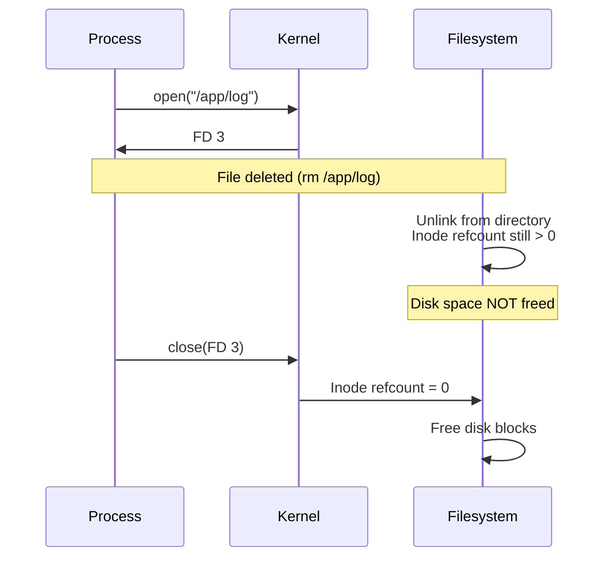

# Storage and Filesystems

## Overview

Linux storage management involves understanding block devices, partitions, filesystems, mount points, and storage utilization. Modern Linux supports various filesystem types (ext4, XFS, Btrfs) and advanced features like LVM (Logical Volume Manager) and RAID.

> [!summary] Key Concepts
> - **Block Device**: Physical or logical storage device (disk, partition, LVM volume)
> - **Partition**: Logical division of a disk
> - **Filesystem**: Structure for organizing and storing files on a partition
> - **Mount Point**: Directory where filesystem is attached to the directory tree
> - **Inode**: Data structure storing file metadata (permissions, timestamps, location)
> - **LVM**: Logical Volume Manager - flexible storage abstraction layer

---

## Storage Architecture



**Layered view**:
```
Application Layer: Files and Directories
       ↓
VFS (Virtual Filesystem): Unified interface
       ↓
Filesystem Layer: ext4, XFS, Btrfs (manages inodes, blocks)
       ↓
Block Layer: I/O scheduling, caching
       ↓
Device Driver: Disk controller communication
       ↓
Physical Layer: Actual disk hardware
```

---

## Disk Space and Inodes

### Checking Disk Space

```bash
# Human-readable disk space usage
df -h

# Example output:
# Filesystem      Size  Used Avail Use% Mounted on
# /dev/sda1        50G   35G   13G  74% /
# /dev/sda2       100G   80G   16G  84% /home
```

**`df` options**:
```bash
# Show inode usage instead of disk space
df -i

# Show filesystem type
df -T

# Show all filesystems (including pseudo-filesystems)
df -a

# Exclude specific filesystem types
df -x tmpfs -x devtmpfs

# POSIX output format (portable)
df -P
```

### Understanding df Output

| Column | Meaning |
|--------|---------|
| **Filesystem** | Device or filesystem name |
| **Size** | Total size of filesystem |
| **Used** | Space currently used |
| **Avail** | Space available to non-root users |
| **Use%** | Percentage used |
| **Mounted on** | Mount point directory |

**Important**: `Used + Avail ≠ Size` because filesystems reserve space for root and metadata.

### Inode Usage

**What are inodes?**
- Data structure storing file metadata (not content)
- Each file/directory consumes one inode
- Filesystem has fixed number of inodes (set at creation)

```bash
# Check inode usage
df -i

# Example output:
# Filesystem      Inodes  IUsed   IFree IUse% Mounted on
# /dev/sda1      3276800 450000 2826800   14% /

# Find directories with most files
sudo find /var -xdev -type f | cut -d "/" -f 1-3 | sort | uniq -c | sort -n

# Count files in directory
find /path -type f | wc -l
```

> [!warning] Inode Exhaustion
> **Problem**: "No space left on device" error even when `df -h` shows available space  
> **Cause**: Ran out of inodes (too many small files)  
> **Check**: `df -i` shows 100% IUse%  
> **Solution**: Delete unnecessary files or recreate filesystem with more inodes

---

## Directory Usage

### Analyzing Disk Usage

```bash
# Show disk usage of current directory
du -h

# Show total for directory only (summary)
du -sh /var

# Show disk usage, sorted by size
du -h /var | sort -h | tail -20

# Limit depth (don't recurse too deep)
du -h --max-depth=2 /var | sort -h

# Show only directories larger than 100MB
du -h /var | grep -E '^[0-9]+[MG]\s'

# Exclude specific directories
du -h --exclude='/var/log' /var

# Cross filesystem boundaries (don't descend into other filesystems)
du -xh /
```

### Advanced Usage Analysis

```bash
# Find largest files in /var
sudo find /var -xdev -type f -exec du -h {} + | sort -h | tail -20

# Find files larger than 100MB
find /var -xdev -type f -size +100M -exec ls -lh {} \;

# Find files modified in last 7 days, show sizes
find /var -xdev -type f -mtime -7 -exec du -h {} + | sort -h

# Disk usage by user
sudo du -sh /home/*

# Interactive disk usage explorer (if installed)
ncdu /var
```

---

## Mounts and Mount Points

### Viewing Mounts

```bash
# Show all mounted filesystems
mount

# Better formatted mount table
findmnt

# Tree view of mount points
findmnt --tree

# Show only specific filesystem type
findmnt -t ext4

# Block device information
lsblk

# With filesystem type and mount points
lsblk -f
```

**Example `lsblk -f` output**:
```
NAME   FSTYPE LABEL  UUID                                 MOUNTPOINT
sda                                                        
├─sda1 ext4   root   12345678-1234-1234-1234-123456789012 /
├─sda2 ext4   home   abcdef01-abcd-abcd-abcd-abcdef012345 /home
└─sda3 swap   [SWAP] 98765432-9876-9876-9876-987654321098 [SWAP]
```

### Mounting Filesystems

```bash
# Mount by device
sudo mount /dev/sdb1 /mnt/data

# Mount with specific filesystem type
sudo mount -t ext4 /dev/sdb1 /mnt/data

# Mount with options
sudo mount -o rw,noexec /dev/sdb1 /mnt/data

# Mount by UUID (recommended - persistent across device changes)
sudo mount UUID=12345678-1234-1234-1234-123456789012 /mnt/data

# Mount by label
sudo mount LABEL=mydata /mnt/data

# Remount with different options (no unmount required)
sudo mount -o remount,ro /mnt/data

# Unmount
sudo umount /mnt/data

# Force unmount (use with caution)
sudo umount -f /mnt/data

# Lazy unmount (detach now, cleanup when no longer busy)
sudo umount -l /mnt/data
```

### Common Mount Options

| Option | Description |
|--------|-------------|
| `rw` | Read-write (default) |
| `ro` | Read-only |
| `noexec` | Prevent execution of binaries |
| `nosuid` | Ignore setuid/setgid bits |
| `nodev` | Don't interpret block/character devices |
| `noatime` | Don't update access time (performance) |
| `relatime` | Update atime only if older than mtime (default) |
| `defaults` | rw, suid, dev, exec, auto, nouser, async |
| `user` | Allow normal users to mount |
| `auto` | Mount automatically at boot (via fstab) |
| `sync` | Synchronous I/O (slower, safer) |
| `async` | Asynchronous I/O (faster, default) |

### Persistent Mounts (/etc/fstab)

**`/etc/fstab` format**:
```
# <device>  <mount point>  <type>  <options>  <dump>  <pass>
UUID=xxx    /              ext4    defaults   0       1
UUID=yyy    /home          ext4    defaults   0       2
UUID=zzz    none           swap    sw         0       0
/dev/sdb1   /mnt/data      ext4    noatime    0       0
```

**Fields**:
1. **Device**: UUID, LABEL, or device path
2. **Mount Point**: Directory where filesystem is mounted
3. **Type**: Filesystem type (ext4, xfs, btrfs, swap, etc.)
4. **Options**: Mount options (comma-separated)
5. **Dump**: Backup flag (0=don't backup, 1=backup)
6. **Pass**: fsck order (0=don't check, 1=root, 2=others)

```bash
# Test fstab before reboot
sudo mount -a

# Show what would be mounted
mount -a --fake

# Remount all filesystems in fstab
sudo mount -a -o remount
```

---

## Filesystem Types

### Common Linux Filesystems

| Filesystem | Strengths | Use Cases | Max File Size | Max FS Size |
|------------|-----------|-----------|---------------|-------------|
| **ext4** | Stable, well-tested, journaling | General purpose, root fs | 16 TB | 1 EB |
| **XFS** | High performance, large files | Video editing, databases | 8 EB | 8 EB |
| **Btrfs** | Snapshots, compression, subvolumes | Advanced features, CoW | 16 EB | 16 EB |
| **F2FS** | Flash-optimized | SSDs, SD cards | 3.94 TB | 16 TB |
| **NTFS** | Windows compatibility | Dual-boot, USB drives | 16 EB | 16 EB |
| **FAT32** | Universal compatibility | USB drives (small files) | 4 GB | 2 TB |
| **exFAT** | Large files, universal | USB drives (large files) | 16 EB | 64 ZB |

### Creating Filesystems

```bash
# Create ext4 filesystem
sudo mkfs.ext4 /dev/sdb1

# Create ext4 with label
sudo mkfs.ext4 -L mydata /dev/sdb1

# Create XFS filesystem
sudo mkfs.xfs /dev/sdb1

# Create Btrfs filesystem
sudo mkfs.btrfs /dev/sdb1

# Create FAT32
sudo mkfs.vfat -F 32 /dev/sdb1

# Create swap
sudo mkswap /dev/sdb2
sudo swapon /dev/sdb2
```

### Filesystem Information

```bash
# Show filesystem type
sudo file -s /dev/sdb1

# ext4 filesystem info
sudo tune2fs -l /dev/sdb1

# XFS filesystem info
sudo xfs_info /mnt/xfs

# Filesystem UUID and label
sudo blkid /dev/sdb1

# All block devices with details
sudo blkid
```

---

## Partitioning

### Viewing Partitions

```bash
# List partitions
sudo fdisk -l

# Partition table for specific disk
sudo fdisk -l /dev/sda

# Partprobe - inform OS of partition table changes
sudo partprobe /dev/sda

# Partition information (detailed)
sudo parted /dev/sda print
```

### Creating Partitions (fdisk)

```bash
# Start fdisk (MBR/DOS partition table)
sudo fdisk /dev/sdb

# Common commands within fdisk:
# n - new partition
# p - print partition table
# d - delete partition
# t - change partition type
# w - write changes and exit
# q - quit without saving

# Example session:
# n → p → 1 → [enter] → [enter] → w
# (Creates primary partition 1 using entire disk)
```

### Creating Partitions (parted - GPT support)

```bash
# Start parted
sudo parted /dev/sdb

# Create GPT partition table
(parted) mklabel gpt

# Create partition
(parted) mkpart primary ext4 0% 100%

# Print partition table
(parted) print

# Quit
(parted) quit
```

### Partition Table Types

| Type | Max Partitions | Max Disk Size | Boot Support |
|------|----------------|---------------|--------------|
| **MBR (DOS)** | 4 primary (+ extended/logical) | 2 TB | BIOS |
| **GPT** | 128 partitions | 9.4 ZB | UEFI + BIOS |

---

## LVM (Logical Volume Manager)

### LVM Architecture

```mermaid
graph TB
    A[Physical Disks] --> B[Physical Volumes PV]
    B --> C[/dev/sda1 - PV]
    B --> D[/dev/sdb1 - PV]
    
    C --> E[Volume Group VG]
    D --> E
    
    E --> F[Logical Volume LV1]
    E --> G[Logical Volume LV2]
    
    F --> H[Filesystem ext4]
    G --> I[Filesystem xfs]
    
    H --> J[Mount /data]
    I --> K[Mount /backup]
    
    style A fill:#ff9999
    style E fill:#99ccff
    style F fill:#99ff99
    style G fill:#99ff99
```

**Benefits**:
- Resize filesystems without unmounting
- Span volumes across multiple disks
- Snapshots for backups
- Easy migration

### LVM Commands

```bash
# Create Physical Volume
sudo pvcreate /dev/sdb1 /dev/sdc1

# Show PVs
sudo pvs
sudo pvdisplay

# Create Volume Group
sudo vgcreate my_vg /dev/sdb1 /dev/sdc1

# Show VGs
sudo vgs
sudo vgdisplay

# Create Logical Volume (100GB)
sudo lvcreate -L 100G -n my_lv my_vg

# Create LV using all free space
sudo lvcreate -l 100%FREE -n my_lv my_vg

# Show LVs
sudo lvs
sudo lvdisplay

# Create filesystem on LV
sudo mkfs.ext4 /dev/my_vg/my_lv

# Mount LV
sudo mount /dev/my_vg/my_lv /mnt/data
```

### Resizing LVM Volumes

```bash
# Extend Logical Volume by 50GB
sudo lvextend -L +50G /dev/my_vg/my_lv

# Extend to 200GB total
sudo lvextend -L 200G /dev/my_vg/my_lv

# Extend to use all free space in VG
sudo lvextend -l +100%FREE /dev/my_vg/my_lv

# Resize filesystem to match LV size
# ext4:
sudo resize2fs /dev/my_vg/my_lv

# XFS:
sudo xfs_growfs /mnt/data

# Combined extend + resize (ext4 only)
sudo lvextend -r -L +50G /dev/my_vg/my_lv

# Reduce LV (must shrink filesystem first - risky!)
# 1. Unmount
sudo umount /mnt/data
# 2. Check filesystem
sudo e2fsck -f /dev/my_vg/my_lv
# 3. Shrink filesystem to 80GB
sudo resize2fs /dev/my_vg/my_lv 80G
# 4. Reduce LV to 80GB
sudo lvreduce -L 80G /dev/my_vg/my_lv
# 5. Remount
sudo mount /dev/my_vg/my_lv /mnt/data
```

### LVM Snapshots

```bash
# Create snapshot (10GB snapshot space)
sudo lvcreate -L 10G -s -n my_lv_snap /dev/my_vg/my_lv

# Mount snapshot (read-only)
sudo mount -o ro /dev/my_vg/my_lv_snap /mnt/snapshot

# Backup from snapshot
sudo rsync -av /mnt/snapshot/ /backup/

# Remove snapshot
sudo umount /mnt/snapshot
sudo lvremove /dev/my_vg/my_lv_snap

# Revert to snapshot (destructive!)
sudo lvconvert --merge /dev/my_vg/my_lv_snap
# Requires unmount and remount
```

---

## File Descriptors and Deleted Files

### Understanding the Problem

**Scenario**: Delete large file, but disk space not freed.

```bash
# Check open deleted files
sudo lsof +L1

# Output shows processes with deleted files still open
# COMMAND  PID   USER   FD   TYPE DEVICE SIZE/OFF NLINK NODE NAME
# java     1234  app    3w   REG  8,1    10G      0     12345 /app/logs/huge.log (deleted)
```

**Why this happens**:
1. Process opens file (gets file descriptor)
2. File is deleted from directory
3. Inode reference count > 0 (process still has FD)
4. Disk space not freed until process closes FD or exits



### Recovering Space

```bash
# Find processes with deleted files
sudo lsof +L1

# Restart specific service to close FDs
sudo systemctl restart myapp

# Or kill process (if safe)
sudo kill 1234

# Truncate file while process has it open (emergency)
sudo truncate -s 0 /proc/1234/fd/3
# Process PID 1234, file descriptor 3
```

### Prevention

```bash
# Use logrotate for automatic log rotation
# /etc/logrotate.d/myapp
/var/log/myapp/*.log {
    daily
    rotate 7
    compress
    missingok
    notifempty
    postrotate
        systemctl reload myapp
    endscript
}
```

---

## Permissions and Ownership Issues

### Checking Permissions

```bash
# Directory permissions (common issue for "permission denied")
ls -ld /path/to/dir

# Trace permissions along entire path
namei -l /path/to/file

# Example output:
# f: /var/www/html/index.html
# drwxr-xr-x root root /
# drwxr-xr-x root root var
# drwxr-xr-x root root www
# drwxr-x--- www-data www-data html
# -rw-r--r-- www-data www-data index.html
```

**Common permission problem**: Directory along path lacks execute permission.

```bash
# Fix: Ensure execute permission on all parent directories
sudo chmod o+x /var/www/html
```

### Fixing Ownership

```bash
# Change owner
sudo chown user:group /path/to/file

# Change owner recursively
sudo chown -R user:group /path/to/dir

# Change only owner
sudo chown user /path/to/file

# Change only group
sudo chgrp group /path/to/file
```

### Access Control Lists (ACLs)

```bash
# View ACLs
getfacl /path/to/file

# Set ACL (give user 'john' read access)
sudo setfacl -m u:john:r /path/to/file

# Remove ACL
sudo setfacl -x u:john /path/to/file

# Set default ACL for directory (inherited by new files)
sudo setfacl -d -m u:john:rw /path/to/dir

# Remove all ACLs
sudo setfacl -b /path/to/file
```

---

## Filesystem Maintenance

### Checking Filesystem Integrity

```bash
# Check ext4 filesystem (MUST be unmounted or read-only)
sudo e2fsck /dev/sdb1

# Force check
sudo e2fsck -f /dev/sdb1

# Auto-repair (use with caution)
sudo e2fsck -y /dev/sdb1

# Check XFS filesystem (must be mounted)
sudo xfs_repair /dev/sdb1

# Btrfs check
sudo btrfs check /dev/sdb1
```

### Tuning Filesystems

```bash
# Show ext4 filesystem parameters
sudo tune2fs -l /dev/sdb1

# Set maximum mount count before forced check
sudo tune2fs -c 30 /dev/sdb1

# Set check interval (180 days)
sudo tune2fs -i 180d /dev/sdb1

# Disable periodic checks (for SSDs)
sudo tune2fs -c 0 -i 0 /dev/sdb1

# Change reserved block percentage (5% default, reduce for large disks)
sudo tune2fs -m 1 /dev/sdb1

# Set filesystem label
sudo tune2fs -L mydata /dev/sdb1
```

### Defragmentation

```bash
# ext4 fragmentation check
sudo e4defrag -c /mnt/data

# Defragment ext4 filesystem (online)
sudo e4defrag /mnt/data

# XFS defragmentation
sudo xfs_fsr /mnt/xfs

# Btrfs defragmentation
sudo btrfs filesystem defragment /mnt/btrfs
```

---

## Special Filesystems

### tmpfs (RAM-based filesystem)

```bash
# Mount tmpfs
sudo mount -t tmpfs -o size=512M tmpfs /mnt/ramdisk

# Persistent via /etc/fstab:
tmpfs /tmp tmpfs defaults,size=2G 0 0

# Benefits: Very fast, volatile (cleared on reboot)
# Use cases: /tmp, caches, build directories
```

### Bind Mounts

```bash
# Bind mount (make directory appear in another location)
sudo mount --bind /source/dir /destination/dir

# Read-only bind mount
sudo mount --bind -o ro /source/dir /destination/dir

# Persistent via /etc/fstab:
/source/dir /destination/dir none bind 0 0
```

### Loop Devices (mount files as filesystems)

```bash
# Create disk image file
dd if=/dev/zero of=disk.img bs=1M count=1024  # 1GB

# Create filesystem in image
sudo mkfs.ext4 disk.img

# Mount image file
sudo mount -o loop disk.img /mnt/image

# Or explicitly create loop device
sudo losetup /dev/loop0 disk.img
sudo mount /dev/loop0 /mnt/image

# Show loop devices
losetup -a

# Detach loop device
sudo umount /mnt/image
sudo losetup -d /dev/loop0
```

---

## Common Pitfalls

> [!warning] Out of Inodes
> **Problem**: "No space left on device" but `df -h` shows free space  
> **Check**: `df -i` shows 100% IUse%  
> **Cause**: Too many small files (logs, cache entries)  
> **Solution**: Delete unnecessary files or recreate filesystem with more inodes

> [!warning] Deleted Files Not Freeing Space
> **Problem**: Deleted large file but disk still full  
> **Check**: `sudo lsof +L1` shows processes with deleted files open  
> **Solution**: Restart application or kill process holding file descriptor

> [!warning] Permission Denied Despite Correct File Permissions
> **Problem**: File has correct permissions but still "permission denied"  
> **Check**: `namei -l /path/to/file` - check all parent directories  
> **Solution**: Ensure execute permission on all parent directories

> [!warning] Forgetting to Update /etc/fstab
> **Problem**: Manually mounted filesystem disappears after reboot  
> **Solution**: Add mount entry to `/etc/fstab` for persistence

> [!warning] XFS Filesystem Shrinking
> **Problem**: Trying to shrink XFS filesystem  
> **Reality**: XFS does NOT support shrinking, only growing  
> **Solution**: Backup data, destroy filesystem, create smaller one, restore data

> [!warning] LVM Reduction Without Shrinking Filesystem
> **Problem**: `lvreduce` without prior `resize2fs` causes data loss  
> **Solution**: Always shrink filesystem BEFORE reducing LV size

---

## Interview Corner

> [!question]- Explain the difference between a partition and a filesystem
> - **Partition**: Logical division of a physical disk. Defines the boundaries of storage space. Created with fdisk/parted.
> - **Filesystem**: Structure for organizing files within a partition. Defines how data is stored, retrieved, and managed (inodes, blocks, directories).
> 
> **Analogy**: Partition is like dividing a bookshelf into sections. Filesystem is the filing system you use to organize books within each section.
> 
> **Process**: Create partition → Create filesystem on partition → Mount filesystem

> [!question]- What causes "No space left on device" when df shows free space?
> **Inode exhaustion**. Filesystems have a fixed number of inodes (metadata structures for files). Even with free disk space, if all inodes are used (typically from many small files), you can't create new files.
> 
> **Check**: `df -i` shows inode usage  
> **Common causes**: Log files, cache directories with millions of small files  
> **Solution**: Delete unnecessary files or recreate filesystem with more inodes

> [!question]- How does LVM provide flexibility over traditional partitioning?
> **LVM advantages**:
> 1. **Resize volumes**: Grow/shrink without unmounting (ext4 grow, XFS grow only)
> 2. **Span disks**: Single logical volume across multiple physical disks
> 3. **Snapshots**: Point-in-time copies for backups
> 4. **Easy migration**: Move data between physical disks transparently
> 5. **Dynamic allocation**: Add storage without repartitioning
> 
> **Traditional partitions**: Fixed size, tedious to resize, single disk per partition

> [!question]- Explain what happens when you delete a file that's still open by a process
> 1. File is **unlinked** from directory (name removed)
> 2. Inode reference count decremented but remains > 0 (process has file descriptor)
> 3. **Disk space NOT freed** until process closes file descriptor
> 4. File still accessible via `/proc/<PID>/fd/<FD>`
> 5. When process closes FD or exits, inode refcount → 0, disk blocks freed
> 
> **Check**: `sudo lsof +L1` shows deleted files still open  
> **Impact**: Disk appears full even after deleting files

> [!question]- What is the purpose of the reserved blocks in ext4?
> **Reserved blocks** (default 5% of filesystem) are reserved for root user.
> 
> **Purposes**:
> 1. **Prevent full disk**: Root can still write logs even if users fill disk
> 2. **System stability**: Critical services can continue operating
> 3. **Performance**: Prevents fragmentation when disk nearly full
> 
> **Tuning**: For large data disks (not root), reduce reserved %:
> ```bash
> sudo tune2fs -m 1 /dev/sdb1  # 1% instead of 5%
> ```

> [!question]- How do you safely resize a filesystem?
> **Growing (safe)**:
> ```bash
> # LVM: Extend LV, then grow filesystem
> sudo lvextend -L +50G /dev/vg/lv
> sudo resize2fs /dev/vg/lv  # ext4
> sudo xfs_growfs /mnt/data  # XFS
> ```
> 
> **Shrinking (risky - ext4 only)**:
> ```bash
> # 1. Backup data first!
> # 2. Unmount filesystem
> sudo umount /mnt/data
> # 3. Check filesystem
> sudo e2fsck -f /dev/vg/lv
> # 4. Shrink filesystem FIRST
> sudo resize2fs /dev/vg/lv 80G
> # 5. Reduce LV size
> sudo lvreduce -L 80G /dev/vg/lv
> # 6. Remount
> sudo mount /dev/vg/lv /mnt/data
> ```
> 
> **Note**: XFS cannot be shrunk, only grown.

> [!question]- Explain mount options: noatime, relatime, and their performance impact
> - **atime**: Update file access time on every read (default historically)
> - **noatime**: Never update access time (best performance)
> - **relatime**: Update atime only if older than mtime/ctime (modern default)
> 
> **Performance impact**:
> - `noatime`: Eliminates write I/O for every read → significant performance gain
> - `relatime`: Balances performance and compatibility (maintains POSIX compliance)
> 
> **Use cases**:
> - Web servers, databases: Use `noatime` (access time rarely needed)
> - General purpose: `relatime` (good default)

---

## Cheat Sheet

### Disk Usage
```bash
df -h                        # Disk space usage
df -i                        # Inode usage
du -sh /path                 # Directory size
du -h /path | sort -h        # Sorted usage
ncdu /path                   # Interactive disk usage
```

### Mounts
```bash
mount                        # Show all mounts
findmnt                      # Better mount display
lsblk -f                     # Block devices with filesystems
sudo mount /dev/sdb1 /mnt    # Mount filesystem
sudo umount /mnt             # Unmount
sudo mount -a                # Mount all in /etc/fstab
```

### Partitioning
```bash
sudo fdisk -l                # List partitions
sudo fdisk /dev/sdb          # Partition disk (MBR)
sudo parted /dev/sdb         # Partition disk (GPT)
sudo partprobe               # Update kernel partition table
```

### LVM
```bash
sudo pvcreate /dev/sdb1      # Create physical volume
sudo vgcreate vg_name /dev/sdb1  # Create volume group
sudo lvcreate -L 100G -n lv_name vg_name  # Create LV
sudo lvextend -L +50G /dev/vg/lv  # Extend LV
sudo resize2fs /dev/vg/lv    # Resize ext4 filesystem
sudo xfs_growfs /mnt         # Grow XFS filesystem
```

### Filesystem Maintenance
```bash
sudo mkfs.ext4 /dev/sdb1     # Create ext4 filesystem
sudo e2fsck -f /dev/sdb1     # Check ext4 filesystem
sudo tune2fs -l /dev/sdb1    # Show ext4 parameters
sudo blkid                   # Show UUIDs and labels
```

### Troubleshooting
```bash
sudo lsof +L1                # Open deleted files
namei -l /path/to/file       # Trace path permissions
getfacl /path                # Show ACLs
```

---

## References

### Official Documentation
- [df(1) Manual](https://man7.org/linux/man-pages/man1/df.1.html)
- [du(1) Manual](https://man7.org/linux/man-pages/man1/du.1.html)
- [mount(8) Manual](https://man7.org/linux/man-pages/man8/mount.8.html)
- [fstab(5) Manual](https://man7.org/linux/man-pages/man5/fstab.5.html)
- [LVM HOWTO](https://tldp.org/HOWTO/LVM-HOWTO/)
- [ext4 Filesystem Documentation](https://www.kernel.org/doc/html/latest/filesystems/ext4/index.html)

### Tutorials and Guides
- [Linux Filesystem Hierarchy](https://www.pathname.com/fhs/)
- [Red Hat - Managing Storage](https://access.redhat.com/documentation/en-us/red_hat_enterprise_linux/9/html/managing_storage_devices/)
- [ArchWiki - File Systems](https://wiki.archlinux.org/title/File_systems)
- [Ubuntu - Partitioning](https://help.ubuntu.com/community/Partitioning)

### Books
- "How Linux Works" by Brian Ward - Storage chapter
- "Linux Administration Handbook" by Evi Nemeth - Filesystem management

---

## Related Notes

- [[02_Files_and_Permissions]] - File system permissions and ownership
- [[01_Systemd_and_Services]] - Mount units in systemd
- [[01_Performance_Tuning]] - I/O performance optimization
- [[04_Packages_and_Environment]] - Installing filesystem utilities

---

> [!tip] Best Practices
> 1. **Use UUIDs in /etc/fstab**: Device names can change, UUIDs are persistent
> 2. **Test fstab changes**: Run `sudo mount -a` before rebooting
> 3. **Monitor disk usage**: Set up alerts for 80% usage threshold
> 4. **Use LVM for flexibility**: Easier to resize volumes later
> 5. **Regular filesystem checks**: Schedule checks during maintenance windows
> 6. **Label filesystems**: Use meaningful labels for easier identification
> 7. **Reserve blocks wisely**: Reduce reserved % on large data disks (not root)
> 8. **Use noatime**: Enable on performance-critical filesystems
