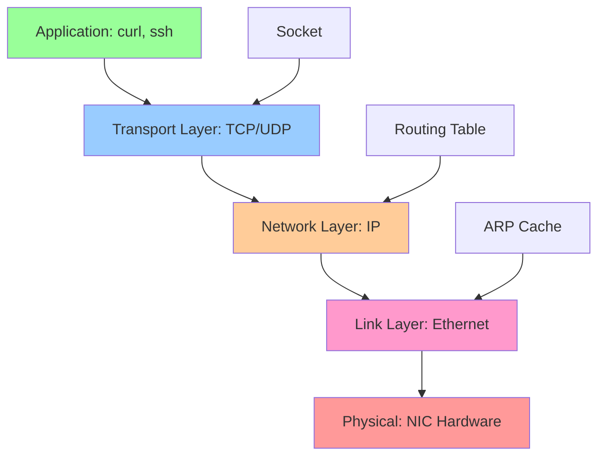
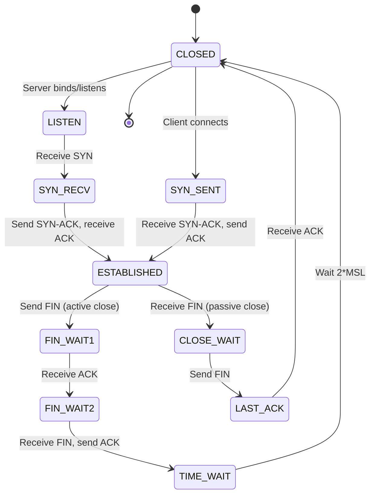

# Networking Tools

## Overview

Linux networking tools enable inspection, configuration, and troubleshooting of network interfaces, routing, DNS, connections, and packet flows. Modern tools (ip, ss) replace legacy utilities (ifconfig, netstat) with more powerful features and better performance.

> [!summary] Key Concepts
> - **Network Interface**: Hardware or virtual network device (eth0, wlan0, lo)
> - **IP Address**: Unique identifier for network interface (IPv4/IPv6)
> - **Routing Table**: Rules determining where packets are sent
> - **Socket**: Endpoint for network communication (IP:port combination)
> - **DNS**: Domain Name System - translates hostnames to IP addresses
> - **Packet Capture**: Recording network traffic for analysis

---

## Network Stack Overview



**Tools by Layer**:
- **Application**: `curl`, `wget`, `dig`, `nslookup`
- **Transport**: `ss`, `netstat`, `nc`
- **Network**: `ip route`, `ping`, `traceroute`
- **Link**: `ip link`, `ip neigh`, `arp`
- **Capture**: `tcpdump`, `wireshark`

---

## Network Interfaces and Addresses

### Viewing Interfaces

```bash
# Show all interfaces with IP addresses
ip addr
ip a

# Show specific interface
ip addr show eth0

# Show only IPv4 addresses
ip -4 addr

# Show only IPv6 addresses
ip -6 addr

# Brief output
ip -br addr

# Link layer information
ip link
ip link show eth0
```

**Example `ip addr` output**:
```
2: eth0: <BROADCAST,MULTICAST,UP,LOWER_UP> mtu 1500 qdisc fq_codel state UP
    link/ether 00:1a:2b:3c:4d:5e brd ff:ff:ff:ff:ff:ff
    inet 192.168.1.100/24 brd 192.168.1.255 scope global eth0
       valid_lft forever preferred_lft forever
    inet6 fe80::21a:2bff:fe3c:4d5e/64 scope link
       valid_lft forever preferred_lft forever
```

**Interface states**:
- `UP`: Interface is enabled
- `LOWER_UP`: Cable is plugged in (physical layer up)
- `BROADCAST`: Supports broadcast packets
- `MULTICAST`: Supports multicast packets

### Configuring Interfaces

```bash
# Bring interface up
sudo ip link set eth0 up

# Bring interface down
sudo ip link set eth0 down

# Add IP address
sudo ip addr add 192.168.1.100/24 dev eth0

# Delete IP address
sudo ip addr del 192.168.1.100/24 dev eth0

# Change MTU (Maximum Transmission Unit)
sudo ip link set eth0 mtu 9000

# Change MAC address
sudo ip link set eth0 address 00:11:22:33:44:55
```

> [!warning] Temporary Configuration
> Changes made with `ip` command are **not persistent** across reboots. Use network configuration tools (NetworkManager, netplan, /etc/network/interfaces) for persistence.

---

## Routing

### Viewing Routes

```bash
# Show routing table
ip route
ip r

# Show route to specific destination
ip route get 8.8.8.8

# Show IPv6 routes
ip -6 route

# Routing table with more details
ip route show table all
```

**Example `ip route` output**:
```
default via 192.168.1.1 dev eth0 proto dhcp metric 100
192.168.1.0/24 dev eth0 proto kernel scope link src 192.168.1.100 metric 100
```

**Route types**:
- `default`: Default gateway (0.0.0.0/0)
- `proto kernel`: Added by kernel
- `proto dhcp`: Added by DHCP client
- `metric`: Route priority (lower = higher priority)

### Managing Routes

```bash
# Add default gateway
sudo ip route add default via 192.168.1.1

# Add specific route
sudo ip route add 10.0.0.0/8 via 192.168.1.254

# Add route via interface (no gateway)
sudo ip route add 172.16.0.0/12 dev eth1

# Delete route
sudo ip route del 10.0.0.0/8

# Replace route
sudo ip route replace default via 192.168.1.2
```

### Route Tables and Policy Routing

```bash
# Show all routing tables
ip route show table all

# Show specific table
ip route show table main

# Add route to specific table
sudo ip route add 10.0.0.0/8 via 192.168.1.1 table 100

# Add routing policy rule
sudo ip rule add from 192.168.2.0/24 table 100

# Show routing rules
ip rule show
```

---

## ARP and Neighbor Discovery

### ARP Cache (IPv4)

```bash
# Show ARP cache
ip neigh
ip neighbor show

# Show only IPv4 neighbors
ip -4 neigh

# Show neighbors for specific interface
ip neigh show dev eth0

# Add static ARP entry
sudo ip neigh add 192.168.1.50 lladdr 00:11:22:33:44:55 dev eth0

# Delete ARP entry
sudo ip neigh del 192.168.1.50 dev eth0

# Flush ARP cache
sudo ip neigh flush all
```

**Example output**:
```
192.168.1.1 dev eth0 lladdr aa:bb:cc:dd:ee:ff REACHABLE
192.168.1.50 dev eth0 lladdr 00:11:22:33:44:55 STALE
```

**States**:
- `REACHABLE`: Recently confirmed reachable
- `STALE`: Not recently confirmed, but cached
- `DELAY`: Waiting for reachability confirmation
- `FAILED`: ARP resolution failed

---

## DNS Resolution

### getent (System Resolver)

```bash
# Resolve hostname using system resolver (/etc/hosts, DNS)
getent hosts example.com

# Reverse DNS lookup
getent hosts 8.8.8.8

# Show all hosts entries
getent hosts
```

**Benefits**: Uses same resolution as applications (respects `/etc/nsswitch.conf`)

### dig (DNS Query Tool)

```bash
# Basic DNS query
dig example.com

# Query specific record type
dig example.com A      # IPv4 address
dig example.com AAAA   # IPv6 address
dig example.com MX     # Mail exchange
dig example.com NS     # Name servers
dig example.com TXT    # Text records
dig example.com CNAME  # Canonical name

# Short answer only
dig +short example.com

# Query specific DNS server
dig @8.8.8.8 example.com

# Reverse DNS lookup
dig -x 8.8.8.8

# Trace DNS resolution path
dig +trace example.com

# Show detailed query timing
dig example.com +stats
```

**Example output**:
```
;; ANSWER SECTION:
example.com.		3600	IN	A	93.184.216.34

;; Query time: 15 msec
;; SERVER: 192.168.1.1#53(192.168.1.1)
;; WHEN: Sun Apr 26 10:00:00 UTC 2026
;; MSG SIZE  rcvd: 56
```

### nslookup (Legacy, but still common)

```bash
# Basic lookup
nslookup example.com

# Query specific server
nslookup example.com 8.8.8.8

# Interactive mode
nslookup
> server 1.1.1.1
> example.com
> exit
```

### host (Simple DNS lookup)

```bash
# Basic lookup
host example.com

# Reverse lookup
host 8.8.8.8

# Query specific type
host -t MX example.com
host -t NS example.com
```

### DNS Configuration Files

```bash
# DNS servers (modern systems use systemd-resolved)
cat /etc/resolv.conf

# Example:
# nameserver 8.8.8.8
# nameserver 1.1.1.1

# Static hostname to IP mapping
cat /etc/hosts

# Example:
# 127.0.0.1     localhost
# 192.168.1.100 myserver.local myserver

# Name service switch (resolution order)
cat /etc/nsswitch.conf

# Example:
# hosts: files dns
# (Check /etc/hosts first, then DNS)
```

---

## Sockets and Connections

### ss (Socket Statistics - Modern Tool)

```bash
# Show all TCP sockets
ss -ta

# Show all UDP sockets
ss -ua

# Show listening sockets
ss -l

# Show TCP listening sockets
ss -tl

# Show all sockets with process info
ss -tap

# Show all listening sockets with process and port numbers
ss -tulpen
# t: TCP, u: UDP, l: listening, p: process, e: extended, n: numeric

# Show established connections
ss -t state established

# Show connections to specific port
ss -tan '( dport = :443 or sport = :443 )'

# Show socket memory usage
ss -tm

# Summary statistics
ss -s
```

**Example `ss -tulpen` output**:
```
Netid State  Recv-Q Send-Q Local Address:Port  Peer Address:Port Process
tcp   LISTEN 0      128    0.0.0.0:22           0.0.0.0:*     users:(("sshd",pid=1234,fd=3))
tcp   LISTEN 0      128    0.0.0.0:80           0.0.0.0:*     users:(("nginx",pid=5678,fd=6))
```

**Column meanings**:
- **Recv-Q**: Bytes in receive queue (should be 0 for listening)
- **Send-Q**: Bytes in send queue (for listening: max backlog)
- **Local Address:Port**: Bound address and port
- **State**: Socket state (LISTEN, ESTAB, TIME-WAIT, etc.)

### netstat (Legacy, but still common)

```bash
# All listening ports
netstat -tuln

# All connections with process info (requires sudo)
sudo netstat -tulpen

# Routing table
netstat -rn

# Interface statistics
netstat -i

# Continuous monitoring
netstat -c
```

### TCP Connection States

| State | Description |
|-------|-------------|
| **LISTEN** | Waiting for incoming connections |
| **ESTABLISHED** | Active connection |
| **SYN_SENT** | Sent SYN, waiting for SYN-ACK |
| **SYN_RECV** | Received SYN, sent SYN-ACK |
| **FIN_WAIT1** | Sent FIN, waiting for ACK |
| **FIN_WAIT2** | Waiting for FIN from peer |
| **TIME_WAIT** | Waiting to ensure remote received ACK |
| **CLOSE_WAIT** | Remote closed, local not yet closed |
| **LAST_ACK** | Sent FIN, waiting for final ACK |
| **CLOSING** | Both sides closing simultaneously |



---

## Connectivity Testing

### ping (ICMP Echo)

```bash
# Ping with 4 packets (default on some systems)
ping -c 4 google.com

# Continuous ping (Ctrl+C to stop)
ping google.com

# Set interval between packets
ping -i 0.2 google.com  # Every 200ms

# Set packet size
ping -s 1000 google.com  # 1000 bytes

# Ping with specific source address
ping -I eth0 google.com

# IPv6 ping
ping6 google.com

# Quiet output (only summary)
ping -c 10 -q google.com
```

**Interpreting ping output**:
```
64 bytes from 142.250.185.78: icmp_seq=1 ttl=117 time=15.2 ms
```
- `icmp_seq`: Packet sequence number
- `ttl`: Time to live (hops remaining)
- `time`: Round-trip time (latency)

### traceroute / tracepath

```bash
# Trace route to destination
traceroute google.com

# Use ICMP instead of UDP (may bypass firewalls)
traceroute -I google.com

# Don't resolve hostnames (faster)
traceroute -n google.com

# tracepath (doesn't require root)
tracepath google.com
```

**Use case**: Identify where network path fails or which hop has high latency.

### nc (netcat - Network Swiss Army Knife)

```bash
# Test TCP connection to port
nc -vz example.com 443

# Test UDP connection
nc -vzu example.com 53

# Test port range
nc -zv example.com 80-443

# Simple HTTP request
echo -e "GET / HTTP/1.0\r\n\r\n" | nc example.com 80

# Listen on port (server mode)
nc -l 8080

# Transfer file
# Receiver:
nc -l 8080 > received_file
# Sender:
nc receiver_ip 8080 < file_to_send

# Simple chat
# Server:
nc -l 8080
# Client:
nc server_ip 8080
```

### curl (HTTP Client)

```bash
# Simple GET request
curl https://example.com

# Save output to file
curl -o output.html https://example.com
curl -O https://example.com/file.tar.gz  # Use remote filename

# Follow redirects
curl -L https://example.com

# Verbose output (show headers, SSL handshake)
curl -v https://example.com

# Show only headers
curl -I https://example.com
curl --head https://example.com

# POST request with data
curl -X POST -d "param1=value1&param2=value2" https://api.example.com

# POST JSON data
curl -X POST -H "Content-Type: application/json" \
     -d '{"key":"value"}' https://api.example.com

# Custom headers
curl -H "Authorization: Bearer TOKEN" https://api.example.com

# Download with progress bar
curl -# -O https://example.com/large_file.zip

# Retry on failure
curl --retry 5 --retry-delay 2 https://example.com

# Test SSL certificate
curl -v https://example.com 2>&1 | grep -A 10 "SSL"

# Ignore SSL certificate errors (use with caution)
curl -k https://self-signed.example.com

# Set timeout
curl --connect-timeout 10 --max-time 30 https://example.com

# Test via proxy
curl -x http://proxy:8080 https://example.com

# Show timing breakdown
curl -w "@-" -o /dev/null -s https://example.com <<EOF
    time_namelookup:  %{time_namelookup}s\n
       time_connect:  %{time_connect}s\n
    time_appconnect:  %{time_appconnect}s\n
      time_redirect:  %{time_redirect}s\n
   time_pretransfer:  %{time_pretransfer}s\n
 time_starttransfer:  %{time_starttransfer}s\n
                     ----------\n
         time_total:  %{time_total}s\n
EOF
```

### wget (File Downloader)

```bash
# Download file
wget https://example.com/file.tar.gz

# Resume interrupted download
wget -c https://example.com/large_file.zip

# Download recursively (mirror website)
wget -r -np -k https://example.com

# Limit download speed
wget --limit-rate=100k https://example.com/file.tar.gz

# Background download
wget -b https://example.com/file.tar.gz
tail -f wget-log  # Monitor progress

# Retry on failure
wget --tries=10 https://example.com/file.tar.gz
```

---

## Packet Capture and Analysis

### tcpdump (Command-Line Packet Capture)

```bash
# Capture on all interfaces
sudo tcpdump -i any

# Capture on specific interface
sudo tcpdump -i eth0

# Capture specific port
sudo tcpdump port 443

# Capture specific protocol
sudo tcpdump tcp
sudo tcpdump udp
sudo tcpdump icmp

# Capture to/from specific host
sudo tcpdump host 192.168.1.100

# Capture specific network
sudo tcpdump net 192.168.1.0/24

# Combine filters (AND)
sudo tcpdump 'tcp and port 443'

# OR condition
sudo tcpdump 'port 80 or port 443'

# NOT condition
sudo tcpdump 'not port 22'

# Capture HTTP traffic
sudo tcpdump -i eth0 'tcp port 80'

# Show packet contents (ASCII)
sudo tcpdump -A port 80

# Show packet contents (hex and ASCII)
sudo tcpdump -X port 80

# Verbose output (show TTL, IP options, etc.)
sudo tcpdump -v port 443

# Don't resolve hostnames (faster)
sudo tcpdump -n port 443

# Don't resolve hostnames or ports
sudo tcpdump -nn port 443

# Save to file (pcap format for Wireshark)
sudo tcpdump -w capture.pcap port 443

# Read from file
tcpdump -r capture.pcap

# Capture N packets and exit
sudo tcpdump -c 100 port 443

# Capture with timestamp
sudo tcpdump -tttt port 443

# Capture only TCP SYN packets
sudo tcpdump 'tcp[tcpflags] & tcp-syn != 0'

# Capture DNS queries
sudo tcpdump -i any 'udp port 53'
```

**Common use cases**:
```bash
# Debug HTTP API calls
sudo tcpdump -i any -A 'tcp port 8080 and (((ip[2:2] - ((ip[0]&0xf)<<2)) - ((tcp[12]&0xf0)>>2)) != 0)'

# Capture traffic between two hosts
sudo tcpdump 'host 192.168.1.100 and host 192.168.1.200'

# Monitor specific connection (by port)
sudo tcpdump -i eth0 'tcp port 55432'
```

### tshark (Wireshark CLI)

```bash
# Capture packets
sudo tshark -i eth0

# Capture with display filter
sudo tshark -i eth0 -f "tcp port 443"

# Read pcap file
tshark -r capture.pcap

# Extract specific field
tshark -r capture.pcap -T fields -e ip.src -e ip.dst -e tcp.port

# Statistics
tshark -r capture.pcap -q -z io,stat,1  # I/O stats per second
```

---

## Network Namespaces

```bash
# List network namespaces
ip netns list

# Create namespace
sudo ip netns add myns

# Execute command in namespace
sudo ip netns exec myns ip addr

# Run shell in namespace
sudo ip netns exec myns bash

# Delete namespace
sudo ip netns del myns

# Move interface to namespace
sudo ip link set eth1 netns myns
```

**Use case**: Container networking, network isolation, testing.

---

## Firewall (iptables/nftables Basics)

### iptables (Legacy, still common)

```bash
# List all rules
sudo iptables -L -v -n

# List rules for specific chain
sudo iptables -L INPUT -v -n

# Allow SSH
sudo iptables -A INPUT -p tcp --dport 22 -j ACCEPT

# Allow HTTP/HTTPS
sudo iptables -A INPUT -p tcp --dport 80 -j ACCEPT
sudo iptables -A INPUT -p tcp --dport 443 -j ACCEPT

# Drop all other input
sudo iptables -P INPUT DROP

# Allow established connections
sudo iptables -A INPUT -m state --state ESTABLISHED,RELATED -j ACCEPT

# Delete rule
sudo iptables -D INPUT 1  # Delete rule 1 from INPUT chain

# Save rules (Debian/Ubuntu)
sudo iptables-save > /etc/iptables/rules.v4

# Restore rules
sudo iptables-restore < /etc/iptables/rules.v4
```

### firewalld (RHEL/Fedora)

```bash
# Check status
sudo firewall-cmd --state

# List zones
firewall-cmd --get-zones

# List active zones
firewall-cmd --get-active-zones

# Allow service
sudo firewall-cmd --add-service=http
sudo firewall-cmd --add-service=https

# Make permanent
sudo firewall-cmd --runtime-to-permanent

# Allow port
sudo firewall-cmd --add-port=8080/tcp

# Remove service
sudo firewall-cmd --remove-service=http

# Reload firewall
sudo firewall-cmd --reload
```

---

## Common Pitfalls

> [!warning] Using ifconfig/netstat Instead of ip/ss
> **Problem**: `ifconfig` and `netstat` are deprecated, not installed by default on modern systems  
> **Solution**: Use `ip` and `ss` commands (faster, more features)  
> **Migration**: `ifconfig` → `ip addr`, `route` → `ip route`, `netstat` → `ss`

> [!warning] DNS Resolution Failures Due to /etc/resolv.conf
> **Problem**: `/etc/resolv.conf` incorrect or overwritten  
> **Check**: `cat /etc/resolv.conf` shows valid nameserver  
> **Solution**: Many systems use systemd-resolved - check `resolvectl status`

> [!warning] Firewall Blocking Connections
> **Problem**: Service listens on port but connections refused  
> **Check**: `sudo iptables -L -n` or `sudo firewall-cmd --list-all`  
> **Solution**: Allow port in firewall

> [!warning] Wrong Network Interface
> **Problem**: Configuring eth0 but actual interface is ens33 (systemd naming)  
> **Check**: `ip link` shows actual interface names  
> **Solution**: Use correct interface name from `ip link` output

> [!warning] TIME_WAIT Socket Exhaustion
> **Problem**: High connection rate causes TIME_WAIT socket buildup  
> **Check**: `ss -tan | grep TIME-WAIT | wc -l`  
> **Solution**: Tune kernel parameters (`net.ipv4.tcp_tw_reuse`, connection pooling)

> [!warning] MTU Mismatch
> **Problem**: Some connections work, others hang (especially VPN, jumbo frames)  
> **Check**: `ip link show` → check MTU values  
> **Solution**: Adjust MTU to match network path: `sudo ip link set eth0 mtu 1400`

---

## Interview Corner

> [!question]- Explain the difference between `ip addr` and `ip link`
> - **`ip addr`**: Shows **Layer 3** information (IP addresses, IPv4/IPv6 configuration)
> - **`ip link`**: Shows **Layer 2** information (MAC addresses, interface state, MTU)
> 
> **Use cases**:
> - `ip addr`: Check IP configuration, subnet mask, broadcast address
> - `ip link`: Check if cable is plugged in (LOWER_UP), MAC address, MTU

> [!question]- How do you find which process is listening on port 8080?
> **Answer**:
> ```bash
> # Method 1: ss (modern)
> sudo ss -tulpen | grep :8080
> 
> # Method 2: lsof
> sudo lsof -i :8080
> 
> # Method 3: netstat (legacy)
> sudo netstat -tulpen | grep :8080
> ```
> 
> **Output shows**: Process name, PID, user

> [!question]- What is the difference between `ping` and `curl` for testing connectivity?
> - **`ping`**: Tests **Layer 3** (ICMP) connectivity. Checks if host is reachable and network latency. Doesn't test application layer.
> - **`curl`**: Tests **Layer 7** (HTTP/HTTPS) connectivity. Verifies web server is running, SSL certificates valid, application responding.
> 
> **Scenario**: `ping` succeeds but `curl` fails → firewall allows ICMP but blocks HTTP, or web server is down.

> [!question]- Explain the purpose of TIME_WAIT state in TCP
> **TIME_WAIT** ensures reliable connection termination:
> 
> 1. **Prevents delayed packets**: Waits 2*MSL (Maximum Segment Lifetime) to ensure old packets from closed connection don't interfere with new connection using same port
> 2. **Ensures FIN acknowledged**: Allows retransmission of final ACK if peer's FIN is retransmitted
> 
> **Duration**: Typically 60 seconds (2 * MSL)  
> **Issue**: High connection rate → many TIME_WAIT sockets → port exhaustion  
> **Solution**: Connection pooling, `net.ipv4.tcp_tw_reuse` kernel parameter

> [!question]- How do you troubleshoot "no route to host" errors?
> **Systematic approach**:
> ```bash
> # 1. Check interface is up
> ip link show eth0
> 
> # 2. Check IP configuration
> ip addr show eth0
> 
> # 3. Check routing table
> ip route
> 
> # 4. Ping default gateway
> ping -c 3 192.168.1.1
> 
> # 5. Check firewall rules
> sudo iptables -L -n
> 
> # 6. Trace route to destination
> traceroute destination
> 
> # 7. Check ARP cache (for local network)
> ip neigh
> ```

> [!question]- What is the difference between `dig` and `getent hosts`?
> - **`dig`**: Queries DNS servers directly, bypasses `/etc/hosts`, shows detailed DNS protocol info
> - **`getent hosts`**: Uses system resolver (respects `/etc/nsswitch.conf`), checks `/etc/hosts` first, then DNS
> 
> **Use cases**:
> - `dig`: Troubleshoot DNS server issues, check TTL, test specific nameserver
> - `getent`: Test hostname resolution as applications see it (includes `/etc/hosts`)

> [!question]- How do you capture HTTP traffic for debugging?
> **Answer**:
> ```bash
> # Method 1: tcpdump (command-line)
> sudo tcpdump -i any -A 'tcp port 80'
> # -A: ASCII output, -X: hex+ASCII
> 
> # Method 2: tcpdump to file, analyze with Wireshark
> sudo tcpdump -i any -w http_traffic.pcap 'tcp port 80'
> wireshark http_traffic.pcap
> 
> # Method 3: For HTTPS, use application-level tools
> curl -v https://example.com  # Shows SSL handshake, headers
> ```

---

## Cheat Sheet

### Interfaces and Routes
```bash
ip addr                      # Show IP addresses
ip link                      # Show link layer info
ip route                     # Show routing table
ip route get 8.8.8.8         # Show route to specific host
ip neigh                     # Show ARP cache
```

### DNS
```bash
getent hosts example.com     # Resolve using system resolver
dig example.com              # DNS query with details
dig +short example.com       # Just the answer
dig @8.8.8.8 example.com     # Query specific server
dig -x 8.8.8.8               # Reverse lookup
```

### Sockets and Connections
```bash
ss -tulpen                   # All listening sockets
ss -tan                      # All TCP connections
ss -s                        # Socket statistics
sudo lsof -i :8080           # Process listening on port
```

### Connectivity Testing
```bash
ping -c 4 google.com         # ICMP echo test
traceroute google.com        # Trace network path
nc -zv example.com 443       # TCP port test
curl -v https://example.com  # HTTP request with details
```

### Packet Capture
```bash
sudo tcpdump -i any port 443         # Capture port 443
sudo tcpdump -nn port 80             # No hostname resolution
sudo tcpdump -w file.pcap port 443   # Save to file
tcpdump -r file.pcap                 # Read from file
```

---

## References

### Official Documentation
- [ip(8) Manual](https://man7.org/linux/man-pages/man8/ip.8.html)
- [ss(8) Manual](https://man7.org/linux/man-pages/man8/ss.8.html)
- [tcpdump(1) Manual](https://www.tcpdump.org/manpages/tcpdump.1.html)
- [dig(1) Manual](https://linux.die.net/man/1/dig)
- [curl(1) Manual](https://curl.se/docs/manpage.html)

### Tutorials and Guides
- [Linux Network Administration](https://www.kernel.org/doc/html/latest/networking/index.html)
- [Red Hat - Configuring and Managing Networking](https://access.redhat.com/documentation/en-us/red_hat_enterprise_linux/9/html/configuring_and_managing_networking/)
- [ArchWiki - Network Configuration](https://wiki.archlinux.org/title/Network_configuration)
- [TCP/IP Illustrated](https://www.amazon.com/TCP-Illustrated-Vol-Addison-Wesley-Professional/dp/0201633469)

### Online Tools
- [Wireshark](https://www.wireshark.org/) - GUI packet analyzer
- [PacketLife.net Cheat Sheets](https://packetlife.net/library/cheat-sheets/)

---

## Related Notes

- [[04_SSH_and_Remote_Access]] - SSH networking and tunneling
- [[01_Systemd_and_Services]] - Network service management
- [[02_Files_and_Permissions]] - Network filesystem permissions
- [[01_Performance_Tuning]] - Network performance optimization
- [[../Networking/]] - Deep dive into networking concepts

---

> [!tip] Best Practices
> 1. **Use modern tools**: Prefer `ip` over `ifconfig`, `ss` over `netstat`
> 2. **Capture to file**: Use `tcpdump -w file.pcap` for later analysis with Wireshark
> 3. **Test DNS separately**: Use both `dig` (DNS only) and `getent` (full system resolution)
> 4. **Check firewall first**: Common cause of connection failures
> 5. **Monitor TIME_WAIT**: High connection rate can exhaust ephemeral ports
> 6. **Use -n flag**: Skip DNS resolution in `ss`/`tcpdump` for faster output
> 7. **Document network config**: Keep notes on static routes, firewall rules for troubleshooting
> 8. **Test in layers**: Start with ping (Layer 3), then port test (Layer 4), then application (Layer 7)
