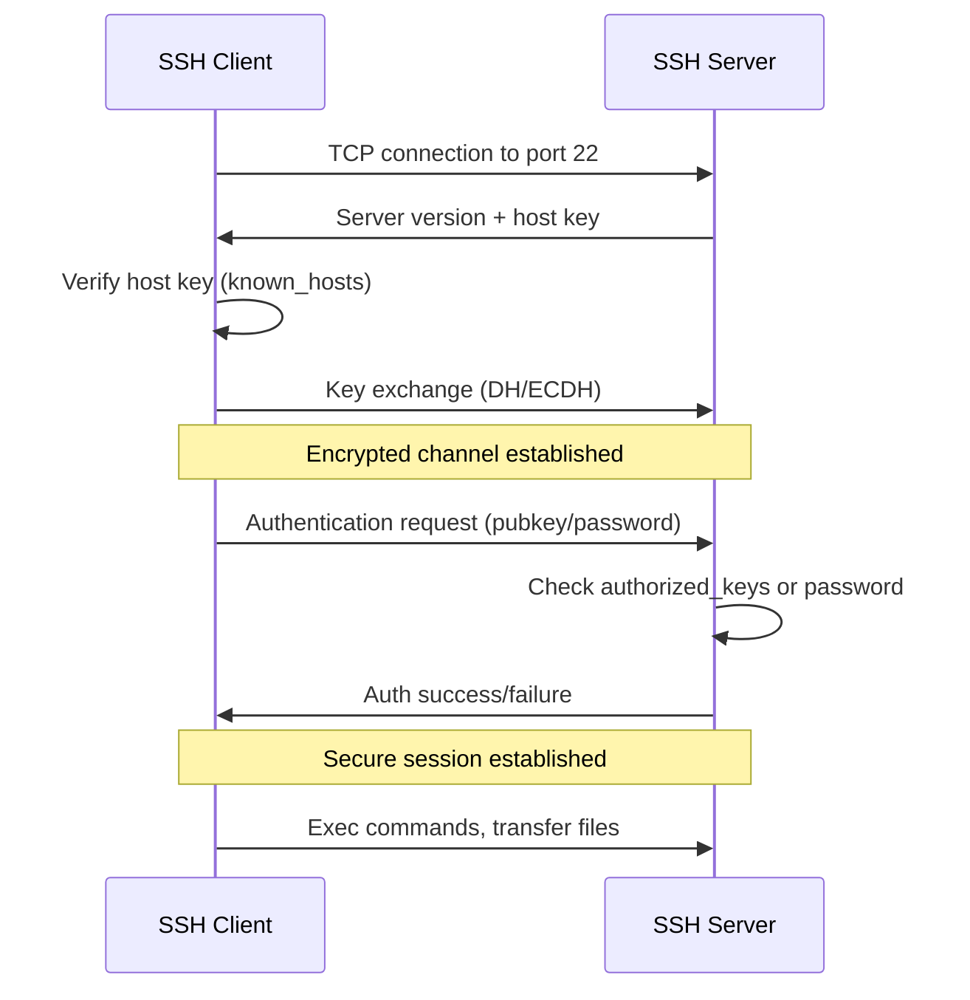

# SSH and Remote Access

## Overview

**SSH (Secure Shell)** is a cryptographic network protocol for secure remote access, file transfer, and port forwarding. It replaces insecure protocols like Telnet and rlogin, providing encrypted communication, authentication, and integrity.

> [!summary] Key Concepts
> - **SSH Client**: Tool for connecting to remote systems (`ssh` command)
> - **SSH Server**: Daemon accepting SSH connections (`sshd`)
> - **Public Key Authentication**: Passwordless authentication using cryptographic key pairs
> - **Port Forwarding**: Tunneling traffic through SSH connection
> - **SSH Agent**: Manages private keys and provides authentication
> - **Known Hosts**: Database of server public keys for host verification

---

## SSH Architecture



**Security layers**:
1. **Transport Layer**: Encryption, host verification
2. **Authentication Layer**: User authentication
3. **Connection Layer**: Multiplexing (multiple sessions over one connection)

---

## Basic Usage

### Connecting to Remote Host

```bash
# Basic connection (uses current username)
ssh hostname

# Specify username
ssh user@hostname

# Specify port
ssh -p 2222 user@hostname

# Execute command and exit
ssh user@hostname 'ls -la /var/log'

# Execute multiple commands
ssh user@hostname 'cd /var/log && tail syslog'

# Interactive pseudo-terminal for commands requiring it
ssh -t user@hostname 'sudo systemctl restart nginx'

# Quiet mode (suppress warnings)
ssh -q user@hostname

# Verbose mode (debugging)
ssh -v user@hostname
ssh -vv user@hostname   # More verbose
ssh -vvv user@hostname  # Maximum verbosity
```

### SSH Connection Options

| Option | Purpose | Example |
|--------|---------|---------|
| `-p PORT` | Specify port | `ssh -p 2222 user@host` |
| `-i FILE` | Identity file (private key) | `ssh -i ~/.ssh/id_rsa user@host` |
| `-t` | Force pseudo-terminal | `ssh -t user@host sudo vim /etc/hosts` |
| `-f` | Background SSH | `ssh -f user@host sleep 10` |
| `-N` | No command execution (tunneling) | `ssh -N -L 8080:localhost:80 user@host` |
| `-C` | Enable compression | `ssh -C user@host` |
| `-o OPTION` | Set config option | `ssh -o StrictHostKeyChecking=no user@host` |

---

## SSH Keys

### Key Types

| Type | Security | Speed | Key Size | Recommended |
|------|----------|-------|----------|-------------|
| **ed25519** | Excellent | Fast | 256-bit | ✅ Best choice |
| **ecdsa** | Good | Fast | 256/384/521-bit | ✅ Alternative |
| **rsa** | Good | Slower | 2048/4096-bit | ⚠️ Use 4096-bit |
| **dsa** | Weak | Fast | 1024-bit | ❌ Deprecated |

### Generating SSH Keys

```bash
# Generate ed25519 key (recommended)
ssh-keygen -t ed25519 -C "your_email@example.com"

# Generate RSA key with 4096 bits
ssh-keygen -t rsa -b 4096 -C "your_email@example.com"

# Generate ECDSA key
ssh-keygen -t ecdsa -b 521 -C "your_email@example.com"

# Specify output file
ssh-keygen -t ed25519 -f ~/.ssh/id_ed25519_work

# Generate without passphrase (use with caution)
ssh-keygen -t ed25519 -N "" -f ~/.ssh/id_ed25519
```

**Key generation prompts**:
```
Enter file in which to save the key (~/.ssh/id_ed25519): [press Enter]
Enter passphrase (empty for no passphrase): [enter strong passphrase]
Enter same passphrase again: [confirm passphrase]
```

**Generated files**:
- `~/.ssh/id_ed25519` - Private key (NEVER share)
- `~/.ssh/id_ed25519.pub` - Public key (safe to share)

### Deploying Public Key

```bash
# Copy public key to remote server (easiest method)
ssh-copy-id user@hostname

# Specify key file
ssh-copy-id -i ~/.ssh/id_ed25519.pub user@hostname

# Manual method (if ssh-copy-id not available)
cat ~/.ssh/id_ed25519.pub | ssh user@hostname 'mkdir -p ~/.ssh && cat >> ~/.ssh/authorized_keys'

# Even more manual (copy-paste)
# 1. Display public key
cat ~/.ssh/id_ed25519.pub

# 2. On remote server
mkdir -p ~/.ssh
echo "ssh-ed25519 AAAA...your_public_key... email@example.com" >> ~/.ssh/authorized_keys
chmod 700 ~/.ssh
chmod 600 ~/.ssh/authorized_keys
```

### SSH Key Permissions (Critical!)

```bash
# Correct permissions (SSH will refuse incorrect permissions)
chmod 700 ~/.ssh
chmod 600 ~/.ssh/id_ed25519           # Private key
chmod 644 ~/.ssh/id_ed25519.pub       # Public key
chmod 600 ~/.ssh/authorized_keys      # Server side
chmod 600 ~/.ssh/config               # Client config
chmod 600 ~/.ssh/known_hosts          # Known hosts
```

> [!warning] Permission Errors
> **Problem**: "WARNING: UNPROTECTED PRIVATE KEY FILE!"  
> **Cause**: Private key has incorrect permissions (readable by group/others)  
> **Solution**: `chmod 600 ~/.ssh/id_ed25519`

### SSH Agent (Avoid Repeated Passphrase)

```bash
# Start SSH agent
eval "$(ssh-agent -s)"

# Add private key to agent
ssh-add ~/.ssh/id_ed25519

# Add key with specific lifetime (1 hour)
ssh-add -t 3600 ~/.ssh/id_ed25519

# List keys in agent
ssh-add -l

# Remove all keys from agent
ssh-add -D

# Remove specific key
ssh-add -d ~/.ssh/id_ed25519
```

**Automatic agent startup** (add to `~/.bashrc` or `~/.zshrc`):
```bash
# Start agent if not running
if [ -z "$SSH_AUTH_SOCK" ]; then
    eval "$(ssh-agent -s)"
    ssh-add ~/.ssh/id_ed25519
fi
```

---

## SSH Client Configuration

### ~/.ssh/config

**Simplify SSH commands with config file**:

```sshconfig
# Default settings for all hosts
Host *
    ServerAliveInterval 60
    ServerAliveCountMax 3
    Compression yes
    
# Production server
Host prod
    HostName 10.0.0.10
    User ubuntu
    Port 22
    IdentityFile ~/.ssh/id_ed25519_prod
    
# Development server with bastion jump
Host dev
    HostName 10.0.1.20
    User developer
    ProxyJump bastion
    
# Bastion/jump host
Host bastion
    HostName bastion.example.com
    User admin
    Port 2222
    
# Short alias for frequently used host
Host myserver
    HostName very-long-hostname.example.com
    User myusername
    IdentityFile ~/.ssh/id_ed25519
    LocalForward 5432 localhost:5432
    
# GitHub
Host github.com
    HostName github.com
    User git
    IdentityFile ~/.ssh/id_ed25519_github
    
# Wildcard for all servers in subnet
Host 192.168.1.*
    User admin
    StrictHostKeyChecking no
    UserKnownHostsFile /dev/null
```

**Common config options**:

| Option | Purpose | Example |
|--------|---------|---------|
| `HostName` | Actual hostname/IP | `HostName 10.0.0.10` |
| `User` | Remote username | `User ubuntu` |
| `Port` | SSH port | `Port 2222` |
| `IdentityFile` | Private key path | `IdentityFile ~/.ssh/id_rsa` |
| `ProxyJump` | Jump host | `ProxyJump bastion` |
| `LocalForward` | Local port forwarding | `LocalForward 8080 localhost:80` |
| `RemoteForward` | Remote port forwarding | `RemoteForward 9000 localhost:9000` |
| `ServerAliveInterval` | Keepalive interval (seconds) | `ServerAliveInterval 60` |
| `StrictHostKeyChecking` | Host key verification | `StrictHostKeyChecking no` |
| `UserKnownHostsFile` | Known hosts file | `UserKnownHostsFile /dev/null` |

**Usage with config**:
```bash
# Instead of: ssh -p 2222 ubuntu@10.0.0.10 -i ~/.ssh/id_ed25519_prod
ssh prod

# Instead of: ssh developer@10.0.1.20 -J admin@bastion.example.com:2222
ssh dev
```

---

## Port Forwarding (SSH Tunneling)

### Local Port Forwarding

**Forward remote service to local port**:

```bash
# Access remote PostgreSQL locally
ssh -L 5432:localhost:5432 user@dbserver
# Now connect to localhost:5432 on your machine → reaches dbserver:5432

# Bind to specific local interface
ssh -L 127.0.0.1:8080:localhost:80 user@webserver
ssh -L 0.0.0.0:8080:localhost:80 user@webserver  # Listen on all interfaces

# Access service on third machine via SSH server
ssh -L 3306:database.internal:3306 user@jumphost
# localhost:3306 → jumphost → database.internal:3306

# Multiple forwards
ssh -L 8080:localhost:80 -L 5432:localhost:5432 user@server
```

**Diagram**:
```
[Your Machine:5432] --SSH tunnel--> [Remote Server:22] --> [localhost:5432 PostgreSQL]
```

**Use cases**:
- Access database on remote server without exposing it publicly
- Access internal services through bastion host
- Encrypted tunnel for insecure protocols

### Remote Port Forwarding

**Expose local service on remote server**:

```bash
# Expose local web server on remote machine
ssh -R 9000:localhost:8080 user@remote
# remote:9000 → SSH tunnel → localhost:8080

# Allow remote server to share forward with others
ssh -R 0.0.0.0:9000:localhost:8080 user@remote
# Requires GatewayPorts yes in /etc/ssh/sshd_config

# Expose service on third machine
ssh -R 9000:internal.local:80 user@public-server
```

**Diagram**:
```
[Remote Server:9000] <--SSH tunnel-- [Your Machine:22] <-- [localhost:8080]
```

**Use cases**:
- Demo local development to remote client
- Webhook testing (expose local webhook endpoint)
- Bypass NAT/firewall for incoming connections

### Dynamic Port Forwarding (SOCKS Proxy)

```bash
# Create SOCKS proxy
ssh -D 1080 user@remote

# Bind to specific interface
ssh -D 127.0.0.1:1080 user@remote

# Configure applications to use SOCKS proxy:
# Firefox: Preferences → Network → Settings → Manual Proxy → SOCKS: localhost:1080
# curl: curl --proxy socks5://localhost:1080 https://example.com
```

**Use cases**:
- Browse through remote server (appear to come from remote IP)
- Access geo-restricted content
- Encrypted browsing on untrusted networks

### Persistent Tunnels

```bash
# Keep tunnel alive (-N: no command, -f: background)
ssh -N -f -L 5432:localhost:5432 user@dbserver

# Auto-reconnect tunnel (autossh)
autossh -M 0 -N -L 5432:localhost:5432 user@dbserver

# Systemd service for persistent tunnel
# /etc/systemd/system/ssh-tunnel.service
[Unit]
Description=SSH Tunnel to Database
After=network.target

[Service]
ExecStart=/usr/bin/ssh -N -L 5432:localhost:5432 user@dbserver
Restart=always
RestartSec=10

[Install]
WantedBy=multi-user.target
```

---

## File Transfer

### scp (Secure Copy)

```bash
# Copy file to remote
scp file.txt user@host:/remote/path/

# Copy file from remote
scp user@host:/remote/file.txt /local/path/

# Copy directory recursively
scp -r ./directory/ user@host:/remote/path/

# Specify port
scp -P 2222 file.txt user@host:/remote/path/

# Preserve file attributes (timestamps, permissions)
scp -p file.txt user@host:/remote/path/

# Verbose output
scp -v file.txt user@host:/remote/path/

# Copy between two remote hosts
scp user1@host1:/path/file.txt user2@host2:/path/

# Use specific key
scp -i ~/.ssh/id_ed25519 file.txt user@host:/path/
```

### rsync (Advanced Sync)

```bash
# Basic sync
rsync -avz ./local/ user@host:/remote/
# -a: archive (preserve permissions, timestamps, etc.)
# -v: verbose
# -z: compression

# Dry run (show what would be transferred)
rsync -avzn ./local/ user@host:/remote/

# Delete files on destination not in source
rsync -avz --delete ./local/ user@host:/remote/

# Show progress
rsync -avz --progress ./local/ user@host:/remote/

# Exclude files/directories
rsync -avz --exclude 'node_modules' --exclude '*.log' ./local/ user@host:/remote/

# Include/exclude patterns
rsync -avz --include '*.txt' --exclude '*' ./local/ user@host:/remote/

# Partial transfers (resume interrupted transfers)
rsync -avz --partial ./local/ user@host:/remote/

# Bandwidth limit (KB/s)
rsync -avz --bwlimit=1000 ./local/ user@host:/remote/

# SSH options (port, key)
rsync -avz -e "ssh -p 2222 -i ~/.ssh/id_rsa" ./local/ user@host:/remote/

# Sync from remote to local
rsync -avz user@host:/remote/ ./local/
```

**rsync vs scp**:
- **rsync**: Incremental transfer (only changes), compression, advanced filtering
- **scp**: Simple, suitable for one-time transfers

### sftp (Interactive File Transfer)

```bash
# Start SFTP session
sftp user@hostname

# Common SFTP commands:
# get remote_file              - Download file
# put local_file               - Upload file
# ls                           - List remote directory
# lls                          - List local directory
# cd remote_dir                - Change remote directory
# lcd local_dir                - Change local directory
# pwd                          - Show remote working directory
# lpwd                         - Show local working directory
# mkdir dir                    - Create remote directory
# rm file                      - Delete remote file
# bye / exit / quit            - Close session

# Batch mode (non-interactive)
sftp -b commands.txt user@hostname
# commands.txt:
# cd /remote/path
# put file1.txt
# put file2.txt
# bye
```

---

## SSH Server Configuration

### /etc/ssh/sshd_config

**Common security settings**:

```sshconfig
# Port
Port 22

# Listen address
ListenAddress 0.0.0.0

# Disable root login
PermitRootLogin no

# Public key authentication
PubkeyAuthentication yes
AuthorizedKeysFile .ssh/authorized_keys

# Password authentication (disable after setting up keys)
PasswordAuthentication no
PermitEmptyPasswords no

# Challenge-response authentication
ChallengeResponseAuthentication no

# Allow specific users/groups
AllowUsers alice bob
AllowGroups sshusers

# Deny specific users/groups
DenyUsers eve
DenyGroups hackers

# SSH protocol version
Protocol 2

# Host keys
HostKey /etc/ssh/ssh_host_ed25519_key
HostKey /etc/ssh/ssh_host_rsa_key

# Logging
SyslogFacility AUTH
LogLevel VERBOSE

# Session settings
ClientAliveInterval 300
ClientAliveCountMax 2
MaxStartups 10:30:60

# Subsystem
Subsystem sftp /usr/lib/openssh/sftp-server

# Allow TCP forwarding
AllowTcpForwarding yes
GatewayPorts no

# X11 forwarding
X11Forwarding no
```

**Apply configuration changes**:
```bash
# Test configuration syntax
sudo sshd -t

# Restart SSH daemon
sudo systemctl restart sshd

# Always keep existing session open when testing!
```

---

## Troubleshooting

### Verbose SSH Output

```bash
# Debug connection issues
ssh -vvv user@hostname

# Output shows:
# - Reading config files
# - Resolving hostname
# - Connecting to IP:port
# - SSH version exchange
# - Host key verification
# - Authentication attempts (publickey, password)
# - Success/failure reasons
```

### Common Issues

#### 1. Permission Denied (Public Key)

```bash
# Check verbose output
ssh -vv user@host

# Verify permissions
ls -la ~/.ssh/
# ~/.ssh should be 700
# ~/.ssh/id_ed25519 should be 600
# ~/.ssh/id_ed25519.pub should be 644

# Server side - check authorized_keys
ssh user@host 'ls -la ~/.ssh/authorized_keys'
# Should be 600

# Verify key is in authorized_keys
ssh user@host 'cat ~/.ssh/authorized_keys' | grep "$(cat ~/.ssh/id_ed25519.pub)"

# Server logs (on remote server)
sudo tail -f /var/log/auth.log  # Debian/Ubuntu
sudo tail -f /var/log/secure     # RHEL/CentOS
```

#### 2. Host Key Verification Failed

```
@@@@@@@@@@@@@@@@@@@@@@@@@@@@@@@@@@@@@@@@@@@@@@@@@@@@@@@@@@@
@    WARNING: REMOTE HOST IDENTIFICATION HAS CHANGED!     @
@@@@@@@@@@@@@@@@@@@@@@@@@@@@@@@@@@@@@@@@@@@@@@@@@@@@@@@@@@@
```

**Causes**:
- Server reinstalled / host key regenerated
- Man-in-the-middle attack (rare)

**Solutions**:
```bash
# Remove old host key
ssh-keygen -R hostname

# Or edit known_hosts manually
vim ~/.ssh/known_hosts
# Delete line matching hostname

# Skip host key checking (use with caution)
ssh -o StrictHostKeyChecking=no user@host
ssh -o UserKnownHostsFile=/dev/null -o StrictHostKeyChecking=no user@host
```

#### 3. Connection Timeout

```bash
# Check if SSH port is open
nc -zv hostname 22

# Check firewall on client
sudo iptables -L OUTPUT -n

# Check firewall on server (requires access)
sudo iptables -L INPUT -n

# Check if SSH daemon is running (requires access)
sudo systemctl status sshd

# Check listening ports on server (requires access)
sudo ss -tuln | grep :22
```

#### 4. Too Many Authentication Failures

```
Received disconnect from host: 2: Too many authentication failures
```

**Cause**: SSH client tries multiple keys, server rejects after limit

**Solution**:
```bash
# Specify single identity file
ssh -o IdentitiesOnly=yes -i ~/.ssh/id_ed25519 user@host

# Or in ~/.ssh/config:
Host myserver
    HostName example.com
    IdentityFile ~/.ssh/id_ed25519
    IdentitiesOnly yes
```

---

## Security Best Practices

### Server Hardening

```bash
# 1. Disable password authentication (use keys only)
PasswordAuthentication no

# 2. Disable root login
PermitRootLogin no

# 3. Change default port (security through obscurity)
Port 2222

# 4. Limit users
AllowUsers alice bob

# 5. Use fail2ban to block brute force
sudo apt install fail2ban
sudo systemctl enable fail2ban

# 6. Enable firewall
sudo ufw allow 22/tcp
sudo ufw enable

# 7. Keep SSH updated
sudo apt update && sudo apt upgrade openssh-server
```

### Client Security

```bash
# 1. Use strong passphrases on private keys

# 2. Use SSH agent instead of unencrypted keys

# 3. Verify host keys on first connection

# 4. Use ed25519 keys (modern, secure)

# 5. Separate keys for different purposes
~/.ssh/id_ed25519_work
~/.ssh/id_ed25519_personal
~/.ssh/id_ed25519_github
```

---

## Common Pitfalls

> [!warning] World-Writable .ssh Directory
> **Problem**: `Permission denied (publickey)`  
> **Cause**: `~/.ssh/` or files within have incorrect permissions  
> **Solution**: `chmod 700 ~/.ssh && chmod 600 ~/.ssh/*`

> [!warning] Locked Out After Disabling Password Auth
> **Problem**: Can't login after setting `PasswordAuthentication no`  
> **Prevention**: Always keep existing SSH session open while testing  
> **Recovery**: Use cloud provider console/KVM to regain access and fix

> [!warning] Using Wrong Key
> **Problem**: Authentication fails despite correct key deployment  
> **Check**: `ssh -vv` shows which keys are tried  
> **Solution**: Specify correct key: `ssh -i ~/.ssh/id_ed25519 user@host`

> [!warning] Firewall Blocking SSH
> **Problem**: Connection timeout  
> **Check**: `nc -zv host 22` from client  
> **Solution**: Allow port 22 in firewall (ufw, iptables, cloud security group)

> [!warning] Server Host Key Changed
> **Problem**: "WARNING: REMOTE HOST IDENTIFICATION HAS CHANGED!"  
> **Check**: Did you reinstall the server?  
> **Solution**: `ssh-keygen -R hostname` to remove old key

> [!warning] Tunnel Exits on Command Completion
> **Problem**: `ssh -L 5432:localhost:5432 user@host` exits immediately  
> **Solution**: Add `-N` flag: `ssh -N -L 5432:localhost:5432 user@host`

---

## Interview Corner

> [!question]- Explain how SSH public key authentication works
> 1. **Key generation**: Client generates key pair (private + public)
> 2. **Key deployment**: Public key copied to server's `~/.ssh/authorized_keys`
> 3. **Authentication flow**:
>    - Client connects, offers public key fingerprint
>    - Server checks if public key exists in `authorized_keys`
>    - Server generates random challenge, encrypts with public key
>    - Client decrypts challenge with private key, sends response
>    - Server verifies response, grants access
> 
> **Security**: Private key never transmitted, challenge-response proves possession

> [!question]- What is the difference between local and remote port forwarding?
> - **Local forwarding (`-L`)**: Forward remote service to local port  
>   `ssh -L 5432:localhost:5432 user@dbserver`  
>   Access remote DB as if it's local (localhost:5432)
> 
> - **Remote forwarding (`-R`)**: Expose local service on remote server  
>   `ssh -R 9000:localhost:8080 user@remote`  
>   Remote server can access your local web server (remote:9000)
> 
> **Mnemonic**: `-L` = Local listens, `-R` = Remote listens

> [!question]- How do you troubleshoot SSH connection failures?
> **Systematic approach**:
> ```bash
> # 1. Verbose output
> ssh -vvv user@host
> 
> # 2. Test connectivity
> ping host
> nc -zv host 22
> 
> # 3. Check client config
> cat ~/.ssh/config
> ls -la ~/.ssh/
> 
> # 4. Verify key (if using pubkey)
> ssh-add -l
> cat ~/.ssh/id_ed25519.pub
> 
> # 5. Server logs (if accessible)
> sudo tail -f /var/log/auth.log
> 
> # 6. Check server status
> sudo systemctl status sshd
> sudo ss -tuln | grep :22
> ```

> [!question]- What are the security implications of disabling StrictHostKeyChecking?
> **`StrictHostKeyChecking no`** disables host key verification.
> 
> **Risks**:
> - **Man-in-the-middle attacks**: Attacker can intercept connection
> - **No warning for changed host keys**: Silent acceptance of new keys
> - **Defeats SSH security model**: Can't verify server identity
> 
> **When acceptable** (with caution):
> - Automated scripts in isolated, trusted network
> - Dynamic cloud instances with changing IPs
> 
> **Better alternatives**:
> - `StrictHostKeyChecking accept-new`: Accept new keys, reject changed keys
> - Proper known_hosts management

> [!question]- Explain SSH connection multiplexing and its benefits
> **Connection multiplexing**: Reuse existing SSH connection for new sessions.
> 
> **Configuration** (`~/.ssh/config`):
> ```sshconfig
> Host *
>     ControlMaster auto
>     ControlPath ~/.ssh/sockets/%r@%h-%p
>     ControlPersist 600
> ```
> 
> **Benefits**:
> 1. **Faster**: No repeated authentication/handshake
> 2. **Fewer connections**: Reuses single TCP connection
> 3. **Better for automation**: Scripts connect instantly
> 
> **Use case**: Frequent connections to same server (Ansible, deployment scripts)

> [!question]- How do you securely copy files to a server without SSH access from your machine?
> **Scenario**: Direct SSH blocked, but server can SSH to your machine.
> 
> **Solution**: Reverse SCP using remote port forwarding
> ```bash
> # On your machine: Start SSH server (if not running)
> sudo systemctl start sshd
> 
> # On remote server: Reverse tunnel
> ssh -R 2222:localhost:22 user@your_machine
> 
> # On remote server: SCP via tunnel
> scp -P 2222 file.txt localhost:/path/
> ```

---

## Cheat Sheet

### Basic SSH
```bash
ssh user@host                    # Connect
ssh -p 2222 user@host            # Custom port
ssh -i ~/.ssh/id_ed25519 user@host  # Specific key
ssh -t user@host 'sudo cmd'      # Pseudo-terminal
ssh -vvv user@host               # Debug connection
```

### SSH Keys
```bash
ssh-keygen -t ed25519            # Generate key
ssh-copy-id user@host            # Deploy public key
ssh-add ~/.ssh/id_ed25519        # Add to agent
ssh-add -l                       # List keys in agent
chmod 700 ~/.ssh                 # Fix permissions
chmod 600 ~/.ssh/id_ed25519      # Private key permission
```

### Port Forwarding
```bash
ssh -L 5432:localhost:5432 user@host     # Local forward
ssh -R 9000:localhost:8080 user@host     # Remote forward
ssh -D 1080 user@host                    # SOCKS proxy
ssh -N -f -L 5432:localhost:5432 user@host  # Background tunnel
```

### File Transfer
```bash
scp file.txt user@host:/path/            # Copy to remote
scp user@host:/path/file.txt .           # Copy from remote
scp -r ./dir/ user@host:/path/           # Copy directory
rsync -avz ./local/ user@host:/remote/   # Sync directories
rsync -avz --delete ./local/ user@host:/remote/  # Sync + delete
```

### Troubleshooting
```bash
ssh -vvv user@host                       # Verbose debugging
ssh-keygen -R hostname                   # Remove host key
nc -zv hostname 22                       # Test SSH port
sudo tail -f /var/log/auth.log           # Server logs
```

---

## References

### Official Documentation
- [ssh(1) Manual](https://man7.org/linux/man-pages/man1/ssh.1.html)
- [ssh_config(5) Manual](https://man7.org/linux/man-pages/man5/ssh_config.5.html)
- [sshd_config(5) Manual](https://man7.org/linux/man-pages/man5/sshd_config.5.html)
- [OpenSSH Homepage](https://www.openssh.com/)

### Tutorials and Guides
- [SSH Academy](https://www.ssh.com/academy/ssh)
- [ArchWiki - SSH](https://wiki.archlinux.org/title/OpenSSH)
- [Red Hat - Using SSH](https://access.redhat.com/documentation/en-us/red_hat_enterprise_linux/9/html/securing_networks/using-secure-communications-between-two-systems-with-openssh_securing-networks)

### Security
- [SSH Best Practices](https://infosec.mozilla.org/guidelines/openssh)
- [NIST Guide to SSH](https://csrc.nist.gov/publications/detail/sp/800-115/final)

---

## Related Notes

- [[03_Networking_Tools]] - Network connectivity and debugging
- [[01_Systemd_and_Services]] - Managing sshd service
- [[02_Files_and_Permissions]] - SSH file permissions
- [[01_Performance_Tuning]] - SSH connection optimization

---

> [!tip] Best Practices
> 1. **Use ed25519 keys**: Modern, secure, fast
> 2. **Passphrase protect keys**: Prevents key theft impact
> 3. **Use SSH agent**: Avoid repeated passphrase entry
> 4. **Disable password auth**: Force key-based authentication
> 5. **Keep sessions open when testing**: Prevent lockout
> 6. **Use ~/.ssh/config**: Simplify common connections
> 7. **Verify host keys**: Protect against MITM attacks
> 8. **Separate keys by purpose**: Different keys for work, personal, GitHub
