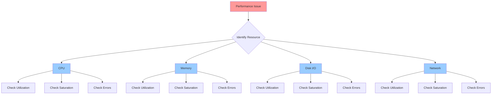

# Performance Tuning and Profiling

## Overview

Performance tuning involves identifying resource bottlenecks (CPU, memory, disk I/O, network) and optimizing system configuration or application behavior. Effective performance work follows a methodical approach: measure, identify bottleneck, profile, fix, verify.

> [!summary] Key Concepts
> - **Bottleneck**: Resource constraint limiting overall system performance
> - **Saturation**: Resource utilization approaching or exceeding capacity
> - **Latency**: Time delay for operation completion
> - **Throughput**: Rate of operation completion
> - **Profiling**: Detailed analysis of where resources are consumed
> - **USE Method**: Utilization, Saturation, Errors for each resource

---

## Performance Methodology

### USE Method (Brendan Gregg)

For every resource, check:
1. **Utilization**: % time resource was busy
2. **Saturation**: Degree of queued work
3. **Errors**: Error events



### Performance Tuning Workflow

1. **Measure baseline**: Establish current performance metrics
2. **Identify bottleneck**: CPU, memory, disk, or network?
3. **Isolate cause**: Which process, application, or configuration?
4. **Profile**: Deep dive into specific resource usage
5. **Fix**: Apply smallest effective change
6. **Verify**: Confirm improvement, check for regressions
7. **Document**: Record changes and results

---

## CPU Performance

### Monitoring CPU

```bash
# Overall CPU usage (interactive)
top
htop  # Better interface, requires installation

# Per-CPU statistics
mpstat -P ALL 1
# Watch for imbalance (one CPU saturated, others idle)

# Per-process CPU usage
pidstat -u 1

# CPU usage over time
sar -u 1 10  # 10 samples, 1 second apart

# Process CPU consumption
ps aux --sort=-%cpu | head -20
```

**Key metrics**:
- **%user**: User-space CPU time
- **%system**: Kernel-space CPU time
- **%iowait**: Waiting for I/O (disk bottleneck indicator)
- **%idle**: Idle time
- **%steal**: Stolen by hypervisor (virtualization)

### CPU Utilization Analysis

```bash
# Top output interpretation
top
# PID USER   PR  NI    VIRT    RES    SHR S  %CPU  %MEM     TIME+ COMMAND
# 1234 app    20   0  2.0g   1.5g  10m S  95.0   10.0  12:34.56 myapp

# %CPU: 95% - High CPU usage (near saturation)
# S: State (S=Sleep, R=Running, D=Uninterruptible sleep)
```

**States**:
- **R**: Running or runnable (on run queue)
- **S**: Interruptible sleep (waiting for event)
- **D**: Uninterruptible sleep (usually I/O) - **RED FLAG if many**
- **Z**: Zombie (terminated, waiting for parent)
- **T**: Stopped (by signal)

### CPU Affinity and Pinning

```bash
# Check CPU affinity
taskset -p PID

# Pin process to specific CPUs (0 and 1)
taskset -c 0,1 PID

# Start process with affinity
taskset -c 0-3 mycommand

# Use case: Isolate CPU-intensive process to specific cores
```

### CPU Frequency Scaling

```bash
# Check CPU frequency governor
cat /sys/devices/system/cpu/cpu*/cpufreq/scaling_governor

# Available governors
cat /sys/devices/system/cpu/cpu0/cpufreq/scaling_available_governors
# Common: performance, powersave, ondemand, conservative

# Set to performance mode (max frequency)
echo performance | sudo tee /sys/devices/system/cpu/cpu*/cpufreq/scaling_governor

# Or use cpupower
sudo cpupower frequency-set -g performance
```

**Governors**:
- **performance**: Always max frequency (high performance, high power)
- **powersave**: Always min frequency (low power)
- **ondemand**: Scale based on load (default on many systems)
- **conservative**: Similar to ondemand, but more gradual scaling

---

## Memory Performance

### Monitoring Memory

```bash
# Overall memory usage
free -h

# Example output:
#               total        used        free      shared  buff/cache   available
# Mem:            16G         8G         2G         1G         6G          7G
# Swap:           8G         1G         7G

# Key fields:
# - available: Memory available for new apps (includes reclaimable cache)
# - buff/cache: Cache is reclaimable, not "wasted"

# Detailed memory stats
vmstat 1
# r: processes waiting for CPU
# b: processes in uninterruptible sleep (I/O)
# swpd: virtual memory used
# free: free physical memory
# buff: buffer cache
# cache: page cache
# si: swap in (from disk)
# so: swap out (to disk)

# Per-process memory
pidstat -r 1

# Memory by process
ps aux --sort=-%mem | head -20

# Detailed process memory
pmap -x PID
```

### Memory Issues

**Out of Memory (OOM)**:
```bash
# Check OOM killer logs
dmesg | grep -i oom
journalctl -k | grep -i oom

# OOM score (higher = more likely to be killed)
cat /proc/PID/oom_score

# Adjust OOM score (lower = less likely to be killed)
echo -1000 | sudo tee /proc/PID/oom_score_adj  # -1000 to 1000
```

**Swap usage**:
```bash
# Check swap usage
swapon --show

# Per-process swap
for pid in $(pgrep -x myapp); do
    awk '/^Swap:/ {sum+=$2} END {print sum " kB"}' /proc/$pid/smaps
done

# Reduce swappiness (0-100, lower = less swapping)
sudo sysctl vm.swappiness=10
echo "vm.swappiness=10" | sudo tee -a /etc/sysctl.conf
```

### Memory Leaks

```bash
# Monitor process memory over time
watch -n 1 'ps aux | grep myapp'

# Or with pidstat
pidstat -r -p PID 1

# Valgrind for memory leak detection (development)
valgrind --leak-check=full ./myapp

# strace to see memory allocations (production - high overhead)
strace -e brk,mmap,munmap -p PID
```

### Huge Pages

```bash
# Check huge page configuration
cat /proc/meminfo | grep -i huge

# Configure transparent huge pages
cat /sys/kernel/mm/transparent_hugepage/enabled
# [always] madvise never

# Disable THP (some workloads perform worse)
echo never | sudo tee /sys/kernel/mm/transparent_hugepage/enabled

# Persistent:
# /etc/default/grub
GRUB_CMDLINE_LINUX="transparent_hugepage=never"
sudo update-grub
```

---

## Disk I/O Performance

### Monitoring Disk I/O

```bash
# Disk statistics
iostat -xz 1

# Key metrics:
# %util: % time device was busy (saturation indicator)
# await: Average I/O wait time (ms)
# r/s, w/s: Reads/writes per second
# rkB/s, wkB/s: Read/write throughput (KB/s)

# Per-process I/O
pidstat -d 1

# I/O by process
iotop
iotop -o  # Only show processes doing I/O

# Block device stats
cat /proc/diskstats
```

### Disk I/O Analysis

```bash
# Find processes causing high I/O
iotop -o -b -n 3

# Trace I/O operations
sudo blktrace -d /dev/sda -o - | blkparse -i -

# I/O scheduler
cat /sys/block/sda/queue/scheduler
# [mq-deadline] kyber bfq none

# Change I/O scheduler (for HDD: mq-deadline, for SSD: none/kyber)
echo none | sudo tee /sys/block/sda/queue/scheduler
```

### Filesystem Performance

```bash
# Filesystem cache stats
cat /proc/meminfo | grep -E 'Cached|Dirty|Writeback'

# Force cache flush (sync)
sync

# Drop caches (testing only, not for production tuning!)
echo 3 | sudo tee /proc/sys/vm/drop_caches

# Tune filesystem mount options (noatime for performance)
# /etc/fstab:
/dev/sda1  /data  ext4  noatime,nodiratime  0  2

# Check dirty page writeback tuning
sysctl vm.dirty_ratio
sysctl vm.dirty_background_ratio
# Lower values = more frequent writes, better for crash recovery
# Higher values = more caching, better for performance
```

### Disk Benchmarking

```bash
# Sequential read/write (dd)
dd if=/dev/zero of=/tmp/testfile bs=1M count=1024 oflag=direct
dd if=/tmp/testfile of=/dev/null bs=1M iflag=direct

# Random I/O (fio - flexible I/O tester)
fio --name=randread --ioengine=libaio --iodepth=16 --rw=randread \
    --bs=4k --direct=1 --size=1G --numjobs=4 --runtime=60 \
    --group_reporting --filename=/tmp/fiotest

# IOPS test
fio --name=iops --rw=randread --bs=4k --direct=1 --size=1G \
    --numjobs=16 --runtime=60 --group_reporting --filename=/tmp/fiotest
```

---

## Network Performance

### Monitoring Network

```bash
# Network interface statistics
ip -s link

# Bandwidth usage
iftop  # Interactive
iftop -i eth0

# Connection statistics
ss -tan
netstat -tan

# Per-process network usage
nethogs

# Network throughput over time
sar -n DEV 1 10
```

### Network Analysis

```bash
# Check for packet drops/errors
ip -s link show eth0
# RX errors, dropped, overruns
# TX errors, dropped, overruns

# Network buffer sizes
sysctl net.core.rmem_max  # Receive buffer
sysctl net.core.wmem_max  # Send buffer

# TCP tuning
sysctl net.ipv4.tcp_rmem  # TCP receive buffer
sysctl net.ipv4.tcp_wmem  # TCP send buffer
sysctl net.ipv4.tcp_congestion_control  # Congestion algorithm

# Check connection states
ss -tan | awk '{print $1}' | sort | uniq -c
# High TIME_WAIT? Consider tcp_tw_reuse
```

### Network Tuning

```bash
# Increase network buffers (high-bandwidth networks)
sudo sysctl -w net.core.rmem_max=134217728
sudo sysctl -w net.core.wmem_max=134217728
sudo sysctl -w net.ipv4.tcp_rmem='4096 87380 67108864'
sudo sysctl -w net.ipv4.tcp_wmem='4096 65536 67108864'

# Enable TCP window scaling
sudo sysctl -w net.ipv4.tcp_window_scaling=1

# TIME_WAIT reuse (careful - can cause issues)
sudo sysctl -w net.ipv4.tcp_tw_reuse=1

# Increase max connections
sudo sysctl -w net.core.somaxconn=4096
sudo sysctl -w net.ipv4.tcp_max_syn_backlog=4096

# Persistent (/etc/sysctl.conf)
net.core.rmem_max = 134217728
net.core.wmem_max = 134217728
# Then: sudo sysctl -p
```

### Network Benchmarking

```bash
# Throughput test (iperf3)
# Server:
iperf3 -s

# Client:
iperf3 -c server_ip -t 60

# Latency test (ping)
ping -c 100 server_ip

# TCP performance
curl -o /dev/null -w '%{time_total}\n' https://example.com/largefile
```

---

## System-Wide Profiling

### top / htop

```bash
# top shortcuts:
# P - Sort by CPU
# M - Sort by memory
# T - Sort by time
# k - Kill process
# r - Renice process
# 1 - Show individual CPUs

# Load average
# load average: 1.50, 2.00, 1.75
# 1 min, 5 min, 15 min averages
# Rule of thumb: load > number of CPUs = saturation
```

### sar (System Activity Reporter)

```bash
# CPU usage
sar -u 1 10

# Memory
sar -r 1 10

# I/O
sar -b 1 10

# Network
sar -n DEV 1 10

# All statistics
sar -A

# Historical data (if sysstat configured)
sar -f /var/log/sysstat/sa26  # Day 26 of month
```

### perf (Linux Profiler)

```bash
# Record CPU cycles for 30 seconds
sudo perf record -a -g sleep 30

# Analyze recording
sudo perf report

# Live top-like view
sudo perf top

# Count events
sudo perf stat command

# Profile specific process
sudo perf record -p PID -g sleep 10
sudo perf report

# Flame graphs (requires FlameGraph scripts)
sudo perf record -F 99 -a -g -- sleep 60
sudo perf script | stackcollapse-perf.pl | flamegraph.pl > perf.svg
```

---

## Kernel Tuning

### sysctl Parameters

```bash
# View all parameters
sysctl -a

# View specific parameter
sysctl vm.swappiness

# Set parameter temporarily
sudo sysctl -w vm.swappiness=10

# Set parameter permanently
echo "vm.swappiness=10" | sudo tee -a /etc/sysctl.conf
sudo sysctl -p  # Reload config
```

**Common tuning parameters**:

| Parameter | Purpose | Default | Tuned |
|-----------|---------|---------|-------|
| `vm.swappiness` | Swap tendency (0-100) | 60 | 10 (servers) |
| `vm.dirty_ratio` | Max dirty pages before sync | 20 | 10-15 |
| `vm.dirty_background_ratio` | Start background writeback | 10 | 5 |
| `net.core.somaxconn` | Max listen queue | 128 | 1024-4096 |
| `net.ipv4.tcp_max_syn_backlog` | Max SYN queue | 1024 | 4096-8192 |
| `fs.file-max` | Max open files (system) | ~100k | 500k-1M |
| `kernel.pid_max` | Max PIDs | 32768 | 4194304 |

### ulimit (User Limits)

```bash
# View current limits
ulimit -a

# Set open files limit
ulimit -n 65536

# Permanent limits (/etc/security/limits.conf)
*    soft nofile 65536
*    hard nofile 65536
root soft nofile 65536
root hard nofile 65536

# Per-user limits
username soft nproc 4096
username hard nproc 8192
```

---

## Application-Level Profiling

### Language-Specific Profilers

**Python**:
```bash
# cProfile
python -m cProfile -s cumtime script.py

# py-spy (sampling profiler, production-friendly)
py-spy record -o profile.svg --pid PID

# memory_profiler
python -m memory_profiler script.py
```

**Java**:
```bash
# jstack (thread dump)
jstack PID

# jmap (heap dump)
jmap -dump:live,format=b,file=heap.bin PID

# VisualVM, JProfiler (GUI profilers)

# Enable JMX
java -Dcom.sun.management.jmxremote ...
```

**Node.js**:
```bash
# V8 profiler
node --prof app.js
node --prof-process isolate-*.log

# clinic.js
clinic doctor -- node app.js
clinic flame -- node app.js
```

### strace (System Call Tracing)

```bash
# Trace system calls
strace command

# Attach to running process
strace -p PID

# Trace specific syscalls
strace -e open,read,write command

# Count syscalls
strace -c command

# Timing information
strace -T command

# Follow forks
strace -f command

# Output to file
strace -o trace.log command
```

---

## Common Performance Patterns

### High CPU, Low I/O Wait
**Diagnosis**: CPU-bound  
**Causes**: Inefficient algorithms, tight loops, heavy computation  
**Solutions**: Optimize code, parallelize, add caching

### High I/O Wait, Low CPU
**Diagnosis**: I/O-bound  
**Causes**: Slow disk, excessive reads/writes  
**Solutions**: SSD upgrade, optimize queries, add indexes, caching

### High Memory Usage, Swapping
**Diagnosis**: Memory pressure  
**Causes**: Memory leak, insufficient RAM, cache thrashing  
**Solutions**: Fix leak, add RAM, optimize memory usage

### High Load, Low CPU/Memory/I/O
**Diagnosis**: High process count or saturation  
**Causes**: Many processes waiting, lock contention  
**Solutions**: Reduce process count, optimize concurrency

---

## Common Pitfalls

> [!warning] Assuming High Cache = Problem
> **Misconception**: "used" memory is wasted  
> **Reality**: Linux uses free memory for cache (good!)  
> **Check**: `available` column in `free -h`, not `free`

> [!warning] Tuning Without Measuring
> **Problem**: Changing sysctl parameters without baseline  
> **Solution**: Always measure before and after changes

> [!warning] Ignoring I/O Wait
> **Problem**: High %iowait ignored, focusing only on %user  
> **Impact**: Missing disk bottleneck  
> **Solution**: Check iostat, iotop when iowait > 10%

> [!warning] Over-Optimizing Wrong Resource
> **Problem**: Tuning CPU when network is bottleneck  
> **Solution**: Use USE method to identify actual constraint

> [!warning] Production Profiling Overhead
> **Problem**: Running heavy profilers (strace -f, valgrind) in production  
> **Impact**: Severe performance degradation  
> **Solution**: Use low-overhead tools (perf, py-spy) or profile in staging

---

## Interview Corner

> [!question]- How do you identify if a system is CPU-bound or I/O-bound?
> **CPU-bound indicators**:
> - `top` shows high %user or %system
> - `mpstat` shows low %idle across CPUs
> - `iostat` shows low %iowait
> - Load average > number of CPUs
> 
> **I/O-bound indicators**:
> - `top` shows high %iowait
> - `iostat` shows high %util on disks
> - Processes in 'D' state (uninterruptible sleep)
> - `iotop` shows active disk I/O
> 
> **Command**: `mpstat -P ALL 1` + `iostat -xz 1` simultaneously

> [!question]- Explain Linux load average and how to interpret it
> **Load average**: Average number of processes in runnable or uninterruptible state
> 
> **Three numbers**: 1-minute, 5-minute, 15-minute averages
> 
> **Interpretation** (4-CPU system):
> - `0.5, 0.4, 0.3` - Idle (< 4.0)
> - `4.0, 4.0, 4.0` - At capacity
> - `8.0, 6.0, 4.0` - Recent spike, stabilizing
> - `2.0, 4.0, 8.0` - Getting worse over time
> 
> **Rule of thumb**: Load > CPU count = saturation

> [!question]- How do you troubleshoot high memory usage?
> **Systematic approach**:
> ```bash
> # 1. Check overall memory
> free -h
> 
> # 2. Identify high-memory processes
> ps aux --sort=-%mem | head -20
> 
> # 3. Check for swap usage
> swapon --show
> vmstat 1
> 
> # 4. Look for OOM events
> dmesg | grep -i oom
> 
> # 5. Monitor specific process
> pidstat -r -p PID 1
> pmap -x PID
> 
> # 6. Check for memory leak (memory growing over time)
> watch -n 1 'ps aux | grep myapp'
> ```

> [!question]- What is the difference between buffer and cache in free command?
> - **Buffer**: Metadata cache for block devices (inodes, directory structure)
> - **Cache**: Page cache for file contents
> 
> **Both are reclaimable** - Linux will free this memory when applications need it.
> 
> **Modern free**: Shows combined "buff/cache" and "available" (memory available for new apps including reclaimable cache)

> [!question]- How do you optimize a high-latency application?
> **Profiling approach**:
> 1. **Measure**: `time curl http://app/endpoint` - establish baseline
> 2. **Application logs**: Check for slow queries, external API calls
> 3. **APM tools**: New Relic, DataDog, APM for detailed traces
> 4. **System-level**: `perf record -p PID` to identify hotspots
> 5. **Database**: Enable slow query log, check indexes
> 6. **Network**: `ping`, `traceroute` to check latency
> 7. **Profile code**: Language-specific profiler (py-spy, JProfiler)
> 
> **Common fixes**: Add caching, optimize queries, reduce API calls, connection pooling

> [!question]- Explain the impact of swappiness and how to tune it
> **Swappiness** (0-100): Kernel tendency to swap memory to disk
> 
> - **60 (default)**: Balanced - swap pages not recently used
> - **10**: Prefer keeping pages in memory, avoid swap (servers, databases)
> - **100**: Aggressive swapping (rarely useful)
> - **0**: Avoid swap except to prevent OOM
> 
> **Tuning**:
> ```bash
> # Check current
> cat /proc/sys/vm/swappiness
> 
> # Set temporarily
> sudo sysctl vm.swappiness=10
> 
> # Permanent
> echo "vm.swappiness=10" | sudo tee -a /etc/sysctl.conf
> ```
> 
> **Use case**: Set to 10 for database servers (avoid swapping database cache)

---

## Cheat Sheet

### Quick Diagnostics
```bash
# CPU
top
mpstat -P ALL 1
pidstat -u 1

# Memory
free -h
vmstat 1
pidstat -r 1

# Disk I/O
iostat -xz 1
iotop -o
pidstat -d 1

# Network
ss -tan
ip -s link
iftop
```

### Resource Utilization
```bash
# Top processes by CPU
ps aux --sort=-%cpu | head -20

# Top processes by memory
ps aux --sort=-%mem | head -20

# System load
uptime
cat /proc/loadavg
```

### Profiling
```bash
# System-wide profiling
sudo perf record -a -g sleep 30
sudo perf report

# Process profiling
strace -p PID
strace -c command

# I/O tracing
sudo iotop -o
```

---

## References

### Official Documentation
- [top(1) Manual](https://man7.org/linux/man-pages/man1/top.1.html)
- [vmstat(8) Manual](https://man7.org/linux/man-pages/man8/vmstat.8.html)
- [iostat(1) Manual](https://man7.org/linux/man-pages/man1/iostat.1.html)
- [perf Documentation](https://perf.wiki.kernel.org/)

### Books and Resources
- **"Systems Performance" by Brendan Gregg** - Comprehensive performance guide
- **"Linux Performance Tools" by Brendan Gregg** - Tool reference
- [Brendan Gregg's Blog](https://www.brendangregg.com/linuxperf.html) - Linux performance tools
- [Netflix Performance Vector](https://github.com/Netflix/vector) - Real-time monitoring

### Tools
- [htop](https://htop.dev/) - Interactive process viewer
- [iotop](http://guichaz.free.fr/iotop/) - I/O monitoring
- [iftop](http://www.ex-parrot.com/pdw/iftop/) - Network bandwidth
- [FlameGraph](https://github.com/brendangregg/FlameGraph) - Performance visualization

---

## Related Notes

- [[03_Processes_and_Jobs]] - Process management basics
- [[02_Storage_and_Filesystems]] - Disk I/O and filesystem tuning
- [[03_Networking_Tools]] - Network performance analysis
- [[02_Tracing_strace_ltrace_perf]] - Deep profiling and tracing
- [[03_Namespaces_and_Cgroups]] - Resource isolation and limits

---

> [!tip] Best Practices
> 1. **Measure before optimizing**: Establish baseline metrics
> 2. **Use USE method**: Check Utilization, Saturation, Errors systematically
> 3. **One change at a time**: Isolate impact of each optimization
> 4. **Document changes**: Record what was changed and why
> 5. **Monitor continuously**: Use tools like sar, Prometheus, Grafana
> 6. **Profile in production carefully**: Use low-overhead tools
> 7. **Understand your workload**: Different workloads need different tuning
> 8. **Don't over-optimize**: Focus on measurable bottlenecks, not theoretical gains
