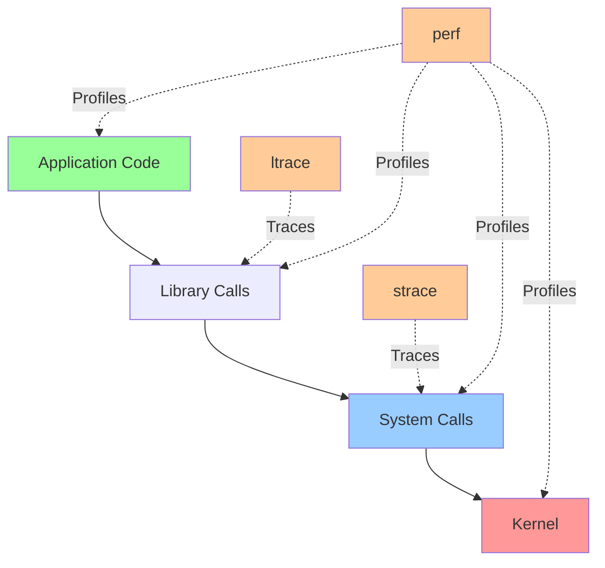

# Tracing: strace, ltrace, perf

## Overview

Tracing tools allow observation of running processes without modifying source code. They reveal system calls, library calls, and performance characteristics, essential for debugging production issues and performance analysis.

> [!summary] Key Concepts
> - **System Call (syscall)**: Interface between user-space and kernel
> - **Library Call**: User-space function call (libc, shared libraries)
> - **Tracing**: Recording events as they occur
> - **Profiling**: Statistical sampling of program execution
> - **Instrumentation**: Adding observation points to code
> - **Overhead**: Performance impact of tracing (strace high, perf low)

---

## Tracing Overview



**Tool selection**:
- **strace**: Debug system call issues (file access, network, permissions)
- **ltrace**: Debug library function calls (malloc, strcmp, printf)
- **perf**: Profile CPU usage, find performance hotspots

---

## strace (System Call Tracing)

### Basic Usage

```bash
# Trace command from start
strace ls -la

# Attach to running process
sudo strace -p PID

# Trace child processes
strace -f command

# Follow all threads
strace -ff command

# Output to file
strace -o trace.log command

# Separate output per process
strace -ff -o trace command
# Creates trace.PID files
```

### Useful strace Flags

| Flag | Purpose | Example |
|------|---------|---------|
| `-p PID` | Attach to process | `strace -p 1234` |
| `-f` | Follow forks | `strace -f nginx` |
| `-ff` | Follow forks, separate output | `strace -ff -o trace nginx` |
| `-e trace=` | Filter syscalls | `strace -e trace=open,read` |
| `-e trace=file` | File operations only | `strace -e trace=file ls` |
| `-e trace=network` | Network operations only | `strace -e trace=network curl` |
| `-c` | Count syscalls | `strace -c ls` |
| `-T` | Show time spent in each syscall | `strace -T ls` |
| `-t` | Timestamp (time of day) | `strace -t ls` |
| `-tt` | Timestamp with microseconds | `strace -tt ls` |
| `-ttt` | Unix epoch timestamp | `strace -ttt ls` |
| `-s SIZE` | String size (default 32) | `strace -s 200 cat` |
| `-o FILE` | Output to file | `strace -o trace.log ls` |
| `-y` | Print file descriptor paths | `strace -y cat file` |

### Filtering Syscalls

```bash
# Trace specific syscalls
strace -e trace=open,openat,read,write ls

# Trace file operations
strace -e trace=file ls
# Includes: open, stat, chmod, unlink, etc.

# Trace network operations
strace -e trace=network curl https://example.com
# Includes: socket, connect, send, recv, etc.

# Trace process operations
strace -e trace=process bash -c 'ls'
# Includes: fork, exec, wait, etc.

# Trace IPC operations
strace -e trace=ipc myapp
# Includes: shmget, semop, msgrcv, etc.

# Exclude syscalls
strace -e trace='!futex,clock_gettime' myapp
# Excludes noisy syscalls

# Multiple categories
strace -e trace=file,network nginx
```

### Common strace Use Cases

**1. Find missing files**:
```bash
# Trace which files are accessed
strace -e trace=openat,stat ls /nonexistent 2>&1 | grep ENOENT

# Find config file locations
strace -e trace=openat myapp 2>&1 | grep '\.conf'
```

**2. Debug permission errors**:
```bash
# Trace and find EACCES (permission denied)
strace -e trace=file myapp 2>&1 | grep EACCES

# Example output:
# openat(AT_FDCWD, "/etc/myapp/secret.conf", O_RDONLY) = -1 EACCES (Permission denied)
```

**3. Debug network issues**:
```bash
# Trace network syscalls
sudo strace -e trace=network -p PID

# Find which IP/port process connects to
strace -e trace=connect curl https://example.com 2>&1 | grep connect
```

**4. Find slow syscalls**:
```bash
# Show time spent in each syscall
strace -T mycommand 2>&1 | grep '<.*>'

# Example output showing slow fsync:
# fsync(3)                                = 0 <0.123456>
```

**5. Count syscall frequency**:
```bash
# Syscall statistics
strace -c ls

# Output:
# % time     seconds  usecs/call     calls    errors syscall
# ------ ----------- ----------- --------- --------- ----------------
#  42.86    0.000030           5         6           read
#  28.57    0.000020           4         5           openat
# ...
```

### strace Output Interpretation

```bash
openat(AT_FDCWD, "/etc/passwd", O_RDONLY) = 3
```

**Breakdown**:
- `openat`: Syscall name
- `AT_FDCWD, "/etc/passwd", O_RDONLY`: Arguments
- `= 3`: Return value (file descriptor 3)

**Common return values**:
- `= 0`: Success (for many syscalls)
- `= N` (N > 0): Success, often file descriptor or bytes read/written
- `= -1 ERRNO (Message)`: Error

**Common errors**:
- `ENOENT`: No such file or directory
- `EACCES`: Permission denied
- `EINTR`: Interrupted system call
- `EAGAIN`: Resource temporarily unavailable
- `ECONNREFUSED`: Connection refused

### Advanced strace

```bash
# Detailed timing (relative timestamps)
strace -tt -T mycommand

# Trace with string length 1000 (see full paths/data)
strace -s 1000 mycommand

# Show file descriptor paths
strace -y cat file.txt
# read(3</path/to/file.txt>, "content", 4096) = 7

# Decode signals
strace -e signal myapp

# Trace specific file descriptor
strace -e trace=read,write -e read=3 myapp
# Shows read/write on FD 3
```

---

## ltrace (Library Call Tracing)

### Basic Usage

```bash
# Trace library calls
ltrace ls

# Attach to running process
sudo ltrace -p PID

# Follow forks
ltrace -f command

# Output to file
ltrace -o trace.log command

# Count library calls
ltrace -c ls

# Show timestamps
ltrace -t ls
```

### Useful ltrace Flags

| Flag | Purpose | Example |
|------|---------|---------|
| `-p PID` | Attach to process | `ltrace -p 1234` |
| `-f` | Follow forks | `ltrace -f nginx` |
| `-c` | Count calls | `ltrace -c ls` |
| `-t` | Timestamp | `ltrace -t ls` |
| `-T` | Show time spent | `ltrace -T ls` |
| `-o FILE` | Output to file | `ltrace -o trace.log ls` |
| `-e EXPR` | Filter functions | `ltrace -e malloc ls` |
| `-s SIZE` | String size | `ltrace -s 200 cat` |

### Common ltrace Use Cases

**1. Memory allocation debugging**:
```bash
# Trace malloc/free
ltrace -e malloc,free myapp

# Find memory leaks (malloc without free)
ltrace -e malloc,free -c myapp
```

**2. String operations**:
```bash
# Trace string functions
ltrace -e 'str*' myapp
# Matches: strcmp, strcpy, strlen, etc.

# See full string contents
ltrace -s 200 -e strcmp myapp
```

**3. File I/O (libc level)**:
```bash
# Trace fopen/fread/fwrite
ltrace -e fopen,fread,fwrite myapp
```

**4. Dynamic library loading**:
```bash
# Trace dlopen/dlsym
ltrace -e dlopen,dlsym myapp
```

### ltrace vs strace

| Aspect | strace | ltrace |
|--------|--------|--------|
| **Traces** | System calls (kernel interface) | Library calls (user-space functions) |
| **Level** | Kernel boundary | User-space |
| **Use for** | File access, network, processes | Memory, strings, library functions |
| **Performance** | High overhead | Very high overhead |
| **Availability** | Always available | May need installation |

---

## perf (Linux Profiler)

### Overview

**perf** is a powerful Linux profiling tool with low overhead, suitable for production use.

### Basic Usage

```bash
# Live top-like view
sudo perf top

# Record profile (all CPUs, 30 seconds)
sudo perf record -a -g sleep 30

# Record specific process
sudo perf record -p PID -g sleep 30

# Record specific command
sudo perf record -g command

# Analyze recording
sudo perf report

# Interactive TUI
sudo perf report --tui

# Terminal output
sudo perf report --stdio
```

### perf record Options

| Option | Purpose | Example |
|--------|---------|---------|
| `-a` | All CPUs | `perf record -a` |
| `-p PID` | Specific process | `perf record -p 1234` |
| `-t TID` | Specific thread | `perf record -t 5678` |
| `-g` | Call graph (stack traces) | `perf record -g` |
| `-F FREQ` | Sampling frequency (Hz) | `perf record -F 99` |
| `-e EVENT` | Specific event | `perf record -e cycles` |
| `-o FILE` | Output file | `perf record -o perf.data` |
| `--` | Command to run | `perf record -- ls` |

### Sampling Frequency

```bash
# Default (1000 Hz - high overhead)
perf record -g command

# Lower frequency (99 Hz - production-friendly)
perf record -F 99 -g command

# Higher frequency (4000 Hz - development only)
perf record -F 4000 -g command
```

**Rule of thumb**: 99-999 Hz for production, 1000+ for development

### perf Events

```bash
# List available events
perf list

# CPU cycles
perf record -e cycles -g command

# Instructions
perf record -e instructions -g command

# Cache misses
perf record -e cache-misses -g command

# Branch mispredictions
perf record -e branch-misses -g command

# Page faults
perf record -e page-faults -g command

# Multiple events
perf record -e cycles,instructions -g command
```

### perf stat (Event Counting)

```bash
# Basic statistics
perf stat command

# Example output:
#  Performance counter stats for 'ls':
#          1.23 msec task-clock               #    0.456 CPUs utilized
#             0      context-switches         #    0.000 K/sec
#             0      cpu-migrations           #    0.000 K/sec
#           123      page-faults              #    0.100 M/sec
#     1,234,567      cycles                   #    1.000 GHz
#     2,345,678      instructions             #    1.90  insn per cycle

# Specific events
perf stat -e cycles,instructions,cache-misses command

# Detailed stats
perf stat -d command

# Per-CPU stats
perf stat -a -A command

# Repeat N times
perf stat -r 10 command
```

### Interpreting perf stat

**Key metrics**:
- **IPC (Instructions Per Cycle)**: > 1.0 is good, < 0.5 may indicate stalls
- **Cache miss rate**: High cache misses = poor locality
- **Branch misprediction rate**: High = unpredictable code paths

### perf report Navigation

```bash
# Interactive report
sudo perf report

# Keyboard shortcuts:
# Enter - Expand function
# + - Expand all
# - - Collapse
# / - Search
# h - Help
# q - Quit
```

**Report columns**:
- **Overhead**: % of samples in this function
- **Command**: Process name
- **Shared Object**: Library/binary
- **Symbol**: Function name

### Flame Graphs

```bash
# Record with call graphs
sudo perf record -F 99 -a -g -- sleep 60

# Generate flame graph (requires FlameGraph tools)
sudo perf script | stackcollapse-perf.pl | flamegraph.pl > flamegraph.svg

# Open in browser
firefox flamegraph.svg
```

**Flame graph interpretation**:
- **Width**: Time spent (wider = more samples)
- **Height**: Call stack depth
- **Color**: Usually by function name (no significance)
- **Flat top**: Function on CPU (not calling others)

---

## Practical Scenarios

### Scenario 1: Application Won't Start

```bash
# Trace to see which file/config it's looking for
strace -e trace=openat myapp 2>&1 | grep ENOENT

# Output might show:
# openat(AT_FDCWD, "/etc/myapp/config.yaml", ...) = -1 ENOENT
```

### Scenario 2: High CPU Usage

```bash
# Profile for 30 seconds
sudo perf record -F 99 -p PID -g -- sleep 30
sudo perf report

# Look for functions with high overhead
# Consider flame graph for visualization
```

### Scenario 3: Slow Database Queries

```bash
# Trace network calls
sudo strace -e trace=network -T -p PID 2>&1 | grep -E 'send|recv'

# Look for slow send/recv:
# sendto(...) = 100 <0.000050>
# recvfrom(...) = 5000 <0.250000>  ← 250ms delay
```

### Scenario 4: Memory Leak

```bash
# Trace malloc/free
ltrace -e malloc,free -c myapp

# Count should match (malloc calls ≈ free calls)
# If malloc >> free, likely memory leak

# For detailed analysis, use valgrind (development)
valgrind --leak-check=full ./myapp
```

### Scenario 5: Hanging Process

```bash
# Attach strace to see what it's waiting on
sudo strace -p PID

# Common patterns:
# - futex(...) → waiting on lock
# - poll([...], -1) → waiting for I/O
# - recvfrom(...) → waiting for network data
# - read(...) → waiting for file/socket read
```

---

## Performance Overhead

| Tool | Overhead | Production Use? | Best For |
|------|----------|----------------|----------|
| **strace** | Very high (10-100x) | ❌ No (except brief debugging) | Syscall debugging |
| **ltrace** | Extremely high | ❌ No | Library call debugging |
| **perf record** | Low (1-5%) | ✅ Yes (with -F 99) | CPU profiling |
| **perf top** | Low (1-5%) | ✅ Yes | Live profiling |
| **perf stat** | Very low (<1%) | ✅ Yes | Event counting |

---

## Common Pitfalls

> [!warning] Running strace on Production Without Care
> **Problem**: strace has 10-100x overhead, can severely impact performance  
> **Solution**: Use for brief periods, or use perf instead

> [!warning] Missing -f Flag for Multi-Process Apps
> **Problem**: strace/ltrace only traces parent, misses child processes  
> **Solution**: Use `-f` to follow forks: `strace -f nginx`

> [!warning] Default String Truncation
> **Problem**: strace truncates strings at 32 chars by default  
> **Solution**: Use `-s SIZE`: `strace -s 200 myapp`

> [!warning] Forgetting -g for Call Graphs
> **Problem**: `perf record` without `-g` has no stack traces  
> **Solution**: Always use `-g`: `perf record -g`

> [!warning] High Sampling Frequency in Production
> **Problem**: `perf record` at 4000 Hz adds significant overhead  
> **Solution**: Use 99-999 Hz for production: `perf record -F 99`

---

## Interview Corner

> [!question]- How would you debug an application that can't open a file?
> ```bash
> # Use strace to trace file operations
> strace -e trace=openat,stat myapp 2>&1 | grep -E 'ENOENT|EACCES'
> 
> # ENOENT - File doesn't exist (check path)
> # EACCES - Permission denied (check permissions)
> ```
> 
> **Systematic approach**:
> 1. Trace openat/stat syscalls
> 2. Look for error codes (ENOENT, EACCES)
> 3. Verify file exists: `ls -la /path/to/file`
> 4. Check permissions: `namei -l /path/to/file`

> [!question]- Explain the difference between strace and perf
> - **strace**: Traces system calls (kernel interface). Shows what syscalls are made, arguments, return values. High overhead (10-100x). For debugging specific syscall issues.
> 
> - **perf**: Profiles CPU execution via sampling. Shows which functions consume CPU time. Low overhead (1-5%). For performance optimization.
> 
> **Use strace**: "Why can't my app access this file?"  
> **Use perf**: "Why is my app using 100% CPU?"

> [!question]- How do you find which function is consuming most CPU time?
> ```bash
> # Record profile with call graphs
> sudo perf record -F 99 -p PID -g -- sleep 30
> 
> # View report
> sudo perf report
> 
> # Look at "Overhead" column - highest % functions
> # Expand (+) to see call chains
> 
> # Or generate flame graph for better visualization
> sudo perf script | stackcollapse-perf.pl | flamegraph.pl > flame.svg
> ```

> [!question]- What does it mean when strace shows many futex calls?
> **futex (fast userspace mutex)**: Used for thread synchronization (locks, mutexes).
> 
> **Many futex calls indicates**:
> - Lock contention (threads waiting for locks)
> - Inefficient locking strategy
> - Potential threading bottleneck
> 
> **Investigation**:
> ```bash
> # Count futex calls
> strace -c -e futex -p PID
> 
> # See which threads are contending
> strace -f -e futex -p PID
> ```
> 
> **Solutions**: Reduce lock scope, use lock-free structures, profile with perf

> [!question]- How do you profile a production application without impacting performance?
> **Low-overhead profiling**:
> ```bash
> # Use perf with low frequency (99 Hz)
> sudo perf record -F 99 -p PID -g -- sleep 60
> 
> # Or use perf stat (minimal overhead)
> sudo perf stat -p PID -- sleep 60
> 
> # Avoid strace/ltrace in production (high overhead)
> ```
> 
> **Best practices**:
> - Sampling profiler (perf) over tracing (strace)
> - Lower frequency: 99-999 Hz
> - Profile for short periods (30-60 seconds)
> - Use language-specific profilers when possible (py-spy, async-profiler)

> [!question]- What information can you get from perf stat?
> **perf stat** provides event counts:
> - **Cycles**: Total CPU cycles
> - **Instructions**: Instructions executed
> - **IPC**: Instructions per cycle (instructions/cycles)
> - **Cache misses**: L1/L2/L3 cache misses
> - **Branch misses**: Branch prediction failures
> - **Page faults**: Memory page faults
> 
> **Example interpretation**:
> ```
> Instructions: 2,000,000,000
> Cycles:       1,000,000,000
> IPC:          2.0 (good - efficient execution)
> 
> Cache misses: 50,000,000 / 100,000,000 = 50% (high - poor locality)
> ```

---

## Cheat Sheet

### strace
```bash
strace command                   # Trace from start
sudo strace -p PID               # Attach to process
strace -f command                # Follow forks
strace -e trace=file ls          # File operations only
strace -e trace=network curl ... # Network operations only
strace -c ls                     # Count syscalls
strace -T ls                     # Show time per syscall
strace -s 200 cat                # Show 200 chars of strings
strace -o trace.log ls           # Output to file
```

### ltrace
```bash
ltrace command                   # Trace library calls
sudo ltrace -p PID               # Attach to process
ltrace -e malloc,free app        # Specific functions
ltrace -c ls                     # Count calls
```

### perf
```bash
sudo perf top                    # Live CPU profile
sudo perf record -a -g sleep 30  # Record all CPUs
sudo perf record -p PID -g sleep 30  # Record process
sudo perf record -F 99 -g cmd    # Record at 99 Hz
sudo perf report                 # View recording
sudo perf stat command           # Event statistics
sudo perf list                   # Available events
```

---

## References

### Official Documentation
- [strace(1) Manual](https://man7.org/linux/man-pages/man1/strace.1.html)
- [ltrace(1) Manual](https://man7.org/linux/man-pages/man1/ltrace.1.html)
- [perf Documentation](https://perf.wiki.kernel.org/)
- [Linux Performance](http://www.brendangregg.com/linuxperf.html) - Brendan Gregg

### Tools and Resources
- [FlameGraph](https://github.com/brendangregg/FlameGraph) - Performance visualization
- [perf Examples](http://www.brendangregg.com/perf.html) - Comprehensive guide
- [strace Cheat Sheet](https://wizardzines.com/zines/strace/)

---

## Related Notes

- [[01_Performance_Tuning_and_Profiling]] - Overall performance methodology
- [[03_Processes_and_Jobs]] - Process management basics
- [[03_Networking_Tools]] - Network debugging
- [[02_Storage_and_Filesystems]] - File I/O debugging

---

> [!tip] Best Practices
> 1. **Use perf for profiling**: Low overhead, suitable for production
> 2. **Use strace for syscall debugging**: Brief periods only in production
> 3. **Always use -g with perf**: Get call graphs for analysis
> 4. **Filter strace output**: Use `-e trace=` to reduce noise
> 5. **Lower perf frequency in production**: Use `-F 99` instead of default 1000
> 6. **Combine tools**: strace for "what", perf for "where"
> 7. **Generate flame graphs**: Visual analysis easier than text reports
> 8. **Document findings**: Record what you traced and why
