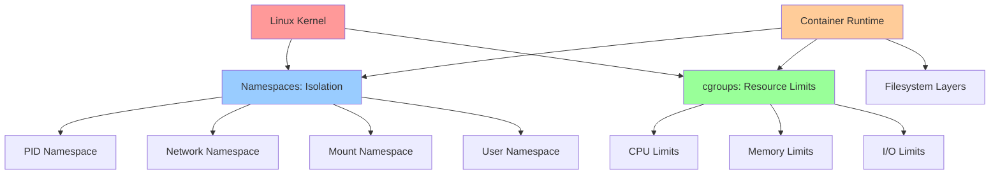
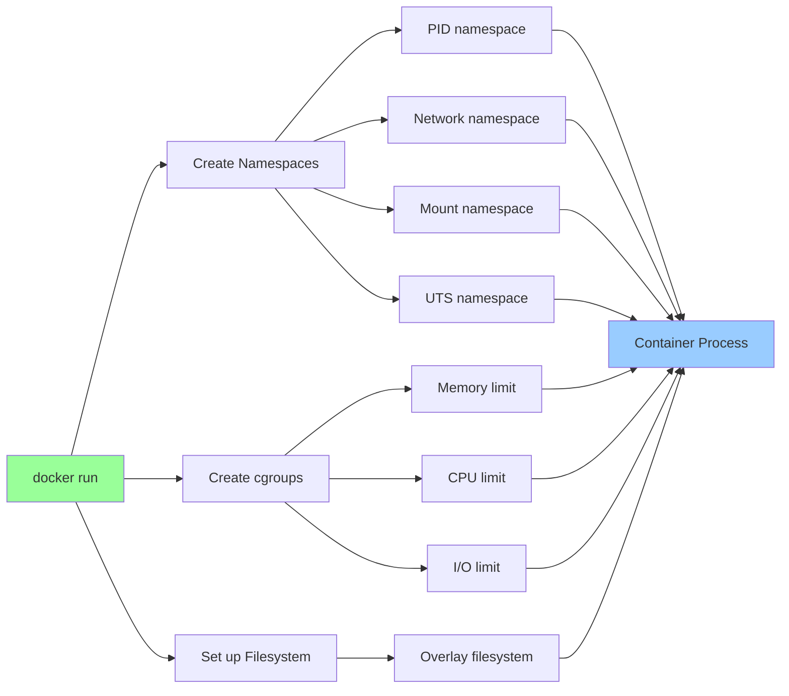

# Namespaces and cgroups

## Overview

**Namespaces** and **cgroups** are Linux kernel features that enable process isolation and resource control. Together, they form the foundation of containerization technologies like Docker and Kubernetes.

> [!summary] Key Concepts
> - **Namespace**: Isolates what a process can see (filesystem, network, PIDs, users)
> - **cgroup (Control Group)**: Limits and accounts for resource usage (CPU, memory, I/O)
> - **Container**: Combination of namespaces + cgroups + filesystem layers
> - **Isolation**: Separate view of system resources
> - **Resource Limits**: Enforce boundaries on CPU, memory, I/O consumption

---

## Conceptual Model



**Relationship**:
- **Namespaces**: "What can I see?"
- **cgroups**: "How much can I use?"
- **Containers**: Namespaces + cgroups + rootfs

---

## Linux Namespaces

### Namespace Types

| Namespace | Isolates | Use Case |
|-----------|----------|----------|
| **PID** | Process IDs | Process isolation, PID 1 per container |
| **Network** | Network stack (interfaces, routing, firewall) | Network isolation, container networking |
| **Mount** | Filesystem mount points | Separate filesystems per container |
| **UTS** | Hostname and domain name | Different hostnames per container |
| **IPC** | Inter-Process Communication (shared memory, semaphores) | IPC isolation |
| **User** | User and group IDs | UID/GID mapping, rootless containers |
| **Cgroup** | cgroup hierarchy view | cgroup isolation |
| **Time** (Linux 5.6+) | System time | Different time per container (testing) |

### Viewing Namespaces

```bash
# List namespaces for a process
ls -la /proc/PID/ns/

# Example output:
# lrwxrwxrwx 1 root root 0 Apr 26 10:00 cgroup -> 'cgroup:[4026531835]'
# lrwxrwxrwx 1 root root 0 Apr 26 10:00 ipc -> 'ipc:[4026531839]'
# lrwxrwxrwx 1 root root 0 Apr 26 10:00 mnt -> 'mnt:[4026531840]'
# lrwxrwxrwx 1 root root 0 Apr 26 10:00 net -> 'net:[4026531992]'
# lrwxrwxrwx 1 root root 0 Apr 26 10:00 pid -> 'pid:[4026531836]'
# lrwxrwxrwx 1 root root 0 Apr 26 10:00 user -> 'user:[4026531837]'
# lrwxrwxrwx 1 root root 0 Apr 26 10:00 uts -> 'uts:[4026531838]'

# Compare with another process
ls -la /proc/1/ns/
ls -la /proc/CONTAINER_PID/ns/
# Different namespace IDs = isolated

# List all network namespaces
ip netns list
```

### PID Namespace

**Isolation**: Each namespace has its own PID numbering, starting from 1.

```bash
# Inside container
ps aux
# PID 1 is container's init process

# Outside container (host)
ps aux | grep container_process
# Shows different PID (e.g., 12345)
```

**Diagram**:
```
Host PID Namespace:
├─ PID 1: /sbin/init
├─ PID 12345: container_init
└─ PID 12346: app_process

Container PID Namespace:
├─ PID 1: container_init  (same as host PID 12345)
└─ PID 2: app_process     (same as host PID 12346)
```

**Creating PID namespace**:
```bash
# unshare: run command in new namespace
sudo unshare --pid --fork --mount-proc bash

# Inside new namespace
ps aux  # Shows only processes in this namespace
echo $$  # Shows PID 1 or low PID
```

### Network Namespace

**Isolation**: Separate network stack (interfaces, IP addresses, routing tables, firewall rules).

```bash
# Create network namespace
sudo ip netns add myns

# List namespaces
ip netns list

# Execute command in namespace
sudo ip netns exec myns ip addr
# Shows only loopback interface

# Enter namespace
sudo ip netns exec myns bash

# Create veth pair (virtual ethernet) to connect namespaces
sudo ip link add veth0 type veth peer name veth1

# Move veth1 to namespace
sudo ip link set veth1 netns myns

# Configure interfaces
sudo ip addr add 10.0.0.1/24 dev veth0
sudo ip link set veth0 up

sudo ip netns exec myns ip addr add 10.0.0.2/24 dev veth1
sudo ip netns exec myns ip link set veth1 up

# Test connectivity
ping 10.0.0.2
```

**Container networking**:
```
Host Network Namespace:
├─ eth0: 192.168.1.100
├─ docker0: 172.17.0.1
└─ veth12345: (connected to container)

Container Network Namespace:
└─ eth0: 172.17.0.2 (actually veth pair endpoint)
```

### Mount Namespace

**Isolation**: Separate mount points, each namespace has its own view of filesystem.

```bash
# Create mount namespace
sudo unshare --mount bash

# Mount something in new namespace
mkdir /tmp/mymount
sudo mount -t tmpfs tmpfs /tmp/mymount

# Visible in this namespace, not in parent
```

**Use case**: Container has `/` pointing to its rootfs, not host `/`.

### UTS Namespace

**Isolation**: Hostname and domain name.

```bash
# Create UTS namespace
sudo unshare --uts bash

# Change hostname (only affects this namespace)
hostname mycontainer
hostname  # Shows 'mycontainer'

# In parent namespace, hostname unchanged
```

### User Namespace

**Isolation**: UID/GID mapping. Root in container can be unprivileged user on host.

```bash
# Create user namespace with UID/GID mapping
unshare --user --map-root-user bash

# Inside namespace
id  # Shows uid=0(root)

# Outside namespace, process runs as your UID
```

**Rootless containers**: User namespaces allow non-root users to run containers with root inside the container.

---

## cgroups (Control Groups)

### cgroup Hierarchy

**cgroups v1** (legacy): Multiple hierarchies, each controller separate  
**cgroups v2** (modern): Single unified hierarchy

```bash
# Check cgroup version
mount | grep cgroup
# v1: /sys/fs/cgroup/cpu, /sys/fs/cgroup/memory (separate)
# v2: /sys/fs/cgroup (unified)

# View process cgroups
cat /proc/self/cgroup

# cgroups v1 output:
# 12:memory:/user.slice/user-1000.slice
# 11:cpu,cpuacct:/user.slice

# cgroups v2 output:
# 0::/user.slice/user-1000.slice/session-1.scope
```

### cgroup Controllers

| Controller | Purpose | Limits |
|------------|---------|--------|
| **cpu** | CPU time allocation | CPU shares, quota, period |
| **cpuset** | CPU core assignment | Specific CPUs/cores |
| **memory** | Memory usage | Memory limit, swap limit |
| **blkio** | Block I/O | Read/write IOPS, bandwidth |
| **pids** | Process count | Max number of processes |
| **devices** | Device access | Whitelist/blacklist devices |
| **net_cls** | Network classification | Packet classification |

### Viewing cgroup Information

```bash
# systemd cgroup view (tree)
systemd-cgls

# systemd cgroup resource usage (top-like)
systemd-cgtop

# Specific cgroup details
cat /sys/fs/cgroup/user.slice/memory.max
cat /sys/fs/cgroup/user.slice/memory.current

# Process's cgroup
cat /proc/PID/cgroup
```

### CPU Limits

**CPU shares** (relative weight):
```bash
# cgroups v2
# Set CPU weight (default 100, range 1-10000)
echo 200 > /sys/fs/cgroup/mygroup/cpu.weight
# This cgroup gets 2x CPU time compared to default (100)
```

**CPU quota** (absolute limit):
```bash
# cgroups v2
# Limit to 50% of one CPU (50,000 us per 100,000 us period)
echo "50000 100000" > /sys/fs/cgroup/mygroup/cpu.max

# cgroups v1
echo 50000 > /sys/fs/cgroup/cpu/mygroup/cpu.cfs_quota_us
echo 100000 > /sys/fs/cgroup/cpu/mygroup/cpu.cfs_period_us
```

**Systemd CPU limit**:
```bash
# Limit service to 50% CPU
# /etc/systemd/system/myapp.service
[Service]
CPUQuota=50%

# Reload and restart
sudo systemctl daemon-reload
sudo systemctl restart myapp
```

### Memory Limits

```bash
# cgroups v2
# Set memory limit to 512 MB
echo 512M > /sys/fs/cgroup/mygroup/memory.max

# Set swap limit
echo 256M > /sys/fs/cgroup/mygroup/memory.swap.max

# View current usage
cat /sys/fs/cgroup/mygroup/memory.current

# cgroups v1
echo 536870912 > /sys/fs/cgroup/memory/mygroup/memory.limit_in_bytes
```

**Systemd memory limit**:
```bash
# /etc/systemd/system/myapp.service
[Service]
MemoryLimit=512M
MemoryMax=512M  # Hard limit (cgroups v2)
```

**OOM (Out of Memory) behavior**:
```bash
# When memory limit exceeded, kernel's OOM killer activates
# Check OOM events
dmesg | grep -i oom
journalctl -k | grep -i oom

# Output shows which cgroup hit limit:
# Memory cgroup out of memory: Killed process 12345 (myapp)
```

### I/O Limits

```bash
# cgroups v2
# Limit read/write to 10 MB/s for device 8:0 (sda)
echo "8:0 rbps=10485760 wbps=10485760" > /sys/fs/cgroup/mygroup/io.max

# cgroups v1 (blkio)
echo 10485760 > /sys/fs/cgroup/blkio/mygroup/blkio.throttle.read_bps_device
```

**Systemd I/O limit**:
```bash
# /etc/systemd/system/myapp.service
[Service]
IOReadBandwidthMax=/dev/sda 10M
IOWriteBandwidthMax=/dev/sda 10M
```

### PID Limits

```bash
# cgroups v2
# Limit to 100 processes
echo 100 > /sys/fs/cgroup/mygroup/pids.max

# Current PID count
cat /sys/fs/cgroup/mygroup/pids.current
```

**Systemd PID limit**:
```bash
# /etc/systemd/system/myapp.service
[Service]
TasksMax=100
```

---

## Creating cgroups Manually

### cgroups v2

```bash
# Create cgroup
sudo mkdir /sys/fs/cgroup/mygroup

# Enable controllers
echo "+cpu +memory" > /sys/fs/cgroup/cgroup.subtree_control

# Set limits
echo 512M > /sys/fs/cgroup/mygroup/memory.max
echo "50000 100000" > /sys/fs/cgroup/mygroup/cpu.max

# Add process to cgroup
echo PID > /sys/fs/cgroup/mygroup/cgroup.procs

# Or start process in cgroup
systemd-run --unit=myapp --slice=mygroup.slice ./myapp
```

### cgroups v1

```bash
# Create CPU cgroup
sudo mkdir /sys/fs/cgroup/cpu/mygroup

# Set CPU quota (50% of one CPU)
echo 50000 > /sys/fs/cgroup/cpu/mygroup/cpu.cfs_quota_us

# Add process
echo PID > /sys/fs/cgroup/cpu/mygroup/tasks
```

---

## Container Implementation

### How Containers Use Namespaces + cgroups



### Inspecting Container Isolation

```bash
# Run container
docker run -d --name mycontainer --memory=512m --cpus=0.5 nginx

# Find container PID
docker inspect -f '{{.State.Pid}}' mycontainer
# Output: 12345

# Check namespaces
ls -la /proc/12345/ns/
# Different namespace IDs from host

# Check cgroups
cat /proc/12345/cgroup
# Shows Docker cgroup hierarchy

# Check memory limit
cat /sys/fs/cgroup/system.slice/docker-CONTAINER_ID.scope/memory.max
# Shows 512M (536870912 bytes)

# Check CPU limit
cat /sys/fs/cgroup/system.slice/docker-CONTAINER_ID.scope/cpu.max
# Shows "50000 100000" (50% of one CPU)
```

---

## Practical Examples

### Example 1: Resource-Limited Shell

```bash
# Create namespace with resource limits
systemd-run --user --scope --slice=mytest.slice \
    -p MemoryMax=256M \
    -p CPUQuota=25% \
    bash

# Inside this bash session, memory and CPU are limited
# Test with memory-intensive process
stress-ng --vm 1 --vm-bytes 512M
# Will be OOM killed at 256M
```

### Example 2: Isolated Network Testing

```bash
# Create network namespace
sudo ip netns add testnet

# Run server in namespace
sudo ip netns exec testnet python3 -m http.server 8080 &

# Try to access from host
curl http://localhost:8080
# Fails - different network namespace

# Access from within namespace
sudo ip netns exec testnet curl http://localhost:8080
# Works
```

### Example 3: Monitoring cgroup Resource Usage

```bash
# Monitor all cgroups (live)
systemd-cgtop

# Output shows:
# Path                    Tasks   %CPU   Memory  Input/s Output/s
# /                         500   50.0     4.5G        -        -
# /system.slice            120   30.0     2.1G        -        -
# /user.slice              380   20.0     2.4G        -        -
# /user.slice/user-1000    150   15.0     1.8G        -        -
```

---

## Common Pitfalls

> [!warning] OOM Kill Due to cgroup Limits, Not Host Memory
> **Problem**: Process killed by OOM, but host has plenty of free memory  
> **Cause**: cgroup memory limit exceeded (e.g., container memory limit)  
> **Check**: `dmesg | grep -i "memory cgroup"`  
> **Solution**: Increase cgroup limit or optimize application memory usage

> [!warning] Confusing CPU Shares vs CPU Quota
> **CPU shares**: Relative weight (only matters under contention)  
> **CPU quota**: Absolute limit (enforced always)  
> **Example**: 50% quota means max 50% even if CPU is idle

> [!warning] Process Still Visible Across Namespaces
> **Problem**: Created PID namespace but still see all processes  
> **Cause**: Forgot to mount new /proc  
> **Solution**: `unshare --pid --fork --mount-proc`

> [!warning] cgroups v1 vs v2 Confusion
> **Problem**: Trying v2 syntax on v1 system or vice versa  
> **Check**: `mount | grep cgroup` to determine version  
> **Solution**: Use correct syntax for your cgroup version

---

## Interview Corner

> [!question]- Explain how containers achieve isolation
> Containers use **namespaces** for isolation and **cgroups** for resource limits:
> 
> **Namespaces** isolate:
> - PID: Process IDs (container has PID 1)
> - Network: Network stack (separate interfaces, IPs)
> - Mount: Filesystem views (container has its own /)
> - UTS: Hostname
> - IPC: Inter-process communication
> - User: UID/GID mapping
> 
> **cgroups** limit:
> - CPU: CPU time allocation
> - Memory: Memory usage
> - I/O: Disk read/write
> - PIDs: Process count
> 
> **Combined**: Container appears as isolated system with resource limits

> [!question]- What is the difference between namespaces and cgroups?
> - **Namespaces**: **Isolation** - control what process can see  
>   Example: PID namespace makes container think it's PID 1
> 
> - **cgroups**: **Resource limits** - control how much process can use  
>   Example: Memory cgroup limits container to 512MB
> 
> **Analogy**:
> - Namespace = "Put process in a room" (can't see outside)
> - cgroup = "Limit resources in the room" (only 512MB RAM available)

> [!question]- How do you troubleshoot a process that was OOM killed?
> **Systematic approach**:
> ```bash
> # 1. Check kernel logs for OOM killer messages
> dmesg | grep -i oom
> journalctl -k | grep -i oom
> 
> # 2. Identify if it was host OOM or cgroup OOM
> # Output shows:
> # "Memory cgroup out of memory" = cgroup limit
> # "Out of memory: Killed process" = host memory exhaustion
> 
> # 3. Check cgroup memory limit
> cat /proc/PID/cgroup  # Find cgroup path
> cat /sys/fs/cgroup/PATH/memory.max
> 
> # 4. Check process memory usage before OOM
> # (if monitoring is set up)
> 
> # 5. Increase limit or optimize application
> ```

> [!question]- Can you run Docker without root privileges?
> Yes, using **rootless mode** with user namespaces:
> 
> **How it works**:
> - User namespace maps root (UID 0) inside container to your UID outside
> - No actual root privileges on host
> - Requires kernel support and configuration
> 
> **Setup**:
> ```bash
> # Install rootless Docker
> dockerd-rootless-setuptool.sh install
> 
> # Run containers as normal user
> docker run -d nginx
> # Container thinks it's root, but it's actually your UID on host
> ```
> 
> **Limitations**: Some features unavailable (privileged ports, some networking)

> [!question]- How do you limit CPU and memory for a process without containers?
> **Using systemd**:
> ```bash
> # Run process with limits
> systemd-run --user --scope \
>     -p MemoryMax=512M \
>     -p CPUQuota=50% \
>     ./myapp
> 
> # Or create persistent service with limits
> # /etc/systemd/system/myapp.service
> [Service]
> ExecStart=/usr/bin/myapp
> MemoryMax=512M
> CPUQuota=50%
> ```
> 
> **Using cgexec** (cgroups v1):
> ```bash
> # Create and configure cgroup
> sudo cgcreate -g memory,cpu:myapp
> sudo cgset -r memory.limit_in_bytes=512M myapp
> sudo cgset -r cpu.cfs_quota_us=50000 myapp
> 
> # Run process in cgroup
> sudo cgexec -g memory,cpu:myapp ./myapp
> ```

---

## Cheat Sheet

### Namespaces
```bash
# List process namespaces
ls -la /proc/PID/ns/

# Create namespace
sudo unshare --pid --net --mount --uts --fork bash

# Network namespaces
sudo ip netns add myns
sudo ip netns exec myns bash
ip netns list
```

### cgroups
```bash
# View cgroup hierarchy
systemd-cgls
systemd-cgtop

# View process cgroups
cat /proc/PID/cgroup

# cgroups v2 limits
echo 512M > /sys/fs/cgroup/mygroup/memory.max
echo "50000 100000" > /sys/fs/cgroup/mygroup/cpu.max
```

### systemd Resource Limits
```bash
# Run with limits
systemd-run --scope -p MemoryMax=512M -p CPUQuota=50% ./app

# Service limits (/etc/systemd/system/myapp.service)
[Service]
MemoryMax=512M
CPUQuota=50%
IOReadBandwidthMax=/dev/sda 10M
TasksMax=100
```

### Docker
```bash
# Run with resource limits
docker run -d --memory=512m --cpus=0.5 nginx

# Inspect container namespaces
docker inspect -f '{{.State.Pid}}' container
ls -la /proc/PID/ns/
```

---

## References

### Official Documentation
- [Linux Namespaces](https://man7.org/linux/man-pages/man7/namespaces.7.html)
- [cgroups v2 Documentation](https://www.kernel.org/doc/html/latest/admin-guide/cgroup-v2.html)
- [systemd Resource Control](https://www.freedesktop.org/software/systemd/man/systemd.resource-control.html)

### Books and Articles
- "Container Security" by Liz Rice - Deep dive into container isolation
- [Understanding Cgroups](https://access.redhat.com/documentation/en-us/red_hat_enterprise_linux/9/html/managing_monitoring_and_updating_the_kernel/setting-limits-for-applications_managing-monitoring-and-updating-the-kernel)
- [Namespaces in Operation](https://lwn.net/Articles/531114/) - LWN series

---

## Related Notes

- [[01_Systemd_and_Services]] - systemd cgroup integration
- [[01_Performance_Tuning_and_Profiling]] - Resource monitoring and limits
- [[03_Processes_and_Jobs]] - Process management basics
- [[04_Security_Hardening_Basics]] - Isolation for security

---

> [!tip] Best Practices
> 1. **Use systemd for resource limits**: Simpler than manual cgroup management
> 2. **Monitor cgroup limits**: Set up alerts when approaching limits
> 3. **Understand OOM behavior**: cgroup OOM vs host OOM
> 4. **Use appropriate limits**: Don't over-constrain, allow headroom
> 5. **Test limits**: Verify limits work as expected before production
> 6. **Document limits**: Record why specific limits were chosen
> 7. **Prefer cgroups v2**: Simpler, more features (when available)
> 8. **Use namespaces for testing**: Isolate test environments safely
