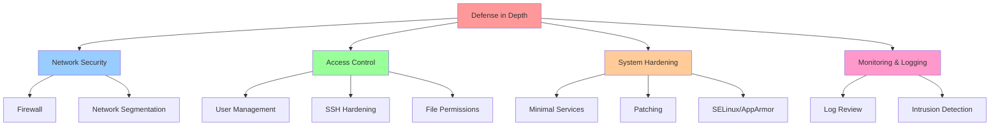

# Security Hardening Basics

## Overview

Security hardening reduces the attack surface of Linux systems through configuration, access controls, monitoring, and defense-in-depth practices. The goal is to minimize vulnerabilities while maintaining functionality.

> [!summary] Key Concepts
> - **Attack Surface**: All points where unauthorized access is possible
> - **Least Privilege**: Grant minimum permissions necessary
> - **Defense in Depth**: Multiple layers of security
> - **Patch Management**: Keep systems updated
> - **Access Control**: Restrict who/what can access resources
> - **Audit Trail**: Log security-relevant events

---

## Security Principles



### Security Baseline Checklist

- [ ] Keep system updated
- [ ] Disable unused services
- [ ] Use SSH keys, disable password authentication
- [ ] Configure firewall (allow only required ports)
- [ ] Run services as non-root users
- [ ] Use strong passwords + 2FA when possible
- [ ] Enable and configure SELinux/AppArmor
- [ ] Regular log review
- [ ] Automated security updates
- [ ] Regular backups

---

## System Updates and Patch Management

### Keeping System Updated

```bash
# Debian/Ubuntu
sudo apt update
sudo apt upgrade
sudo apt dist-upgrade  # Upgrade with dependency handling

# Check for security updates only
sudo apt list --upgradable | grep -i security

# RHEL/CentOS/Fedora
sudo dnf update
sudo dnf upgrade

# Arch Linux
sudo pacman -Syu
```

### Automated Security Updates

**Debian/Ubuntu (unattended-upgrades)**:
```bash
# Install
sudo apt install unattended-upgrades

# Configure /etc/apt/apt.conf.d/50unattended-upgrades
Unattended-Upgrade::Allowed-Origins {
    "${distro_id}:${distro_codename}-security";
};
Unattended-Upgrade::Automatic-Reboot "false";
Unattended-Upgrade::Automatic-Reboot-Time "03:00";

# Enable
sudo dpkg-reconfigure -plow unattended-upgrades
```

**RHEL/Fedora (dnf-automatic)**:
```bash
# Install
sudo dnf install dnf-automatic

# Configure /etc/dnf/automatic.conf
[commands]
upgrade_type = security
apply_updates = yes

# Enable
sudo systemctl enable --now dnf-automatic.timer
```

### Checking for Vulnerabilities

```bash
# Debian/Ubuntu - check for CVEs
sudo apt install debian-security-support
check-support-status

# RHEL - Yum security plugin
sudo yum updateinfo list security

# General - check installed package versions
rpm -qa | grep openssh
dpkg -l | grep openssh
```

---

## User and Access Management

### Principle of Least Privilege

```bash
# Create service user (no login shell, no home directory)
sudo useradd -r -s /usr/sbin/nologin -M myapp

# Run service as specific user
# /etc/systemd/system/myapp.service
[Service]
User=myapp
Group=myapp
ExecStart=/usr/bin/myapp
```

### sudo Configuration

```bash
# Add user to sudo group (Debian/Ubuntu)
sudo usermod -aG sudo username

# Add user to wheel group (RHEL/Fedora)
sudo usermod -aG wheel username

# Custom sudo rules (/etc/sudoers or /etc/sudoers.d/)
# NEVER edit directly - use visudo!
sudo visudo

# Allow user to run specific command without password
username ALL=(ALL) NOPASSWD: /usr/bin/systemctl restart myapp

# Allow group to run all commands
%devops ALL=(ALL:ALL) ALL

# Require password for sudo
Defaults timestamp_timeout=15  # Re-prompt after 15 minutes
```

### Password Policy

```bash
# Install password quality checking
sudo apt install libpam-pwquality

# Configure /etc/security/pwquality.conf
minlen = 12
dcredit = -1  # At least 1 digit
ucredit = -1  # At least 1 uppercase
lcredit = -1  # At least 1 lowercase
ocredit = -1  # At least 1 special char

# Password aging
sudo chage -M 90 username  # Max 90 days
sudo chage -m 7 username   # Min 7 days between changes
sudo chage -W 14 username  # Warn 14 days before expiry

# View password aging info
sudo chage -l username
```

### Account Lockout

```bash
# Configure PAM to lock after failed attempts
# /etc/pam.d/common-auth (Debian) or /etc/pam.d/system-auth (RHEL)
auth required pam_faillock.so preauth audit deny=5 unlock_time=900
auth required pam_faillock.so authfail audit deny=5 unlock_time=900

# Check failed login attempts
sudo faillock --user username

# Unlock user
sudo faillock --user username --reset
```

---

## SSH Hardening

### Server Configuration (/etc/ssh/sshd_config)

```bash
# Disable root login
PermitRootLogin no

# Disable password authentication (use keys only)
PasswordAuthentication no
ChallengeResponseAuthentication no
UsePAM no  # Or yes, depending on setup

# Allow specific users/groups
AllowUsers alice bob
AllowGroups sshusers

# Change default port (security through obscurity)
Port 2222

# Disable unused authentication methods
PubkeyAuthentication yes
PermitEmptyPasswords no
HostbasedAuthentication no

# Protocol and encryption
Protocol 2
Ciphers chacha20-poly1305@openssh.com,aes256-gcm@openssh.com
MACs hmac-sha2-512-etm@openssh.com,hmac-sha2-256-etm@openssh.com
KexAlgorithms curve25519-sha256,diffie-hellman-group-exchange-sha256

# Limit sessions
MaxAuthTries 3
MaxSessions 5
ClientAliveInterval 300
ClientAliveCountMax 2

# Logging
SyslogFacility AUTH
LogLevel VERBOSE

# X11 forwarding (disable if not needed)
X11Forwarding no

# TCP forwarding (disable if not needed)
AllowTcpForwarding no
AllowStreamLocalForwarding no
GatewayPorts no

# Apply changes
sudo systemctl restart sshd

# Test configuration before restart
sudo sshd -t
```

### SSH Key Security

```bash
# Generate strong key (ed25519)
ssh-keygen -t ed25519 -C "user@host"

# Or RSA 4096-bit
ssh-keygen -t rsa -b 4096 -C "user@host"

# Protect private key with passphrase
# Use ssh-agent to avoid repeated passphrase entry
eval "$(ssh-agent -s)"
ssh-add ~/.ssh/id_ed25519

# Restrict key usage (authorized_keys)
# ~/.ssh/authorized_keys
command="/usr/bin/restricted-command",no-port-forwarding,no-X11-forwarding,no-agent-forwarding ssh-ed25519 AAAA...
```

### SSH Monitoring

```bash
# Monitor SSH login attempts
sudo tail -f /var/log/auth.log  # Debian/Ubuntu
sudo tail -f /var/log/secure    # RHEL/CentOS

# Failed login attempts
sudo grep "Failed password" /var/log/auth.log

# Successful logins
sudo grep "Accepted publickey" /var/log/auth.log

# Ban IPs with fail2ban
sudo apt install fail2ban
sudo systemctl enable --now fail2ban

# Check fail2ban status
sudo fail2ban-client status sshd
```

---

## Firewall Configuration

### ufw (Uncomplicated Firewall - Debian/Ubuntu)

```bash
# Check status
sudo ufw status verbose

# Enable firewall
sudo ufw enable

# Default policies
sudo ufw default deny incoming
sudo ufw default allow outgoing

# Allow specific services
sudo ufw allow 22/tcp   # SSH
sudo ufw allow 80/tcp   # HTTP
sudo ufw allow 443/tcp  # HTTPS

# Allow from specific IP
sudo ufw allow from 192.168.1.100 to any port 22

# Allow from subnet
sudo ufw allow from 192.168.1.0/24 to any port 3306

# Deny specific port
sudo ufw deny 23/tcp  # Telnet

# Delete rule
sudo ufw delete allow 80/tcp

# Show numbered rules
sudo ufw status numbered

# Delete by number
sudo ufw delete 3

# Rate limiting (SSH brute force protection)
sudo ufw limit 22/tcp

# Logging
sudo ufw logging on
sudo ufw logging medium
```

### firewalld (RHEL/Fedora/CentOS)

```bash
# Check status
sudo firewall-cmd --state
sudo firewall-cmd --list-all

# Default zone
sudo firewall-cmd --get-default-zone
sudo firewall-cmd --set-default-zone=public

# Add service
sudo firewall-cmd --add-service=http
sudo firewall-cmd --add-service=https

# Make permanent
sudo firewall-cmd --runtime-to-permanent

# Add port
sudo firewall-cmd --add-port=8080/tcp --permanent

# Remove service
sudo firewall-cmd --remove-service=http --permanent

# Rich rules (advanced)
sudo firewall-cmd --add-rich-rule='rule family="ipv4" source address="192.168.1.100" port port=22 protocol=tcp accept' --permanent

# Reload
sudo firewall-cmd --reload
```

### iptables (Low-Level)

```bash
# List rules
sudo iptables -L -v -n

# Default policies
sudo iptables -P INPUT DROP
sudo iptables -P FORWARD DROP
sudo iptables -P OUTPUT ACCEPT

# Allow established connections
sudo iptables -A INPUT -m state --state ESTABLISHED,RELATED -j ACCEPT

# Allow loopback
sudo iptables -A INPUT -i lo -j ACCEPT

# Allow SSH
sudo iptables -A INPUT -p tcp --dport 22 -j ACCEPT

# Allow HTTP/HTTPS
sudo iptables -A INPUT -p tcp --dport 80 -j ACCEPT
sudo iptables -A INPUT -p tcp --dport 443 -j ACCEPT

# Save rules (Debian/Ubuntu)
sudo iptables-save > /etc/iptables/rules.v4

# Restore rules on boot
sudo apt install iptables-persistent
```

---

## Service Hardening

### Disable Unnecessary Services

```bash
# List all services
systemctl list-unit-files --type=service

# Disable service
sudo systemctl disable avahi-daemon
sudo systemctl stop avahi-daemon

# Mask service (prevent start even manually)
sudo systemctl mask avahi-daemon

# Common services to review:
# - avahi-daemon (mDNS)
# - cups (printing)
# - bluetooth
# - rpcbind (NFS)
```

### Run Services as Non-Root

```bash
# Create service user
sudo useradd -r -s /usr/sbin/nologin -M webapp

# Set file ownership
sudo chown -R webapp:webapp /opt/webapp

# Configure systemd service
# /etc/systemd/system/webapp.service
[Service]
User=webapp
Group=webapp
ExecStart=/opt/webapp/bin/start.sh

# Additional security options
PrivateTmp=yes
NoNewPrivileges=yes
ProtectSystem=strict
ProtectHome=yes
ReadWritePaths=/opt/webapp/data
```

### systemd Security Features

```bash
# /etc/systemd/system/myapp.service
[Service]
# Run as specific user
User=myapp
Group=myapp

# Filesystem protection
ProtectSystem=strict       # Read-only /usr, /boot, /etc
ProtectHome=yes            # Inaccessible /home
ReadWritePaths=/var/lib/myapp  # Exception for writable paths
PrivateTmp=yes             # Private /tmp

# Capability restrictions
NoNewPrivileges=yes        # Prevent privilege escalation
CapabilityBoundingSet=CAP_NET_BIND_SERVICE  # Only bind to privileged ports

# Namespace isolation
PrivateDevices=yes         # Private /dev
ProtectKernelTunables=yes  # Read-only /proc, /sys
ProtectControlGroups=yes   # Read-only cgroup

# System call filtering
SystemCallFilter=@system-service  # Whitelist system calls
SystemCallFilter=~@privileged     # Blacklist privileged calls

# Resource limits
MemoryMax=512M
CPUQuota=50%
TasksMax=100
```

---

## SELinux / AppArmor

### SELinux (RHEL/Fedora/CentOS)

```bash
# Check SELinux status
sestatus
getenforce

# SELinux modes:
# - Enforcing: Denies and logs violations
# - Permissive: Allows but logs violations
# - Disabled: SELinux off

# Set mode temporarily
sudo setenforce 1  # Enforcing
sudo setenforce 0  # Permissive

# Set mode permanently (/etc/selinux/config)
SELINUX=enforcing

# View SELinux context
ls -Z /var/www/html
ps auxZ | grep nginx

# Set file context
sudo semanage fcontext -a -t httpd_sys_content_t "/web(/.*)?"
sudo restorecon -R /web

# View denials (audit log)
sudo ausearch -m avc -ts recent
sudo grep "denied" /var/log/audit/audit.log

# Generate policy from denials
sudo audit2allow -a -M mypolicy
sudo semodule -i mypolicy.pp

# Troubleshooting
sudo sealert -a /var/log/audit/audit.log
```

### AppArmor (Debian/Ubuntu)

```bash
# Check AppArmor status
sudo aa-status

# Modes:
# - Enforce: Block violations
# - Complain: Allow but log violations

# Set profile to complain mode
sudo aa-complain /etc/apparmor.d/usr.sbin.nginx

# Set profile to enforce mode
sudo aa-enforce /etc/apparmor.d/usr.sbin.nginx

# Disable profile
sudo aa-disable /etc/apparmor.d/usr.sbin.nginx

# View denials
sudo grep "DENIED" /var/log/syslog

# Generate profile
sudo aa-genprof /usr/sbin/myapp

# Update profile based on logs
sudo aa-logprof
```

---

## File System Security

### Permissions and Ownership

```bash
# Secure file permissions
chmod 600 /etc/ssh/sshd_config  # Config files
chmod 644 /var/www/html/index.html  # Public files
chmod 755 /usr/bin/myapp  # Executables

# Secure directory permissions
chmod 700 ~/.ssh
chmod 755 /var/www

# Remove world-writable files
find / -xdev -type f -perm -0002 -exec chmod o-w {} \;

# Find files with SUID/SGID
find / -xdev \( -perm -4000 -o -perm -2000 \) -type f -exec ls -l {} \;

# Remove unnecessary SUID
sudo chmod u-s /usr/bin/suspicious-binary
```

### Mount Options

```bash
# Secure mount options (/etc/fstab)
/dev/sdb1 /data ext4 defaults,noexec,nosuid,nodev 0 2

# Options:
# - noexec: Prevent execution of binaries
# - nosuid: Ignore setuid/setgid bits
# - nodev: Don't interpret block/character devices
# - ro: Read-only

# Separate partitions for isolation
/home    ext4  defaults,nodev,nosuid         0 2
/tmp     tmpfs defaults,nodev,nosuid,noexec  0 0
/var/tmp tmpfs defaults,nodev,nosuid,noexec  0 0
```

---

## Logging and Monitoring

### Log Configuration

```bash
# View logs
journalctl -p err..alert  # Errors and above
journalctl -u sshd -f     # Follow SSH logs

# Configure log retention
# /etc/systemd/journald.conf
SystemMaxUse=500M
MaxRetentionSec=1month

# Send logs to remote syslog
# /etc/rsyslog.conf
*.* @@remote-syslog-server:514  # TCP
*.* @remote-syslog-server:514   # UDP
```

### Security Monitoring

```bash
# Failed login attempts
sudo grep "Failed password" /var/log/auth.log | tail -20

# Sudo usage
sudo grep "sudo:" /var/log/auth.log

# User additions
sudo grep "useradd" /var/log/auth.log

# File integrity monitoring (AIDE)
sudo apt install aide
sudo aideinit  # Initialize database
sudo aide --check  # Check for changes

# Intrusion detection (OSSEC, Wazuh)
# (Requires separate installation and configuration)
```

---

## Common Pitfalls

> [!warning] Locking Yourself Out of SSH
> **Problem**: Changed SSH config, restarted sshd, can't login  
> **Prevention**: Keep existing SSH session open while testing  
> **Recovery**: Use cloud provider console/KVM to regain access

> [!warning] Firewall Blocking SSH on Enable
> **Problem**: Enabled firewall without allowing SSH, locked out  
> **Prevention**: Allow SSH before enabling firewall  
> **Correct order**: `ufw allow 22/tcp` then `ufw enable`

> [!warning] SELinux Denying Legitimate Access
> **Problem**: Application can't access files due to SELinux  
> **Wrong fix**: Disable SELinux  
> **Correct fix**: Adjust SELinux context or create policy  
> **Debug**: `sudo ausearch -m avc -ts recent`

> [!warning] Running Services as Root Unnecessarily
> **Problem**: Service runs as root when it doesn't need to  
> **Risk**: Vulnerability in service = root compromise  
> **Solution**: Create service user, run with least privileges

> [!warning] Forgetting to Apply Firewall Changes Permanently
> **Problem**: Firewall rules work until reboot, then disappear  
> **Solution**: Use `--permanent` flag: `firewall-cmd --add-service=http --permanent`

---

## Interview Corner

> [!question]- What are the key steps to harden a Linux server?
> 1. **Update system**: `sudo apt update && sudo apt upgrade`
> 2. **Disable unused services**: `systemctl disable avahi-daemon`
> 3. **Configure firewall**: Allow only required ports
> 4. **SSH hardening**: Disable root login, use keys, change port
> 5. **User management**: Principle of least privilege, strong passwords
> 6. **Enable SELinux/AppArmor**: Mandatory access control
> 7. **Log monitoring**: Review logs, set up intrusion detection
> 8. **Automated updates**: Enable unattended security updates
> 9. **File permissions**: Secure configs, remove SUID when possible
> 10. **Regular audits**: Vulnerability scans, compliance checks

> [!question]- Explain the difference between discretionary and mandatory access control
> **DAC (Discretionary Access Control)**:
> - Owner controls permissions (chmod, chown)
> - Standard Unix permissions (rwx)
> - Flexible but vulnerable (malicious process can change permissions)
> 
> **MAC (Mandatory Access Control)**:
> - System-wide policy enforces access (SELinux, AppArmor)
> - Even root must comply with policy
> - More secure but complex to configure
> 
> **Example**: File with 777 permissions  
> - DAC: Anyone can read/write/execute  
> - MAC (SELinux): Still denied if context doesn't allow access

> [!question]- How do you secure SSH access to a server?
> 1. **Disable password authentication**: Use SSH keys only  
>    `PasswordAuthentication no`
> 
> 2. **Disable root login**: Force sudo usage  
>    `PermitRootLogin no`
> 
> 3. **Change default port**: Reduce automated attacks  
>    `Port 2222`
> 
> 4. **Limit users**: Allow specific users/groups  
>    `AllowUsers alice bob`
> 
> 5. **Strong encryption**: Modern ciphers and key exchange  
>    `Ciphers chacha20-poly1305@openssh.com`
> 
> 6. **Rate limiting**: fail2ban or ufw limit  
>    `sudo ufw limit 22/tcp`
> 
> 7. **2FA**: Google Authenticator or similar (PAM)

> [!question]- What is the principle of least privilege and how do you implement it?
> **Principle**: Grant minimum permissions necessary for task completion
> 
> **Implementation**:
> 1. **Service users**: Non-login accounts for services  
>    `useradd -r -s /usr/sbin/nologin myapp`
> 
> 2. **sudo**: Specific commands, not full root  
>    `user ALL=(ALL) NOPASSWD: /usr/bin/systemctl restart myapp`
> 
> 3. **File permissions**: Minimum required access  
>    `chmod 640 /etc/myapp/secret.conf`
> 
> 4. **systemd capabilities**: Limit process capabilities  
>    `CapabilityBoundingSet=CAP_NET_BIND_SERVICE`
> 
> 5. **SELinux/AppArmor**: Mandatory access controls

> [!question]- How do you respond to a suspected security breach?
> 1. **Isolate**: Disconnect from network (if severe)
> 2. **Preserve evidence**: Don't delete logs or files
> 3. **Analyze logs**:
>    ```bash
>    # Failed logins
>    sudo grep "Failed password" /var/log/auth.log
>    
>    # Successful logins
>    sudo last
>    
>    # Sudo usage
>    sudo grep "sudo:" /var/log/auth.log
>    
>    # New users
>    sudo grep "useradd" /var/log/auth.log
>    ```
> 4. **Check for backdoors**:
>    - Unusual SUID files
>    - Cron jobs
>    - SSH authorized_keys
>    - Running processes
> 5. **File integrity**: Run AIDE or compare with backups
> 6. **Network**: Check listening ports, established connections
> 7. **Remediate**: Remove malware, patch vulnerability, change credentials
> 8. **Document**: Timeline, impact, root cause, actions taken

---

## Cheat Sheet

### System Updates
```bash
sudo apt update && sudo apt upgrade     # Debian/Ubuntu
sudo dnf update                         # RHEL/Fedora
sudo pacman -Syu                        # Arch
```

### SSH Hardening
```bash
# /etc/ssh/sshd_config
PermitRootLogin no
PasswordAuthentication no
AllowUsers alice bob
Port 2222

sudo systemctl restart sshd
```

### Firewall
```bash
# ufw (Debian/Ubuntu)
sudo ufw enable
sudo ufw allow 22/tcp
sudo ufw status

# firewalld (RHEL/Fedora)
sudo firewall-cmd --add-service=ssh --permanent
sudo firewall-cmd --reload
```

### User Management
```bash
sudo useradd -r -s /usr/sbin/nologin myapp  # Service user
sudo usermod -aG sudo username              # Add to sudo group
sudo visudo                                  # Edit sudoers
```

### SELinux/AppArmor
```bash
# SELinux
sestatus
sudo setenforce 1
sudo ausearch -m avc -ts recent

# AppArmor
sudo aa-status
sudo aa-enforce /path/to/profile
```

---

## References

### Official Documentation
- [Ubuntu Security](https://ubuntu.com/security)
- [RHEL Security Guide](https://access.redhat.com/documentation/en-us/red_hat_enterprise_linux/9/html/security_hardening/)
- [CIS Benchmarks](https://www.cisecurity.org/cis-benchmarks/)
- [NIST Guide](https://csrc.nist.gov/publications/sp800)

### Tools
- [fail2ban](https://www.fail2ban.org/) - Ban IPs based on log patterns
- [AIDE](https://aide.github.io/) - File integrity monitoring
- [Lynis](https://cisofy.com/lynis/) - Security auditing tool
- [OSSEC](https://www.ossec.net/) - Intrusion detection

---

## Related Notes

- [[04_SSH_and_Remote_Access]] - SSH configuration and keys
- [[01_Systemd_and_Services]] - Service hardening with systemd
- [[02_Files_and_Permissions]] - File permissions and ownership
- [[03_Networking_Tools]] - Firewall and network security

---

> [!tip] Best Practices
> 1. **Keep systems updated**: Enable automated security updates
> 2. **Principle of least privilege**: Minimum necessary permissions
> 3. **Defense in depth**: Multiple security layers
> 4. **Disable unused services**: Reduce attack surface
> 5. **Strong authentication**: SSH keys + 2FA when possible
> 6. **Monitor logs**: Regular review, automated alerts
> 7. **Regular audits**: Vulnerability scans, compliance checks
> 8. **Document changes**: Security configuration management
