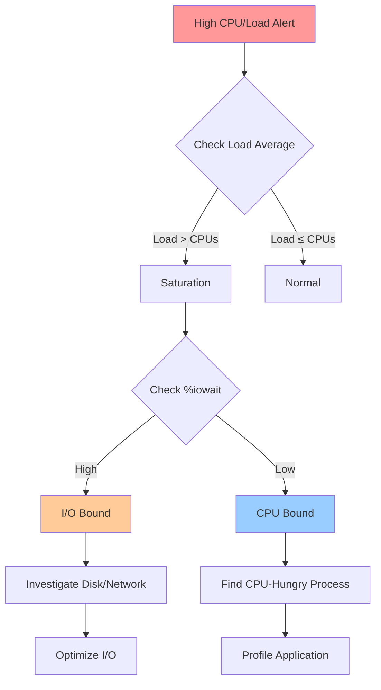

# Playbook: Investigate High CPU or Load

## Overview

This playbook provides systematic steps to diagnose and resolve high CPU usage or high load average issues on Linux systems.

> [!summary] Goal
> Identify what is consuming CPU resources and determine if load is caused by CPU saturation, I/O wait, or process queue pressure.

---

## Quick Reference



---

## Step 1: Confirm Symptoms

### Check Load Average

```bash
# Quick check
uptime
# Output: 15:42:07 up 10 days,  2:15,  3 users,  load average: 8.50, 6.20, 4.10

# Interpretation:
# - 3 numbers: 1-min, 5-min, 15-min averages
# - Compare to CPU count: cat /proc/cpuinfo | grep processor | wc -l
# - Load > CPU count = saturation
# - Increasing trend (4.10 → 6.20 → 8.50) = getting worse
```

**Load average interpretation** (4-CPU system):
- `2.00, 2.00, 2.00` - Under capacity (50% utilized)
- `4.00, 4.00, 4.00` - At capacity (100% utilized)
- `8.00, 6.00, 4.00` - Recent spike, stabilizing
- `4.00, 6.00, 8.00` - Getting worse over time

### Check Overall CPU Usage

```bash
# Live monitoring
top
htop  # Better interface

# Single snapshot
mpstat 1 5  # 5 samples, 1 second apart

# Key metrics:
# %usr  - User-space processes
# %sys  - Kernel operations
# %iowait - Waiting for I/O (high = disk/network bottleneck)
# %idle - Idle time
# %steal - Stolen by hypervisor (VM)
```

**Critical indicators**:
- **%iowait > 20%** → I/O bottleneck (disk or network)
- **%user + %system > 90%** → CPU-bound
- **Load high but %idle high** → Many blocked processes (I/O wait)

---

## Step 2: Identify Top CPU Consumers

### Find CPU-Hungry Processes

```bash
# Top processes by CPU
ps aux --sort=-%cpu | head -20

# Using top (interactive)
top
# Press 'P' to sort by CPU
# Press '1' to see per-CPU breakdown

# Per-CPU usage
mpstat -P ALL 1
# Look for imbalanced load (one CPU at 100%, others idle)
```

**Example output**:
```
USER       PID %CPU %MEM    VSZ   RSS TTY      STAT START   TIME COMMAND
www-data  1234 95.0  5.2 500000 51200 ?        R    10:00  120:45 /usr/bin/php
mysql     5678 60.2 15.3 2000000 153600 ?      Sl   09:00   80:12 /usr/sbin/mysqld
```

### Check Per-Process Threads

```bash
# Show threads for specific process
top -H -p PID
# Press 'Shift+H' to toggle thread view

# Or with ps
ps -Lp PID -o pid,tid,pcpu,comm

# Example: Find which thread is consuming CPU
ps -Lp 1234 -o pid,tid,pcpu,comm --sort=-%cpu | head
```

---

## Step 3: Determine Bottleneck Type

### Check I/O Wait

```bash
# Virtual memory statistics
vmstat 1 5
# Columns:
# r  - Processes waiting for CPU (runnable)
# b  - Processes in uninterruptible sleep (I/O)
# wa - I/O wait percentage

# High 'b' and 'wa' = I/O bottleneck
```

### Check Disk I/O

```bash
# Disk statistics
iostat -xz 1 5

# Key metrics:
# %util - % time disk was busy (>80% = saturation)
# await - Average I/O wait time (ms)
# r/s, w/s - Reads/writes per second

# Per-process I/O
iotop -o  # Only show processes doing I/O
pidstat -d 1
```

### Check Process State

```bash
# Count processes by state
ps aux | awk '{print $8}' | sort | uniq -c

# Process states:
# R - Running/Runnable (CPU-bound)
# D - Uninterruptible sleep (I/O wait) ← RED FLAG if many
# S - Interruptible sleep (waiting for event)
# Z - Zombie
```

**Many processes in 'D' state** → I/O bottleneck

---

## Step 4: Deep Dive Analysis

### Trace System Calls

```bash
# See what process is doing
sudo strace -p PID -c
# -c: Count time in each syscall

# Common patterns:
# - Lots of futex → Lock contention
# - Lots of read/write → Disk I/O
# - Lots of poll/epoll_wait → Waiting for network
# - Lots of recvfrom/sendto → Network I/O

# Live trace (brief only - high overhead!)
sudo strace -p PID -T
# -T: Show time spent in each syscall
```

### Profile CPU Usage

```bash
# System-wide CPU profile (30 seconds)
sudo perf record -F 99 -a -g -- sleep 30
sudo perf report

# Specific process
sudo perf record -F 99 -p PID -g -- sleep 30
sudo perf report

# Generate flame graph
sudo perf script | stackcollapse-perf.pl | flamegraph.pl > cpu.svg
```

### Check for CPU Affinity Issues

```bash
# Check CPU affinity
taskset -p PID

# All threads pinned to one CPU?
ps -eLo pid,tid,psr,comm | grep PROCESS_NAME
# psr: Processor number (if all same = imbalanced)

# Set affinity to multiple CPUs
taskset -c 0-3 -p PID
```

---

## Step 5: Application-Specific Analysis

### Web Server (nginx/Apache)

```bash
# Check concurrent connections
ss -tan | grep ESTAB | wc -l

# Nginx status (if configured)
curl http://localhost/nginx_status

# Apache status
curl http://localhost/server-status
```

### Database (MySQL/PostgreSQL)

```bash
# MySQL slow queries
mysql -e "SHOW FULL PROCESSLIST;"
mysql -e "SHOW ENGINE INNODB STATUS\G"

# PostgreSQL activity
psql -c "SELECT pid, query, state, wait_event FROM pg_stat_activity WHERE state = 'active';"

# Long-running queries
psql -c "SELECT pid, now() - query_start AS duration, query FROM pg_stat_activity WHERE state = 'active' ORDER BY duration DESC;"
```

### Java Application

```bash
# Thread dump
jstack PID > thread_dump.txt

# Heap info
jmap -heap PID

# GC statistics
jstat -gc PID 1000  # Every 1 second
```

---

## Step 6: Common Scenarios and Solutions

### Scenario 1: High CPU, Low I/O Wait

**Diagnosis**: CPU-bound workload

**Actions**:
1. Identify hot functions with perf/profiling
2. Optimize algorithms (reduce complexity)
3. Add caching to avoid repeated computation
4. Scale horizontally (more workers/instances)
5. Optimize code (eliminate tight loops, inefficient operations)

```bash
# Profile hot functions
sudo perf record -F 99 -p PID -g -- sleep 30
sudo perf report --stdio | head -50
```

### Scenario 2: High Load, High I/O Wait

**Diagnosis**: I/O bottleneck (disk or network)

**Actions**:
1. Check disk latency: `iostat -xz 1`
2. Identify I/O-heavy processes: `iotop -o`
3. Optimize queries (add indexes, reduce data fetched)
4. Add caching layer (Redis, Memcached)
5. Upgrade to faster storage (HDD → SSD)
6. Check network latency to backend services

```bash
# Find I/O-heavy processes
iotop -o -b -n 3

# Check disk latency
iostat -xz 1 5 | grep -E '(Device|sd)'
```

### Scenario 3: High Load, Many Processes in D State

**Diagnosis**: Disk I/O saturation or storage issue

**Actions**:
1. Check which processes are blocked: `ps aux | grep " D "`
2. Check disk health: `sudo smartctl -a /dev/sda`
3. Check for failing mounts: `dmesg | grep -i error`
4. Increase I/O scheduler priority for critical processes
5. Move workload to different disk

```bash
# Processes in uninterruptible sleep
ps aux | awk '$8 == "D" {print}'

# Disk errors
dmesg | grep -i "I/O error"
```

### Scenario 4: One CPU Saturated, Others Idle

**Diagnosis**: Single-threaded bottleneck or poor CPU affinity

**Actions**:
1. Check if application is single-threaded
2. Scale out with multiple workers
3. Optimize single-threaded code
4. Consider parallelization (if possible)

```bash
# Per-CPU usage
mpstat -P ALL 1 5

# If CPU0 at 100%, others at 0%:
# → Single-threaded application bottleneck
```

---

## Step 7: Mitigation and Resolution

### Immediate Actions (Stop the Bleeding)

```bash
# 1. Kill runaway process (if identified)
sudo kill -9 PID

# 2. Restart service (if safe)
sudo systemctl restart myapp

# 3. Throttle CPU usage (temporary)
cpulimit -p PID -l 50  # Limit to 50% of one CPU

# 4. Adjust process priority
sudo renice -n 10 -p PID  # Lower priority (higher nice value)
```

### Long-Term Solutions

1. **Code optimization**: Profile and fix hot paths
2. **Caching**: Add Redis/Memcached
3. **Database tuning**: Indexes, query optimization
4. **Horizontal scaling**: Load balancers, more instances
5. **Resource limits**: cgroups to prevent one service from consuming all CPU
6. **Monitoring**: Set up alerts before saturation

### Set Resource Limits

```bash
# systemd CPU quota
# /etc/systemd/system/myapp.service
[Service]
CPUQuota=50%
MemoryMax=512M

# cgroups v2
echo "50000 100000" > /sys/fs/cgroup/myapp/cpu.max
echo PID > /sys/fs/cgroup/myapp/cgroup.procs
```

---

## Verification

### Confirm Resolution

```bash
# 1. Check load average
uptime
# Should be trending down

# 2. Check CPU usage
top
mpstat 1 5

# 3. Monitor for 30+ minutes
watch -n 10 'uptime; ps aux --sort=-%cpu | head -5'

# 4. Check application health
curl http://localhost/health
# Or application-specific health check
```

---

## Documentation Template

```markdown
## Incident Report: High CPU

**Date**: 2026-04-26 15:30 UTC
**Severity**: High
**Duration**: 45 minutes

### Symptoms
- Load average: 12.5 (4-CPU system)
- %user: 85%, %iowait: 5%
- Application response time: 5s → 30s

### Root Cause
- MySQL slow query without index on users table
- Query scans 10M rows on each request

### Investigation Steps
1. Checked load average: 12.5 (uptime)
2. Identified mysqld at 400% CPU (top)
3. Reviewed slow query log: SELECT with no index
4. EXPLAIN showed full table scan

### Resolution
1. Added index: CREATE INDEX idx_email ON users(email)
2. Load dropped to 2.0 within 5 minutes
3. Response time returned to 200ms

### Prevention
- Enable slow query log monitoring
- Add index suggestions to code review checklist
- Set up alerts for load > 8.0
```

---

## Related Notes

- [[01_Performance_Tuning_and_Profiling]] - Detailed performance analysis
- [[02_Tracing_strace_ltrace_perf]] - Deep profiling tools
- [[03_Processes_and_Jobs]] - Process management

---

> [!tip] Best Practices
> 1. **Start with broad metrics**: Load average, top
> 2. **Narrow down systematically**: Process → thread → function
> 3. **Use low-overhead tools first**: top, ps before strace
> 4. **Profile, don't guess**: Use perf for CPU profiling
> 5. **Document findings**: Record cause, solution, prevention
> 6. **Set up monitoring**: Alert before saturation occurs
> 7. **Test fixes in staging**: Verify optimization works
> 8. **Keep existing sessions open**: When making system changes
