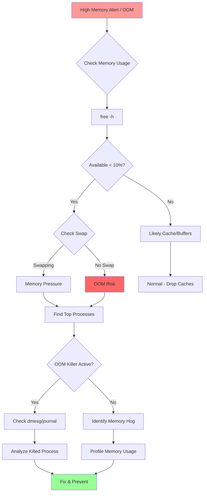

# Playbook: Investigate High Memory or OOM

## Overview

This playbook provides systematic steps to diagnose and resolve high memory usage or Out-Of-Memory (OOM) killer events on Linux systems.

> [!summary] Goal
> Identify which process is consuming memory, distinguish between actual memory usage (RSS) vs cache, capture evidence before restarting, and prevent future OOM events.

---

## Quick Reference



---

## Step 1: Assess Current Memory State

### Check Overall Memory Usage

```bash
# Human-readable summary
free -h
# Output interpretation:
#               total        used        free      shared  buff/cache   available
# Mem:           15Gi       8.0Gi       1.2Gi       200Mi       6.0Gi       6.5Gi
# Swap:          2.0Gi       500Mi       1.5Gi

# Key columns:
# - total: Physical RAM
# - used: Actually used by processes
# - free: Completely unused (usually small - this is GOOD)
# - buff/cache: Disk cache (can be freed if needed)
# - available: Memory available for new processes (MOST IMPORTANT)
# - Swap used: If high, system is under memory pressure
```

**Critical thresholds**:
- **available < 10% of total** → High memory pressure
- **Swap used > 50% of swap** → Severe memory pressure
- **available < 500MB** → OOM killer may trigger

### Continuous Monitoring

```bash
# Watch memory every 2 seconds
watch -n 2 free -h

# Virtual memory statistics
vmstat 1 5
# Key columns:
# swpd - Swap used
# free - Free memory
# buff - Buffer cache
# cache - Page cache
# si - Swap in (pages/sec) ← Non-zero = thrashing
# so - Swap out (pages/sec) ← Non-zero = thrashing

# Memory statistics
cat /proc/meminfo
# Look for:
# MemAvailable - Available memory for new processes
# SwapTotal/SwapFree - Swap usage
# Dirty - Dirty pages waiting to be written to disk
# Slab - Kernel object cache
```

**Thrashing indicators**:
- `si` and `so` both > 0 in vmstat = system swapping heavily
- High `%wa` (I/O wait) + swap activity = disk thrashing

---

## Step 2: Identify Memory-Consuming Processes

### Find Top Memory Consumers

```bash
# Top processes by memory usage
ps aux --sort=-%mem | head -20

# Column breakdown:
# USER  PID %CPU %MEM    VSZ   RSS TTY  STAT START   TIME COMMAND
# VSZ  - Virtual memory size (address space reserved)
# RSS  - Resident Set Size (actual physical memory used)

# Using top
top
# Press 'M' to sort by memory
# Press 'E' to change units (KiB/MiB/GiB)

# Using htop (better interface)
htop
# Press F6, select %MEM
```

**Example output**:
```
USER       PID %CPU %MEM    VSZ   RSS TTY      STAT START   TIME COMMAND
mysql     5678  2.0 35.2 4000000 3520000 ?     Sl   00:15 120:45 mysqld
www-data  1234  5.0 15.3 2000000 1530000 ?     S    00:20  45:30 php-fpm
```

**VSZ vs RSS**:
- **VSZ (Virtual Size)**: Total address space (includes shared libs, memory-mapped files)
- **RSS (Resident Set Size)**: Actual physical RAM used
- **Focus on RSS** for real memory consumption

### Per-Process Memory Breakdown

```bash
# Detailed memory info for specific process
cat /proc/PID/status | grep -E "Vm|Rss"

# Key fields:
# VmSize  - Total virtual memory
# VmRSS   - Resident memory (physical RAM)
# RssAnon - Anonymous memory (heap, stack)
# RssFile - File-backed pages (memory-mapped files)
# RssShmem- Shared memory
# VmSwap  - Memory swapped to disk

# Example:
cat /proc/1234/status | grep -E "Vm|Rss"
```

**Output interpretation**:
```
VmSize:   2000000 kB  (Virtual size - mostly irrelevant)
VmRSS:    1530000 kB  (Actual RAM used - KEY METRIC)
RssAnon:  1200000 kB  (Heap/stack - application data)
RssFile:   300000 kB  (Memory-mapped files/libs)
RssShmem:   30000 kB  (Shared memory)
VmSwap:    100000 kB  (Swapped out - BAD if high)
```

### Memory Maps (Advanced)

```bash
# Show memory mappings
sudo pmap -x PID

# Detailed breakdown
cat /proc/PID/smaps
# Look for large Private_Dirty sections (actual memory used)

# Summary
cat /proc/PID/smaps_rollup
```

---

## Step 3: Check for OOM Killer Activity

### Search System Logs

```bash
# Check dmesg for OOM events
dmesg -T | grep -i "oom\|killed process"

# Using journalctl
journalctl -k | grep -i "oom\|killed process"
journalctl -k --since "1 hour ago" | grep -i "oom"

# Look for output like:
# [Sun Apr 26 14:32:15 2026] Out of memory: Killed process 1234 (mysqld) total-vm:4000000kB, anon-rss:3520000kB, file-rss:0kB
```

**Example OOM killer log**:
```
Apr 26 14:32:15 server kernel: mysqld invoked oom-killer: gfp_mask=0x6200ca, order=0, oom_score_adj=0
Apr 26 14:32:15 server kernel: Out of memory: Killed process 1234 (mysqld) total-vm:4000000kB, anon-rss:3520000kB, file-rss:0kB, shmem-rss:0kB, UID:999 pgtables:8000kB oom_score_adj:0
```

### OOM Killer Scores

```bash
# Check OOM scores for all processes
ps -eo pid,comm,oom_score,oom_score_adj | sort -k3 -rn | head -20

# Columns:
# oom_score     - Current score (higher = more likely to be killed)
# oom_score_adj - Manual adjustment (-1000 to 1000)

# Set OOM score (make less likely to kill)
echo -1000 > /proc/PID/oom_score_adj  # Never kill
echo -500 > /proc/PID/oom_score_adj   # Less likely
echo 0 > /proc/PID/oom_score_adj      # Default
```

**OOM score calculation**:
- Based on memory usage, runtime, and adjustment
- Processes using more memory = higher score
- Set `oom_score_adj=-1000` for critical processes (never kill)

---

## Step 4: Determine Memory Type

### Check Cache vs Actual Usage

```bash
# Detailed memory breakdown
cat /proc/meminfo

# Key distinction:
# MemFree + Buffers + Cached = "Available" for processes
# If "Cached" is large and "MemFree" is small, it's OK (cache can be freed)

# Drop caches (SAFE - only drops clean cache)
sudo sync  # Flush dirty pages first
sudo sh -c 'echo 3 > /proc/sys/vm/drop_caches'

# Re-check memory
free -h
```

**Cache types**:
- **Page cache**: File contents cached in RAM (drops automatically when needed)
- **Slab cache**: Kernel objects (dentries, inodes)
- **Anonymous memory**: Process heap/stack (CANNOT be dropped)

### Check for Memory Leaks

```bash
# Monitor process memory over time
watch -n 5 'ps aux --sort=-%mem | head -10'

# Or log to file
while true; do
  date >> memory.log
  ps -p PID -o pid,%mem,rss,vsz,comm >> memory.log
  sleep 60
done

# Analyze growth
# If RSS constantly increases = likely memory leak
```

**Memory leak indicators**:
- RSS grows continuously over time
- Memory never decreases (even during idle periods)
- Eventually triggers OOM killer
- Restarting process temporarily fixes issue

---

## Step 5: Application-Specific Analysis

### Database (MySQL/PostgreSQL)

```bash
# MySQL memory usage
mysql -e "SHOW VARIABLES LIKE '%buffer%';"
mysql -e "SHOW VARIABLES LIKE '%cache%';"
mysql -e "SHOW ENGINE INNODB STATUS\G" | grep -A 20 "BUFFER POOL"

# PostgreSQL shared buffers
psql -c "SHOW shared_buffers;"
psql -c "SELECT * FROM pg_stat_database;"

# Check for bloated tables
psql -c "SELECT schemaname, tablename, pg_size_pretty(pg_total_relation_size(schemaname||'.'||tablename)) FROM pg_tables ORDER BY pg_total_relation_size(schemaname||'.'||tablename) DESC LIMIT 10;"
```

### Java Applications

```bash
# Heap usage
jmap -heap PID

# Heap dump (for analysis)
jmap -dump:live,format=b,file=heap.bin PID

# Analyze with jhat or Eclipse MAT
jhat heap.bin

# GC logs
jstat -gc PID 1000

# Look for:
# - Frequent full GCs
# - Heap utilization near max
# - Old generation not being collected
```

### Python Applications

```bash
# Memory profiler (requires memory_profiler package)
python -m memory_profiler script.py

# Using tracemalloc (built-in)
import tracemalloc
tracemalloc.start()
# ... run code ...
snapshot = tracemalloc.take_snapshot()
top_stats = snapshot.statistics('lineno')
for stat in top_stats[:10]:
    print(stat)
```

### Containers (Docker/Kubernetes)

```bash
# Docker container memory usage
docker stats

# Check container memory limit
docker inspect CONTAINER | grep -i memory

# Kubernetes pod memory
kubectl top pods
kubectl describe pod POD_NAME | grep -i memory

# Check OOM kills in containers
kubectl get pods --all-namespaces -o json | jq '.items[] | select(.status.containerStatuses[].lastState.terminated.reason=="OOMKilled") | {name: .metadata.name, namespace: .metadata.namespace}'
```

---

## Step 6: Common Scenarios and Solutions

### Scenario 1: High Cache Usage, Low Available Memory

**Diagnosis**: System using memory for disk cache (NORMAL)

**Actions**:
```bash
# Check if it's mostly cache
free -h
# If "available" is sufficient, this is OK

# To verify, drop caches
sudo sync
sudo sh -c 'echo 3 > /proc/sys/vm/drop_caches'
free -h  # Available memory should increase

# No action needed - cache is freed automatically
```

### Scenario 2: Process Consuming Excessive Memory

**Diagnosis**: Misconfigured service or memory leak

**Actions**:
1. Identify top consumer: `ps aux --sort=-%mem | head`
2. Check configuration (e.g., database buffer pool, JVM heap)
3. Review application logs for errors
4. Restart service (temporary fix)
5. Implement memory limit via cgroups/systemd

```bash
# Set memory limit via systemd
# /etc/systemd/system/myapp.service
[Service]
MemoryMax=2G
MemoryHigh=1.8G

sudo systemctl daemon-reload
sudo systemctl restart myapp
```

### Scenario 3: OOM Killer Triggered

**Diagnosis**: System ran out of memory

**Actions**:
1. Check logs: `dmesg -T | grep -i oom`
2. Identify killed process
3. Determine root cause (leak, spike, misconfiguration)
4. Increase memory OR reduce memory usage
5. Set OOM score adjustment for critical processes

```bash
# Prevent critical process from being killed
echo -1000 > /proc/PID/oom_score_adj

# Or via systemd
[Service]
OOMScoreAdjust=-1000
```

### Scenario 4: Memory Leak

**Diagnosis**: Process memory grows continuously

**Actions**:
1. Confirm leak: Monitor RSS over time
2. Generate heap dump (Java/Python/etc.)
3. Analyze with profiler (find leak source)
4. Fix code
5. Temporary workaround: Scheduled restarts

```bash
# Scheduled restart (temporary workaround)
# Cron job to restart daily at 3 AM
0 3 * * * systemctl restart myapp
```

### Scenario 5: Swap Thrashing

**Diagnosis**: System constantly swapping (si/so in vmstat)

**Actions**:
1. Reduce memory usage (kill/restart processes)
2. Increase RAM
3. Adjust swappiness
4. Identify and fix memory hog

```bash
# Check swappiness (0-100, default 60)
cat /proc/sys/vm/swappiness

# Reduce swappiness (swap less aggressively)
sudo sysctl vm.swappiness=10

# Permanent
echo "vm.swappiness=10" | sudo tee -a /etc/sysctl.conf
```

---

## Step 7: Mitigation and Prevention

### Immediate Actions

```bash
# 1. Drop caches (if safe)
sudo sync
sudo sh -c 'echo 3 > /proc/sys/vm/drop_caches'

# 2. Kill non-critical processes
sudo kill -9 PID

# 3. Restart memory-hungry service
sudo systemctl restart myapp

# 4. Clear logs (if disk is also full)
sudo journalctl --vacuum-size=100M
```

### Set Resource Limits

```bash
# systemd service limits
# /etc/systemd/system/myapp.service
[Service]
MemoryMax=4G          # Hard limit (OOM if exceeded)
MemoryHigh=3.5G       # Soft limit (throttle if exceeded)
MemorySwapMax=0       # Disable swap for this service

# cgroups v2 (manual)
echo "4G" > /sys/fs/cgroup/myapp/memory.max
echo PID > /sys/fs/cgroup/myapp/cgroup.procs

# ulimit (per-process)
ulimit -v 4000000  # Virtual memory limit (KB)
```

### Configure OOM Killer Behavior

```bash
# Adjust OOM score for critical services
# /etc/systemd/system/myapp.service
[Service]
OOMScoreAdjust=-900  # Less likely to be killed (-1000 to 1000)

# Disable OOM killer (DANGEROUS - system may freeze)
# sysctl vm.oom-kill-disable=1  # NOT RECOMMENDED
```

### Enable Memory Overcommit Protection

```bash
# Check overcommit setting
cat /proc/sys/vm/overcommit_memory
# 0 - Heuristic (default)
# 1 - Always overcommit (DANGEROUS)
# 2 - Never overcommit beyond ratio

# Set strict overcommit
sudo sysctl vm.overcommit_memory=2
sudo sysctl vm.overcommit_ratio=80  # Allow 80% of RAM + swap

# Permanent
echo "vm.overcommit_memory=2" | sudo tee -a /etc/sysctl.conf
echo "vm.overcommit_ratio=80" | sudo tee -a /etc/sysctl.conf
```

### Monitoring and Alerts

```bash
# Simple monitoring script
#!/bin/bash
THRESHOLD=90
AVAILABLE=$(free | grep Mem | awk '{print int(($7/$2)*100)}')
if [ $AVAILABLE -lt $((100-THRESHOLD)) ]; then
  echo "Memory usage > ${THRESHOLD}%!" | mail -s "Memory Alert" admin@example.com
fi

# Add to cron (every 5 minutes)
*/5 * * * * /path/to/memory-check.sh
```

**Production monitoring**:
- Set up Prometheus + node_exporter
- Alert on `node_memory_MemAvailable_bytes < 1GB`
- Alert on `rate(node_vmstat_pswpin[5m]) > 0` (swapping)

---

## Step 8: Root Cause Analysis

### Common Causes

1. **Application memory leak**
   - Object references not released
   - Goroutine/thread leaks
   - File descriptor leaks
   
2. **Misconfiguration**
   - Database buffer pool too large
   - JVM heap size misconfigured
   - Cache settings too aggressive

3. **Workload spike**
   - Traffic surge
   - Batch job consuming memory
   - Data import/export

4. **Container/cgroup limits too low**
   - Kubernetes memory request/limit mismatch
   - Docker memory limit insufficient

5. **Kernel memory leak** (rare)
   - Slab cache growth
   - Requires kernel upgrade

### Memory Leak Detection

```bash
# Monitor process over time
while true; do
  date >> leak.log
  cat /proc/PID/status | grep -E "VmRSS|RssAnon" >> leak.log
  sleep 300  # Every 5 minutes
done

# Analyze log for continuous growth
grep VmRSS leak.log | awk '{print $2}' | sort -n
```

---

## Verification

### Confirm Resolution

```bash
# 1. Check available memory
free -h
# Should have sufficient "available" memory

# 2. Check swap usage
vmstat 1 5
# si and so should be 0 (no swapping)

# 3. Monitor top consumers
ps aux --sort=-%mem | head -10

# 4. Check for OOM events
dmesg -T | grep -i oom | tail -20
# Should be no recent events

# 5. Monitor for 30+ minutes
watch -n 30 'free -h; echo "---"; ps aux --sort=-%mem | head -5'
```

---

## Documentation Template

```markdown
## Incident Report: High Memory / OOM

**Date**: 2026-04-26 14:30 UTC
**Severity**: Critical
**Duration**: 1 hour 15 minutes

### Symptoms
- Available memory: 200MB (out of 16GB)
- OOM killer triggered: mysqld killed at 14:32
- Application unavailable for 15 minutes
- Swap usage: 1.8GB / 2GB

### Root Cause
- MySQL innodb_buffer_pool_size set to 14GB on 16GB system
- No memory left for OS and other processes
- Batch import job pushed system over limit

### Investigation Steps
1. Checked available memory: 200MB (free -h)
2. Found mysqld using 14GB (ps aux --sort=-%mem)
3. Reviewed OOM logs: mysqld killed at 14:32 (dmesg -T)
4. Checked MySQL config: innodb_buffer_pool_size=14G

### Resolution
1. Reduced innodb_buffer_pool_size to 10G
2. Set systemd MemoryMax=12G for mysql
3. Restarted MySQL
4. Memory stabilized at 11GB used, 4.5GB available

### Prevention
- Set innodb_buffer_pool_size to 60% of RAM (9.6GB)
- Add memory monitoring alert (available < 2GB)
- Set systemd memory limits for all services
- Document resource allocation guidelines
```

---

## Related Notes

- [[01_Performance_Tuning_and_Profiling]] - Performance analysis
- [[03_Namespaces_and_Cgroups]] - Resource limits
- [[01_Investigate_High_CPU_or_Load]] - CPU troubleshooting

---

> [!tip] Best Practices
> 1. **Available memory matters**: Not "free" - check `available` column
> 2. **Cache is not a problem**: Large cache is normal, drops automatically
> 3. **RSS is real usage**: Focus on RSS, not VSZ
> 4. **Swap = warning sign**: Some swap OK, thrashing is BAD
> 5. **Set resource limits**: Use systemd/cgroups to prevent runaway processes
> 6. **Monitor proactively**: Alert before OOM, not after
> 7. **Profile before optimizing**: Use heap dumps to find actual leaks
> 8. **Document limits**: Know memory budget for each service
> 9. **Plan for spikes**: Leave headroom for traffic surges
> 10. **OOM score matters**: Protect critical processes with oom_score_adj

> [!warning] Common Pitfalls
> - Confusing "free" with "available" memory
> - Thinking high cache usage is a problem
> - Relying on VSZ instead of RSS
> - Not setting memory limits on services
> - Killing processes without investigating root cause
> - Ignoring swap activity until system freezes
> - Setting oom_score_adj=-1000 on everything (defeats purpose)
