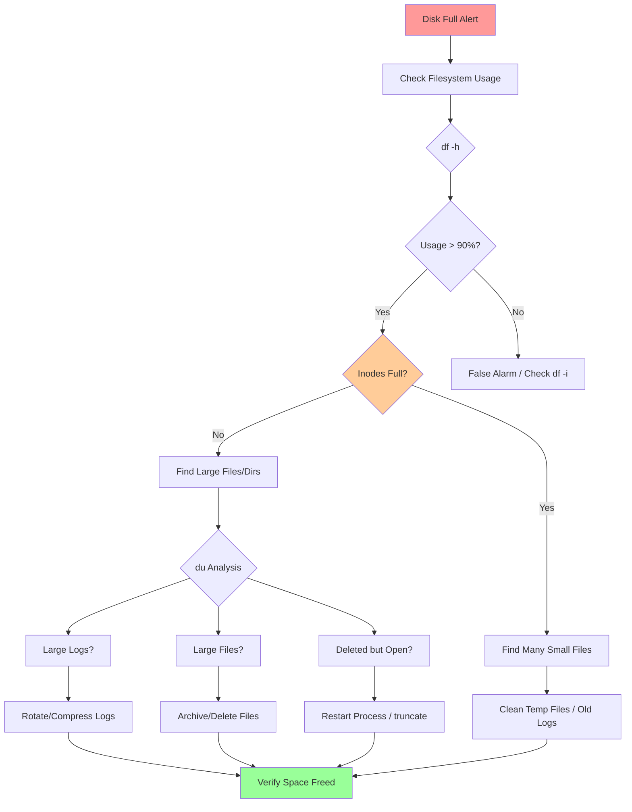

# Playbook: Investigate Disk Full

## Overview

This playbook provides systematic steps to diagnose and resolve disk space exhaustion issues on Linux systems.

> [!summary] Goal
> Find what is consuming disk space, identify log growth patterns, handle "deleted but still open" files, recover from 100% full filesystems, and prevent future disk space issues.

---

## Quick Reference



---

## Step 1: Confirm Disk Space Usage

### Check Filesystem Usage

```bash
# Check disk space by filesystem
df -h
# Output:
# Filesystem      Size  Used Avail Use% Mounted on
# /dev/sda1        50G   47G  1.2G  98% /
# /dev/sdb1       200G  180G   11G  95% /var

# Key columns:
# Size - Total size
# Used - Space consumed
# Avail - Available space
# Use% - Percentage used ← CRITICAL
# Mounted on - Mount point

# Check all filesystems (including pseudo)
df -hT
# -T shows filesystem type (ext4, xfs, tmpfs, etc.)
```

**Critical thresholds**:
- **> 90%**: Investigate soon
- **> 95%**: Urgent - will impact operations
- **> 98%**: Critical - applications may fail
- **100%**: System may be unstable

### Check Inode Usage

```bash
# Check inode usage
df -i
# Output:
# Filesystem      Inodes  IUsed   IFree IUse% Mounted on
# /dev/sda1      3276800 3250000  26800  100% /

# IUse% = 100% means no new files can be created
# Even if disk has space!
```

**Inode exhaustion**:
- Caused by millions of tiny files
- Common in `/tmp`, `/var/log`, container layers
- Requires deleting files, not just freeing space

### Real-Time Monitoring

```bash
# Watch disk usage
watch -n 5 'df -h | grep -E "Filesystem|/dev/sd"'

# Monitor specific filesystem
watch -n 2 'df -h /var'
```

---

## Step 2: Find Large Directories

### Quick Top-Level Analysis

```bash
# Top-level directories by size
sudo du -hx --max-depth=1 / 2>/dev/null | sort -h | tail -20

# Explanation:
# -h: Human-readable (GB, MB)
# -x: Don't cross filesystem boundaries
# --max-depth=1: Only immediate subdirectories
# 2>/dev/null: Suppress permission errors
# sort -h: Human-numeric sort
# tail -20: Show largest 20

# Common culprits:
# /var - Logs, databases, caches
# /home - User data
# /tmp - Temporary files
# /opt - Third-party applications
# /usr - System software (shouldn't grow much)
```

### Drill Down into Large Directories

```bash
# If /var is large, investigate further
sudo du -hx --max-depth=2 /var | sort -h | tail -20

# Common /var subdirectories:
# /var/log - Application and system logs
# /var/lib/docker - Docker images and containers
# /var/lib/mysql - MySQL databases
# /var/cache - Package cache, application cache
# /var/tmp - Temporary files (persists across reboots)
```

### Visualize Disk Usage

```bash
# ncdu - Interactive disk usage analyzer (if installed)
sudo ncdu /

# Navigate with arrow keys
# 'd' to delete
# 'q' to quit

# Or using du + awk
sudo du -hx / | awk '$1 ~ /G$/ {print}' | sort -h
# Shows only entries > 1GB
```

---

## Step 3: Find Large Files

### Search for Large Files

```bash
# Find files larger than 1GB
sudo find / -xdev -type f -size +1G -exec ls -lh {} \; 2>/dev/null

# Find files larger than 100MB
sudo find /var -type f -size +100M -exec ls -lh {} \; 2>/dev/null

# Sort by size (largest first)
sudo find /var -type f -size +100M -exec du -h {} \; 2>/dev/null | sort -h -r | head -20

# Explanation:
# -xdev: Don't cross filesystem boundaries (like -x in du)
# -type f: Only files (not directories)
# -size +1G: Larger than 1GB
```

**Common large files**:
- Log files: `/var/log/*.log`
- Database dumps: `/var/backups/*.sql`
- Core dumps: `/var/crash/`, `/tmp/core.*`
- Old kernels: `/boot/vmlinuz-*`
- Docker images: `/var/lib/docker/`

### Find Recently Modified Large Files

```bash
# Files modified in last 24 hours > 100MB
sudo find /var -type f -size +100M -mtime -1 -exec ls -lh {} \;

# Files modified in last hour
sudo find /var -type f -size +50M -mmin -60 -exec ls -lh {} \;

# Useful for finding growing logs
```

---

## Step 4: Check for "Deleted but Open" Files

### The Problem

When a file is deleted but still held open by a process, disk space is NOT freed until the process closes the file or is restarted.

### Find Deleted but Open Files

```bash
# List deleted files still held open
sudo lsof +L1

# Output:
# COMMAND   PID   USER   FD   TYPE DEVICE SIZE/OFF NLINK NODE NAME
# mysqld   1234  mysql   4w   REG  253,1  5G       0     12345 /var/log/mysql/mysql.log (deleted)

# Key column: NLINK = 0 (deleted)
# SIZE/OFF shows space still consumed

# Sum space consumed by deleted files
sudo lsof +L1 | awk 'NR>1 {sum+=$7} END {print "Total:", sum/1024/1024/1024, "GB"}'
```

### Reclaim Space from Deleted Files

```bash
# Option 1: Restart the process (cleanest)
sudo systemctl restart mysql

# Option 2: Truncate the file handle (without restart)
# Get FD number from lsof output (column FD)
sudo truncate -s 0 /proc/PID/fd/FD_NUMBER

# Example: If lsof shows FD=4w for PID 1234
sudo truncate -s 0 /proc/1234/fd/4

# Option 3: Close file descriptor (risky - may crash app)
# gdb -p PID
# (gdb) call close(4)
# (gdb) quit
```

**Best practice**: Restart the application if possible.

---

## Step 5: Investigate Log Files

### Find Large Logs

```bash
# Largest log files
sudo du -h /var/log/* | sort -h -r | head -20

# Or find all logs > 100MB
sudo find /var/log -type f -size +100M -exec ls -lh {} \;

# Check journal size (systemd)
journalctl --disk-usage
# Output: Archived and active journals take up 2.5G in the file system.
```

### Analyze Log Growth

```bash
# Monitor log file growth in real-time
watch -n 5 'ls -lh /var/log/myapp.log'

# Or track size changes
while true; do
  date
  ls -lh /var/log/myapp.log
  sleep 60
done

# Check what's being written
sudo tail -f /var/log/myapp.log
```

### Clean Up Logs

```bash
# Rotate logs immediately (if using logrotate)
sudo logrotate -f /etc/logrotate.conf

# Compress old logs
sudo gzip /var/log/myapp.log.1

# Delete old logs (be careful!)
sudo rm /var/log/myapp.log.*.gz

# Clean systemd journal (keep last 100MB)
sudo journalctl --vacuum-size=100M

# Or keep last 7 days
sudo journalctl --vacuum-time=7d

# Truncate active log file (if not rotated)
sudo truncate -s 0 /var/log/myapp.log
# OR
sudo sh -c '> /var/log/myapp.log'
```

---

## Step 6: Check Common Culprits

### Docker

```bash
# Check Docker disk usage
docker system df
# Output:
# TYPE            TOTAL   ACTIVE  SIZE      RECLAIMABLE
# Images          15      5       10GB      8GB (80%)
# Containers      20      3       500MB     400MB (80%)
# Local Volumes   10      2       50GB      45GB (90%)
# Build Cache     0       0       0B        0B

# Clean up unused resources
docker system prune -a
# WARNING: Removes all unused images, not just dangling

# Clean specific resources
docker image prune -a       # Remove unused images
docker container prune      # Remove stopped containers
docker volume prune         # Remove unused volumes
docker builder prune        # Remove build cache
```

### Package Manager Cache

```bash
# APT (Debian/Ubuntu)
sudo du -sh /var/cache/apt/archives
sudo apt-get clean  # Remove cached .deb files
sudo apt-get autoclean  # Remove outdated cached packages

# DNF/YUM (RHEL/CentOS/Fedora)
sudo du -sh /var/cache/dnf
sudo dnf clean all

# Pacman (Arch)
sudo du -sh /var/cache/pacman/pkg
sudo pacman -Sc  # Remove old packages from cache
```

### Temporary Files

```bash
# /tmp (cleared on reboot on most systems)
sudo du -sh /tmp
sudo find /tmp -type f -atime +7 -delete  # Delete files not accessed in 7 days

# /var/tmp (NOT cleared on reboot)
sudo du -sh /var/tmp
sudo find /var/tmp -type f -atime +30 -delete

# Application temp directories
sudo du -sh /var/cache/*
```

### Old Kernels

```bash
# List installed kernels (Ubuntu/Debian)
dpkg --list | grep linux-image

# Current kernel
uname -r

# Remove old kernels (keep current + 1 previous)
sudo apt-get autoremove --purge

# RHEL/CentOS
sudo dnf remove $(dnf repoquery --installonly --latest-limit=-2 -q)
```

### Core Dumps

```bash
# Find core dumps
sudo find / -xdev -name "core.*" -o -name "core" -type f 2>/dev/null

# Check systemd core dumps
sudo du -sh /var/lib/systemd/coredump

# Delete core dumps
sudo rm /var/lib/systemd/coredump/*
sudo coredumpctl clean
```

---

## Step 7: Inode Exhaustion

### Diagnose Inode Issues

```bash
# Check inode usage
df -i

# Find directories with many files
sudo find / -xdev -type d -exec sh -c 'echo "$(find "{}" -maxdepth 1 | wc -l) {}"' \; 2>/dev/null | sort -n -r | head -20

# Or using a simpler approach
for dir in /*; do
  echo -n "$dir: "
  find "$dir" -xdev 2>/dev/null | wc -l
done | sort -t: -k2 -n -r | head -20
```

### Common Causes

- **Session files**: `/var/lib/php/sessions/`
- **Temporary files**: `/tmp`, `/var/tmp`
- **Log files**: Millions of small rotated logs
- **Git repositories**: `.git/objects/`
- **Container layers**: `/var/lib/docker/`

### Fix Inode Exhaustion

```bash
# Delete old session files (PHP example)
sudo find /var/lib/php/sessions/ -type f -mtime +7 -delete

# Clean up temp directories
sudo find /tmp -type f -atime +3 -delete

# Remove old log files
sudo find /var/log -name "*.log.*" -mtime +30 -delete
```

---

## Step 8: Common Scenarios and Solutions

### Scenario 1: /var/log Full of Application Logs

**Diagnosis**: Application logging too verbosely or logs not being rotated

**Actions**:
1. Check largest logs: `sudo du -h /var/log/* | sort -h -r | head`
2. Configure log rotation: Edit `/etc/logrotate.d/myapp`
3. Reduce log verbosity in application config
4. Compress old logs: `sudo gzip /var/log/myapp.log.*`
5. Delete ancient logs if safe

```bash
# Example logrotate config
# /etc/logrotate.d/myapp
/var/log/myapp.log {
    daily
    rotate 7
    compress
    delaycompress
    missingok
    notifempty
    create 0640 www-data www-data
    postrotate
        systemctl reload myapp
    endscript
}

# Test logrotate
sudo logrotate -d /etc/logrotate.d/myapp  # Dry-run
sudo logrotate -f /etc/logrotate.d/myapp  # Force rotation
```

### Scenario 2: Docker Images Consuming Disk

**Diagnosis**: Accumulated unused Docker images/containers/volumes

**Actions**:
```bash
# Check usage
docker system df

# Remove all unused data
docker system prune -a --volumes

# Or selectively
docker image prune -a  # Remove unused images
docker volume prune    # Remove unused volumes
docker container prune # Remove stopped containers

# Limit Docker storage
# /etc/docker/daemon.json
{
  "data-root": "/mnt/docker-data",
  "storage-driver": "overlay2",
  "storage-opts": ["overlay2.override_kernel_check=true"]
}
```

### Scenario 3: Deleted File Still Holding Space

**Diagnosis**: Process still has deleted file open

**Actions**:
```bash
# Find the process
sudo lsof +L1

# Identify process holding the file
# Output shows PID and FD (file descriptor)

# Option 1: Restart service
sudo systemctl restart myapp

# Option 2: Truncate without restart
sudo truncate -s 0 /proc/PID/fd/FD

# Verify space freed
df -h
```

### Scenario 4: Filesystem 100% Full

**Diagnosis**: Critical - system may be unstable

**Actions**:
```bash
# 1. Free space IMMEDIATELY (find biggest file)
sudo find /var -type f -size +500M -exec ls -lh {} \; | head -5

# 2. Delete or move largest file
sudo rm /var/log/huge.log
# OR
sudo mv /var/log/huge.log /mnt/external/

# 3. Verify space freed
df -h

# 4. Investigate root cause
# (Follow steps above)
```

---

## Step 9: Prevention

### Set Up Log Rotation

```bash
# Ensure logrotate is enabled
sudo systemctl status logrotate.timer  # systemd
# OR via cron (traditional)
ls -l /etc/cron.daily/logrotate

# Add custom rotation
# /etc/logrotate.d/custom-app
/var/log/custom/*.log {
    daily           # Rotate daily
    rotate 14       # Keep 14 days
    compress        # Compress old logs
    delaycompress   # Compress after 1 day (allows reading yesterday's log)
    missingok       # Don't error if log missing
    notifempty      # Don't rotate empty logs
    create 0644 appuser appgroup
    sharedscripts
    postrotate
        systemctl reload custom-app
    endscript
}
```

### Set Up Monitoring and Alerts

```bash
# Simple shell script to alert on high disk usage
#!/bin/bash
THRESHOLD=90
USAGE=$(df -h / | awk 'NR==2 {print $5}' | sed 's/%//')

if [ "$USAGE" -gt "$THRESHOLD" ]; then
    echo "Disk usage on / is ${USAGE}% (threshold: ${THRESHOLD}%)" | mail -s "Disk Alert" admin@example.com
fi

# Add to cron (every hour)
0 * * * * /usr/local/bin/disk-check.sh
```

**Production monitoring**:
- Prometheus: `node_filesystem_avail_bytes`
- Alert when `< 10%` or `< 5GB` remaining
- Monitor inode usage: `node_filesystem_files_free`

### Implement Disk Quotas

```bash
# Enable quotas on filesystem
# /etc/fstab
/dev/sda1  /home  ext4  defaults,usrquota,grpquota  0  2

# Remount
sudo mount -o remount /home

# Initialize quota database
sudo quotacheck -cum /home
sudo quotaon /home

# Set quota for user
sudo setquota -u username 10G 15G 0 0 /home
# 10G soft limit, 15G hard limit

# Check quotas
sudo repquota -a
```

### Auto-Cleanup Scripts

```bash
# Cron job to clean old logs weekly
0 2 * * 0 find /var/log -name "*.log.*" -mtime +30 -delete

# Clean temp files daily
0 3 * * * find /tmp -type f -atime +7 -delete

# Docker cleanup weekly
0 4 * * 0 docker system prune -a -f --volumes
```

---

## Verification

### Confirm Space Freed

```bash
# 1. Check filesystem usage
df -h
# Should show reduced usage

# 2. Check inode usage
df -i
# Should show freed inodes if that was the issue

# 3. Verify no deleted-but-open files
sudo lsof +L1
# Should return empty or minimal results

# 4. Monitor for growth
watch -n 60 'df -h | grep -E "Filesystem|/dev/sd"'
```

---

## Documentation Template

```markdown
## Incident Report: Disk Full

**Date**: 2026-04-26 16:45 UTC
**Severity**: Critical
**Duration**: 30 minutes
**Filesystem**: /var (200GB)

### Symptoms
- Disk usage: 199GB / 200GB (99.5%)
- Application errors: "No space left on device"
- Unable to write new log files

### Root Cause
- Docker images accumulated over 6 months
- 150GB of unused images and stopped containers
- No automated cleanup in place

### Investigation Steps
1. Checked disk usage: 99.5% (df -h)
2. Identified /var/lib/docker: 150GB (du -hx /var)
3. Checked Docker usage: 150GB reclaimable (docker system df)

### Resolution
1. Ran docker system prune -a --volumes
2. Freed 150GB of disk space
3. Usage dropped to 49GB / 200GB (24.5%)

### Prevention
- Set up weekly docker system prune cron job
- Implement disk usage monitoring (alert at 80%)
- Add log rotation for all application logs
- Document disk cleanup procedures
```

---

## Related Notes

- [[02_Storage_and_Filesystems]] - Filesystem concepts
- [[01_Investigate_High_CPU_or_Load]] - CPU troubleshooting
- [[02_Investigate_High_Memory_or_OOM]] - Memory troubleshooting

---

> [!tip] Best Practices
> 1. **Check df -i too**: Disk may have space but no inodes
> 2. **Use -xdev**: Don't cross filesystem boundaries in find/du
> 3. **Check lsof +L1**: Find deleted-but-open files first
> 4. **Start broad, then drill down**: / → /var → /var/log → specific files
> 5. **Rotate logs**: Set up logrotate for all applications
> 6. **Monitor proactively**: Alert at 80%, not 95%
> 7. **Document paths**: Know where applications store data
> 8. **Test in staging**: Verify cleanup scripts don't break apps
> 9. **Keep headroom**: Plan for 20-30% free space minimum
> 10. **Automate cleanup**: Cron jobs for temp files, Docker, old logs

> [!warning] Common Pitfalls
> - Deleting files blindly without understanding their purpose
> - Not checking for deleted-but-open files (space not freed)
> - Ignoring inode usage (df -i)
> - Crossing filesystem boundaries (forgetting -xdev)
> - Not testing logrotate configurations
> - Assuming 100% = 100GB on 100GB disk (formatting overhead)
> - Deleting current log files instead of old rotated ones
> - Not restarting services after freeing space from deleted files
