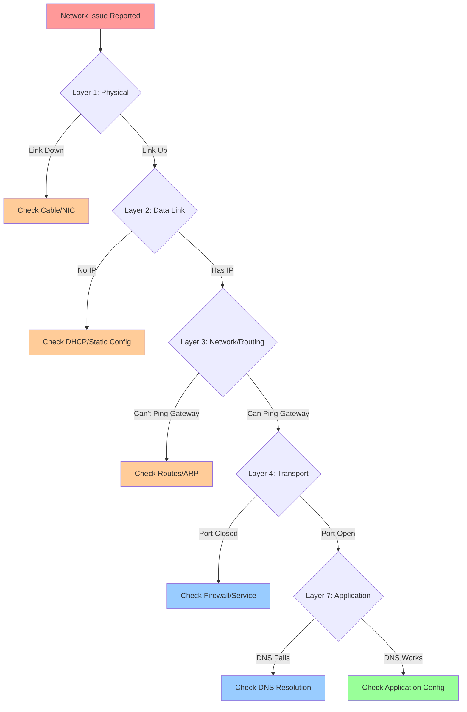

# Playbook: Investigate Network Issues

## Overview

This playbook provides systematic steps to diagnose and resolve network connectivity, DNS, routing, firewall, and application-level network issues on Linux systems.

> [!summary] Goal
> Determine whether the issue is DNS, routing, firewall, application misconfiguration, or upstream service failure using a layered troubleshooting approach.

---

## Quick Reference: OSI Model Troubleshooting



**Troubleshooting order**:
1. **Physical/Link** → Cable, NIC, link status
2. **IP Configuration** → IP address, netmask, DHCP
3. **Routing** → Default gateway, routing table
4. **DNS** → Name resolution
5. **Firewall** → iptables, firewalld, security groups
6. **Application** → Service listening, application config

---

## Step 1: Check Basic Connectivity

### Verify Network Interface Status

```bash
# List all interfaces
ip addr show
# OR
ip a

# Output:
# 1: lo: <LOOPBACK,UP,LOWER_UP> mtu 65536
#     inet 127.0.0.1/8 scope host lo
# 2: eth0: <BROADCAST,MULTICAST,UP,LOWER_UP> mtu 1500
#     inet 192.168.1.10/24 brd 192.168.1.255 scope global eth0
#     inet6 fe80::a00:27ff:fe4e:66a1/64 scope link

# Key flags:
# UP - Interface is up
# LOWER_UP - Physical link is up (cable connected)
# NO-CARRIER - Cable disconnected

# Check specific interface
ip addr show eth0

# Bring interface up (if down)
sudo ip link set eth0 up
```

**Link status interpretation**:
- `state UP` = Interface enabled
- `LOWER_UP` = Physical connection established
- `NO-CARRIER` = Cable unplugged or no physical link

### Check IP Address Configuration

```bash
# Verify IP address assigned
ip addr show eth0 | grep inet

# Check if DHCP or static
cat /etc/network/interfaces  # Debian/Ubuntu
cat /etc/sysconfig/network-scripts/ifcfg-eth0  # RHEL/CentOS
cat /etc/netplan/*.yaml  # Ubuntu 18.04+

# Renew DHCP lease
sudo dhclient -r eth0  # Release
sudo dhclient eth0     # Renew

# Or with nmcli (NetworkManager)
nmcli device status
nmcli connection show
```

---

## Step 2: Test Network Layer Connectivity

### Ping Local Gateway

```bash
# Check routing table
ip route show
# Output:
# default via 192.168.1.1 dev eth0 proto dhcp metric 100
# 192.168.1.0/24 dev eth0 proto kernel scope link src 192.168.1.10

# Extract default gateway
ip route | grep default | awk '{print $3}'

# Ping gateway
ping -c 4 192.168.1.1

# If ping fails:
# - Check ARP table: ip neigh show
# - Check if gateway is correct
# - Check firewall blocking ICMP
```

**Ping results**:
- `0% packet loss` → Good connectivity
- `100% packet loss` → No connectivity (routing/firewall issue)
- `Destination Host Unreachable` → No route
- `Network is unreachable` → No default route

### Ping External IP (Skip DNS)

```bash
# Ping a public IP (Google DNS, Cloudflare DNS)
ping -c 4 8.8.8.8
ping -c 4 1.1.1.1

# If this works but domain pings fail → DNS issue
# If this fails → routing or upstream connectivity issue
```

### Check Routing Table

```bash
# Show routing table
ip route show

# Add default route if missing
sudo ip route add default via 192.168.1.1 dev eth0

# Delete incorrect route
sudo ip route del default via 192.168.1.1

# Check route to specific destination
ip route get 8.8.8.8
```

---

## Step 3: Investigate DNS Issues

### Test DNS Resolution

```bash
# Check DNS servers
cat /etc/resolv.conf
# Output:
# nameserver 8.8.8.8
# nameserver 1.1.1.1

# Test DNS resolution
nslookup google.com
dig google.com
host google.com

# Or using getent (respects /etc/nsswitch.conf)
getent hosts google.com

# Test specific DNS server
nslookup google.com 8.8.8.8
dig @8.8.8.8 google.com
```

**Common DNS issues**:
- **No nameserver in /etc/resolv.conf** → Add manually or check DHCP
- **Wrong nameserver** → Change to `8.8.8.8` or `1.1.1.1`
- **DNS timeout** → Firewall blocking port 53 or DNS server down
- **NXDOMAIN** → Domain doesn't exist or typo

### Diagnose DNS Problems

```bash
# Check if DNS port 53 is reachable
nc -vz 8.8.8.8 53
# OR
telnet 8.8.8.8 53

# Trace DNS query
dig +trace google.com

# Check local DNS cache (systemd-resolved)
systemd-resolve --status
resolvectl status

# Flush DNS cache
sudo systemd-resolve --flush-caches
# OR
sudo resolvectl flush-caches

# Test with different DNS servers
dig @8.8.8.8 google.com       # Google
dig @1.1.1.1 google.com       # Cloudflare
dig @9.9.9.9 google.com       # Quad9
```

### Fix DNS Issues

```bash
# Temporary fix: Set DNS servers manually
# /etc/resolv.conf
nameserver 8.8.8.8
nameserver 1.1.1.1

# Make persistent (Ubuntu with systemd-resolved)
# /etc/systemd/resolved.conf
[Resolve]
DNS=8.8.8.8 1.1.1.1
FallbackDNS=9.9.9.9

sudo systemctl restart systemd-resolved

# Or with NetworkManager
nmcli connection modify eth0 ipv4.dns "8.8.8.8 1.1.1.1"
nmcli connection up eth0
```

---

## Step 4: Check Firewall and Ports

### Check if Port is Listening

```bash
# Show listening ports
sudo ss -tulpen
# OR
sudo netstat -tulpen

# Columns:
# t - TCP
# u - UDP
# l - Listening
# p - Process name
# e - Extended info
# n - Numeric (don't resolve names)

# Check specific port
sudo ss -tulpen | grep :80
sudo ss -tulpen | grep :443

# Example output:
# tcp   LISTEN  0  128  0.0.0.0:80   0.0.0.0:*   users:(("nginx",pid=1234,fd=6))
```

**Service not listening**:
- Service not started: `sudo systemctl start myservice`
- Bound to localhost only: Check config (`listen 127.0.0.1:80` vs `listen 0.0.0.0:80`)
- Wrong port: Check application configuration

### Test Port Connectivity

```bash
# Test TCP port connectivity
nc -vz example.com 443
# OR
telnet example.com 443

# Test from specific source port
nc -vz -p 12345 example.com 443

# Scan multiple ports
nc -vz example.com 80 443 22

# Using nmap (if installed)
nmap -p 80,443 example.com
```

### Check Firewall Rules

```bash
# iptables
sudo iptables -L -n -v
sudo iptables -L INPUT -n -v
sudo iptables -L OUTPUT -n -v

# Check specific port
sudo iptables -L -n | grep 80

# firewalld (RHEL/CentOS)
sudo firewall-cmd --list-all
sudo firewall-cmd --list-ports

# ufw (Ubuntu)
sudo ufw status verbose

# Check if firewall is blocking
sudo iptables -I INPUT -p tcp --dport 80 -j ACCEPT  # Temporary test
```

**Common firewall issues**:
- **Port blocked** → Add firewall rule
- **Wrong interface** → Rule applied to wrong NIC
- **Order matters** → REJECT/DROP rule before ACCEPT

---

## Step 5: Trace Network Path

### Traceroute to Destination

```bash
# Trace route to destination
traceroute google.com
# OR
traceroute -n google.com  # No DNS resolution (faster)

# TCP traceroute (if ICMP blocked)
sudo traceroute -T -p 443 google.com

# Output interpretation:
#  1  192.168.1.1 (gateway)     1.234 ms
#  2  10.0.0.1 (ISP router)     5.678 ms
#  3  * * *  (timeout - firewall blocking)
#  4  8.8.8.8 (destination)    15.234 ms

# * * * = Packet dropped or ICMP blocked
```

### MTU Path Discovery

```bash
# Test MTU (Maximum Transmission Unit)
# Don't fragment (-M do), test with large packet
ping -c 4 -M do -s 1472 google.com

# If "Frag needed" error, reduce packet size
ping -c 4 -M do -s 1400 google.com

# Find optimal MTU
for size in 1500 1400 1300 1200; do
  echo "Testing MTU: $size"
  ping -c 2 -M do -s $((size - 28)) google.com && break
done
```

**MTU issues**:
- VPN tunnels often require lower MTU (1400 or less)
- Jumbo frames (9000) on local network

---

## Step 6: Packet Capture and Analysis

### Capture Traffic with tcpdump

```bash
# Capture on interface eth0
sudo tcpdump -i eth0

# Capture specific host
sudo tcpdump -i eth0 host 192.168.1.10

# Capture specific port
sudo tcpdump -i eth0 port 80

# Capture and save to file
sudo tcpdump -i eth0 -w capture.pcap

# Read capture file
tcpdump -r capture.pcap

# Filter HTTP traffic
sudo tcpdump -i eth0 -A port 80 | grep -E "GET|POST|Host:"
```

**Common tcpdump filters**:
```bash
# TCP SYN packets (connection attempts)
sudo tcpdump -i eth0 'tcp[tcpflags] & tcp-syn != 0'

# DNS queries
sudo tcpdump -i eth0 port 53

# ICMP (ping)
sudo tcpdump -i eth0 icmp

# Exclude SSH (reduce noise)
sudo tcpdump -i eth0 not port 22
```

### Analyze Packets

```bash
# HTTP request/response
sudo tcpdump -i eth0 -A -s 0 port 80

# TCP handshake (SYN, SYN-ACK, ACK)
sudo tcpdump -i eth0 -nn port 80

# Look for:
# - SYN sent, no SYN-ACK → Port filtered/closed
# - SYN-ACK received, no data → Application issue
# - RST packets → Connection refused
```

---

## Step 7: Application-Specific Checks

### Web Server (nginx/Apache)

```bash
# Check if listening
sudo ss -tulpen | grep :80

# Test locally
curl http://localhost
curl -I http://localhost  # Headers only

# Check configuration
sudo nginx -t
sudo apachectl configtest

# Check logs
sudo tail -f /var/log/nginx/error.log
sudo tail -f /var/log/apache2/error.log

# Common issues:
# - Bound to 127.0.0.1 instead of 0.0.0.0
# - Firewall blocking port 80/443
# - SELinux blocking (RHEL/CentOS)
```

### SSH

```bash
# Test SSH connectivity
ssh -v user@host
# -v: Verbose (shows connection steps)

# Common issues:
# - Port 22 blocked by firewall
# - SSH service not running
# - Wrong SSH key or permissions
# - /etc/hosts.allow or /etc/hosts.deny blocking

# Check SSH service
sudo systemctl status sshd

# Check SSH logs
sudo tail -f /var/log/auth.log  # Debian/Ubuntu
sudo tail -f /var/log/secure    # RHEL/CentOS
```

### Database (MySQL/PostgreSQL)

```bash
# Check if database is listening
sudo ss -tulpen | grep :3306  # MySQL
sudo ss -tulpen | grep :5432  # PostgreSQL

# Test connection
mysql -h 192.168.1.10 -u user -p
psql -h 192.168.1.10 -U user -d database

# Common issues:
# - bind-address = 127.0.0.1 (only localhost)
# - Firewall blocking port
# - User not allowed from remote host

# MySQL: Allow remote connections
# /etc/mysql/my.cnf
bind-address = 0.0.0.0

# Grant remote access
GRANT ALL ON database.* TO 'user'@'%' IDENTIFIED BY 'password';
```

---

## Step 8: Common Scenarios and Solutions

### Scenario 1: Can Ping IP but Not Domain

**Diagnosis**: DNS resolution failure

**Actions**:
```bash
# 1. Verify DNS servers
cat /etc/resolv.conf

# 2. Test DNS
dig google.com
nslookup google.com

# 3. Fix: Add public DNS
echo "nameserver 8.8.8.8" | sudo tee /etc/resolv.conf

# 4. Make permanent
# Edit /etc/systemd/resolved.conf or NetworkManager config
```

### Scenario 2: Connection Times Out

**Diagnosis**: Firewall blocking or service not listening

**Actions**:
```bash
# 1. Check if service is listening
sudo ss -tulpen | grep :PORT

# 2. Test locally (bypasses firewall)
curl http://localhost:PORT

# 3. Check firewall
sudo iptables -L -n | grep PORT

# 4. Add firewall rule
sudo iptables -I INPUT -p tcp --dport PORT -j ACCEPT

# 5. Make permanent (iptables-persistent or firewall-cmd)
```

### Scenario 3: Connection Refused

**Diagnosis**: Port is closed (service not running or wrong port)

**Actions**:
```bash
# 1. Verify service is running
sudo systemctl status myservice

# 2. Check if listening on correct port
sudo ss -tulpen | grep myservice

# 3. Start service if stopped
sudo systemctl start myservice

# 4. Check application configuration for port number
```

### Scenario 4: Slow Network Performance

**Diagnosis**: Latency, packet loss, or bandwidth issue

**Actions**:
```bash
# 1. Check latency
ping -c 100 google.com
# Look for high avg/max latency or packet loss

# 2. Check bandwidth
# Install iperf3
# Server: iperf3 -s
# Client: iperf3 -c SERVER_IP

# 3. Check for errors/drops
ip -s link show eth0
# Look for RX/TX errors, dropped packets

# 4. Check MTU issues
ping -c 4 -M do -s 1472 google.com

# 5. Check for network congestion
sar -n DEV 1 10  # Network stats
```

### Scenario 5: Intermittent Connectivity

**Diagnosis**: Flapping link, ARP issues, or DNS caching

**Actions**:
```bash
# 1. Monitor link status
watch -n 1 'ip link show eth0 | grep state'

# 2. Check for physical errors
ethtool -S eth0 | grep -i error

# 3. Clear ARP cache
sudo ip neigh flush all

# 4. Monitor DNS resolution
watch -n 5 'dig google.com +short'

# 5. Check system logs
journalctl -u NetworkManager -f
dmesg -T -w | grep eth0
```

---

## Step 9: Advanced Troubleshooting

### Check Network Performance

```bash
# Interface statistics
ip -s link show eth0

# Detailed statistics
ethtool -S eth0

# Network throughput over time
sar -n DEV 1 10

# Check for packet drops
netstat -i
# Look for RX-DRP and TX-DRP columns
```

### SELinux Issues (RHEL/CentOS)

```bash
# Check if SELinux is blocking
sudo ausearch -m avc -ts recent

# Temporarily disable SELinux (testing only)
sudo setenforce 0

# Check SELinux context
ls -Z /etc/nginx/nginx.conf

# Restore context
sudo restorecon -R /etc/nginx
```

### IPv6 vs IPv4

```bash
# Disable IPv6 temporarily (if causing issues)
sudo sysctl -w net.ipv6.conf.all.disable_ipv6=1

# Prefer IPv4 over IPv6
echo "precedence ::ffff:0:0/96  100" | sudo tee -a /etc/gai.conf

# Test IPv4 specifically
curl -4 http://example.com

# Test IPv6 specifically
curl -6 http://example.com
```

---

## Step 10: Documentation and Prevention

### Document Network Configuration

```bash
# Gather network info
ip addr show > network-config.txt
ip route show >> network-config.txt
cat /etc/resolv.conf >> network-config.txt
sudo iptables -L -n -v >> network-config.txt
```

### Set Up Monitoring

```bash
# Simple connectivity check
#!/bin/bash
HOST="8.8.8.8"
ping -c 3 $HOST > /dev/null 2>&1
if [ $? -ne 0 ]; then
  echo "Network down!" | mail -s "Network Alert" admin@example.com
fi

# Add to cron (every 5 minutes)
*/5 * * * * /usr/local/bin/network-check.sh
```

**Production monitoring**:
- Monitor interface status: `node_network_up`
- Monitor packet loss: `node_network_receive_drop_total`
- Monitor DNS resolution time
- Alert on link down or high packet loss

---

## Verification Checklist

```bash
# Layer 1: Physical
[ ] ip link show eth0  # State UP, LOWER_UP

# Layer 2: Data Link
[ ] ip addr show eth0  # Has IP address

# Layer 3: Network
[ ] ping -c 4 192.168.1.1  # Gateway reachable
[ ] ping -c 4 8.8.8.8  # External IP reachable

# Layer 4: DNS
[ ] dig google.com  # DNS resolution works

# Layer 5: Transport
[ ] nc -vz example.com 443  # Port reachable

# Layer 6: Application
[ ] curl http://example.com  # Application responds
```

---

## Documentation Template

```markdown
## Incident Report: Network Connectivity Issue

**Date**: 2026-04-26 18:00 UTC
**Severity**: High
**Duration**: 45 minutes

### Symptoms
- Unable to resolve domain names
- "Temporary failure in name resolution" errors
- Web requests timing out

### Root Cause
- /etc/resolv.conf empty after system update
- systemd-resolved not configured with DNS servers

### Investigation Steps
1. Tested ping 8.8.8.8: Success
2. Tested ping google.com: Failed (DNS issue)
3. Checked /etc/resolv.conf: Empty
4. Checked systemd-resolved status: No DNS servers configured

### Resolution
1. Added DNS servers to /etc/systemd/resolved.conf
2. Restarted systemd-resolved
3. Verified DNS resolution working

### Prevention
- Pin systemd-resolved configuration
- Monitor DNS resolution success rate
- Document DNS configuration in runbook
```

---

## Related Notes

- [[04_SSH_and_Remote_Access]] - SSH troubleshooting
- [[03_Networking_Tools]] - Network utilities
- [[01_Investigate_High_CPU_or_Load]] - Performance troubleshooting

---

> [!tip] Best Practices
> 1. **Follow OSI model**: Start at lower layers (physical/link) before checking application
> 2. **Test with IP first**: Eliminate DNS as variable
> 3. **Check locally first**: `curl localhost` before testing remote access
> 4. **Use tcpdump sparingly**: High overhead, use only when needed
> 5. **Document baseline**: Know normal network config before issues arise
> 6. **Check both directions**: Client → server AND server → client
> 7. **Verify firewall rules**: On both client and server
> 8. **Test from multiple locations**: Rule out local network issues
> 9. **Check logs**: Application logs often show network errors
> 10. **Keep tools handy**: Install tcpdump, nc, dig, nmap in advance

> [!warning] Common Pitfalls
> - Assuming DNS is working (always test with IP first)
> - Forgetting to check if service is listening on correct interface (0.0.0.0 vs 127.0.0.1)
> - Not checking firewall on both ends
> - Confusing "connection refused" (port closed) with "timeout" (firewall blocking)
> - Overlooking MTU issues on VPN/tunnels
> - Not checking SELinux/AppArmor blocking network access
> - Forgetting to make firewall rules persistent
> - Testing with ping when ICMP is blocked (use TCP instead)
> - Not verifying DNS servers are actually reachable (ping 8.8.8.8)
> - Assuming /etc/resolv.conf is permanent (can be overwritten by DHCP/NetworkManager)

## Network Troubleshooting Cheat Sheet

```bash
# Quick diagnostic commands
ip addr                      # IP addresses
ip route                     # Routing table
ip neigh                     # ARP table
ss -tulpen                   # Listening ports
ping -c 4 8.8.8.8           # Test connectivity
dig google.com              # Test DNS
nc -vz host 443             # Test port
traceroute google.com       # Trace route
tcpdump -i eth0 port 80     # Capture traffic

# Common fixes
sudo systemctl restart NetworkManager
sudo dhclient -r eth0 && sudo dhclient eth0
sudo ip link set eth0 up
echo "nameserver 8.8.8.8" | sudo tee /etc/resolv.conf
sudo iptables -I INPUT -p tcp --dport 80 -j ACCEPT
```
