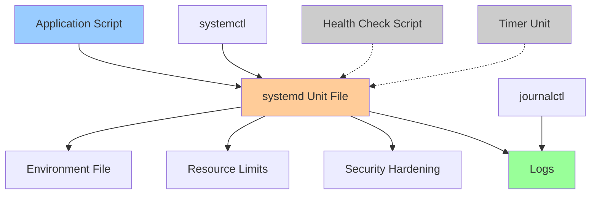

# Project: Build a Minimal Service With systemd

## Overview

This hands-on project teaches you to create, configure, and manage a production-ready systemd service from scratch. You'll learn unit files, logging, restart policies, environment management, resource constraints, and security hardening.

> [!summary] Goal
> Build a robust systemd service with proper logging, automatic restarts, resource limits, and security best practices.

---

## Project Architecture



---

## Part 1: Create the Application

### Option 1: Simple Python Web Server

Create a basic HTTP server that serves metrics:

```bash
# Create application directory
sudo mkdir -p /opt/myapp
cd /opt/myapp

# Create the application
sudo tee /opt/myapp/server.py > /dev/null << 'EOF'
#!/usr/bin/env python3
"""
Simple HTTP server with metrics endpoint
"""
import http.server
import socketserver
import os
import time
from datetime import datetime

PORT = int(os.getenv('PORT', 8080))
start_time = time.time()
request_count = 0

class MetricsHandler(http.server.SimpleHTTPRequestHandler):
    def do_GET(self):
        global request_count
        request_count += 1
        
        if self.path == '/':
            self.send_response(200)
            self.send_header('Content-type', 'text/html')
            self.end_headers()
            self.wfile.write(b"<h1>MyApp Service</h1><p>Visit /metrics for stats</p>")
        
        elif self.path == '/metrics':
            uptime = time.time() - start_time
            metrics = f"""# Metrics
uptime_seconds {uptime:.2f}
request_count {request_count}
timestamp {datetime.now().isoformat()}
"""
            self.send_response(200)
            self.send_header('Content-type', 'text/plain')
            self.end_headers()
            self.wfile.write(metrics.encode())
        
        elif self.path == '/health':
            self.send_response(200)
            self.send_header('Content-type', 'text/plain')
            self.end_headers()
            self.wfile.write(b"OK")
        
        else:
            self.send_error(404, "Not Found")
        
        print(f"{datetime.now().isoformat()} - {self.command} {self.path} - {request_count}")

if __name__ == '__main__':
    with socketserver.TCPServer(("", PORT), MetricsHandler) as httpd:
        print(f"Server starting on port {PORT}")
        try:
            httpd.serve_forever()
        except KeyboardInterrupt:
            print("\nShutting down...")
            httpd.shutdown()
EOF

# Make executable
sudo chmod +x /opt/myapp/server.py

# Test it works
/opt/myapp/server.py
# Visit http://localhost:8080 in another terminal
# Ctrl+C to stop
```

### Option 2: Bash Background Worker

Create a worker that processes tasks:

```bash
sudo tee /opt/myapp/worker.sh > /dev/null << 'EOF'
#!/bin/bash
set -euo pipefail

# Load configuration from environment
INTERVAL="${CHECK_INTERVAL:-10}"
LOG_FILE="${LOG_FILE:-/var/log/myapp/worker.log}"

echo "Worker starting (interval: ${INTERVAL}s)" | tee -a "$LOG_FILE"

# Cleanup on exit
trap 'echo "Worker shutting down" | tee -a "$LOG_FILE"; exit 0' SIGTERM SIGINT

# Main loop
while true; do
    timestamp=$(date -Iseconds)
    
    # Simulate work (replace with actual task)
    echo "$timestamp - Processing batch..." | tee -a "$LOG_FILE"
    
    # Example: Check disk space
    disk_usage=$(df -h / | awk 'NR==2 {print $5}')
    echo "$timestamp - Disk usage: $disk_usage" | tee -a "$LOG_FILE"
    
    # Sleep (interruptible for clean shutdown)
    sleep "$INTERVAL" &
    wait $!
done
EOF

sudo chmod +x /opt/myapp/worker.sh

# Create log directory
sudo mkdir -p /var/log/myapp
```

---

## Part 2: Create systemd Unit File

### Basic Service Unit

```bash
sudo tee /etc/systemd/system/myapp.service > /dev/null << 'EOF'
[Unit]
Description=MyApp Service - Demo systemd Service
Documentation=https://github.com/yourorg/myapp
After=network-online.target
Wants=network-online.target

[Service]
Type=simple
User=myapp
Group=myapp
WorkingDirectory=/opt/myapp

# The command to run
ExecStart=/opt/myapp/server.py
# OR for bash worker:
# ExecStart=/opt/myapp/worker.sh

# Restart policy
Restart=on-failure
RestartSec=10s

# Load environment from file
EnvironmentFile=-/etc/default/myapp

# Resource constraints
MemoryMax=512M
MemoryHigh=400M
CPUQuota=100%

# Security hardening
NoNewPrivileges=true
PrivateTmp=true
ProtectSystem=strict
ProtectHome=true
ReadWritePaths=/var/log/myapp

# Logging
StandardOutput=journal
StandardError=journal
SyslogIdentifier=myapp

[Install]
WantedBy=multi-user.target
EOF
```

### Create Dedicated User

```bash
# Create system user (no login shell, no home directory)
sudo useradd --system --no-create-home --shell /usr/sbin/nologin myapp

# Set ownership
sudo chown -R myapp:myapp /opt/myapp
sudo chown -R myapp:myapp /var/log/myapp
```

### Create Environment File

```bash
sudo tee /etc/default/myapp > /dev/null << 'EOF'
# MyApp Configuration
PORT=8080
CHECK_INTERVAL=30
LOG_LEVEL=info
EOF

# Secure the file (may contain secrets)
sudo chmod 640 /etc/default/myapp
sudo chown root:myapp /etc/default/myapp
```

---

## Part 3: Enable and Start Service

### Load and Start

```bash
# Reload systemd to recognize new unit
sudo systemctl daemon-reload

# Check syntax (shows any errors)
sudo systemctl cat myapp.service

# Start the service
sudo systemctl start myapp

# Check status
sudo systemctl status myapp

# Enable on boot
sudo systemctl enable myapp

# Verify it's enabled
sudo systemctl is-enabled myapp
```

### Test the Service

```bash
# Check if it's running
sudo systemctl is-active myapp

# Test the endpoint (if HTTP server)
curl http://localhost:8080/
curl http://localhost:8080/metrics
curl http://localhost:8080/health

# Check logs
sudo journalctl -u myapp -f

# Check resource usage
systemctl show myapp --property=MemoryCurrent,CPUUsageNSec
```

---

## Part 4: Test Restart Behavior

### Crash the Service

```bash
# Find process PID
sudo systemctl status myapp | grep "Main PID"

# Kill it
sudo kill -9 <PID>

# Watch it restart automatically
watch -n 1 'sudo systemctl status myapp'

# Check logs for restart
sudo journalctl -u myapp -n 50
```

### Modify Restart Policy

```bash
# Edit the service
sudo systemctl edit myapp --full

# Try different restart policies:
# Restart=no           - Never restart
# Restart=on-failure   - Only on non-zero exit code
# Restart=on-abnormal  - Only on crash/signal
# Restart=always       - Always restart (even on clean exit)

# Example: Add restart limit
[Service]
Restart=on-failure
StartLimitBurst=5
StartLimitIntervalSec=60
# If it fails 5 times in 60 seconds, stop trying

# Reload and test
sudo systemctl daemon-reload
sudo systemctl restart myapp
```

---

## Part 5: Resource Limits

### Add Memory Limit

```bash
sudo systemctl edit myapp --full

# Add/modify in [Service] section:
[Service]
MemoryMax=256M          # Hard limit (OOM if exceeded)
MemoryHigh=200M         # Soft limit (throttle if exceeded)
MemorySwapMax=0         # Disable swap for this service

# Reload
sudo systemctl daemon-reload
sudo systemctl restart myapp

# Verify limits are applied
systemctl show myapp | grep Memory

# Monitor memory usage
watch -n 2 'systemctl status myapp | grep Memory'
```

### Add CPU Limit

```bash
[Service]
CPUQuota=50%            # Limit to 50% of one CPU core
CPUWeight=500           # Relative weight (1-10000, default 100)

# Multiple cores: CPUQuota=200% = 2 full cores

# Reload and verify
sudo systemctl daemon-reload
sudo systemctl restart myapp
systemctl show myapp | grep CPU
```

### Add I/O Limit

```bash
[Service]
IOWeight=500            # I/O priority (1-10000, default 100)
IOReadBandwidthMax=/var/log 10M   # Max 10MB/s read
IOWriteBandwidthMax=/var/log 5M   # Max 5MB/s write

# Verify
systemctl show myapp | grep IO
```

---

## Part 6: Security Hardening

### Apply Security Restrictions

```bash
sudo systemctl edit myapp --full

# Add in [Service] section:
[Service]
# Prevent privilege escalation
NoNewPrivileges=true

# Filesystem isolation
PrivateTmp=true                    # Private /tmp
ProtectSystem=strict               # Read-only /usr, /boot, /efi
ProtectHome=true                   # Inaccessible /home
ReadWritePaths=/var/log/myapp      # Exceptions for write access

# Kernel protections
ProtectKernelTunables=true         # Read-only /proc/sys, /sys
ProtectKernelModules=true          # Can't load kernel modules
ProtectKernelLogs=true             # Can't access kernel logs
ProtectControlGroups=true          # Read-only cgroups

# Network restrictions (if service doesn't need network)
# PrivateNetwork=true              # Network namespace isolation

# Capability dropping
CapabilityBoundingSet=~CAP_SYS_ADMIN
AmbientCapabilities=

# System call filtering
SystemCallFilter=@system-service
SystemCallFilter=~@privileged @resources

# Reload
sudo systemctl daemon-reload
sudo systemctl restart myapp
```

### Analyze Security

```bash
# Check security score
systemd-analyze security myapp

# Output shows:
# - Overall exposure level (SAFE/MEDIUM/UNSAFE/DANGEROUS)
# - Individual security settings and scores
# - Suggestions for improvement

# Aim for SAFE or MEDIUM exposure
```

---

## Part 7: Logging and Monitoring

### View Logs

```bash
# Follow logs in real-time
sudo journalctl -u myapp -f

# Last 50 lines
sudo journalctl -u myapp -n 50

# Since specific time
sudo journalctl -u myapp --since "2026-04-26 14:00"
sudo journalctl -u myapp --since "1 hour ago"

# With timestamps
sudo journalctl -u myapp -o short-iso

# Only errors
sudo journalctl -u myapp -p err

# Export to file
sudo journalctl -u myapp > myapp.log
```

### Configure Log Retention

```bash
# Configure journald
# /etc/systemd/journald.conf
[Journal]
SystemMaxUse=500M       # Max disk space for all logs
MaxRetentionSec=7day    # Keep logs for 7 days
MaxFileSec=1day         # Rotate daily

# Restart journald
sudo systemctl restart systemd-journald

# Verify journal size
journalctl --disk-usage
```

### Application-Specific Logging

```bash
# If service writes to custom log file
# Add log rotation
sudo tee /etc/logrotate.d/myapp > /dev/null << 'EOF'
/var/log/myapp/*.log {
    daily
    rotate 7
    compress
    delaycompress
    missingok
    notifempty
    create 0640 myapp myapp
    postrotate
        systemctl reload myapp
    endscript
}
EOF

# Test logrotate
sudo logrotate -d /etc/logrotate.d/myapp
```

---

## Part 8: Health Check (Stretch Goal)

### Create Health Check Script

```bash
sudo tee /opt/myapp/healthcheck.sh > /dev/null << 'EOF'
#!/bin/bash
set -euo pipefail

# Check if service responds
if curl -f -s http://localhost:8080/health > /dev/null 2>&1; then
    echo "Health check: OK"
    exit 0
else
    echo "Health check: FAILED"
    exit 1
fi
EOF

sudo chmod +x /opt/myapp/healthcheck.sh
```

### Add to systemd Unit

```bash
sudo systemctl edit myapp --full

# Add in [Service] section:
[Service]
# Health check every 30 seconds
ExecStartPost=/bin/sleep 5
ExecReload=/opt/myapp/healthcheck.sh

# Or use a separate timer (see next section)
```

---

## Part 9: Timer Unit (Stretch Goal)

### Create Health Check Timer

```bash
# Create timer unit
sudo tee /etc/systemd/system/myapp-healthcheck.timer > /dev/null << 'EOF'
[Unit]
Description=MyApp Health Check Timer
Requires=myapp.service
After=myapp.service

[Timer]
OnActiveSec=30s          # First check after 30s
OnUnitActiveSec=1min     # Then every 1 minute
AccuracySec=5s           # Coalesce within 5 seconds

[Install]
WantedBy=timers.target
EOF

# Create service unit for health check
sudo tee /etc/systemd/system/myapp-healthcheck.service > /dev/null << 'EOF'
[Unit]
Description=MyApp Health Check
Requires=myapp.service

[Service]
Type=oneshot
ExecStart=/opt/myapp/healthcheck.sh
User=myapp
StandardOutput=journal
StandardError=journal
EOF

# Enable and start timer
sudo systemctl daemon-reload
sudo systemctl enable myapp-healthcheck.timer
sudo systemctl start myapp-healthcheck.timer

# Check timer status
sudo systemctl status myapp-healthcheck.timer
sudo systemctl list-timers myapp-healthcheck.timer
```

---

## Part 10: Testing and Validation

### Comprehensive Test Suite

```bash
#!/bin/bash
# test-myapp.sh

set -euo pipefail

echo "=== Testing MyApp Service ==="

# 1. Service is running
echo "Test 1: Service is active"
sudo systemctl is-active --quiet myapp && echo "✓ PASS" || echo "✗ FAIL"

# 2. Service is enabled
echo "Test 2: Service is enabled"
sudo systemctl is-enabled --quiet myapp && echo "✓ PASS" || echo "✗ FAIL"

# 3. HTTP endpoint responds
echo "Test 3: HTTP endpoint"
curl -f -s http://localhost:8080/health > /dev/null && echo "✓ PASS" || echo "✗ FAIL"

# 4. Metrics endpoint
echo "Test 4: Metrics endpoint"
curl -s http://localhost:8080/metrics | grep -q uptime_seconds && echo "✓ PASS" || echo "✗ FAIL"

# 5. Logs are being written
echo "Test 5: Logging"
sudo journalctl -u myapp -n 1 --quiet && echo "✓ PASS" || echo "✗ FAIL"

# 6. Resource limits applied
echo "Test 6: Memory limit"
limit=$(systemctl show myapp --property=MemoryMax --value)
[[ "$limit" != "infinity" ]] && echo "✓ PASS (Limit: $limit)" || echo "✗ FAIL"

# 7. Running as correct user
echo "Test 7: User isolation"
pid=$(systemctl show myapp --property=MainPID --value)
user=$(ps -o user= -p "$pid")
[[ "$user" == "myapp" ]] && echo "✓ PASS" || echo "✗ FAIL (User: $user)"

# 8. Restart on failure
echo "Test 8: Auto-restart"
sudo kill -9 "$(systemctl show myapp --property=MainPID --value)"
sleep 3
sudo systemctl is-active --quiet myapp && echo "✓ PASS" || echo "✗ FAIL"

echo "=== Tests Complete ==="
```

---

## Troubleshooting

### Service Won't Start

```bash
# Check status for errors
sudo systemctl status myapp

# View detailed logs
sudo journalctl -u myapp -n 50

# Common issues:
# 1. Permission denied → Check file ownership/permissions
# 2. Port already in use → Change PORT in /etc/default/myapp
# 3. Missing dependency → Check After= in [Unit]
# 4. Syntax error in unit → systemctl cat myapp.service

# Test script manually
sudo -u myapp /opt/myapp/server.py
```

### Service Keeps Restarting

```bash
# Check logs for crash reason
sudo journalctl -u myapp -f

# Check restart count
systemctl show myapp --property=NRestarts

# Disable auto-restart temporarily
sudo systemctl edit myapp --full
# Set: Restart=no

# Debug the application
sudo -u myapp /opt/myapp/server.py
```

### Resource Limit Issues

```bash
# Check if hitting limits
systemctl status myapp | grep -i memory
systemctl status myapp | grep -i cpu

# Increase limits
sudo systemctl edit myapp --full
# Adjust MemoryMax, CPUQuota

# Monitor resource usage
watch -n 1 'systemctl status myapp | grep -E "Memory|CPU"'
```

---

## Project Completion Checklist

- [ ] Application script created and executable
- [ ] Dedicated system user created
- [ ] systemd unit file created with all sections
- [ ] Environment file created with config
- [ ] Service starts successfully
- [ ] Service enabled for boot
- [ ] Restart policy tested (kill and verify auto-restart)
- [ ] Resource limits configured and verified
- [ ] Security hardening applied (systemd-analyze security)
- [ ] Logging configured (journald and/or logrotate)
- [ ] Health check script created (stretch)
- [ ] Timer unit for health checks (stretch)
- [ ] All tests passing

---

## Advanced Extensions

### 1. Socket Activation

```bash
# Create socket unit
sudo tee /etc/systemd/system/myapp.socket > /dev/null << 'EOF'
[Unit]
Description=MyApp Socket

[Socket]
ListenStream=8080
Accept=no

[Install]
WantedBy=sockets.target
EOF

# Modify service to accept socket
[Service]
ExecStart=/opt/myapp/server.py --systemd-socket

# Service starts only when connection received
```

### 2. Multi-Instance Services

```bash
# Create template unit: myapp@.service
[Unit]
Description=MyApp Instance %i

[Service]
EnvironmentFile=/etc/default/myapp-%i
ExecStart=/opt/myapp/server.py

# Start multiple instances
sudo systemctl start myapp@instance1
sudo systemctl start myapp@instance2
```

### 3. Dependency Management

```bash
[Unit]
Requires=postgresql.service    # Fail if postgres fails
After=postgresql.service        # Start after postgres
Wants=redis.service            # Start redis but don't fail if it's missing
```

---

## Related Notes

- [[01_Systemd_and_Services]] - systemd fundamentals
- [[04_Security_Hardening_Basics]] - Security best practices
- [[01_Performance_Tuning_and_Profiling]] - Resource monitoring

---

> [!tip] Best Practices
> 1. **Always use a dedicated user**: Never run as root
> 2. **Apply least privilege**: Use security hardening options
> 3. **Set resource limits**: Prevent runaway processes
> 4. **Use environment files**: Separate config from code
> 5. **Implement health checks**: Detect silent failures
> 6. **Log to journald**: Centralized logging with systemctl
> 7. **Test restart behavior**: Verify service recovers from crashes
> 8. **Document dependencies**: Clear After=/Requires= directives
> 9. **Version control unit files**: Track configuration changes
> 10. **Run systemd-analyze security**: Aim for SAFE/MEDIUM

> [!question]- Interview Questions
> **Q: What's the difference between Restart=always and Restart=on-failure?**
> A: `Restart=always` restarts even on clean exit (exit 0), useful for workers. `Restart=on-failure` only restarts on crashes or non-zero exit codes, better for services that should stay down when stopped intentionally.
> 
> **Q: How do you debug a service that fails to start?**
> A: 1. `systemctl status myapp` for overview, 2. `journalctl -u myapp -n 50` for logs, 3. Test script manually as service user: `sudo -u myapp /path/to/script`, 4. Check `systemctl cat myapp` for unit file syntax.
> 
> **Q: What's the purpose of MemoryHigh vs MemoryMax?**
> A: `MemoryHigh` is a soft limit - process is throttled (slowed down) if exceeded. `MemoryMax` is a hard limit - process is killed by OOM if exceeded. Use both: MemoryHigh for early warning, MemoryMax as safety net.
> 
> **Q: How do you prevent a service from being killed by the OOM killer?**
> A: Set `OOMScoreAdjust=-1000` in the service unit (never kill) or lower values to reduce likelihood. But better: set `MemoryMax` to limit memory usage and prevent OOM in the first place.
> 
> **Q: What security risks does ProtectSystem=strict mitigate?**
> A: Makes /usr, /boot, /efi read-only, preventing malicious or buggy service from modifying system binaries, libraries, or bootloader. Use `ReadWritePaths=` for legitimate write locations like /var/log.
