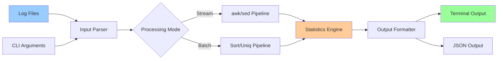

# Project: Write a Shell Tool (Log Parser)

## Overview

Build a production-ready command-line log analysis tool using shell scripting, pipes, and text processing utilities. This project reinforces core Linux skills: text processing, streaming data, performance optimization, and robust error handling.

> [!summary] Goal
> Create a CLI tool that parses web server logs to extract insights: top endpoints, latency percentiles, error rates, and traffic patterns.

---

## Project Architecture



---

## Requirements Breakdown

### Input Handling
- Read from stdin or file paths
- Support multiple files
- Handle compressed logs (gzip)
- Streaming (low memory footprint for large files)

### Output Metrics
1. **Top N endpoints** by request count
2. **P95 latency** by endpoint
3. **Error rate** (4xx/5xx status codes)
4. **Traffic timeline** (requests per hour/minute)

### Non-Functional Requirements
- Handle 10GB+ log files efficiently
- Exit code 0 on success, non-zero on error
- Help message with usage examples
- Configurable output format (text/JSON)

---

## Sample Log Format

We'll use Common Log Format (CLF) or Combined Log Format:

```
192.168.1.100 - - [26/Apr/2026:14:32:15 +0000] "GET /api/users HTTP/1.1" 200 1234 0.045
192.168.1.101 - - [26/Apr/2026:14:32:16 +0000] "POST /api/login HTTP/1.1" 401 567 0.023
192.168.1.102 - - [26/Apr/2026:14:32:17 +0000] "GET /api/users/123 HTTP/1.1" 200 890 0.067
192.168.1.103 - - [26/Apr/2026:14:32:18 +0000] "GET /api/posts HTTP/1.1" 500 45 0.012

Format:
IP - - [timestamp] "METHOD path HTTP/version" status bytes latency(seconds)
```

---

## Part 1: Project Setup

### Create Project Structure

```bash
mkdir -p log-analyzer/{bin,lib,test,data}
cd log-analyzer

# Directory structure:
# bin/          - Executable script
# lib/          - Helper functions (optional)
# test/         - Test data and test scripts
# data/         - Sample logs
# README.md     - Documentation
```

### Generate Sample Data

```bash
# Create sample log generator
cat > test/generate-logs.sh << 'EOF'
#!/bin/bash
set -euo pipefail

# Generate synthetic web server logs
num_lines=${1:-10000}
output_file=${2:-data/sample.log}

endpoints=(
    "/api/users"
    "/api/posts"
    "/api/login"
    "/api/logout"
    "/api/users/123"
    "/api/posts/456"
    "/health"
    "/metrics"
)

statuses=(200 200 200 200 201 204 301 400 401 403 404 500 502 503)

for i in $(seq 1 "$num_lines"); do
    ip="192.168.1.$((RANDOM % 256))"
    timestamp=$(date -d "@$(($(date +%s) - RANDOM % 86400))" '+%d/%b/%Y:%H:%M:%S %z')
    method="GET"
    endpoint="${endpoints[$((RANDOM % ${#endpoints[@]}))]}"
    status="${statuses[$((RANDOM % ${#statuses[@]}))]}"
    bytes=$((RANDOM % 10000 + 100))
    latency="0.$(printf '%03d' $((RANDOM % 999)))"
    
    echo "$ip - - [$timestamp] \"$method $endpoint HTTP/1.1\" $status $bytes $latency"
done > "$output_file"

echo "Generated $num_lines log entries in $output_file"
EOF

chmod +x test/generate-logs.sh

# Generate sample data
./test/generate-logs.sh 100000 data/sample.log

# Generate large file for performance testing
./test/generate-logs.sh 1000000 data/large.log

# Compress for testing gzip handling
gzip -k data/large.log
```

---

## Part 2: Build the Parser (Version 1: Basic)

### Create Main Script

```bash
cat > bin/log-analyzer << 'EOF'
#!/bin/bash
set -euo pipefail

# log-analyzer - Web server log analysis tool
# Usage: log-analyzer [OPTIONS] [FILE...]

VERSION="1.0.0"

# Default options
TOP_N=10
OUTPUT_FORMAT="text"
VERBOSE=0

# Colors for output
RED='\033[0;31m'
GREEN='\033[0;32m'
YELLOW='\033[1;33m'
BLUE='\033[0;34m'
NC='\033[0m' # No Color

#################################
# Functions
#################################

usage() {
    cat << USAGE
log-analyzer - Web server log analysis tool

Usage: log-analyzer [OPTIONS] [FILE...]

OPTIONS:
    -n NUM      Top N endpoints to show (default: 10)
    -f FORMAT   Output format: text, json (default: text)
    -v          Verbose mode
    -h          Show this help message
    --version   Show version

EXAMPLES:
    # Analyze from stdin
    cat access.log | log-analyzer

    # Analyze file
    log-analyzer access.log

    # Multiple files
    log-analyzer access.log.1 access.log.2

    # Gzipped files
    log-analyzer access.log.gz

    # Top 20 endpoints
    log-analyzer -n 20 access.log

    # JSON output
    log-analyzer -f json access.log

USAGE
}

error() {
    echo -e "${RED}ERROR: $*${NC}" >&2
    exit 1
}

log_info() {
    [[ $VERBOSE -eq 1 ]] && echo -e "${BLUE}INFO: $*${NC}" >&2
}

log_success() {
    echo -e "${GREEN}✓ $*${NC}" >&2
}

# Parse command-line arguments
parse_args() {
    while [[ $# -gt 0 ]]; do
        case $1 in
            -n)
                TOP_N="$2"
                shift 2
                ;;
            -f|--format)
                OUTPUT_FORMAT="$2"
                shift 2
                ;;
            -v|--verbose)
                VERBOSE=1
                shift
                ;;
            -h|--help)
                usage
                exit 0
                ;;
            --version)
                echo "log-analyzer version $VERSION"
                exit 0
                ;;
            -*)
                error "Unknown option: $1"
                ;;
            *)
                FILES+=("$1")
                shift
                ;;
        esac
    done
}

# Read input (from files or stdin)
read_input() {
    if [[ ${#FILES[@]} -eq 0 ]]; then
        log_info "Reading from stdin..."
        cat
    else
        for file in "${FILES[@]}"; do
            if [[ ! -f "$file" ]]; then
                error "File not found: $file"
            fi
            
            log_info "Processing: $file"
            
            # Handle compressed files
            if [[ "$file" == *.gz ]]; then
                zcat "$file"
            else
                cat "$file"
            fi
        done
    fi
}

# Analyze logs
analyze_logs() {
    local tmpdir
    tmpdir=$(mktemp -d)
    trap "rm -rf '$tmpdir'" EXIT
    
    log_info "Analyzing logs..."
    
    # Parse logs and extract fields
    # Field positions (space-separated):
    # 1: IP
    # 4-5: [timestamp]
    # 6-8: "METHOD /path HTTP/1.1"
    # 9: status
    # 10: bytes
    # 11: latency
    
    read_input | awk '
    {
        # Extract endpoint from "METHOD /path HTTP/1.1"
        if (match($0, /"[A-Z]+ ([^ ]+) HTTP/, arr)) {
            endpoint = arr[1]
        } else {
            endpoint = "unknown"
        }
        
        # Extract status code
        status = $9
        
        # Extract latency (last field)
        latency = $NF
        
        # Print: endpoint, status, latency
        print endpoint, status, latency
    }
    ' > "$tmpdir/parsed.txt"
    
    # 1. Top N endpoints by count
    log_info "Calculating top endpoints..."
    awk '{print $1}' "$tmpdir/parsed.txt" | \
        sort | uniq -c | sort -rn | head -n "$TOP_N" > "$tmpdir/top_endpoints.txt"
    
    # 2. Error rate
    log_info "Calculating error rate..."
    awk '
    {
        total++
        status = $2
        if (status >= 400 && status < 600) errors++
    }
    END {
        error_rate = (total > 0) ? (errors / total * 100) : 0
        printf "%.2f %d %d\n", error_rate, errors, total
    }
    ' "$tmpdir/parsed.txt" > "$tmpdir/error_rate.txt"
    
    # 3. P95 latency by endpoint
    log_info "Calculating P95 latency..."
    awk '{print $1, $3}' "$tmpdir/parsed.txt" | \
        sort -k1,1 | \
        awk '
        {
            endpoint = $1
            latency = $2
            latencies[endpoint] = latencies[endpoint] " " latency
            counts[endpoint]++
        }
        END {
            for (ep in latencies) {
                # Split latencies into array
                split(latencies[ep], arr, " ")
                n = counts[ep]
                
                # Sort latencies (simple bubble sort for small arrays)
                for (i = 2; i <= n; i++) {
                    for (j = i; j > 1 && arr[j] < arr[j-1]; j--) {
                        tmp = arr[j]
                        arr[j] = arr[j-1]
                        arr[j-1] = tmp
                    }
                }
                
                # Calculate P95 index
                p95_idx = int(n * 0.95)
                if (p95_idx < 1) p95_idx = 1
                
                printf "%s %.3f\n", ep, arr[p95_idx]
            }
        }
        ' | sort -k2 -rn | head -n "$TOP_N" > "$tmpdir/p95_latency.txt"
    
    # 4. Output results
    if [[ "$OUTPUT_FORMAT" == "json" ]]; then
        output_json "$tmpdir"
    else
        output_text "$tmpdir"
    fi
}

# Output in text format
output_text() {
    local tmpdir=$1
    
    echo ""
    echo "======================================"
    echo "  Log Analysis Report"
    echo "======================================"
    echo ""
    
    # Top endpoints
    echo "Top $TOP_N Endpoints by Request Count:"
    echo "--------------------------------------"
    awk '{printf "%8d  %s\n", $1, $2}' "$tmpdir/top_endpoints.txt"
    echo ""
    
    # Error rate
    read error_rate errors total < "$tmpdir/error_rate.txt"
    echo "Error Rate:"
    echo "--------------------------------------"
    printf "Total Requests: %d\n" "$total"
    printf "Errors (4xx/5xx): %d\n" "$errors"
    printf "Error Rate: %.2f%%\n" "$error_rate"
    echo ""
    
    # P95 latency
    echo "Top $TOP_N Endpoints by P95 Latency:"
    echo "--------------------------------------"
    awk '{printf "%s: %.3fs\n", $1, $2}' "$tmpdir/p95_latency.txt"
    echo ""
    
    log_success "Analysis complete"
}

# Output in JSON format
output_json() {
    local tmpdir=$1
    
    read error_rate errors total < "$tmpdir/error_rate.txt"
    
    echo "{"
    echo "  \"top_endpoints\": ["
    
    # Top endpoints
    first=1
    while read count endpoint; do
        [[ $first -eq 0 ]] && echo ","
        printf '    {"endpoint": "%s", "count": %d}' "$endpoint" "$count"
        first=0
    done < "$tmpdir/top_endpoints.txt"
    
    echo ""
    echo "  ],"
    echo "  \"error_rate\": {"
    printf '    "total_requests": %d,\n' "$total"
    printf '    "errors": %d,\n' "$errors"
    printf '    "rate_percent": %.2f\n' "$error_rate"
    echo "  },"
    echo "  \"p95_latency\": ["
    
    # P95 latency
    first=1
    while read endpoint latency; do
        [[ $first -eq 0 ]] && echo ","
        printf '    {"endpoint": "%s", "p95_latency_seconds": %.3f}' "$endpoint" "$latency"
        first=0
    done < "$tmpdir/p95_latency.txt"
    
    echo ""
    echo "  ]"
    echo "}"
}

#################################
# Main
#################################

FILES=()
parse_args "$@"

# Validate options
if ! [[ "$TOP_N" =~ ^[0-9]+$ ]]; then
    error "Invalid value for -n: $TOP_N (must be a number)"
fi

if [[ "$OUTPUT_FORMAT" != "text" && "$OUTPUT_FORMAT" != "json" ]]; then
    error "Invalid format: $OUTPUT_FORMAT (must be 'text' or 'json')"
fi

# Run analysis
analyze_logs
EOF

chmod +x bin/log-analyzer
```

---

## Part 3: Test the Parser

### Basic Tests

```bash
# Test with sample data
bin/log-analyzer data/sample.log

# Test stdin
cat data/sample.log | bin/log-analyzer

# Test gzip
bin/log-analyzer data/large.log.gz

# Test JSON output
bin/log-analyzer -f json data/sample.log

# Test top N
bin/log-analyzer -n 5 data/sample.log

# Test multiple files
bin/log-analyzer data/sample.log data/large.log
```

### Automated Test Suite

```bash
cat > test/run-tests.sh << 'EOF'
#!/bin/bash
set -euo pipefail

ANALYZER="../bin/log-analyzer"
TEST_LOG="../data/sample.log"

echo "Running log-analyzer tests..."

# Test 1: Exit code 0 on success
echo -n "Test 1: Exit code on success... "
$ANALYZER "$TEST_LOG" > /dev/null 2>&1 && echo "PASS" || echo "FAIL"

# Test 2: Exit code non-zero on missing file
echo -n "Test 2: Exit code on missing file... "
$ANALYZER /nonexistent 2>/dev/null && echo "FAIL" || echo "PASS"

# Test 3: JSON output is valid
echo -n "Test 3: JSON output validity... "
output=$($ANALYZER -f json "$TEST_LOG")
echo "$output" | python3 -m json.tool > /dev/null 2>&1 && echo "PASS" || echo "FAIL"

# Test 4: Handles stdin
echo -n "Test 4: Stdin input... "
cat "$TEST_LOG" | $ANALYZER > /dev/null 2>&1 && echo "PASS" || echo "FAIL"

# Test 5: Top N parameter works
echo -n "Test 5: Top N parameter... "
lines=$($ANALYZER -n 5 "$TEST_LOG" 2>/dev/null | grep -A 10 "Top 5 Endpoints" | grep -E "^ +[0-9]+" | wc -l)
[[ $lines -le 5 ]] && echo "PASS" || echo "FAIL"

# Test 6: Help message
echo -n "Test 6: Help message... "
$ANALYZER -h > /dev/null 2>&1 && echo "PASS" || echo "FAIL"

# Test 7: Version flag
echo -n "Test 7: Version flag... "
$ANALYZER --version > /dev/null 2>&1 && echo "PASS" || echo "FAIL"

# Test 8: Gzip support
echo -n "Test 8: Gzip file support... "
$ANALYZER ../data/large.log.gz > /dev/null 2>&1 && echo "PASS" || echo "FAIL"

echo "Tests complete"
EOF

chmod +x test/run-tests.sh

# Run tests
cd test && ./run-tests.sh
```

---

## Part 4: Performance Optimization

### Benchmark Current Version

```bash
# Benchmark script
cat > test/benchmark.sh << 'EOF'
#!/bin/bash
set -euo pipefail

ANALYZER="../bin/log-analyzer"
LOG="../data/large.log"

echo "Benchmarking log-analyzer..."
echo "File: $LOG ($(wc -l < "$LOG") lines)"
echo ""

# Test 1: Time to analyze
echo "Test 1: Processing time"
time $ANALYZER "$LOG" > /dev/null

# Test 2: Memory usage
echo ""
echo "Test 2: Memory usage"
/usr/bin/time -v $ANALYZER "$LOG" > /dev/null 2>&1 | grep "Maximum resident"
EOF

chmod +x test/benchmark.sh
```

### Optimization Techniques

**1. Use faster tools when possible:**
```bash
# Instead of:
awk '{print $1}' | sort | uniq -c | sort -rn

# Use:
awk '{count[$1]++} END {for (i in count) print count[i], i}' | sort -rn
```

**2. Avoid multiple passes:**
```bash
# Calculate all metrics in single awk pass
awk '
BEGIN { ... }
{
    # Extract fields once
    endpoint = ...
    status = ...
    latency = ...
    
    # Update all metrics
    endpoint_count[endpoint]++
    latencies[endpoint][++lat_idx[endpoint]] = latency
    total++
    if (status >= 400) errors++
}
END {
    # Output all metrics
    ...
}
'
```

**3. Use GNU parallel for large files:**
```bash
# Split processing across CPU cores
cat large.log | parallel --pipe --block 10M 'your_processing_command' | final_aggregation
```

---

## Part 5: Advanced Features

### Add Traffic Timeline

```bash
# Add to analyze_logs() function:

# 5. Requests per hour
log_info "Calculating traffic timeline..."
read_input | awk '
{
    # Extract hour from [26/Apr/2026:14:32:15 +0000]
    if (match($0, /\[([0-9]{2})\/([A-Z][a-z]{2})\/([0-9]{4}):([0-9]{2}):/, arr)) {
        hour = arr[4]
        hour_counts[hour]++
    }
}
END {
    for (h in hour_counts) {
        printf "%02d:00 %d\n", h, hour_counts[h]
    }
}
' | sort -n > "$tmpdir/timeline.txt"
```

### Add Status Code Breakdown

```bash
# Add status code distribution
awk '
{
    status = $2
    status_counts[status]++
    total++
}
END {
    for (s in status_counts) {
        printf "%s %d %.2f%%\n", s, status_counts[s], (status_counts[s]/total*100)
    }
}
' "$tmpdir/parsed.txt" | sort -k2 -rn > "$tmpdir/status_codes.txt"
```

### Add IP Analysis

```bash
# Top IP addresses
read_input | awk '{print $1}' | sort | uniq -c | sort -rn | head -n 10 > "$tmpdir/top_ips.txt"
```

---

## Part 6: Real-World Usage Examples

### Monitor Production Logs

```bash
# Tail live logs and analyze every minute
tail -f /var/log/nginx/access.log | \
    while read line; do
        echo "$line" >> /tmp/batch.log
        
        # Analyze every 1000 lines
        if [[ $(wc -l < /tmp/batch.log) -ge 1000 ]]; then
            bin/log-analyzer /tmp/batch.log
            > /tmp/batch.log  # Clear batch
        fi
    done
```

### Daily Report Cron Job

```bash
# Add to crontab
0 2 * * * /path/to/log-analyzer /var/log/nginx/access.log.1 -f json > /var/reports/daily-$(date +\%F).json

# Or with email
0 2 * * * /path/to/log-analyzer /var/log/nginx/access.log.1 | mail -s "Daily Log Report" admin@example.com
```

### Combine with Other Tools

```bash
# Find slowest endpoints
bin/log-analyzer -f json access.log | \
    jq -r '.p95_latency[] | "\(.endpoint): \(.p95_latency_seconds)s"' | \
    sort -t: -k2 -rn

# Alert on high error rate
error_rate=$(bin/log-analyzer -f json access.log | jq -r '.error_rate.rate_percent')
if (( $(echo "$error_rate > 5.0" | bc -l) )); then
    echo "High error rate: $error_rate%" | mail -s "Alert" admin@example.com
fi
```

---

## Part 7: Packaging and Distribution

### Create Installation Script

```bash
cat > install.sh << 'EOF'
#!/bin/bash
set -euo pipefail

PREFIX=${PREFIX:-/usr/local}
BIN_DIR="$PREFIX/bin"

echo "Installing log-analyzer..."

# Copy binary
sudo cp bin/log-analyzer "$BIN_DIR/log-analyzer"
sudo chmod +x "$BIN_DIR/log-analyzer"

echo "Installed to $BIN_DIR/log-analyzer"
echo ""
echo "Try: log-analyzer --help"
EOF

chmod +x install.sh
```

### Create README

```bash
cat > README.md << 'EOF'
# Log Analyzer

Web server log analysis tool written in Bash.

## Features

- Top N endpoints by request count
- P95 latency per endpoint
- Error rate calculation (4xx/5xx)
- JSON output for integration
- Handles large files efficiently
- Supports gzipped logs

## Installation

```bash
./install.sh
```

## Usage

```bash
# Analyze log file
log-analyzer /var/log/nginx/access.log

# Top 20 endpoints
log-analyzer -n 20 access.log

# JSON output
log-analyzer -f json access.log | jq .

# Multiple files
log-analyzer access.log.1 access.log.2
```

## Examples

See `test/` directory for examples and test data.

## License

MIT
EOF
```

---

## Project Completion Checklist

- [ ] Script accepts stdin and file arguments
- [ ] Handles multiple files
- [ ] Supports gzipped files
- [ ] Calculates top N endpoints
- [ ] Calculates P95 latency
- [ ] Calculates error rate
- [ ] Proper exit codes (0 on success, non-zero on error)
- [ ] Help message (-h flag)
- [ ] JSON output format
- [ ] All tests passing
- [ ] Handles large files efficiently (streaming)
- [ ] README with usage examples
- [ ] Installation script

---

## Advanced Extensions

### 1. Add Filtering

```bash
# Filter by time range
log-analyzer --since "2026-04-26 14:00" --until "2026-04-26 15:00" access.log

# Filter by status code
log-analyzer --status 5xx access.log

# Filter by endpoint pattern
log-analyzer --endpoint '/api/*' access.log
```

### 2. Add Alerting

```bash
# Alert rules configuration
# alert-rules.conf
error_rate_threshold=5.0
p95_latency_threshold=1.0

# Check and alert
bin/log-analyzer -f json access.log | jq '...' | check-thresholds.sh
```

### 3. Add Visualization

```bash
# Generate ASCII bar chart
bin/log-analyzer access.log | gnuplot-script.sh

# Or export to Grafana-compatible format
bin/log-analyzer -f json access.log | transform-to-prometheus.sh
```

---

## Troubleshooting

### Parser Not Matching Logs

```bash
# Debug: Print raw lines
head -10 access.log

# Debug: Print awk output
awk '{print NF, $0}' access.log | head

# Adjust field positions in script
```

### Slow Performance on Large Files

```bash
# Profile with time
time bin/log-analyzer large.log

# Identify bottleneck
# - Too many external commands? → Use awk
# - Multiple passes over data? → Combine in single awk script
# - Sorting large datasets? → Use LC_ALL=C sort (faster)
```

### Memory Usage Too High

```bash
# Use streaming instead of loading entire file
# Bad: array[i++] = $0  # Stores all in memory
# Good: Process line-by-line, output incrementally

# Monitor memory
/usr/bin/time -v bin/log-analyzer large.log
```

---

## Related Notes

- [[05_Text_Processing_Toolbox]] - awk, sed, grep fundamentals
- [[01_Performance_Tuning_and_Profiling]] - Optimization techniques
- [[03_Processes_and_Jobs]] - Shell scripting best practices

---

> [!tip] Best Practices
> 1. **Stream data**: Don't load entire file into memory
> 2. **Single pass when possible**: Combine operations in one awk script
> 3. **Use right tool**: awk for columnar data, grep for patterns, sort for ordering
> 4. **Handle edge cases**: Empty files, malformed lines, missing fields
> 5. **Proper exit codes**: 0 = success, 1 = error, 2 = invalid args
> 6. **Quote variables**: `"$var"` prevents word splitting
> 7. **Use `set -euo pipefail`**: Fail fast on errors
> 8. **Validate input**: Check file exists before processing
> 9. **Document usage**: Clear help message with examples
> 10. **Write tests**: Automated tests catch regressions

> [!warning] Common Pitfalls
> - Not quoting variables (word splitting on spaces)
> - Forgetting to handle compressed files
> - Loading entire file into memory (not streaming)
> - Hardcoding field positions (breaks on format changes)
> - Not checking file exists before processing
> - Returning exit code 0 on errors
> - Parsing dates/times incorrectly (timezone issues)
> - Not handling empty input gracefully

> [!question]- Interview Questions
> **Q: How would you optimize parsing a 100GB log file?**
> A: 1. Stream processing (don't load in memory), 2. Use parallel processing (GNU parallel), 3. Use compiled tools (awk over bash loops), 4. Process compressed files directly (zcat), 5. Sample data if exact stats not needed (analyze every Nth line).
> 
> **Q: How do you calculate P95 latency efficiently in bash?**
> A: Collect latencies in awk array, sort numerically, find element at index (n * 0.95). For huge datasets, use sampling or external tools like datamash. Example: `awk '{a[NR]=$1} END {asort(a); print a[int(NR*0.95)]}'`
> 
> **Q: What's the difference between `set -e` and `set -u`?**
> A: `set -e` exits on any command returning non-zero (fail fast). `set -u` exits on unset variable usage (catch typos). Use both: `set -euo pipefail` for robust scripts. `pipefail` makes pipelines fail if any command fails, not just the last.
> 
> **Q: How would you handle logs with varying formats?**
> A: 1. Use regex patterns to detect format, 2. Parse flexibly (match instead of fixed field positions), 3. Validate extracted fields, 4. Skip malformed lines with warning, 5. Support custom format string (like `--format '%h %t "%r" %s %b %D'`).
> 
> **Q: Why avoid `cat file | command` in favor of `command < file`?**
> A: Useless use of cat (UUOC) - spawns extra process. `< file` is a shell redirect (no extra process). For single file, prefer `command file` or `< file`. But `cat file1 file2 | command` is legitimate for multiple files.
