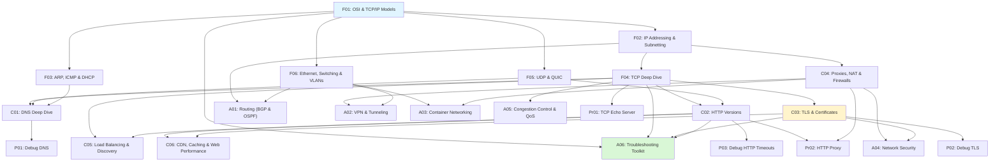

# Networking

> [!summary] Scope
> Complete networking reference from foundations through advanced operations: OSI/TCP-IP models, protocols (TCP, UDP, HTTP, DNS, TLS), infrastructure (Ethernet, switching, routing, VPN, firewalls), container networking, network security, congestion control, and a full troubleshooting toolkit with Linux and Windows commands.

## Learning Path

## Topic Map

### Foundations

| File | Topics | OSI Layer |
|------|--------|:---------:|
| [[Networking/01_Foundations/01_OSI_and_TCP_IP_Model]] | 7-layer OSI, 4-layer TCP/IP, encapsulation/decapsulation, PDUs, layer-to-protocol mapping | All |
| [[Networking/01_Foundations/02_IP_Addressing_and_Subnetting]] | IPv4/v6, CIDR table with binary walkthrough, subnet calculation, NAT/PAT, public vs private | L3 |
| [[Networking/01_Foundations/03_ARP_ICMP_and_DHCP]] | ARP request/reply flow, gratuitous ARP, ICMP types, ping/traceroute internals, DHCP DORA | L2-L3 |
| [[Networking/01_Foundations/04_TCP_Deep_Dive]] | TCP segment structure, 3-way handshake, state machine, flow/congestion control, window scaling, tcpdump capture | L4 |
| [[Networking/01_Foundations/05_UDP_and_QUIC]] | UDP header, vs TCP comparison, QUIC (HTTP/3), multicast/broadcast | L4 |
| [[Networking/01_Foundations/06_Ethernet_Switching_and_VLANs]] | Ethernet frame, MAC learning, VLAN 802.1Q, STP/RSTP, LACP | L2 |

### Core

| File | Topics |
|------|--------|
| [[Networking/02_Core/01_DNS_Deep_Dive]] | Resolution flow (root→TLD→authoritative), record types, TTL/caching, DNSSEC, DoH/DoT, dig +trace |
| [[Networking/02_Core/02_HTTP_1_1_HTTP_2_HTTP_3]] | Methods, status codes (all 1xx-5xx), headers, HTTP/2 multiplexing, QUIC/HTTP/3, curl timing |
| [[Networking/02_Core/03_TLS_and_Certificates]] | TLS 1.2 vs 1.3 handshake, certificate chain, cipher suites, validation, mTLS, OCSP stapling |
| [[Networking/02_Core/04_Proxies_NAT_and_Firewalls]] | Forward/reverse proxy, SNAT/DNAT, connection tracking, iptables/nftables, stateful vs stateless |
| [[Networking/02_Core/05_Load_Balancing_and_Service_Discovery]] | L4 vs L7, algorithms (round-robin, least connections, IP hash), health checks, sticky sessions, Consul/DNS |
| [[Networking/02_Core/06_CDN_Caching_and_Web_Performance]] | CDN architecture, Cache-Control, ETag, invalidation strategies, Core Web Vitals (LCP, FID, CLS) |

### Advanced

| File | Topics |
|------|--------|
| [[Networking/03_Advanced/01_Routing_BGP_OSPF]] | Static vs dynamic, OSPF (areas, Dijkstra, LSA types), BGP (path selection, attributes, iBGP/eBGP), AD |
| [[Networking/03_Advanced/02_VPN_and_Tunneling]] | IPsec (IKE, ESP, tunnel vs transport), WireGuard (Noise protocol), OpenVPN, TUN vs TAP |
| [[Networking/03_Advanced/03_Netns_and_Container_Networking]] | Linux network namespaces, veth pairs, Docker networking, CNI, Kubernetes (pod networking, services, policies) |
| [[Networking/03_Advanced/04_Network_Security]] | ACLs, IDS/IPS, DDoS attacks and mitigations, SYN flood, ARP spoofing, nmap scanning, Zero Trust |
| [[Networking/03_Advanced/05_Congestion_and_QoS]] | Cubic vs BBR, bufferbloat, CoDel/FQ-CoDel, traffic shaping (tc), DSCP marking |
| [[Networking/03_Advanced/06_Troubleshooting_Toolkit]] | 11 tools: ping, traceroute/mtr, tcpdump/tshark, ss/netstat, nmap, dig, curl, openssl, nc, iperf3 — each with 5-10 practical examples |

### Playbooks

| File | Topics |
|------|--------|
| [[Networking/04_Playbooks/01_Debug_DNS_Issues]] | Diagnosis tree, step-by-step (local → resolver → trace), NXDOMAIN/SERVFAIL/REFUSED, DNSSEC |
| [[Networking/04_Playbooks/02_Debug_TLS_Handshake_Failures]] | openssl debug workflow, certificate chain, cipher suites, common errors, automated scanning |
| [[Networking/04_Playbooks/03_Debug_HTTP_Timeouts_and_Retries]] | Timeout classification, curl timing breakdown, TTFB analysis, retry strategies |

### Projects

| File | Topics |
|------|--------|
| [[Networking/05_Projects/01_Build_a_TCP_Echo_Server_and_Client]] | Socket lifecycle, C socket programming, blocking vs non-blocking, select/poll/epoll |
| [[Networking/05_Projects/02_Build_a_Simple_HTTP_Proxy]] | HTTP CONNECT tunneling, connection pooling, request forwarding, curl -x test |

## Cross-Links

- [[C/03_Advanced/04_Socket_Programming]] for socket programming in C
- [[C/02_Core/02_File_IO_and_POSIX_System_Calls]] for non-blocking I/O
- [[C/03_Advanced/02_C11_Atomics_and_Memory_Model]] for lock-free networking
- [[SystemDesign/02_Core/02_Load_Balancers_and_Service_Discovery]] for LB system design
- [[SystemDesign/02_Core/01_Caching_Strategies]] for CDN caching patterns
- [[CICD/Kubernetes/02_Core/02_Ingress_and_Service_Types]] for K8s ingress
- [[CICD/Docker/02_Core/01_Images_Containers_and_Layers]] for container networking

## References

- [RFC 791 — Internet Protocol (IPv4)](https://datatracker.ietf.org/doc/html/rfc791)
- [RFC 793 — Transmission Control Protocol (TCP)](https://datatracker.ietf.org/doc/html/rfc793)
- [RFC 8200 — Internet Protocol v6 (IPv6)](https://datatracker.ietf.org/doc/html/rfc8200)
- [RFC 9000 — QUIC](https://datatracker.ietf.org/doc/html/rfc9000)
- [RFC 8446 — TLS 1.3](https://datatracker.ietf.org/doc/html/rfc8446)
- [RFC 1035 — DNS](https://datatracker.ietf.org/doc/html/rfc1035)
- [RFC 2131 — DHCP](https://datatracker.ietf.org/doc/html/rfc2131)
- [RFC 4271 — BGP-4](https://datatracker.ietf.org/doc/html/rfc4271)
- [RFC 2328 — OSPFv2](https://datatracker.ietf.org/doc/html/rfc2328)
