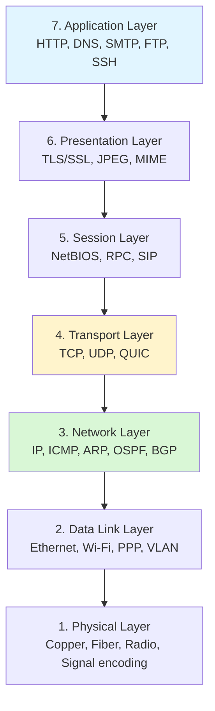
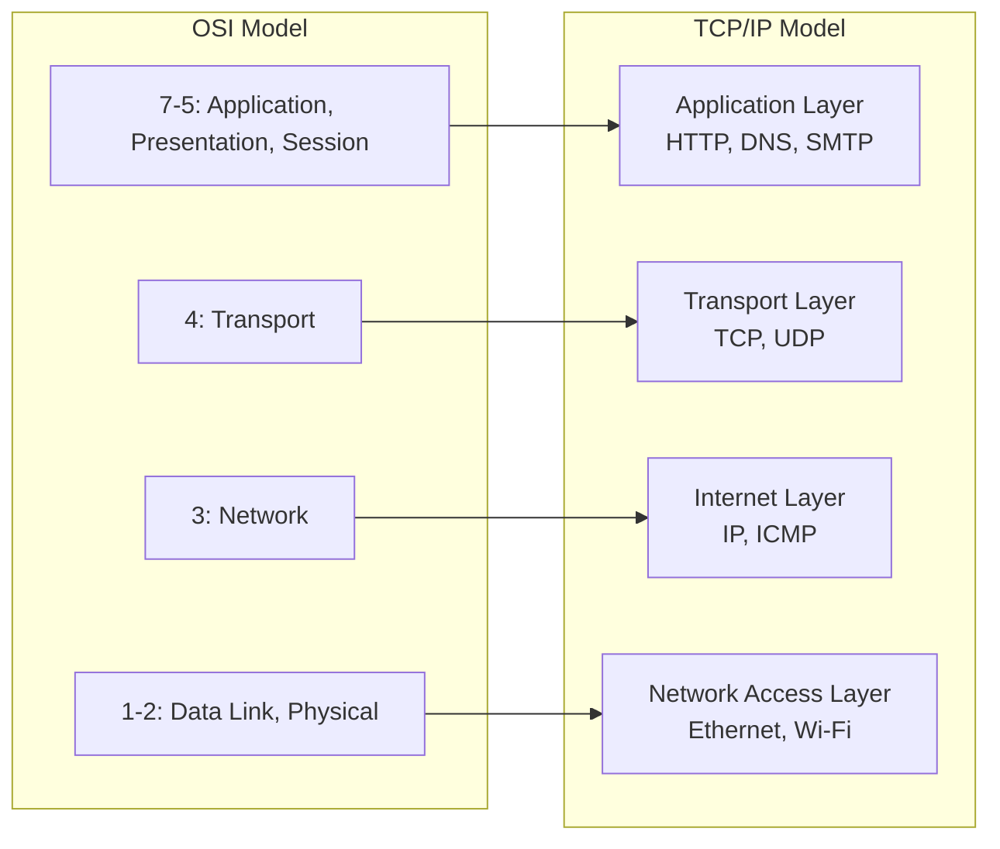
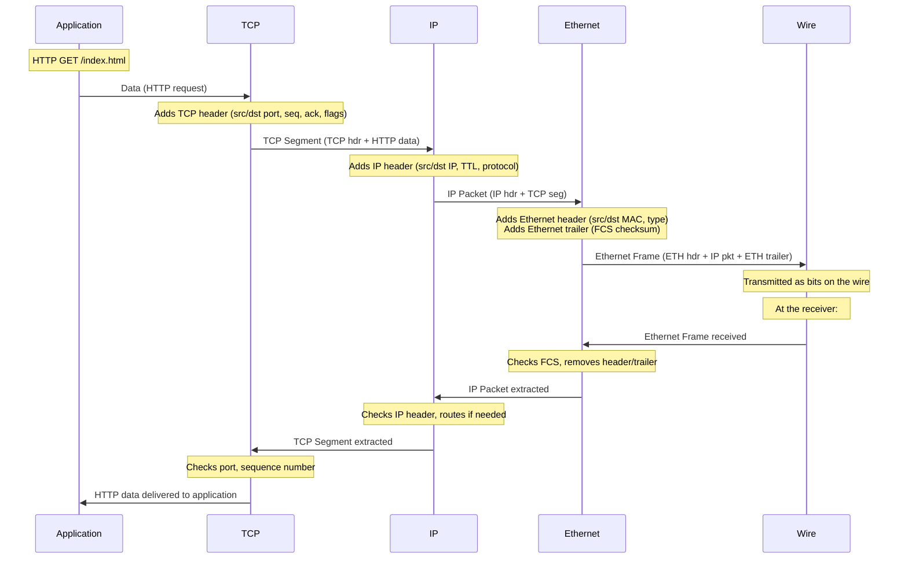

# OSI and TCP/IP Models

> [!summary] Goal
> Understand the OSI 7-layer model and TCP/IP 4-layer model — how data flows through each layer, what each layer does, and how to map protocols to layers. Essential for understanding every networking concept that follows.

## Table of Contents

1. [The OSI Model](#the-osi-model)
2. [Each Layer in Detail](#each-layer-in-detail)
3. [The TCP/IP Model](#the-tcp-ip-model)
4. [Encapsulation and Decapsulation](#encapsulation-and-decapsulation)
5. [OSI vs TCP/IP Comparison](#osi-vs-tcp-ip-comparison)
6. [Layer-to-Protocol Mapping](#layer-to-protocol-mapping)
7. [Verification Commands](#verification-commands)
8. [Pitfalls](#pitfalls)

---

## The OSI Model

Open Systems Interconnection model — a conceptual framework that standardizes network communication into **seven layers**, each building on the one below it.



> [!info] Layer number rule
> The OSI layers are numbered 7 (top, closest to user) to 1 (bottom, closest to hardware). Mnemonic: **A**ll **P**eople **S**eem **T**o **N**eed **D**ata **P**rocessing (top→bottom) or **P**lease **D**o **N**ot **T**hrow **S**ausage **P**izza **A**way (bottom→top).

---

## Each Layer in Detail

| Layer | Function | Protocols | Devices | PDU name |
|-------|----------|-----------|---------|:--------:|
| **7. Application** | User-facing services | HTTP, DNS, SMTP, FTP, SSH, DHCP | Application | **Data** |
| **6. Presentation** | Data encoding, encryption, compression | TLS, SSL, JPEG, MPEG, ASCII | — | **Data** |
| **5. Session** | Connection establishment, maintenance | NetBIOS, RPC, SIP, SOCKS | — | **Data** |
| **4. Transport** | End-to-end delivery, reliability, flow control | TCP, UDP, QUIC | — | **Segment** / **Datagram** |
| **3. Network** | Logical addressing, routing, path selection | IP, ICMP, ARP, OSPF, BGP | Router | **Packet** |
| **2. Data Link** | Framing, MAC addressing, error detection | Ethernet, Wi-Fi (802.11), PPP, VLAN | Switch, Bridge | **Frame** |
| **1. Physical** | Bit transmission, electrical/optical signals | 10BASE-T, 1000BASE-SX, DSL, Radio | Hub, Repeater, Modem | **Bit** |

### Layer 7 — Application

> [!info] Application layer
> The layer closest to the end user. Provides network services directly to applications. It identifies communication partners, determines resource availability, and synchronizes communication. It does NOT include the application itself (like a web browser) — it provides the protocols the application uses.

- **HTTP/HTTPS**: Web browsing (port 80/443)
- **DNS**: Name resolution (port 53)
- **SMTP**: Email sending (port 25)
- **FTP**: File transfer (port 20/21)
- **SSH**: Secure remote access (port 22)
- **DHCP**: Dynamic IP configuration (port 67/68)

### Layer 4 — Transport

> [!info] Transport layer
> Provides end-to-end communication between hosts. Handles segmentation, error recovery, flow control, and multiplexing via port numbers. TCP provides reliable, ordered delivery. UDP provides best-effort, connectionless delivery.

- **TCP**: Reliable, connection-oriented, in-order delivery
- **UDP**: Unreliable, connectionless, low overhead
- **QUIC**: UDP-based, reliable, multiplexed (HTTP/3)

### Layer 3 — Network

> [!info] Network layer
> Responsible for logical addressing (IP addresses) and routing packets across networks. Determines the best path from source to destination. Routers operate at this layer.

- **IPv4 / IPv6**: Logical addressing
- **ICMP**: Error reporting (ping, traceroute)
- **ARP**: IP to MAC address resolution
- **OSPF / BGP**: Routing protocols

### Layer 2 — Data Link

> [!info] Data link layer
> Provides node-to-node data transfer across the physical link. Uses MAC addresses to identify devices on the same network segment. Detects and corrects errors from the physical layer.

- **Ethernet**: Most common LAN technology
- **Wi-Fi (802.11)**: Wireless LAN
- **VLAN (802.1Q)**: Network segmentation
- **PPP**: Point-to-point links

### Layer 1 — Physical

> [!info] Physical layer
> The raw transmission of bits over a physical medium. Defines voltages, cable pinouts, frequencies, modulation, and signal encoding. Everything that happens at the wire/fiber/air level.

- **Copper (RJ45, coaxial)**: Electrical signals
- **Fiber (SC, LC)**: Light pulses
- **Radio (Wi-Fi, Bluetooth)**: Electromagnetic waves

---

## The TCP/IP Model

> [!info] TCP/IP model
> The TCP/IP model condenses the OSI layers into 4. It combines OSI 5-7 (Application), keeps Transport (4), combines OSI 3-4 into Internet (Network), and combines OSI 1-2 into Network Access (Link). This is the model actually used by the Internet.



| TCP/IP layer | Equivalent OSI layers | Key protocols |
|:------------:|:---------------------:|---------------|
| **Application** | 7, 6, 5 (Application, Presentation, Session) | HTTP, DNS, TLS, SSH |
| **Transport** | 4 (Transport) | TCP, UDP |
| **Internet** | 3 (Network) | IP, ICMP, ARP |
| **Network Access** | 2, 1 (Data Link, Physical) | Ethernet, Wi-Fi |

---

## Encapsulation and Decapsulation

When data travels from an application to the network, each layer adds its own header (and sometimes trailer). This is **encapsulation**. The reverse happens at the receiver (**decapsulation**).



### PDU names by layer

| Layer | PDU name | Contains |
|-------|:--------:|----------|
| Application | **Data** / Message | Raw application payload |
| Transport | **Segment** (TCP) / **Datagram** (UDP) | Transport header + application data |
| Network | **Packet** | IP header + transport segment |
| Data Link | **Frame** | MAC header + IP packet + FCS trailer |
| Physical | **Bit** | Encoded electrical/optical signal |

---

## OSI vs TCP/IP Comparison

| Aspect | OSI Model | TCP/IP Model |
|--------|:---------:|:------------:|
| **Number of layers** | 7 | 4 |
| **Development** | Conceptual (ISO standard) | Practical (developed by DARPA) |
| **Separation** | Separates presentation/session | Combines them into application |
| **Usage** | Educational, troubleshooting reference | Actual Internet architecture |
| **Protocol adherence** | Strict layering | Fewer layers, more flexible |
| **Common mnemonic** | Please Do Not Throw Sausage Pizza Away | No standard mnemonic |

### Layer mapping table

```text
Problem at layer X? Look for symptoms and tools at that layer:

Layer 7 (Application): Slow website? → curl, browser dev tools
Layer 4 (Transport):  Connection refused?  → ss, nc, telnet
Layer 3 (Network):    Unreachable host?     → ping, traceroute
Layer 2 (Data Link):  No link light?        → ethtool, ip link
Layer 1 (Physical):   Cable unplugged?      → Check physically
```

---

## Verification Commands

### Linux

```bash
# Layer 3: Check IP address and routing
ip addr show                          # Show all IP addresses
ip route show                         # Show routing table
ping -c 4 8.8.8.8                     # Test reachability

# Layer 4: Check ports and connections
ss -tulpn                             # Show listening ports with processes
ss -t state established               # Show established TCP connections
telnet server 80                      # Test TCP port connectivity

# All layers: Capture and analyze packets
tcpdump -i any -nn 'port 443'         # Capture HTTPS traffic
tcpdump -i eth0 -X                    # Capture with hex dump

# Layer 2: Check MAC addresses and links
ip neigh show                         # Show ARP cache
ethtool eth0                          # Show link status and capabilities
ip link show                          # Show interface status (UP/DOWN)

# Cross-layer path discovery
traceroute -n 8.8.8.8                 # Show path with IPs, no DNS
mtr 8.8.8.8                           # Continuous traceroute with stats
```

### Windows

```powershell
# Layer 3
ipconfig /all
Get-NetIPAddress
ping -n 4 8.8.8.8
tracert 8.8.8.8

# Layer 4
netstat -ano
Get-NetTCPConnection -State Established
Test-NetConnection -ComputerName google.com -Port 443

# Layer 2
Get-NetAdapter
Get-NetAdapterStatistics
arp /a
```

---

## Pitfalls

### Troubleshooting at the wrong layer

The most common networking mistake. A user reports "the internet is down." This could be anything from a cable issue (L1) to a DNS issue (L7). Always start at the bottom and work up. "Is the cable plugged in?" → "Can I ping the gateway?" → "Can I resolve DNS?" → "Does the browser work?"

### Forgetting that ARP is not an IP protocol

ARP operates at Layer 2.5 — it maps Layer 3 IP addresses to Layer 2 MAC addresses. It doesn't use IP headers. This is why `arp -a` shows entries but `ping` first triggers an ARP request.

### Assuming the OSI model is "how it works"

The OSI model is a **reference**. In practice, layers merge. TLS is technically layer 6 (Presentation) but sits between TCP (layer 4) and HTTP (layer 7). QUIC is layer 4 but uses UDP. Don't let the model limit your understanding.

### MTU confusion between layers

Layer 3 MTU (IP MTU, typically 1500) is different from Layer 2 MTU (Ethernet MTU). Path MTU discovery works at Layer 3 but depends on Layer 2 not fragmenting. Confusing the two leads to packet drops and performance issues.

---

> [!question]- Interview Questions
>
> **Q: What are the seven layers of the OSI model?**
> A: Physical, Data Link, Network, Transport, Session, Presentation, Application. Mnemonic: Please Do Not Throw Sausage Pizza Away (bottom to top).
>
> **Q: What is encapsulation in networking?**
> A: Each layer adds its own header to the data received from the layer above before passing it down. An HTTP request is wrapped in a TCP segment (TCP header added), wrapped in an IP packet (IP header added), wrapped in an Ethernet frame (Ethernet header + trailer added). The receiver strips headers in reverse order.
>
> **Q: What's the difference between the OSI and TCP/IP models?**
> A: OSI has 7 layers (separates Presentation and Session), is a conceptual reference, and is used for education. TCP/IP has 4 layers (combines the top 3), is the actual Internet architecture, and powers real networks.
>
> **Q: What PDU does each layer use?**
> A: Application → Data, Transport → Segment (TCP) or Datagram (UDP), Network → Packet, Data Link → Frame, Physical → Bits.
>
> **Q: At which layer do routers, switches, and hubs operate?**
> A: Routers → Layer 3 (Network, IP routing). Switches → Layer 2 (Data Link, MAC forwarding). Hubs → Layer 1 (Physical, signal repeating).

---

## Cross-Links

- [[Networking/01_Foundations/04_TCP_Deep_Dive]] for transport layer details
- [[Networking/02_Core/02_HTTP_1_1_HTTP_2_HTTP_3]] for application layer protocols
- [[Networking/03_Advanced/06_Troubleshooting_Toolkit]] for layer-based troubleshooting
- [[Networking/01_Foundations/02_IP_Addressing_and_Subnetting]] for network layer addressing
- [[Networking/01_Foundations/06_Ethernet_Switching_and_VLANs]] for data link layer details
