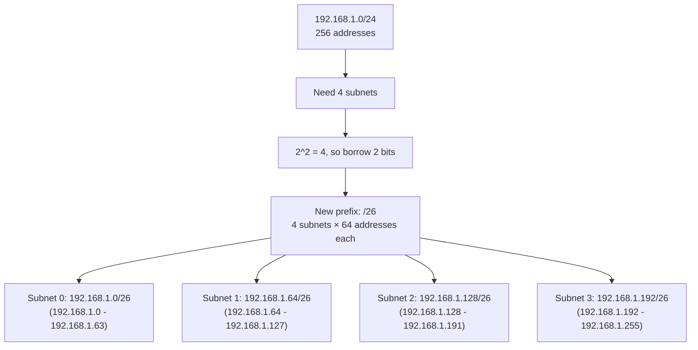
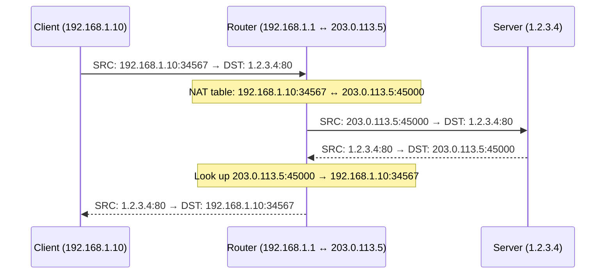

# IP Addressing, Subnetting, and CIDR

> [!summary] Goal
> Master IP addressing: understand IPv4 and IPv6 structure, calculate subnets using CIDR, understand public vs private addresses, NAT/PAT, and use verification commands on Linux and Windows.

## Table of Contents

1. [IPv4 Address Structure](#ipv4-address-structure)
2. [CIDR and Subnetting](#cidr-and-subnetting)
3. [Subnet Calculation Walkthrough](#subnet-calculation-walkthrough)
4. [IPv6](#ipv6)
5. [NAT and PAT](#nat-and-pat)
6. [Special Addresses](#special-addresses)
7. [Verification Commands](#verification-commands)
8. [Pitfalls](#pitfalls)

---

## IPv4 Address Structure

> [!info] IPv4 address
> A 32-bit number written as four octets (0-255 each) separated by dots. Example: `192.168.1.10`. Divided into a **network portion** (identifies the network) and a **host portion** (identifies a device on that network). The subnet mask determines the boundary between them.

```text
Binary:   11000000.10101000.00000001.00001010
Decimal:  192.     168.     1.       10
Hex:      C0       A8       01       0A
```

### Address classes (legacy, replaced by CIDR)

| Class | First octet | Default mask | Network bits | Host bits | Networks | Hosts/network |
|:-----:|:-----------:|:------------:|:------------:|:---------:|:--------:|:-------------:|
| A | 1-126 | /8 (255.0.0.0) | 8 | 24 | 126 | 16,777,214 |
| B | 128-191 | /16 (255.255.0.0) | 16 | 16 | 16,384 | 65,534 |
| C | 192-223 | /24 (255.255.255.0) | 24 | 8 | 2,097,152 | 254 |
| D | 224-239 | Multicast | — | — | — | — |
| E | 240-255 | Reserved | — | — | — | — |

---

## CIDR and Subnetting

> [!info] CIDR (Classless Inter-Domain Routing)
> CIDR replaced classful addressing. Instead of fixed /8, /16, /24 boundaries, you can specify ANY prefix length: /20, /23, /27, etc. Notation: `192.168.1.0/24` means the first 24 bits are the network, the last 8 are for hosts.

### CIDR prefix reference table

| CIDR | Subnet mask | Total IPs | Usable hosts | Use case |
|:----:|:-----------:|:---------:|:------------:|----------|
| /32 | 255.255.255.255 | 1 | 1 | Single host |
| /30 | 255.255.255.252 | 4 | 2 | Point-to-point link |
| /29 | 255.255.255.248 | 8 | 6 | Small office |
| /28 | 255.255.255.240 | 16 | 14 | Small network |
| /27 | 255.255.255.224 | 32 | 30 | Department |
| /26 | 255.255.255.192 | 64 | 62 | Medium department |
| /25 | 255.255.255.128 | 128 | 126 | Office |
| **/24** | **255.255.255.0** | **256** | **254** | **Standard office** |
| /23 | 255.255.254.0 | 512 | 510 | Small company |
| /22 | 255.255.252.0 | 1,024 | 1,022 | Company |
| /21 | 255.255.248.0 | 2,048 | 2,046 | Large company |
| /20 | 255.255.240.0 | 4,096 | 4,094 | Campus |
| /16 | 255.255.0.0 | 65,536 | 65,534 | Large organization |

### Private IP ranges (RFC 1918)

| Range | CIDR | Purpose |
|-------|:----:|---------|
| 10.0.0.0 — 10.255.255.255 | /8 | Large internal networks |
| 172.16.0.0 — 172.31.255.255 | /12 | Medium internal networks |
| 192.168.0.0 — 192.168.255.255 | /16 | Small/home networks |

---

## Subnet Calculation Walkthrough

### Problem: You're given 192.168.1.0/24 and need 4 subnets



### Step-by-step calculation

```text
Given: 10.0.0.0/16, need subnets that support 500 hosts each.

1. Hosts needed: 500
2. Host bits required: 2^9 = 512 → need 9 host bits (512 ≥ 500)
3. Network bits in /16: 16
4. Final prefix: 32 - 9 = /23
5. Each subnet: /23 = 512 IPs total, 510 usable

Result: 10.0.0.0/23, 10.0.2.0/23, 10.0.4.0/23, ... (128 subnets)

Maximum subnets = 2^(23-16) = 2^7 = 128 subnets
```

### Binary subnetting

```text
IP address:      192.168.1.234
Subnet mask:     255.255.255.192 (/26)

Binary:
  192.168.1.234 = 11000000.10101000.00000001.11101010
  255.255.255.192 = 11111111.11111111.11111111.11000000
  Network portion:   11000000.10101000.00000001.11   = 192.168.1.192/26
  Host portion:                    101010 = 42
  This host is at 192.168.1.192 + 42 = 192.168.1.234

Network address:  192.168.1.192 (host bits all 0)
Broadcast:        192.168.1.255 (host bits all 1)
Usable range:     192.168.1.193 - 192.168.1.254
```

---

## IPv6

> [!info] IPv6
> 128-bit address (vs 32-bit IPv4). Written as 8 groups of 4 hex digits: `2001:0db8:85a3:0000:0000:8a2e:0370:7334`. Leading zeros in a group can be omitted. A single contiguous group of all-zero groups can be replaced with `::` (once per address). IPv6 eliminates NAT — every device can have a globally unique address.

### IPv6 address types

| Type | Prefix | Example | Description |
|------|:------:|---------|-------------|
| Global unicast | `2000::/3` | `2001:db8::1` | Globally routable (like public IPv4) |
| Link-local | `fe80::/10` | `fe80::1` | Local subnet only (autoconfigured) |
| Unique local | `fc00::/7` | `fd00::1` | Private network (like RFC 1918) |
| Multicast | `ff00::/8` | `ff02::1` | One-to-many (all nodes on link) |
| Loopback | `::1/128` | `::1` | Localhost (like 127.0.0.1) |
| Unspecified | `::/128` | `::` | Not assigned |

### IPv6 vs IPv4

| Aspect | IPv4 | IPv6 |
|--------|:----:|:----:|
| **Address length** | 32 bits | 128 bits |
| **Notation** | Dotted decimal | Colon-separated hex |
| **Example** | 192.168.1.1 | 2001:db8::1 |
| **NAT** | Required for public access | Not needed |
| **Broadcast** | Yes (traditionally) | No (multicast instead) |
| **Fragmentation** | By routers | By sender only (Path MTU) |
| **ARP** | Uses ARP | Uses NDP (Neighbor Discovery) |
| **DNS record** | A record | AAAA record |

---

## NAT and PAT

> [!info] NAT (Network Address Translation)
> NAT allows multiple devices on a private network to share a single public IP address. The router rewrites the source IP of outgoing packets and tracks the mapping so that return traffic reaches the correct internal device.

### NAT types

| Type | What it translates | Use case |
|------|-------------------|----------|
| **SNAT** / Masquerade | Source IP | Private → Internet outbound |
| **DNAT** / Port Forwarding | Destination IP:Port | Internet → internal server |
| **1:1 NAT** | Full IP mapping | Routed between networks |



---

## Special Addresses

| Address | Purpose |
|---------|---------|
| `127.0.0.0/8` (IPv4) / `::1` (IPv6) | **Loopback** — localhost, never leaves the machine |
| `169.254.0.0/16` | **Link-local** — automatic IP when DHCP fails |
| `0.0.0.0/8` | "This network" — used for DHCP, routing |
| `224.0.0.0/4` | **IPv4 multicast** — one-to-many |
| `240.0.0.0/4` | Reserved (future use) |
| `::` | Unspecified address |
| `2002::/16` | 6to4 (IPv6 over IPv4 tunnel) |

---

## Verification Commands

### Linux

```bash
# IP addresses
ip addr show                         # Show all IPs
curl ifconfig.me                     # Show public IP
hostname -I                          # Show local IPs

# Routing
ip route show                        # Show routing table
ip route get 8.8.8.8                 # Show which interface/path to reach IP

# Subnet calculation
ipcalc 192.168.1.0/24                # Calculate subnet info
sipcalc 10.0.0.0/16                  # Advanced subnet calculator
apt install ipcalc                   # Install if needed

# IPv6
ip -6 addr show                      # Show IPv6 addresses
ip -6 route show                     # Show IPv6 routing
ping6 -c 4 2001:4860:4860::8888     # Ping Google IPv6

# NAT and conntrack
cat /proc/sys/net/ipv4/ip_forward    # Check if IP forwarding enabled
conntrack -L | head                  # Show NAT connection tracking
sysctl net.ipv4.ip_forward           # Enable/disable IP forwarding

# Internet connectivity
ping -c 4 8.8.8.8                    # Test basic connectivity
traceroute -n 8.8.8.8               # Show path
```

### Windows

```powershell
# IP addresses
ipconfig /all
Get-NetIPAddress

# Routing
route print
Get-NetRoute
Get-NetIPAddress -AddressFamily IPv4

# Connectivity
ping -n 4 8.8.8.8
tracert 8.8.8.8
Test-NetConnection -ComputerName google.com -Port 443

# NAT (if configured as a router)
Get-NetNat

# IPv6
Get-NetIPAddress -AddressFamily IPv6
ping -n 4 ::1
```

---

## Pitfalls

### Forgetting the network and broadcast addresses

In any subnet, the first address is the **network address** (host bits all zero) and the last is the **broadcast address** (host bits all one). Neither can be assigned to a host. For a /24, usable addresses are .1 to .254 — not .0 to .255.

### Choosing /24 for everything

A /24 gives 254 hosts. Point-to-point links only need 2 hosts — use /30 (2 usable IPs). Using /24 for a link wastes 252 IPs. On IPv4 with scarce addresses, always size subnets appropriately.

### IPv6 link-local confusion

IPv6 link-local addresses (`fe80::/10`) are only valid on the local link. You can't ping a link-local address without specifying the interface: `ping6 -I eth0 fe80::1%eth0`. Forgetting `%eth0` (or `-I eth0`) results in "invalid argument."

### Assuming NAT is security

NAT makes it harder to initiate connections from outside, but it's not a firewall. IPv6 eliminates the need for NAT, but you still need a firewall. Don't rely on NAT for security — that's what firewalls are for.

---

> [!question]- Interview Questions
>
> **Q: How do you calculate the number of hosts in a /28 subnet?**
> A: /28 has 4 host bits (32-28=4). 2^4 = 16 total addresses. Subtract 2 (network and broadcast) = 14 usable hosts.
>
> **Q: What is the difference between public and private IP addresses?**
> A: Private IPs (10.0.0.0/8, 172.16.0.0/12, 192.168.0.0/16) are not routable on the public Internet. They're used internally. Public IPs are globally unique and routable. NAT translates private → public for Internet access.
>
> **Q: How does NAT work?**
> A: A NAT router rewrites the source IP:port of outbound packets to its own public IP:port and stores the mapping in a connection tracking table. Return traffic is matched against the table and rewritten back to the original private IP:port. This allows many devices to share one public IP.
>
> **Q: Why was IPv6 created?**
> A: IPv4 has ~4.3 billion addresses, which is insufficient for modern Internet scale. IPv6 provides 2^128 addresses (340 undecillion) — enough for every device on Earth many times over. It also eliminates the need for NAT, simplifies header processing, and has built-in IPsec support.
>
> **Q: What does CIDR notation /24 mean?**
> A: The first 24 bits are the network portion; the remaining 8 bits are for hosts. Subnet mask: 255.255.255.0. 256 total IPs, 254 usable hosts. In binary: 24 ones followed by 8 zeros.

---

## Cross-Links

- [[Networking/01_Foundations/01_OSI_and_TCP_IP_Model]] for layer 3 role in the OSI model
- [[Networking/01_Foundations/04_TCP_Deep_Dive]] for how IP works with TCP
- [[Networking/02_Core/01_DNS_Deep_Dive]] for DNS resolution of IP addresses
- [[Networking/03_Advanced/01_Routing_BGP_OSPF]] for routing between subnets
- [[Networking/03_Advanced/04_Network_Security]] for firewall and ACL protection
