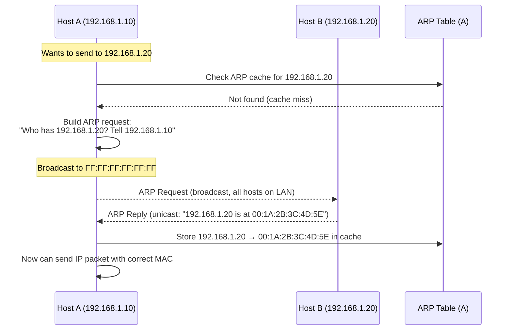
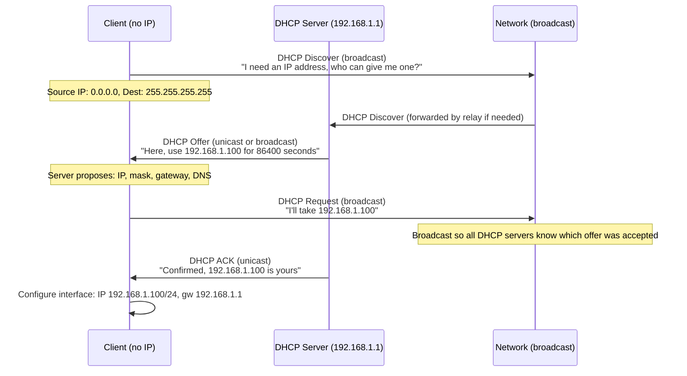

# ARP, ICMP, and DHCP

> [!summary] Goal
> Understand three fundamental network protocols: ARP (MAC address resolution), ICMP (error reporting and diagnostic), and DHCP (automatic IP configuration). Learn the packet flows, common issues, and verification commands.

## Table of Contents

1. [ARP — Address Resolution Protocol](#arp-address-resolution-protocol)
2. [ICMP — Internet Control Message Protocol](#icmp-internet-control-message-protocol)
3. [DHCP — Dynamic Host Configuration Protocol](#dhcp-dynamic-host-configuration-protocol)
4. [Verification Commands](#verification-commands)
5. [Pitfalls](#pitfalls)

---

## ARP — Address Resolution Protocol

> [!info] ARP
> ARP resolves **IP addresses to MAC addresses**. Before sending a packet to another host on the same network, the sender needs to know the target's MAC address. ARP broadcasts a request "who has IP 192.168.1.5?" and the owner replies with its MAC. The result is cached in the ARP table.

### ARP request/reply flow



> [!info] ARP cache
> ARP entries are cached for a limited time (typically 15-60 seconds for incomplete, 2-15 minutes for resolved). On Linux, check `/proc/sys/net/ipv4/neigh/default/gc_stale_time`. On Windows, `netsh interface ip show neighbors`.

### ARP packet structure

```text
Ethernet header:
  Destination MAC: FF:FF:FF:FF:FF:FF (broadcast) or target MAC (unicast reply)
  Source MAC: Own MAC
  EtherType: 0x0806 (ARP)

ARP body:
  Hardware type: 1 (Ethernet)
  Protocol type: 0x0800 (IPv4)
  Hardware size: 6 (MAC address bytes)
  Protocol size: 4 (IP address bytes)
  Opcode: 1 (request) or 2 (reply)
  Sender MAC: Own MAC
  Sender IP: Own IP
  Target MAC: 00:00:00:00:00:00 (request) or resolved MAC (reply)
  Target IP: Resolving IP
```

### Gratuitous ARP

```text
A host announces its IP→MAC mapping to the network WITHOUT being asked.
Used for:
  - IP address conflict detection ("is anyone else using this IP?")
  - Failover (new MAC for a virtual IP after a server crash)
  - Updating switch MAC tables after NIC replacement

The receiver updates its ARP table, possibly overriding an existing entry.
This is why moving a floating IP between servers works — the new server sends
a gratuitous ARP to update switches and other hosts.
```

---

## ICMP — Internet Control Message Protocol

> [!info] ICMP
> ICMP is used for error reporting and diagnostics. It's not used for transporting data — it's used by network devices to communicate status. The most well-known ICMP tool is `ping`, but ICMP covers much more. ICMP messages are encapsulated directly in IP (protocol 1).

### ICMP types and codes

| Type | Code | Name | Meaning |
|:----:|:----:|------|---------|
| 0 | 0 | **Echo Reply** | Response to ping |
| 3 | 0 | Destination Network Unreachable | No route to network |
| 3 | 1 | Destination Host Unreachable | Host doesn't respond |
| 3 | 3 | Port Unreachable | Service not listening |
| 3 | 4 | Fragmentation Needed but DF Set | MTU issue (path MTU discovery) |
| 8 | 0 | **Echo Request** | Ping request |
| 11 | 0 | TTL Expired | Used by traceroute |
| 11 | 1 | Fragment Reassembly Time Exceeded | Fragments didn't arrive |

### Ping internals

```bash
# Ping sends ICMP Echo Request (type 8) to target
# Target responds with ICMP Echo Reply (type 0)
# Ping measures RTT (Round Trip Time)

ping -c 4 8.8.8.8            # Send 4 pings
ping -f 8.8.8.8              # Flood ping (root only, for testing)
ping -s 1472 8.8.8.8         # Custom payload size (near MTU)
ping -M do -s 1500 8.8.8.8   # Don't fragment, test MTU
```

```text
ping 8.8.8.8 output:
PING 8.8.8.8 (8.8.8.8) 56(84) bytes of data.
64 bytes from 8.8.8.8: icmp_seq=1 ttl=117 time=12.3 ms
64 bytes from 8.8.8.8: icmp_seq=2 ttl=117 time=11.8 ms

--- 8.8.8.8 ping statistics ---
2 packets transmitted, 2 received, 0% packet loss, time 1001ms
rtt min/avg/max/mdev = 11.8/12.0/12.3/0.2 ms
```

### Traceroute internals

> [!info] Traceroute
> Traceroute sends packets with increasing TTL (Time To Live). The first router decrements TTL to 0 and sends back ICMP Time Exceeded (type 11). Traceroute records each router's IP until the destination is reached.

```bash
traceroute -n 8.8.8.8        # Numeric output (no DNS lookups)
mtr 8.8.8.8                  # Continuous traceroute with stats
```

```text
traceroute to 8.8.8.8 (8.8.8.8), 30 hops max, 60 byte packets
 1  192.168.1.1    0.5 ms   0.4 ms   0.4 ms    # Router (gateway)
 2  10.0.0.1      2.1 ms   1.9 ms   2.0 ms     # ISP router
 3  72.14.210.2   15.6 ms  15.3 ms  15.5 ms     # ISP's upstream
 4  216.58.216.99 16.2 ms  16.5 ms  16.1 ms     # Internet backbone
 5  * * *                                        # Router doesn't reply
 6  8.8.8.8       18.4 ms  18.1 ms  18.3 ms     # Destination
```

---

## DHCP — Dynamic Host Configuration Protocol

> [!info] DHCP
> DHCP automatically assigns IP addresses, subnet masks, gateways, DNS servers, and other network parameters to hosts. Without DHCP, every device would need manual IP configuration. The process uses four messages known as **DORA** (Discover, Offer, Request, Acknowledge).

### DORA flow



> [!info] DHCP lease
> A DHCP lease is the duration for which an IP address is assigned. When 50% of the lease time has passed, the client tries to renew (unicast to the server). If the server doesn't respond, it tries again at 87.5% (broadcast). If the lease expires, the IP is returned to the pool. Default is often 24 hours.

### DHCP message format

```text
DHCP is built on BOOTP and uses UDP ports 67 (server) and 68 (client).

DHCP packet fields:
  op: 1=request, 2=reply
  htype: 1 (Ethernet)
  hlen: 6 (MAC length)
  hops: 0 (incremented by relay agents)
  xid: Transaction ID (random, matches request to reply)
  secs: Seconds since client started
  flags: Broadcast flag (client can't unicast yet)
  ciaddr: Client IP (0.0.0.0 during discovery)
  yiaddr: "Your" IP (offered by server)
  siaddr: Server IP
  giaddr: Relay agent IP (if across subnets)
  chaddr: Client MAC (16 bytes)
  sname: Server hostname (64 bytes, optional)
  file: Boot file (128 bytes, for PXE)
  options: Variable-length (DHCP message type, subnet mask, gateway, DNS, lease time, etc.)
```

### DHCP options (common)

| Option code | Name | Example |
|:-----------:|------|---------|
| 1 | Subnet Mask | 255.255.255.0 |
| 3 | Router (Gateway) | 192.168.1.1 |
| 6 | DNS Server | 8.8.8.8, 8.8.4.4 |
| 15 | Domain Name | example.com |
| 44 | NetBIOS/WINS Server | 192.168.1.10 |
| 51 | IP Address Lease Time | 86400 seconds |
| 53 | DHCP Message Type | 1=Discover, 2=Offer, 3=Request, 5=ACK, 6=NAK, 7=Release |

### DHCP relay

```bash
# When the DHCP server is on a different subnet from the client,
# a DHCP relay agent forwards broadcasts. The relay adds its own
# IP (giaddr) so the server knows which subnet to assign from.

# On Linux (example with dhcp-helper or directly with iptables):
# The router must have ip_forward enabled and a DHCP relay configured.
```

---

## Verification Commands

### Linux

```bash
# ARP
ip neigh show                     # Show ARP cache (neighbor table)
arp -a                            # Show ARP cache (older tool)
ip neigh delete 192.168.1.5 dev eth0  # Remove ARP entry
arping -I eth0 192.168.1.1        # Send ARP request without IP layer
tcpdump -i eth0 arp               # Capture ARP traffic

# ICMP / Ping
ping -c 4 8.8.8.8                 # Basic ping
ping -c 4 -s 1472 -M do 8.8.8.8  # MTU test (don't fragment)
mtr 8.8.8.8                       # Combined ping + traceroute
traceroute -n 8.8.8.8             # Path discovery
tcpdump -i any icmp               # Capture ICMP traffic

# DHCP
dhclient -v eth0                  # Request/renew DHCP lease
dhclient -r eth0                  # Release DHCP lease
cat /var/lib/dhcp/dhclient.leases # Show DHCP lease file
tcpdump -i any port 67 or port 68 # Capture DHCP traffic
systemd-resolve --status          # Show systemd DHCP status
nmcli device show eth0            # Show NetworkManager DHCP info

# Capture all three:
tcpdump -i eth0 -nn -e '(arp or icmp or port 67 or port 68)'
```

### Windows

```powershell
# ARP
arp /a
Get-NetNeighbor
arp -d 192.168.1.5               # Remove ARP entry

# ICMP / Ping
ping -n 4 8.8.8.8
tracert 8.8.8.8
Test-NetConnection -ComputerName 8.8.8.8 -Hops 5

# DHCP
ipconfig /release
ipconfig /renew
Get-NetIPAddress -AddressFamily IPv4
Get-NetIPConfiguration -Detailed

# DHCP lease info
ipconfig /all | findstr /i "dhcp"
Get-WmiObject Win32_NetworkAdapterConfiguration | Where-Object {$_.DHCPEnabled -eq $true}
```

---

## Pitfalls

### ARP spoofing / ARP cache poisoning

An attacker sends fake ARP replies, claiming to be another host's IP. Traffic intended for that host is redirected to the attacker (man-in-the-middle). Mitigate with: (a) static ARP entries for critical hosts, (b) DHCP snooping, (c) port security on switches, (d) ARP spoofing detection tools like `arpwatch` or `snort`.

### Ping not working doesn't mean the host is down

Many networks block ICMP at firewalls for security. A host may be reachable via TCP (e.g., HTTP) but not respond to ping. Always try a TCP connection test (`nc -zv host 80`, `telnet host 80`, `curl -I http://host`) before declaring the host unreachable.

### Forgetting ping MTU vs TCP MTU

Ping with default size tests reachability but doesn't test MTU issues. Use `ping -M do -s 1472` to test path MTU (1472 = 1500 - 20 IP - 8 ICMP). If ping fails at 1472 but works at 1400, there's an MTU issue somewhere in the path.

### DHCP lease conflicts

Two devices with the same IP cause intermittent connectivity loss for both. This often happens when: (a) a static IP overlaps with a DHCP pool, (b) a DHCP server is misconfigured, (c) a VM or container inherits a stale IP. Use `arping -D <ip>` (Duplicate Address Detection) before assigning an IP.

---

> [!question]- Interview Questions
>
> **Q: How does ARP work?**
> A: When a host needs to send to another host on the same LAN, it broadcasts an ARP request: "Who has IP X? Tell MAC Y." The target replies unicast with its MAC. The sender caches the result. ARP only works within a single broadcast domain (subnet).
>
> **Q: What does traceroute do?**
> A: Traceroute sends packets with successively higher TTL values. The first router decrements TTL to 0 and sends back ICMP Time Exceeded. By recording the source IP of each Time Exceeded message, traceroute reveals the path a packet takes through the network.
>
> **Q: What is DHCP DORA?**
> A: Discover (client broadcasts looking for a DHCP server), Offer (server offers an IP and configuration), Request (client requests the offered IP), Acknowledge (server confirms the lease). This four-message exchange produces a valid network configuration on the client.
>
> **Q: What are the differences between ICMP Echo Request/Reply and regular TCP communication?**
> A: ICMP operates at the network layer (IP protocol 1), not the transport layer. It has no ports, no connection state, and no reliability guarantees. TCP uses ports, sequence numbers, acknowledgments, and retransmission. A host can block ICMP but still serve TCP traffic.
>
> **Q: What happens when an ARP entry expires?**
> A: The next time the host needs to send to that IP, it doesn't find the MAC in its ARP cache and must send a new ARP request. This adds latency (the time for the request/reply round trip) to the first packet. The ARP response updates the cache and subsequent packets use the cached entry.

---

## Cross-Links

- [[Networking/01_Foundations/02_IP_Addressing_and_Subnetting]] for subnets and ARP scope
- [[Networking/01_Foundations/04_TCP_Deep_Dive]] for transport layer on top of IP
- [[Networking/01_Foundations/06_Ethernet_Switching_and_VLANs]] for MAC learning and switching
- [[Networking/03_Advanced/04_Network_Security]] for ARP spoofing protection
- [[Networking/03_Advanced/05_Congestion_and_QoS]] for ICMP in path MTU discovery
