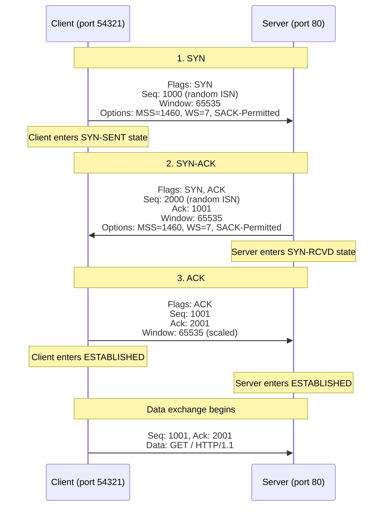
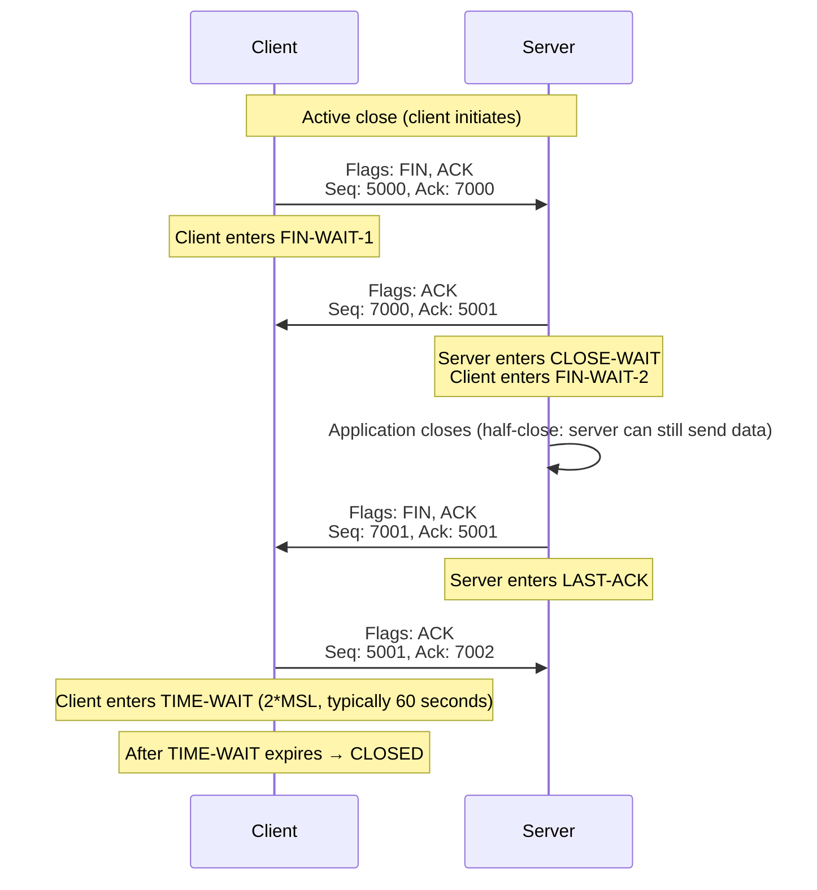
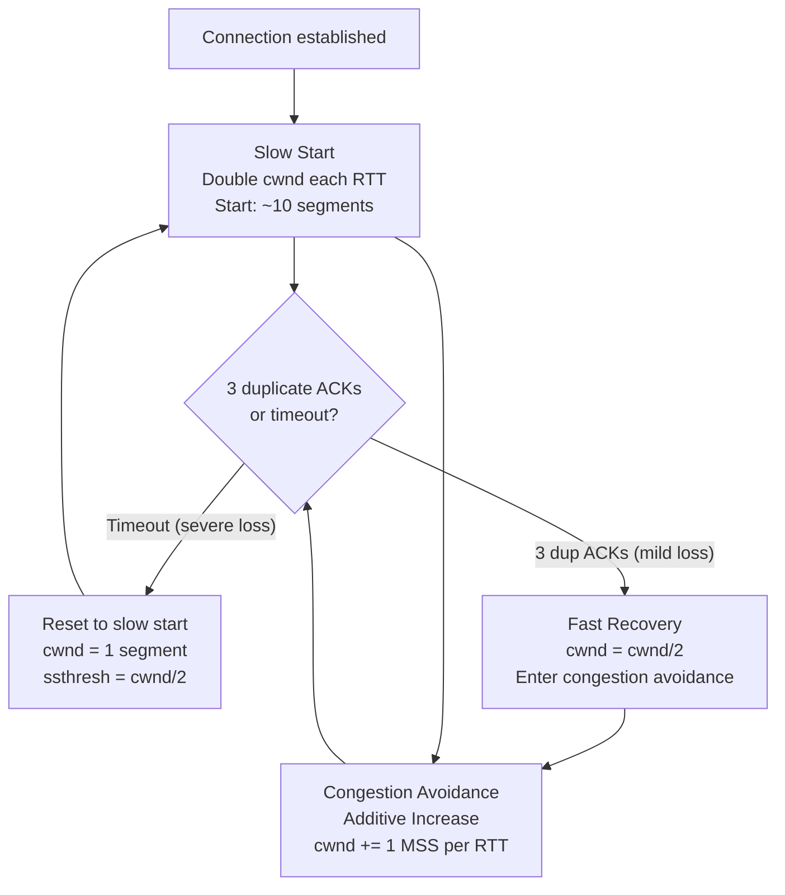
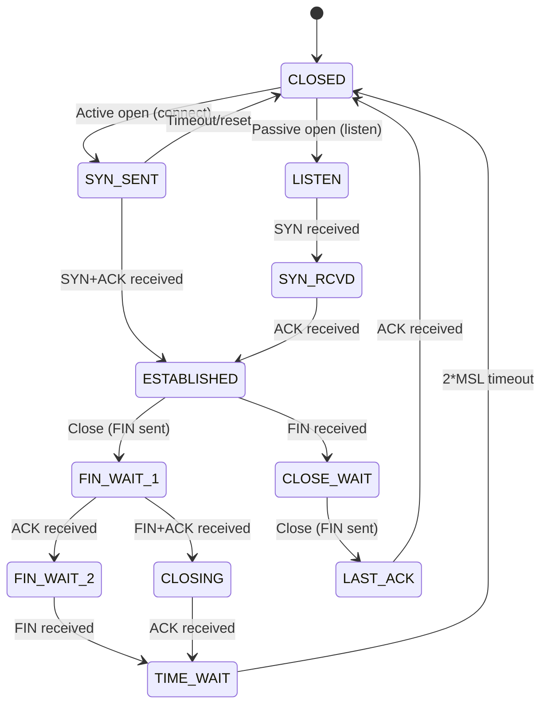

# TCP Deep Dive

> [!summary] Goal
> Master TCP — the core transport protocol of the Internet. Understand the 3-way handshake, segment structure, flow control, congestion control algorithms, TCP state machine, and how to inspect TCP connections with Linux and Windows tools.

## Table of Contents

1. [TCP Segment Structure](#tcp-segment-structure)
2. [3-Way Handshake](#3-way-handshake)
3. [Connection Termination](#connection-termination)
4. [Flow Control](#flow-control)
5. [Congestion Control](#congestion-control)
6. [TCP State Machine](#tcp-state-machine)
7. [TCP Options](#tcp-options)
8. [Verification Commands](#verification-commands)
9. [Pitfalls](#pitfalls)

---

## TCP Segment Structure

> [!info] TCP segment
> A TCP segment is the PDU (Protocol Data Unit) at the transport layer. Each segment has a fixed 20-byte header (up to 60 bytes with options) followed by the application data. TCP provides **reliable, ordered, connection-oriented** delivery.

```text
 0                   1                   2                   3
 0 1 2 3 4 5 6 7 8 9 0 1 2 3 4 5 6 7 8 9 0 1 2 3 4 5 6 7 8 9 0 1
+-+-+-+-+-+-+-+-+-+-+-+-+-+-+-+-+-+-+-+-+-+-+-+-+-+-+-+-+-+-+-+-+
|          Source Port          |       Destination Port        |
+-+-+-+-+-+-+-+-+-+-+-+-+-+-+-+-+-+-+-+-+-+-+-+-+-+-+-+-+-+-+-+-+
|                       Sequence Number                        |
+-+-+-+-+-+-+-+-+-+-+-+-+-+-+-+-+-+-+-+-+-+-+-+-+-+-+-+-+-+-+-+-+
|                    Acknowledgment Number                      |
+-+-+-+-+-+-+-+-+-+-+-+-+-+-+-+-+-+-+-+-+-+-+-+-+-+-+-+-+-+-+-+-+
|  Data |       |C|E|U|A|P|R|S|F|                               |
| Offset|  Res  |W|C|R|C|S|S|Y|I|       Window                 |
|       |       |R|E|G|K|H|T|N|N|                               |
+-+-+-+-+-+-+-+-+-+-+-+-+-+-+-+-+-+-+-+-+-+-+-+-+-+-+-+-+-+-+-+-+
|           Checksum            |        Urgent Pointer         |
+-+-+-+-+-+-+-+-+-+-+-+-+-+-+-+-+-+-+-+-+-+-+-+-+-+-+-+-+-+-+-+-+
|                    Options (if any)                           |
+-+-+-+-+-+-+-+-+-+-+-+-+-+-+-+-+-+-+-+-+-+-+-+-+-+-+-+-+-+-+-+-+
|                            Data                               |
+-+-+-+-+-+-+-+-+-+-+-+-+-+-+-+-+-+-+-+-+-+-+-+-+-+-+-+-+-+-+-+-+
```

| Field | Size | Description |
|-------|:----:|-------------|
| **Source Port** | 16 bits | Identifies the sending application |
| **Destination Port** | 16 bits | Identifies the receiving application |
| **Sequence Number** | 32 bits | Byte position of this segment's data in the stream |
| **Acknowledgment Number** | 32 bits | Next expected byte (acknowledges receipt up to this-1) |
| **Data Offset** | 4 bits | Header length in 32-bit words (min 5, max 15) |
| **Flags** | 9 bits | URG, ACK, PSH, RST, SYN, FIN (see below) |
| **Window Size** | 16 bits | Bytes the receiver is willing to accept (flow control) |
| **Checksum** | 16 bits | Error detection for header + data |
| **Urgent Pointer** | 16 bits | Offset to urgent data (rarely used) |
| **Options** | 0-40 bytes | MSS, Window Scale, SACK, Timestamps, etc. |

### TCP flags

| Flag | Name | Purpose |
|:----:|------|---------|
| **SYN** | Synchronize | Initiates a connection (first step of handshake) |
| **ACK** | Acknowledgment | Confirms receipt of data |
| **FIN** | Finish | Gracefully terminates a connection |
| **RST** | Reset | Immediately terminates a connection (error) |
| **PSH** | Push | Deliver data immediately without buffering |
| **URG** | Urgent | Urgent data (rarely used) |
| **ECE** | ECN-Echo | Congestion notification |
| **CWR** | Congestion Window Reduced | Congestion notification acknowledgement |

---

## 3-Way Handshake

> [!info] TCP 3-way handshake
> Before data can be sent, TCP establishes a connection via three messages. This synchronizes sequence numbers and confirms both sides are reachable. The client initiates with `SYN`, the server responds with `SYN-ACK`, the client confirms with `ACK`. Only then can data flow.



### Capturing the handshake

```bash
# Terminal 1: Start capture
tcpdump -i any -nn 'host 192.168.1.100 and port 80'

# Terminal 2: Make connection
curl http://192.168.1.100

# tcpdump output:
# 1. SYN:     SRC:54321 > DST:80 [S] Seq=0 (WScale=7, MSS=1460)
# 2. SYN-ACK: SRC:80 > DST:54321 [S.] Seq=0 Ack=1 (WScale=7, MSS=1460)
# 3. ACK:     SRC:54321 > DST:80 [.] Seq=1 Ack=1
# 4. Data:    SRC:54321 > DST:80 [P.] Seq=1 Ack=1: GET / HTTP/1.1
```

### Sequence numbers

```text
SYN:    Seq=1000 (random Initial Sequence Number — ISN)
        The 32-bit sequence number wraps at ~4 GB.
        Modern ISNs are unpredictable (RFC 6528, security).

ACK:    Ack=1001 (acknowledges byte 1000, expects byte 1001)
        "I received everything up to seq 1000, I'm ready for 1001."

After connection: Seq and Ack increment by bytes sent/received.
    Seq = previous_seq + payload_bytes
    Ack = previous_ack + received_bytes
```

---

## Connection Termination



### TCP TIME-WAIT

> [!info] TIME-WAIT
> After the last ACK, the closing side waits for 2×MSL (Maximum Segment Lifetime, typically 30-120 seconds). This ensures any delayed FIN from the peer doesn't create a new connection with the same port numbers. High connection rates can exhaust ephemeral ports if TIME-WAIT is too long.

```bash
# Check TIME-WAIT connections
ss -t state time-wait
netstat -tan | grep TIME_WAIT

# Tune TIME-WAIT on Linux
sysctl net.ipv4.tcp_fin_timeout       # Default: 60
sysctl net.ipv4.tcp_tw_reuse          # Reuse TIME-WAIT sockets for new connections
sysctl net.ipv4.tcp_tw_recycle        # Deprecated, removed in modern kernels
```

---

## Flow Control

> [!info] Flow control
> Flow control prevents a fast sender from overwhelming a slow receiver. TCP uses a **sliding window** mechanism: the receiver advertises how many bytes it can accept (Window field in the TCP header). The sender can transmit up to that many bytes without waiting for an ACK.

```text
Receiver's buffer = 64 KB
Receiver advertises: Window = 65535 bytes
Sender sends up to 65535 bytes without waiting
Receiver ACKs received data, updating the window
If receiver is busy, window shrinks (flow control)
If window = 0, sender stops until receiver advertises more space
```

### TCP window scaling

```bash
# The Window field is 16 bits (max 65535 = 64 KB)
# Window Scaling option multiplies this by a shift factor (up to 14)
# With WS=7: window = 65535 × 2^7 = ~8 MB
# This is essential for high-bandwidth long-delay connections

tcpdump -v -i any port 80     # Shows "WScale=7" in handshake
ss -ti                         # Shows window size per connection
```

---

## Congestion Control

> [!info] Congestion control
> Unlike flow control (point-to-point receiver capacity), congestion control protects the **network** from overload. TCP probes available bandwidth by increasing the send rate until packet loss occurs, then reduces it. Different algorithms have different strategies.

### Congestion control algorithms



### Algorithm comparison

| Algorithm | Approach | Best for | Notes |
|-----------|----------|----------|-------|
| **Reno** | Classic AIMD | Low loss networks | Standard for decades |
| **Cubic** | Cubic function growth | Long-fat networks (LFN) | Default on Linux |
| **BBR** | Model-based (bandwidth + RTT) | Mixed loss, high BW | No loss-based backoff |
| **Westwood** | Bandwidth estimation | Wireless (lossy links) | Improved over Reno |

```bash
# Check current congestion control algorithm
sysctl net.ipv4.tcp_congestion_control        # Default: cubic
sysctl net.ipv4.tcp_available_congestion_control  # List available

# Change algorithm
sysctl -w net.ipv4.tcp_congestion_control=bbr

# Verify which algo a connection uses
ss -ti | head -5                    # Shows "bbr" or "cubic" in output
```

### BBR vs Cubic

```text
Cubic: Increases cwnd aggressively until packet loss, then cuts by 30%.
       Works on the assumption that packet loss = congestion.
       Problem: packet loss happens for MANY reasons (wireless, buffer overflow).

BBR:   Probes bandwidth and RTT separately. Doesn't wait for loss to slow down.
       Maintains a model of the path: max bandwidth, min RTT.
       Much better for high-bandwidth, high-latency (buffered) links.
```

---

## TCP State Machine



---

## TCP Options

| Kind | Length | Name | Purpose |
|:----:|:------:|------|---------|
| 0 | 1 | EOL | End of options list |
| 1 | 1 | NOP | Padding (alignment) |
| 2 | 4 | MSS | Maximum Segment Size |
| 3 | 3 | WSOPT | Window Scale |
| 4 | 2 | SACK-Permitted | Selective ACK allowed |
| 5 | Varies | SACK | Selective ACK blocks |
| 8 | 10 | Timestamp | RTT measurement, PAWS |
| 28 | 4 | User Timeout | Timeout per user |

---

## Verification Commands

### Linux

```bash
# Connection state
ss -tan                          # All TCP connections
ss -tan state established        # Only established connections
ss -tapi                         # TCP with process info + internal details
ss -t -o state time-wait         # Only TIME-WAIT connections
netstat -tan                     # Traditional alternative

# Per-connection details
ss -ti '( dport = :80 or dport = :443 )'  # Show congestion algo, window, RTT
ss -tip '( sport = :22 )'                  # Show SSH connections

# Connection tracking
cat /proc/net/tcp                # Raw TCP table
cat /proc/net/tcp6               # Raw IPv6 TCP table

# Congestion control
sysctl net.ipv4.tcp_congestion_control
sysctl net.ipv4.tcp_available_congestion_control
ttcp -t -s                       # TCP throughput test

# Packet capture
tcpdump -i any 'tcp port 80'     # Capture HTTP traffic
tcpdump -i any 'tcp[tcpflags] & tcp-syn != 0 and tcp[tcpflags] & tcp-ack == 0'  # SYN only

# Performance testing
iperf3 -c server                 # Client, test TCP throughput
iperf3 -s                        # Server mode
tcptraceroute 8.8.8.8           # Traceroute using TCP (works when ICMP blocked)
```

### Windows

```powershell
netstat -ano                     # All connections with PID
netstat -ano | findstr ESTABLISHED
Get-NetTCPConnection -State Established
Get-NetTCPSettings              # TCP settings
Test-NetConnection -ComputerName google.com -Port 443
```

---

## Pitfalls

### SYN flood attack

An attacker sends many SYN packets without completing the handshake. The server allocates memory for each half-open connection, eventually exhausting resources. Mitigate with: `sysctl -w net.ipv4.tcp_syncookies=1`, SYN proxy, or firewall rate limiting.

### Too many TIME-WAIT connections

High-throughput servers (reverse proxies, load balancers) open and close many connections. Each goes through TIME-WAIT (60 seconds). With thousands of connections/second, ephemeral ports run out. Fix: (a) reuse connections (keep-alive), (b) tune `tcp_tw_reuse`, (c) increase ephemeral port range via `sysctl net.ipv4.ip_local_port_range`.

### Delayed ACK + Nagle interaction

TCP Delayed ACK algorithm (wait 40-200ms for data to piggyback on) combined with Nagle's algorithm (wait for full MSS before sending) can cause latency for small interactive messages. Disable Nagle for interactive apps: `TCP_NODELAY` socket option.

### Silly Window Syndrome

When the receiver advertises tiny windows (e.g., 1 byte), the sender sends tiny segments, wasting bandwidth. Prevented by the receiver not advertising windows smaller than MSS or max(1 MSS, half the buffer).

---

> [!question]- Interview Questions
>
> **Q: Describe the TCP 3-way handshake.**
> A: Client sends SYN with random Sequence Number (ISN). Server responds with SYN-ACK (its own ISN + ACK of client's ISN+1). Client sends ACK of server's ISN+1. Now both sides know they're reachable and sequence numbers are synchronized.
>
> **Q: What is the difference between flow control and congestion control?**
> A: Flow control prevents a fast sender from overwhelming a slow receiver (point-to-point, uses the Window field). Congestion control prevents the sender from overwhelming the network (end-to-end, uses cwnd and algorithms like Cubic, BBR).
>
> **Q: What does TIME-WAIT do and why is it needed?**
> A: TIME-WAIT (2×MSL, ~60s) ensures delayed packets from a closed connection don't interfere with a new one using the same ports. Without it, a delayed FIN could terminate a new connection.
>
> **Q: How does BBR congestion control differ from Cubic?**
> A: Cubic increases send rate until packet loss, then cuts. BBR models the path (bandwidth + RTT) and paces accordingly — it doesn't wait for loss to slow down. BBR performs better on links with bufferbloat or non-congestion packet loss (wireless).
>
> **Q: What is the TCP sliding window?**
> A: The receiver advertises a window (bytes it can accept). The sender can send up to that many bytes without waiting for ACKs. Received data is ACKed and the window slides forward. If the receiver is busy, the window shrinks (flow control).

---

## Cross-Links

- [[Networking/01_Foundations/01_OSI_and_TCP_IP_Model]] for TCP in the transport layer
- [[Networking/01_Foundations/05_UDP_and_QUIC]] for TCP vs UDP comparison
- [[Networking/03_Advanced/05_Congestion_and_QoS]] for congestion control deep dive
- [[Networking/03_Advanced/01_Routing_BGP_OSPF]] for routing between TCP connections
- [[Networking/03_Advanced/06_Troubleshooting_Toolkit]] for TCP troubleshooting tools
