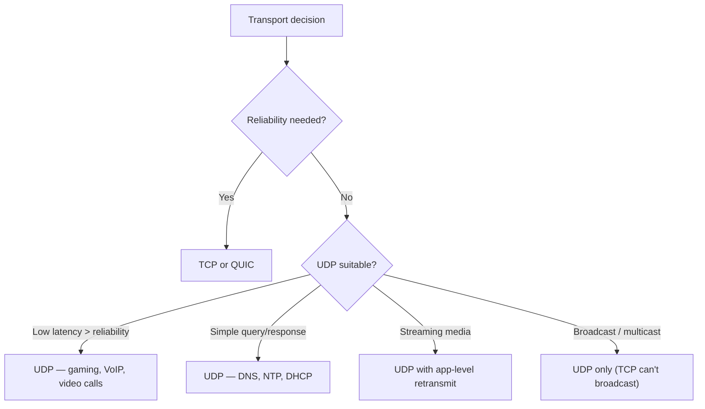
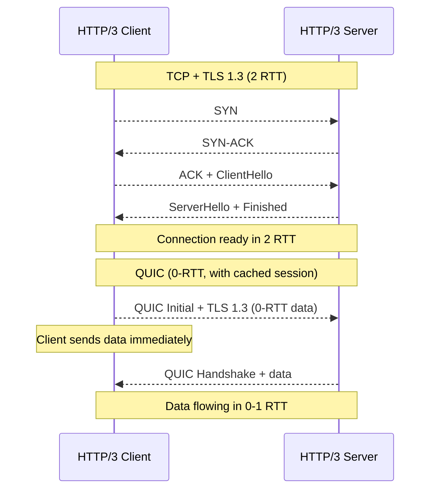

# UDP and QUIC

> [!summary] Goal
> Understand UDP (connectionless, fast, unreliable) and QUIC (UDP-based modern transport for HTTP/3). Compare with TCP, learn when to use each, and how to verify with commands.

## Table of Contents

1. [UDP Header Structure](#udp-header-structure)
2. [When to Use UDP](#when-to-use-udp)
3. [UDP vs TCP Comparison](#udp-vs-tcp-comparison)
4. [QUIC — Quick UDP Internet Connections](#quic-quick-udp-internet-connections)
5. [Multicast and Broadcast](#multicast-and-broadcast)
6. [Verification Commands](#verification-commands)
7. [Pitfalls](#pitfalls)

---

## UDP Header Structure

> [!info] UDP
> UDP (User Datagram Protocol) is a minimal, connectionless transport protocol. It provides **best-effort delivery** — no handshake, no retransmission, no ordering guarantees, no flow control. What you send is what the receiver gets — or not. The header is only 8 bytes (vs 20+ for TCP).

```text
 0                   1                   2                   3
 0 1 2 3 4 5 6 7 8 9 0 1 2 3 4 5 6 7 8 9 0 1 2 3 4 5 6 7 8 9 0 1
+-+-+-+-+-+-+-+-+-+-+-+-+-+-+-+-+-+-+-+-+-+-+-+-+-+-+-+-+-+-+-+-+
|          Source Port          |       Destination Port        |
+-+-+-+-+-+-+-+-+-+-+-+-+-+-+-+-+-+-+-+-+-+-+-+-+-+-+-+-+-+-+-+-+
|            Length             |            Checksum           |
+-+-+-+-+-+-+-+-+-+-+-+-+-+-+-+-+-+-+-+-+-+-+-+-+-+-+-+-+-+-+-+-+
|                          Data                                 |
+-+-+-+-+-+-+-+-+-+-+-+-+-+-+-+-+-+-+-+-+-+-+-+-+-+-+-+-+-+-+-+-+
```

| Field | Size | Description |
|-------|:----:|-------------|
| **Source Port** | 16 bits | Identifies sending application (optional, 0 if unused) |
| **Destination Port** | 16 bits | Identifies receiving application |
| **Length** | 16 bits | Header + data length (min 8, max 65535) |
| **Checksum** | 16 bits | Error detection (optional in IPv4, mandatory in IPv6) |

---

## When to Use UDP



### Common UDP applications

| Application | Port | Why UDP |
|-------------|:----:|---------|
| **DNS** | 53 | Single query/response; retry if no response; TCP fallback for large responses |
| **DHCP** | 67/68 | Broadcast nature (client has no IP yet) |
| **NTP** | 123 | Time synchronization; occasional packet loss acceptable |
| **VoIP (SIP/RTP)** | 5060/audio | Real-time audio needs low latency; retransmitted audio is useless |
| **Video streaming** | varies | Can tolerate occasional packet loss; smooth playback > perfect delivery |
| **Online gaming** | varies | Low latency critical; loss recovery at application level |
| **SNMP** | 161/162 | Simple monitoring queries |
| **QUIC** | 443 | UDP-based TCP replacement (HTTP/3) |

---

## UDP vs TCP Comparison

| Aspect | UDP | TCP |
|--------|:---:|:---:|
| **Connection** | Connectionless — no handshake | Connection-oriented — 3-way handshake |
| **Reliability** | ❌ Best-effort (packets may be lost) | ✅ Guaranteed delivery via ACK + retransmit |
| **Ordering** | ❌ No ordering (packets may arrive out of order) | ✅ In-order delivery |
| **Header size** | 8 bytes | 20-60 bytes |
| **Flow control** | ❌ None | ✅ Sliding window |
| **Congestion control** | ❌ None | ✅ Cubic, BBR, Reno, etc. |
| **Data boundary** | Message-oriented (preserves boundaries) | Stream-oriented (no boundaries) |
| **Broadcast** | ✅ Yes (via IP broadcast/multicast) | ❌ No (point-to-point only) |
| **Checksum** | Optional (IPv4) / Mandatory (IPv6) | Mandatory |
| **Use cases** | DNS, VoIP, gaming, streaming, QUIC | Web, email, file transfer, SSH |
| **Latency** | Low (no setup or ACK overhead) | Higher (handshake, ACK wait) |
| **Throughput** | Lower for lossy links | Higher for reliable delivery |

---

## QUIC — Quick UDP Internet Connections

> [!info] QUIC
> QUIC (pronounced "quick") is a transport protocol built on top of UDP, designed by Google and standardized as RFC 9000. It powers HTTP/3. QUIC solves TCP's head-of-line blocking, long handshake, and connection migration problems. Think of it as **TCP, TLS, and HTTP/2 combined and re-engineered over UDP**.



### QUIC benefits over TCP

| Feature | TCP + TLS | QUIC |
|---------|:---------:|:----:|
| **Handshake** | 2-3 RTT | 0-1 RTT (with session resumption) |
| **Head-of-line blocking** | Yes (one lost packet blocks all streams) | No (each stream is independent) |
| **Connection migration** | ❌ (breaks when IP changes) | ✅ (connection ID survives network change) |
| **Encryption** | Separate TLS layer | Built-in (encrypted by default) |
| **Transport** | TCP (kernel space) | UDP (user space — faster to evolve) |
| **Loss recovery** | ACK-based | ACK + more efficient loss detection |
| **Deployability** | Requires OS/kernel updates | Application-level (no OS changes) |

### QUIC connection migration

```text
TCP identifies a connection by (src_ip, src_port, dst_ip, dst_port).
If your phone switches from Wi-Fi to cellular, all TCP connections break.

QUIC uses a Connection ID (64-bit random value).
Switching networks doesn't change the Connection ID.
The connection survives — no reconnect, no interruption.
This is critical for mobile users.
```

---

## Multicast and Broadcast

> [!info] Broadcast
> A packet sent to **all hosts on a subnet**. Destination IP: the subnet's broadcast address (e.g., 192.168.1.255 for 192.168.1.0/24). Dest MAC: FF:FF:FF:FF:FF:FF. Routers typically don't forward broadcasts. Used by ARP, DHCP, and NetBIOS.

> [!info] Multicast
> A packet sent to a **group of interested hosts**, not all hosts. Uses Class D addresses (224.0.0.0/4). Hosts join a multicast group using IGMP. Routers forward multicast only to subnets that have interested receivers. Used for: streaming video (IPTV), real-time data feeds, service discovery.

| Feature | Unicast | Broadcast | Multicast |
|---------|:-------:|:---------:|:---------:|
| **Receivers** | One | All on subnet | Subscribed members |
| **Scope** | Global | Local subnet | Global (with routing) |
| **TCP support** | ✅ Yes | ❌ No | ❌ No |
| **UDP support** | ✅ Yes | ✅ Yes | ✅ Yes |
| **Router forwarding** | Always | Never (by default) | Conditional (IGMP) |
| **Example** | HTTP to a server | ARP discovery | IPTV channel |

---

## Verification Commands

### Linux

```bash
# Socket statistics for UDP
ss -uan                          # All UDP sockets
ss -uapn                         # UDP with process info
netstat -uan                     # Traditional alternative

# DNS over UDP (verify with +notcp)
dig +notcp google.com            # Query using UDP (default)
dig google.com                   # Falls back to TCP if response > 512 bytes

# UDP connectivity test
nc -u server 5000                # Send UDP data to server:5000
nc -u -l 5000                    # Listen for UDP on port 5000

# Packet capture for UDP
tcpdump -i any 'udp port 53'     # Capture DNS traffic
tcpdump -i any udp               # All UDP traffic

# Bandwidth test over UDP
iperf3 -c server -u -b 100M     # UDP client, 100 Mbps target
iperf3 -s                        # UDP server

# Multicast
ip maddr                         # Show multicast memberships
ss -uan 'src :1900'             # SSDP (UPnP) discovery

# QUIC / HTTP/3
nghttp -u https://example.com   # HTTP/3 test (direct)
curl --http3 https://example.com # HTTP/3 test (curl with quiche)
```

### Windows

```powershell
netstat -uan                     # UDP connections
Get-NetUDPEndpoint               # UDP endpoints
Test-NetConnection -ComputerName server -Port 5000 -Udp  # UDP test
```

---

## Pitfalls

### Assuming UDP is "fire and forget"

Just because UDP doesn't guarantee delivery doesn't mean you should ignore packet loss. For loss-sensitive applications, implement application-level: sequence numbers, retransmission, ACKs, and timeout. The application must provide whatever reliability it needs.

### UDP checksum disabled

UDP checksums are optional in IPv4 (always used in IPv6). Disabling checksums can lead to corrupted data being delivered without detection. In IPv6, checksums are mandatory. Always leave checksums enabled.

### Large UDP packets and fragmentation

UDP datagrams larger than the path MTU (~1500 bytes on Ethernet) are **fragmented**. If any fragment is lost, the entire datagram is lost. DNS typically limits UDP responses to 512 bytes (EDNS0 extends to 4096). Application protocols should avoid UDP datagrams > MTU, or implement their own segmentation.

### QUIC is not faster in all scenarios

QUIC's benefits (0-RTT, connection migration) shine for mobile users and new connections. For long-lived connections on stable networks, TCP's kernel-level implementation can be as fast or faster. QUIC also uses more CPU (user-space encryption). Test your specific workload before switching.

---

> [!question]- Interview Questions
>
> **Q: What is the main difference between UDP and TCP?**
> A: TCP is connection-oriented, reliable, ordered, and has flow/congestion control. UDP is connectionless, unreliable, unordered, and has no control mechanisms. TCP is like a phone call (connect, talk reliably, hang up). UDP is like sending a postcard (cheap, fast, may get lost).
>
> **Q: When would you choose UDP over TCP?**
> A: (1) When low latency matters more than reliability (VoIP, gaming, video calls). (2) For simple query-response protocols (DNS, NTP). (3) When broadcast/multicast is needed (ARP, DHCP). (4) When you want to implement reliability at the application level (custom protocol, QUIC).
>
> **Q: What is QUIC and how does it improve on TCP?**
> A: QUIC is a transport protocol over UDP that powers HTTP/3. It solves TCP's head-of-line blocking (one lost packet doesn't block other streams), reduces handshake latency (0-RTT resumption), and supports connection migration (survives IP changes). It also has encryption built in, not added later.
>
> **Q: What is the UDP checksum and when is it optional?**
> A: The UDP checksum detects corruption in the header and data. In IPv4, it's optional (if set to 0, no checksum). In IPv6, it's mandatory. Disabling it risks delivering corrupted data without detection. Always leave it enabled.
>
> **Q: How does QUIC handle connection migration?**
> A: QUIC identifies connections by a Connection ID, not by (IP, port). When a client switches networks (e.g., Wi-Fi to cellular), the IP changes but the Connection ID doesn't. Packets are routed to the new IP and the connection continues uninterrupted. TCP would need to re-establish all connections.

---

## Cross-Links

- [[Networking/01_Foundations/04_TCP_Deep_Dive]] for TCP vs UDP comparison
- [[Networking/02_Core/02_HTTP_1_1_HTTP_2_HTTP_3]] for HTTP/3 and QUIC
- [[Networking/01_Foundations/03_ARP_ICMP_and_DHCP]] for DHCP over UDP
- [[Networking/02_Core/01_DNS_Deep_Dive]] for DNS over UDP/TCP
- [[Networking/03_Advanced/05_Congestion_and_QoS]] for UDP QoS considerations
