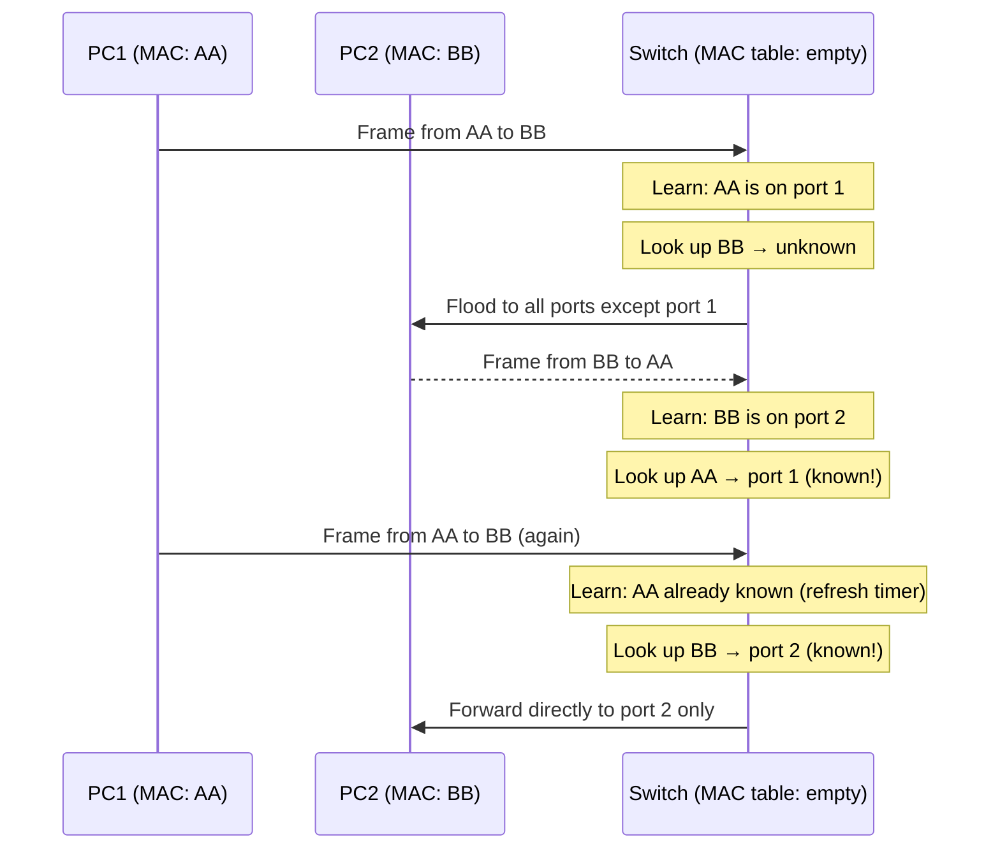

# Ethernet, Switching, and VLANs

> [!summary] Goal
> Understand Ethernet frame structure, how switches learn MAC addresses and forward frames, VLAN segmentation, Spanning Tree Protocol, and link aggregation. Master Layer 2 networking — the foundation all higher layers depend on.

## Table of Contents

1. [Ethernet Frame Structure](#ethernet-frame-structure)
2. [Switch MAC Learning and Forwarding](#switch-mac-learning-and-forwarding)
3. [VLANs (802.1Q)](#vlans)
4. [Spanning Tree Protocol (STP)](#spanning-tree-protocol)
5. [Link Aggregation (LACP)](#link-aggregation)
6. [Verification Commands](#verification-commands)
7. [Pitfalls](#pitfalls)

---

## Ethernet Frame Structure

> [!info] Ethernet frame
> The Ethernet frame is the PDU at Layer 2 (Data Link layer). It encapsulates the IP packet and adds MAC source/destination addresses, type field, and a Frame Check Sequence (FCS) for error detection.

```text
 0                   1                   2                   3
 0 1 2 3 4 5 6 7 8 9 0 1 2 3 4 5 6 7 8 9 0 1 2 3 4 5 6 7 8 9 0 1
+-+-+-+-+-+-+-+-+-+-+-+-+-+-+-+-+-+-+-+-+-+-+-+-+-+-+-+-+-+-+-+-+
|           Destination MAC (first 4 bytes)                    |
+-+-+-+-+-+-+-+-+-+-+-+-+-+-+-+-+-+-+-+-+-+-+-+-+-+-+-+-+-+-+-+-+
|     Dest MAC (last 2 bytes)  |      Source MAC (first 4)     |
+-+-+-+-+-+-+-+-+-+-+-+-+-+-+-+-+-+-+-+-+-+-+-+-+-+-+-+-+-+-+-+-+
|           Source MAC (last 2 bytes)          |  EtherType    |
+-+-+-+-+-+-+-+-+-+-+-+-+-+-+-+-+-+-+-+-+-+-+-+-+-+-+-+-+-+-+-+-+
|                       Payload (IP packet)                    |
|                       46-1500 bytes                           |
+-+-+-+-+-+-+-+-+-+-+-+-+-+-+-+-+-+-+-+-+-+-+-+-+-+-+-+-+-+-+-+-+
|                    Frame Check Sequence (4 bytes)             |
+-+-+-+-+-+-+-+-+-+-+-+-+-+-+-+-+-+-+-+-+-+-+-+-+-+-+-+-+-+-+-+-+
```

| Field | Size | Description |
|-------|:----:|-------------|
| **Preamble** | 7 bytes | Synchronization (not part of the frame) |
| **SFD** | 1 byte | Start Frame Delimiter |
| **Destination MAC** | 6 bytes | Target NIC address |
| **Source MAC** | 6 bytes | Sender NIC address |
| **EtherType** | 2 bytes | Payload type (0x0800 = IPv4, 0x86DD = IPv6, 0x0806 = ARP) |
| **Payload** | 46-1500 bytes | IP packet (or other Layer 3 data). 1500 = standard MTU |
| **FCS** | 4 bytes | CRC-32 checksum (frame integrity) |
| **Interframe gap** | 12 bytes | Minimum gap between frames |

### MAC addresses

> [!info] MAC address
> A 48-bit hardware address assigned to each NIC by the manufacturer. Format: 6 pairs of hex digits (00:1A:2B:3C:4D:5E). The first 3 bytes (24 bits) identify the manufacturer (OUI — Organizationally Unique Identifier). The last 3 bytes are the device-specific serial number.

```bash
# Check your MAC addresses
ip link show                     # Linux: look for "link/ether"
ip addr show | grep ether       # Alternative
ethtool -P eth0                  # Print permanent MAC address

# OUI lookup (identify manufacturer from MAC)
curl http://macvendors.co/api/00:1A:2B:3C:4D:5E/type  # Returns manufacturer
```

### Common EtherTypes

| EtherType | Protocol |
|:---------:|----------|
| 0x0800 | IPv4 |
| 0x0806 | ARP |
| 0x8100 | VLAN-tagged frame (802.1Q) |
| 0x86DD | IPv6 |
| 0x8809 | LACP/Link Aggregation |
| 0x8847 | MPLS unicast |
| 0x8864 | PPPoE |

---

## Switch MAC Learning and Forwarding

> [!info] MAC learning
> Switches learn which MAC addresses are on which ports by examining the source MAC of incoming frames. They build a MAC address table. When a frame arrives, the switch looks up the destination MAC: known → forward only to that port; unknown → flood to all ports (except the source).



### MAC address table aging

```bash
# Show MAC address table on Linux bridge
bridge fdb show                  # Show forwarding database
bridge fdb show br0              # Bridge-specific MAC table
bridge fdb show | grep -v permanent  # Show learned (dynamic) entries

# Check aging timer
sysctl net.ipv4.neigh.default.gc_stale_time  # Typically 60 seconds

# MAC table size
sysctl net.bridge.bridge-nf-call-iptables     # Bridge netfilter settings
```

---

## VLANs (802.1Q)

> [!info] VLAN (Virtual LAN)
> A VLAN segments a physical switch into multiple logical networks. Traffic in one VLAN doesn't reach another VLAN without a router (inter-VLAN routing). This reduces broadcast domains and improves security. VLANs are identified by a 12-bit VLAN ID (0-4095, 1-4094 usable).

```mermaid
flowchart TD
    subgraph SW["Physical Switch"]
        subgraph V10["VLAN 10: Engineering"]
            P1["Port 1: PC1"]
            P2["Port 2: PC2"]
        end
        subgraph V20["VLAN 20: Marketing"]
            P3["Port 3: PC3"]
            P4["Port 4: PC4"]
        end
        subgraph TRUNK["Trunk port (to router)"]
            P5["Port 5: Tagged VLAN 10,20"]
        end
    end
    note for SW "PC1 and PC2 can communicate<br/>PC3 and PC4 can communicate<br/>PC1 cannot reach PC3 without a router"
```

### Access vs Trunk ports

| Port type | Traffic | Use case |
|-----------|---------|----------|
| **Access** | Untagged (single VLAN) | End devices (PCs, printers, servers) |
| **Trunk** | Tagged with 802.1Q header | Between switches, to routers/firewalls |

### 802.1Q tag

```text
The 802.1Q header is inserted between Source MAC and EtherType:
  TPID (2 bytes): 0x8100 (marks the frame as VLAN-tagged)
  Priority (3 bits): QoS class (0-7)
  DEI (1 bit): Drop Eligible Indicator
  VID (12 bits): VLAN ID (1-4094)

The original EtherType moves AFTER the 802.1Q tag.
Tagged frame is 4 bytes longer than untagged (needs MTU consideration).
```

### Linux VLAN configuration

```bash
# Create VLAN interface on Linux
ip link add link eth0 name eth0.10 type vlan id 10
ip link set eth0.10 up
ip addr add 192.168.10.1/24 dev eth0.10

# Bridge with VLAN
ip link add br0 type bridge
ip link set eth0.10 master br0
bridge vlan show                # Show VLAN membership per port

# Verify VLAN tags
tcpdump -i eth0 -e vlan          # Capture with VLAN headers
tcpdump -i any 'vlan 10'        # Filter by VLAN ID
```

---

## Spanning Tree Protocol (STP)

> [!info] STP (Spanning Tree Protocol)
> STP prevents **bridging loops** in redundant switch topologies. Without STP, loops cause broadcast storms, MAC table instability, and duplicate frames. STP elects a Root Bridge, selects Root Ports and Designated Ports, and blocks other ports to create a loop-free tree. If a link fails, STP recalculates and unblocks an alternate path.

```mermaid
flowchart TD
    subgraph Before["Without STP — Loop!"]
        SW1["Switch 1"] <--> SW2["Switch 2"]
        SW1 <--> SW3["Switch 3"]
        SW2 <--> SW3
    end
    subgraph After["With STP — Tree"]
        S1["Switch 1 (Root)"] --- S2["Switch 2"]
        S1 --- S3["Switch 3"]
        S2 -.- S3["Blocked"]
    end
    note for Before "Broadcast frames loop endlessly"
    note for After "STP blocks one link → no loop"
```

### STP port states

| State | Purpose | Time |
|-------|---------|:----:|
| **Blocking** | Not forwarding (loop prevention) | Until topology change |
| **Listening** | Listening for BPDUs, no forwarding | 15 seconds |
| **Learning** | Learning MACs, no forwarding | 15 seconds |
| **Forwarding** | Normal operation | — |
| **Disabled** | Administratively down | — |

### RSTP (Rapid STP)

```bash
# RSTP (802.1w) reduces convergence from ~50s to ~3-5s
# Edge ports (access ports with no bridges) skip listening/learning
# Use on Linux:
bridge link set dev eth0 guard_root on      # Root guard
bridge link set dev eth0 bpdu_guard on      # BPDU guard
bridge link set dev eth0 port_fast on       # Edge port (skip STP states)
```

---

## Link Aggregation (LACP)

> [!info] LACP (Link Aggregation Control Protocol)
> LACP combines multiple physical links into a single logical link. Increases bandwidth (2×1 Gbps = 2 Gbps) and provides redundancy (if one link fails, traffic uses the others). Uses EtherType 0x8809. The peer must also support LACP.

```bash
# Linux teaming / bonding
ip link add bond0 type bond mode 802.3ad     # LACP mode
ip link set eth0 master bond0
ip link set eth1 master bond0
ip link set bond0 up
ip addr add 192.168.1.10/24 dev bond0

# Check LACP status
cat /proc/net/bonding/bond0                  # Show bond status
ip -s link show bond0                        # Traffic per link
```

---

## Verification Commands

### Linux

```bash
# Interfaces and links
ip link show                     # All interfaces (state, MAC, MTU)
ethtool eth0                     # Link speed, duplex, auto-negotiation
ethtool -S eth0                  # Detailed statistics (packets, drops, errors)
ethtool -k eth0                  # Offload capabilities
ip -s link show eth0             # Traffic statistics

# MAC address table (on Linux bridge)
bridge fdb show                  # Forwarding database (MAC table)
bridge fdb show br0              # Per-bridge MAC table
bridge fdb show | grep -v permanent # Dynamic (learned) entries only

# VLAN
bridge vlan show                 # VLAN membership per port
ip link show type vlan           # VLAN interfaces

# STP
bridge stp                       # STP status per bridge

# ARP (MAC ↔ IP mapping)
ip neigh show                    # Neighbor/ARP cache
arp -a                           # Traditional ARP table

# Monitor traffic at Layer 2
tcpdump -i eth0 -e               # Show MAC addresses
tcpdump -i eth0 -e vlan          # Show VLAN tags
tcpdump -e --direction=in        # Incoming traffic with MACs

# Discover network neighbors
arp-scan 192.168.1.0/24         # Discover all hosts on subnet
```

### Windows

```powershell
Get-NetAdapter                   # List adapters, speed, MAC
Get-NetAdapterStatistics         # Traffic stats per adapter
Get-NetAdapter -Name * -phys | select Name, MacAddress, LinkSpeed, Status
Get-NetNeighbor                 # ARP/ND cache (MAC table)
arp /a                          # Traditional ARP table
```

---

## Pitfalls

### Switch loop without STP

If you connect two switches with two cables without STP enabled, a broadcast frame loops infinitely between them. All switch CPU is consumed forwarding the loop, and no real traffic can pass. Always enable STP (or RSTP) on any port that connects to another switch.

### MTU issues with VLAN tagging

VLAN tags add 4 bytes to the frame. If the physical interface MTU is 1500, VLAN-tagged frames of 1500 bytes payload will be too large (1500 + 4 + 14 + 4 = 1522). Most modern switches support "baby giant" frames (1522 bytes), but some configurations need MTU adjusted to 1504 on trunk ports.

### Forgetting to configure trunk allowed VLANs

By default, all VLANs are allowed on a trunk. This is a security risk — a host in VLAN 100 shouldn't receive broadcasts from VLAN 200. Always explicitly restrict:

```bash
bridge vlan del dev eth0 vid 100-4094  # Remove all default VLANs
bridge vlan add dev eth0 vid 10        # Add only needed VLANs
```

### MAC flapping between ports

If the same MAC address appears on different switch ports within seconds, the switch logs a "MAC flap" warning. This often indicates a bridging loop (without STP) or a misconfigured NIC team.

---

> [!question]- Interview Questions
>
> **Q: How does a switch learn which MAC address is on which port?**
> A: When a frame arrives on a port, the switch reads the source MAC address and associates it with that port in its MAC address table (forwarding database). Future frames destined for that MAC are forwarded only to that port. Entries age out (typically 300 seconds) if no traffic is seen.
>
> **Q: What is the difference between an access port and a trunk port?**
> A: An access port carries traffic for a single VLAN (untagged). A trunk port carries traffic for multiple VLANs (tagged with 802.1Q headers). Access ports connect to end devices. Trunks connect switches to each other or to routers/firewalls.
>
> **Q: What does STP do and why is it needed?**
> A: STP prevents bridging loops in redundant switch topologies. It elects a root bridge and blocks redundant ports to create a loop-free logical tree. If an active link fails, STP recalculates and unblocks an alternative port. Without STP, loops cause broadcast storms and network collapse.
>
> **Q: What is a VLAN and why would you use it?**
> A: A VLAN (Virtual LAN) segments a physical switch into multiple isolated broadcast domains. VLANs improve security (different departments can't see each other's traffic), reduce broadcast scope, and simplify network management (logical grouping independent of physical location).
>
> **Q: What is LACP and how does it work?**
> A: LACP (802.3ad) combines multiple physical links into a single logical link (bond/team). It provides increased bandwidth (additive) and redundancy (automatic failover). Both ends exchange LACP frames (EtherType 0x8809) to negotiate the aggregation. If one physical link fails, traffic uses the remaining ones.

---

## Cross-Links

- [[Networking/01_Foundations/01_OSI_and_TCP_IP_Model]] for layer 2 in the OSI model
- [[Networking/01_Foundations/03_ARP_ICMP_and_DHCP]] for ARP ↔ MAC relationship
- [[Networking/01_Foundations/02_IP_Addressing_and_Subnetting]] for IP ↔ VLAN mapping
- [[Networking/03_Advanced/03_Netns_and_Container_Networking]] for virtual switching (veth, bridge)
- [[Networking/03_Advanced/01_Routing_BGP_OSPF]] for inter-VLAN routing
